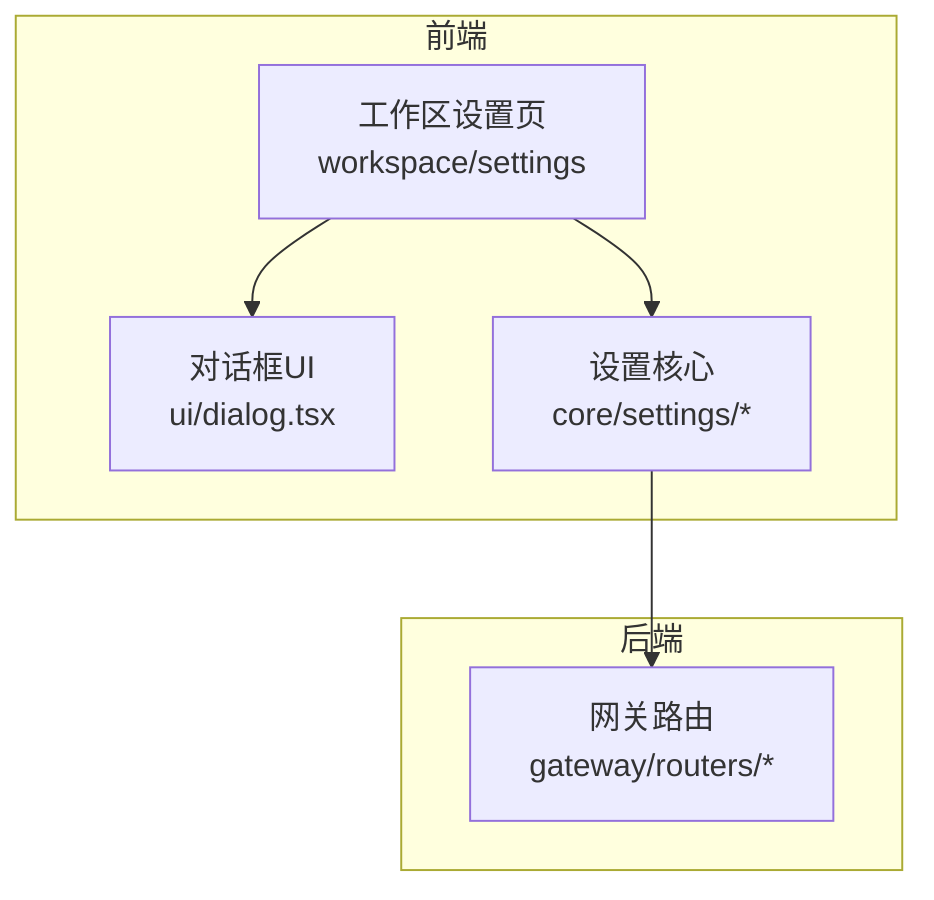
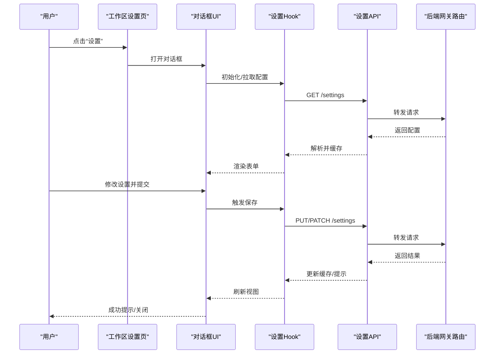
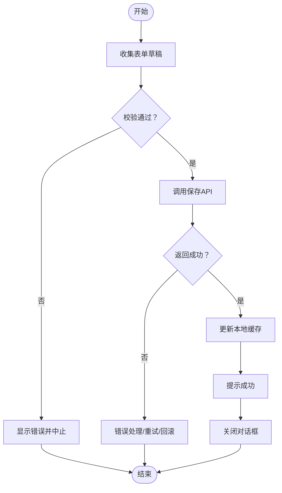
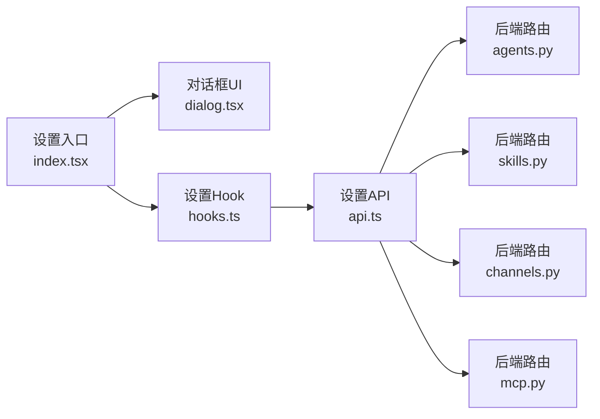

# 设置对话框组件

<cite>
**本文引用的文件**   
- [frontend/src/components/workspace/settings/index.tsx](file://frontend/src/components/workspace/settings/index.tsx)
- [frontend/src/components/workspace/settings/model-settings.tsx](file://frontend/src/components/workspace/settings/model-settings.tsx)
- [frontend/src/components/workspace/settings/memory-settings.tsx](file://frontend/src/components/workspace/settings/memory-settings.tsx)
- [frontend/src/components/workspace/settings/skills-settings.tsx](file://frontend/src/components/workspace/settings/skills-settings.tsx)
- [frontend/src/components/workspace/settings/mcp-settings.tsx](file://frontend/src/components/workspace/settings/mcp-settings.tsx)
- [frontend/src/components/ui/dialog.tsx](file://frontend/src/components/ui/dialog.tsx)
- [frontend/src/core/settings/api.ts](file://frontend/src/core/settings/api.ts)
- [frontend/src/core/settings/hooks.ts](file://frontend/src/core/settings/hooks.ts)
- [frontend/src/core/settings/types.ts](file://frontend/src/core/settings/types.ts)
- [backend/app/gateway/routers/agents.py](file://backend/app/gateway/routers/agents.py)
- [backend/app/gateway/routers/channels.py](file://backend/app/gateway/routers/channels.py)
- [backend/app/gateway/routers/mcp.py](file://backend/app/gateway/routers/mcp.py)
- [backend/app/gateway/routers/skills.py](file://backend/app/gateway/routers/skills.py)
- [backend/app/gateway/config.py](file://backend/app/gateway/config.py)
</cite>

## 目录
1. [简介](#简介)
2. [项目结构](#项目结构)
3. [核心组件](#核心组件)
4. [架构总览](#架构总览)
5. [详细组件分析](#详细组件分析)
6. [依赖关系分析](#依赖关系分析)
7. [性能与体验优化](#性能与体验优化)
8. [故障排查指南](#故障排查指南)
9. [结论](#结论)
10. [附录：API 参考](#附录api-参考)

## 简介
本文件面向前端“设置”模态框（对话框）组件，系统性阐述其实现与最佳实践，覆盖以下方面：
- 打开/关闭逻辑与状态管理
- 表单验证机制
- 配置数据的持久化方案（本地存储与服务器同步）
- 响应式设计与用户体验优化
- 设置项的动态加载与懒加载策略
- 实际应用场景与代码示例路径

该组件位于前端工作区设置模块中，通过 UI 层、状态与数据层、后端网关路由协同完成配置的读取、编辑与保存。

## 项目结构
设置相关的前端代码主要分布在如下位置：
- 工作区设置页面与子面板：frontend/src/components/workspace/settings/*
- 通用对话框 UI 组件：frontend/src/components/ui/dialog.tsx
- 设置数据访问与 Hook：frontend/src/core/settings/*
- 后端网关路由（配置读写入口）：backend/app/gateway/routers/*

图表来源
- [frontend/src/components/workspace/settings/index.tsx](file://frontend/src/components/workspace/settings/index.tsx)
- [frontend/src/components/ui/dialog.tsx](file://frontend/src/components/ui/dialog.tsx)
- [frontend/src/core/settings/api.ts](file://frontend/src/core/settings/api.ts)
- [backend/app/gateway/routers/agents.py](file://backend/app/gateway/routers/agents.py)

章节来源
- [frontend/src/components/workspace/settings/index.tsx](file://frontend/src/components/workspace/settings/index.tsx)
- [frontend/src/components/ui/dialog.tsx](file://frontend/src/components/ui/dialog.tsx)
- [frontend/src/core/settings/api.ts](file://frontend/src/core/settings/api.ts)
- [backend/app/gateway/routers/agents.py](file://backend/app/gateway/routers/agents.py)

## 核心组件
- 设置主入口与标签页容器：负责聚合模型、记忆、技能、MCP 等设置面板，并控制对话框的显示与隐藏。
- 模型设置面板：提供模型选择、参数调整等能力。
- 记忆设置面板：提供记忆开关、容量、策略等选项。
- 技能设置面板：提供技能启用/禁用、版本管理等。
- MCP 设置面板：提供 MCP 服务连接、鉴权等配置。
- 对话框 UI 组件：封装打开/关闭、遮罩、键盘事件、焦点管理等基础行为。
- 设置核心（API/Hook/类型）：统一的数据获取、提交、缓存与类型定义。

章节来源
- [frontend/src/components/workspace/settings/index.tsx](file://frontend/src/components/workspace/settings/index.tsx)
- [frontend/src/components/workspace/settings/model-settings.tsx](file://frontend/src/components/workspace/settings/model-settings.tsx)
- [frontend/src/components/workspace/settings/memory-settings.tsx](file://frontend/src/components/workspace/settings/memory-settings.tsx)
- [frontend/src/components/workspace/settings/skills-settings.tsx](file://frontend/src/components/workspace/settings/skills-settings.tsx)
- [frontend/src/components/workspace/settings/mcp-settings.tsx](file://frontend/src/components/workspace/settings/mcp-settings.tsx)
- [frontend/src/components/ui/dialog.tsx](file://frontend/src/components/ui/dialog.tsx)
- [frontend/src/core/settings/api.ts](file://frontend/src/core/settings/api.ts)
- [frontend/src/core/settings/hooks.ts](file://frontend/src/core/settings/hooks.ts)
- [frontend/src/core/settings/types.ts](file://frontend/src/core/settings/types.ts)

## 架构总览
设置对话框采用“UI 层 + 状态/数据层 + 后端网关”的分层架构。UI 层仅负责展示与交互；状态/数据层负责请求、缓存、校验与错误处理；后端网关暴露统一的配置接口。

图表来源
- [frontend/src/components/workspace/settings/index.tsx](file://frontend/src/components/workspace/settings/index.tsx)
- [frontend/src/components/ui/dialog.tsx](file://frontend/src/components/ui/dialog.tsx)
- [frontend/src/core/settings/hooks.ts](file://frontend/src/core/settings/hooks.ts)
- [frontend/src/core/settings/api.ts](file://frontend/src/core/settings/api.ts)
- [backend/app/gateway/routers/agents.py](file://backend/app/gateway/routers/agents.py)

## 详细组件分析

### 对话框打开/关闭与状态管理
- 打开/关闭逻辑
  - 由工作区设置页控制对话框可见性，通常基于布尔状态或受控属性。
  - 对话框 UI 组件内部处理 ESC 关闭、点击遮罩关闭、焦点陷阱等。
- 状态管理
  - 使用 React 状态或全局状态库维护“是否打开”、“当前标签页”、“表单草稿”等。
  - 打开时从 Hook/API 拉取最新配置，写入本地草稿；关闭时可选择丢弃草稿或自动保存。
- 生命周期
  - 打开：初始化表单、预填充默认值、按需懒加载子面板数据。
  - 关闭：清理副作用（如定时器、监听器）、重置滚动位置与焦点。

章节来源
- [frontend/src/components/workspace/settings/index.tsx](file://frontend/src/components/workspace/settings/index.tsx)
- [frontend/src/components/ui/dialog.tsx](file://frontend/src/components/ui/dialog.tsx)

### 表单验证机制
- 校验时机
  - 失焦校验：输入框失去焦点时即时反馈。
  - 提交前校验：阻止非法提交并高亮错误字段。
- 校验规则
  - 必填、格式（URL、邮箱、正则）、范围（数值上下限）、唯一性（名称冲突）。
- 错误呈现
  - 字段级错误消息、顶部汇总提示、可聚焦的错误导航。
- 防抖与节流
  - 对频繁触发的校验进行防抖，避免重复网络请求与重渲染。

章节来源
- [frontend/src/components/workspace/settings/model-settings.tsx](file://frontend/src/components/workspace/settings/model-settings.tsx)
- [frontend/src/components/workspace/settings/memory-settings.tsx](file://frontend/src/components/workspace/settings/memory-settings.tsx)
- [frontend/src/components/workspace/settings/skills-settings.tsx](file://frontend/src/components/workspace/settings/skills-settings.tsx)
- [frontend/src/components/workspace/settings/mcp-settings.tsx](file://frontend/src/components/workspace/settings/mcp-settings.tsx)

### 配置数据的持久化与同步
- 本地存储
  - 草稿态：在对话框内使用内存状态暂存未提交的变更。
  - 持久化：可选将草稿落盘到 localStorage/sessionStorage，用于恢复上次编辑状态。
- 服务器同步
  - 读取：进入设置时调用 API 获取服务端配置。
  - 保存：提交后调用 API 持久化至后端，成功后更新缓存与视图。
  - 冲突处理：若后端返回版本戳或时间戳，前端需合并差异或提示冲突。
- 离线与降级
  - 无网络时允许本地编辑并提示“离线模式”，网络恢复后重试同步。

章节来源
- [frontend/src/core/settings/api.ts](file://frontend/src/core/settings/api.ts)
- [frontend/src/core/settings/hooks.ts](file://frontend/src/core/settings/hooks.ts)
- [backend/app/gateway/routers/agents.py](file://backend/app/gateway/routers/agents.py)

### 响应式设计与用户体验优化
- 布局适配
  - 移动端以抽屉或全屏面板形式展示，桌面端以居中模态框展示。
- 交互细节
  - 键盘可达性（Tab 顺序、Esc 关闭、Enter 提交）、焦点管理、无障碍标签。
- 视觉反馈
  - 加载中骨架屏、成功/失败 Toast、确认二次弹窗（危险操作）。
- 性能优化
  - 大列表虚拟滚动、分页/无限加载、图片懒加载。

章节来源
- [frontend/src/components/ui/dialog.tsx](file://frontend/src/components/ui/dialog.tsx)
- [frontend/src/components/workspace/settings/index.tsx](file://frontend/src/components/workspace/settings/index.tsx)

### 动态加载与懒加载
- 动态加载
  - 根据用户权限或环境动态生成设置项（例如某些高级功能仅在特定部署可用）。
- 懒加载
  - 切换标签页时再加载对应面板数据，减少首屏开销。
- 增量更新
  - 长列表采用增量更新与去抖动合并，避免频繁全量刷新。

章节来源
- [frontend/src/components/workspace/settings/index.tsx](file://frontend/src/components/workspace/settings/index.tsx)
- [frontend/src/core/settings/hooks.ts](file://frontend/src/core/settings/hooks.ts)

### 关键流程图：保存设置

图表来源
- [frontend/src/core/settings/hooks.ts](file://frontend/src/core/settings/hooks.ts)
- [frontend/src/core/settings/api.ts](file://frontend/src/core/settings/api.ts)

## 依赖关系分析
- 组件耦合
  - 工作区设置页依赖对话框 UI 与设置 Hook；各子面板依赖 Hook 提供的数据与动作。
- 外部依赖
  - 网络请求：通过设置 API 层统一封装，便于拦截、重试与错误上报。
  - 后端路由：网关路由按领域拆分（代理、通道、技能、MCP），职责清晰。
- 潜在循环依赖
  - 确保 UI 不直接依赖后端，仅通过 Hook/API 通信，避免循环引用。

图表来源
- [frontend/src/components/workspace/settings/index.tsx](file://frontend/src/components/workspace/settings/index.tsx)
- [frontend/src/components/ui/dialog.tsx](file://frontend/src/components/ui/dialog.tsx)
- [frontend/src/core/settings/hooks.ts](file://frontend/src/core/settings/hooks.ts)
- [frontend/src/core/settings/api.ts](file://frontend/src/core/settings/api.ts)
- [backend/app/gateway/routers/agents.py](file://backend/app/gateway/routers/agents.py)
- [backend/app/gateway/routers/skills.py](file://backend/app/gateway/routers/skills.py)
- [backend/app/gateway/routers/channels.py](file://backend/app/gateway/routers/channels.py)
- [backend/app/gateway/routers/mcp.py](file://backend/app/gateway/routers/mcp.py)

章节来源
- [frontend/src/components/workspace/settings/index.tsx](file://frontend/src/components/workspace/settings/index.tsx)
- [frontend/src/core/settings/hooks.ts](file://frontend/src/core/settings/hooks.ts)
- [frontend/src/core/settings/api.ts](file://frontend/src/core/settings/api.ts)
- [backend/app/gateway/routers/agents.py](file://backend/app/gateway/routers/agents.py)
- [backend/app/gateway/routers/skills.py](file://backend/app/gateway/routers/skills.py)
- [backend/app/gateway/routers/channels.py](file://backend/app/gateway/routers/channels.py)
- [backend/app/gateway/routers/mcp.py](file://backend/app/gateway/routers/mcp.py)

## 性能与体验优化
- 请求优化
  - 并发拉取：多面板数据并行请求，缩短等待时间。
  - 缓存策略：短期缓存配置，避免重复请求；支持失效与选择性刷新。
- 渲染优化
  - 列表虚拟化、分片渲染、React.memo 包裹纯展示组件。
- 交互优化
  - 乐观更新：先更新 UI，失败再回滚；失败重试与退避策略。
- 可观测性
  - 埋点记录关键操作（打开、提交、失败原因），辅助定位问题。

[本节为通用指导，无需列出具体文件来源]

## 故障排查指南
- 常见问题
  - 无法打开对话框：检查受控状态与焦点管理是否正确。
  - 表单不提交：确认校验规则与按钮禁用条件。
  - 保存失败：查看网络拦截日志、后端返回码与错误信息。
  - 配置不同步：核对缓存键、版本号与失效策略。
- 调试建议
  - 开启网络面板过滤设置相关请求。
  - 打印 Hook 的状态变化与副作用执行顺序。
  - 在后端网关路由增加请求日志与异常堆栈。

章节来源
- [frontend/src/core/settings/hooks.ts](file://frontend/src/core/settings/hooks.ts)
- [frontend/src/core/settings/api.ts](file://frontend/src/core/settings/api.ts)
- [backend/app/gateway/config.py](file://backend/app/gateway/config.py)

## 结论
设置对话框组件通过清晰的层次划分与良好的状态管理，实现了可复用、可扩展的配置管理能力。结合本地草稿、服务器同步、懒加载与完善的校验与错误处理，既保证了用户体验，也提升了系统的健壮性与可维护性。建议在后续迭代中持续完善可观测性与自动化测试，进一步提升稳定性与交付效率。

[本节为总结性内容，无需列出具体文件来源]

## 附录：API 参考
- 读取配置
  - 方法：GET
  - 路径：/api/settings
  - 说明：返回当前用户的完整配置对象，供对话框初始化与渲染。
- 保存配置
  - 方法：PUT/PATCH
  - 路径：/api/settings
  - 说明：提交已校验的配置变更，返回更新后的配置或操作结果。
- 错误码
  - 400：请求参数校验失败
  - 401/403：未授权或权限不足
  - 500：服务端异常

章节来源
- [frontend/src/core/settings/api.ts](file://frontend/src/core/settings/api.ts)
- [backend/app/gateway/routers/agents.py](file://backend/app/gateway/routers/agents.py)
- [backend/app/gateway/routers/skills.py](file://backend/app/gateway/routers/skills.py)
- [backend/app/gateway/routers/channels.py](file://backend/app/gateway/routers/channels.py)
- [backend/app/gateway/routers/mcp.py](file://backend/app/gateway/routers/mcp.py)