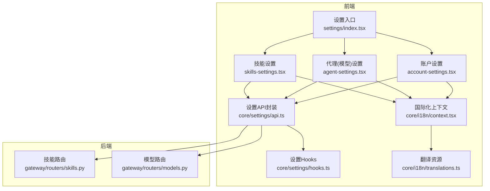
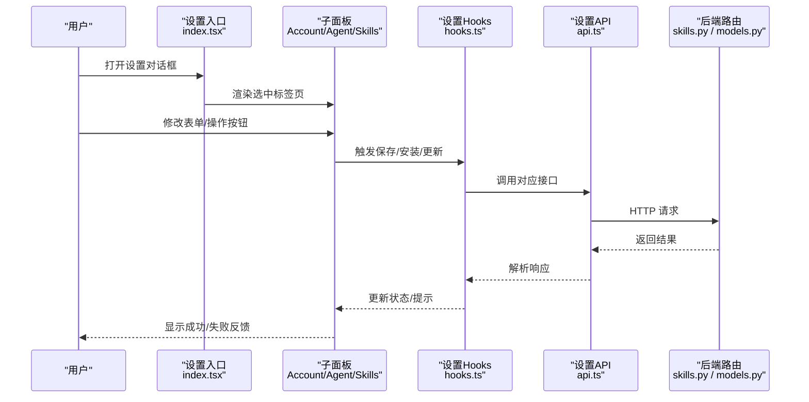
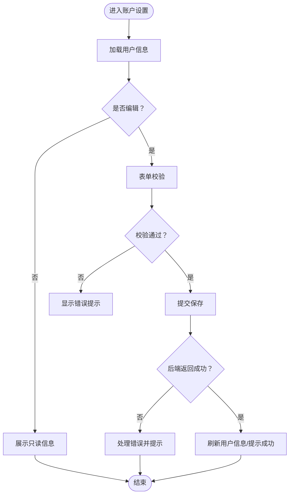
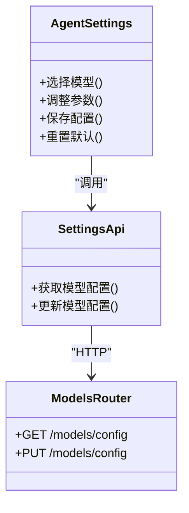
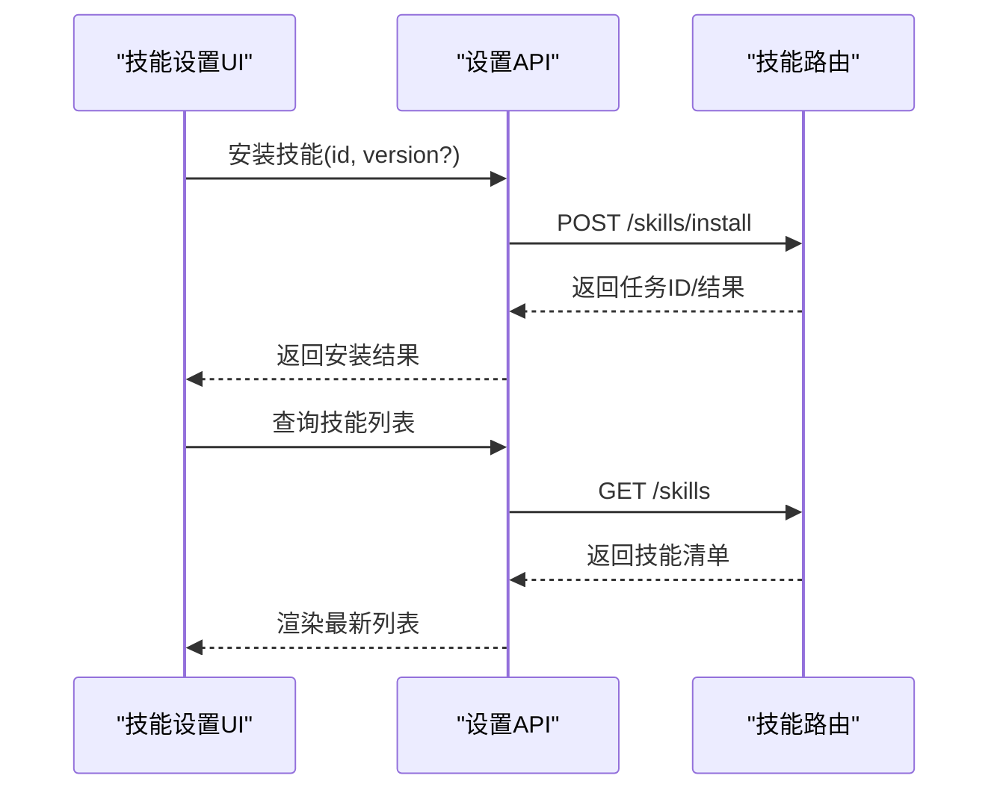
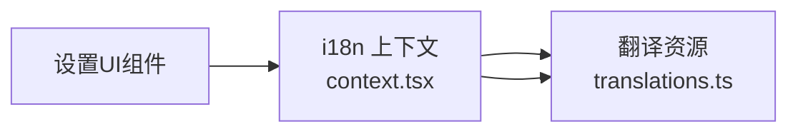
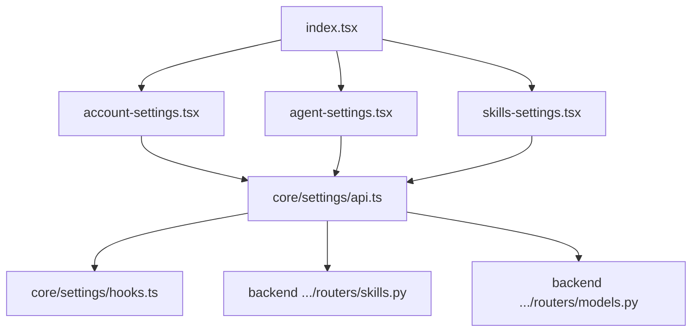

# 设置组件

<cite>
**本文引用的文件**   
- [frontend/src/components/workspace/settings/index.tsx](file://frontend/src/components/workspace/settings/index.tsx)
- [frontend/src/components/workspace/settings/account-settings.tsx](file://frontend/src/components/workspace/settings/account-settings.tsx)
- [frontend/src/components/workspace/settings/agent-settings.tsx](file://frontend/src/components/workspace/settings/agent-settings.tsx)
- [frontend/src/components/workspace/settings/skills-settings.tsx](file://frontend/src/components/workspace/settings/skills-settings.tsx)
- [frontend/src/core/settings/api.ts](file://frontend/src/core/settings/api.ts)
- [frontend/src/core/settings/hooks.ts](file://frontend/src/core/settings/hooks.ts)
- [frontend/src/core/i18n/context.tsx](file://frontend/src/core/i18n/context.tsx)
- [frontend/src/core/i18n/translations.ts](file://frontend/src/core/i18n/translations.ts)
- [backend/app/gateway/routers/skills.py](file://backend/app/gateway/routers/skills.py)
- [backend/app/gateway/routers/models.py](file://backend/app/gateway/routers/models.py)
</cite>

## 目录
1. [简介](#简介)
2. [项目结构](#项目结构)
3. [核心组件](#核心组件)
4. [架构总览](#架构总览)
5. [详细组件分析](#详细组件分析)
6. [依赖分析](#依赖分析)
7. [性能考虑](#性能考虑)
8. [故障排查指南](#故障排查指南)
9. [结论](#结论)
10. [附录](#附录)

## 简介
本文件聚焦 DeerFlow 前端“设置”模块，系统性梳理设置对话框与页面：模态框管理、表单验证、配置持久化、账户设置、代理（模型）设置、技能设置，以及国际化与本地化实现。文档同时提供架构图、时序图与流程图，帮助读者快速理解数据流与控制流，并给出常见问题的定位思路与优化建议。

## 项目结构
设置相关的前端代码主要位于 workspace 下的 settings 子目录，配合 core/settings 的 API 与 hooks 层，后端通过 gateway routers 暴露能力。

图表来源
- [frontend/src/components/workspace/settings/index.tsx](file://frontend/src/components/workspace/settings/index.tsx)
- [frontend/src/components/workspace/settings/account-settings.tsx](file://frontend/src/components/workspace/settings/account-settings.tsx)
- [frontend/src/components/workspace/settings/agent-settings.tsx](file://frontend/src/components/workspace/settings/agent-settings.tsx)
- [frontend/src/components/workspace/settings/skills-settings.tsx](file://frontend/src/components/workspace/settings/skills-settings.tsx)
- [frontend/src/core/settings/api.ts](file://frontend/src/core/settings/api.ts)
- [frontend/src/core/settings/hooks.ts](file://frontend/src/core/settings/hooks.ts)
- [frontend/src/core/i18n/context.tsx](file://frontend/src/core/i18n/context.tsx)
- [frontend/src/core/i18n/translations.ts](file://frontend/src/core/i18n/translations.ts)
- [backend/app/gateway/routers/skills.py](file://backend/app/gateway/routers/skills.py)
- [backend/app/gateway/routers/models.py](file://backend/app/gateway/routers/models.py)

章节来源
- [frontend/src/components/workspace/settings/index.tsx](file://frontend/src/components/workspace/settings/index.tsx)
- [frontend/src/core/settings/api.ts](file://frontend/src/core/settings/api.ts)
- [frontend/src/core/settings/hooks.ts](file://frontend/src/core/settings/hooks.ts)
- [frontend/src/core/i18n/context.tsx](file://frontend/src/core/i18n/context.tsx)
- [frontend/src/core/i18n/translations.ts](file://frontend/src/core/i18n/translations.ts)
- [backend/app/gateway/routers/skills.py](file://backend/app/gateway/routers/skills.py)
- [backend/app/gateway/routers/models.py](file://backend/app/gateway/routers/models.py)

## 核心组件
- 设置入口与模态框管理
  - 负责打开/关闭设置对话框、切换标签页（账户/代理/技能）、承载各子面板。
  - 典型职责：控制可见性、维护当前激活标签、透传国际化文案。
- 账户设置
  - 用户信息展示与编辑、密码修改流程、权限相关开关或提示。
  - 表单校验：必填项、格式校验、错误提示。
- 代理（模型）设置
  - 模型选择、参数调优（如温度、最大长度等）、行为定制（系统提示词、工具启用等）。
  - 保存时触发后端模型配置更新。
- 技能设置
  - 技能列表、安装/卸载、版本管理与权限控制。
  - 调用后端技能路由完成安装、升级、删除等操作。
- 配置持久化
  - 通过 API 层将变更提交到后端；必要时结合本地缓存提升体验。
- 国际化与本地化
  - 使用 i18n 上下文与翻译资源，为所有界面文本提供多语言支持。

章节来源
- [frontend/src/components/workspace/settings/index.tsx](file://frontend/src/components/workspace/settings/index.tsx)
- [frontend/src/components/workspace/settings/account-settings.tsx](file://frontend/src/components/workspace/settings/account-settings.tsx)
- [frontend/src/components/workspace/settings/agent-settings.tsx](file://frontend/src/components/workspace/settings/agent-settings.tsx)
- [frontend/src/components/workspace/settings/skills-settings.tsx](file://frontend/src/components/workspace/settings/skills-settings.tsx)
- [frontend/src/core/settings/api.ts](file://frontend/src/core/settings/api.ts)
- [frontend/src/core/settings/hooks.ts](file://frontend/src/core/settings/hooks.ts)
- [frontend/src/core/i18n/context.tsx](file://frontend/src/core/i18n/context.tsx)
- [frontend/src/core/i18n/translations.ts](file://frontend/src/core/i18n/translations.ts)

## 架构总览
设置模块采用“UI 组件 + Hooks + API 封装 + 后端路由”的分层设计。UI 组件专注交互与展示，hooks 管理状态与副作用，api.ts 统一网络请求，后端由 skills.py、models.py 等路由提供服务。

图表来源
- [frontend/src/components/workspace/settings/index.tsx](file://frontend/src/components/workspace/settings/index.tsx)
- [frontend/src/components/workspace/settings/account-settings.tsx](file://frontend/src/components/workspace/settings/account-settings.tsx)
- [frontend/src/components/workspace/settings/agent-settings.tsx](file://frontend/src/components/workspace/settings/agent-settings.tsx)
- [frontend/src/components/workspace/settings/skills-settings.tsx](file://frontend/src/components/workspace/settings/skills-settings.tsx)
- [frontend/src/core/settings/hooks.ts](file://frontend/src/core/settings/hooks.ts)
- [frontend/src/core/settings/api.ts](file://frontend/src/core/settings/api.ts)
- [backend/app/gateway/routers/skills.py](file://backend/app/gateway/routers/skills.py)
- [backend/app/gateway/routers/models.py](file://backend/app/gateway/routers/models.py)

## 详细组件分析

### 设置入口与模态框管理
- 功能要点
  - 控制对话框显隐、默认标签页、尺寸与遮罩行为。
  - 聚合各子面板，传递国际化文案与主题上下文。
- 关键交互
  - 点击“设置”图标/菜单项 → 打开模态框 → 根据路由或状态切换到目标标签页。
- 可访问性与体验
  - 焦点管理、ESC 关闭、点击外部关闭等基础行为。

章节来源
- [frontend/src/components/workspace/settings/index.tsx](file://frontend/src/components/workspace/settings/index.tsx)

### 账户设置页面
- 功能要点
  - 用户基本信息展示与编辑（如昵称、邮箱等）。
  - 密码修改流程（旧密码校验、新密码强度规则、确认密码一致性）。
  - 权限相关开关或说明（只读/管理员等，视后端能力而定）。
- 表单验证
  - 必填字段、格式校验（邮箱/手机号等）、自定义错误消息。
  - 实时校验与提交前二次校验相结合。
- 持久化
  - 调用设置 API 提交变更，成功后刷新用户信息或提示。

图表来源
- [frontend/src/components/workspace/settings/account-settings.tsx](file://frontend/src/components/workspace/settings/account-settings.tsx)
- [frontend/src/core/settings/api.ts](file://frontend/src/core/settings/api.ts)
- [frontend/src/core/settings/hooks.ts](file://frontend/src/core/settings/hooks.ts)

章节来源
- [frontend/src/components/workspace/settings/account-settings.tsx](file://frontend/src/components/workspace/settings/account-settings.tsx)
- [frontend/src/core/settings/api.ts](file://frontend/src/core/settings/api.ts)
- [frontend/src/core/settings/hooks.ts](file://frontend/src/core/settings/hooks.ts)

### 代理（模型）设置页面
- 功能要点
  - 模型选择与切换。
  - 参数调优：温度、最大生成长度、Top-P、Top-K 等。
  - 行为定制：系统提示词、工具启用、重试策略等。
- 校验与提示
  - 数值范围校验、必填项校验、冲突参数提示。
- 持久化
  - 保存后调用模型配置接口，成功后应用新配置。

图表来源
- [frontend/src/components/workspace/settings/agent-settings.tsx](file://frontend/src/components/workspace/settings/agent-settings.tsx)
- [frontend/src/core/settings/api.ts](file://frontend/src/core/settings/api.ts)
- [backend/app/gateway/routers/models.py](file://backend/app/gateway/routers/models.py)

章节来源
- [frontend/src/components/workspace/settings/agent-settings.tsx](file://frontend/src/components/workspace/settings/agent-settings.tsx)
- [frontend/src/core/settings/api.ts](file://frontend/src/core/settings/api.ts)
- [backend/app/gateway/routers/models.py](file://backend/app/gateway/routers/models.py)

### 技能设置页面
- 功能要点
  - 技能列表展示、搜索与筛选。
  - 安装/卸载、版本管理（查看可用版本、回滚/升级）。
  - 权限控制：按角色或用户维度启用/禁用特定技能。
- 交互流程
  - 点击“安装”→ 进度反馈→ 成功/失败提示→ 刷新列表。
- 持久化
  - 调用技能路由完成安装、升级、删除等操作。

图表来源
- [frontend/src/components/workspace/settings/skills-settings.tsx](file://frontend/src/components/workspace/settings/skills-settings.tsx)
- [frontend/src/core/settings/api.ts](file://frontend/src/core/settings/api.ts)
- [backend/app/gateway/routers/skills.py](file://backend/app/gateway/routers/skills.py)

章节来源
- [frontend/src/components/workspace/settings/skills-settings.tsx](file://frontend/src/components/workspace/settings/skills-settings.tsx)
- [frontend/src/core/settings/api.ts](file://frontend/src/core/settings/api.ts)
- [backend/app/gateway/routers/skills.py](file://backend/app/gateway/routers/skills.py)

### 国际化与本地化实现
- 机制概述
  - 通过 i18n 上下文提供当前语言与切换方法。
  - 翻译资源集中管理，按命名空间组织（如 settings、common 等）。
- 使用方式
  - 在组件中读取翻译键值，避免硬编码字符串。
  - 动态切换语言后，界面文本即时更新。
- 扩展建议
  - 新增文案统一注册到翻译资源，确保覆盖所有标签页与提示。

图表来源
- [frontend/src/core/i18n/context.tsx](file://frontend/src/core/i18n/context.tsx)
- [frontend/src/core/i18n/translations.ts](file://frontend/src/core/i18n/translations.ts)

章节来源
- [frontend/src/core/i18n/context.tsx](file://frontend/src/core/i18n/context.tsx)
- [frontend/src/core/i18n/translations.ts](file://frontend/src/core/i18n/translations.ts)

## 依赖分析
- 组件耦合
  - 设置入口与子面板松耦合，通过 props/state 传递当前标签与回调。
  - 子面板依赖 hooks 与 api，不直接发起网络请求，降低耦合度。
- 外部依赖
  - 后端路由提供模型与技能管理能力，前端通过 api.ts 抽象调用。
- 潜在循环依赖
  - 当前分层清晰，未见循环导入风险。

图表来源
- [frontend/src/components/workspace/settings/index.tsx](file://frontend/src/components/workspace/settings/index.tsx)
- [frontend/src/components/workspace/settings/account-settings.tsx](file://frontend/src/components/workspace/settings/account-settings.tsx)
- [frontend/src/components/workspace/settings/agent-settings.tsx](file://frontend/src/components/workspace/settings/agent-settings.tsx)
- [frontend/src/components/workspace/settings/skills-settings.tsx](file://frontend/src/components/workspace/settings/skills-settings.tsx)
- [frontend/src/core/settings/api.ts](file://frontend/src/core/settings/api.ts)
- [frontend/src/core/settings/hooks.ts](file://frontend/src/core/settings/hooks.ts)
- [backend/app/gateway/routers/skills.py](file://backend/app/gateway/routers/skills.py)
- [backend/app/gateway/routers/models.py](file://backend/app/gateway/routers/models.py)

章节来源
- [frontend/src/components/workspace/settings/index.tsx](file://frontend/src/components/workspace/settings/index.tsx)
- [frontend/src/core/settings/api.ts](file://frontend/src/core/settings/api.ts)
- [backend/app/gateway/routers/skills.py](file://backend/app/gateway/routers/skills.py)
- [backend/app/gateway/routers/models.py](file://backend/app/gateway/routers/models.py)

## 性能考虑
- 懒加载与按需渲染
  - 仅在选中标签页时加载对应数据，减少首屏开销。
- 请求合并与去抖
  - 对频繁触发的保存/搜索进行去抖，避免重复请求。
- 缓存策略
  - 对静态或低频变更的配置（如模型枚举、技能元信息）做短期缓存。
- 错误降级
  - 网络异常时保留上次有效配置，并提供重试入口。

[本节为通用指导，无需源码引用]

## 故障排查指南
- 常见问题
  - 表单无法提交：检查必填项与格式校验逻辑，确认后端接口返回码。
  - 模型配置未生效：确认保存成功后是否重新拉取配置或刷新会话。
  - 技能安装失败：查看安装任务状态、日志与权限是否满足。
- 定位步骤
  - 打开浏览器开发者工具，观察网络请求与响应体。
  - 在控制台打印关键状态变化，确认 hooks 与 api 返回值。
  - 核对后端路由日志，确认业务逻辑执行路径。

章节来源
- [frontend/src/core/settings/api.ts](file://frontend/src/core/settings/api.ts)
- [frontend/src/core/settings/hooks.ts](file://frontend/src/core/settings/hooks.ts)
- [backend/app/gateway/routers/skills.py](file://backend/app/gateway/routers/skills.py)
- [backend/app/gateway/routers/models.py](file://backend/app/gateway/routers/models.py)

## 结论
设置组件以清晰的层次与职责划分实现了账户、代理与技能三大核心场景。通过统一的 API 封装与 hooks 管理，保证了良好的可维护性与可扩展性。配合国际化体系，可满足多语言环境需求。建议在后续迭代中持续完善错误提示、性能优化与可观测性，以提升用户体验与运维效率。

[本节为总结性内容，无需源码引用]

## 附录
- 实际应用场景示例（以路径指引代替具体代码）
  - 账户信息保存：参考 [account-settings.tsx](file://frontend/src/components/workspace/settings/account-settings.tsx) 中的保存流程与 [api.ts](file://frontend/src/core/settings/api.ts) 中的接口定义。
  - 模型参数调优：参考 [agent-settings.tsx](file://frontend/src/components/workspace/settings/agent-settings.tsx) 的参数绑定与校验，以及 [models.py](file://backend/app/gateway/routers/models.py) 的后端处理。
  - 技能安装与版本管理：参考 [skills-settings.tsx](file://frontend/src/components/workspace/settings/skills-settings.tsx) 的安装/升级操作与 [skills.py](file://backend/app/gateway/routers/skills.py) 的路由实现。
  - 国际化文案接入：参考 [context.tsx](file://frontend/src/core/i18n/context.tsx) 与 [translations.ts](file://frontend/src/core/i18n/translations.ts) 的使用方式。