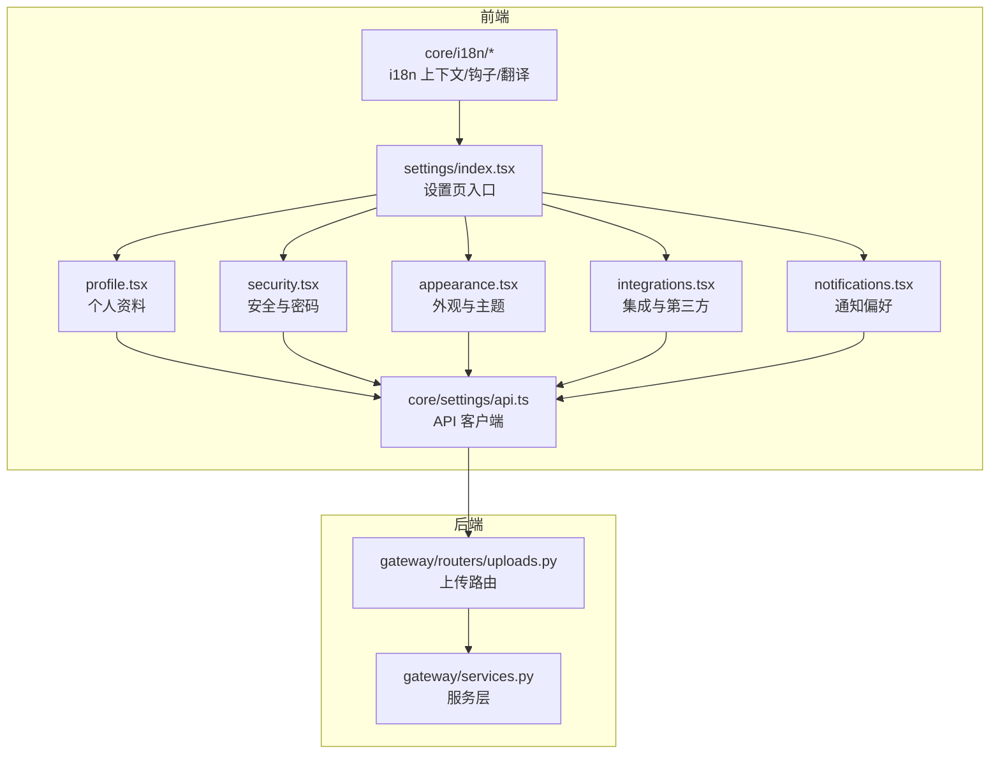
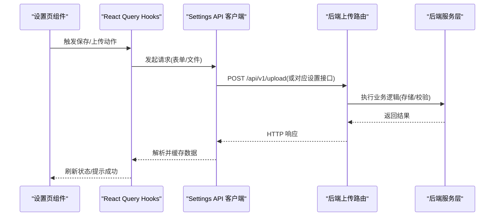
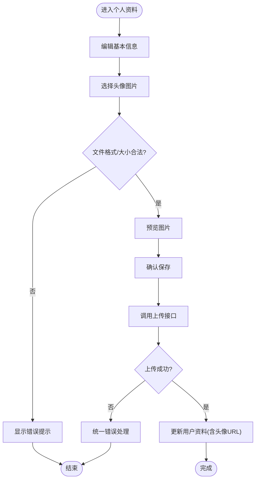
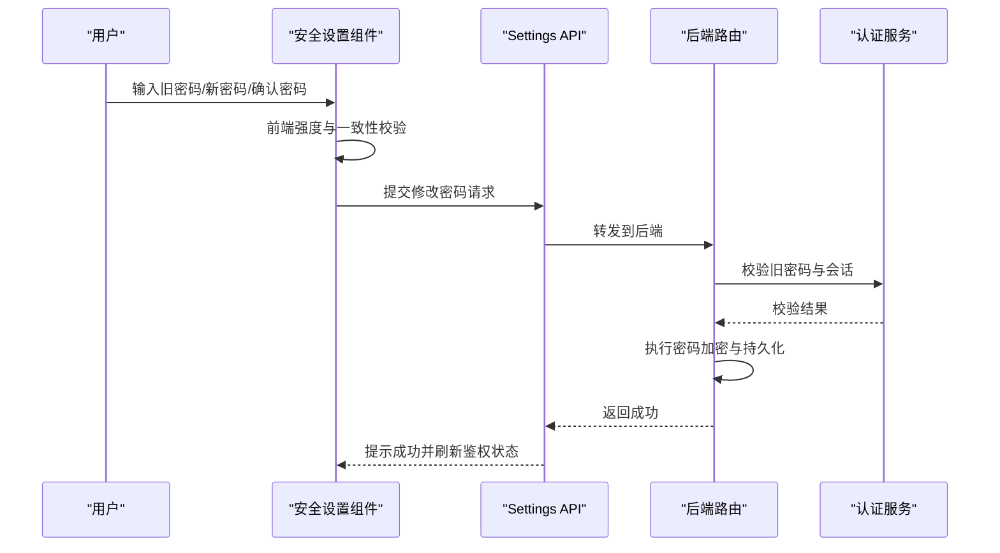
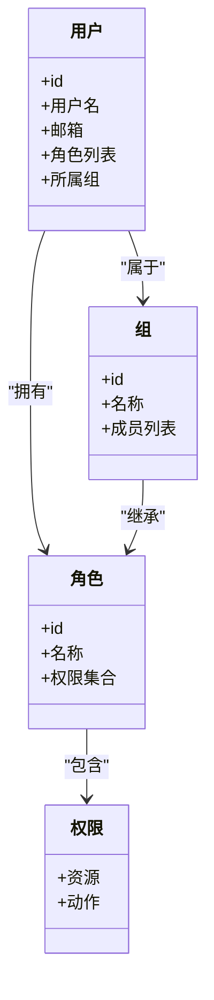
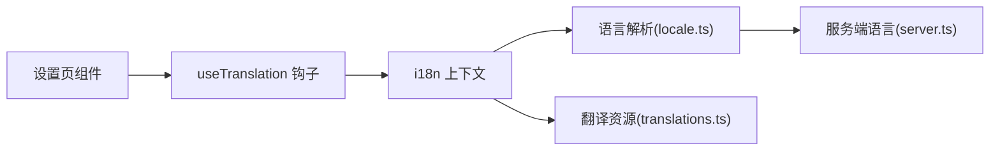
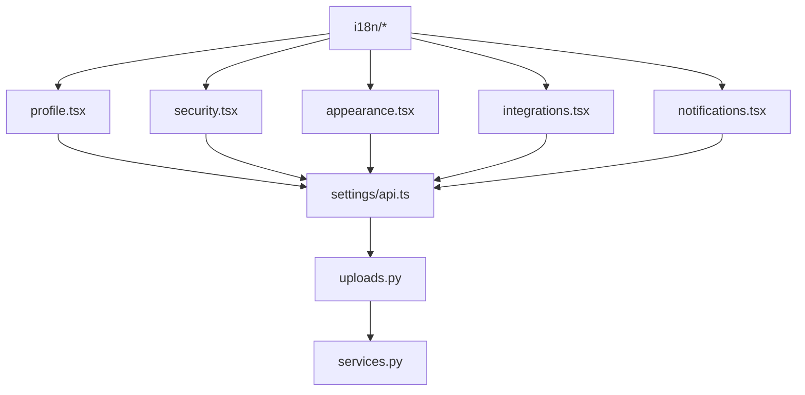

# 账户设置页面

<cite>
**本文引用的文件**   
- [frontend/src/components/workspace/settings/index.tsx](file://frontend/src/components/workspace/settings/index.tsx)
- [frontend/src/components/workspace/settings/profile.tsx](file://frontend/src/components/workspace/settings/profile.tsx)
- [frontend/src/components/workspace/settings/security.tsx](file://frontend/src/components/workspace/settings/security.tsx)
- [frontend/src/components/workspace/settings/notifications.tsx](file://frontend/src/components/workspace/settings/notifications.tsx)
- [frontend/src/components/workspace/settings/appearance.tsx](file://frontend/src/components/workspace/settings/appearance.tsx)
- [frontend/src/components/workspace/settings/integrations.tsx](file://frontend/src/components/workspace/settings/integrations.tsx)
- [frontend/src/core/i18n/context.tsx](file://frontend/src/core/i18n/context.tsx)
- [frontend/src/core/i18n/hooks.ts](file://frontend/src/core/i18n/hooks.ts)
- [frontend/src/core/i18n/locale.ts](file://frontend/src/core/i18n/locale.ts)
- [frontend/src/core/i18n/server.ts](file://frontend/src/core/i18n/server.ts)
- [frontend/src/core/i18n/translations.ts](file://frontend/src/core/i18n/translations.ts)
- [frontend/src/core/settings/api.ts](file://frontend/src/core/settings/api.ts)
- [frontend/src/core/settings/hooks.ts](file://frontend/src/core/settings/hooks.ts)
- [frontend/src/core/settings/types.ts](file://frontend/src/core/settings/types.ts)
- [backend/app/gateway/routers/uploads.py](file://backend/app/gateway/routers/uploads.py)
- [backend/app/gateway/services.py](file://backend/app/gateway/services.py)
</cite>

## 目录
1. [简介](#简介)
2. [项目结构](#项目结构)
3. [核心组件](#核心组件)
4. [架构总览](#架构总览)
5. [详细组件分析](#详细组件分析)
6. [依赖分析](#依赖分析)
7. [性能考虑](#性能考虑)
8. [故障排查指南](#故障排查指南)
9. [结论](#结论)
10. [附录](#附录)

## 简介
本文件面向“账户设置页面”的完整实现与使用，覆盖以下能力：
- 用户信息管理：个人资料编辑、头像上传、联系方式更新
- 密码修改流程：强度校验、确认机制与安全策略
- 权限配置界面：角色管理、访问控制列表（ACL）和用户分组（概念性说明）
- 多语言支持与本地化：前端 i18n 上下文、服务端语言解析与翻译资源
- 数据验证与错误处理最佳实践：前后端协作、表单校验、统一错误提示

## 项目结构
账户设置相关的前端代码集中在 workspace/settings 目录下，并通过 core/settings 模块提供 API 调用、类型定义与 React Query hooks。国际化由 core/i18n 提供。后端通过 gateway 路由暴露上传等通用能力。

图表来源
- [frontend/src/components/workspace/settings/index.tsx](file://frontend/src/components/workspace/settings/index.tsx)
- [frontend/src/components/workspace/settings/profile.tsx](file://frontend/src/components/workspace/settings/profile.tsx)
- [frontend/src/components/workspace/settings/security.tsx](file://frontend/src/components/workspace/settings/security.tsx)
- [frontend/src/components/workspace/settings/appearance.tsx](file://frontend/src/components/workspace/settings/appearance.tsx)
- [frontend/src/components/workspace/settings/integrations.tsx](file://frontend/src/components/workspace/settings/integrations.tsx)
- [frontend/src/components/workspace/settings/notifications.tsx](file://frontend/src/components/workspace/settings/notifications.tsx)
- [frontend/src/core/settings/api.ts](file://frontend/src/core/settings/api.ts)
- [backend/app/gateway/routers/uploads.py](file://backend/app/gateway/routers/uploads.py)
- [backend/app/gateway/services.py](file://backend/app/gateway/services.py)

章节来源
- [frontend/src/components/workspace/settings/index.tsx](file://frontend/src/components/workspace/settings/index.tsx)
- [frontend/src/core/settings/api.ts](file://frontend/src/core/settings/api.ts)
- [backend/app/gateway/routers/uploads.py](file://backend/app/gateway/routers/uploads.py)

## 核心组件
- 设置页入口（index.tsx）
  - 负责渲染设置页布局与导航标签，聚合各功能面板（个人资料、安全、外观、集成、通知）。
  - 通常结合 i18n 文案进行标题与描述展示。
- 个人资料（profile.tsx）
  - 提供姓名、邮箱、手机号、个人简介等字段编辑。
  - 头像上传：选择图片、预览、裁剪（可选）、提交至后端上传接口。
  - 联系方式更新：支持邮箱、电话等字段的保存与校验。
- 安全（security.tsx）
  - 修改密码：输入旧密码、新密码、确认密码；包含强度规则与一致性校验。
  - 二次确认：对敏感操作弹出确认对话框，避免误改。
- 外观（appearance.tsx）
  - 主题切换、字体大小、深色模式等个性化设置。
- 集成（integrations.tsx）
  - 第三方应用授权与凭据管理（如 OAuth 绑定、密钥配置）。
- 通知（notifications.tsx）
  - 邮件、站内信、推送等通知渠道开关与频率控制。

章节来源
- [frontend/src/components/workspace/settings/profile.tsx](file://frontend/src/components/workspace/settings/profile.tsx)
- [frontend/src/components/workspace/settings/security.tsx](file://frontend/src/components/workspace/settings/security.tsx)
- [frontend/src/components/workspace/settings/appearance.tsx](file://frontend/src/components/workspace/settings/appearance.tsx)
- [frontend/src/components/workspace/settings/integrations.tsx](file://frontend/src/components/workspace/settings/integrations.tsx)
- [frontend/src/components/workspace/settings/notifications.tsx](file://frontend/src/components/workspace/settings/notifications.tsx)

## 架构总览
账户设置页面的数据流遵循“UI 组件 -> 业务 Hooks -> API 客户端 -> 后端网关 -> 服务层”的分层模型。上传类操作通过独立的上传路由处理，其他设置项通过 settings API 统一封装。

图表来源
- [frontend/src/core/settings/api.ts](file://frontend/src/core/settings/api.ts)
- [backend/app/gateway/routers/uploads.py](file://backend/app/gateway/routers/uploads.py)
- [backend/app/gateway/services.py](file://backend/app/gateway/services.py)

## 详细组件分析

### 个人资料与头像上传
- 功能要点
  - 字段编辑：姓名、邮箱、电话、地址、简介等。
  - 头像上传：支持常见图片格式、尺寸限制、压缩与预览。
  - 保存策略：变更检测、防抖保存、失败重试。
- 关键交互
  - 选择图片后即时预览，提交前二次确认。
  - 上传进度反馈与错误提示（网络异常、格式不支持、大小超限）。
- 数据流
  - 前端表单收集 -> 调用上传接口 -> 后端存储服务 -> 返回头像 URL -> 更新用户资料。

图表来源
- [frontend/src/components/workspace/settings/profile.tsx](file://frontend/src/components/workspace/settings/profile.tsx)
- [frontend/src/core/settings/api.ts](file://frontend/src/core/settings/api.ts)
- [backend/app/gateway/routers/uploads.py](file://backend/app/gateway/routers/uploads.py)
- [backend/app/gateway/services.py](file://backend/app/gateway/services.py)

章节来源
- [frontend/src/components/workspace/settings/profile.tsx](file://frontend/src/components/workspace/settings/profile.tsx)
- [frontend/src/core/settings/api.ts](file://frontend/src/core/settings/api.ts)
- [backend/app/gateway/routers/uploads.py](file://backend/app/gateway/routers/uploads.py)

### 密码修改流程
- 安全要求
  - 强度校验：长度、复杂度（大小写、数字、特殊字符）、禁止常见弱口令。
  - 确认机制：新旧密码对比、重复输入确认、会话有效性检查。
  - 安全检查：登录态校验、防重放、速率限制（建议）。
- 交互流程
  - 输入旧密码与新密码 -> 实时强度提示 -> 确认密码一致 -> 提交 -> 成功后强制重新登录或刷新令牌（视策略而定）。

图表来源
- [frontend/src/components/workspace/settings/security.tsx](file://frontend/src/components/workspace/settings/security.tsx)
- [frontend/src/core/settings/api.ts](file://frontend/src/core/settings/api.ts)

章节来源
- [frontend/src/components/workspace/settings/security.tsx](file://frontend/src/components/workspace/settings/security.tsx)
- [frontend/src/core/settings/api.ts](file://frontend/src/core/settings/api.ts)

### 权限配置界面（概念性说明）
- 角色管理
  - 创建/编辑/删除角色，分配默认权限集。
- 访问控制列表（ACL）
  - 基于资源的细粒度权限（读/写/管理），支持继承与覆盖。
- 用户分组
  - 将用户加入组，组内共享角色与权限模板。
- 典型流程
  - 管理员进入权限设置 -> 选择目标用户/组 -> 分配角色 -> 生效并审计记录。

[此图为概念模型，不直接映射具体源码文件]

### 多语言支持与本地化
- 前端 i18n
  - 上下文与钩子：提供当前语言、切换语言、获取翻译文本的能力。
  - 语言解析：从 URL、Cookie、浏览器偏好中推导语言。
  - 翻译资源：按语言维度组织键值对，支持动态加载。
- 服务端语言解析
  - 根据请求头或路径参数确定语言，用于文档与静态内容。
- 在设置页中的应用
  - 所有界面文案通过 i18n 钩子获取，确保切换语言即时生效。

图表来源
- [frontend/src/core/i18n/context.tsx](file://frontend/src/core/i18n/context.tsx)
- [frontend/src/core/i18n/hooks.ts](file://frontend/src/core/i18n/hooks.ts)
- [frontend/src/core/i18n/locale.ts](file://frontend/src/core/i18n/locale.ts)
- [frontend/src/core/i18n/server.ts](file://frontend/src/core/i18n/server.ts)
- [frontend/src/core/i18n/translations.ts](file://frontend/src/core/i18n/translations.ts)

章节来源
- [frontend/src/core/i18n/context.tsx](file://frontend/src/core/i18n/context.tsx)
- [frontend/src/core/i18n/hooks.ts](file://frontend/src/core/i18n/hooks.ts)
- [frontend/src/core/i18n/locale.ts](file://frontend/src/core/i18n/locale.ts)
- [frontend/src/core/i18n/server.ts](file://frontend/src/core/i18n/server.ts)
- [frontend/src/core/i18n/translations.ts](file://frontend/src/core/i18n/translations.ts)

## 依赖分析
- 组件耦合
  - 设置页入口与各功能面板松耦合，通过路由或标签切换。
  - 各面板复用 core/settings 提供的 API 与类型，降低重复逻辑。
- 外部依赖
  - 上传能力依赖后端 uploads 路由与服务层。
  - 国际化依赖 i18n 上下文与翻译资源。
- 潜在风险
  - 若上传路由或服务层变更，需同步调整前端 API 调用与错误处理。
  - 国际化键缺失会导致占位符显示，需在构建期或运行时做缺失检测。

图表来源
- [frontend/src/components/workspace/settings/profile.tsx](file://frontend/src/components/workspace/settings/profile.tsx)
- [frontend/src/components/workspace/settings/security.tsx](file://frontend/src/components/workspace/settings/security.tsx)
- [frontend/src/components/workspace/settings/appearance.tsx](file://frontend/src/components/workspace/settings/appearance.tsx)
- [frontend/src/components/workspace/settings/integrations.tsx](file://frontend/src/components/workspace/settings/integrations.tsx)
- [frontend/src/components/workspace/settings/notifications.tsx](file://frontend/src/components/workspace/settings/notifications.tsx)
- [frontend/src/core/settings/api.ts](file://frontend/src/core/settings/api.ts)
- [backend/app/gateway/routers/uploads.py](file://backend/app/gateway/routers/uploads.py)
- [backend/app/gateway/services.py](file://backend/app/gateway/services.py)
- [frontend/src/core/i18n/context.tsx](file://frontend/src/core/i18n/context.tsx)

章节来源
- [frontend/src/core/settings/api.ts](file://frontend/src/core/settings/api.ts)
- [backend/app/gateway/routers/uploads.py](file://backend/app/gateway/routers/uploads.py)
- [backend/app/gateway/services.py](file://backend/app/gateway/services.py)

## 性能考虑
- 头像上传优化
  - 前端压缩与裁剪，减少传输体积。
  - 断点续传与大文件分片（可选）。
  - 并发控制与队列管理，避免阻塞主线程。
- 表单与状态
  - 使用 React Query 缓存与去重，减少重复请求。
  - 变更检测与按需保存，避免频繁写入。
- 国际化
  - 按需加载语言包，首屏最小化。
  - 翻译键缺失时降级为英文或占位符，提升可用性。

## 故障排查指南
- 常见问题
  - 头像上传失败：检查文件大小、格式、网络状态与后端存储路径。
  - 密码修改失败：确认旧密码正确、新密码满足强度规则、会话未过期。
  - 多语言显示异常：检查语言包是否加载、键是否存在、浏览器语言优先级。
- 定位步骤
  - 打开浏览器开发者工具，查看网络请求与响应体。
  - 核对前端 API 调用参数与后端路由期望一致。
  - 检查 i18n 上下文当前语言与翻译资源是否匹配。
- 恢复建议
  - 对上传失败提供重试按钮与错误详情。
  - 对密码修改失败给出明确原因与修正建议。
  - 对语言缺失提供回退策略与反馈入口。

章节来源
- [frontend/src/core/settings/api.ts](file://frontend/src/core/settings/api.ts)
- [backend/app/gateway/routers/uploads.py](file://backend/app/gateway/routers/uploads.py)

## 结论
账户设置页面以模块化方式组织，职责清晰、扩展性强。通过统一的 API 客户端与 i18n 体系，实现了良好的可维护性与用户体验。建议在后续迭代中完善权限配置界面的具体实现，并持续强化上传与密码修改的安全策略与错误提示。

## 附录
- 术语
  - ACL：访问控制列表，用于细粒度权限控制。
  - i18n：国际化，支持多语言切换与本地化。
- 参考实现位置
  - 设置页入口与面板：frontend/src/components/workspace/settings/*
  - 设置 API 与类型：frontend/src/core/settings/*
  - 上传路由与服务：backend/app/gateway/routers/uploads.py, backend/app/gateway/services.py
  - 国际化：frontend/src/core/i18n/*