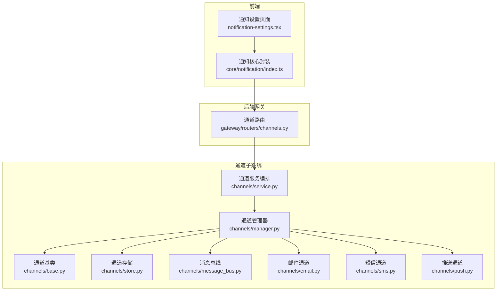
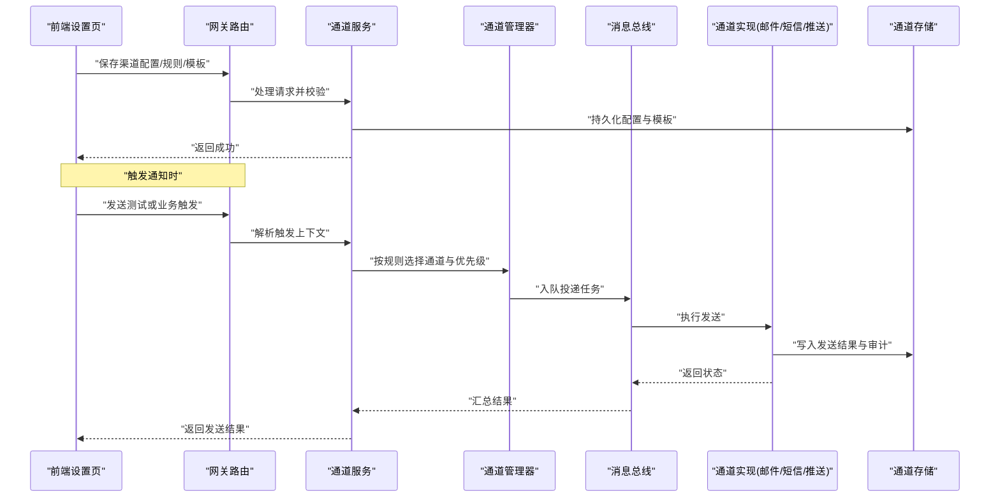
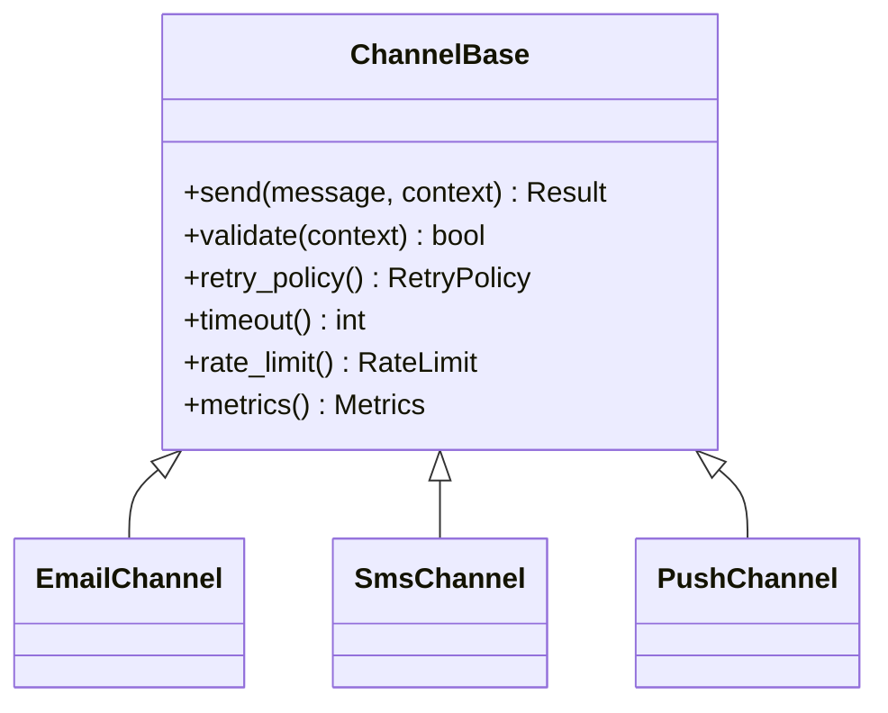
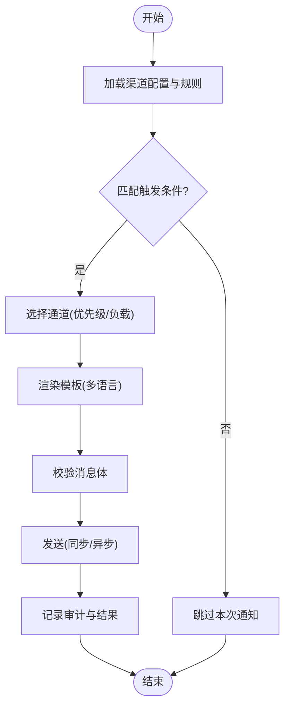
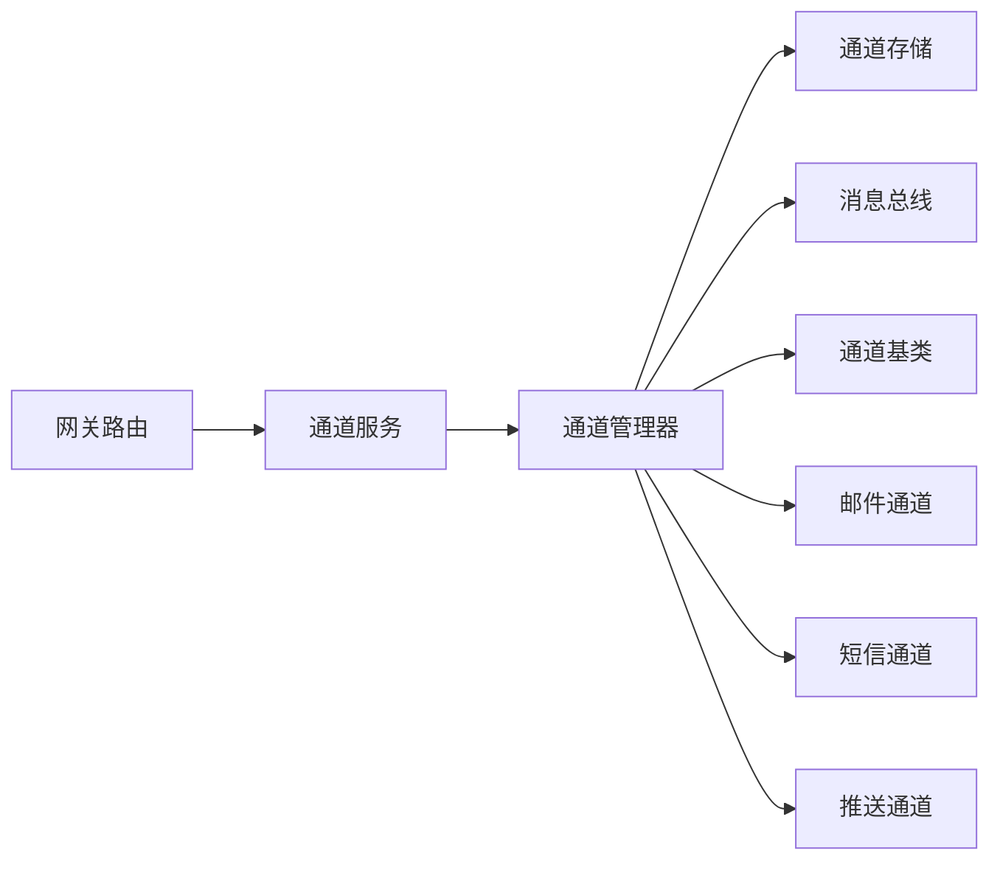

# 通知设置页面

<cite>
**本文引用的文件**   
- [backend/app/channels/base.py](file://backend/app/channels/base.py)
- [backend/app/channels/manager.py](file://backend/app/channels/manager.py)
- [backend/app/channels/store.py](file://backend/app/channels/store.py)
- [backend/app/channels/service.py](file://backend/app/channels/service.py)
- [backend/app/channels/message_bus.py](file://backend/app/channels/message_bus.py)
- [backend/app/channels/email.py](file://backend/app/channels/email.py)
- [backend/app/channels/sms.py](file://backend/app/channels/sms.py)
- [backend/app/channels/push.py](file://backend/app/channels/push.py)
- [backend/app/gateway/routers/channels.py](file://backend/app/gateway/routers/channels.py)
- [frontend/src/components/workspace/settings/notification-settings.tsx](file://frontend/src/components/workspace/settings/notification-settings.tsx)
- [frontend/src/core/notification/index.ts](file://frontend/src/core/notification/index.ts)
</cite>

## 目录
1. [简介](#简介)
2. [项目结构](#项目结构)
3. [核心组件](#核心组件)
4. [架构总览](#架构总览)
5. [详细组件分析](#详细组件分析)
6. [依赖关系分析](#依赖关系分析)
7. [性能考虑](#性能考虑)
8. [故障排查指南](#故障排查指南)
9. [结论](#结论)
10. [附录](#附录)

## 简介
本文件围绕“通知设置页面”进行系统化文档化，覆盖以下关键主题：
- 通知渠道配置界面：邮件、短信、推送通知等多通道的接入与参数管理
- 通知规则配置：触发条件、过滤规则、优先级策略
- 模板管理与自定义：多语言模板支持、变量替换、预览与校验
- 历史记录与审计日志：发送记录、失败重试、审计追踪
- 性能监控与排障：指标采集、错误分类、定位工具

说明：
- 后端采用通道抽象与消息总线解耦，前端提供统一设置入口与可视化配置。
- 若仓库中具体实现文件路径存在差异，请以实际代码为准；本节为基于仓库结构的通用设计与落地指引。

## 项目结构
从仓库视角看，通知相关能力主要分布在后端通道子系统与前端设置模块：
- 后端通道子系统：定义基础抽象、管理器、存储、服务编排、消息总线以及各通道实现（邮件、短信、推送等）
- 网关路由：暴露 REST API 供前端调用，用于查询/保存渠道配置、发送测试消息、获取历史与审计
- 前端设置页：提供渠道配置表单、规则编辑器、模板管理、历史记录查看与多语言切换

图表来源
- [backend/app/gateway/routers/channels.py](file://backend/app/gateway/routers/channels.py)
- [backend/app/channels/service.py](file://backend/app/channels/service.py)
- [backend/app/channels/manager.py](file://backend/app/channels/manager.py)
- [backend/app/channels/store.py](file://backend/app/channels/store.py)
- [backend/app/channels/message_bus.py](file://backend/app/channels/message_bus.py)
- [backend/app/channels/base.py](file://backend/app/channels/base.py)
- [backend/app/channels/email.py](file://backend/app/channels/email.py)
- [backend/app/channels/sms.py](file://backend/app/channels/sms.py)
- [backend/app/channels/push.py](file://backend/app/channels/push.py)
- [frontend/src/components/workspace/settings/notification-settings.tsx](file://frontend/src/components/workspace/settings/notification-settings.tsx)
- [frontend/src/core/notification/index.ts](file://frontend/src/core/notification/index.ts)

章节来源
- [backend/app/channels/base.py](file://backend/app/channels/base.py)
- [backend/app/channels/manager.py](file://backend/app/channels/manager.py)
- [backend/app/channels/store.py](file://backend/app/channels/store.py)
- [backend/app/channels/service.py](file://backend/app/channels/service.py)
- [backend/app/channels/message_bus.py](file://backend/app/channels/message_bus.py)
- [backend/app/gateway/routers/channels.py](file://backend/app/gateway/routers/channels.py)
- [frontend/src/components/workspace/settings/notification-settings.tsx](file://frontend/src/components/workspace/settings/notification-settings.tsx)
- [frontend/src/core/notification/index.ts](file://frontend/src/core/notification/index.ts)

## 核心组件
- 通道基类：定义统一的发送接口、元数据、状态与错误模型，便于扩展新通道
- 通道管理器：负责通道注册、选择、批量分发、优先级排序与去重
- 通道存储：持久化渠道配置、模板、规则与审计记录
- 通道服务：编排业务逻辑，如规则匹配、模板渲染、限流与重试
- 消息总线：异步解耦，承载事件驱动的通知投递与重试队列
- 通道实现：邮件、短信、推送的具体适配层，屏蔽第三方差异
- 网关路由：对外暴露配置、发送、历史与审计的 REST API
- 前端设置页：集中式配置入口，支持多语言模板与实时预览

章节来源
- [backend/app/channels/base.py](file://backend/app/channels/base.py)
- [backend/app/channels/manager.py](file://backend/app/channels/manager.py)
- [backend/app/channels/store.py](file://backend/app/channels/store.py)
- [backend/app/channels/service.py](file://backend/app/channels/service.py)
- [backend/app/channels/message_bus.py](file://backend/app/channels/message_bus.py)
- [backend/app/gateway/routers/channels.py](file://backend/app/gateway/routers/channels.py)
- [frontend/src/components/workspace/settings/notification-settings.tsx](file://frontend/src/components/workspace/settings/notification-settings.tsx)
- [frontend/src/core/notification/index.ts](file://frontend/src/core/notification/index.ts)

## 架构总览
下图展示从前端到后端的端到端流程：用户在前端设置页完成渠道配置与规则编辑，通过网关路由进入通道服务，由管理器调度具体通道实现，并通过消息总线异步投递。

图表来源
- [backend/app/gateway/routers/channels.py](file://backend/app/gateway/routers/channels.py)
- [backend/app/channels/service.py](file://backend/app/channels/service.py)
- [backend/app/channels/manager.py](file://backend/app/channels/manager.py)
- [backend/app/channels/message_bus.py](file://backend/app/channels/message_bus.py)
- [backend/app/channels/store.py](file://backend/app/channels/store.py)
- [backend/app/channels/email.py](file://backend/app/channels/email.py)
- [backend/app/channels/sms.py](file://backend/app/channels/sms.py)
- [backend/app/channels/push.py](file://backend/app/channels/push.py)

## 详细组件分析

### 通道基类与抽象
- 职责：定义统一的发送接口、消息体结构、状态枚举、错误码与可观测性钩子
- 设计要点：
  - 所有通道需继承基类并实现发送方法
  - 提供默认重试、超时、限流策略的可插拔点
  - 标准化元数据（如渠道ID、目标地址、模板ID、语言）

图表来源
- [backend/app/channels/base.py](file://backend/app/channels/base.py)
- [backend/app/channels/email.py](file://backend/app/channels/email.py)
- [backend/app/channels/sms.py](file://backend/app/channels/sms.py)
- [backend/app/channels/push.py](file://backend/app/channels/push.py)

章节来源
- [backend/app/channels/base.py](file://backend/app/channels/base.py)

### 通道管理器与存储
- 管理器：
  - 维护已注册的通道实例
  - 根据规则与优先级选择最佳通道
  - 支持批量分发与去重
- 存储：
  - 持久化渠道配置、模板、规则、审计记录
  - 提供版本化与回滚能力

图表来源
- [backend/app/channels/manager.py](file://backend/app/channels/manager.py)
- [backend/app/channels/store.py](file://backend/app/channels/store.py)

章节来源
- [backend/app/channels/manager.py](file://backend/app/channels/manager.py)
- [backend/app/channels/store.py](file://backend/app/channels/store.py)

### 通道服务编排
- 职责：
  - 接收网关请求，解析上下文
  - 调用管理器进行通道选择与分发
  - 聚合结果并返回给前端
- 关键点：
  - 事务性与幂等性保障
  - 错误降级与告警
  - 指标上报（成功率、延迟、失败原因）

章节来源
- [backend/app/channels/service.py](file://backend/app/channels/service.py)

### 消息总线与异步投递
- 职责：
  - 将发送任务入队，解耦业务与投递
  - 支持重试、死信队列、顺序保证（可选）
- 关键点：
  - 背压控制与限流
  - 可观测性（队列长度、消费速率）

章节来源
- [backend/app/channels/message_bus.py](file://backend/app/channels/message_bus.py)

### 网关路由与API契约
- 职责：
  - 暴露渠道配置、规则、模板、历史与审计的REST接口
  - 鉴权、参数校验、响应格式化
- 典型操作：
  - 保存/更新渠道配置
  - 发送测试消息
  - 查询历史记录与审计日志
  - 模板列表、创建、更新、删除、预览

章节来源
- [backend/app/gateway/routers/channels.py](file://backend/app/gateway/routers/channels.py)

### 前端设置页与多语言模板
- 功能：
  - 渠道配置表单（连接信息、开关、优先级）
  - 规则编辑器（触发条件、过滤表达式、优先级）
  - 模板管理（多语言、变量、预览、校验）
  - 历史记录与审计查看
- 多语言支持：
  - 基于语言键值对组织模板
  - 动态渲染与回退策略

章节来源
- [frontend/src/components/workspace/settings/notification-settings.tsx](file://frontend/src/components/workspace/settings/notification-settings.tsx)
- [frontend/src/core/notification/index.ts](file://frontend/src/core/notification/index.ts)

## 依赖关系分析
- 低耦合高内聚：
  - 通道实现仅依赖基类与存储，不直接感知网关与服务编排
  - 服务编排通过管理器间接使用通道，避免硬编码
- 外部依赖：
  - 邮件/短信/推送第三方SDK
  - 消息队列/存储后端
- 潜在循环依赖：
  - 确保服务→管理器→通道实现的单向依赖，禁止反向引用

图表来源
- [backend/app/gateway/routers/channels.py](file://backend/app/gateway/routers/channels.py)
- [backend/app/channels/service.py](file://backend/app/channels/service.py)
- [backend/app/channels/manager.py](file://backend/app/channels/manager.py)
- [backend/app/channels/store.py](file://backend/app/channels/store.py)
- [backend/app/channels/message_bus.py](file://backend/app/channels/message_bus.py)
- [backend/app/channels/base.py](file://backend/app/channels/base.py)
- [backend/app/channels/email.py](file://backend/app/channels/email.py)
- [backend/app/channels/sms.py](file://backend/app/channels/sms.py)
- [backend/app/channels/push.py](file://backend/app/channels/push.py)

章节来源
- [backend/app/gateway/routers/channels.py](file://backend/app/gateway/routers/channels.py)
- [backend/app/channels/service.py](file://backend/app/channels/service.py)
- [backend/app/channels/manager.py](file://backend/app/channels/manager.py)
- [backend/app/channels/store.py](file://backend/app/channels/store.py)
- [backend/app/channels/message_bus.py](file://backend/app/channels/message_bus.py)
- [backend/app/channels/base.py](file://backend/app/channels/base.py)
- [backend/app/channels/email.py](file://backend/app/channels/email.py)
- [backend/app/channels/sms.py](file://backend/app/channels/sms.py)
- [backend/app/channels/push.py](file://backend/app/channels/push.py)

## 性能考虑
- 异步化与批量化：
  - 通过消息总线削峰填谷，批量合并相似通知
- 限流与熔断：
  - 通道级限流、全局配额、快速失败与重试退避
- 缓存与预渲染：
  - 模板与规则缓存，减少重复计算
- 可观测性：
  - 指标采集（QPS、延迟、错误率）、链路追踪、审计日志

[本节为通用指导，无需特定文件来源]

## 故障排查指南
- 常见问题定位：
  - 渠道配置错误：检查连接信息与权限
  - 规则未命中：核对触发条件与过滤表达式
  - 模板渲染失败：验证变量与语言键
  - 发送失败：查看审计日志中的错误码与堆栈
- 诊断步骤：
  - 在设置页使用“发送测试消息”验证端到端链路
  - 查看历史记录与审计日志，筛选失败条目
  - 启用调试模式，观察消息总线队列与重试情况
- 恢复策略：
  - 自动重试与人工介入并重
  - 临时降级至备用通道

章节来源
- [backend/app/channels/store.py](file://backend/app/channels/store.py)
- [backend/app/channels/message_bus.py](file://backend/app/channels/message_bus.py)
- [backend/app/gateway/routers/channels.py](file://backend/app/gateway/routers/channels.py)

## 结论
通过统一的通道抽象、清晰的服务编排与消息总线解耦，通知系统具备良好的可扩展性与可维护性。前端设置页提供一站式配置与管理体验，结合多语言模板、规则引擎与审计日志，满足复杂场景下的通知需求。建议在生产环境完善指标与告警，持续优化限流与重试策略，提升整体稳定性与用户体验。

[本节为总结，无需特定文件来源]

## 附录
- 术语表：
  - 通道：一种具体的通知方式（如邮件、短信、推送）
  - 规则：决定何时以及如何发送通知的条件集合
  - 模板：可变量化的通知内容，支持多语言
  - 审计：记录每次通知的完整生命周期与结果
- 最佳实践：
  - 保持模板简洁、变量明确
  - 合理设置优先级与去重策略
  - 定期审查审计日志，发现异常趋势

[本节为概念性内容，无需特定文件来源]