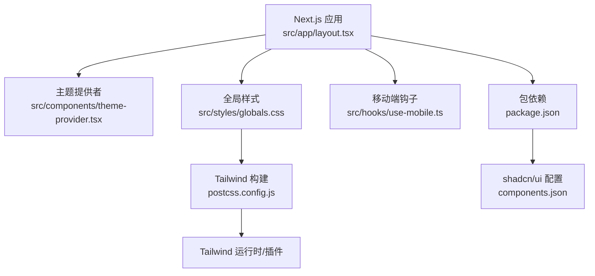
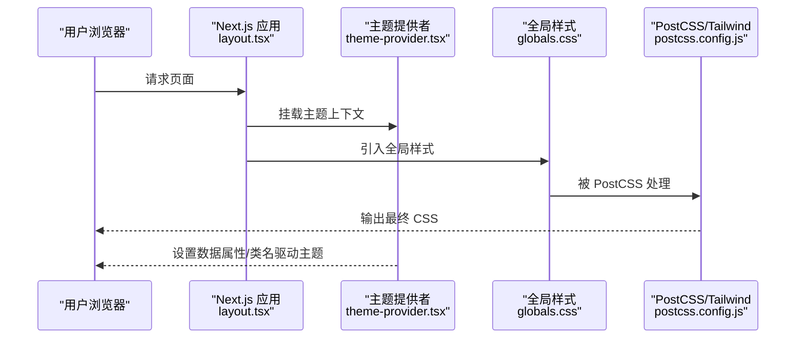
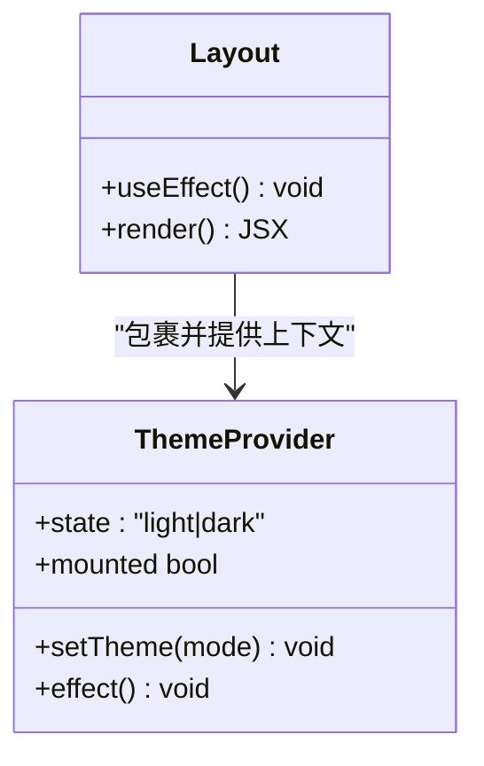
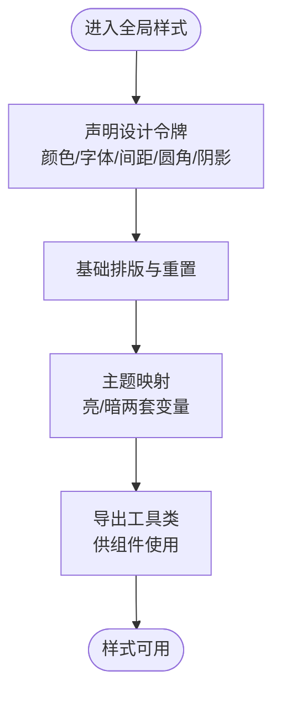
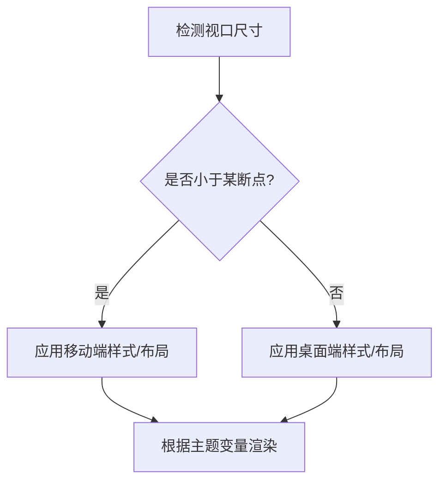
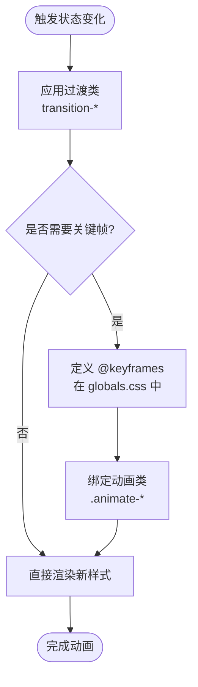
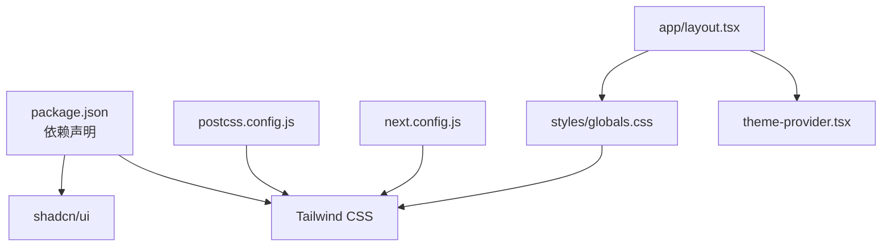

# 样式系统

<cite>
**本文引用的文件**   
- [frontend/src/styles/globals.css](file://frontend/src/styles/globals.css)
- [frontend/postcss.config.js](file://frontend/postcss.config.js)
- [frontend/next.config.js](file://frontend/next.config.js)
- [frontend/package.json](file://frontend/package.json)
- [frontend/components.json](file://frontend/components.json)
- [frontend/src/app/layout.tsx](file://frontend/src/app/layout.tsx)
- [frontend/src/components/theme-provider.tsx](file://frontend/src/components/theme-provider.tsx)
- [frontend/src/hooks/use-mobile.ts](file://frontend/src/hooks/use-mobile.ts)
</cite>

## 目录
1. [简介](#简介)
2. [项目结构](#项目结构)
3. [核心组件](#核心组件)
4. [架构总览](#架构总览)
5. [详细组件分析](#详细组件分析)
6. [依赖分析](#依赖分析)
7. [性能考虑](#性能考虑)
8. [故障排查指南](#故障排查指南)
9. [结论](#结论)
10. [附录](#附录)

## 简介
本文件系统化梳理 DeerFlow 前端基于 Tailwind CSS 的样式体系，覆盖设计令牌（CSS 变量、颜色主题、字体规范、间距等）、暗色模式与主题切换机制、响应式策略与断点、动画与过渡、模块化组织与命名约定、定制与扩展最佳实践，以及调试与性能优化建议。目标是帮助开发者快速理解并高效扩展样式系统。

## 项目结构
DeerFlow 前端采用 Next.js + Tailwind CSS 的技术栈，样式相关的关键位置如下：
- 全局样式入口：位于 src/styles/globals.css，集中定义基础样式与设计令牌。
- Tailwind 构建配置：postcss.config.js 中启用 Tailwind 插件链。
- Next.js 集成：next.config.js 中配置静态资源与可能的样式处理。
- 主题上下文：src/components/theme-provider.tsx 提供主题状态与切换能力。
- 根布局注入：src/app/layout.tsx 引入全局样式与主题提供者。
- 移动端适配钩子：src/hooks/use-mobile.ts 提供响应式判断逻辑。
- 包依赖与 shadcn/ui 配置：package.json 与 components.json 管理依赖与 UI 组件来源。

图示来源
- [frontend/src/app/layout.tsx](file://frontend/src/app/layout.tsx)
- [frontend/src/components/theme-provider.tsx](file://frontend/src/components/theme-provider.tsx)
- [frontend/src/styles/globals.css](file://frontend/src/styles/globals.css)
- [frontend/postcss.config.js](file://frontend/postcss.config.js)
- [frontend/package.json](file://frontend/package.json)
- [frontend/components.json](file://frontend/components.json)

章节来源
- [frontend/src/app/layout.tsx](file://frontend/src/app/layout.tsx)
- [frontend/src/components/theme-provider.tsx](file://frontend/src/components/theme-provider.tsx)
- [frontend/src/styles/globals.css](file://frontend/src/styles/globals.css)
- [frontend/postcss.config.js](file://frontend/postcss.config.js)
- [frontend/package.json](file://frontend/package.json)
- [frontend/components.json](file://frontend/components.json)

## 核心组件
本节聚焦样式系统的“核心”部分：设计令牌、主题与暗色模式、响应式与断点、动画与过渡、模块组织与命名约定。

- 设计令牌（Design Tokens）
  - 通过 CSS 自定义属性在根节点或主题上下文中声明，形成统一的颜色、字号、行高、圆角、阴影、间距等基础值。
  - 使用语义化命名（如 --color-primary、--spacing-md），便于跨组件复用与主题替换。
  - 将常用组合封装为实用类或 Token 类，减少重复代码。

- 颜色主题与暗色模式
  - 在主题提供者中维护当前主题状态（亮/暗），并通过 data-theme 或 class 切换至根元素。
  - 利用 Tailwind 的 dark: 前缀或按主题选择器（[data-theme="dark"]）派生变体。
  - 将明暗两套变量映射到同一语义键，确保切换时仅更新变量值而不改动业务样式。

- 字体规范
  - 在全局样式中定义字体族、字重、行高、字号阶梯，并提供文本层级（标题、正文、辅助文字）。
  - 对国际化场景预留多语言字体回退策略。

- 间距系统
  - 以固定步长（如 4px 倍数）建立 spacing 令牌，统一内边距、外边距、网格间隙。
  - 结合容器宽度与最大宽度限制，保证在不同屏幕下的可读性。

- 动画与过渡
  - 使用 Tailwind 内置过渡类（transition-*）与动画类（animate-*），并在必要时扩展关键帧。
  - 将复杂动效拆分为可复用的原子动画，避免在组件内硬编码。

- 模块化组织与命名约定
  - 全局样式集中在 globals.css；组件级样式尽量使用 Tailwind 实用类或局部 CSS 模块。
  - 命名遵循 BEM 或语义化前缀（如 ui-、ws-、landing-），避免冲突。
  - 将通用 UI 组件样式收敛到 ui 目录，业务样式放在对应功能目录。

章节来源
- [frontend/src/styles/globals.css](file://frontend/src/styles/globals.css)
- [frontend/src/components/theme-provider.tsx](file://frontend/src/components/theme-provider.tsx)
- [frontend/src/app/layout.tsx](file://frontend/src/app/layout.tsx)
- [frontend/src/hooks/use-mobile.ts](file://frontend/src/hooks/use-mobile.ts)

## 架构总览
下图展示从页面渲染到样式生效的整体流程，包括主题提供者注入、全局样式加载与 Tailwind 编译。

图示来源
- [frontend/src/app/layout.tsx](file://frontend/src/app/layout.tsx)
- [frontend/src/components/theme-provider.tsx](file://frontend/src/components/theme-provider.tsx)
- [frontend/src/styles/globals.css](file://frontend/src/styles/globals.css)
- [frontend/postcss.config.js](file://frontend/postcss.config.js)

## 详细组件分析

### 主题提供者与暗色模式实现
主题提供者负责：
- 维护当前主题状态（亮/暗）
- 将主题写入根节点（data-theme 或 class）
- 提供切换 API（如 setTheme）
- 可选：持久化到本地存储或 Cookie

图示来源
- [frontend/src/components/theme-provider.tsx](file://frontend/src/components/theme-provider.tsx)
- [frontend/src/app/layout.tsx](file://frontend/src/app/layout.tsx)

章节来源
- [frontend/src/components/theme-provider.tsx](file://frontend/src/components/theme-provider.tsx)
- [frontend/src/app/layout.tsx](file://frontend/src/app/layout.tsx)

### 全局样式与设计令牌
全局样式承担以下职责：
- 定义 CSS 变量（颜色、字体、间距、圆角、阴影等）
- 初始化基础排版与重置样式
- 提供主题切换所需的变量映射
- 暴露统一的工具类（如 .text-base、.bg-surface 等）

图示来源
- [frontend/src/styles/globals.css](file://frontend/src/styles/globals.css)

章节来源
- [frontend/src/styles/globals.css](file://frontend/src/styles/globals.css)

### 响应式设计与断点
响应式策略要点：
- 使用 Tailwind 断点类（sm/md/lg/xl/2xl）控制不同屏幕下的布局与排版。
- 结合 use-mobile 钩子进行 JS 侧的响应式判断（例如折叠导航、条件渲染）。
- 在主题变量中为不同断点提供差异化值（如字号、间距）以提升可读性与可用性。

图示来源
- [frontend/src/hooks/use-mobile.ts](file://frontend/src/hooks/use-mobile.ts)
- [frontend/src/styles/globals.css](file://frontend/src/styles/globals.css)

章节来源
- [frontend/src/hooks/use-mobile.ts](file://frontend/src/hooks/use-mobile.ts)
- [frontend/src/styles/globals.css](file://frontend/src/styles/globals.css)

### 动画与过渡
动画与过渡的实现方式：
- 使用 Tailwind 过渡类（transition-colors、transition-opacity 等）实现平滑变化。
- 在 globals.css 中扩展关键帧动画（如 shimmer、fade-in、slide-up）。
- 将动效封装为可复用类（如 .animate-fade、.animate-slide），在组件中以类名引用。

图示来源
- [frontend/src/styles/globals.css](file://frontend/src/styles/globals.css)

章节来源
- [frontend/src/styles/globals.css](file://frontend/src/styles/globals.css)

### 样式模块化与命名约定
- 文件组织
  - 全局样式：globals.css
  - 组件样式：优先使用 Tailwind 实用类；必要时在组件同级创建 CSS 模块或 scoped 样式。
  - 公共 UI 组件：ui 目录，保持与 shadcn/ui 一致的命名与结构。
- 命名约定
  - 使用语义化前缀区分领域（ui-、ws-、landing-）。
  - 变量命名采用 kebab-case，如 --color-primary、--spacing-lg。
  - 类名避免深层嵌套，尽量扁平化，提升可维护性。

章节来源
- [frontend/src/styles/globals.css](file://frontend/src/styles/globals.css)
- [frontend/components.json](file://frontend/components.json)

## 依赖分析
样式系统依赖关系如下：
- Next.js 作为应用框架，负责页面渲染与资源加载。
- PostCSS 与 Tailwind 插件链负责扫描模板中的类名并生成 CSS。
- 主题提供者与全局样式共同驱动主题切换与变量生效。
- package.json 与 components.json 管理 Tailwind、shadcn/ui 等依赖与配置。

图示来源
- [frontend/package.json](file://frontend/package.json)
- [frontend/postcss.config.js](file://frontend/postcss.config.js)
- [frontend/next.config.js](file://frontend/next.config.js)
- [frontend/src/app/layout.tsx](file://frontend/src/app/layout.tsx)
- [frontend/src/components/theme-provider.tsx](file://frontend/src/components/theme-provider.tsx)
- [frontend/src/styles/globals.css](file://frontend/src/styles/globals.css)
- [frontend/components.json](file://frontend/components.json)

章节来源
- [frontend/package.json](file://frontend/package.json)
- [frontend/postcss.config.js](file://frontend/postcss.config.js)
- [frontend/next.config.js](file://frontend/next.config.js)
- [frontend/components.json](file://frontend/components.json)

## 性能考虑
- 按需生成 CSS：确保只使用实际存在的类名，避免冗余；配合 Purge/Tailwind 扫描策略。
- 减少重排重绘：优先使用 transform 与 opacity 做动画，避免频繁修改布局属性。
- 主题切换开销：通过 CSS 变量切换主题，避免整页重新计算样式。
- 字体加载优化：预加载关键字体，使用 font-display 策略，避免 FOIT/FOUT。
- 样式体积控制：拆分全局与组件样式，避免重复定义；合理使用 Tailwind 的 utility-first 特性。

## 故障排查指南
- 主题未生效
  - 检查主题提供者是否正确挂载到根布局。
  - 确认根节点是否存在正确的 data-theme 或 class。
  - 验证全局样式中变量是否在目标主题下正确定义。
- 暗色模式不工作
  - 检查 dark: 前缀或主题选择器是否匹配。
  - 确认 Tailwind 已启用 darkMode 策略（class 或 media）。
- 响应式异常
  - 核对 use-mobile 钩子的断点阈值是否与 Tailwind 一致。
  - 检查媒体查询优先级与变量覆盖顺序。
- 动画卡顿
  - 避免在高频事件中创建/销毁动画实例。
  - 使用 will-change 谨慎优化，避免过度使用导致内存占用上升。
- 构建产物过大
  - 审查 postcss.config.js 与 next.config.js 的样式处理配置。
  - 清理未使用的 Tailwind 类名，确保扫描范围合理。

章节来源
- [frontend/src/components/theme-provider.tsx](file://frontend/src/components/theme-provider.tsx)
- [frontend/src/styles/globals.css](file://frontend/src/styles/globals.css)
- [frontend/src/hooks/use-mobile.ts](file://frontend/src/hooks/use-mobile.ts)
- [frontend/postcss.config.js](file://frontend/postcss.config.js)
- [frontend/next.config.js](file://frontend/next.config.js)

## 结论
DeerFlow 前端样式系统以 Tailwind CSS 为核心，结合 CSS 变量与主题提供者实现了灵活的主题与暗色模式支持。通过全局样式集中管理设计令牌、响应式钩子与动画封装，形成了可扩展、可维护的样式架构。遵循模块化组织与命名约定，并配合调试与性能优化技巧，可在保证体验的同时提升开发效率。

## 附录
- 定制与扩展最佳实践
  - 新增设计令牌：在 globals.css 中补充变量，并在主题映射中提供明暗两套值。
  - 扩展 Tailwind 主题：在 postcss.config.js 中扩展 color/font/space 等配置，保持与 CSS 变量一致。
  - 新增动画：在 globals.css 中定义关键帧，并导出统一动画类。
  - 组件样式：优先使用 Tailwind 实用类；复杂样式使用局部 CSS 模块，避免污染全局。
  - 主题切换：通过主题提供者提供的 API 切换，避免直接操作 DOM。
- 调试工具
  - 浏览器开发者工具：检查 computed styles 与 CSS 变量值。
  - Tailwind 插件：使用 IDE 插件实时预览类名效果。
  - 控制台打印：在主题提供者中输出当前主题状态，辅助定位问题。