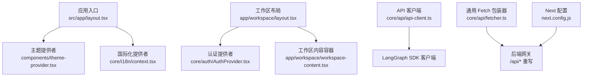
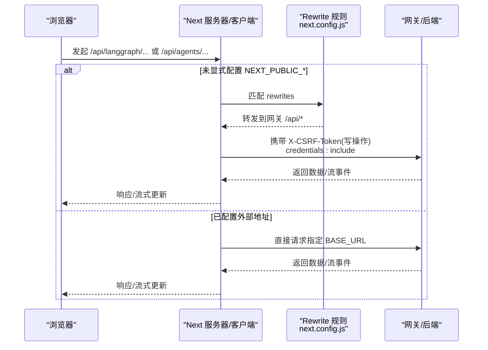
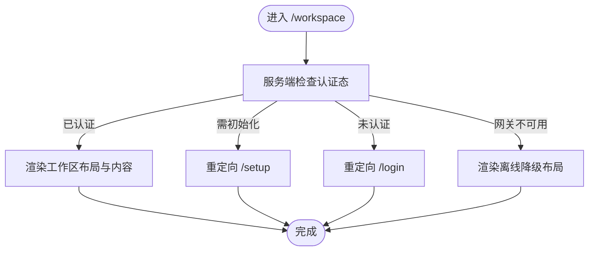
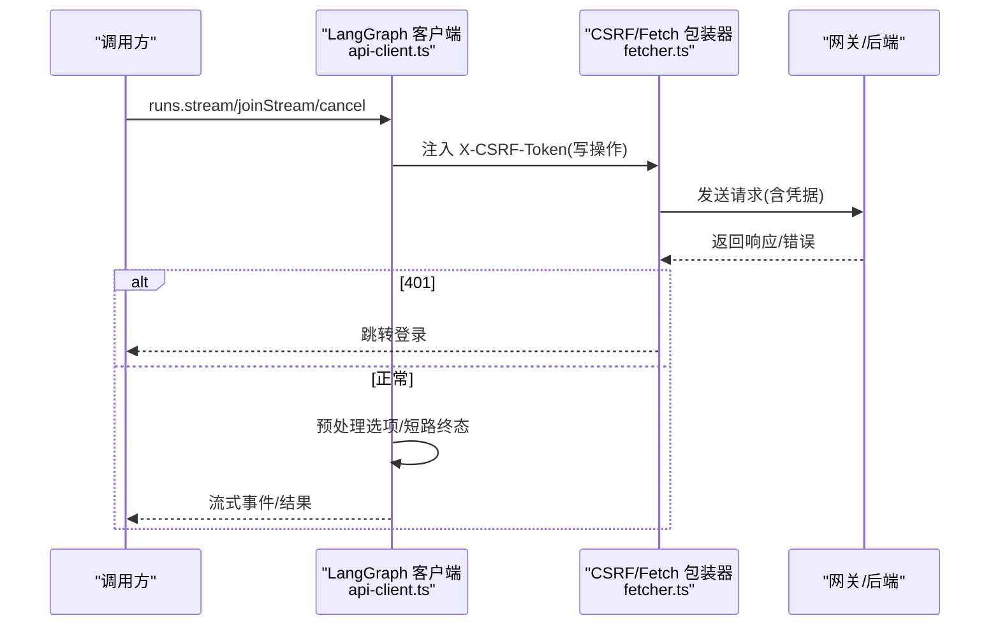
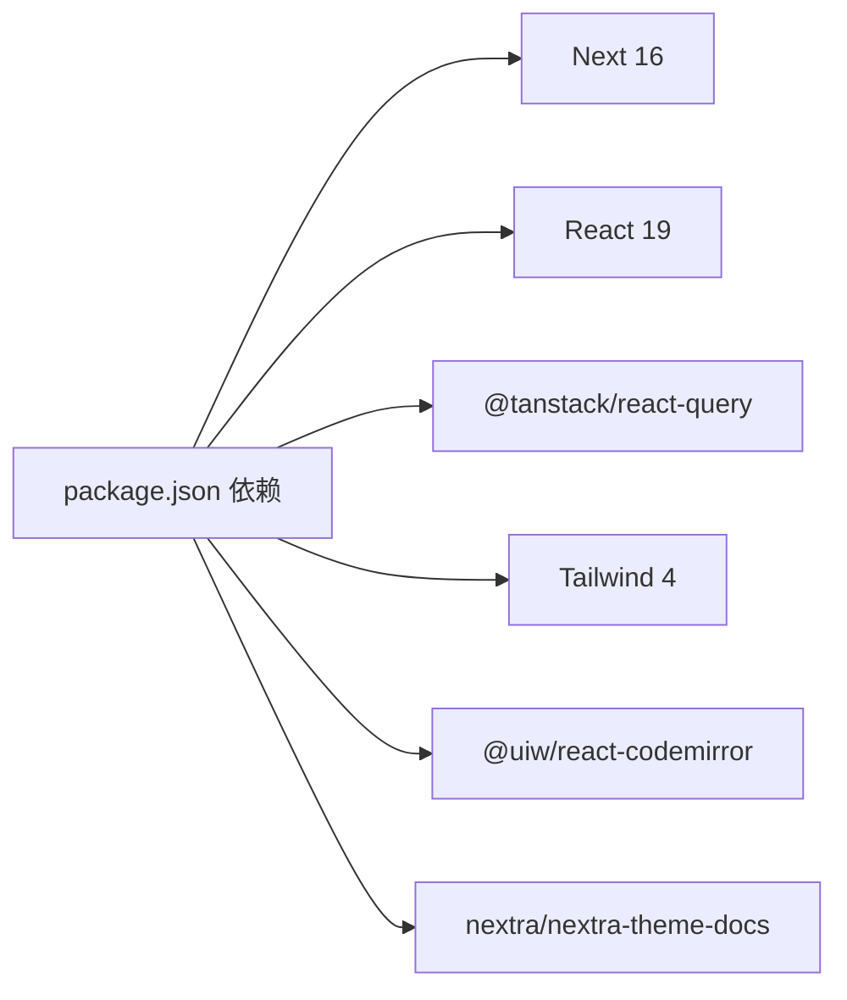

# 前端应用

<cite>
**本文引用的文件**   
- [package.json](file://frontend/package.json)
- [next.config.js](file://frontend/next.config.js)
- [layout.tsx](file://frontend/src/app/layout.tsx)
- [page.tsx](file://frontend/src/app/page.tsx)
- [workspace/layout.tsx](file://frontend/src/app/workspace/layout.tsx)
- [workspace/page.tsx](file://frontend/src/app/workspace/page.tsx)
- [context.tsx](file://frontend/src/core/i18n/context.tsx)
- [server.ts](file://frontend/src/core/i18n/server.ts)
- [en-US.ts](file://frontend/src/core/i18n/locales/en-US.ts)
- [zh-CN.ts](file://frontend/src/core/i18n/locales/zh-CN.ts)
- [theme-provider.tsx](file://frontend/src/components/theme-provider.tsx)
- [query-client-provider.tsx](file://frontend/src/components/query-client-provider.tsx)
- [api-client.ts](file://frontend/src/core/api/api-client.ts)
- [fetcher.ts](file://frontend/src/core/api/fetcher.ts)
</cite>

## 目录
1. [简介](#简介)
2. [项目结构](#项目结构)
3. [核心组件](#核心组件)
4. [架构总览](#架构总览)
5. [详细组件分析](#详细组件分析)
6. [依赖分析](#依赖分析)
7. [性能考虑](#性能考虑)
8. [故障排查指南](#故障排查指南)
9. [结论](#结论)
10. [附录](#附录)

## 简介
本技术文档面向 DeerFlow 前端应用，基于 Next.js 16 与 React 19，系统阐述其架构设计、组件层次、状态管理、路由组织、国际化机制、前后端通信策略（含错误处理与重试）、样式与主题、构建优化与兼容性。文档同时覆盖聊天界面、工作区管理、设置配置与实时监控等关键功能模块的实现要点与最佳实践。

## 项目结构
前端采用 Next.js App Router 组织页面与布局，结合模块化 core 层能力封装与可复用 UI 组件库：
- 应用入口与全局布局：根 layout 注入主题与国际化上下文；首页为着陆页；工作区路由集中承载对话、智能体、定时任务等功能。
- 国际化：服务端检测语言并持久化到 Cookie，客户端通过 Context 提供切换能力，资源按语言包拆分。
- API 访问：统一 LangGraph SDK 客户端封装，自动注入 CSRF 头、流式连接重连保护、终端状态短路；REST 请求使用带鉴权与 CSRF 的 fetch 包装器。
- 构建与重写：Next 配置中启用 i18n、开发指示关闭、根据环境变量将 /api/* 重写至网关地址，支持独立部署或同域代理。



图表来源
- [layout.tsx:1-29](file://frontend/src/app/layout.tsx#L1-L29)
- [theme-provider.tsx:1-20](file://frontend/src/components/theme-provider.tsx#L1-L20)
- [context.tsx:1-42](file://frontend/src/core/i18n/context.tsx#L1-L42)
- [workspace/layout.tsx:1-45](file://frontend/src/app/workspace/layout.tsx#L1-L45)
- [api-client.ts:1-287](file://frontend/src/core/api/api-client.ts#L1-L287)
- [fetcher.ts:1-105](file://frontend/src/core/api/fetcher.ts#L1-L105)
- [next.config.js:1-82](file://frontend/next.config.js#L1-L82)

章节来源
- [package.json:1-120](file://frontend/package.json#L1-L120)
- [next.config.js:1-82](file://frontend/next.config.js#L1-L82)
- [layout.tsx:1-29](file://frontend/src/app/layout.tsx#L1-L29)
- [page.tsx:1-26](file://frontend/src/app/page.tsx#L1-L26)
- [workspace/layout.tsx:1-45](file://frontend/src/app/workspace/layout.tsx#L1-L45)
- [workspace/page.tsx:1-21](file://frontend/src/app/workspace/page.tsx#L1-L21)

## 核心组件
- 主题提供者：在根布局中启用 next-themes，针对首页强制深色模式，其余页面跟随用户偏好。
- 国际化提供者：客户端维护当前 locale，切换时写入 Cookie；服务端读取 Cookie 并初始化初始语言。
- 查询客户端提供者：全局 TanStack Query 实例，用于数据缓存与失效策略。
- 工作区布局：在服务端校验认证状态，未登录/需初始化/网关不可用等分支分别重定向或降级渲染。
- API 客户端：对 LangGraph SDK 进行增强，包括 CSRF 注入、流式 joinStream 短路、取消冲突静默处理、静态站点兼容。
- 通用 Fetch：统一 credentials 与 CSRF 头注入，401 自动跳转登录。

章节来源
- [theme-provider.tsx:1-20](file://frontend/src/components/theme-provider.tsx#L1-L20)
- [context.tsx:1-42](file://frontend/src/core/i18n/context.tsx#L1-L42)
- [server.ts:1-42](file://frontend/src/core/i18n/server.ts#L1-L42)
- [query-client-provider.tsx:1-21](file://frontend/src/components/query-client-provider.tsx#L1-L21)
- [workspace/layout.tsx:1-45](file://frontend/src/app/workspace/layout.tsx#L1-L45)
- [api-client.ts:1-287](file://frontend/src/core/api/api-client.ts#L1-L287)
- [fetcher.ts:1-105](file://frontend/src/core/api/fetcher.ts#L1-L105)

## 架构总览
前端以 Next.js 作为运行时，App Router 负责路由与布局树；核心业务逻辑下沉至 core 层，UI 组件位于 components 目录。前后端通过网关聚合，Next 配置根据环境变量决定是否重写 /api/* 路径。



图表来源
- [next.config.js:28-78](file://frontend/next.config.js#L28-L78)
- [fetcher.ts:56-89](file://frontend/src/core/api/fetcher.ts#L56-L89)
- [api-client.ts:170-235](file://frontend/src/core/api/api-client.ts#L170-L235)

## 详细组件分析

### 路由与布局
- 根布局：注入 KaTeX 样式、全局 CSS、主题与国际化上下文，服务端检测语言并设置 html lang。
- 首页：着陆页，由多个区块组合而成。
- 工作区布局：服务端获取用户信息，按认证态与网关可用性分支渲染；未认证重定向登录，需要初始化重定向 setup，网关不可用时降级展示离线横幅。
- 工作区入口：静态站点模式下优先跳转到首个演示线程，否则进入新建对话。



图表来源
- [workspace/layout.tsx:12-44](file://frontend/src/app/workspace/layout.tsx#L12-L44)
- [workspace/page.tsx:8-20](file://frontend/src/app/workspace/page.tsx#L8-L20)
- [layout.tsx:15-28](file://frontend/src/app/layout.tsx#L15-L28)

章节来源
- [layout.tsx:1-29](file://frontend/src/app/layout.tsx#L1-L29)
- [page.tsx:1-26](file://frontend/src/app/page.tsx#L1-L26)
- [workspace/layout.tsx:1-45](file://frontend/src/app/workspace/layout.tsx#L1-L45)
- [workspace/page.tsx:1-21](file://frontend/src/app/workspace/page.tsx#L1-L21)

### 国际化（i18n）
- 服务端检测：从 Cookie 解析 locale，若无效则回退默认语言；提供 setLocale/getI18n 工具函数。
- 客户端切换：I18nProvider 维护 locale 状态，切换时写入 Cookie，子组件通过 useI18nContext 消费。
- 语言包：按 en-US/zh-CN 拆分翻译资源，包含常用文案、输入框提示、侧边栏、设置、通知、账号等。

```mermaid
classDiagram
class I18nProvider {
+locale : Locale
+setLocale(locale) : void
}
class ServerI18n {
+detectLocaleServer() : Promise~Locale~
+setLocale(locale) : Promise~Locale~
+getI18n(override?) : Promise~{locale,t}~
}
class Translations {
<<object>>
}
I18nProvider --> Translations : "消费本地化资源"
ServerI18n --> Translations : "加载对应语言包"
```

图表来源
- [context.tsx:14-41](file://frontend/src/core/i18n/context.tsx#L14-L41)
- [server.ts:6-41](file://frontend/src/core/i18n/server.ts#L6-L41)
- [en-US.ts:14-800](file://frontend/src/core/i18n/locales/en-US.ts#L14-L800)
- [zh-CN.ts:14-782](file://frontend/src/core/i18n/locales/zh-CN.ts#L14-L782)

章节来源
- [context.tsx:1-42](file://frontend/src/core/i18n/context.tsx#L1-L42)
- [server.ts:1-42](file://frontend/src/core/i18n/server.ts#L1-L42)
- [en-US.ts:1-810](file://frontend/src/core/i18n/locales/en-US.ts#L1-L810)
- [zh-CN.ts:1-782](file://frontend/src/core/i18n/locales/zh-CN.ts#L1-L782)

### 主题与样式
- 主题提供者：在根布局内包裹 next-themes，首页强制深色，其他页面遵循系统或用户选择。
- 样式体系：Tailwind 4 驱动，全局样式与 KaTeX 样式在根布局引入；组件库基于 Radix UI 与自定义样式。

章节来源
- [theme-provider.tsx:1-20](file://frontend/src/components/theme-provider.tsx#L1-L20)
- [layout.tsx:1-29](file://frontend/src/app/layout.tsx#L1-L29)

### 状态管理与数据缓存
- 全局查询客户端：TanStack Query 单例，提供跨组件的数据缓存、失效与重试策略。
- 工作区状态：认证态由 AuthProvider 管理；工作区布局在服务端决定渲染分支。

章节来源
- [query-client-provider.tsx:1-21](file://frontend/src/components/query-client-provider.tsx#L1-L21)
- [workspace/layout.tsx:12-44](file://frontend/src/app/workspace/layout.tsx#L12-L44)

### 前后端通信与错误处理
- REST 请求：统一 fetch 包装器，自动附加 credentials 与 X-CSRF-Token，401 自动跳转登录。
- LangGraph SDK 客户端：
  - 注入 CSRF 头：仅对状态变更方法添加。
  - 流式连接保护：joinStream 前预检运行状态，避免对已结束运行阻塞；清理重连键。
  - 取消冲突静默：当运行已达终态，cancel 抛出的 409 被吞掉并清理重连键。
  - 静态站点兼容：无后端时提供模拟实现，使演示与预览可用。



图表来源
- [api-client.ts:170-235](file://frontend/src/core/api/api-client.ts#L170-L235)
- [fetcher.ts:56-89](file://frontend/src/core/api/fetcher.ts#L56-L89)

章节来源
- [api-client.ts:1-287](file://frontend/src/core/api/api-client.ts#L1-L287)
- [fetcher.ts:1-105](file://frontend/src/core/api/fetcher.ts#L1-L105)

### 构建与重写
- i18n 配置：声明支持 en/zh，默认 en。
- 重写规则：在未显式配置外部 BASE_URL 时，将 /api/langgraph、/api/agents、/api/skills 及通配 /api/* 重写至网关地址；保留 LangGraph 兼容路径前缀。
- 输出模式：支持 standalone 输出以便容器化部署。

章节来源
- [next.config.js:18-81](file://frontend/next.config.js#L18-L81)

## 依赖分析
- 运行时依赖：Next 16、React 19、TanStack Query、Radix UI、Tailwind 4、CodeMirror、Nextra 文档主题等。
- 开发依赖：ESLint、Prettier、Playwright、TypeScript、PostCSS/Tailwind 插件等。
- 构建脚本：build/dev/start/test/e2e/typecheck/lint/format 等。



图表来源
- [package.json:21-114](file://frontend/package.json#L21-L114)

章节来源
- [package.json:1-120](file://frontend/package.json#L1-L120)

## 性能考虑
- 流式渲染与短路：对已结束运行的 joinStream 提前短路，避免 UI 卡死与按钮状态异常。
- 缓存与去抖：TanStack Query 全局缓存减少重复请求；可根据业务场景调整 staleTime/gcTime。
- 静态站点模式：在无后端环境下提供只读演示数据，提升可演示性与首屏体验。
- 构建产物：standalone 输出便于容器化与冷启动优化；按需引入 CodeMirror 语言扩展降低包体。

[本节为通用指导，不直接分析具体文件]

## 故障排查指南
- 401 未授权：统一包装器会跳转登录页，检查 Cookie 是否生效、跨域与 SameSite 配置。
- CSRF 失败：确认写操作是否携带 X-CSRF-Token，且与 csrf_token Cookie 一致；检查 isStateChangingMethod 判断是否与网关一致。
- 流式连接挂起：检查运行是否处于终态（success/error/timeout/interrupted），必要时清理重连键后重新提交。
- 网关不可用：工作区布局会显示离线横幅与重试提示，确认环境变量与重写规则是否正确。

章节来源
- [fetcher.ts:56-89](file://frontend/src/core/api/fetcher.ts#L56-L89)
- [api-client.ts:140-235](file://frontend/src/core/api/api-client.ts#L140-L235)
- [workspace/layout.tsx:30-38](file://frontend/src/app/workspace/layout.tsx#L30-L38)

## 结论
DeerFlow 前端以 Next.js 16 与 React 19 为基础，采用 App Router 与模块化 core 层，配合 TanStack Query 与主题/国际化提供者，形成清晰的分层与可扩展的架构。API 层对 LangGraph SDK 进行了安全与健壮性增强，结合 Next 的重写与多语言支持，提供了良好的开发与部署体验。后续可在缓存策略、错误上报与监控方面进一步细化。

[本节为总结，不直接分析具体文件]

## 附录
- 组件开发建议
  - 样式：优先使用 Tailwind 原子类，复杂样式放入组件级样式文件；主题色通过 next-themes 变量控制。
  - 主题定制：在 ThemeProvider 中扩展 forcedTheme 或监听系统主题变化。
  - 响应式：利用 Tailwind 断点与移动端 Hook 适配不同屏幕尺寸。
- 国际化扩展
  - 新增语言：在 locales 下新增语言包，并在 server.ts 的 normalizeLocale 中注册。
  - 动态文案：使用函数型翻译值以支持插值与复数形式。
- 构建与发布
  - 环境变量：NEXT_PUBLIC_* 控制 API 基址与静态站点模式；DEER_FLOW_INTERNAL_GATEWAY_BASE_URL 控制内部重写目标。
  - 容器化：standalone 输出可直接被 Node 运行时启动，配合反向代理提供服务。

[本节为通用指导，不直接分析具体文件]