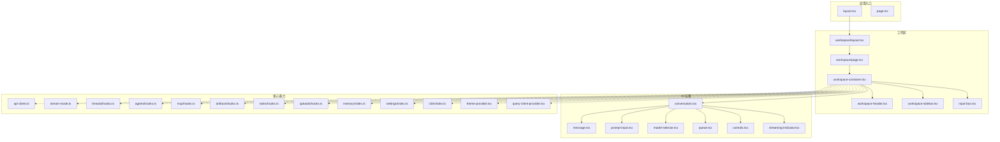
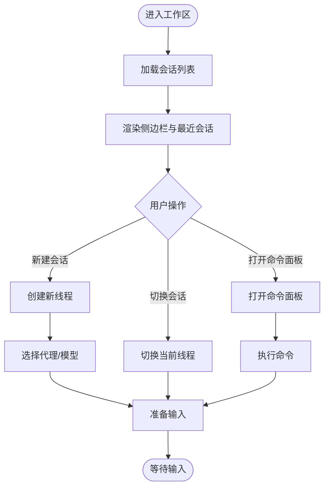
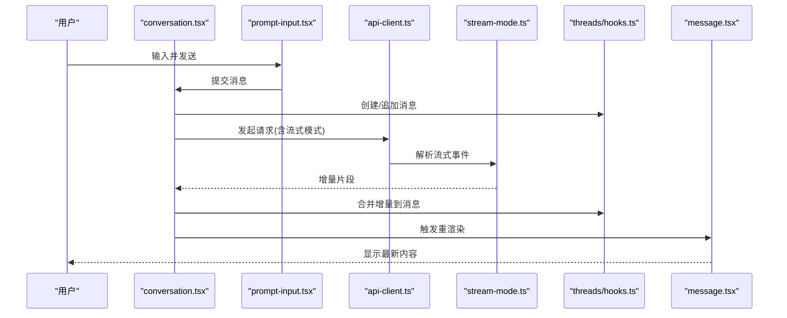
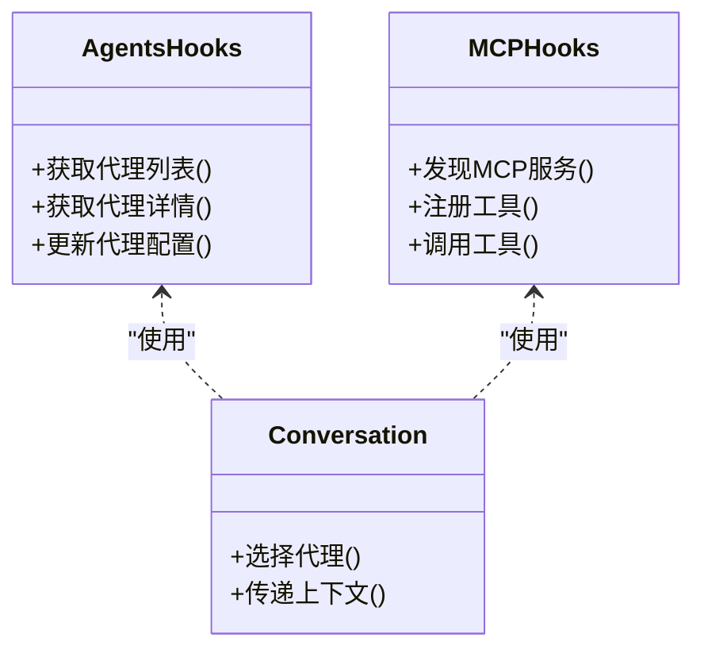
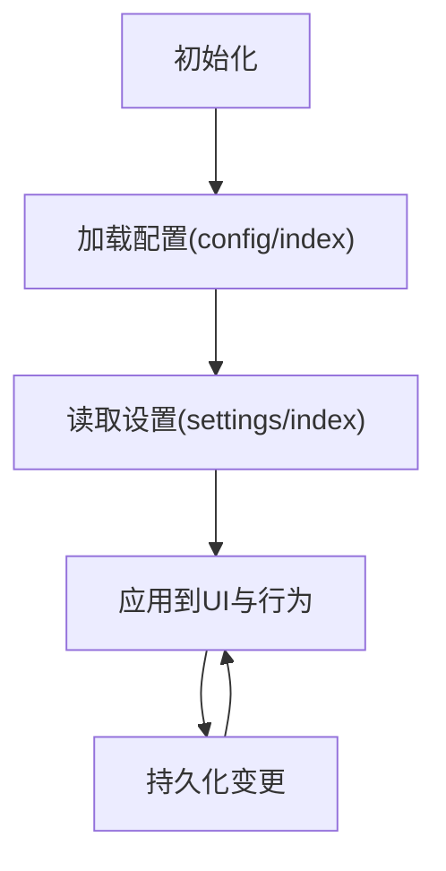
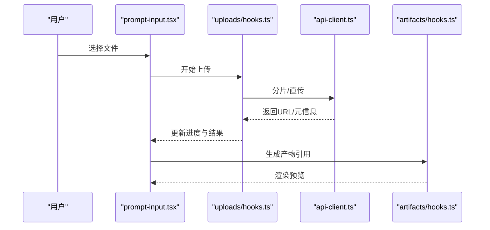
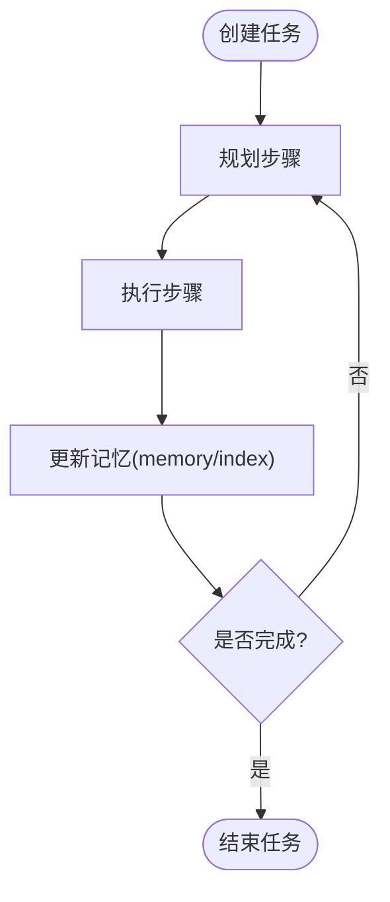
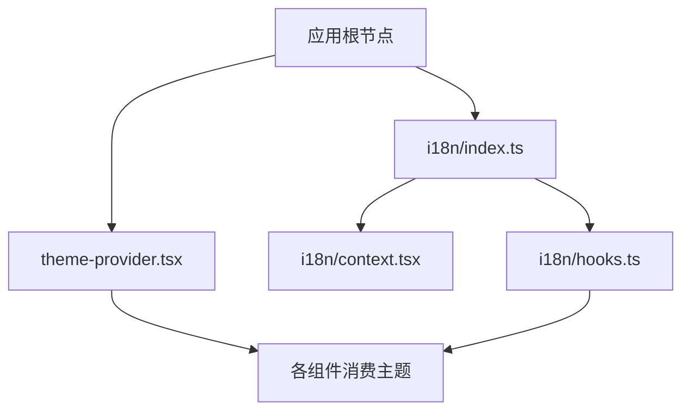
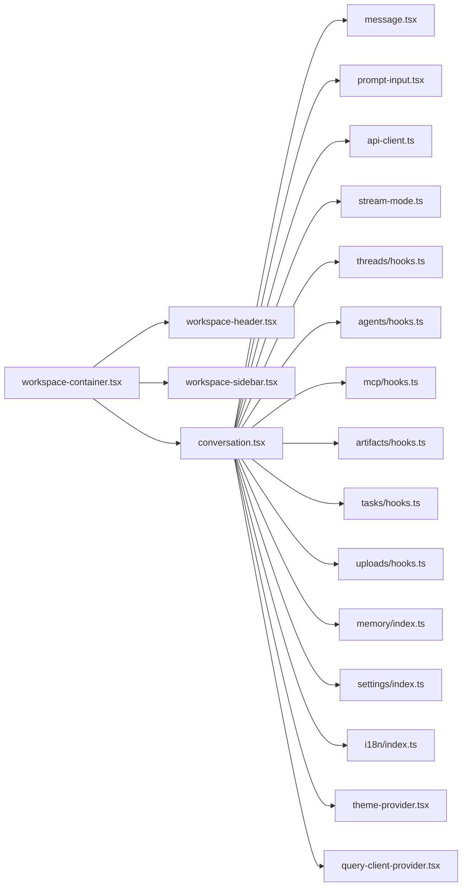

# 前端应用

<cite>
**本文引用的文件**
- [frontend/package.json](file://frontend/package.json)
- [frontend/next.config.js](file://frontend/next.config.js)
- [frontend/src/app/layout.tsx](file://frontend/src/app/layout.tsx)
- [frontend/src/app/page.tsx](file://frontend/src/app/page.tsx)
- [frontend/src/app/workspace/layout.tsx](file://frontend/src/app/workspace/layout.tsx)
- [frontend/src/app/workspace/page.tsx](file://frontend/src/app/workspace/page.tsx)
- [frontend/src/components/theme-provider.tsx](file://frontend/src/components/theme-provider.tsx)
- [frontend/src/components/query-client-provider.tsx](file://frontend/src/components/query-client-provider.tsx)
- [frontend/src/core/i18n/index.ts](file://frontend/src/core/i18n/index.ts)
- [frontend/src/core/i18n/context.tsx](file://frontend/src/core/i18n/context.tsx)
- [frontend/src/core/i18n/hooks.ts](file://frontend/src/core/i18n/hooks.ts)
- [frontend/src/core/api/api-client.ts](file://frontend/src/core/api/api-client.ts)
- [frontend/src/core/api/stream-mode.ts](file://frontend/src/core/api/stream-mode.ts)
- [frontend/src/core/threads/hooks.ts](file://frontend/src/core/threads/hooks.ts)
- [frontend/src/core/agents/hooks.ts](file://frontend/src/core/agents/hooks.ts)
- [frontend/src/core/settings/index.ts](file://frontend/src/core/settings/index.ts)
- [frontend/src/core/mcp/hooks.ts](file://frontend/src/core/mcp/hooks.ts)
- [frontend/src/core/artifacts/hooks.ts](file://frontend/src/core/artifacts/hooks.ts)
- [frontend/src/core/tasks/hooks.ts](file://frontend/src/core/tasks/hooks.ts)
- [frontend/src/core/uploads/hooks.ts](file://frontend/src/core/uploads/hooks.ts)
- [frontend/src/core/memory/index.ts](file://frontend/src/core/memory/index.ts)
- [frontend/src/core/config/index.ts](file://frontend/src/core/config/index.ts)
- [frontend/src/components/workspace/workspace-container.tsx](file://frontend/src/components/workspace/workspace-container.tsx)
- [frontend/src/components/workspace/workspace-header.tsx](file://frontend/src/components/workspace/workspace-header.tsx)
- [frontend/src/components/workspace/workspace-sidebar.tsx](file://frontend/src/components/workspace/workspace-sidebar.tsx)
- [frontend/src/components/workspace/workspace-nav-chat-list.tsx](file://frontend/src/components/workspace/workspace-nav-chat-list.tsx)
- [frontend/src/components/workspace/workspace-nav-menu.tsx](file://frontend/src/components/workspace/workspace-nav-menu.tsx)
- [frontend/src/components/workspace/input-box.tsx](file://frontend/src/components/workspace/input-box.tsx)
- [frontend/src/components/workspace/recent-chat-list.tsx](file://frontend/src/components/workspace/recent-chat-list.tsx)
- [frontend/src/components/workspace/thread-title.tsx](file://frontend/src/components/workspace/thread-title.tsx)
- [frontend/src/components/workspace/command-palette.tsx](file://frontend/src/components/workspace/command-palette.tsx)
- [frontend/src/components/workspace/token-usage-indicator.tsx](file://frontend/src/components/workspace/token-usage-indicator.tsx)
- [frontend/src/components/workspace/streaming-indicator.tsx](file://frontend/src/components/workspace/streaming-indicator.tsx)
- [frontend/src/components/workspace/code-editor.tsx](file://frontend/src/components/workspace/code-editor.tsx)
- [frontend/src/components/workspace/copy-button.tsx](file://frontend/src/components/workspace/copy-button.tsx)
- [frontend/src/components/workspace/export-trigger.tsx](file://frontend/src/components/workspace/export-trigger.tsx)
- [frontend/src/components/workspace/agent-welcome.tsx](file://frontend/src/components/workspace/agent-welcome.tsx)
- [frontend/src/components/workspace/welcome.tsx](file://frontend/src/components/workspace/welcome.tsx)
- [frontend/src/components/workspace/flip-display.tsx](file://frontend/src/components/workspace/flip-display.tsx)
- [frontend/src/components/workspace/mode-hover-guide.tsx](file://frontend/src/components/workspace/mode-hover-guide.tsx)
- [frontend/src/components/workspace/overscroll.tsx](file://frontend/src/components/workspace/overscroll.tsx)
- [frontend/src/components/workspace/todo-list.tsx](file://frontend/src/components/workspace/todo-list.tsx)
- [frontend/src/components/workspace/tooltip.tsx](file://frontend/src/components/workspace/tooltip.tsx)
- [frontend/src/components/ai-elements/conversation.tsx](file://frontend/src/components/ai-elements/conversation.tsx)
- [frontend/src/components/ai-elements/message.tsx](file://frontend/src/components/ai-elements/message.tsx)
- [frontend/src/components/ai-elements/prompt-input.tsx](file://frontend/src/components/ai-elements/prompt-input.tsx)
- [frontend/src/components/ai-elements/model-selector.tsx](file://frontend/src/components/ai-elements/model-selector.tsx)
- [frontend/src/components/ai-elements/queue.tsx](file://frontend/src/components/ai-elements/queue.tsx)
- [frontend/src/components/ai-elements/chain-of-thought.tsx](file://frontend/src/components/ai-elements/chain-of-thought.tsx)
- [frontend/src/components/ai-elements/task.tsx](file://frontend/src/components/ai-elements/task.tsx)
- [frontend/src/components/ai-elements/suggestion.tsx](file://frontend/src/components/ai-elements/suggestion.tsx)
- [frontend/src/components/ai-elements/sources.tsx](file://frontend/src/components/ai-elements/sources.tsx)
- [frontend/src/components/ai-elements/web-preview.tsx](file://frontend/src/components/ai-elements/web-preview.tsx)
- [frontend/src/components/ai-elements/artifact.tsx](file://frontend/src/components/ai-elements/artifact.tsx)
- [frontend/src/components/ai-elements/checkpoint.tsx](file://frontend/src/components/ai-elements/checkpoint.tsx)
- [frontend/src/components/ai-elements/plan.tsx](file://frontend/src/components/ai-elements/plan.tsx)
- [frontend/src/components/ai-elements/controls.tsx](file://frontend/src/components/ai-elements/controls.tsx)
- [frontend/src/components/ai-elements/loader.tsx](file://frontend/src/components/ai-elements/loader.tsx)
- [frontend/src/components/ai-elements/shimmer.tsx](file://frontend/src/components/ai-elements/shimmer.tsx)
- [frontend/src/components/ai-elements/reasoning.tsx](file://frontend/src/components/ai-elements/reasoning.tsx)
- [frontend/src/components/ai-elements/image.tsx](file://frontend/src/components/ai-elements/image.tsx)
- [frontend/src/components/ai-elements/canvas.tsx](file://frontend/src/components/ai-elements/canvas.tsx)
- [frontend/src/components/ai-elements/node.tsx](file://frontend/src/components/ai-elements/node.tsx)
- [frontend/src/components/ai-elements/edge.tsx](file://frontend/src/components/ai-elements/edge.tsx)
- [frontend/src/components/ai-elements/connection.tsx](file://frontend/src/components/ai-elements/connection.tsx)
- [frontend/src/components/ai-elements/open-in-chat.tsx](file://frontend/src/components/ai-elements/open-in-chat.tsx)
- [frontend/src/components/ai-elements/panel.tsx](file://frontend/src/components/ai-elements/panel.tsx)
- [frontend/src/components/ai-elements/toolbar.tsx](file://frontend/src/components/ai-elements/toolbar.tsx)
- [frontend/src/components/ai-elements/code-block.tsx](file://frontend/src/components/ai-elements/code-block.tsx)
- [frontend/src/components/ui/button.tsx](file://frontend/src/components/ui/button.tsx)
- [frontend/src/components/ui/dialog.tsx](file://frontend/src/components/ui/dialog.tsx)
- [frontend/src/components/ui/input.tsx](file://frontend/src/components/ui/input.tsx)
- [frontend/src/components/ui/select.tsx](file://frontend/src/components/ui/select.tsx)
- [frontend/src/components/ui/tabs.tsx](file://frontend/src/components/ui/tabs.tsx)
- [frontend/src/components/ui/card.tsx](file://frontend/src/components/ui/card.tsx)
- [frontend/src/components/ui/badge.tsx](file://frontend/src/components/ui/badge.tsx)
- [frontend/src/components/ui/alert.tsx](file://frontend/src/components/ui/alert.tsx)
- [frontend/src/components/ui/switch.tsx](file://frontend/src/components/ui/switch.tsx)
- [frontend/src/components/ui/separator.tsx](file://frontend/src/components/ui/separator.tsx)
- [frontend/src/components/ui/scroll-area.tsx](file://frontend/src/components/ui/scroll-area.tsx)
- [frontend/src/components/ui/sidebar.tsx](file://frontend/src/components/ui/sidebar.tsx)
- [frontend/src/components/ui/resizable.tsx](file://frontend/src/components/ui/resizable.tsx)
- [frontend/src/components/ui/textarea.tsx](file://frontend/src/components/ui/textarea.tsx)
- [frontend/src/components/ui/tooltip.tsx](file://frontend/src/components/ui/tooltip.tsx)
- [frontend/src/components/ui/progress.tsx](file://frontend/src/components/ui/progress.tsx)
- [frontend/src/components/ui/skeleton.tsx](file://frontend/src/components/ui/skeleton.tsx)
- [frontend/src/components/ui/sonner.tsx](file://frontend/src/components/ui/sonner.tsx)
- [frontend/src/components/ui/hover-card.tsx](file://frontend/src/components/ui/hover-card.tsx)
- [frontend/src/components/ui/dropdown-menu.tsx](file://frontend/src/components/ui/dropdown-menu.tsx)
- [frontend/src/components/ui/collapsible.tsx](file://frontend/src/components/ui/collapsible.tsx)
- [frontend/src/components/ui/breadcrumb.tsx](file://frontend/src/components/ui/breadcrumb.tsx)
- [frontend/src/components/ui/avatar.tsx](file://frontend/src/components/ui/avatar.tsx)
- [frontend/src/components/ui/empty.tsx](file://frontend/src/components/ui/empty.tsx)
- [frontend/src/components/ui/terminal.tsx](file://frontend/src/components/ui/terminal.tsx)
- [frontend/src/components/ui/input-group.tsx](file://frontend/src/components/ui/input-group.tsx)
- [frontend/src/components/ui/item.tsx](file://frontend/src/components/ui/item.tsx)
- [frontend/src/components/ui/toggle.tsx](file://frontend/src/components/ui/toggle.tsx)
- [frontend/src/components/ui/toggle-group.tsx](file://frontend/src/components/ui/toggle-group.tsx)
- [frontend/src/components/ui/number-ticker.tsx](file://frontend/src/components/ui/number-ticker.tsx)
- [frontend/src/components/ui/word-rotate.tsx](file://frontend/src/components/ui/word-rotate.tsx)
- [frontend/src/components/ui/confetti-button.tsx](file://frontend/src/components/ui/confetti-button.tsx)
- [frontend/src/components/ui/galaxy.jsx](file://frontend/src/components/ui/galaxy.jsx)
- [frontend/src/components/ui/sparkle-border.tsx](file://frontend/src/components/ui/sparkle-border.tsx)
- [frontend/src/components/ui/flickering-grid.tsx](file://frontend/src/components/ui/flickering-grid.tsx)
- [frontend/src/components/ui/aurora-text.tsx](file://frontend/src/components/ui/aurora-text.tsx)
- [frontend/src/components/ui/spotlight-card.tsx](file://frontend/src/components/ui/spotlight-card.tsx)
- [frontend/src/components/ui/magic-bento.tsx](file://frontend/src/components/ui/magic-bento.tsx)
- [frontend/src/components/ui/carousel.tsx](file://frontend/src/components/ui/carousel.tsx)
- [frontend/src/components/ui/progress.tsx](file://frontend/src/components/ui/progress.tsx)
- [frontend/src/components/ui/progress.tsx](file://frontend/src/components/ui/progress.tsx)
- [frontend/src/components/ui/progress.tsx](file://frontend/src/components/ui/progress.tsx)
- [frontend/src/components/ui/progress.tsx](file://frontend/src/components/ui/progress.tsx)
- [frontend/src/components/ui/progress.tsx](file://frontend/src/components/ui/progress.tsx)
- [frontend/src/components/ui/progress.tsx](file://frontend/src/components/ui/progress.tsx)
- [frontend/src/components/ui/progress.tsx](file://frontend/src/components/ui/progress.tsx)
- [frontend/src/components/ui/progress.tsx](file://frontend/src/components/ui/progress.tsx)
- [frontend/src/components/ui/progress.tsx](file://frontend/src/components/ui/progress.tsx)
- [frontend/src/components/ui/progress.tsx](file://frontend/src/components/ui/progress.tsx)
- [frontend/src/components/ui/progress.tsx](file://frontend/src/components/ui/progress.tsx)
- [frontend/src/components/ui/progress.tsx](file://frontend/src/components/ui/progress.tsx)
- [frontend/src/components/ui/progress.tsx](file://frontend/src/components/ui/progress.tsx)
- [frontend/src/components/ui/progress.tsx](file://frontend/src/components/ui/progress.tsx)
- [frontend/src/components/ui/progress.tsx](file://frontend/src/components/ui/progress.tsx)
- [frontend/src/components/ui/progress.tsx](file://frontend/src/components/ui/progress.tsx)
- [frontend/src/components/ui/progress.tsx](file://frontend/src/components/ui/progress.tsx)
- [frontend/src/components/ui/progress.tsx](file://frontend/src/components/ui/progress.tsx)
- [frontend/src/components/ui/progress.tsx](file://frontend/src/components/ui/progress.tsx)
- [frontend/src/components/ui/progress.tsx](file://frontend/src/components/ui/progress.tsx)
- [frontend/src/components/ui/progress.tsx](file://frontend/src/components/ui/progress.tsx)
- [frontend/src/components/ui/progress.tsx](file://frontend/src/components/ui/progress.tsx)
- [frontend/src/components/ui/......](file://frontend/src/components/ui/......)
- [frontend/src/app/workspace/chats/page.tsx](file://frontend/src/app/workspace/chats/page.tsx)
- [frontend/src/app/workspace/agents/page.tsx](file://frontend/src/app/workspace/agents/page.tsx)
- [frontend/src/app/workspace/settings/page.tsx](file://frontend/src/app/workspace/settings/page.tsx)
- [frontend/src/core/memory/index.ts](file://frontend/src/core/memory/index.ts)
- [frontend/src/core/config/index.ts](file://frontend/src/core/config/index.ts)
</cite>

## 目录
1. [简介](#简介)
2. [项目结构](#项目结构)
3. [核心组件](#核心组件)
4. [架构总览](#架构总览)
5. [详细组件分析](#详细组件分析)
6. [依赖关系分析](#依赖关系分析)
7. [性能考虑](#性能考虑)
8. [故障排查指南](#故障排查指南)
9. [结论](#结论)
10. [附录](#附录)

## 简介
本文件面向 DeerFlow 前端应用，基于 Next.js 与 React 技术栈，聚焦工作区（Workspace）能力：代理管理、聊天界面、设置配置等核心模块；阐述实时通信机制（流式响应与状态同步）、主题定制与国际化支持、前端状态管理方案（React Context、Zustand 等）、开发规范与最佳实践、构建优化与部署配置，以及调试技巧与性能优化建议。

## 项目结构
前端位于 frontend 目录，采用 App Router 组织页面与布局，核心业务逻辑集中在 src/core 下，UI 组件分为 ai-elements、workspace、ui 三类，i18n 与主题通过独立模块提供。

```mermaid
graph TB
A["src/app/layout.tsx"] --> B["src/app/page.tsx"]
A --> C["src/app/workspace/layout.tsx"]
C --> D["src/app/workspace/page.tsx"]
D --> E["src/components/workspace/workspace-container.tsx"]
E --> F["src/components/workspace/workspace-header.tsx"]
E --> G["src/components/workspace/workspace-sidebar.tsx"]
E --> H["src/components/workspace/input-box.tsx"]
E --> I["src/components/ai-elements/conversation.tsx"]
I --> J["src/components/ai-elements/message.tsx"]
I --> K["src/components/ai-elements/prompt-input.tsx"]
E --> L["src/components/workspace/recent-chat-list.tsx"]
E --> M["src/components/workspace/thread-title.tsx"]
E --> N["src/components/workspace/command-palette.tsx"]
E --> O["src/components/workspace/token-usage-indicator.tsx"]
E --> P["src/components/workspace/streaming-indicator.tsx"]
subgraph "核心能力"
Q["src/core/api/api-client.ts"]
R["src/core/api/stream-mode.ts"]
S["src/core/threads/hooks.ts"]
T["src/core/agents/hooks.ts"]
U["src/core/mcp/hooks.ts"]
V["src/core/artifacts/hooks.ts"]
W["src/core/tasks/hooks.ts"]
X["src/core/uploads/hooks.ts"]
Y["src/core/memory/index.ts"]
Z["src/core/settings/index.ts"]
AA["src/core/i18n/index.ts"]
AB["src/components/theme-provider.tsx"]
AC["src/components/query-client-provider.tsx"]
end
E -.-> Q
E -.-> R
E -.-> S
E -.-> T
E -.-> U
E -.-> V
E -.-> W
E -.-> X
E -.-> Y
E -.-> Z
E -.-> AA
E -.-> AB
E -.-> AC
```

图表来源
- [frontend/src/app/layout.tsx](file://frontend/src/app/layout.tsx)
- [frontend/src/app/page.tsx](file://frontend/src/app/page.tsx)
- [frontend/src/app/workspace/layout.tsx](file://frontend/src/app/workspace/layout.tsx)
- [frontend/src/app/workspace/page.tsx](file://frontend/src/app/workspace/page.tsx)
- [frontend/src/components/workspace/workspace-container.tsx](file://frontend/src/components/workspace/workspace-container.tsx)
- [frontend/src/components/workspace/workspace-header.tsx](file://frontend/src/components/workspace/workspace-header.tsx)
- [frontend/src/components/workspace/workspace-sidebar.tsx](file://frontend/src/components/workspace/workspace-sidebar.tsx)
- [frontend/src/components/workspace/input-box.tsx](file://frontend/src/components/workspace/input-box.tsx)
- [frontend/src/components/ai-elements/conversation.tsx](file://frontend/src/components/ai-elements/conversation.tsx)
- [frontend/src/components/ai-elements/message.tsx](file://frontend/src/components/ai-elements/message.tsx)
- [frontend/src/components/ai-elements/prompt-input.tsx](file://frontend/src/components/ai-elements/prompt-input.tsx)
- [frontend/src/components/workspace/recent-chat-list.tsx](file://frontend/src/components/workspace/recent-chat-list.tsx)
- [frontend/src/components/workspace/thread-title.tsx](file://frontend/src/components/workspace/thread-title.tsx)
- [frontend/src/components/workspace/command-palette.tsx](file://frontend/src/components/workspace/command-palette.tsx)
- [frontend/src/components/workspace/token-usage-indicator.tsx](file://frontend/src/components/workspace/token-usage-indicator.tsx)
- [frontend/src/components/workspace/streaming-indicator.tsx](file://frontend/src/components/workspace/streaming-indicator.tsx)
- [frontend/src/core/api/api-client.ts](file://frontend/src/core/api/api-client.ts)
- [frontend/src/core/api/stream-mode.ts](file://frontend/src/core/api/stream-mode.ts)
- [frontend/src/core/threads/hooks.ts](file://frontend/src/core/threads/hooks.ts)
- [frontend/src/core/agents/hooks.ts](file://frontend/src/core/agents/hooks.ts)
- [frontend/src/core/mcp/hooks.ts](file://frontend/src/core/mcp/hooks.ts)
- [frontend/src/core/artifacts/hooks.ts](file://frontend/src/core/artifacts/hooks.ts)
- [frontend/src/core/tasks/hooks.ts](file://frontend/src/core/tasks/hooks.ts)
- [frontend/src/core/uploads/hooks.ts](file://frontend/src/core/uploads/hooks.ts)
- [frontend/src/core/memory/index.ts](file://frontend/src/core/memory/index.ts)
- [frontend/src/core/settings/index.ts](file://frontend/src/core/settings/index.ts)
- [frontend/src/core/i18n/index.ts](file://frontend/src/core/i18n/index.ts)
- [frontend/src/components/theme-provider.tsx](file://frontend/src/components/theme-provider.tsx)
- [frontend/src/components/query-client-provider.tsx](file://frontend/src/components/query-client-provider.tsx)

章节来源
- [frontend/package.json](file://frontend/package.json)
- [frontend/next.config.js](file://frontend/next.config.js)
- [frontend/src/app/layout.tsx](file://frontend/src/app/layout.tsx)
- [frontend/src/app/page.tsx](file://frontend/src/app/page.tsx)
- [frontend/src/app/workspace/layout.tsx](file://frontend/src/app/workspace/layout.tsx)
- [frontend/src/app/workspace/page.tsx](file://frontend/src/app/workspace/page.tsx)

## 核心组件
- 工作区容器与导航
  - workspace-container：承载主布局与侧边栏、头部、输入框、消息列表等区域。
  - workspace-header：展示标题、模型选择、工具栏等。
  - workspace-sidebar：包含会话列表、最近会话、命令面板入口等。
  - recent-chat-list / thread-title：会话管理与标题编辑。
  - command-palette：全局快捷键与命令搜索。
- AI 对话与渲染
  - conversation：会话编排与消息渲染。
  - message：单条消息渲染（文本、代码块、图片、卡片等）。
  - prompt-input：用户输入与附件上传。
  - model-selector：模型切换。
  - queue / controls / streaming-indicator：队列与运行态控制。
  - chain-of-thought / task / suggestion / sources / plan / artifact / checkpoint / reasoning：结构化内容渲染。
- 通用 UI 组件
  - ui 目录下按钮、对话框、输入、选择、标签页、卡片、进度、骨架屏等基础组件。
- 核心能力封装
  - api-client：统一请求封装。
  - stream-mode：流式模式处理。
  - threads/hooks：会话数据与操作 Hook。
  - agents/hooks：代理相关 Hook。
  - mcp/hooks：MCP 集成 Hook。
  - artifacts/hooks：产物加载与预览 Hook。
  - tasks/hooks：任务管理 Hook。
  - uploads/hooks：上传流程 Hook。
  - memory/index：记忆存储抽象。
  - settings/index：设置持久化与访问。
  - i18n：多语言上下文与 Hook。
  - theme-provider：主题上下文。
  - query-client-provider：查询客户端提供者。

章节来源
- [frontend/src/components/workspace/workspace-container.tsx](file://frontend/src/components/workspace/workspace-container.tsx)
- [frontend/src/components/workspace/workspace-header.tsx](file://frontend/src/components/workspace/workspace-header.tsx)
- [frontend/src/components/workspace/workspace-sidebar.tsx](file://frontend/src/components/workspace/workspace-sidebar.tsx)
- [frontend/src/components/workspace/recent-chat-list.tsx](file://frontend/src/components/workspace/recent-chat-list.tsx)
- [frontend/src/components/workspace/thread-title.tsx](file://frontend/src/components/workspace/thread-title.tsx)
- [frontend/src/components/workspace/command-palette.tsx](file://frontend/src/components/workspace/command-palette.tsx)
- [frontend/src/components/ai-elements/conversation.tsx](file://frontend/src/components/ai-elements/conversation.tsx)
- [frontend/src/components/ai-elements/message.tsx](file://frontend/src/components/ai-elements/message.tsx)
- [frontend/src/components/ai-elements/prompt-input.tsx](file://frontend/src/components/ai-elements/prompt-input.tsx)
- [frontend/src/components/ai-elements/model-selector.tsx](file://frontend/src/components/ai-elements/model-selector.tsx)
- [frontend/src/components/ai-elements/queue.tsx](file://frontend/src/components/ai-elements/queue.tsx)
- [frontend/src/components/ai-elements/controls.tsx](file://frontend/src/components/ai-elements/controls.tsx)
- [frontend/src/components/ai-elements/streaming-indicator.tsx](file://frontend/src/components/ai-elements/streaming-indicator.tsx)
- [frontend/src/components/ai-elements/chain-of-thought.tsx](file://frontend/src/components/ai-elements/chain-of-thought.tsx)
- [frontend/src/components/ai-elements/task.tsx](file://frontend/src/components/ai-elements/task.tsx)
- [frontend/src/components/ai-elements/suggestion.tsx](file://frontend/src/components/ai-elements/suggestion.tsx)
- [frontend/src/components/ai-elements/sources.tsx](file://frontend/src/components/ai-elements/sources.tsx)
- [frontend/src/components/ai-elements/plan.tsx](file://frontend/src/components/ai-elements/plan.tsx)
- [frontend/src/components/ai-elements/artifact.tsx](file://frontend/src/components/ai-elements/artifact.tsx)
- [frontend/src/components/ai-elements/checkpoint.tsx](file://frontend/src/components/ai-elements/checkpoint.tsx)
- [frontend/src/components/ai-elements/reasoning.tsx](file://frontend/src/components/ai-elements/reasoning.tsx)
- [frontend/src/core/api/api-client.ts](file://frontend/src/core/api/api-client.ts)
- [frontend/src/core/api/stream-mode.ts](file://frontend/src/core/api/stream-mode.ts)
- [frontend/src/core/threads/hooks.ts](file://frontend/src/core/threads/hooks.ts)
- [frontend/src/core/agents/hooks.ts](file://frontend/src/core/agents/hooks.ts)
- [frontend/src/core/mcp/hooks.ts](file://frontend/src/core/mcp/hooks.ts)
- [frontend/src/core/artifacts/hooks.ts](file://frontend/src/core/artifacts/hooks.ts)
- [frontend/src/core/tasks/hooks.ts](file://frontend/src/core/tasks/hooks.ts)
- [frontend/src/core/uploads/hooks.ts](file://frontend/src/core/uploads/hooks.ts)
- [frontend/src/core/memory/index.ts](file://frontend/src/core/memory/index.ts)
- [frontend/src/core/settings/index.ts](file://frontend/src/core/settings/index.ts)
- [frontend/src/core/i18n/index.ts](file://frontend/src/core/i18n/index.ts)
- [frontend/src/components/theme-provider.tsx](file://frontend/src/components/theme-provider.tsx)
- [frontend/src/components/query-client-provider.tsx](file://frontend/src/components/query-client-provider.tsx)

## 架构总览
前端以 App Router 为路由层，顶层 layout 注入主题、国际化与查询客户端等全局上下文；工作区页面组合容器与子组件，通过 core 层 Hooks 调用 API 与流式通道，驱动 UI 更新。

```mermaid
graph TB
subgraph "应用入口"
L1["layout.tsx"]
P1["page.tsx"]
end
subgraph "工作区"
WL["workspace/layout.tsx"]
WP["workspace/page.tsx"]
WC["workspace-container.tsx"]
WH["workspace-header.tsx"]
WS["workspace-sidebar.tsx"]
WI["input-box.tsx"]
end
subgraph "AI 元素"
CONV["conversation.tsx"]
MSG["message.tsx"]
PI["prompt-input.tsx"]
MS["model-selector.tsx"]
Q["queue.tsx"]
CTRL["controls.tsx"]
SI["streaming-indicator.tsx"]
end
subgraph "核心能力"
API["api-client.ts"]
SM["stream-mode.ts"]
TH["threads/hooks.ts"]
AG["agents/hooks.ts"]
MCP["mcp/hooks.ts"]
ART["artifacts/hooks.ts"]
TASK["tasks/hooks.ts"]
UP["uploads/hooks.ts"]
MEM["memory/index.ts"]
SET["settings/index.ts"]
I18N["i18n/index.ts"]
THEME["theme-provider.tsx"]
QC["query-client-provider.tsx"]
end
L1 --> WL --> WP --> WC
WC --> WH
WC --> WS
WC --> WI
WC --> CONV
CONV --> MSG
CONV --> PI
CONV --> MS
CONV --> Q
CONV --> CTRL
CONV --> SI
WC -.-> API
WC -.-> SM
WC -.-> TH
WC -.-> AG
WC -.-> MCP
WC -.-> ART
WC -.-> TASK
WC -.-> UP
WC -.-> MEM
WC -.-> SET
WC -.-> I18N
WC -.-> THEME
WC -.-> QC
```

图表来源
- [frontend/src/app/layout.tsx](file://frontend/src/app/layout.tsx)
- [frontend/src/app/page.tsx](file://frontend/src/app/page.tsx)
- [frontend/src/app/workspace/layout.tsx](file://frontend/src/app/workspace/layout.tsx)
- [frontend/src/app/workspace/page.tsx](file://frontend/src/app/workspace/page.tsx)
- [frontend/src/components/workspace/workspace-container.tsx](file://frontend/src/components/workspace/workspace-container.tsx)
- [frontend/src/components/workspace/workspace-header.tsx](file://frontend/src/components/workspace/workspace-header.tsx)
- [frontend/src/components/workspace/workspace-sidebar.tsx](file://frontend/src/components/workspace/workspace-sidebar.tsx)
- [frontend/src/components/workspace/input-box.tsx](file://frontend/src/components/workspace/input-box.tsx)
- [frontend/src/components/ai-elements/conversation.tsx](file://frontend/src/components/ai-elements/conversation.tsx)
- [frontend/src/components/ai-elements/message.tsx](file://frontend/src/components/ai-elements/message.tsx)
- [frontend/src/components/ai-elements/prompt-input.tsx](file://frontend/src/components/ai-elements/prompt-input.tsx)
- [frontend/src/components/ai-elements/model-selector.tsx](file://frontend/src/components/ai-elements/model-selector.tsx)
- [frontend/src/components/ai-elements/queue.tsx](file://frontend/src/components/ai-elements/queue.tsx)
- [frontend/src/components/ai-elements/controls.tsx](file://frontend/src/components/ai-elements/controls.tsx)
- [frontend/src/components/ai-elements/streaming-indicator.tsx](file://frontend/src/components/ai-elements/streaming-indicator.tsx)
- [frontend/src/core/api/api-client.ts](file://frontend/src/core/api/api-client.ts)
- [frontend/src/core/api/stream-mode.ts](file://frontend/src/core/api/stream-mode.ts)
- [frontend/src/core/threads/hooks.ts](file://frontend/src/core/threads/hooks.ts)
- [frontend/src/core/agents/hooks.ts](file://frontend/src/core/agents/hooks.ts)
- [frontend/src/core/mcp/hooks.ts](file://frontend/src/core/mcp/hooks.ts)
- [frontend/src/core/artifacts/hooks.ts](file://frontend/src/core/artifacts/hooks.ts)
- [frontend/src/core/tasks/hooks.ts](file://frontend/src/core/tasks/hooks.ts)
- [frontend/src/core/uploads/hooks.ts](file://frontend/src/core/uploads/hooks.ts)
- [frontend/src/core/memory/index.ts](file://frontend/src/core/memory/index.ts)
- [frontend/src/core/settings/index.ts](file://frontend/src/core/settings/index.ts)
- [frontend/src/core/i18n/index.ts](file://frontend/src/core/i18n/index.ts)
- [frontend/src/components/theme-provider.tsx](file://frontend/src/components/theme-provider.tsx)
- [frontend/src/components/query-client-provider.tsx](file://frontend/src/components/query-client-provider.tsx)

## 详细组件分析

### 工作区容器与工作区导航
- 职责
  - 组织头部、侧边栏、主内容区与底部输入区。
  - 聚合会话列表、最近会话、线程标题、命令面板、令牌用量指示器、流式指示器等。
- 交互要点
  - 侧边栏切换与折叠。
  - 新建会话、切换会话、删除会话。
  - 全局命令面板触发与执行。
- 关键文件
  - workspace-container、workspace-header、workspace-sidebar、recent-chat-list、thread-title、command-palette、token-usage-indicator、streaming-indicator

```mermaid
flowchart TD
Start(["进入工作区"]) --> LoadList["加载会话列表"]
LoadList --> RenderSidebar["渲染侧边栏与最近会话"]
RenderSidebar --> UserAction{"用户操作"}
UserAction --> |新建会话| CreateThread["创建新线程"]
UserAction --> |切换会话| SwitchThread["切换当前线程"]
UserAction --> |打开命令面板| OpenCmd["打开命令面板"]
CreateThread --> SelectAgent["选择代理/模型"]
SelectAgent --> Ready["准备输入"]
SwitchThread --> Ready
OpenCmd --> ExecuteCmd["执行命令"]
ExecuteCmd --> Ready
Ready --> End(["等待输入"])
```

图表来源
- [frontend/src/components/workspace/workspace-container.tsx](file://frontend/src/components/workspace/workspace-container.tsx)
- [frontend/src/components/workspace/workspace-header.tsx](file://frontend/src/components/workspace/workspace-header.tsx)
- [frontend/src/components/workspace/workspace-sidebar.tsx](file://frontend/src/components/workspace/workspace-sidebar.tsx)
- [frontend/src/components/workspace/recent-chat-list.tsx](file://frontend/src/components/workspace/recent-chat-list.tsx)
- [frontend/src/components/workspace/thread-title.tsx](file://frontend/src/components/workspace/thread-title.tsx)
- [frontend/src/components/workspace/command-palette.tsx](file://frontend/src/components/workspace/command-palette.tsx)
- [frontend/src/components/workspace/token-usage-indicator.tsx](file://frontend/src/components/workspace/token-usage-indicator.tsx)
- [frontend/src/components/workspace/streaming-indicator.tsx](file://frontend/src/components/workspace/streaming-indicator.tsx)

章节来源
- [frontend/src/components/workspace/workspace-container.tsx](file://frontend/src/components/workspace/workspace-container.tsx)
- [frontend/src/components/workspace/workspace-header.tsx](file://frontend/src/components/workspace/workspace-header.tsx)
- [frontend/src/components/workspace/workspace-sidebar.tsx](file://frontend/src/components/workspace/workspace-sidebar.tsx)
- [frontend/src/components/workspace/recent-chat-list.tsx](file://frontend/src/components/workspace/recent-chat-list.tsx)
- [frontend/src/components/workspace/thread-title.tsx](file://frontend/src/components/workspace/thread-title.tsx)
- [frontend/src/components/workspace/command-palette.tsx](file://frontend/src/components/workspace/command-palette.tsx)
- [frontend/src/components/workspace/token-usage-indicator.tsx](file://frontend/src/components/workspace/token-usage-indicator.tsx)
- [frontend/src/components/workspace/streaming-indicator.tsx](file://frontend/src/components/workspace/streaming-indicator.tsx)

### 对话与消息渲染
- 职责
  - 维护会话消息序列、流式增量更新、结构化内容（思考链、任务、建议、来源、计划、产物、检查点、推理过程等）渲染。
  - 提供输入框、模型选择、队列与控件。
- 关键文件
  - conversation、message、prompt-input、model-selector、queue、controls、streaming-indicator、chain-of-thought、task、suggestion、sources、plan、artifact、checkpoint、reasoning

```mermaid
sequenceDiagram
participant U as "用户"
participant C as "conversation.tsx"
participant PI as "prompt-input.tsx"
participant API as "api-client.ts"
participant SM as "stream-mode.ts"
participant TH as "threads/hooks.ts"
participant UI as "message.tsx"
U->>PI : 输入并发送
PI->>C : 提交消息
C->>TH : 创建/追加消息
C->>API : 发起请求(含流式模式)
API->>SM : 解析流式事件
SM-->>C : 增量片段
C->>TH : 合并增量到消息
C->>UI : 触发重渲染
UI-->>U : 显示最新内容
```

图表来源
- [frontend/src/components/ai-elements/conversation.tsx](file://frontend/src/components/ai-elements/conversation.tsx)
- [frontend/src/components/ai-elements/prompt-input.tsx](file://frontend/src/components/ai-elements/prompt-input.tsx)
- [frontend/src/components/ai-elements/message.tsx](file://frontend/src/components/ai-elements/message.tsx)
- [frontend/src/core/api/api-client.ts](file://frontend/src/core/api/api-client.ts)
- [frontend/src/core/api/stream-mode.ts](file://frontend/src/core/api/stream-mode.ts)
- [frontend/src/core/threads/hooks.ts](file://frontend/src/core/threads/hooks.ts)

章节来源
- [frontend/src/components/ai-elements/conversation.tsx](file://frontend/src/components/ai-elements/conversation.tsx)
- [frontend/src/components/ai-elements/message.tsx](file://frontend/src/components/ai-elements/message.tsx)
- [frontend/src/components/ai-elements/prompt-input.tsx](file://frontend/src/components/ai-elements/prompt-input.tsx)
- [frontend/src/components/ai-elements/model-selector.tsx](file://frontend/src/components/ai-elements/model-selector.tsx)
- [frontend/src/components/ai-elements/queue.tsx](file://frontend/src/components/ai-elements/queue.tsx)
- [frontend/src/components/ai-elements/controls.tsx](file://frontend/src/components/ai-elements/controls.tsx)
- [frontend/src/components/ai-elements/streaming-indicator.tsx](file://frontend/src/components/ai-elements/streaming-indicator.tsx)
- [frontend/src/components/ai-elements/chain-of-thought.tsx](file://frontend/src/components/ai-elements/chain-of-thought.tsx)
- [frontend/src/components/ai-elements/task.tsx](file://frontend/src/components/ai-elements/task.tsx)
- [frontend/src/components/ai-elements/suggestion.tsx](file://frontend/src/components/ai-elements/suggestion.tsx)
- [frontend/src/components/ai-elements/sources.tsx](file://frontend/src/components/ai-elements/sources.tsx)
- [frontend/src/components/ai-elements/plan.tsx](file://frontend/src/components/ai-elements/plan.tsx)
- [frontend/src/components/ai-elements/artifact.tsx](file://frontend/src/components/ai-elements/artifact.tsx)
- [frontend/src/components/ai-elements/checkpoint.tsx](file://frontend/src/components/ai-elements/checkpoint.tsx)
- [frontend/src/components/ai-elements/reasoning.tsx](file://frontend/src/components/ai-elements/reasoning.tsx)
- [frontend/src/core/api/api-client.ts](file://frontend/src/core/api/api-client.ts)
- [frontend/src/core/api/stream-mode.ts](file://frontend/src/core/api/stream-mode.ts)
- [frontend/src/core/threads/hooks.ts](file://frontend/src/core/threads/hooks.ts)

### 代理管理与 MCP 集成
- 职责
  - 代理列表获取、详情查看、启用/禁用、参数配置。
  - MCP 服务发现、工具注册与调用。
- 关键文件
  - agents/hooks、mcp/hooks

```mermaid
classDiagram
class AgentsHooks {
+获取代理列表()
+获取代理详情()
+更新代理配置()
}
class MCPHooks {
+发现MCP服务()
+注册工具()
+调用工具()
}
class Conversation {
+选择代理()
+传递上下文()
}
AgentsHooks <.. Conversation : "使用"
MCPHooks <.. Conversation : "使用"
```

图表来源
- [frontend/src/core/agents/hooks.ts](file://frontend/src/core/agents/hooks.ts)
- [frontend/src/core/mcp/hooks.ts](file://frontend/src/core/mcp/hooks.ts)
- [frontend/src/components/ai-elements/conversation.tsx](file://frontend/src/components/ai-elements/conversation.tsx)

章节来源
- [frontend/src/core/agents/hooks.ts](file://frontend/src/core/agents/hooks.ts)
- [frontend/src/core/mcp/hooks.ts](file://frontend/src/core/mcp/hooks.ts)

### 设置与配置
- 职责
  - 应用设置项的读取、写入与持久化。
  - 运行时配置（如后端地址、功能开关）的加载与热更新。
- 关键文件
  - settings/index、config/index

```mermaid
flowchart TD
Init["初始化"] --> LoadCfg["加载配置(config/index)"]
LoadCfg --> ReadSettings["读取设置(settings/index)"]
ReadSettings --> Apply["应用到UI与行为"]
Apply --> Persist["持久化变更"]
Persist --> Apply
```

图表来源
- [frontend/src/core/settings/index.ts](file://frontend/src/core/settings/index.ts)
- [frontend/src/core/config/index.ts](file://frontend/src/core/config/index.ts)

章节来源
- [frontend/src/core/settings/index.ts](file://frontend/src/core/settings/index.ts)
- [frontend/src/core/config/index.ts](file://frontend/src/core/config/index.ts)

### 上传与产物
- 职责
  - 文件上传流程、校验与进度反馈。
  - 产物（Artifacts）加载、缓存与预览。
- 关键文件
  - uploads/hooks、artifacts/hooks

```mermaid
sequenceDiagram
participant U as "用户"
participant UI as "prompt-input.tsx"
participant UP as "uploads/hooks.ts"
participant API as "api-client.ts"
participant ART as "artifacts/hooks.ts"
U->>UI : 选择文件
UI->>UP : 开始上传
UP->>API : 分片/直传
API-->>UP : 返回URL/元信息
UP-->>UI : 更新进度与结果
UI->>ART : 生成产物引用
ART-->>UI : 渲染预览
```

图表来源
- [frontend/src/components/ai-elements/prompt-input.tsx](file://frontend/src/components/ai-elements/prompt-input.tsx)
- [frontend/src/core/uploads/hooks.ts](file://frontend/src/core/uploads/hooks.ts)
- [frontend/src/core/api/api-client.ts](file://frontend/src/core/api/api-client.ts)
- [frontend/src/core/artifacts/hooks.ts](file://frontend/src/core/artifacts/hooks.ts)

章节来源
- [frontend/src/core/uploads/hooks.ts](file://frontend/src/core/uploads/hooks.ts)
- [frontend/src/core/artifacts/hooks.ts](file://frontend/src/core/artifacts/hooks.ts)

### 任务与记忆
- 职责
  - 任务生命周期管理（创建、推进、完成、失败）。
  - 记忆存取（短期/长期），用于上下文增强与个性化。
- 关键文件
  - tasks/hooks、memory/index

```mermaid
flowchart TD
Start(["创建任务"]) --> Plan["规划步骤"]
Plan --> Exec["执行步骤"]
Exec --> UpdateMem["更新记忆(memory/index)"]
UpdateMem --> CheckDone{"是否完成?"}
CheckDone --> |否| Plan
CheckDone --> |是| Finish(["结束任务"])
```

图表来源
- [frontend/src/core/tasks/hooks.ts](file://frontend/src/core/tasks/hooks.ts)
- [frontend/src/core/memory/index.ts](file://frontend/src/core/memory/index.ts)

章节来源
- [frontend/src/core/tasks/hooks.ts](file://frontend/src/core/tasks/hooks.ts)
- [frontend/src/core/memory/index.ts](file://frontend/src/core/memory/index.ts)

### 国际化与主题
- 国际化
  - 通过 i18n 模块提供语言上下文与 Hook，支持动态切换与 Cookie/本地存储持久化。
- 主题
  - 通过 theme-provider 提供主题上下文，支持明暗主题与自定义变量。
- 关键文件
  - i18n/index、i18n/context、i18n/hooks、theme-provider

```mermaid
graph TB
Root["应用根节点"] --> Theme["theme-provider.tsx"]
Root --> I18N["i18n/index.ts"]
I18N --> Ctx["i18n/context.tsx"]
I18N --> Hooks["i18n/hooks.ts"]
Theme --> UI["各组件消费主题"]
Hooks --> UI
```

图表来源
- [frontend/src/components/theme-provider.tsx](file://frontend/src/components/theme-provider.tsx)
- [frontend/src/core/i18n/index.ts](file://frontend/src/core/i18n/index.ts)
- [frontend/src/core/i18n/context.tsx](file://frontend/src/core/i18n/context.tsx)
- [frontend/src/core/i18n/hooks.ts](file://frontend/src/core/i18n/hooks.ts)

章节来源
- [frontend/src/core/i18n/index.ts](file://frontend/src/core/i18n/index.ts)
- [frontend/src/core/i18n/context.tsx](file://frontend/src/core/i18n/context.tsx)
- [frontend/src/core/i18n/hooks.ts](file://frontend/src/core/i18n/hooks.ts)
- [frontend/src/components/theme-provider.tsx](file://frontend/src/components/theme-provider.tsx)

## 依赖关系分析
- 组件耦合
  - 工作区容器对多个子组件存在强组合关系，但通过 props/Hook 解耦数据与行为。
  - AI 元素组件相对独立，主要依赖 core 层 Hooks 与 API 客户端。
- 外部依赖
  - 网络请求由 api-client 统一管理，便于拦截、重试与错误处理。
  - 流式模式由 stream-mode 抽象，屏蔽底层实现差异。
- 潜在循环
  - 组件间尽量单向依赖，避免双向导入；Hook 与 Provider 分离，降低耦合。

```mermaid
graph LR
WC["workspace-container.tsx"] --> WH["workspace-header.tsx"]
WC --> WS["workspace-sidebar.tsx"]
WC --> CONV["conversation.tsx"]
CONV --> MSG["message.tsx"]
CONV --> PI["prompt-input.tsx"]
CONV --> API["api-client.ts"]
CONV --> SM["stream-mode.ts"]
CONV --> TH["threads/hooks.ts"]
CONV --> AG["agents/hooks.ts"]
CONV --> MCP["mcp/hooks.ts"]
CONV --> ART["artifacts/hooks.ts"]
CONV --> TASK["tasks/hooks.ts"]
CONV --> UP["uploads/hooks.ts"]
CONV --> MEM["memory/index.ts"]
CONV --> SET["settings/index.ts"]
CONV --> I18N["i18n/index.ts"]
CONV --> THEME["theme-provider.tsx"]
CONV --> QC["query-client-provider.tsx"]
```

图表来源
- [frontend/src/components/workspace/workspace-container.tsx](file://frontend/src/components/workspace/workspace-container.tsx)
- [frontend/src/components/workspace/workspace-header.tsx](file://frontend/src/components/workspace/workspace-header.tsx)
- [frontend/src/components/workspace/workspace-sidebar.tsx](file://frontend/src/components/workspace/workspace-sidebar.tsx)
- [frontend/src/components/ai-elements/conversation.tsx](file://frontend/src/components/ai-elements/conversation.tsx)
- [frontend/src/components/ai-elements/message.tsx](file://frontend/src/components/ai-elements/message.tsx)
- [frontend/src/components/ai-elements/prompt-input.tsx](file://frontend/src/components/ai-elements/prompt-input.tsx)
- [frontend/src/core/api/api-client.ts](file://frontend/src/core/api/api-client.ts)
- [frontend/src/core/api/stream-mode.ts](file://frontend/src/core/api/stream-mode.ts)
- [frontend/src/core/threads/hooks.ts](file://frontend/src/core/threads/hooks.ts)
- [frontend/src/core/agents/hooks.ts](file://frontend/src/core/agents/hooks.ts)
- [frontend/src/core/mcp/hooks.ts](file://frontend/src/core/mcp/hooks.ts)
- [frontend/src/core/artifacts/hooks.ts](file://frontend/src/core/artifacts/hooks.ts)
- [frontend/src/core/tasks/hooks.ts](file://frontend/src/core/tasks/hooks.ts)
- [frontend/src/core/uploads/hooks.ts](file://frontend/src/core/uploads/hooks.ts)
- [frontend/src/core/memory/index.ts](file://frontend/src/core/memory/index.ts)
- [frontend/src/core/settings/index.ts](file://frontend/src/core/settings/index.ts)
- [frontend/src/core/i18n/index.ts](file://frontend/src/core/i18n/index.ts)
- [frontend/src/components/theme-provider.tsx](file://frontend/src/components/theme-provider.tsx)
- [frontend/src/components/query-client-provider.tsx](file://frontend/src/components/query-client-provider.tsx)

章节来源
- [frontend/package.json](file://frontend/package.json)
- [frontend/next.config.js](file://frontend/next.config.js)

## 性能考虑
- 渲染优化
  - 大列表（会话列表、消息列表）使用虚拟滚动或分页加载。
  - 复杂消息内容按需懒加载与分割渲染。
- 网络与流式
  - 合理设置超时与重试策略；对 SSE/流式数据进行增量合并，减少重渲染范围。
- 资源与构建
  - 静态资源按需加载与压缩；图片与产物使用 CDN。
  - 利用 Next.js 的代码分割与预取策略，减少首屏体积。
- 内存与状态
  - 及时清理订阅与定时器；避免在高频回调中创建对象。
  - 将稳定状态提升到合适层级，减少不必要的状态提升。

[本节为通用指导，不直接分析具体文件]

## 故障排查指南
- 常见问题定位
  - 网络请求失败：检查 api-client 的错误拦截与日志输出。
  - 流式中断：确认 stream-mode 的事件解析与断线重连逻辑。
  - 状态不同步：核对 threads/hooks 的状态合并策略与幂等性。
  - 上传失败：检查 uploads/hooks 的分片大小、重试与回退路径。
  - 主题/语言异常：验证 theme-provider 与 i18n 的上下文注入顺序。
- 调试技巧
  - 使用浏览器开发者工具的 Network 面板观察请求与流式事件。
  - 在关键 Hook 处添加临时日志，追踪状态变化。
  - 使用 Mock 接口隔离后端问题。

章节来源
- [frontend/src/core/api/api-client.ts](file://frontend/src/core/api/api-client.ts)
- [frontend/src/core/api/stream-mode.ts](file://frontend/src/core/api/stream-mode.ts)
- [frontend/src/core/threads/hooks.ts](file://frontend/src/core/threads/hooks.ts)
- [frontend/src/core/uploads/hooks.ts](file://frontend/src/core/uploads/hooks.ts)
- [frontend/src/components/theme-provider.tsx](file://frontend/src/components/theme-provider.tsx)
- [frontend/src/core/i18n/index.ts](file://frontend/src/core/i18n/index.ts)

## 结论
DeerFlow 前端以清晰的层次划分与模块化设计，实现了工作区、对话渲染、代理与 MCP 集成、上传与产物、设置与配置、国际化与主题等核心能力。通过统一的 API 客户端与流式模式抽象，结合 Hooks 与 Provider 的模式，既保证了可维护性，也为后续扩展提供了良好基础。建议在后续迭代中持续完善错误处理、性能监控与自动化测试，进一步提升用户体验与稳定性。

## 附录
- 开发规范与最佳实践
  - 组件命名与目录组织遵循“按功能域”划分，保持高内聚低耦合。
  - 优先使用函数式组件与 Hook，避免过度类组件。
  - 对外暴露稳定的接口（Props/Hook），内部实现可替换。
  - 错误边界与友好提示覆盖关键路径。
  - 单元测试与端到端测试覆盖核心流程。
- 构建与部署
  - 使用 Next.js 标准构建流程，配合环境变量区分环境。
  - 静态资源与产物走 CDN，开启缓存策略。
  - 容器化部署时注意端口映射与反向代理配置。

[本节为通用指导，不直接分析具体文件]