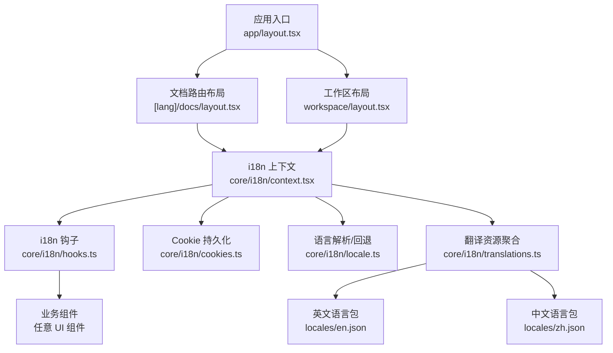
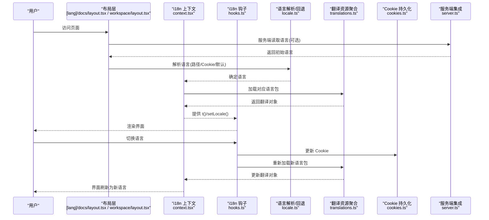
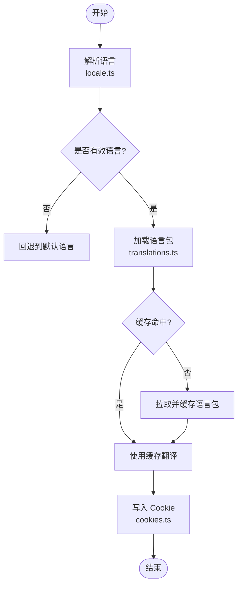
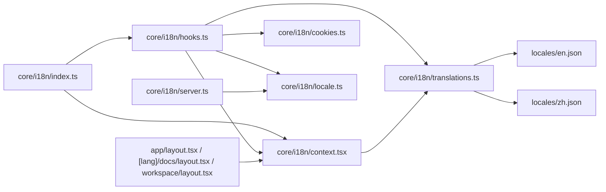

# 国际化支持

<cite>
**本文引用的文件**   
- [frontend/src/core/i18n/index.ts](file://frontend/src/core/i18n/index.ts)
- [frontend/src/core/i18n/context.tsx](file://frontend/src/core/i18n/context.tsx)
- [frontend/src/core/i18n/hooks.ts](file://frontend/src/core/i18n/hooks.ts)
- [frontend/src/core/i18n/cookies.ts](file://frontend/src/core/i18n/cookies.ts)
- [frontend/src/core/i18n/locale.ts](file://frontend/src/core/i18n/locale.ts)
- [frontend/src/core/i18n/server.ts](file://frontend/src/core/i18n/server.ts)
- [frontend/src/core/i18n/translations.ts](file://frontend/src/core/i18n/translations.ts)
- [frontend/src/core/i18n/locales/en.json](file://frontend/src/core/i18n/locales/en.json)
- [frontend/src/core/i18n/locales/zh.json](file://frontend/src/core/i18n/locales/zh.json)
- [frontend/src/app/[lang]/docs/layout.tsx](file://frontend/src/app/[lang]/docs/layout.tsx)
- [frontend/src/app/workspace/layout.tsx](file://frontend/src/app/workspace/layout.tsx)
- [frontend/src/app/layout.tsx](file://frontend/src/app/layout.tsx)
</cite>

## 目录
1. [简介](#简介)
2. [项目结构](#项目结构)
3. [核心组件](#核心组件)
4. [架构总览](#架构总览)
5. [详细组件分析](#详细组件分析)
6. [依赖关系分析](#依赖关系分析)
7. [性能考虑](#性能考虑)
8. [故障排查指南](#故障排查指南)
9. [结论](#结论)
10. [附录](#附录)

## 简介
本文件面向 DeerFlow 前端国际化（i18n）能力，系统性阐述多语言架构、翻译文件组织、语言切换机制（动态加载、缓存与回退）、文本格式化与本地化（日期时间、数字、复数等）、RTL 支持与布局适配、翻译维护流程与贡献规范，以及最佳实践与常见问题解决方案。目标是帮助开发者快速理解并高效扩展多语言支持。

## 项目结构
DeerFlow 前端的国际化实现集中在 core/i18n 目录下，采用“模块+上下文+钩子”的解耦设计：
- 配置与入口：index.ts 暴露统一 API
- 运行时状态：context.tsx 提供 React Context 管理当前语言
- 使用接口：hooks.ts 提供 useTranslation/useLocale 等便捷方法
- 持久化：cookies.ts 负责读写浏览器 Cookie 中的语言偏好
- 解析与默认值：locale.ts 负责语言解析、回退策略
- 服务端集成：server.ts 用于 SSR/SSG 场景的语言获取
- 资源聚合：translations.ts 汇总各语言包
- 语言包：locales/{lang}.json 存放具体文案

图示来源
- [frontend/src/app/layout.tsx](file://frontend/src/app/layout.tsx)
- [frontend/src/app/[lang]/docs/layout.tsx](file://frontend/src/app/[lang]/docs/layout.tsx)
- [frontend/src/app/workspace/layout.tsx](file://frontend/src/app/workspace/layout.tsx)
- [frontend/src/core/i18n/context.tsx](file://frontend/src/core/i18n/context.tsx)
- [frontend/src/core/i18n/hooks.ts](file://frontend/src/core/i18n/hooks.ts)
- [frontend/src/core/i18n/cookies.ts](file://frontend/src/core/i18n/cookies.ts)
- [frontend/src/core/i18n/locale.ts](file://frontend/src/core/i18n/locale.ts)
- [frontend/src/core/i18n/translations.ts](file://frontend/src/core/i18n/translations.ts)
- [frontend/src/core/i18n/locales/en.json](file://frontend/src/core/i18n/locales/en.json)
- [frontend/src/core/i18n/locales/zh.json](file://frontend/src/core/i18n/locales/zh.json)

章节来源
- [frontend/src/core/i18n/index.ts](file://frontend/src/core/i18n/index.ts)
- [frontend/src/core/i18n/context.tsx](file://frontend/src/core/i18n/context.tsx)
- [frontend/src/core/i18n/hooks.ts](file://frontend/src/core/i18n/hooks.ts)
- [frontend/src/core/i18n/cookies.ts](file://frontend/src/core/i18n/cookies.ts)
- [frontend/src/core/i18n/locale.ts](file://frontend/src/core/i18n/locale.ts)
- [frontend/src/core/i18n/server.ts](file://frontend/src/core/i18n/server.ts)
- [frontend/src/core/i18n/translations.ts](file://frontend/src/core/i18n/translations.ts)
- [frontend/src/core/i18n/locales/en.json](file://frontend/src/core/i18n/locales/en.json)
- [frontend/src/core/i18n/locales/zh.json](file://frontend/src/core/i18n/locales/zh.json)
- [frontend/src/app/[lang]/docs/layout.tsx](file://frontend/src/app/[lang]/docs/layout.tsx)
- [frontend/src/app/workspace/layout.tsx](file://frontend/src/app/workspace/layout.tsx)
- [frontend/src/app/layout.tsx](file://frontend/src/app/layout.tsx)

## 核心组件
- i18n 上下文（Context）
  - 职责：维护当前语言、提供设置语言的方法、在组件树中广播语言变更
  - 关键点：在根布局或页面布局中包裹，确保全局可用
- i18n 钩子（Hooks）
  - 职责：封装 t() 翻译函数、useLocale() 获取当前语言、setLocale() 切换语言
  - 关键点：内部自动处理回退到默认语言、触发必要的重渲染
- Cookie 持久化
  - 职责：将用户语言偏好写入 Cookie，刷新后恢复
  - 关键点：安全与跨域策略需与部署环境一致
- 语言解析与回退
  - 职责：从 URL 路径段、Cookie、请求头或默认值解析语言；当目标语言缺失时回退
  - 关键点：回退顺序明确，避免空键导致显示异常
- 翻译资源聚合
  - 职责：集中加载与合并各语言包，供运行时查询
  - 关键点：按需加载与缓存策略可结合构建工具优化
- 服务端集成
  - 职责：在服务端渲染阶段读取语言，注入到客户端上下文
  - 关键点：保证 SSR/SSG 下首屏语言正确

章节来源
- [frontend/src/core/i18n/context.tsx](file://frontend/src/core/i18n/context.tsx)
- [frontend/src/core/i18n/hooks.ts](file://frontend/src/core/i18n/hooks.ts)
- [frontend/src/core/i18n/cookies.ts](file://frontend/src/core/i18n/cookies.ts)
- [frontend/src/core/i18n/locale.ts](file://frontend/src/core/i18n/locale.ts)
- [frontend/src/core/i18n/translations.ts](file://frontend/src/core/i18n/translations.ts)
- [frontend/src/core/i18n/server.ts](file://frontend/src/core/i18n/server.ts)

## 架构总览
下图展示了语言选择、解析、加载与渲染的关键流程，包括客户端与服务端协作。

图示来源
- [frontend/src/app/[lang]/docs/layout.tsx](file://frontend/src/app/[lang]/docs/layout.tsx)
- [frontend/src/app/workspace/layout.tsx](file://frontend/src/app/workspace/layout.tsx)
- [frontend/src/core/i18n/context.tsx](file://frontend/src/core/i18n/context.tsx)
- [frontend/src/core/i18n/hooks.ts](file://frontend/src/core/i18n/hooks.ts)
- [frontend/src/core/i18n/locale.ts](file://frontend/src/core/i18n/locale.ts)
- [frontend/src/core/i18n/translations.ts](file://frontend/src/core/i18n/translations.ts)
- [frontend/src/core/i18n/cookies.ts](file://frontend/src/core/i18n/cookies.ts)
- [frontend/src/core/i18n/server.ts](file://frontend/src/core/i18n/server.ts)

## 详细组件分析

### 语言切换机制
- 动态加载
  - 通过 hooks 提供的 setLocale 触发语言切换，内部调用 translations 加载对应语言包
  - 若语言包尚未加载，则按需拉取并缓存，避免重复请求
- 缓存策略
  - 内存级缓存：已加载语言包保存在内存映射中，切换时直接命中
  - 持久化：语言偏好写入 Cookie，刷新后由 locale 解析恢复
- 回退处理
  - 解析顺序建议：URL 路径段 > Cookie > 请求头/浏览器语言 > 默认语言
  - 若目标语言缺失，回退到默认语言，并在日志中提示缺失键（便于完善翻译）

图示来源
- [frontend/src/core/i18n/locale.ts](file://frontend/src/core/i18n/locale.ts)
- [frontend/src/core/i18n/translations.ts](file://frontend/src/core/i18n/translations.ts)
- [frontend/src/core/i18n/cookies.ts](file://frontend/src/core/i18n/cookies.ts)

章节来源
- [frontend/src/core/i18n/hooks.ts](file://frontend/src/core/i18n/hooks.ts)
- [frontend/src/core/i18n/locale.ts](file://frontend/src/core/i18n/locale.ts)
- [frontend/src/core/i18n/translations.ts](file://frontend/src/core/i18n/translations.ts)
- [frontend/src/core/i18n/cookies.ts](file://frontend/src/core/i18n/cookies.ts)

### 文本格式化与本地化
- 日期与时间
  - 建议使用 Intl.DateTimeFormat 进行本地化输出，按当前语言与区域设置格式化
  - 注意时区与夏令时差异，必要时显式传入时区参数
- 数字与货币
  - 使用 Intl.NumberFormat 与 Intl.CurrencyFormat 进行格式化
  - 根据语言区域决定小数点、千分位与货币符号
- 复数形式
  - 对于存在复数规则的语言，优先使用 ICU MessageFormat 或类似库处理
  - 若未引入 ICU，可在 JSON 中以 key 区分单复数，并在模板层选择
- 占位符与插值
  - 在翻译键中使用命名占位符，如 {name}、{count}，在调用处传入参数
  - 对富文本内容谨慎插值，避免 XSS 风险

章节来源
- [frontend/src/core/i18n/hooks.ts](file://frontend/src/core/i18n/hooks.ts)
- [frontend/src/core/i18n/translations.ts](file://frontend/src/core/i18n/translations.ts)

### RTL（从右到左）语言支持与布局适配
- 语言方向检测
  - 基于语言代码判断是否为 RTL（例如 ar、he），为 html/body 添加 dir="rtl"
- CSS 适配
  - 使用逻辑属性（margin-inline-start/end、padding-inline-start/end）替代 margin-left/right
  - Flex/Grid 布局天然支持方向变化，无需额外翻转
- 图标与媒体
  - 箭头类图标需提供镜像版本或在 RTL 下通过 transform 翻转
  - 图片与视频等媒体不受影响，但需注意排版对齐

章节来源
- [frontend/src/core/i18n/locale.ts](file://frontend/src/core/i18n/locale.ts)
- [frontend/src/app/layout.tsx](file://frontend/src/app/layout.tsx)

### 翻译文件组织结构与维护流程
- 文件组织
  - 每个语言一个 JSON 文件，位于 locales 目录，如 en.json、zh.json
  - 建议按功能域划分命名空间，如 common、workspace、agents、chats 等
- 质量检查
  - 新增语言时需校验键集合一致性，缺失键应告警
  - 建议在 CI 中加入 i18n 键一致性检查脚本
- 版本管理
  - 翻译变更纳入版本控制，提交信息标注涉及语言与范围
  - 大版本发布前进行全量回归，确保关键路径无缺失键

章节来源
- [frontend/src/core/i18n/locales/en.json](file://frontend/src/core/i18n/locales/en.json)
- [frontend/src/core/i18n/locales/zh.json](file://frontend/src/core/i18n/locales/zh.json)
- [frontend/src/core/i18n/translations.ts](file://frontend/src/core/i18n/translations.ts)

### 新语言添加指南与贡献规范
- 步骤
  - 在 locales 目录新增语言文件，复制基础键集并翻译
  - 在语言解析与默认配置中添加新语言标识
  - 验证切换、持久化与回退行为
- 规范
  - 键名使用小写与下划线分隔，语义清晰
  - 避免硬编码字符串，所有可见文案必须走 t()
  - 富文本与链接使用安全的插值方式

章节来源
- [frontend/src/core/i18n/locale.ts](file://frontend/src/core/i18n/locale.ts)
- [frontend/src/core/i18n/translations.ts](file://frontend/src/core/i18n/translations.ts)
- [frontend/src/core/i18n/hooks.ts](file://frontend/src/core/i18n/hooks.ts)

### 国际化最佳实践
- 始终通过 t() 获取文案，禁止在组件内硬编码
- 使用命名空间组织翻译键，避免冲突与臃肿
- 对长文案进行断行与截断测试，确保移动端可读性
- 对动态内容（用户输入、后端返回）不直接作为翻译键
- 对日期、数字、货币等使用本地化工具格式化
- 在 SSR 场景下确保首屏语言正确注入

章节来源
- [frontend/src/core/i18n/hooks.ts](file://frontend/src/core/i18n/hooks.ts)
- [frontend/src/core/i18n/server.ts](file://frontend/src/core/i18n/server.ts)

### 常见问题与解决方案
- 问题：切换语言后部分文案未更新
  - 排查：确认组件是否通过 hooks 使用 t()，而非静态导入
  - 解决：重构为响应式调用，确保上下文变更触发重渲染
- 问题：刷新后语言丢失
  - 排查：检查 Cookie 写入与读取逻辑
  - 解决：确保 cookies.ts 的读写路径与部署域名一致
- 问题：新增语言无法生效
  - 排查：语言解析是否包含新语言，语言包是否加载成功
  - 解决：在 locale.ts 与 translations.ts 中补齐配置与资源
- 问题：RTL 布局错乱
  - 排查：是否设置了 dir 属性，CSS 是否使用逻辑属性
  - 解决：为 html/body 添加 dir，替换左右边距为内联属性

章节来源
- [frontend/src/core/i18n/cookies.ts](file://frontend/src/core/i18n/cookies.ts)
- [frontend/src/core/i18n/locale.ts](file://frontend/src/core/i18n/locale.ts)
- [frontend/src/core/i18n/translations.ts](file://frontend/src/core/i18n/translations.ts)
- [frontend/src/core/i18n/hooks.ts](file://frontend/src/core/i18n/hooks.ts)

## 依赖关系分析
i18n 模块之间的依赖关系如下：

图示来源
- [frontend/src/core/i18n/index.ts](file://frontend/src/core/i18n/index.ts)
- [frontend/src/core/i18n/context.tsx](file://frontend/src/core/i18n/context.tsx)
- [frontend/src/core/i18n/hooks.ts](file://frontend/src/core/i18n/hooks.ts)
- [frontend/src/core/i18n/cookies.ts](file://frontend/src/core/i18n/cookies.ts)
- [frontend/src/core/i18n/locale.ts](file://frontend/src/core/i18n/locale.ts)
- [frontend/src/core/i18n/translations.ts](file://frontend/src/core/i18n/translations.ts)
- [frontend/src/core/i18n/server.ts](file://frontend/src/core/i18n/server.ts)
- [frontend/src/core/i18n/locales/en.json](file://frontend/src/core/i18n/locales/en.json)
- [frontend/src/core/i18n/locales/zh.json](file://frontend/src/core/i18n/locales/zh.json)
- [frontend/src/app/layout.tsx](file://frontend/src/app/layout.tsx)
- [frontend/src/app/[lang]/docs/layout.tsx](file://frontend/src/app/[lang]/docs/layout.tsx)
- [frontend/src/app/workspace/layout.tsx](file://frontend/src/app/workspace/layout.tsx)

章节来源
- [frontend/src/core/i18n/index.ts](file://frontend/src/core/i18n/index.ts)
- [frontend/src/core/i18n/context.tsx](file://frontend/src/core/i18n/context.tsx)
- [frontend/src/core/i18n/hooks.ts](file://frontend/src/core/i18n/hooks.ts)
- [frontend/src/core/i18n/cookies.ts](file://frontend/src/core/i18n/cookies.ts)
- [frontend/src/core/i18n/locale.ts](file://frontend/src/core/i18n/locale.ts)
- [frontend/src/core/i18n/translations.ts](file://frontend/src/core/i18n/translations.ts)
- [frontend/src/core/i18n/server.ts](file://frontend/src/core/i18n/server.ts)
- [frontend/src/core/i18n/locales/en.json](file://frontend/src/core/i18n/locales/en.json)
- [frontend/src/core/i18n/locales/zh.json](file://frontend/src/core/i18n/locales/zh.json)
- [frontend/src/app/layout.tsx](file://frontend/src/app/layout.tsx)
- [frontend/src/app/[lang]/docs/layout.tsx](file://frontend/src/app/[lang]/docs/layout.tsx)
- [frontend/src/app/workspace/layout.tsx](file://frontend/src/app/workspace/layout.tsx)

## 性能考虑
- 按需加载与缓存
  - 首次访问某语言时加载其语言包，后续切换直接命中内存缓存
- 减少重渲染
  - 仅在语言切换时更新上下文，避免无关组件频繁重渲染
- 首屏优化
  - 在 SSR 阶段预取默认语言，减少客户端二次请求
- 资源体积
  - 对大型语言包进行拆分与懒加载，仅加载当前语言所需命名空间

## 故障排查指南
- 检查语言解析优先级是否正确（路径 > Cookie > 默认）
- 确认 Cookie 的 domain/path 与部署环境匹配
- 验证语言包是否存在且格式正确
- 在控制台观察缺失键告警，及时补充翻译
- 对 RTL 语言进行视觉回归测试，确保布局对称

章节来源
- [frontend/src/core/i18n/locale.ts](file://frontend/src/core/i18n/locale.ts)
- [frontend/src/core/i18n/cookies.ts](file://frontend/src/core/i18n/cookies.ts)
- [frontend/src/core/i18n/translations.ts](file://frontend/src/core/i18n/translations.ts)

## 结论
DeerFlow 前端的国际化方案以轻量、解耦为核心，通过上下文与钩子提供一致的 API，配合 Cookie 持久化与回退策略，保障用户体验与可维护性。遵循本文的最佳实践与贡献规范，可高效扩展新语言并保持高质量的一致性。

## 附录
- 术语
  - i18n：国际化（Internationalization）
  - l10n：本地化（Localization）
  - RTL：从右到左（Right-to-Left）
- 参考实现位置
  - 入口与导出：core/i18n/index.ts
  - 上下文与钩子：core/i18n/context.tsx、core/i18n/hooks.ts
  - 持久化与解析：core/i18n/cookies.ts、core/i18n/locale.ts
  - 资源聚合与服务端：core/i18n/translations.ts、core/i18n/server.ts
  - 语言包：core/i18n/locales/*.json
  - 布局集成：app/layout.tsx、app/[lang]/docs/layout.tsx、app/workspace/layout.tsx