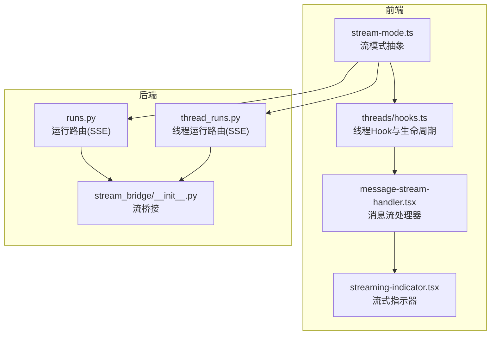
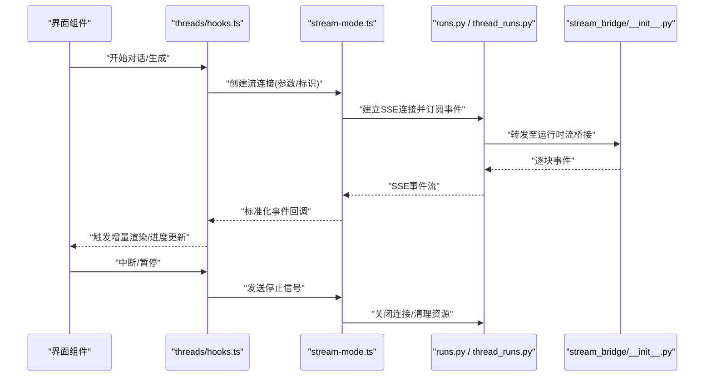
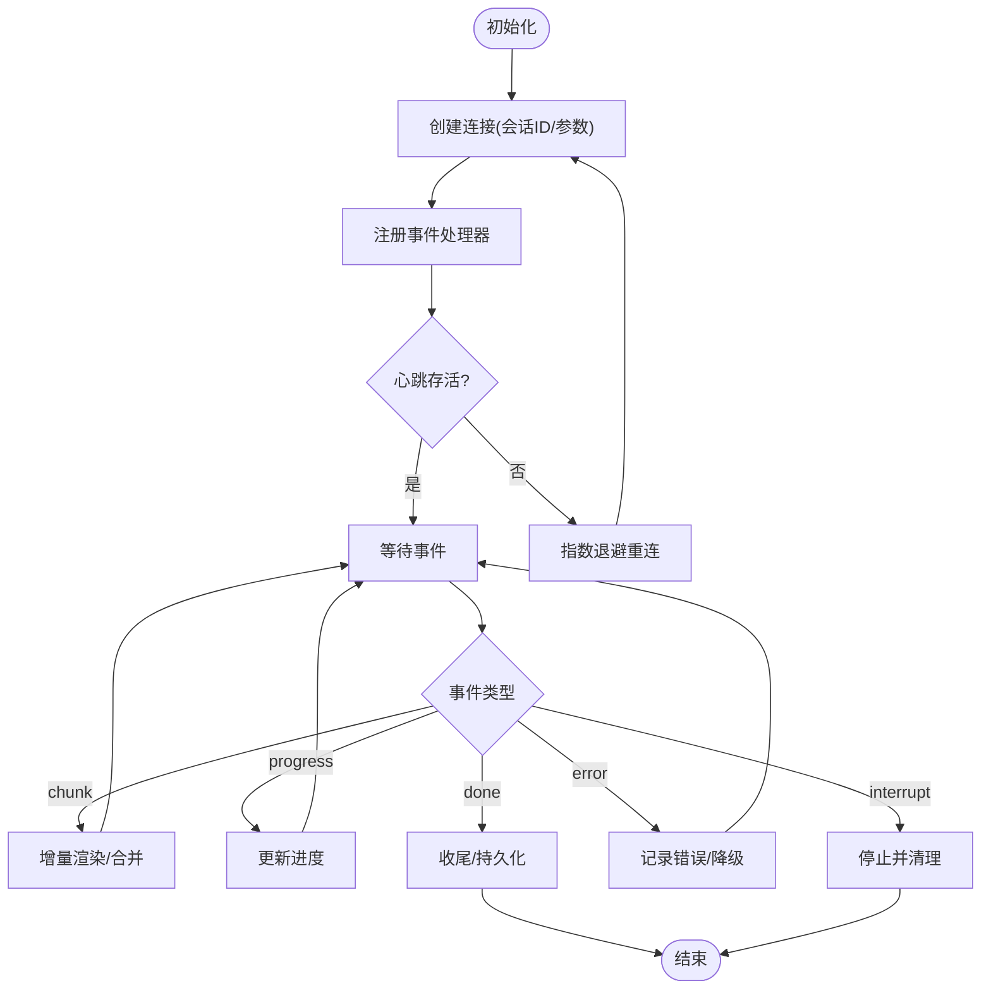
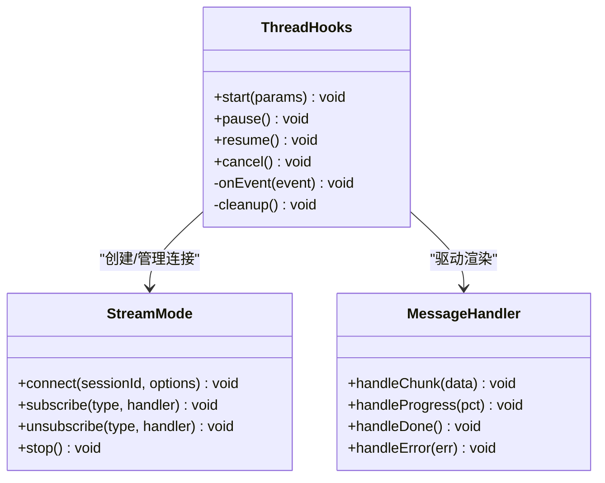
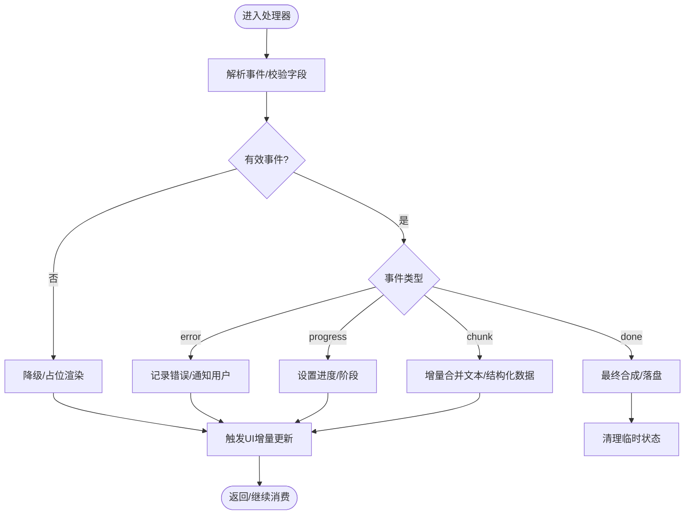
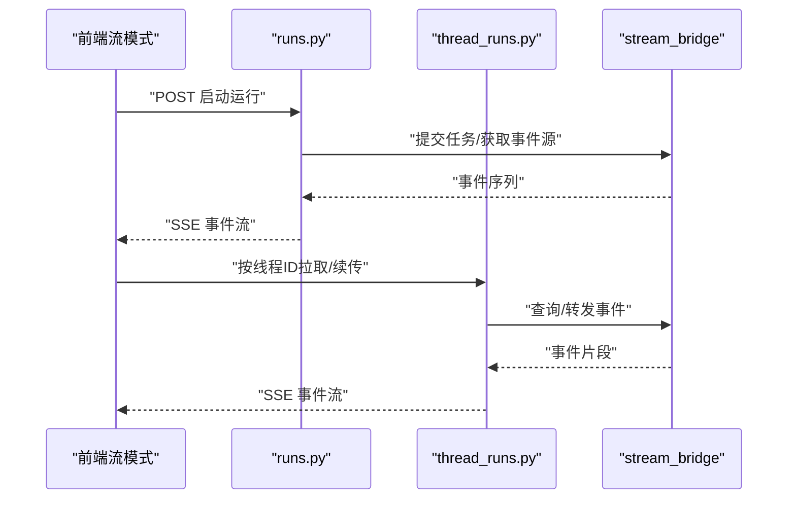
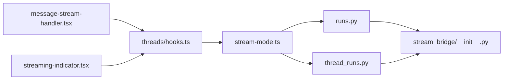

# 实时通信

<cite>
**本文引用的文件**   
- [frontend/src/core/api/stream-mode.ts](file://frontend/src/core/api/stream-mode.ts)
- [frontend/src/core/threads/hooks.ts](file://frontend/src/core/threads/hooks.ts)
- [frontend/src/components/workspace/messages/message-stream-handler.tsx](file://frontend/src/components/workspace/messages/message-stream-handler.tsx)
- [frontend/src/components/workspace/streaming-indicator.tsx](file://frontend/src/components/workspace/streaming-indicator.tsx)
- [backend/app/gateway/routers/runs.py](file://backend/app/gateway/routers/runs.py)
- [backend/app/gateway/routers/thread_runs.py](file://backend/app/gateway/routers/thread_runs.py)
- [backend/app/runtime/stream_bridge/__init__.py](file://backend/app/runtime/stream_bridge/__init__.py)
- [backend/tests/test_sse_format.py](file://backend/tests/test_sse_format.py)
- [backend/tests/test_stream_bridge.py](file://backend/tests/test_stream_bridge.py)
</cite>

## 目录
1. [简介](#简介)
2. [项目结构](#项目结构)
3. [核心组件](#核心组件)
4. [架构总览](#架构总览)
5. [详细组件分析](#详细组件分析)
6. [依赖关系分析](#依赖关系分析)
7. [性能考虑](#性能考虑)
8. [故障排查指南](#故障排查指南)
9. [结论](#结论)
10. [附录](#附录)

## 简介
本文件聚焦 DeerFlow 前端的实时通信系统，围绕 WebSocket 连接管理与 SSE（Server-Sent Events）实现机制展开，系统性阐述消息推送架构、事件订阅与消息格式、错误重连策略、流式响应处理（增量渲染、进度显示、中断处理）、实时状态同步（多标签页、离线、冲突解决）、前端消息队列与缓冲策略（去重、排序、持久化），以及调试工具与性能监控方案。文档以“渐进式复杂度”组织内容，既便于初学者快速上手，也为深入优化提供依据。

## 项目结构
DeerFlow 的前端采用 Next.js 工程，实时通信相关能力主要分布在以下位置：
- 流模式抽象与客户端封装：frontend/src/core/api/stream-mode.ts
- 线程（会话）级 Hook 与生命周期管理：frontend/src/core/threads/hooks.ts
- 消息流处理器与增量渲染：frontend/src/components/workspace/messages/message-stream-handler.tsx
- 流式指示器与 UI 反馈：frontend/src/components/workspace/streaming-indicator.tsx
- 后端 SSE/运行路由：backend/app/gateway/routers/runs.py、backend/app/gateway/routers/thread_runs.py
- 运行时流桥接：backend/app/runtime/stream_bridge/__init__.py
- 测试用例（SSE 格式与流桥接）：backend/tests/test_sse_format.py、backend/tests/test_stream_bridge.py

图表来源
- [frontend/src/core/api/stream-mode.ts](file://frontend/src/core/api/stream-mode.ts)
- [frontend/src/core/threads/hooks.ts](file://frontend/src/core/threads/hooks.ts)
- [frontend/src/components/workspace/messages/message-stream-handler.tsx](file://frontend/src/components/workspace/messages/message-stream-handler.tsx)
- [frontend/src/components/workspace/streaming-indicator.tsx](file://frontend/src/components/workspace/streaming-indicator.tsx)
- [backend/app/gateway/routers/runs.py](file://backend/app/gateway/routers/runs.py)
- [backend/app/gateway/routers/thread_runs.py](file://backend/app/gateway/routers/thread_runs.py)
- [backend/app/runtime/stream_bridge/__init__.py](file://backend/app/runtime/stream_bridge/__init__.py)

章节来源
- [frontend/src/core/api/stream-mode.ts](file://frontend/src/core/api/stream-mode.ts)
- [frontend/src/core/threads/hooks.ts](file://frontend/src/core/threads/hooks.ts)
- [frontend/src/components/workspace/messages/message-stream-handler.tsx](file://frontend/src/components/workspace/messages/message-stream-handler.tsx)
- [frontend/src/components/workspace/streaming-indicator.tsx](file://frontend/src/components/workspace/streaming-indicator.tsx)
- [backend/app/gateway/routers/runs.py](file://backend/app/gateway/routers/runs.py)
- [backend/app/gateway/routers/thread_runs.py](file://backend/app/gateway/routers/thread_runs.py)
- [backend/app/runtime/stream_bridge/__init__.py](file://backend/app/runtime/stream_bridge/__init__.py)

## 核心组件
- 流模式抽象层（stream-mode.ts）
  - 职责：统一封装 SSE/WS 的创建、事件订阅、断线重连、心跳保活、错误上报等通用逻辑；暴露一致的接口供上层调用。
  - 关键点：连接池与会话隔离、事件类型枚举、重试退避策略、可插拔的错误处理回调。
- 线程 Hook（threads/hooks.ts）
  - 职责：在会话维度管理流的生命周期（启动、暂停、恢复、取消）；维护本地状态与 UI 联动；协调消息流处理器。
  - 关键点：副作用清理、并发控制、状态一致性保障。
- 消息流处理器（message-stream-handler.tsx）
  - 职责：解析服务端推送的事件流，执行增量渲染、进度更新、中断处理；将结构化数据写入本地存储或状态树。
  - 关键点：分块合并、幂等性、渲染节流、错误边界。
- 流式指示器（streaming-indicator.tsx）
  - 职责：向用户展示当前是否处于流式输出中，支持暂停/继续交互。
  - 关键点：轻量状态广播、UI 响应延迟控制。

章节来源
- [frontend/src/core/api/stream-mode.ts](file://frontend/src/core/api/stream-mode.ts)
- [frontend/src/core/threads/hooks.ts](file://frontend/src/core/threads/hooks.ts)
- [frontend/src/components/workspace/messages/message-stream-handler.tsx](file://frontend/src/components/workspace/messages/message-stream-handler.tsx)
- [frontend/src/components/workspace/streaming-indicator.tsx](file://frontend/src/components/workspace/streaming-indicator.tsx)

## 架构总览
整体采用“前端流模式抽象 + 后端 SSE 路由 + 运行时流桥接”的分层设计。前端通过统一的流模式接口发起请求并订阅事件；后端根据运行上下文选择合适路由，经由流桥接将模型/工具输出逐步推送到客户端；前端消息流处理器负责增量渲染与状态同步。

图表来源
- [frontend/src/core/threads/hooks.ts](file://frontend/src/core/threads/hooks.ts)
- [frontend/src/core/api/stream-mode.ts](file://frontend/src/core/api/stream-mode.ts)
- [backend/app/gateway/routers/runs.py](file://backend/app/gateway/routers/runs.py)
- [backend/app/gateway/routers/thread_runs.py](file://backend/app/gateway/routers/thread_runs.py)
- [backend/app/runtime/stream_bridge/__init__.py](file://backend/app/runtime/stream_bridge/__init__.py)

## 详细组件分析

### 流模式抽象层（stream-mode.ts）
- 连接管理
  - 单例/池化：按会话 ID 维护连接实例，避免重复创建；支持多路复用与资源回收。
  - 心跳与保活：周期性 ping/pong 或 keep-alive 事件，防止中间代理超时断开。
- 事件订阅
  - 事件类型：如 start、chunk、progress、done、error、interrupt 等；提供 on/off/once 订阅接口。
  - 过滤与路由：基于会话/任务标识进行事件分发，确保跨会话隔离。
- 错误与重连
  - 指数退避：失败后按固定间隔递增重试，上限次数与最大间隔可配置。
  - 幂等恢复：重连后携带 last_event_id 或游标，避免重复渲染。
- 中断与取消
  - 支持主动中断流；清理监听器与定时器，释放内存。

图表来源
- [frontend/src/core/api/stream-mode.ts](file://frontend/src/core/api/stream-mode.ts)

章节来源
- [frontend/src/core/api/stream-mode.ts](file://frontend/src/core/api/stream-mode.ts)

### 线程 Hook（threads/hooks.ts）
- 生命周期
  - 启动：组装请求参数，调用流模式抽象创建连接。
  - 运行：接收标准化事件，驱动消息流处理器与 UI 更新。
  - 终止：处理 done/error/interrupt，清理资源并落盘。
- 并发与一致性
  - 使用锁/标志位防止重复启动；保证同一会话内事件顺序。
  - 与全局状态（如 React Query/Redux）集成，触发最小必要更新。
- 与 UI 协作
  - 暴露暂停/继续/取消方法；与流式指示器联动。

图表来源
- [frontend/src/core/threads/hooks.ts](file://frontend/src/core/threads/hooks.ts)
- [frontend/src/core/api/stream-mode.ts](file://frontend/src/core/api/stream-mode.ts)
- [frontend/src/components/workspace/messages/message-stream-handler.tsx](file://frontend/src/components/workspace/messages/message-stream-handler.tsx)

章节来源
- [frontend/src/core/threads/hooks.ts](file://frontend/src/core/threads/hooks.ts)

### 消息流处理器（message-stream-handler.tsx）
- 增量渲染
  - 对 chunk 事件进行分片合并，避免频繁重排；必要时使用虚拟滚动或增量 DOM 更新。
- 进度显示
  - 解析 progress 事件，映射为百分比或阶段提示；与流式指示器协同。
- 中断处理
  - 收到 interrupt/done 时停止追加，触发最终合成与持久化。
- 错误边界
  - 捕获解析异常与渲染异常，回退到安全视图并上报诊断信息。

图表来源
- [frontend/src/components/workspace/messages/message-stream-handler.tsx](file://frontend/src/components/workspace/messages/message-stream-handler.tsx)

章节来源
- [frontend/src/components/workspace/messages/message-stream-handler.tsx](file://frontend/src/components/workspace/messages/message-stream-handler.tsx)

### 流式指示器（streaming-indicator.tsx）
- 职责：展示“正在生成”状态，支持暂停/继续交互；与线程 Hook 的状态同步。
- 行为：当流开始时高亮/闪烁，结束时恢复；点击暂停会向 Hook 发出中断信号。

章节来源
- [frontend/src/components/workspace/streaming-indicator.tsx](file://frontend/src/components/workspace/streaming-indicator.tsx)

### 后端 SSE 路由与流桥接
- runs.py / thread_runs.py
  - 暴露 SSE 端点，接受运行参数，返回事件流；支持按会话/运行 ID 路由。
- stream_bridge/__init__.py
  - 将运行时内部事件转换为标准 SSE 帧；负责事件序列化、顺序性与完整性。
- 测试
  - test_sse_format.py：验证事件格式、字段完备性与兼容性。
  - test_stream_bridge.py：验证桥接层的转换正确性与异常路径。

图表来源
- [backend/app/gateway/routers/runs.py](file://backend/app/gateway/routers/runs.py)
- [backend/app/gateway/routers/thread_runs.py](file://backend/app/gateway/routers/thread_runs.py)
- [backend/app/runtime/stream_bridge/__init__.py](file://backend/app/runtime/stream_bridge/__init__.py)
- [backend/tests/test_sse_format.py](file://backend/tests/test_sse_format.py)
- [backend/tests/test_stream_bridge.py](file://backend/tests/test_stream_bridge.py)

章节来源
- [backend/app/gateway/routers/runs.py](file://backend/app/gateway/routers/runs.py)
- [backend/app/gateway/routers/thread_runs.py](file://backend/app/gateway/routers/thread_runs.py)
- [backend/app/runtime/stream_bridge/__init__.py](file://backend/app/runtime/stream_bridge/__init__.py)
- [backend/tests/test_sse_format.py](file://backend/tests/test_sse_format.py)
- [backend/tests/test_stream_bridge.py](file://backend/tests/test_stream_bridge.py)

## 依赖关系分析
- 前端内部依赖
  - threads/hooks.ts 依赖 stream-mode.ts 提供的连接与事件能力。
  - message-stream-handler.tsx 依赖 hooks.ts 的标准事件回调。
  - streaming-indicator.tsx 依赖 hooks.ts 的流状态。
- 前后端契约
  - 事件格式由后端 stream_bridge 定义，前端据此解析；测试用例约束格式稳定性。
  - 路由 runs.py / thread_runs.py 作为入口，屏蔽运行时细节。

图表来源
- [frontend/src/core/threads/hooks.ts](file://frontend/src/core/threads/hooks.ts)
- [frontend/src/core/api/stream-mode.ts](file://frontend/src/core/api/stream-mode.ts)
- [frontend/src/components/workspace/messages/message-stream-handler.tsx](file://frontend/src/components/workspace/messages/message-stream-handler.tsx)
- [frontend/src/components/workspace/streaming-indicator.tsx](file://frontend/src/components/workspace/streaming-indicator.tsx)
- [backend/app/gateway/routers/runs.py](file://backend/app/gateway/routers/runs.py)
- [backend/app/gateway/routers/thread_runs.py](file://backend/app/gateway/routers/thread_runs.py)
- [backend/app/runtime/stream_bridge/__init__.py](file://backend/app/runtime/stream_bridge/__init__.py)

章节来源
- [frontend/src/core/threads/hooks.ts](file://frontend/src/core/threads/hooks.ts)
- [frontend/src/core/api/stream-mode.ts](file://frontend/src/core/api/stream-mode.ts)
- [frontend/src/components/workspace/messages/message-stream-handler.tsx](file://frontend/src/components/workspace/messages/message-stream-handler.tsx)
- [frontend/src/components/workspace/streaming-indicator.tsx](file://frontend/src/components/workspace/streaming-indicator.tsx)
- [backend/app/gateway/routers/runs.py](file://backend/app/gateway/routers/runs.py)
- [backend/app/gateway/routers/thread_runs.py](file://backend/app/gateway/routers/thread_runs.py)
- [backend/app/runtime/stream_bridge/__init__.py](file://backend/app/runtime/stream_bridge/__init__.py)

## 性能考虑
- 增量渲染
  - 对大文本分块合并，减少重绘；必要时使用虚拟列表/增量 DOM 操作。
- 网络与缓存
  - 合理设置 SSE 心跳与超时；利用浏览器缓存与 Service Worker 做离线兜底。
- 计算与调度
  - 使用 requestIdleCallback 或时间切片避免阻塞主线程；限制并行流数量。
- 内存管理
  - 及时移除事件监听器与定时器；对长会话进行分段持久化与清理。

[本节为通用指导，不直接分析具体文件]

## 故障排查指南
- 常见问题定位
  - 连接失败：检查 CORS、代理超时、证书与端口；查看重连日志与退避策略。
  - 事件丢失：核对 last_event_id/游标；确认后端事件顺序与完整性。
  - 渲染错乱：检查分块合并逻辑与幂等键；观察错误边界捕获信息。
- 调试建议
  - 启用前端控制台日志与网络面板，过滤 SSE 事件；在后端开启流桥接日志。
  - 使用单元测试覆盖关键路径（SSE 格式、桥接转换）。
- 参考实现与用例
  - SSE 格式校验：backend/tests/test_sse_format.py
  - 流桥接行为：backend/tests/test_stream_bridge.py

章节来源
- [backend/tests/test_sse_format.py](file://backend/tests/test_sse_format.py)
- [backend/tests/test_stream_bridge.py](file://backend/tests/test_stream_bridge.py)

## 结论
DeerFlow 前端实时通信以“流模式抽象 + 线程 Hook + 消息流处理器”为核心，配合后端 SSE 路由与流桥接，实现了稳定高效的增量渲染与状态同步。通过完善的重连、中断与错误处理机制，结合调试与测试支撑，可在复杂场景下保持良好用户体验与系统健壮性。后续可进一步引入更细粒度的性能指标采集与可视化，持续优化端到端时延与吞吐。

[本节为总结性内容，不直接分析具体文件]

## 附录

### 事件订阅与消息格式（概念说明）
- 事件类型建议：start、chunk、progress、done、error、interrupt、heartbeat。
- 消息体建议：包含会话/运行标识、事件类型、序号/游标、时间戳、负载数据等字段，确保幂等与有序。

[本节为概念性说明，不直接分析具体文件]

### 多标签页同步、离线与冲突解决（概念说明）
- 多标签页同步：基于 BroadcastChannel 或共享存储广播状态变更，保证同域多标签一致。
- 离线处理：Service Worker 拦截与缓存；断网时降级为只读历史，联网后增量同步。
- 冲突解决：以服务端权威为准，采用版本号/时间戳合并策略；对不可合并的数据采用“最后写入优先”。

[本节为概念性说明，不直接分析具体文件]

### 前端消息队列与缓冲策略（概念说明）
- 去重：基于唯一键（如事件序号/内容哈希）去重，避免重复渲染。
- 排序：按序号/时间戳严格排序，保证时序一致性。
- 持久化：对长会话分块落盘（IndexedDB/LocalStorage），定期压缩与清理。

[本节为概念性说明，不直接分析具体文件]

### 调试工具与性能监控（概念说明）
- 调试工具：控制台日志、网络面板、自定义事件追踪器；后端流桥接日志开关。
- 性能监控：首字节时延、事件到达间隔、渲染帧率、内存占用；埋点上报与告警阈值。

[本节为概念性说明，不直接分析具体文件]