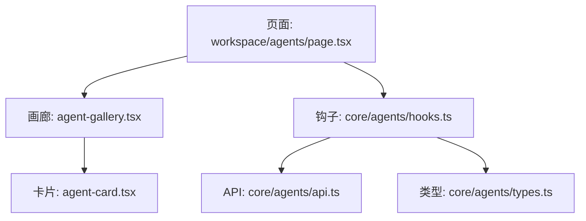
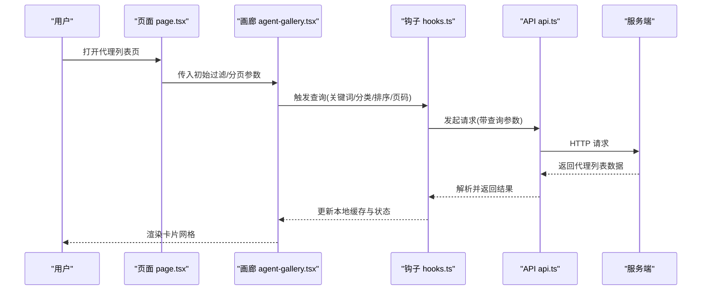
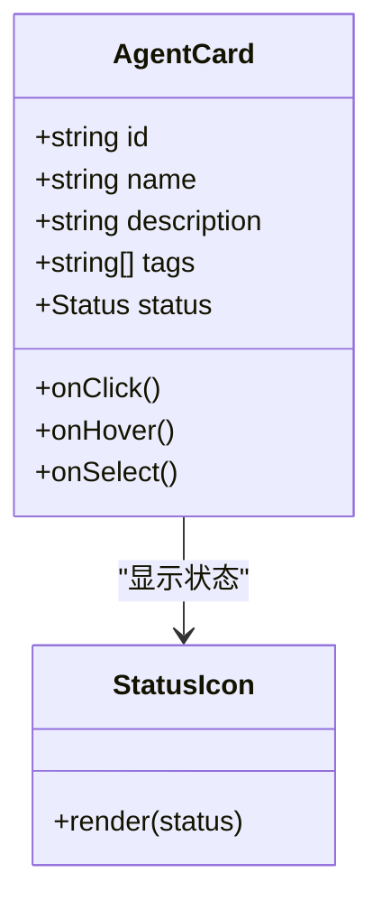
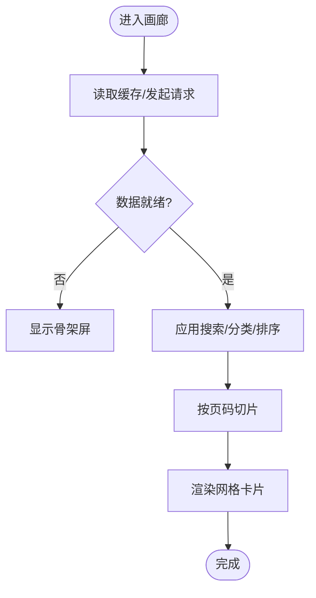
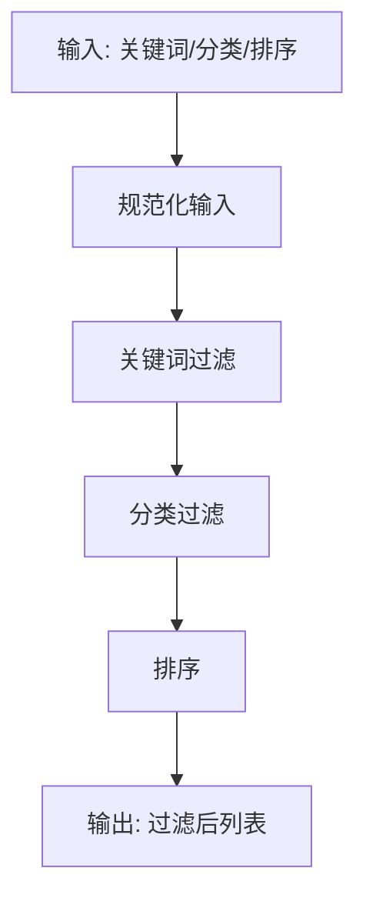
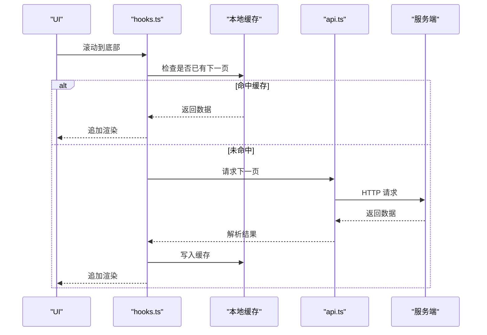
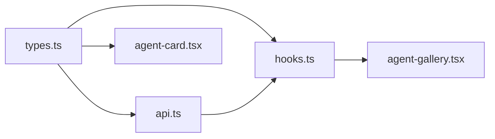

# 代理列表展示

<cite>
**本文引用的文件**   
- [frontend/src/app/workspace/agents/page.tsx](file://frontend/src/app/workspace/agents/page.tsx)
- [frontend/src/components/workspace/agents/agent-card.tsx](file://frontend/src/components/workspace/agents/agent-card.tsx)
- [frontend/src/components/workspace/agents/agent-gallery.tsx](file://frontend/src/components/workspace/agents/agent-gallery.tsx)
- [frontend/src/core/agents/api.ts](file://frontend/src/core/agents/api.ts)
- [frontend/src/core/agents/hooks.ts](file://frontend/src/core/agents/hooks.ts)
- [frontend/src/core/agents/types.ts](file://frontend/src/core/agents/types.ts)
</cite>

## 目录
1. [简介](#简介)
2. [项目结构](#项目结构)
3. [核心组件](#核心组件)
4. [架构总览](#架构总览)
5. [详细组件分析](#详细组件分析)
6. [依赖关系分析](#依赖关系分析)
7. [性能考量](#性能考量)
8. [故障排查指南](#故障排查指南)
9. [结论](#结论)
10. [附录](#附录)

## 简介
本文件聚焦“代理列表展示”功能，围绕以下目标展开：
- 代理卡片组件：布局设计、状态图标显示与交互行为
- 代理画廊组件：网格布局、响应式设计与渲染机制
- 搜索过滤：关键词匹配、分类筛选与排序算法
- 分页加载：无限滚动、虚拟列表与缓存策略
- 性能优化与用户体验改进建议

## 项目结构
前端采用 Next.js 应用，代理列表相关代码位于 workspace 的 agents 模块中。整体组织方式如下：
- 页面入口：workspace/agents/page.tsx
- 展示层：components/workspace/agents/agent-gallery.tsx（画廊容器）、agent-card.tsx（单卡）
- 数据层：core/agents/api.ts（请求封装）、hooks.ts（查询与缓存）、types.ts（类型定义）

图表来源
- [frontend/src/app/workspace/agents/page.tsx](file://frontend/src/app/workspace/agents/page.tsx)
- [frontend/src/components/workspace/agents/agent-gallery.tsx](file://frontend/src/components/workspace/agents/agent-gallery.tsx)
- [frontend/src/components/workspace/agents/agent-card.tsx](file://frontend/src/components/workspace/agents/agent-card.tsx)
- [frontend/src/core/agents/hooks.ts](file://frontend/src/core/agents/hooks.ts)
- [frontend/src/core/agents/api.ts](file://frontend/src/core/agents/api.ts)
- [frontend/src/core/agents/types.ts](file://frontend/src/core/agents/types.ts)

章节来源
- [frontend/src/app/workspace/agents/page.tsx](file://frontend/src/app/workspace/agents/page.tsx)
- [frontend/src/components/workspace/agents/agent-gallery.tsx](file://frontend/src/components/workspace/agents/agent-gallery.tsx)
- [frontend/src/components/workspace/agents/agent-card.tsx](file://frontend/src/components/workspace/agents/agent-card.tsx)
- [frontend/src/core/agents/hooks.ts](file://frontend/src/core/agents/hooks.ts)
- [frontend/src/core/agents/api.ts](file://frontend/src/core/agents/api.ts)
- [frontend/src/core/agents/types.ts](file://frontend/src/core/agents/types.ts)

## 核心组件
- 代理卡片（AgentCard）
  - 职责：展示单个代理的关键信息（名称、描述、标签、状态等），承载点击、悬停、选中态等交互
  - 关键特性：状态图标、操作按钮、可访问性（键盘导航、焦点管理）
- 代理画廊（AgentGallery）
  - 职责：聚合多个 AgentCard，提供网格布局、筛选栏、搜索框、分页/无限滚动控制
  - 关键特性：响应式列数、骨架屏占位、错误边界、空状态提示
- 数据层（Hooks + API + Types）
  - 职责：拉取代理列表、维护本地缓存、处理分页参数与过滤条件
  - 关键特性：防抖搜索、增量更新、失败重试、类型安全

章节来源
- [frontend/src/components/workspace/agents/agent-card.tsx](file://frontend/src/components/workspace/agents/agent-card.tsx)
- [frontend/src/components/workspace/agents/agent-gallery.tsx](file://frontend/src/components/workspace/agents/agent-gallery.tsx)
- [frontend/src/core/agents/hooks.ts](file://frontend/src/core/agents/hooks.ts)
- [frontend/src/core/agents/api.ts](file://frontend/src/core/agents/api.ts)
- [frontend/src/core/agents/types.ts](file://frontend/src/core/agents/types.ts)

## 架构总览
从用户输入到界面渲染的整体流程如下：

图表来源
- [frontend/src/app/workspace/agents/page.tsx](file://frontend/src/app/workspace/agents/page.tsx)
- [frontend/src/components/workspace/agents/agent-gallery.tsx](file://frontend/src/components/workspace/agents/agent-gallery.tsx)
- [frontend/src/core/agents/hooks.ts](file://frontend/src/core/agents/hooks.ts)
- [frontend/src/core/agents/api.ts](file://frontend/src/core/agents/api.ts)

## 详细组件分析

### 代理卡片组件（AgentCard）
- 布局设计
  - 头部：头像/图标、名称、状态徽标
  - 主体：简短描述、标签/分类
  - 底部：操作区（如“进入”、“收藏”等）
- 状态图标显示
  - 使用统一的状态枚举映射为图标与颜色
  - 支持在线/离线、启用/禁用、运行中等语义化状态
- 交互行为
  - 点击跳转至代理详情或执行动作
  - 悬停高亮、键盘可达性与焦点样式
  - 可选多选模式下的勾选态

图表来源
- [frontend/src/components/workspace/agents/agent-card.tsx](file://frontend/src/components/workspace/agents/agent-card.tsx)
- [frontend/src/core/agents/types.ts](file://frontend/src/core/agents/types.ts)

章节来源
- [frontend/src/components/workspace/agents/agent-card.tsx](file://frontend/src/components/workspace/agents/agent-card.tsx)
- [frontend/src/core/agents/types.ts](file://frontend/src/core/agents/types.ts)

### 代理画廊组件（AgentGallery）
- 渲染机制
  - 网格布局：基于 CSS Grid/Flex 实现自适应列数
  - 响应式：根据断点调整每行卡片数量与间距
  - 骨架屏：在数据加载中展示占位元素，提升感知性能
- 数据流
  - 接收来自 hooks 的数据与分页状态
  - 将过滤后的数据切片渲染当前页
- 交互
  - 顶部工具栏：搜索框、分类筛选、排序下拉
  - 底部：分页控件或“加载更多”触发器

图表来源
- [frontend/src/components/workspace/agents/agent-gallery.tsx](file://frontend/src/components/workspace/agents/agent-gallery.tsx)
- [frontend/src/core/agents/hooks.ts](file://frontend/src/core/agents/hooks.ts)

章节来源
- [frontend/src/components/workspace/agents/agent-gallery.tsx](file://frontend/src/components/workspace/agents/agent-gallery.tsx)
- [frontend/src/core/agents/hooks.ts](file://frontend/src/core/agents/hooks.ts)

### 搜索与过滤
- 关键词匹配
  - 对名称、描述、标签进行大小写不敏感匹配
  - 支持多词分词与模糊匹配
- 分类筛选
  - 基于 tag/category 字段进行集合交集过滤
- 排序算法
  - 支持按更新时间、名称字母序、状态优先级等维度排序
  - 稳定排序保证相同键值顺序不变

图表来源
- [frontend/src/components/workspace/agents/agent-gallery.tsx](file://frontend/src/components/workspace/agents/agent-gallery.tsx)
- [frontend/src/core/agents/types.ts](file://frontend/src/core/agents/types.ts)

章节来源
- [frontend/src/components/workspace/agents/agent-gallery.tsx](file://frontend/src/components/workspace/agents/agent-gallery.tsx)
- [frontend/src/core/agents/types.ts](file://frontend/src/core/agents/types.ts)

### 分页与加载机制
- 无限滚动
  - 监听滚动位置，接近底部时自动加载下一页
  - 节流/防抖避免重复请求
- 虚拟列表
  - 仅渲染可视区域卡片，减少 DOM 节点数量
  - 结合固定高度或估算高度计算偏移
- 缓存策略
  - 本地内存缓存已加载页数据
  - 支持去重合并与失效刷新

图表来源
- [frontend/src/core/agents/hooks.ts](file://frontend/src/core/agents/hooks.ts)
- [frontend/src/core/agents/api.ts](file://frontend/src/core/agents/api.ts)

章节来源
- [frontend/src/core/agents/hooks.ts](file://frontend/src/core/agents/hooks.ts)
- [frontend/src/core/agents/api.ts](file://frontend/src/core/agents/api.ts)

## 依赖关系分析
- 组件耦合
  - AgentGallery 依赖 hooks 提供的数据与分页状态
  - AgentCard 依赖 types 中的数据结构与状态枚举
- 外部依赖
  - API 层负责网络请求与错误处理
  - 类型系统保障前后端契约一致

图表来源
- [frontend/src/core/agents/types.ts](file://frontend/src/core/agents/types.ts)
- [frontend/src/core/agents/hooks.ts](file://frontend/src/core/agents/hooks.ts)
- [frontend/src/core/agents/api.ts](file://frontend/src/core/agents/api.ts)
- [frontend/src/components/workspace/agents/agent-gallery.tsx](file://frontend/src/components/workspace/agents/agent-gallery.tsx)
- [frontend/src/components/workspace/agents/agent-card.tsx](file://frontend/src/components/workspace/agents/agent-card.tsx)

章节来源
- [frontend/src/core/agents/types.ts](file://frontend/src/core/agents/types.ts)
- [frontend/src/core/agents/hooks.ts](file://frontend/src/core/agents/hooks.ts)
- [frontend/src/core/agents/api.ts](file://frontend/src/core/agents/api.ts)
- [frontend/src/components/workspace/agents/agent-gallery.tsx](file://frontend/src/components/workspace/agents/agent-gallery.tsx)
- [frontend/src/components/workspace/agents/agent-card.tsx](file://frontend/src/components/workspace/agents/agent-card.tsx)

## 性能考量
- 渲染优化
  - 使用虚拟列表减少大列表渲染开销
  - 卡片组件 memo 化，避免不必要的重渲染
- 网络优化
  - 请求去重与并发限制
  - 合理设置缓存时间与失效策略
- 交互体验
  - 骨架屏与渐进式加载
  - 搜索防抖与即时反馈
- 资源优化
  - 图片懒加载与尺寸适配
  - 按需引入第三方库

[本节为通用指导，无需特定文件引用]

## 故障排查指南
- 常见问题
  - 列表不更新：检查分页参数与缓存键是否正确
  - 搜索无结果：确认关键词匹配逻辑与大小写处理
  - 无限滚动无效：验证滚动监听与阈值配置
- 定位方法
  - 查看控制台网络面板，核对请求参数与响应结构
  - 打印 hooks 内部状态变化，确认数据流路径
  - 使用浏览器性能面板分析渲染耗时

章节来源
- [frontend/src/core/agents/hooks.ts](file://frontend/src/core/agents/hooks.ts)
- [frontend/src/core/agents/api.ts](file://frontend/src/core/agents/api.ts)

## 结论
代理列表展示通过清晰的组件分层与数据流设计，实现了良好的可扩展性与性能表现。卡片与画廊的职责分离使交互与布局易于维护；搜索过滤与分页加载机制兼顾了用户体验与系统效率。后续可在虚拟列表、缓存策略与错误恢复方面持续优化。

[本节为总结，无需特定文件引用]

## 附录
- 术语
  - 代理：系统中可被调用的智能体实例
  - 画廊：以网格形式批量展示代理的容器组件
  - 虚拟列表：仅渲染可视区域的列表技术
- 参考
  - 页面入口：workspace/agents/page.tsx
  - 展示组件：agent-gallery.tsx、agent-card.tsx
  - 数据层：hooks.ts、api.ts、types.ts

[本节为补充说明，无需特定文件引用]