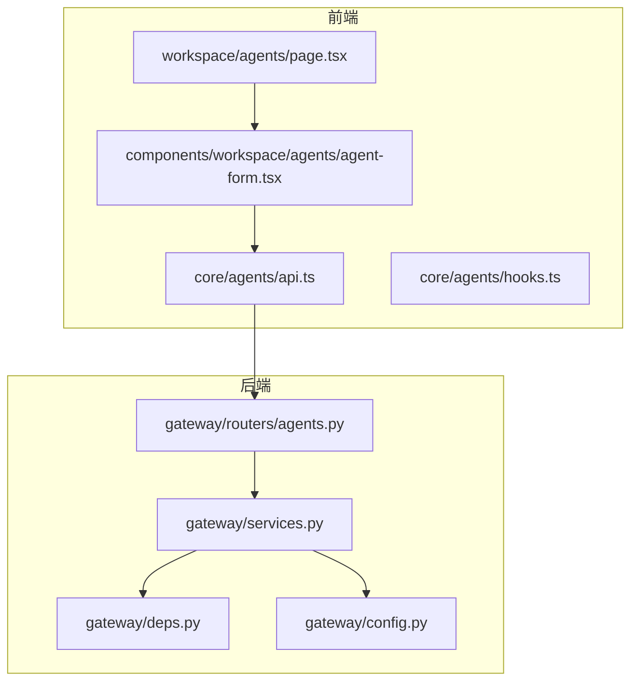
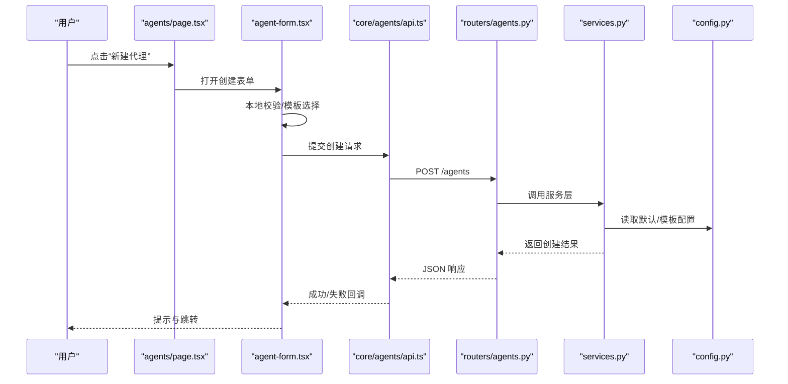
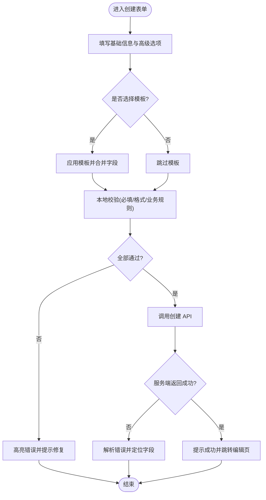
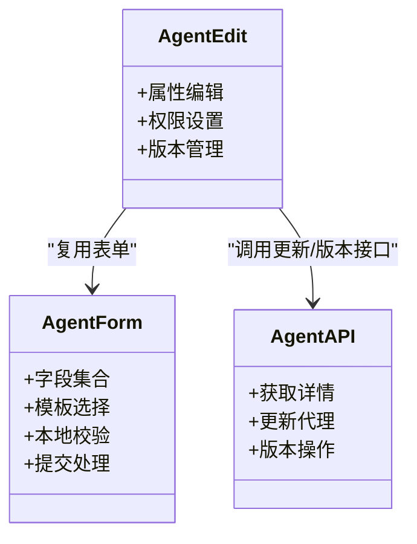
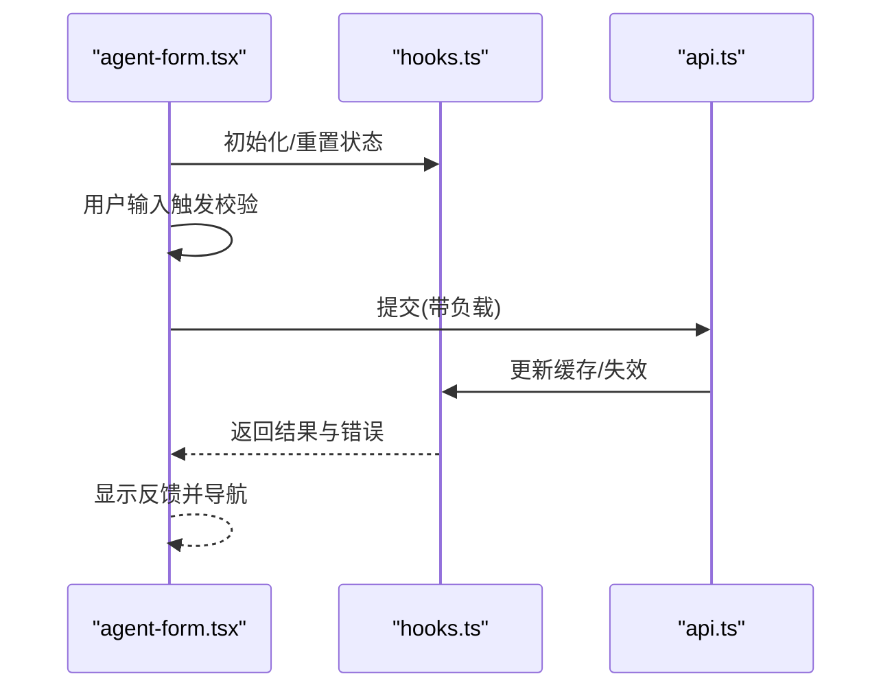
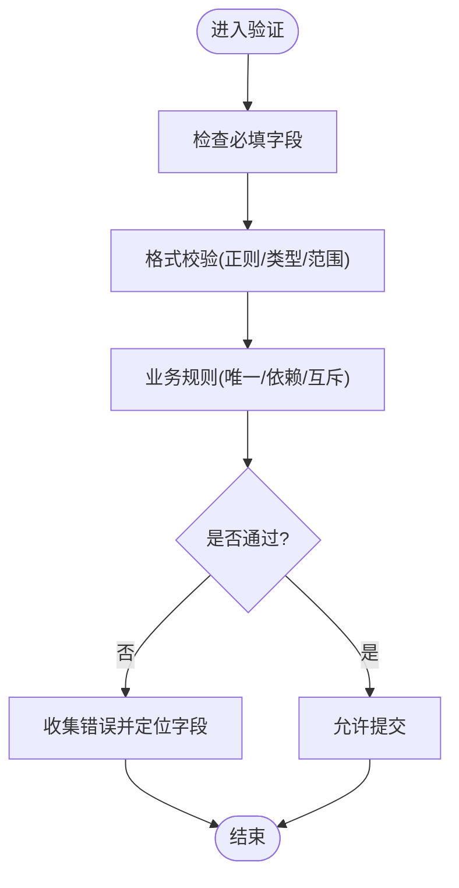
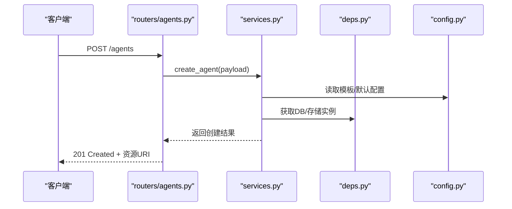
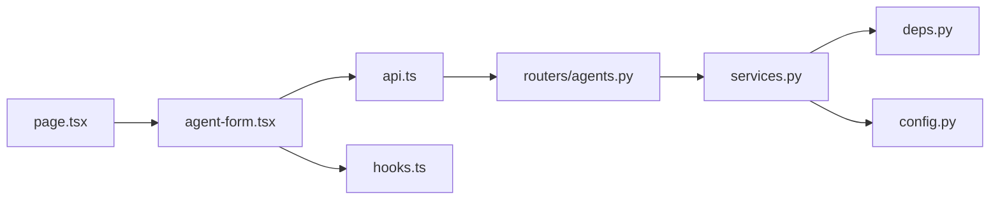

# 代理创建与编辑

<cite>
**本文引用的文件**   
- [frontend/src/app/workspace/agents/page.tsx](file://frontend/src/app/workspace/agents/page.tsx)
- [frontend/src/components/workspace/agents/agent-form.tsx](file://frontend/src/components/workspace/agents/agent-form.tsx)
- [frontend/src/core/agents/api.ts](file://frontend/src/core/agents/api.ts)
- [frontend/src/core/agents/hooks.ts](file://frontend/src/core/agents/hooks.ts)
- [backend/app/gateway/routers/agents.py](file://backend/app/gateway/routers/agents.py)
- [backend/app/gateway/services.py](file://backend/app/gateway/services.py)
- [backend/app/gateway/deps.py](file://backend/app/gateway/deps.py)
- [backend/app/gateway/config.py](file://backend/app/gateway/config.py)
</cite>

## 目录
1. [简介](#简介)
2. [项目结构](#项目结构)
3. [核心组件](#核心组件)
4. [架构总览](#架构总览)
5. [详细组件分析](#详细组件分析)
6. [依赖分析](#依赖分析)
7. [性能考虑](#性能考虑)
8. [故障排查指南](#故障排查指南)
9. [结论](#结论)
10. [附录](#附录)

## 简介
本文件聚焦于“代理创建与编辑”功能的前后端实现，覆盖以下关键主题：
- 代理创建表单的字段、验证规则、配置模板选择与提交流程
- 代理编辑界面的属性修改、权限设置与版本管理
- 表单状态管理（数据绑定、错误处理、提交反馈）
- 配置验证机制（必填字段、格式校验、业务规则）
- 推荐模式与最佳实践

## 项目结构
前端采用 Next.js 应用，代理相关页面位于 workspace/agents 路由下；表单组件集中于 components/workspace/agents；API 客户端与 hooks 位于 core/agents。后端基于 FastAPI 网关，提供代理相关的 REST 接口与服务层封装。

图表来源
- [frontend/src/app/workspace/agents/page.tsx](file://frontend/src/app/workspace/agents/page.tsx)
- [frontend/src/components/workspace/agents/agent-form.tsx](file://frontend/src/components/workspace/agents/agent-form.tsx)
- [frontend/src/core/agents/api.ts](file://frontend/src/core/agents/api.ts)
- [frontend/src/core/agents/hooks.ts](file://frontend/src/core/agents/hooks.ts)
- [backend/app/gateway/routers/agents.py](file://backend/app/gateway/routers/agents.py)
- [backend/app/gateway/services.py](file://backend/app/gateway/services.py)
- [backend/app/gateway/deps.py](file://backend/app/gateway/deps.py)
- [backend/app/gateway/config.py](file://backend/app/gateway/config.py)

章节来源
- [frontend/src/app/workspace/agents/page.tsx](file://frontend/src/app/workspace/agents/page.tsx)
- [frontend/src/components/workspace/agents/agent-form.tsx](file://frontend/src/components/workspace/agents/agent-form.tsx)
- [frontend/src/core/agents/api.ts](file://frontend/src/core/agents/api.ts)
- [frontend/src/core/agents/hooks.ts](file://frontend/src/core/agents/hooks.ts)
- [backend/app/gateway/routers/agents.py](file://backend/app/gateway/routers/agents.py)
- [backend/app/gateway/services.py](file://backend/app/gateway/services.py)
- [backend/app/gateway/deps.py](file://backend/app/gateway/deps.py)
- [backend/app/gateway/config.py](file://backend/app/gateway/config.py)

## 核心组件
- 代理列表与入口页：负责展示代理列表、跳转创建/编辑页面、触发新建动作。
- 代理表单组件：承载创建与编辑的统一表单，包含字段渲染、实时校验、模板选择与提交。
- API 客户端：封装代理的创建、更新、查询等 HTTP 调用。
- Hooks：封装 React Query 或自定义状态逻辑，统一处理加载、错误与缓存。
- 后端路由与服务：接收请求、执行校验、持久化并返回结果。

章节来源
- [frontend/src/app/workspace/agents/page.tsx](file://frontend/src/app/workspace/agents/page.tsx)
- [frontend/src/components/workspace/agents/agent-form.tsx](file://frontend/src/components/workspace/agents/agent-form.tsx)
- [frontend/src/core/agents/api.ts](file://frontend/src/core/agents/api.ts)
- [frontend/src/core/agents/hooks.ts](file://frontend/src/core/agents/hooks.ts)
- [backend/app/gateway/routers/agents.py](file://backend/app/gateway/routers/agents.py)
- [backend/app/gateway/services.py](file://backend/app/gateway/services.py)

## 架构总览
下图展示了从用户交互到后端处理的端到端流程，包括表单校验、模板填充、API 调用与响应反馈。

图表来源
- [frontend/src/app/workspace/agents/page.tsx](file://frontend/src/app/workspace/agents/page.tsx)
- [frontend/src/components/workspace/agents/agent-form.tsx](file://frontend/src/components/workspace/agents/agent-form.tsx)
- [frontend/src/core/agents/api.ts](file://frontend/src/core/agents/api.ts)
- [backend/app/gateway/routers/agents.py](file://backend/app/gateway/routers/agents.py)
- [backend/app/gateway/services.py](file://backend/app/gateway/services.py)
- [backend/app/gateway/config.py](file://backend/app/gateway/config.py)

## 详细组件分析

### 代理创建表单
- 字段与布局
  - 基础信息：名称、描述、标识符等
  - 模型与能力：模型选择、工具集、技能集
  - 行为与策略：重试、超时、并发、输出格式
  - 安全与权限：访问控制、密钥注入、沙箱策略
  - 元数据与标签：版本、环境、负责人、标签
- 配置模板选择
  - 提供预设模板（如“研究助手”、“代码审查”、“数据分析”），选择后自动填充模型、工具、权限等
  - 支持模板预览与二次编辑
- 字段验证
  - 必填检查：名称、标识符、模型等
  - 格式校验：邮箱、URL、正则表达式匹配
  - 业务规则：唯一性、互斥项、依赖关系
- 提交流程
  - 前端先进行即时校验，再调用 API
  - 成功后刷新列表并跳转至编辑页
  - 失败时显示具体错误位置与原因

图表来源
- [frontend/src/components/workspace/agents/agent-form.tsx](file://frontend/src/components/workspace/agents/agent-form.tsx)
- [frontend/src/core/agents/api.ts](file://frontend/src/core/agents/api.ts)

章节来源
- [frontend/src/components/workspace/agents/agent-form.tsx](file://frontend/src/components/workspace/agents/agent-form.tsx)
- [frontend/src/core/agents/api.ts](file://frontend/src/core/agents/api.ts)

### 代理编辑界面
- 属性修改
  - 可编辑项与创建表单一致，支持增量更新
  - 变更历史与差异对比（可选）
- 权限设置
  - 角色/成员授权、资源隔离、密钥范围
  - 敏感字段加密存储与最小权限原则
- 版本管理
  - 每次保存生成新版本，保留旧版本快照
  - 支持回滚、比较与发布标记
  - 版本标签与审计日志

图表来源
- [frontend/src/components/workspace/agents/agent-form.tsx](file://frontend/src/components/workspace/agents/agent-form.tsx)
- [frontend/src/core/agents/api.ts](file://frontend/src/core/agents/api.ts)

章节来源
- [frontend/src/components/workspace/agents/agent-form.tsx](file://frontend/src/components/workspace/agents/agent-form.tsx)
- [frontend/src/core/agents/api.ts](file://frontend/src/core/agents/api.ts)

### 表单状态管理
- 数据绑定
  - 受控组件模式，字段值与状态双向绑定
  - 模板应用时进行合并策略（深合并/覆盖策略）
- 错误处理
  - 即时校验错误与异步校验错误分离
  - 服务端错误映射到具体字段
- 提交反馈
  - 加载中禁用提交按钮
  - 成功/失败全局提示与局部错误展示
  - 防抖与幂等提交（避免重复提交）

图表来源
- [frontend/src/components/workspace/agents/agent-form.tsx](file://frontend/src/components/workspace/agents/agent-form.tsx)
- [frontend/src/core/agents/hooks.ts](file://frontend/src/core/agents/hooks.ts)
- [frontend/src/core/agents/api.ts](file://frontend/src/core/agents/api.ts)

章节来源
- [frontend/src/components/workspace/agents/agent-form.tsx](file://frontend/src/components/workspace/agents/agent-form.tsx)
- [frontend/src/core/agents/hooks.ts](file://frontend/src/core/agents/hooks.ts)
- [frontend/src/core/agents/api.ts](file://frontend/src/core/agents/api.ts)

### 配置验证机制
- 必填字段检查
  - 名称、标识符、模型等为必填
  - 空值、空白字符与非法枚举值拦截
- 格式验证
  - URL、邮箱、IP、端口、正则表达式
  - 长度限制与特殊字符过滤
- 业务规则校验
  - 唯一性（标识符/名称）
  - 依赖关系（工具/技能是否存在）
  - 互斥项（某些能力不可同时启用）
  - 安全策略（密钥注入范围、沙箱开关）

图表来源
- [frontend/src/components/workspace/agents/agent-form.tsx](file://frontend/src/components/workspace/agents/agent-form.tsx)

章节来源
- [frontend/src/components/workspace/agents/agent-form.tsx](file://frontend/src/components/workspace/agents/agent-form.tsx)

### 后端路由与服务
- 路由层
  - 定义创建/更新/查询/版本操作的 REST 接口
  - 参数解析、鉴权、限流与审计
- 服务层
  - 聚合配置、模板合并、权限校验
  - 持久化与版本快照
- 依赖与配置
  - 依赖注入（数据库、存储、外部服务）
  - 配置中心与环境变量

图表来源
- [backend/app/gateway/routers/agents.py](file://backend/app/gateway/routers/agents.py)
- [backend/app/gateway/services.py](file://backend/app/gateway/services.py)
- [backend/app/gateway/deps.py](file://backend/app/gateway/deps.py)
- [backend/app/gateway/config.py](file://backend/app/gateway/config.py)

章节来源
- [backend/app/gateway/routers/agents.py](file://backend/app/gateway/routers/agents.py)
- [backend/app/gateway/services.py](file://backend/app/gateway/services.py)
- [backend/app/gateway/deps.py](file://backend/app/gateway/deps.py)
- [backend/app/gateway/config.py](file://backend/app/gateway/config.py)

## 依赖分析
- 前端依赖
  - page.tsx 依赖 agent-form.tsx 与路由导航
  - agent-form.tsx 依赖 api.ts 与 hooks.ts
  - hooks.ts 可能依赖 React Query 或其他状态库
- 后端依赖
  - routers/agents.py 依赖 services.py 与 deps.py
  - services.py 依赖 config.py 与外部存储/数据库

图表来源
- [frontend/src/app/workspace/agents/page.tsx](file://frontend/src/app/workspace/agents/page.tsx)
- [frontend/src/components/workspace/agents/agent-form.tsx](file://frontend/src/components/workspace/agents/agent-form.tsx)
- [frontend/src/core/agents/api.ts](file://frontend/src/core/agents/api.ts)
- [frontend/src/core/agents/hooks.ts](file://frontend/src/core/agents/hooks.ts)
- [backend/app/gateway/routers/agents.py](file://backend/app/gateway/routers/agents.py)
- [backend/app/gateway/services.py](file://backend/app/gateway/services.py)
- [backend/app/gateway/deps.py](file://backend/app/gateway/deps.py)
- [backend/app/gateway/config.py](file://backend/app/gateway/config.py)

章节来源
- [frontend/src/app/workspace/agents/page.tsx](file://frontend/src/app/workspace/agents/page.tsx)
- [frontend/src/components/workspace/agents/agent-form.tsx](file://frontend/src/components/workspace/agents/agent-form.tsx)
- [frontend/src/core/agents/api.ts](file://frontend/src/core/agents/api.ts)
- [frontend/src/core/agents/hooks.ts](file://frontend/src/core/agents/hooks.ts)
- [backend/app/gateway/routers/agents.py](file://backend/app/gateway/routers/agents.py)
- [backend/app/gateway/services.py](file://backend/app/gateway/services.py)
- [backend/app/gateway/deps.py](file://backend/app/gateway/deps.py)
- [backend/app/gateway/config.py](file://backend/app/gateway/config.py)

## 性能考虑
- 前端
  - 使用受控组件与惰性校验，减少不必要的重渲染
  - 模板应用采用增量合并，避免全量替换
  - 提交前做去抖与幂等处理，防止重复请求
- 后端
  - 对大对象进行分块校验与懒加载
  - 版本快照采用增量存储与压缩
  - 缓存常用模板与默认配置，降低 I/O 开销

## 故障排查指南
- 常见错误
  - 必填字段缺失：检查表单初始值与模板合并逻辑
  - 格式不合法：确认正则与边界条件
  - 唯一性冲突：检查标识符/名称的唯一性约束
  - 权限不足：确认当前用户角色与资源授权
- 调试建议
  - 开启网络面板查看请求/响应体
  - 在 hooks 中打印状态变化与错误堆栈
  - 在后端路由与服务层增加结构化日志

章节来源
- [frontend/src/components/workspace/agents/agent-form.tsx](file://frontend/src/components/workspace/agents/agent-form.tsx)
- [frontend/src/core/agents/hooks.ts](file://frontend/src/core/agents/hooks.ts)
- [backend/app/gateway/routers/agents.py](file://backend/app/gateway/routers/agents.py)
- [backend/app/gateway/services.py](file://backend/app/gateway/services.py)

## 结论
代理创建与编辑功能通过前后端协同实现了完整的表单体验与配置管理能力。前端强调用户体验与即时反馈，后端确保安全性与一致性。通过模板化与版本管理，系统提升了可维护性与扩展性。建议在生产环境中强化权限控制、审计日志与性能监控。

## 附录
- 推荐模式
  - 以模板驱动快速创建，结合最小权限原则配置
  - 将通用能力抽象为工具/技能，按需装配
  - 使用语义化版本与标签管理发布节奏
- 最佳实践
  - 表单校验分层：前端即时校验 + 后端严格校验
  - 错误信息可读且可定位，便于用户快速修复
  - 版本快照与回滚策略完善，保障变更可追溯