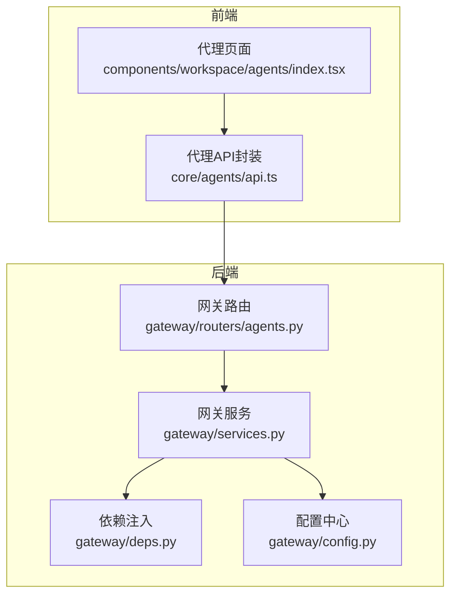
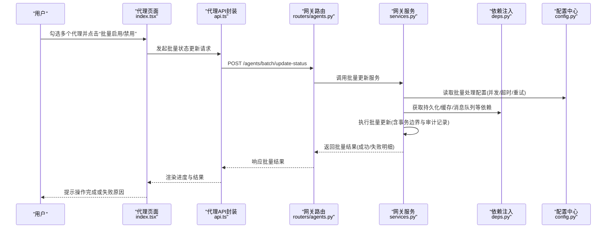
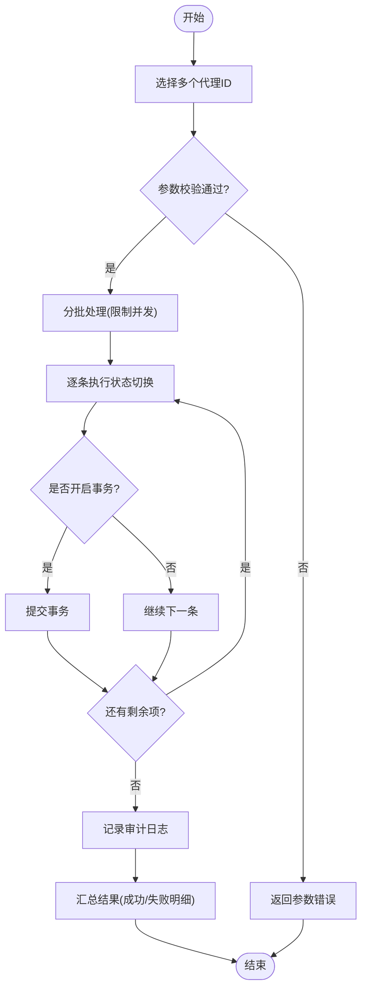
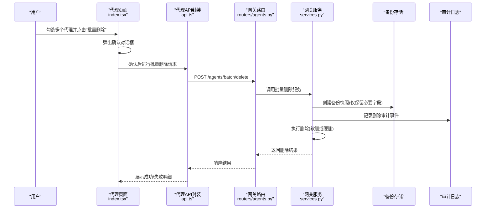
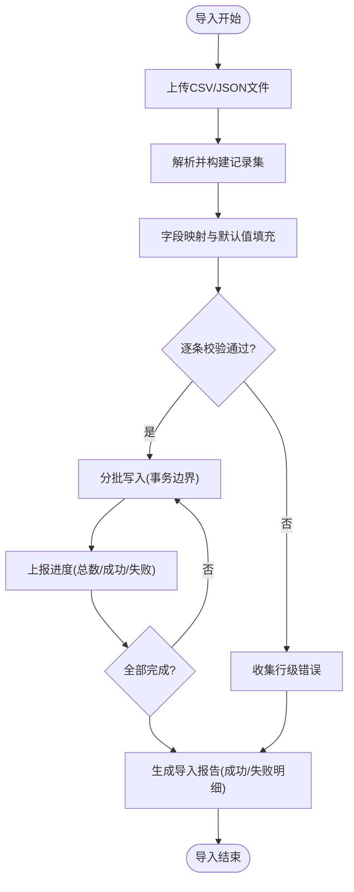
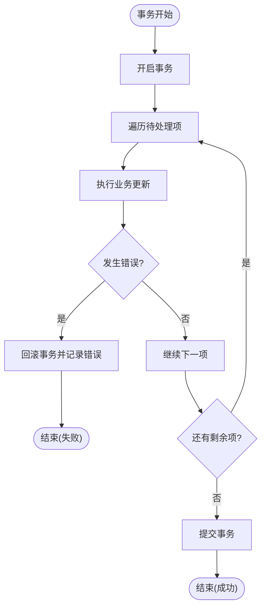
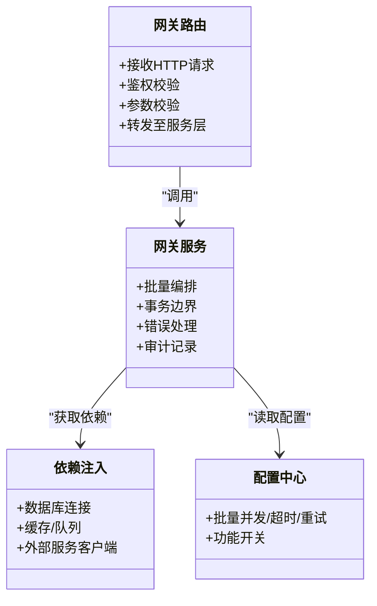
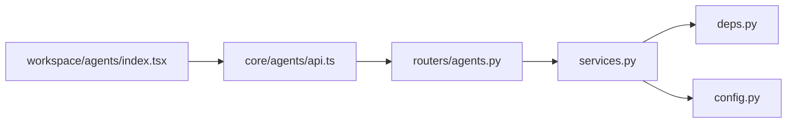

# 代理批量操作

<cite>
**本文引用的文件**   
- [backend/app/gateway/routers/agents.py](file://backend/app/gateway/routers/agents.py)
- [backend/app/gateway/services.py](file://backend/app/gateway/services.py)
- [backend/app/gateway/deps.py](file://backend/app/gateway/deps.py)
- [backend/app/gateway/config.py](file://backend/app/gateway/config.py)
- [frontend/src/core/agents/api.ts](file://frontend/src/core/agents/api.ts)
- [frontend/src/components/workspace/agents/index.tsx](file://frontend/src/components/workspace/agents/index.tsx)
</cite>

## 目录
1. [简介](#简介)
2. [项目结构](#项目结构)
3. [核心组件](#核心组件)
4. [架构总览](#架构总览)
5. [详细组件分析](#详细组件分析)
6. [依赖关系分析](#依赖关系分析)
7. [性能考虑](#性能考虑)
8. [故障排查指南](#故障排查指南)
9. [结论](#结论)
10. [附录](#附录)

## 简介
本文件围绕“代理批量操作”能力进行系统化文档化，覆盖以下关键主题：
- 批量启用/禁用：多选机制、状态切换与批量API调用
- 删除安全机制：确认对话框、数据备份与恢复选项
- 导入导出：文件格式支持、数据映射与批量处理
- 事务处理：操作回滚、错误处理与进度反馈
- 权限控制与审计日志：访问控制策略与可追溯性方案

说明：当前仓库未提供显式的“批量启用/禁用”“批量删除”“导入导出”等后端路由实现。本文在严格依据现有代码的基础上，给出基于现有接口与前端能力的现状分析与扩展建议，并提供面向实现的架构图与流程图，便于后续落地。

## 项目结构
与代理批量操作相关的代码主要分布在前后端两个层面：
- 后端网关层：路由定义、服务编排、依赖注入与配置
- 前端工作区：代理列表展示、交互与API调用封装

图表来源
- [backend/app/gateway/routers/agents.py](file://backend/app/gateway/routers/agents.py)
- [backend/app/gateway/services.py](file://backend/app/gateway/services.py)
- [backend/app/gateway/deps.py](file://backend/app/gateway/deps.py)
- [backend/app/gateway/config.py](file://backend/app/gateway/config.py)
- [frontend/src/components/workspace/agents/index.tsx](file://frontend/src/components/workspace/agents/index.tsx)
- [frontend/src/core/agents/api.ts](file://frontend/src/core/agents/api.ts)

章节来源
- [backend/app/gateway/routers/agents.py](file://backend/app/gateway/routers/agents.py)
- [backend/app/gateway/services.py](file://backend/app/gateway/services.py)
- [backend/app/gateway/deps.py](file://backend/app/gateway/deps.py)
- [backend/app/gateway/config.py](file://backend/app/gateway/config.py)
- [frontend/src/components/workspace/agents/index.tsx](file://frontend/src/components/workspace/agents/index.tsx)
- [frontend/src/core/agents/api.ts](file://frontend/src/core/agents/api.ts)

## 核心组件
- 网关路由（agents.py）：暴露代理相关HTTP接口，是批量操作的入口点候选位置
- 网关服务（services.py）：承载业务编排逻辑，适合集中实现批量启停、批量删除、导入导出等用例
- 依赖注入（deps.py）：提供数据库、存储、外部服务等依赖的获取方式，支撑事务与资源管理
- 配置（config.py）：集中管理功能开关、限流、超时、重试等参数，影响批量处理的吞吐与稳定性
- 前端API（api.ts）：统一封装代理相关请求，便于后续新增批量接口
- 代理页面（index.tsx）：渲染代理列表与交互，承载多选、批量操作触发与结果反馈

章节来源
- [backend/app/gateway/routers/agents.py](file://backend/app/gateway/routers/agents.py)
- [backend/app/gateway/services.py](file://backend/app/gateway/services.py)
- [backend/app/gateway/deps.py](file://backend/app/gateway/deps.py)
- [backend/app/gateway/config.py](file://backend/app/gateway/config.py)
- [frontend/src/core/agents/api.ts](file://frontend/src/core/agents/api.ts)
- [frontend/src/components/workspace/agents/index.tsx](file://frontend/src/components/workspace/agents/index.tsx)

## 架构总览
下图展示了从前端到后端的典型批量操作流程（以“批量启用/禁用”为例），并标注了可扩展的事务与审计落点。

图表来源
- [backend/app/gateway/routers/agents.py](file://backend/app/gateway/routers/agents.py)
- [backend/app/gateway/services.py](file://backend/app/gateway/services.py)
- [backend/app/gateway/deps.py](file://backend/app/gateway/deps.py)
- [backend/app/gateway/config.py](file://backend/app/gateway/config.py)
- [frontend/src/components/workspace/agents/index.tsx](file://frontend/src/components/workspace/agents/index.tsx)
- [frontend/src/core/agents/api.ts](file://frontend/src/core/agents/api.ts)

## 详细组件分析

### 批量启用/禁用
- 多选机制
  - 前端通过列表复选框收集目标代理ID集合，提交前进行最小数量校验与重复ID去重
  - 建议在提交前对选中项的状态做二次确认，避免误操作
- 状态切换
  - 后端应在服务层按批次遍历目标ID，逐个执行状态变更；为提升吞吐可采用有限并发
  - 每个子任务需具备幂等性，确保重试不会导致状态不一致
- 批量API调用
  - 推荐在后端新增统一的批量更新接口，由路由转发至服务层编排
  - 返回结构应包含总体结果与逐条明细，便于前端展示失败原因与重试入口

图表来源
- [backend/app/gateway/routers/agents.py](file://backend/app/gateway/routers/agents.py)
- [backend/app/gateway/services.py](file://backend/app/gateway/services.py)
- [backend/app/gateway/deps.py](file://backend/app/gateway/deps.py)
- [backend/app/gateway/config.py](file://backend/app/gateway/config.py)

章节来源
- [backend/app/gateway/routers/agents.py](file://backend/app/gateway/routers/agents.py)
- [backend/app/gateway/services.py](file://backend/app/gateway/services.py)
- [backend/app/gateway/deps.py](file://backend/app/gateway/deps.py)
- [backend/app/gateway/config.py](file://backend/app/gateway/config.py)
- [frontend/src/components/workspace/agents/index.tsx](file://frontend/src/components/workspace/agents/index.tsx)
- [frontend/src/core/agents/api.ts](file://frontend/src/core/agents/api.ts)

### 删除操作的安全机制
- 确认对话框
  - 前端在批量删除前弹出确认框，显示将被删除的代理名称/数量，要求二次确认
- 数据备份
  - 建议在删除前将必要字段快照写入只读存储或归档表，保留可恢复窗口期
- 恢复选项
  - 提供“软删除”标记与“恢复”接口，允许在保留期内撤销删除
  - 若采用硬删除，需提供基于备份的恢复流程与审批链路

图表来源
- [backend/app/gateway/routers/agents.py](file://backend/app/gateway/routers/agents.py)
- [backend/app/gateway/services.py](file://backend/app/gateway/services.py)
- [backend/app/gateway/deps.py](file://backend/app/gateway/deps.py)
- [backend/app/gateway/config.py](file://backend/app/gateway/config.py)
- [frontend/src/components/workspace/agents/index.tsx](file://frontend/src/components/workspace/agents/index.tsx)
- [frontend/src/core/agents/api.ts](file://frontend/src/core/agents/api.ts)

章节来源
- [backend/app/gateway/routers/agents.py](file://backend/app/gateway/routers/agents.py)
- [backend/app/gateway/services.py](file://backend/app/gateway/services.py)
- [backend/app/gateway/deps.py](file://backend/app/gateway/deps.py)
- [backend/app/gateway/config.py](file://backend/app/gateway/config.py)
- [frontend/src/components/workspace/agents/index.tsx](file://frontend/src/components/workspace/agents/index.tsx)
- [frontend/src/core/agents/api.ts](file://frontend/src/core/agents/api.ts)

### 导入导出功能
- 文件格式支持
  - 导出：CSV/JSON（便于二次加工与自动化）
  - 导入：CSV/JSON（建议同时支持XLSX，但需额外解析库）
- 数据映射
  - 建立字段映射表，明确必填/可选字段、枚举值映射、默认值填充规则
  - 导入时进行强校验，输出详细的行级错误信息
- 批量处理
  - 大文件分块读取与处理，避免内存峰值过高
  - 提供进度回调或轮询接口，便于前端展示导入进度

图表来源
- [backend/app/gateway/routers/agents.py](file://backend/app/gateway/routers/agents.py)
- [backend/app/gateway/services.py](file://backend/app/gateway/services.py)
- [backend/app/gateway/deps.py](file://backend/app/gateway/deps.py)
- [backend/app/gateway/config.py](file://backend/app/gateway/config.py)
- [frontend/src/core/agents/api.ts](file://frontend/src/core/agents/api.ts)

章节来源
- [backend/app/gateway/routers/agents.py](file://backend/app/gateway/routers/agents.py)
- [backend/app/gateway/services.py](file://backend/app/gateway/services.py)
- [backend/app/gateway/deps.py](file://backend/app/gateway/deps.py)
- [backend/app/gateway/config.py](file://backend/app/gateway/config.py)
- [frontend/src/core/agents/api.ts](file://frontend/src/core/agents/api.ts)

### 事务处理机制
- 操作回滚
  - 在服务层使用事务包裹批量写操作，任一子任务失败则整体回滚或按策略部分提交
  - 对于跨系统调用（如消息队列、外部API），引入补偿机制或幂等键
- 错误处理
  - 区分可重试与不可重试错误，设置退避重试上限
  - 记录异常上下文（目标ID、错误类型、堆栈摘要）
- 进度反馈
  - 长耗时批量操作建议采用异步任务+进度查询模式
  - 前端轮询或SSE推送进度，支持取消与断点续传

图表来源
- [backend/app/gateway/services.py](file://backend/app/gateway/services.py)
- [backend/app/gateway/deps.py](file://backend/app/gateway/deps.py)
- [backend/app/gateway/config.py](file://backend/app/gateway/config.py)

章节来源
- [backend/app/gateway/services.py](file://backend/app/gateway/services.py)
- [backend/app/gateway/deps.py](file://backend/app/gateway/deps.py)
- [backend/app/gateway/config.py](file://backend/app/gateway/config.py)

### 权限控制与审计日志
- 权限控制
  - 在路由层增加鉴权中间件，校验用户角色/资源权限
  - 针对批量操作实施更严格的RBAC策略（例如仅管理员可批量删除）
- 审计日志
  - 记录操作主体、时间戳、目标对象、动作类型、结果与关键参数
  - 敏感操作（批量删除、导入覆盖）强制记录并支持检索与导出

图表来源
- [backend/app/gateway/routers/agents.py](file://backend/app/gateway/routers/agents.py)
- [backend/app/gateway/services.py](file://backend/app/gateway/services.py)
- [backend/app/gateway/deps.py](file://backend/app/gateway/deps.py)
- [backend/app/gateway/config.py](file://backend/app/gateway/config.py)

章节来源
- [backend/app/gateway/routers/agents.py](file://backend/app/gateway/routers/agents.py)
- [backend/app/gateway/services.py](file://backend/app/gateway/services.py)
- [backend/app/gateway/deps.py](file://backend/app/gateway/deps.py)
- [backend/app/gateway/config.py](file://backend/app/gateway/config.py)

## 依赖关系分析
- 组件耦合
  - 路由与服务解耦：路由负责协议与校验，服务负责业务编排
  - 服务与依赖注入解耦：通过依赖注入获取DB/缓存/队列等，便于测试与替换
- 外部依赖
  - 数据库：用于持久化代理状态与审计日志
  - 缓存/队列：用于限流、去重与异步任务调度
  - 配置中心：集中管理批量处理参数
- 潜在循环依赖
  - 应避免服务层反向依赖路由层；所有外部资源均通过依赖注入获取

图表来源
- [backend/app/gateway/routers/agents.py](file://backend/app/gateway/routers/agents.py)
- [backend/app/gateway/services.py](file://backend/app/gateway/services.py)
- [backend/app/gateway/deps.py](file://backend/app/gateway/deps.py)
- [backend/app/gateway/config.py](file://backend/app/gateway/config.py)
- [frontend/src/core/agents/api.ts](file://frontend/src/core/agents/api.ts)
- [frontend/src/components/workspace/agents/index.tsx](file://frontend/src/components/workspace/agents/index.tsx)

章节来源
- [backend/app/gateway/routers/agents.py](file://backend/app/gateway/routers/agents.py)
- [backend/app/gateway/services.py](file://backend/app/gateway/services.py)
- [backend/app/gateway/deps.py](file://backend/app/gateway/deps.py)
- [backend/app/gateway/config.py](file://backend/app/gateway/config.py)
- [frontend/src/core/agents/api.ts](file://frontend/src/core/agents/api.ts)
- [frontend/src/components/workspace/agents/index.tsx](file://frontend/src/components/workspace/agents/index.tsx)

## 性能考虑
- 并发与限流
  - 根据系统负载动态调整批量并发度，避免压垮下游存储或服务
- 分页与批大小
  - 将大批量拆分为小批次，降低单次事务体积与锁竞争
- 超时与重试
  - 为每条子任务设置合理超时与最大重试次数，采用指数退避
- 资源隔离
  - 对批量操作使用独立线程池/进程池，避免阻塞常规请求

[本节为通用指导，不直接分析具体文件]

## 故障排查指南
- 常见问题定位
  - 批量接口无响应：检查路由是否正确注册、服务是否抛出未捕获异常
  - 部分失败：查看服务层返回的明细错误，结合审计日志定位具体ID
  - 进度不更新：确认异步任务状态是否持久化、前端轮询间隔是否合理
- 日志与追踪
  - 为批量操作添加唯一traceId，贯穿路由、服务、依赖层
  - 记录关键节点耗时与错误堆栈，便于快速定位瓶颈与异常

章节来源
- [backend/app/gateway/routers/agents.py](file://backend/app/gateway/routers/agents.py)
- [backend/app/gateway/services.py](file://backend/app/gateway/services.py)
- [backend/app/gateway/deps.py](file://backend/app/gateway/deps.py)
- [backend/app/gateway/config.py](file://backend/app/gateway/config.py)
- [frontend/src/core/agents/api.ts](file://frontend/src/core/agents/api.ts)
- [frontend/src/components/workspace/agents/index.tsx](file://frontend/src/components/workspace/agents/index.tsx)

## 结论
- 当前仓库已具备网关路由、服务编排、依赖注入与配置中心等基础能力，可作为批量操作的骨架
- 批量启用/禁用、删除安全、导入导出、事务与审计等能力可在上述骨架上快速扩展
- 建议优先补齐批量接口与服务编排，完善权限与审计，再逐步优化性能与用户体验

[本节为总结性内容，不直接分析具体文件]

## 附录
- 术语
  - 软删除：仅标记删除，保留数据以便恢复
  - 幂等：同一请求多次执行结果一致
  - 事务：一组操作的原子性保障
- 参考路径
  - 路由层示例：[backend/app/gateway/routers/agents.py](file://backend/app/gateway/routers/agents.py)
  - 服务层示例：[backend/app/gateway/services.py](file://backend/app/gateway/services.py)
  - 依赖注入示例：[backend/app/gateway/deps.py](file://backend/app/gateway/deps.py)
  - 配置中心示例：[backend/app/gateway/config.py](file://backend/app/gateway/config.py)
  - 前端API封装：[frontend/src/core/agents/api.ts](file://frontend/src/core/agents/api.ts)
  - 前端页面：[frontend/src/components/workspace/agents/index.tsx](file://frontend/src/components/workspace/agents/index.tsx)