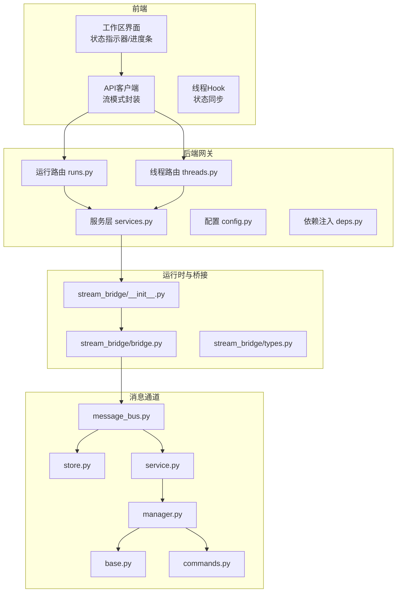
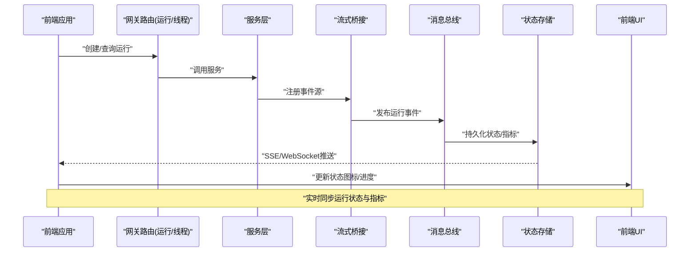
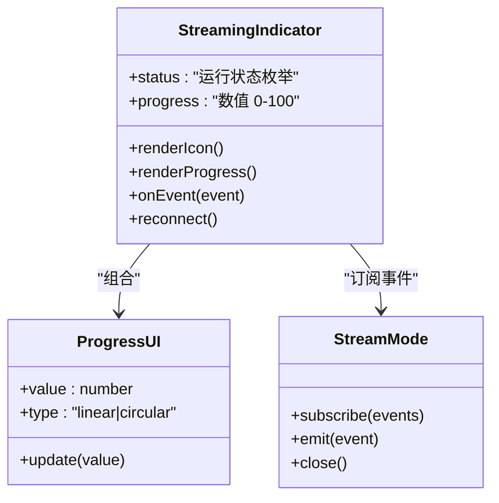
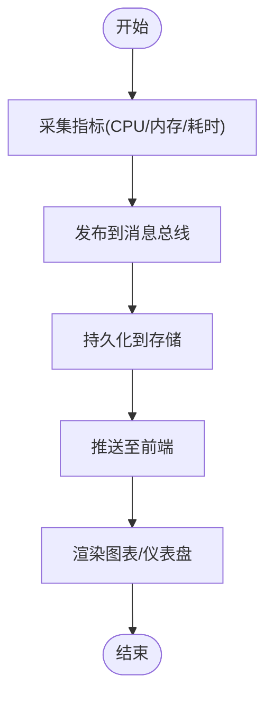
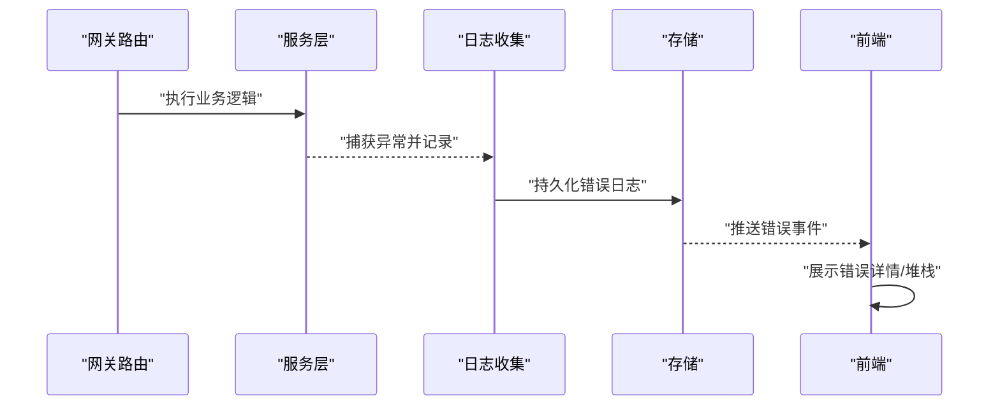
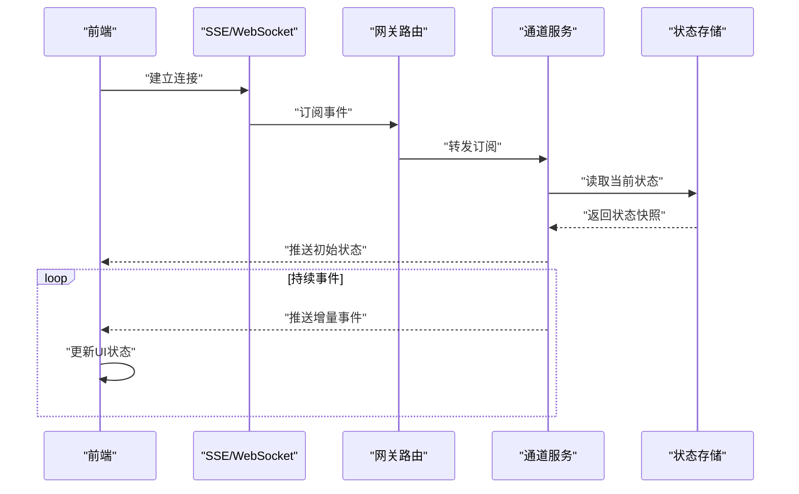
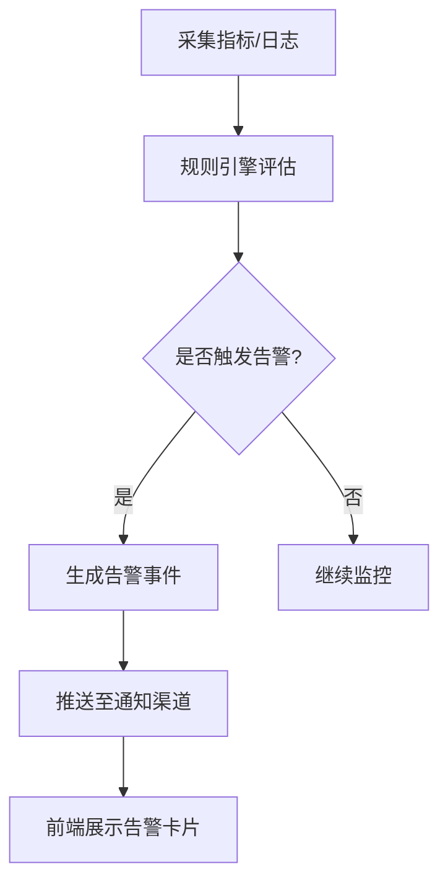
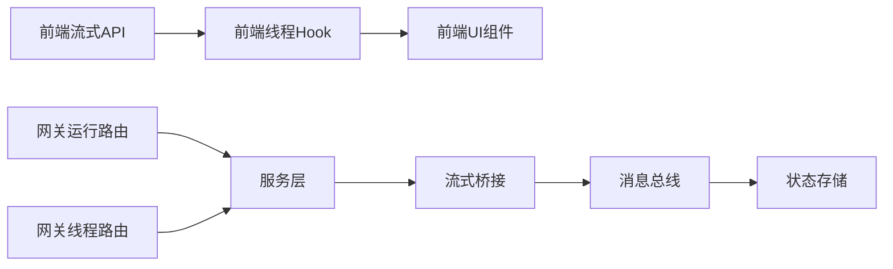

# 代理状态监控

<cite>
**本文引用的文件**   
- [backend/app/gateway/routers/runs.py](file://backend/app/gateway/routers/runs.py)
- [backend/app/gateway/routers/threads.py](file://backend/app/gateway/routers/threads.py)
- [backend/app/gateway/services.py](file://backend/app/gateway/services.py)
- [backend/app/gateway/config.py](file://backend/app/gateway/config.py)
- [backend/app/gateway/deps.py](file://backend/app/gateway/deps.py)
- [backend/app/channels/message_bus.py](file://backend/app/channels/message_bus.py)
- [backend/app/channels/store.py](file://backend/app/channels/store.py)
- [backend/app/channels/service.py](file://backend/app/channels/service.py)
- [backend/app/channels/base.py](file://backend/app/channels/base.py)
- [backend/app/channels/manager.py](file://backend/app/channels/manager.py)
- [backend/app/channels/commands.py](file://backend/app/channels/commands.py)
- [backend/packages/harness/deerflow/runtime/stream_bridge/__init__.py](file://backend/packages/harness/deerflow/runtime/stream_bridge/__init__.py)
- [backend/packages/harness/deerflow/runtime/stream_bridge/bridge.py](file://backend/packages/harness/deerflow/runtime/stream_bridge/bridge.py)
- [backend/packages/harness/deerflow/runtime/stream_bridge/types.py](file://backend/packages/harness/deerflow/runtime/stream_bridge/types.py)
- [frontend/src/components/workspace/streaming-indicator.tsx](file://frontend/src/components/workspace/streaming-indicator.tsx)
- [frontend/src/components/ui/progress.tsx](file://frontend/src/components/ui/progress.tsx)
- [frontend/src/core/api/stream-mode.ts](file://frontend/src/core/api/stream-mode.ts)
- [frontend/src/core/threads/hooks.ts](file://frontend/src/core/threads/hooks.ts)
- [frontend/src/core/threads/index.ts](file://frontend/src/core/threads/index.ts)
- [frontend/src/core/threads/utils.ts](file://frontend/src/core/threads/utils.ts)
</cite>

## 目录
1. [简介](#简介)
2. [项目结构](#项目结构)
3. [核心组件](#核心组件)
4. [架构总览](#架构总览)
5. [详细组件分析](#详细组件分析)
6. [依赖分析](#依赖分析)
7. [性能考虑](#性能考虑)
8. [故障排查指南](#故障排查指南)
9. [结论](#结论)
10. [附录](#附录)

## 简介
本文件围绕“代理状态监控”能力，系统化梳理运行状态显示、性能指标展示、错误日志收集与实时通信机制，并给出可视化与告警配置建议。内容覆盖后端网关路由与服务、流式桥接通道、消息总线与存储、前端状态指示器与进度条等关键模块，帮助读者快速理解从事件采集到前端可视化的完整链路。

## 项目结构
本项目采用前后端分离架构：
- 后端提供网关路由、服务编排、流式桥接与消息总线，负责采集代理运行状态、性能指标与错误日志，并通过SSE/WebSocket推送至前端。
- 前端通过API与流式通道订阅事件，渲染运行状态图标、进度指示器与图表，并提供告警配置入口。

图示来源
- [backend/app/gateway/routers/runs.py](file://backend/app/gateway/routers/runs.py)
- [backend/app/gateway/routers/threads.py](file://backend/app/gateway/routers/threads.py)
- [backend/app/gateway/services.py](file://backend/app/gateway/services.py)
- [backend/app/gateway/config.py](file://backend/app/gateway/config.py)
- [backend/app/gateway/deps.py](file://backend/app/gateway/deps.py)
- [backend/packages/harness/deerflow/runtime/stream_bridge/__init__.py](file://backend/packages/harness/deerflow/runtime/stream_bridge/__init__.py)
- [backend/packages/harness/deerflow/runtime/stream_bridge/bridge.py](file://backend/packages/harness/deerflow/runtime/stream_bridge/bridge.py)
- [backend/packages/harness/deerflow/runtime/stream_bridge/types.py](file://backend/packages/harness/deerflow/runtime/stream_bridge/types.py)
- [backend/app/channels/message_bus.py](file://backend/app/channels/message_bus.py)
- [backend/app/channels/store.py](file://backend/app/channels/store.py)
- [backend/app/channels/service.py](file://backend/app/channels/service.py)
- [backend/app/channels/base.py](file://backend/app/channels/base.py)
- [backend/app/channels/manager.py](file://backend/app/channels/manager.py)
- [backend/app/channels/commands.py](file://backend/app/channels/commands.py)

章节来源
- [backend/app/gateway/routers/runs.py](file://backend/app/gateway/routers/runs.py)
- [backend/app/gateway/routers/threads.py](file://backend/app/gateway/routers/threads.py)
- [backend/app/gateway/services.py](file://backend/app/gateway/services.py)
- [backend/app/gateway/config.py](file://backend/app/gateway/config.py)
- [backend/app/gateway/deps.py](file://backend/app/gateway/deps.py)
- [backend/packages/harness/deerflow/runtime/stream_bridge/__init__.py](file://backend/packages/harness/deerflow/runtime/stream_bridge/__init__.py)
- [backend/packages/harness/deerflow/runtime/stream_bridge/bridge.py](file://backend/packages/harness/deerflow/runtime/stream_bridge/bridge.py)
- [backend/packages/harness/deerflow/runtime/stream_bridge/types.py](file://backend/packages/harness/deerflow/runtime/stream_bridge/types.py)
- [backend/app/channels/message_bus.py](file://backend/app/channels/message_bus.py)
- [backend/app/channels/store.py](file://backend/app/channels/store.py)
- [backend/app/channels/service.py](file://backend/app/channels/service.py)
- [backend/app/channels/base.py](file://backend/app/channels/base.py)
- [backend/app/channels/manager.py](file://backend/app/channels/manager.py)
- [backend/app/channels/commands.py](file://backend/app/channels/commands.py)

## 核心组件
- 运行状态显示组件（前端）
  - 状态图标：根据代理运行阶段（待处理/运行中/成功/失败/取消）切换图标与颜色。
  - 进度指示器：基于任务完成度或步骤数计算百分比，支持线性与环形两种样式。
  - 实时更新：通过SSE/WebSocket事件驱动更新，避免轮询带来的开销。
- 性能指标展示（前端）
  - CPU使用率、内存占用、执行时间统计以折线图/仪表盘形式呈现。
  - 数据来源于后端聚合的运行时指标，按时间窗口滑动展示。
- 错误日志收集（后端）
  - 异常捕获：在网关与服务层统一捕获异常，记录堆栈跟踪与上下文信息。
  - 调试输出：结构化日志包含请求ID、线程ID、耗时、资源占用等。
- 实时通信机制（前后端）
  - WebSocket/SSE连接：前端建立持久连接，后端按事件类型广播。
  - 事件监听：前端订阅运行状态、进度、指标与错误事件。
  - 状态同步：服务端维护会话级状态，断线重连后增量同步。

章节来源
- [frontend/src/components/workspace/streaming-indicator.tsx](file://frontend/src/components/workspace/streaming-indicator.tsx)
- [frontend/src/components/ui/progress.tsx](file://frontend/src/components/ui/progress.tsx)
- [frontend/src/core/api/stream-mode.ts](file://frontend/src/core/api/stream-mode.ts)
- [frontend/src/core/threads/hooks.ts](file://frontend/src/core/threads/hooks.ts)
- [frontend/src/core/threads/index.ts](file://frontend/src/core/threads/index.ts)
- [frontend/src/core/threads/utils.ts](file://frontend/src/core/threads/utils.ts)
- [backend/app/gateway/routers/runs.py](file://backend/app/gateway/routers/runs.py)
- [backend/app/gateway/routers/threads.py](file://backend/app/gateway/routers/threads.py)
- [backend/app/gateway/services.py](file://backend/app/gateway/services.py)
- [backend/app/channels/message_bus.py](file://backend/app/channels/message_bus.py)
- [backend/app/channels/store.py](file://backend/app/channels/store.py)
- [backend/app/channels/service.py](file://backend/app/channels/service.py)
- [backend/app/channels/base.py](file://backend/app/channels/base.py)
- [backend/app/channels/manager.py](file://backend/app/channels/manager.py)
- [backend/app/channels/commands.py](file://backend/app/channels/commands.py)

## 架构总览
下图展示了从代理运行事件到前端可视化的端到端流程，包括状态变更、指标上报、错误日志与实时推送。

图示来源
- [backend/app/gateway/routers/runs.py](file://backend/app/gateway/routers/runs.py)
- [backend/app/gateway/routers/threads.py](file://backend/app/gateway/routers/threads.py)
- [backend/app/gateway/services.py](file://backend/app/gateway/services.py)
- [backend/packages/harness/deerflow/runtime/stream_bridge/__init__.py](file://backend/packages/harness/deerflow/runtime/stream_bridge/__init__.py)
- [backend/packages/harness/deerflow/runtime/stream_bridge/bridge.py](file://backend/packages/harness/deerflow/runtime/stream_bridge/bridge.py)
- [backend/app/channels/message_bus.py](file://backend/app/channels/message_bus.py)
- [backend/app/channels/store.py](file://backend/app/channels/store.py)
- [frontend/src/core/api/stream-mode.ts](file://frontend/src/core/api/stream-mode.ts)
- [frontend/src/components/workspace/streaming-indicator.tsx](file://frontend/src/components/workspace/streaming-indicator.tsx)

## 详细组件分析

### 运行状态显示组件（前端）
- 状态图标
  - 依据运行生命周期事件（开始、进行中、完成、失败、取消）切换图标与语义化颜色。
  - 结合无障碍属性提升可访问性。
- 进度指示器
  - 支持线性进度与环形进度，根据步骤完成比例或外部进度事件更新。
  - 具备防抖与节流策略，避免频繁重绘。
- 实时更新机制
  - 通过流式API订阅事件，增量更新状态与进度。
  - 断线自动重连与幂等处理，确保状态一致性。

图示来源
- [frontend/src/components/workspace/streaming-indicator.tsx](file://frontend/src/components/workspace/streaming-indicator.tsx)
- [frontend/src/components/ui/progress.tsx](file://frontend/src/components/ui/progress.tsx)
- [frontend/src/core/api/stream-mode.ts](file://frontend/src/core/api/stream-mode.ts)

章节来源
- [frontend/src/components/workspace/streaming-indicator.tsx](file://frontend/src/components/workspace/streaming-indicator.tsx)
- [frontend/src/components/ui/progress.tsx](file://frontend/src/components/ui/progress.tsx)
- [frontend/src/core/api/stream-mode.ts](file://frontend/src/core/api/stream-mode.ts)

### 性能指标展示（CPU/内存/执行时间）
- 数据采集
  - 后端在服务层与运行时桥接处采集CPU、内存与执行时间指标，写入消息总线。
  - 指标附带时间戳与维度标签（如线程ID、任务ID）。
- 前端展示
  - 将指标序列化为时序数据，使用折线图/仪表盘渲染。
  - 支持时间窗口选择与平滑曲线。
- 更新策略
  - 基于事件驱动的增量更新，避免全量刷新。
  - 对高频指标进行采样与降采样，降低渲染压力。

图示来源
- [backend/app/gateway/services.py](file://backend/app/gateway/services.py)
- [backend/packages/harness/deerflow/runtime/stream_bridge/bridge.py](file://backend/packages/harness/deerflow/runtime/stream_bridge/bridge.py)
- [backend/app/channels/message_bus.py](file://backend/app/channels/message_bus.py)
- [backend/app/channels/store.py](file://backend/app/channels/store.py)
- [frontend/src/core/threads/hooks.ts](file://frontend/src/core/threads/hooks.ts)

章节来源
- [backend/app/gateway/services.py](file://backend/app/gateway/services.py)
- [backend/packages/harness/deerflow/runtime/stream_bridge/bridge.py](file://backend/packages/harness/deerflow/runtime/stream_bridge/bridge.py)
- [backend/app/channels/message_bus.py](file://backend/app/channels/message_bus.py)
- [backend/app/channels/store.py](file://backend/app/channels/store.py)
- [frontend/src/core/threads/hooks.ts](file://frontend/src/core/threads/hooks.ts)

### 错误日志收集（异常捕获/堆栈跟踪/调试输出）
- 异常捕获
  - 在网关与服务层统一捕获异常，记录错误类型、消息、上下文与堆栈。
  - 区分业务异常与系统异常，设置不同级别与告警策略。
- 堆栈跟踪
  - 保留完整堆栈与调用链，便于定位问题根因。
  - 对敏感信息进行脱敏处理，保障安全。
- 调试输出
  - 结构化日志包含请求ID、线程ID、耗时、资源占用等。
  - 支持按会话/任务维度过滤与检索。

图示来源
- [backend/app/gateway/routers/runs.py](file://backend/app/gateway/routers/runs.py)
- [backend/app/gateway/routers/threads.py](file://backend/app/gateway/routers/threads.py)
- [backend/app/gateway/services.py](file://backend/app/gateway/services.py)
- [backend/app/channels/store.py](file://backend/app/channels/store.py)

章节来源
- [backend/app/gateway/routers/runs.py](file://backend/app/gateway/routers/runs.py)
- [backend/app/gateway/routers/threads.py](file://backend/app/gateway/routers/threads.py)
- [backend/app/gateway/services.py](file://backend/app/gateway/services.py)
- [backend/app/channels/store.py](file://backend/app/channels/store.py)

### 实时通信机制（WebSocket/SSE/事件监听/状态同步）
- 连接管理
  - 前端建立SSE/WebSocket连接，支持心跳保活与断线重连。
  - 后端为每个会话维护连接上下文，保证事件有序投递。
- 事件订阅
  - 前端订阅运行状态、进度、指标与错误事件。
  - 后端按事件类型分发，支持主题与过滤。
- 状态同步
  - 服务端维护会话级状态快照，断线重连后增量同步。
  - 幂等处理确保重复事件不导致状态不一致。

图示来源
- [backend/app/gateway/routers/runs.py](file://backend/app/gateway/routers/runs.py)
- [backend/app/gateway/routers/threads.py](file://backend/app/gateway/routers/threads.py)
- [backend/app/channels/service.py](file://backend/app/channels/service.py)
- [backend/app/channels/base.py](file://backend/app/channels/base.py)
- [backend/app/channels/manager.py](file://backend/app/channels/manager.py)
- [backend/app/channels/commands.py](file://backend/app/channels/commands.py)
- [frontend/src/core/api/stream-mode.ts](file://frontend/src/core/api/stream-mode.ts)
- [frontend/src/core/threads/hooks.ts](file://frontend/src/core/threads/hooks.ts)

章节来源
- [backend/app/gateway/routers/runs.py](file://backend/app/gateway/routers/runs.py)
- [backend/app/gateway/routers/threads.py](file://backend/app/gateway/routers/threads.py)
- [backend/app/channels/service.py](file://backend/app/channels/service.py)
- [backend/app/channels/base.py](file://backend/app/channels/base.py)
- [backend/app/channels/manager.py](file://backend/app/channels/manager.py)
- [backend/app/channels/commands.py](file://backend/app/channels/commands.py)
- [frontend/src/core/api/stream-mode.ts](file://frontend/src/core/api/stream-mode.ts)
- [frontend/src/core/threads/hooks.ts](file://frontend/src/core/threads/hooks.ts)

### 监控数据的可视化展示与告警配置方法
- 可视化展示
  - 运行状态：状态图标+进度条+时间轴。
  - 性能指标：CPU/内存/执行时间的折线图与仪表盘。
  - 错误日志：列表+详情面板，支持筛选与导出。
- 告警配置
  - 阈值规则：CPU>阈值、内存>阈值、执行时间>阈值、错误率>阈值。
  - 通知渠道：站内消息、邮件、IM（如飞书/Slack/微信）。
  - 静默与抑制：避免风暴，支持去重与合并。
  - 触发策略：一次性、持续、周期性评估。

[此图为概念流程图，无需图示来源]

章节来源
- [frontend/src/components/workspace/streaming-indicator.tsx](file://frontend/src/components/workspace/streaming-indicator.tsx)
- [frontend/src/components/ui/progress.tsx](file://frontend/src/components/ui/progress.tsx)
- [backend/app/channels/store.py](file://backend/app/channels/store.py)
- [backend/app/channels/service.py](file://backend/app/channels/service.py)

## 依赖分析
- 组件耦合与内聚
  - 网关路由与服务层解耦，服务层通过流式桥接与消息总线交互，内聚度高。
  - 前端组件与流式API解耦，通过Hook集中管理状态同步。
- 直接/间接依赖
  - 前端依赖流式API与线程Hook；后端依赖网关、服务、桥接、消息总线与存储。
- 外部依赖与集成点
  - 消息总线与存储作为外部子系统，提供事件持久化与回放能力。
- 接口契约与实现细节
  - 事件模型由类型定义约束，前后端保持一致。
  - 连接管理与重连策略在流式API中统一实现。

图示来源
- [frontend/src/core/api/stream-mode.ts](file://frontend/src/core/api/stream-mode.ts)
- [frontend/src/core/threads/hooks.ts](file://frontend/src/core/threads/hooks.ts)
- [frontend/src/components/workspace/streaming-indicator.tsx](file://frontend/src/components/workspace/streaming-indicator.tsx)
- [backend/app/gateway/routers/runs.py](file://backend/app/gateway/routers/runs.py)
- [backend/app/gateway/routers/threads.py](file://backend/app/gateway/routers/threads.py)
- [backend/app/gateway/services.py](file://backend/app/gateway/services.py)
- [backend/packages/harness/deerflow/runtime/stream_bridge/bridge.py](file://backend/packages/harness/deerflow/runtime/stream_bridge/bridge.py)
- [backend/app/channels/message_bus.py](file://backend/app/channels/message_bus.py)
- [backend/app/channels/store.py](file://backend/app/channels/store.py)

章节来源
- [frontend/src/core/api/stream-mode.ts](file://frontend/src/core/api/stream-mode.ts)
- [frontend/src/core/threads/hooks.ts](file://frontend/src/core/threads/hooks.ts)
- [frontend/src/components/workspace/streaming-indicator.tsx](file://frontend/src/components/workspace/streaming-indicator.tsx)
- [backend/app/gateway/routers/runs.py](file://backend/app/gateway/routers/runs.py)
- [backend/app/gateway/routers/threads.py](file://backend/app/gateway/routers/threads.py)
- [backend/app/gateway/services.py](file://backend/app/gateway/services.py)
- [backend/packages/harness/deerflow/runtime/stream_bridge/bridge.py](file://backend/packages/harness/deerflow/runtime/stream_bridge/bridge.py)
- [backend/app/channels/message_bus.py](file://backend/app/channels/message_bus.py)
- [backend/app/channels/store.py](file://backend/app/channels/store.py)

## 性能考虑
- 事件批处理与节流
  - 对高频指标进行批处理与节流，减少网络与渲染开销。
- 增量更新与幂等
  - 仅推送差异事件，前端幂等处理，避免重复渲染。
- 资源限制与降级
  - 当CPU/内存接近阈值时，自动降级非关键功能，保障核心监控稳定。
- 缓存与预取
  - 对历史指标与状态快照进行缓存，缩短重连恢复时间。

[本节为通用指导，无需章节来源]

## 故障排查指南
- 常见问题
  - 连接断开：检查心跳与重连策略，确认网络与代理配置。
  - 状态不同步：核对事件幂等性与增量同步逻辑。
  - 指标缺失：验证采集点与消息总线投递链路。
  - 错误未上报：检查异常捕获与日志持久化。
- 诊断步骤
  - 查看网关与服务层日志，定位异常堆栈与上下文。
  - 检查消息总线与存储的状态快照与事件回放。
  - 在前端控制台观察事件订阅与更新频率。
- 恢复建议
  - 重启连接并拉取最新快照。
  - 调整阈值与告警策略，避免误报与风暴。

章节来源
- [backend/app/gateway/services.py](file://backend/app/gateway/services.py)
- [backend/app/channels/message_bus.py](file://backend/app/channels/message_bus.py)
- [backend/app/channels/store.py](file://backend/app/channels/store.py)
- [frontend/src/core/api/stream-mode.ts](file://frontend/src/core/api/stream-mode.ts)
- [frontend/src/core/threads/hooks.ts](file://frontend/src/core/threads/hooks.ts)

## 结论
本方案通过网关与服务层的事件采集、流式桥接与消息总线，实现了代理运行状态的实时监控与可视化。前端组件以事件驱动的方式更新状态图标与进度指示器，并结合性能指标与错误日志形成完整的监控闭环。配合合理的告警配置与故障排查流程，可有效提升系统的可观测性与稳定性。

[本节为总结，无需章节来源]

## 附录
- 术语表
  - SSE：服务器发送事件
  - WebSocket：双向实时通信协议
  - 幂等：多次执行结果一致
- 参考文件
  - 运行路由与线程路由：用于暴露监控相关API
  - 服务层与流式桥接：负责事件采集与分发
  - 消息总线与存储：提供事件持久化与回放
  - 前端流式API与Hook：负责事件订阅与状态同步
  - 前端UI组件：负责状态图标与进度指示器的渲染

[本节为参考信息，无需章节来源]