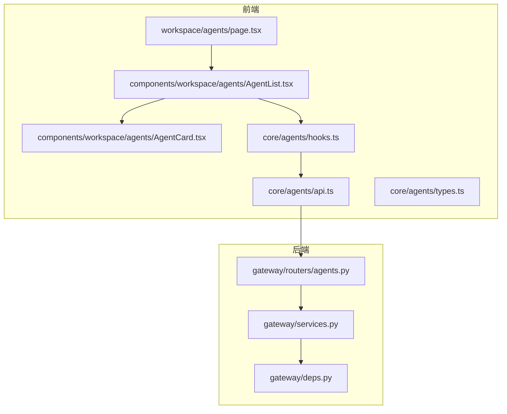
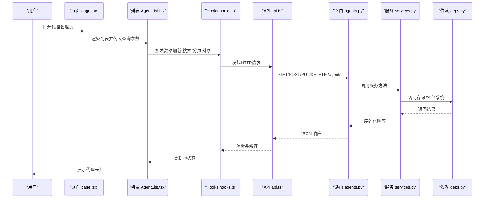
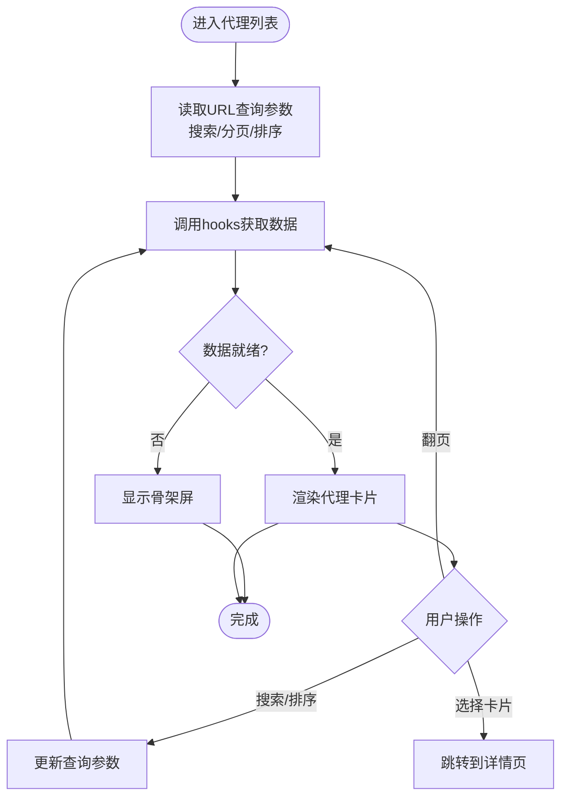
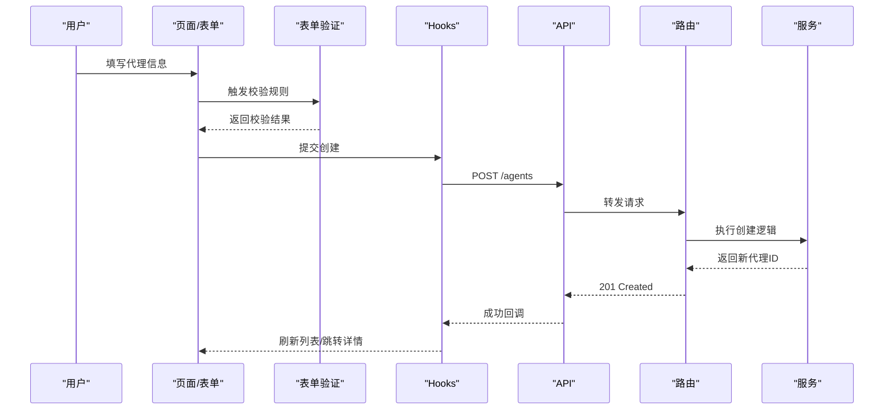
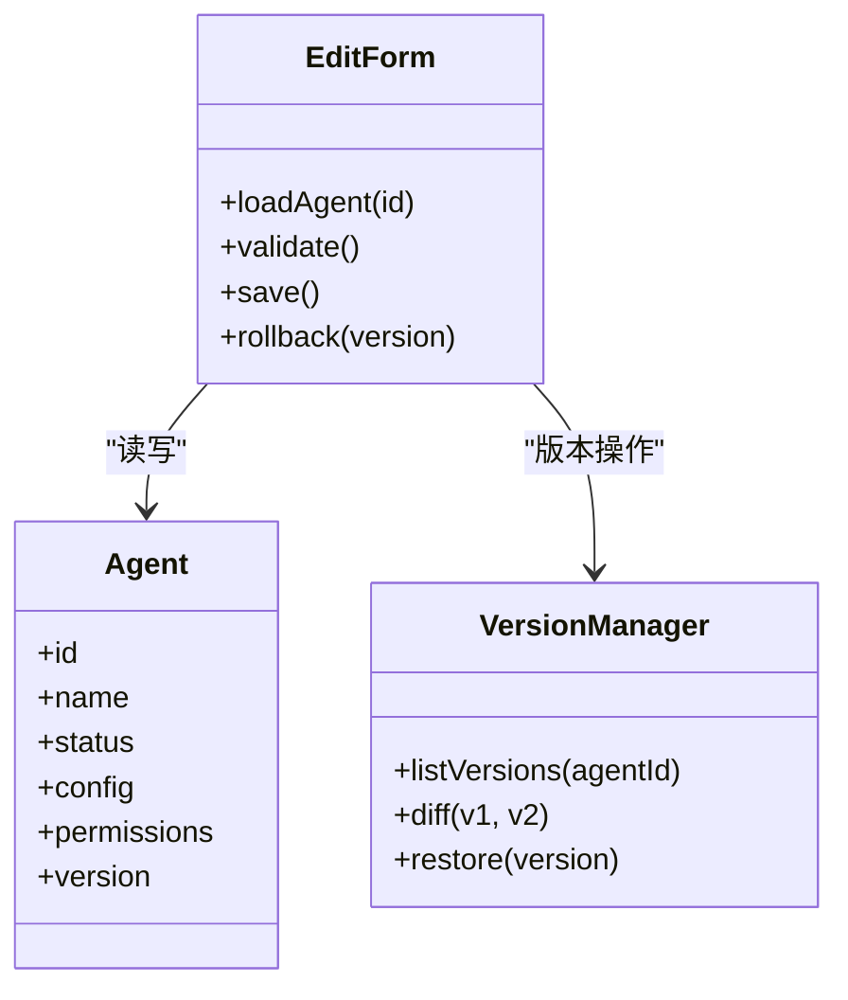
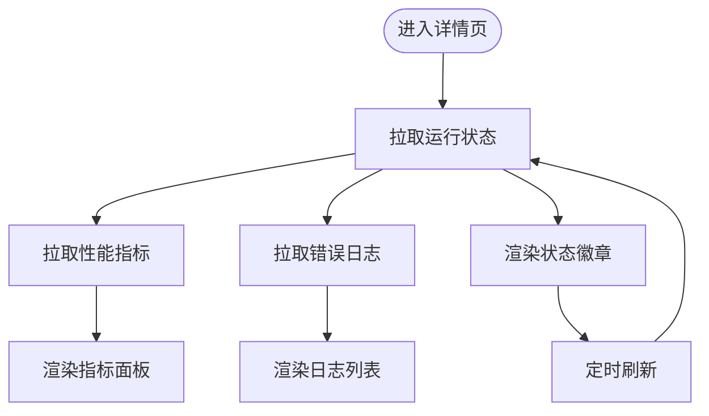
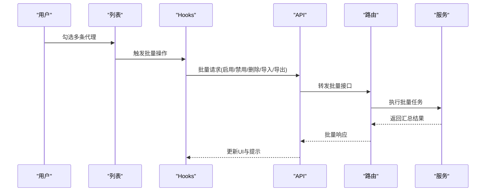
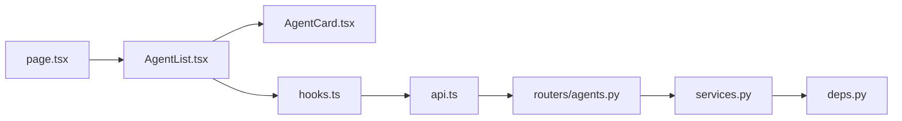

# 代理管理界面

<cite>
**本文引用的文件**   
- [frontend/src/app/workspace/agents/page.tsx](file://frontend/src/app/workspace/agents/page.tsx)
- [frontend/src/components/workspace/agents/AgentCard.tsx](file://frontend/src/components/workspace/agents/AgentCard.tsx)
- [frontend/src/components/workspace/agents/AgentList.tsx](file://frontend/src/components/workspace/agents/AgentList.tsx)
- [frontend/src/core/agents/api.ts](file://frontend/src/core/agents/api.ts)
- [frontend/src/core/agents/hooks.ts](file://frontend/src/core/agents/hooks.ts)
- [frontend/src/core/agents/types.ts](file://frontend/src/core/agents/types.ts)
- [backend/app/gateway/routers/agents.py](file://backend/app/gateway/routers/agents.py)
- [backend/app/gateway/services.py](file://backend/app/gateway/services.py)
- [backend/app/gateway/deps.py](file://backend/app/gateway/deps.py)
</cite>

## 目录
1. [简介](#简介)
2. [项目结构](#项目结构)
3. [核心组件](#核心组件)
4. [架构总览](#架构总览)
5. [详细组件分析](#详细组件分析)
6. [依赖关系分析](#依赖关系分析)
7. [性能考虑](#性能考虑)
8. [故障排查指南](#故障排查指南)
9. [结论](#结论)
10. [附录](#附录)

## 简介
本文件面向“代理管理界面”的开发者与使用者，系统性阐述以下能力：
- 代理列表展示：卡片渲染、搜索过滤与排序机制
- 代理创建流程：表单验证、配置模板与API调用
- 代理编辑功能：属性修改、权限设置与版本管理
- 状态监控：运行状态显示、性能指标与错误日志
- 批量操作：启用/禁用、删除、导入/导出
- 最佳实践与常见问题解决方案

## 项目结构
前端采用 Next.js 应用，代理管理相关代码集中在 workspace/agents 页面与 core/agents 模块；后端通过 gateway routers 暴露 REST API，并由 services 层实现业务逻辑。

图表来源
- [frontend/src/app/workspace/agents/page.tsx](file://frontend/src/app/workspace/agents/page.tsx)
- [frontend/src/components/workspace/agents/AgentList.tsx](file://frontend/src/components/workspace/agents/AgentList.tsx)
- [frontend/src/components/workspace/agents/AgentCard.tsx](file://frontend/src/components/workspace/agents/AgentCard.tsx)
- [frontend/src/core/agents/hooks.ts](file://frontend/src/core/agents/hooks.ts)
- [frontend/src/core/agents/api.ts](file://frontend/src/core/agents/api.ts)
- [frontend/src/core/agents/types.ts](file://frontend/src/core/agents/types.ts)
- [backend/app/gateway/routers/agents.py](file://backend/app/gateway/routers/agents.py)
- [backend/app/gateway/services.py](file://backend/app/gateway/services.py)
- [backend/app/gateway/deps.py](file://backend/app/gateway/deps.py)

章节来源
- [frontend/src/app/workspace/agents/page.tsx](file://frontend/src/app/workspace/agents/page.tsx)
- [frontend/src/components/workspace/agents/AgentList.tsx](file://frontend/src/components/workspace/agents/AgentList.tsx)
- [frontend/src/components/workspace/agents/AgentCard.tsx](file://frontend/src/components/workspace/agents/AgentCard.tsx)
- [frontend/src/core/agents/hooks.ts](file://frontend/src/core/agents/hooks.ts)
- [frontend/src/core/agents/api.ts](file://frontend/src/core/agents/api.ts)
- [frontend/src/core/agents/types.ts](file://frontend/src/core/agents/types.ts)
- [backend/app/gateway/routers/agents.py](file://backend/app/gateway/routers/agents.py)
- [backend/app/gateway/services.py](file://backend/app/gateway/services.py)
- [backend/app/gateway/deps.py](file://backend/app/gateway/deps.py)

## 核心组件
- 页面入口：负责路由挂载、全局状态与布局
- 列表容器：聚合查询参数（搜索、分页、排序）、数据获取与渲染
- 代理卡片：展示单条代理的关键信息与快捷操作
- Hooks 层：封装 React Query 或自定义请求生命周期
- API 客户端：统一请求封装、错误处理与类型定义
- 类型定义：前后端共享的数据模型与枚举

章节来源
- [frontend/src/app/workspace/agents/page.tsx](file://frontend/src/app/workspace/agents/page.tsx)
- [frontend/src/components/workspace/agents/AgentList.tsx](file://frontend/src/components/workspace/agents/AgentList.tsx)
- [frontend/src/components/workspace/agents/AgentCard.tsx](file://frontend/src/components/workspace/agents/AgentCard.tsx)
- [frontend/src/core/agents/hooks.ts](file://frontend/src/core/agents/hooks.ts)
- [frontend/src/core/agents/api.ts](file://frontend/src/core/agents/api.ts)
- [frontend/src/core/agents/types.ts](file://frontend/src/core/agents/types.ts)

## 架构总览
代理管理的前后端交互遵循“页面 -> 列表 -> 卡片 -> Hooks -> API -> 路由 -> 服务 -> 依赖”的分层模式。

图表来源
- [frontend/src/app/workspace/agents/page.tsx](file://frontend/src/app/workspace/agents/page.tsx)
- [frontend/src/components/workspace/agents/AgentList.tsx](file://frontend/src/components/workspace/agents/AgentList.tsx)
- [frontend/src/core/agents/hooks.ts](file://frontend/src/core/agents/hooks.ts)
- [frontend/src/core/agents/api.ts](file://frontend/src/core/agents/api.ts)
- [backend/app/gateway/routers/agents.py](file://backend/app/gateway/routers/agents.py)
- [backend/app/gateway/services.py](file://backend/app/gateway/services.py)
- [backend/app/gateway/deps.py](file://backend/app/gateway/deps.py)

## 详细组件分析

### 代理列表展示
- 卡片渲染
  - 展示字段：名称、标识、状态、更新时间等
  - 交互：点击跳转详情、快捷操作（启用/禁用、删除）
  - 视觉：空态、骨架屏、错误提示
- 搜索过滤
  - 支持按名称、标签、状态等条件筛选
  - 防抖与分页联动，避免频繁请求
- 排序机制
  - 支持按时间、名称、状态等维度排序
  - 排序键与方向由查询参数驱动

图表来源
- [frontend/src/components/workspace/agents/AgentList.tsx](file://frontend/src/components/workspace/agents/AgentList.tsx)
- [frontend/src/components/workspace/agents/AgentCard.tsx](file://frontend/src/components/workspace/agents/AgentCard.tsx)
- [frontend/src/core/agents/hooks.ts](file://frontend/src/core/agents/hooks.ts)

章节来源
- [frontend/src/components/workspace/agents/AgentList.tsx](file://frontend/src/components/workspace/agents/AgentList.tsx)
- [frontend/src/components/workspace/agents/AgentCard.tsx](file://frontend/src/components/workspace/agents/AgentCard.tsx)
- [frontend/src/core/agents/hooks.ts](file://frontend/src/core/agents/hooks.ts)

### 代理创建流程
- 表单验证
  - 必填项校验、格式校验、唯一性检查
  - 实时反馈与提交前二次确认
- 配置模板
  - 提供常用模板快速填充
  - 模板变量替换与默认值策略
- API 调用
  - 使用统一的API客户端发送创建请求
  - 成功后刷新列表并导航至详情页

图表来源
- [frontend/src/core/agents/api.ts](file://frontend/src/core/agents/api.ts)
- [frontend/src/core/agents/hooks.ts](file://frontend/src/core/agents/hooks.ts)
- [backend/app/gateway/routers/agents.py](file://backend/app/gateway/routers/agents.py)
- [backend/app/gateway/services.py](file://backend/app/gateway/services.py)

章节来源
- [frontend/src/core/agents/api.ts](file://frontend/src/core/agents/api.ts)
- [frontend/src/core/agents/hooks.ts](file://frontend/src/core/agents/hooks.ts)
- [backend/app/gateway/routers/agents.py](file://backend/app/gateway/routers/agents.py)
- [backend/app/gateway/services.py](file://backend/app/gateway/services.py)

### 代理编辑功能
- 属性修改
  - 支持基础信息、高级配置、环境变量等分组编辑
  - 变更检测与撤销/重做（可选）
- 权限设置
  - 角色/可见范围控制
  - 基于角色的操作按钮显隐
- 版本管理
  - 保存为新版本、回滚到历史版本
  - 版本差异对比与合并策略

图表来源
- [frontend/src/core/agents/types.ts](file://frontend/src/core/agents/types.ts)
- [frontend/src/core/agents/hooks.ts](file://frontend/src/core/agents/hooks.ts)
- [frontend/src/core/agents/api.ts](file://frontend/src/core/agents/api.ts)

章节来源
- [frontend/src/core/agents/types.ts](file://frontend/src/core/agents/types.ts)
- [frontend/src/core/agents/hooks.ts](file://frontend/src/core/agents/hooks.ts)
- [frontend/src/core/agents/api.ts](file://frontend/src/core/agents/api.ts)

### 代理状态监控
- 运行状态显示
  - 在线/离线/启动中/异常等状态可视化
  - 心跳检测与自动刷新
- 性能指标
  - 延迟、吞吐、资源占用等关键指标
  - 趋势图与阈值告警
- 错误日志
  - 最近错误摘要与堆栈链接
  - 一键复制日志片段与定位问题

图表来源
- [frontend/src/core/agents/hooks.ts](file://frontend/src/core/agents/hooks.ts)
- [frontend/src/core/agents/api.ts](file://frontend/src/core/agents/api.ts)

章节来源
- [frontend/src/core/agents/hooks.ts](file://frontend/src/core/agents/hooks.ts)
- [frontend/src/core/agents/api.ts](file://frontend/src/core/agents/api.ts)

### 批量操作
- 启用/禁用
  - 多选后批量切换状态
  - 失败重试与部分成功提示
- 删除
  - 二次确认与软删除策略
  - 删除后列表即时更新
- 导入/导出
  - 批量导入模板校验与冲突处理
  - 导出当前筛选结果或全部数据

图表来源
- [frontend/src/components/workspace/agents/AgentList.tsx](file://frontend/src/components/workspace/agents/AgentList.tsx)
- [frontend/src/core/agents/hooks.ts](file://frontend/src/core/agents/hooks.ts)
- [frontend/src/core/agents/api.ts](file://frontend/src/core/agents/api.ts)
- [backend/app/gateway/routers/agents.py](file://backend/app/gateway/routers/agents.py)
- [backend/app/gateway/services.py](file://backend/app/gateway/services.py)

章节来源
- [frontend/src/components/workspace/agents/AgentList.tsx](file://frontend/src/components/workspace/agents/AgentList.tsx)
- [frontend/src/core/agents/hooks.ts](file://frontend/src/core/agents/hooks.ts)
- [frontend/src/core/agents/api.ts](file://frontend/src/core/agents/api.ts)
- [backend/app/gateway/routers/agents.py](file://backend/app/gateway/routers/agents.py)
- [backend/app/gateway/services.py](file://backend/app/gateway/services.py)

## 依赖关系分析
- 前端耦合度
  - 页面与列表低耦合，通过 props 与 hooks 解耦
  - API 客户端集中管理，便于统一错误处理与拦截器扩展
- 后端分层
  - 路由仅负责协议转换与鉴权，业务逻辑下沉至服务层
  - 依赖注入用于数据库、缓存、消息队列等外部资源
- 潜在循环依赖
  - 确保 hooks 不直接依赖页面组件，API 不依赖 UI 状态

图表来源
- [frontend/src/app/workspace/agents/page.tsx](file://frontend/src/app/workspace/agents/page.tsx)
- [frontend/src/components/workspace/agents/AgentList.tsx](file://frontend/src/components/workspace/agents/AgentList.tsx)
- [frontend/src/components/workspace/agents/AgentCard.tsx](file://frontend/src/components/workspace/agents/AgentCard.tsx)
- [frontend/src/core/agents/hooks.ts](file://frontend/src/core/agents/hooks.ts)
- [frontend/src/core/agents/api.ts](file://frontend/src/core/agents/api.ts)
- [backend/app/gateway/routers/agents.py](file://backend/app/gateway/routers/agents.py)
- [backend/app/gateway/services.py](file://backend/app/gateway/services.py)
- [backend/app/gateway/deps.py](file://backend/app/gateway/deps.py)

章节来源
- [frontend/src/app/workspace/agents/page.tsx](file://frontend/src/app/workspace/agents/page.tsx)
- [frontend/src/components/workspace/agents/AgentList.tsx](file://frontend/src/components/workspace/agents/AgentList.tsx)
- [frontend/src/components/workspace/agents/AgentCard.tsx](file://frontend/src/components/workspace/agents/AgentCard.tsx)
- [frontend/src/core/agents/hooks.ts](file://frontend/src/core/agents/hooks.ts)
- [frontend/src/core/agents/api.ts](file://frontend/src/core/agents/api.ts)
- [backend/app/gateway/routers/agents.py](file://backend/app/gateway/routers/agents.py)
- [backend/app/gateway/services.py](file://backend/app/gateway/services.py)
- [backend/app/gateway/deps.py](file://backend/app/gateway/deps.py)

## 性能考虑
- 列表优化
  - 虚拟滚动与分页加载，减少首屏渲染压力
  - 搜索防抖与增量更新，避免重复请求
- 缓存策略
  - 合理设置缓存时间与失效策略，结合乐观更新提升体验
- 网络优化
  - 压缩传输、按需字段、并发限制
- 后端优化
  - 索引与分页游标、批量接口、异步任务与限流

[本节为通用指导，无需源码引用]

## 故障排查指南
- 常见错误
  - 网络超时与重试：检查网络连通性与后端健康检查
  - 权限不足：核对角色与资源访问策略
  - 表单校验失败：查看字段约束与提示信息
- 调试建议
  - 前端：开启请求日志与错误上报
  - 后端：查看网关日志与服务层堆栈
  - 联调：使用 Mock 数据隔离后端不稳定因素

章节来源
- [frontend/src/core/agents/api.ts](file://frontend/src/core/agents/api.ts)
- [frontend/src/core/agents/hooks.ts](file://frontend/src/core/agents/hooks.ts)
- [backend/app/gateway/routers/agents.py](file://backend/app/gateway/routers/agents.py)
- [backend/app/gateway/services.py](file://backend/app/gateway/services.py)

## 结论
代理管理界面以清晰的分层架构与可复用的组件为基础，实现了从列表展示到创建、编辑、监控与批量操作的完整闭环。通过合理的缓存、分页与批量接口设计，兼顾了用户体验与系统性能。建议在后续迭代中持续完善权限模型、版本管理与监控告警能力。

[本节为总结性内容，无需源码引用]

## 附录
- 术语说明
  - 代理：可被调度与管理的智能体实例
  - 版本：代理配置的快照，支持回滚与对比
- 参考路径
  - 页面入口：[frontend/src/app/workspace/agents/page.tsx](file://frontend/src/app/workspace/agents/page.tsx)
  - 列表与卡片：[frontend/src/components/workspace/agents/AgentList.tsx](file://frontend/src/components/workspace/agents/AgentList.tsx)、[frontend/src/components/workspace/agents/AgentCard.tsx](file://frontend/src/components/workspace/agents/AgentCard.tsx)
  - 数据与类型：[frontend/src/core/agents/hooks.ts](file://frontend/src/core/agents/hooks.ts)、[frontend/src/core/agents/api.ts](file://frontend/src/core/agents/api.ts)、[frontend/src/core/agents/types.ts](file://frontend/src/core/agents/types.ts)
  - 后端接口：[backend/app/gateway/routers/agents.py](file://backend/app/gateway/routers/agents.py)、[backend/app/gateway/services.py](file://backend/app/gateway/services.py)、[backend/app/gateway/deps.py](file://backend/app/gateway/deps.py)