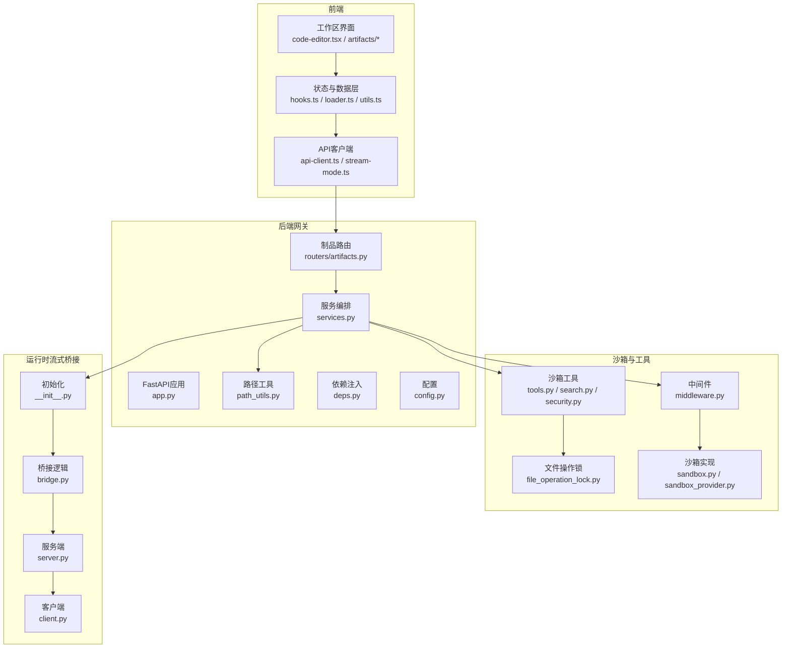
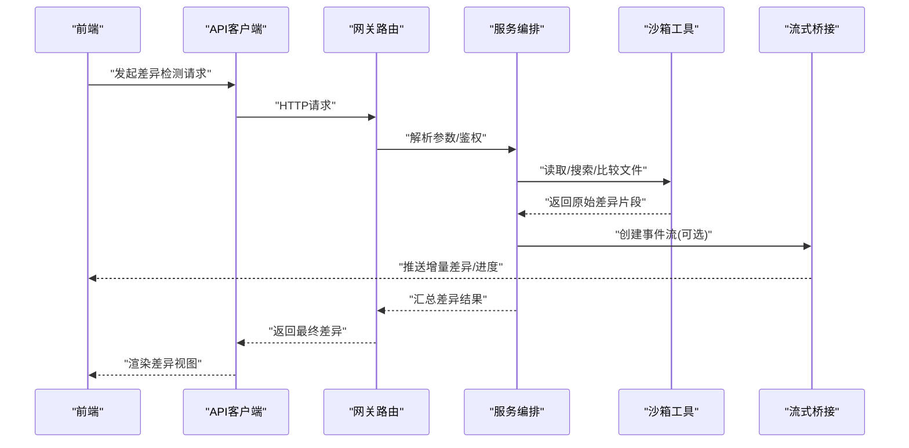
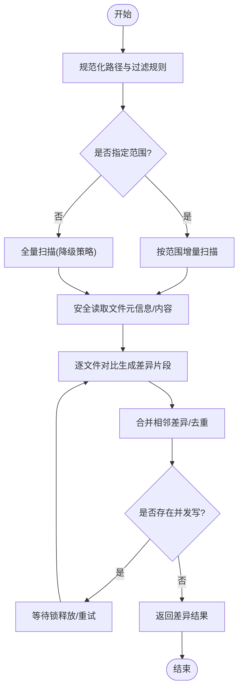
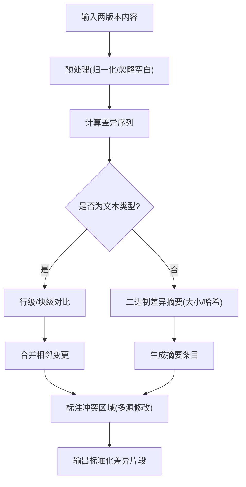
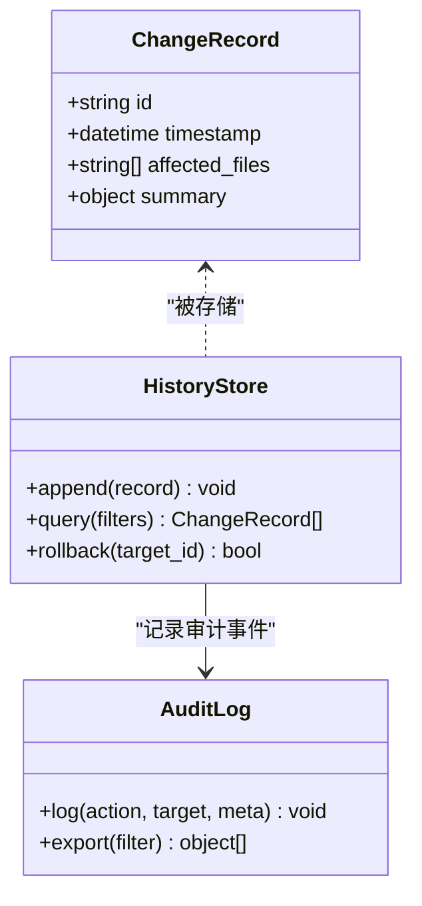
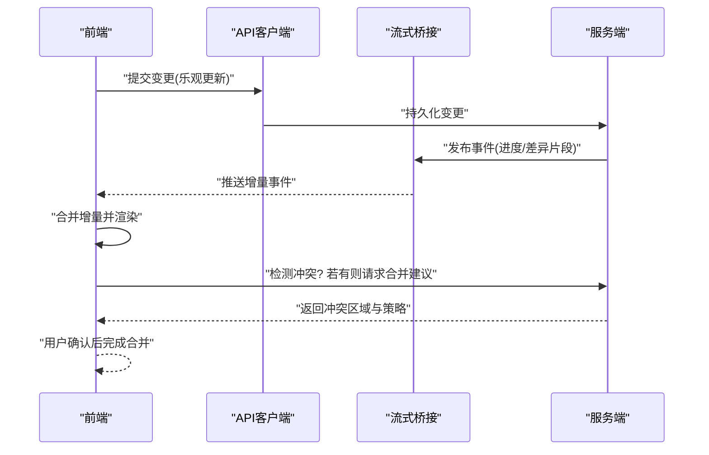
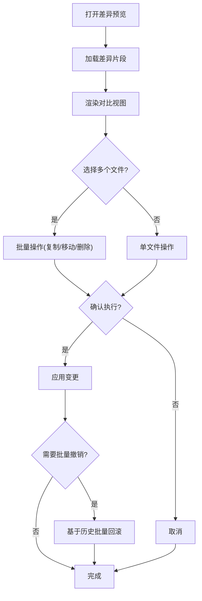
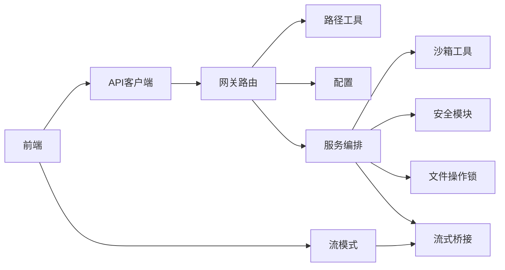

# 工作区变更检测

<cite>
**本文引用的文件**   
- [backend/app/gateway/routers/artifacts.py](file://backend/app/gateway/routers/artifacts.py)
- [backend/app/gateway/services.py](file://backend/app/gateway/services.py)
- [backend/app/gateway/path_utils.py](file://backend/app/gateway/path_utils.py)
- [backend/app/gateway/config.py](file://backend/app/gateway/config.py)
- [backend/app/gateway/deps.py](file://backend/app/gateway/deps.py)
- [backend/app/gateway/app.py](file://backend/app/gateway/app.py)
- [backend/packages/harness/deerflow/sandbox/file_operation_lock.py](file://backend/packages/harness/deerflow/sandbox/file_operation_lock.py)
- [backend/packages/harness/deerflow/sandbox/middleware.py](file://backend/packages/harness/deerflow/sandbox/middleware.py)
- [backend/packages/harness/deerflow/sandbox/tools.py](file://backend/packages/harness/deerflow/sandbox/tools.py)
- [backend/packages/harness/deerflow/sandbox/search.py](file://backend/packages/harness/deerflow/sandbox/search.py)
- [backend/packages/harness/deerflow/sandbox/security.py](file://backend/packages/harness/deerflow/sandbox/security.py)
- [backend/packages/harness/deerflow/sandbox/sandbox.py](file://backend/packages/harness/deerflow/sandbox/sandbox.py)
- [backend/packages/harness/deerflow/sandbox/sandbox_provider.py](file://backend/packages/harness/deerflow/sandbox/sandbox_provider.py)
- [backend/packages/harness/deerflow/runtime/stream_bridge/__init__.py](file://backend/packages/harness/deerflow/runtime/stream_bridge/__init__.py)
- [backend/packages/harness/deerflow/runtime/stream_bridge/bridge.py](file://backend/packages/harness/deerflow/runtime/stream_bridge/bridge.py)
- [backend/packages/harness/deerflow/runtime/stream_bridge/server.py](file://backend/packages/harness/deerflow/runtime/stream_bridge/server.py)
- [backend/packages/harness/deerflow/runtime/stream_bridge/client.py](file://backend/packages/harness/deerflow/runtime/stream_bridge/client.py)
- [frontend/src/components/workspace/code-editor.tsx](file://frontend/src/components/workspace/code-editor.tsx)
- [frontend/src/components/workspace/artifacts/index.tsx](file://frontend/src/components/workspace/artifacts/index.tsx)
- [frontend/src/components/workspace/artifacts/diff-viewer.tsx](file://frontend/src/components/workspace/artifacts/diff-viewer.tsx)
- [frontend/src/core/artifacts/hooks.ts](file://frontend/src/core/artifacts/hooks.ts)
- [frontend/src/core/artifacts/loader.ts](file://frontend/src/core/artifacts/loader.ts)
- [frontend/src/core/artifacts/utils.ts](file://frontend/src/core/artifacts/utils.ts)
- [frontend/src/core/api/api-client.ts](file://frontend/src/core/api/api-client.ts)
- [frontend/src/core/api/stream-mode.ts](file://frontend/src/core/api/stream-mode.ts)
</cite>

## 目录
1. [简介](#简介)
2. [项目结构](#项目结构)
3. [核心组件](#核心组件)
4. [架构总览](#架构总览)
5. [详细组件分析](#详细组件分析)
6. [依赖关系分析](#依赖关系分析)
7. [性能考量](#性能考量)
8. [故障排除指南](#故障排除指南)
9. [结论](#结论)
10. [附录](#附录)

## 简介
本文件围绕“工作区变更检测”主题，系统化梳理后端网关与沙箱、运行时流式桥接以及前端差异展示与同步机制。内容覆盖：
- 文件系统监听与增量扫描
- 差异计算算法（对比、合并策略、冲突解决）
- 变更历史记录（时间线、回滚、审计日志）
- 实时同步（WebSocket/SSE推送、乐观更新、冲突处理）
- 变更预览（可视化对比、批量操作与撤销）
- 配置选项与故障排除

## 项目结构
本项目采用前后端分离架构：
- 后端提供网关路由、服务编排、沙箱工具与运行时流式桥接能力
- 前端提供工作区界面、代码编辑器、差异查看器与状态管理

图表来源
- [backend/app/gateway/app.py](file://backend/app/gateway/app.py)
- [backend/app/gateway/routers/artifacts.py](file://backend/app/gateway/routers/artifacts.py)
- [backend/app/gateway/services.py](file://backend/app/gateway/services.py)
- [backend/app/gateway/path_utils.py](file://backend/app/gateway/path_utils.py)
- [backend/app/gateway/deps.py](file://backend/app/gateway/deps.py)
- [backend/app/gateway/config.py](file://backend/app/gateway/config.py)
- [backend/packages/harness/deerflow/sandbox/tools.py](file://backend/packages/harness/deerflow/sandbox/tools.py)
- [backend/packages/harness/deerflow/sandbox/search.py](file://backend/packages/harness/deerflow/sandbox/search.py)
- [backend/packages/harness/deerflow/sandbox/security.py](file://backend/packages/harness/deerflow/sandbox/security.py)
- [backend/packages/harness/deerflow/sandbox/file_operation_lock.py](file://backend/packages/harness/deerflow/sandbox/file_operation_lock.py)
- [backend/packages/harness/deerflow/sandbox/middleware.py](file://backend/packages/harness/deerflow/sandbox/middleware.py)
- [backend/packages/harness/deerflow/sandbox/sandbox.py](file://backend/packages/harness/deerflow/sandbox/sandbox.py)
- [backend/packages/harness/deerflow/sandbox/sandbox_provider.py](file://backend/packages/harness/deerflow/sandbox/sandbox_provider.py)
- [backend/packages/harness/deerflow/runtime/stream_bridge/__init__.py](file://backend/packages/harness/deerflow/runtime/stream_bridge/__init__.py)
- [backend/packages/harness/deerflow/runtime/stream_bridge/bridge.py](file://backend/packages/harness/deerflow/runtime/stream_bridge/bridge.py)
- [backend/packages/harness/deerflow/runtime/stream_bridge/server.py](file://backend/packages/harness/deerflow/runtime/stream_bridge/server.py)
- [backend/packages/harness/deerflow/runtime/stream_bridge/client.py](file://backend/packages/harness/deerflow/runtime/stream_bridge/client.py)
- [frontend/src/components/workspace/code-editor.tsx](file://frontend/src/components/workspace/code-editor.tsx)
- [frontend/src/components/workspace/artifacts/index.tsx](file://frontend/src/components/workspace/artifacts/index.tsx)
- [frontend/src/components/workspace/artifacts/diff-viewer.tsx](file://frontend/src/components/workspace/artifacts/diff-viewer.tsx)
- [frontend/src/core/artifacts/hooks.ts](file://frontend/src/core/artifacts/hooks.ts)
- [frontend/src/core/artifacts/loader.ts](file://frontend/src/core/artifacts/loader.ts)
- [frontend/src/core/artifacts/utils.ts](file://frontend/src/core/artifacts/utils.ts)
- [frontend/src/core/api/api-client.ts](file://frontend/src/core/api/api-client.ts)
- [frontend/src/core/api/stream-mode.ts](file://frontend/src/core/api/stream-mode.ts)

章节来源
- [backend/app/gateway/app.py](file://backend/app/gateway/app.py)
- [backend/app/gateway/routers/artifacts.py](file://backend/app/gateway/routers/artifacts.py)
- [backend/app/gateway/services.py](file://backend/app/gateway/services.py)
- [backend/app/gateway/path_utils.py](file://backend/app/gateway/path_utils.py)
- [backend/app/gateway/deps.py](file://backend/app/gateway/deps.py)
- [backend/app/gateway/config.py](file://backend/app/gateway/config.py)
- [backend/packages/harness/deerflow/sandbox/tools.py](file://backend/packages/harness/deerflow/sandbox/tools.py)
- [backend/packages/harness/deerflow/sandbox/search.py](file://backend/packages/harness/deerflow/sandbox/search.py)
- [backend/packages/harness/deerflow/sandbox/security.py](file://backend/packages/harness/deerflow/sandbox/security.py)
- [backend/packages/harness/deerflow/sandbox/file_operation_lock.py](file://backend/packages/harness/deerflow/sandbox/file_operation_lock.py)
- [backend/packages/harness/deerflow/sandbox/middleware.py](file://backend/packages/harness/deerflow/sandbox/middleware.py)
- [backend/packages/harness/deerflow/sandbox/sandbox.py](file://backend/packages/harness/deerflow/sandbox/sandbox.py)
- [backend/packages/harness/deerflow/sandbox/sandbox_provider.py](file://backend/packages/harness/deerflow/sandbox/sandbox_provider.py)
- [backend/packages/harness/deerflow/runtime/stream_bridge/__init__.py](file://backend/packages/harness/deerflow/runtime/stream_bridge/__init__.py)
- [backend/packages/harness/deerflow/runtime/stream_bridge/bridge.py](file://backend/packages/harness/deerflow/runtime/stream_bridge/bridge.py)
- [backend/packages/harness/deerflow/runtime/stream_bridge/server.py](file://backend/packages/harness/deerflow/runtime/stream_bridge/server.py)
- [backend/packages/harness/deerflow/runtime/stream_bridge/client.py](file://backend/packages/harness/deerflow/runtime/stream_bridge/client.py)
- [frontend/src/components/workspace/code-editor.tsx](file://frontend/src/components/workspace/code-editor.tsx)
- [frontend/src/components/workspace/artifacts/index.tsx](file://frontend/src/components/workspace/artifacts/index.tsx)
- [frontend/src/components/workspace/artifacts/diff-viewer.tsx](file://frontend/src/components/workspace/artifacts/diff-viewer.tsx)
- [frontend/src/core/artifacts/hooks.ts](file://frontend/src/core/artifacts/hooks.ts)
- [frontend/src/core/artifacts/loader.ts](file://frontend/src/core/artifacts/loader.ts)
- [frontend/src/core/artifacts/utils.ts](file://frontend/src/core/artifacts/utils.ts)
- [frontend/src/core/api/api-client.ts](file://frontend/src/core/api/api-client.ts)
- [frontend/src/core/api/stream-mode.ts](file://frontend/src/core/api/stream-mode.ts)

## 核心组件
- 网关路由与服务编排：负责接收前端请求、校验参数、调用沙箱工具、组织差异结果并返回
- 沙箱工具与安全：提供安全的文件读取、搜索、写入等操作，包含并发控制与权限检查
- 运行时流式桥接：在长任务或大文件场景下，通过事件流将进度与增量差异推送到前端
- 前端差异与同步：基于钩子与加载器维护本地缓存，支持乐观更新、冲突提示与批量操作

章节来源
- [backend/app/gateway/routers/artifacts.py](file://backend/app/gateway/routers/artifacts.py)
- [backend/app/gateway/services.py](file://backend/app/gateway/services.py)
- [backend/packages/harness/deerflow/sandbox/tools.py](file://backend/packages/harness/deerflow/sandbox/tools.py)
- [backend/packages/harness/deerflow/sandbox/search.py](file://backend/packages/harness/deerflow/sandbox/search.py)
- [backend/packages/harness/deerflow/sandbox/security.py](file://backend/packages/harness/deerflow/sandbox/security.py)
- [backend/packages/harness/deerflow/sandbox/file_operation_lock.py](file://backend/packages/harness/deerflow/sandbox/file_operation_lock.py)
- [backend/packages/harness/deerflow/runtime/stream_bridge/__init__.py](file://backend/packages/harness/deerflow/runtime/stream_bridge/__init__.py)
- [backend/packages/harness/deerflow/runtime/stream_bridge/bridge.py](file://backend/packages/harness/deerflow/runtime/stream_bridge/bridge.py)
- [backend/packages/harness/deerflow/runtime/stream_bridge/server.py](file://backend/packages/harness/deerflow/runtime/stream_bridge/server.py)
- [backend/packages/harness/deerflow/runtime/stream_bridge/client.py](file://backend/packages/harness/deerflow/runtime/stream_bridge/client.py)
- [frontend/src/core/artifacts/hooks.ts](file://frontend/src/core/artifacts/hooks.ts)
- [frontend/src/core/artifacts/loader.ts](file://frontend/src/core/artifacts/loader.ts)
- [frontend/src/core/artifacts/utils.ts](file://frontend/src/core/artifacts/utils.ts)
- [frontend/src/core/api/api-client.ts](file://frontend/src/core/api/api-client.ts)
- [frontend/src/core/api/stream-mode.ts](file://frontend/src/core/api/stream-mode.ts)

## 架构总览
下图展示了从前端发起变更检测到后端执行、再到流式推送与前端渲染的完整链路。

图表来源
- [backend/app/gateway/routers/artifacts.py](file://backend/app/gateway/routers/artifacts.py)
- [backend/app/gateway/services.py](file://backend/app/gateway/services.py)
- [backend/packages/harness/deerflow/sandbox/tools.py](file://backend/packages/harness/deerflow/sandbox/tools.py)
- [backend/packages/harness/deerflow/runtime/stream_bridge/bridge.py](file://backend/packages/harness/deerflow/runtime/stream_bridge/bridge.py)
- [backend/packages/harness/deerflow/runtime/stream_bridge/server.py](file://backend/packages/harness/deerflow/runtime/stream_bridge/server.py)
- [frontend/src/core/api/api-client.ts](file://frontend/src/core/api/api-client.ts)
- [frontend/src/core/api/stream-mode.ts](file://frontend/src/core/api/stream-mode.ts)

## 详细组件分析

### 文件系统监听与增量扫描
- 监听触发点：前端在用户编辑后触发差异检测；后端根据路径范围进行增量扫描
- 增量策略：仅对受影响的路径集合进行读取与比较，避免全量扫描
- 路径规范化：使用路径工具统一相对/绝对路径，确保跨平台一致性
- 并发与锁：通过文件操作锁限制同一文件的并发写入，避免竞态条件导致的不一致

图表来源
- [backend/app/gateway/path_utils.py](file://backend/app/gateway/path_utils.py)
- [backend/packages/harness/deerflow/sandbox/tools.py](file://backend/packages/harness/deerflow/sandbox/tools.py)
- [backend/packages/harness/deerflow/sandbox/search.py](file://backend/packages/harness/deerflow/sandbox/search.py)
- [backend/packages/harness/deerflow/sandbox/file_operation_lock.py](file://backend/packages/harness/deerflow/sandbox/file_operation_lock.py)

章节来源
- [backend/app/gateway/path_utils.py](file://backend/app/gateway/path_utils.py)
- [backend/packages/harness/deerflow/sandbox/tools.py](file://backend/packages/harness/deerflow/sandbox/tools.py)
- [backend/packages/harness/deerflow/sandbox/search.py](file://backend/packages/harness/deerflow/sandbox/search.py)
- [backend/packages/harness/deerflow/sandbox/file_operation_lock.py](file://backend/packages/harness/deerflow/sandbox/file_operation_lock.py)

### 差异计算算法（对比、合并策略、冲突解决）
- 对比粒度：行级/块级对比，优先选择稳定且高效的算法以适配大文件
- 合并策略：对相邻变更进行合并，减少UI抖动；对无关空白行进行忽略
- 冲突识别：当同一文件存在多源修改时，标记冲突区域并提供手动合并入口
- 输出格式：标准化差异片段，便于前端渲染与批量操作

图表来源
- [backend/app/gateway/services.py](file://backend/app/gateway/services.py)
- [backend/packages/harness/deerflow/sandbox/tools.py](file://backend/packages/harness/deerflow/sandbox/tools.py)
- [frontend/src/core/artifacts/utils.ts](file://frontend/src/core/artifacts/utils.ts)

章节来源
- [backend/app/gateway/services.py](file://backend/app/gateway/services.py)
- [backend/packages/harness/deerflow/sandbox/tools.py](file://backend/packages/harness/deerflow/sandbox/tools.py)
- [frontend/src/core/artifacts/utils.ts](file://frontend/src/core/artifacts/utils.ts)

### 变更历史记录（时间线、回滚、审计日志）
- 时间线：每次差异检测生成一条记录，包含时间戳、影响文件列表、变更摘要
- 版本回滚：基于历史快照或差异反向应用，支持单文件或多文件回滚
- 审计日志：记录关键操作（读/写/删除），结合中间件与沙箱工具进行追踪

图表来源
- [backend/app/gateway/services.py](file://backend/app/gateway/services.py)
- [backend/packages/harness/deerflow/sandbox/middleware.py](file://backend/packages/harness/deerflow/sandbox/middleware.py)

章节来源
- [backend/app/gateway/services.py](file://backend/app/gateway/services.py)
- [backend/packages/harness/deerflow/sandbox/middleware.py](file://backend/packages/harness/deerflow/sandbox/middleware.py)

### 实时同步机制（WebSocket/SSE推送、乐观更新、冲突处理）
- 推送通道：后端通过流式桥接在服务端生成事件流，前端订阅并增量渲染
- 乐观更新：前端先更新UI，再提交变更；若冲突则回滚并提示
- 冲突处理：检测到多端修改时，暂停自动合并，引导用户选择保留策略

图表来源
- [backend/packages/harness/deerflow/runtime/stream_bridge/bridge.py](file://backend/packages/harness/deerflow/runtime/stream_bridge/bridge.py)
- [backend/packages/harness/deerflow/runtime/stream_bridge/server.py](file://backend/packages/harness/deerflow/runtime/stream_bridge/server.py)
- [frontend/src/core/api/stream-mode.ts](file://frontend/src/core/api/stream-mode.ts)
- [frontend/src/core/api/api-client.ts](file://frontend/src/core/api/api-client.ts)

章节来源
- [backend/packages/harness/deerflow/runtime/stream_bridge/bridge.py](file://backend/packages/harness/deerflow/runtime/stream_bridge/bridge.py)
- [backend/packages/harness/deerflow/runtime/stream_bridge/server.py](file://backend/packages/harness/deerflow/runtime/stream_bridge/server.py)
- [frontend/src/core/api/stream-mode.ts](file://frontend/src/core/api/stream-mode.ts)
- [frontend/src/core/api/api-client.ts](file://frontend/src/core/api/api-client.ts)

### 变更预览功能（可视化对比、批量操作、批量撤销）
- 可视化对比：差异查看器支持高亮新增/删除/冲突区域，提供侧边导航与跳转
- 批量操作：支持多选文件执行复制/移动/删除等批处理
- 批量撤销：基于历史记录的批量回滚，支持选择性恢复

图表来源
- [frontend/src/components/workspace/artifacts/diff-viewer.tsx](file://frontend/src/components/workspace/artifacts/diff-viewer.tsx)
- [frontend/src/components/workspace/artifacts/index.tsx](file://frontend/src/components/workspace/artifacts/index.tsx)
- [frontend/src/core/artifacts/hooks.ts](file://frontend/src/core/artifacts/hooks.ts)
- [frontend/src/core/artifacts/loader.ts](file://frontend/src/core/artifacts/loader.ts)

章节来源
- [frontend/src/components/workspace/artifacts/diff-viewer.tsx](file://frontend/src/components/workspace/artifacts/diff-viewer.tsx)
- [frontend/src/components/workspace/artifacts/index.tsx](file://frontend/src/components/workspace/artifacts/index.tsx)
- [frontend/src/core/artifacts/hooks.ts](file://frontend/src/core/artifacts/hooks.ts)
- [frontend/src/core/artifacts/loader.ts](file://frontend/src/core/artifacts/loader.ts)

## 依赖关系分析
- 网关层依赖路径工具与配置，用于参数校验与路径规范化
- 服务编排依赖沙箱工具与安全模块，确保文件操作的安全性与一致性
- 流式桥接作为独立子系统，为长任务与大文件场景提供增量推送能力
- 前端依赖API客户端与流模式，实现乐观更新与冲突提示

图表来源
- [backend/app/gateway/routers/artifacts.py](file://backend/app/gateway/routers/artifacts.py)
- [backend/app/gateway/path_utils.py](file://backend/app/gateway/path_utils.py)
- [backend/app/gateway/config.py](file://backend/app/gateway/config.py)
- [backend/app/gateway/services.py](file://backend/app/gateway/services.py)
- [backend/packages/harness/deerflow/sandbox/tools.py](file://backend/packages/harness/deerflow/sandbox/tools.py)
- [backend/packages/harness/deerflow/sandbox/security.py](file://backend/packages/harness/deerflow/sandbox/security.py)
- [backend/packages/harness/deerflow/sandbox/file_operation_lock.py](file://backend/packages/harness/deerflow/sandbox/file_operation_lock.py)
- [backend/packages/harness/deerflow/runtime/stream_bridge/bridge.py](file://backend/packages/harness/deerflow/runtime/stream_bridge/bridge.py)
- [frontend/src/core/api/api-client.ts](file://frontend/src/core/api/api-client.ts)
- [frontend/src/core/api/stream-mode.ts](file://frontend/src/core/api/stream-mode.ts)

章节来源
- [backend/app/gateway/routers/artifacts.py](file://backend/app/gateway/routers/artifacts.py)
- [backend/app/gateway/path_utils.py](file://backend/app/gateway/path_utils.py)
- [backend/app/gateway/config.py](file://backend/app/gateway/config.py)
- [backend/app/gateway/services.py](file://backend/app/gateway/services.py)
- [backend/packages/harness/deerflow/sandbox/tools.py](file://backend/packages/harness/deerflow/sandbox/tools.py)
- [backend/packages/harness/deerflow/sandbox/security.py](file://backend/packages/harness/deerflow/sandbox/security.py)
- [backend/packages/harness/deerflow/sandbox/file_operation_lock.py](file://backend/packages/harness/deerflow/sandbox/file_operation_lock.py)
- [backend/packages/harness/deerflow/runtime/stream_bridge/bridge.py](file://backend/packages/harness/deerflow/runtime/stream_bridge/bridge.py)
- [frontend/src/core/api/api-client.ts](file://frontend/src/core/api/api-client.ts)
- [frontend/src/core/api/stream-mode.ts](file://frontend/src/core/api/stream-mode.ts)

## 性能考量
- 增量扫描：仅在必要时扫描受影响的文件集合，降低I/O压力
- 差异合并：合并相邻变更，减少渲染开销
- 流式推送：对大文件或复杂任务分片推送，避免阻塞主线程
- 并发控制：文件操作锁避免重复计算与资源竞争
- 缓存策略：前端缓存已加载的差异片段，减少重复请求

[本节为通用指导，不直接分析具体文件]

## 故障排除指南
- 路径错误：检查路径规范化与过滤规则，确保相对/绝对路径一致
- 权限问题：确认沙箱安全策略允许访问目标路径
- 并发冲突：观察文件操作锁状态，避免同时写入同一文件
- 流式连接失败：检查桥接服务端口与网络连通性，确认前端订阅成功
- 差异过大：启用增量推送与分页加载，限制单次渲染规模

章节来源
- [backend/app/gateway/path_utils.py](file://backend/app/gateway/path_utils.py)
- [backend/packages/harness/deerflow/sandbox/security.py](file://backend/packages/harness/deerflow/sandbox/security.py)
- [backend/packages/harness/deerflow/sandbox/file_operation_lock.py](file://backend/packages/harness/deerflow/sandbox/file_operation_lock.py)
- [backend/packages/harness/deerflow/runtime/stream_bridge/server.py](file://backend/packages/harness/deerflow/runtime/stream_bridge/server.py)
- [frontend/src/core/api/stream-mode.ts](file://frontend/src/core/api/stream-mode.ts)

## 结论
通过网关路由、沙箱工具、流式桥接与前端的协同，工作区变更检测实现了高效、安全与可观测的差异化能力。增量扫描与流式推送显著提升了用户体验，而并发控制与审计日志保障了系统的稳定性与可追溯性。

[本节为总结性内容，不直接分析具体文件]

## 附录
- 配置项参考：
  - 路径白名单与黑名单
  - 最大差异片段大小
  - 流式推送阈值与超时
  - 文件操作锁超时与重试次数
- 最佳实践：
  - 合理划分工作区范围，避免全量扫描
  - 对大文件启用流式推送
  - 在冲突场景中提供明确的合并策略与回退路径

[本节为补充说明，不直接分析具体文件]