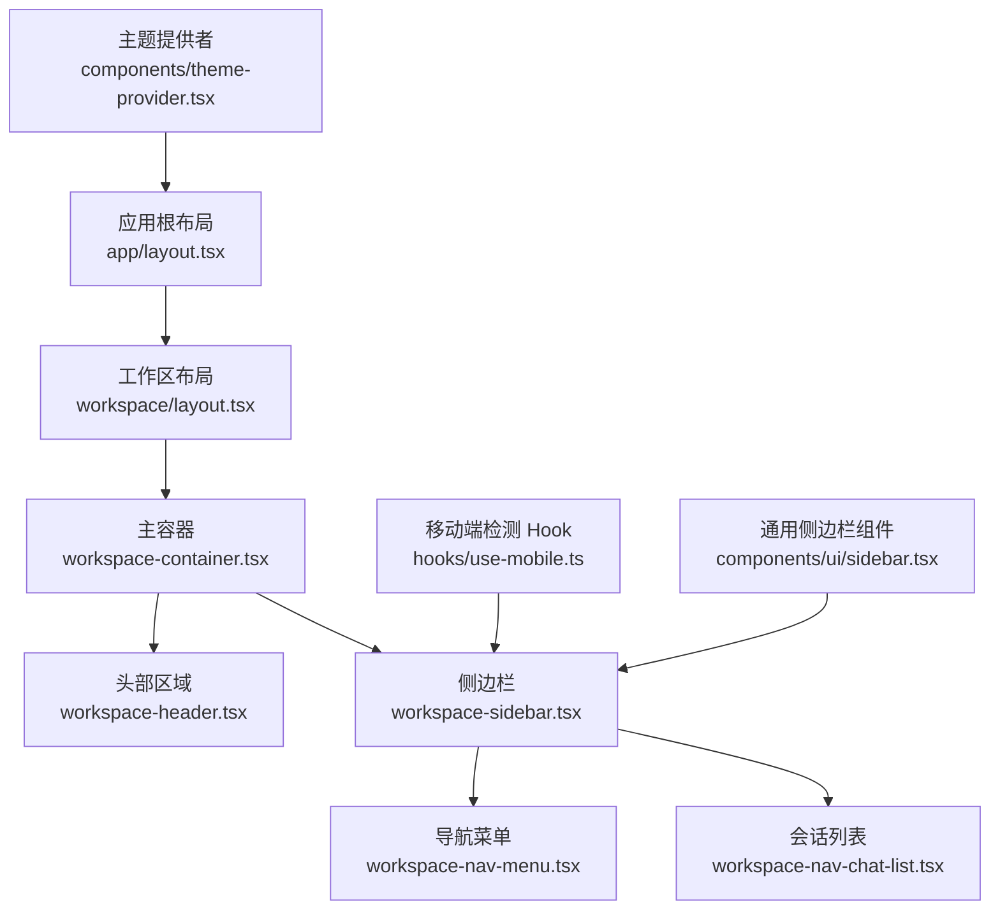
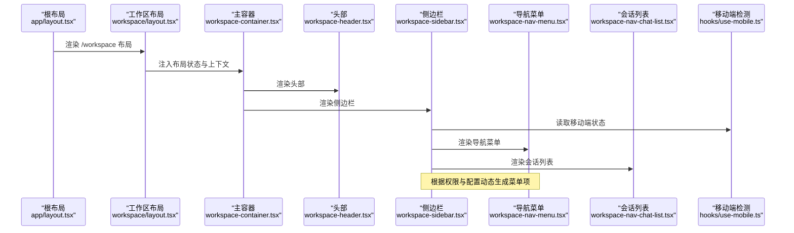
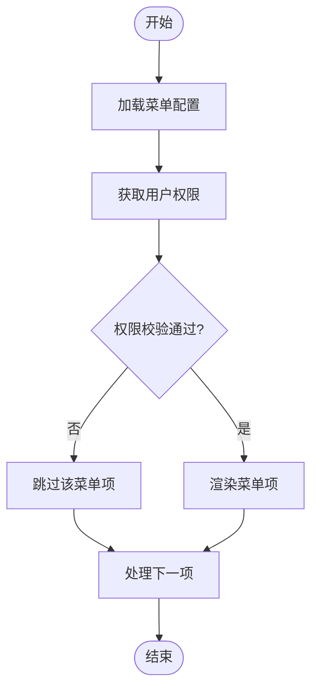
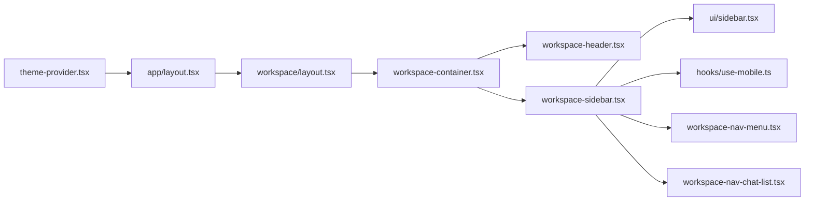

# 工作区布局与导航

<cite>
**本文引用的文件**   
- [frontend/src/app/workspace/layout.tsx](file://frontend/src/app/workspace/layout.tsx)
- [frontend/src/app/workspace/page.tsx](file://frontend/src/app/workspace/page.tsx)
- [frontend/src/components/workspace/workspace-container.tsx](file://frontend/src/components/workspace/workspace-container.tsx)
- [frontend/src/components/workspace/workspace-header.tsx](file://frontend/src/components/workspace/workspace-header.tsx)
- [frontend/src/components/workspace/workspace-sidebar.tsx](file://frontend/src/components/workspace/workspace-sidebar.tsx)
- [frontend/src/components/workspace/workspace-nav-menu.tsx](file://frontend/src/components/workspace/workspace-nav-menu.tsx)
- [frontend/src/components/workspace/workspace-nav-chat-list.tsx](file://frontend/src/components/workspace/workspace-nav-chat-list.tsx)
- [frontend/src/hooks/use-mobile.ts](file://frontend/src/hooks/use-mobile.ts)
- [frontend/src/components/ui/sidebar.tsx](file://frontend/src/components/ui/sidebar.tsx)
- [frontend/src/components/theme-provider.tsx](file://frontend/src/components/theme-provider.tsx)
- [frontend/src/app/layout.tsx](file://frontend/src/app/layout.tsx)
</cite>

## 目录
1. [简介](#简介)
2. [项目结构](#项目结构)
3. [核心组件](#核心组件)
4. [架构总览](#架构总览)
5. [详细组件分析](#详细组件分析)
6. [依赖关系分析](#依赖关系分析)
7. [性能考量](#性能考量)
8. [故障排查指南](#故障排查指南)
9. [结论](#结论)
10. [附录](#附录)

## 简介
本文件聚焦于“工作区”的布局与导航实现，系统性梳理主容器、头部区域与侧边栏的设计与协作方式；深入解析导航菜单的路由管理、菜单项动态生成与权限控制策略；阐述响应式适配方案（移动端优化与屏幕尺寸检测）；说明工作区状态管理（用户上下文传递与全局状态同步）；并提供布局组件的自定义扩展方法与主题定制指南。文档面向不同技术背景的读者，既提供高层概览，也给出代码级映射与可视化图示。

## 项目结构
工作区位于前端 Next.js 应用内，采用 App Router 组织页面与布局：
- 路由入口：/workspace 下的 layout.tsx 与 page.tsx 定义工作区的整体布局与默认内容。
- 布局骨架：workspace-container.tsx 作为主容器，组合头部 workspace-header.tsx 与侧边栏 workspace-sidebar.tsx。
- 导航菜单：workspace-nav-menu.tsx 负责渲染导航项；workspace-nav-chat-list.tsx 用于会话列表展示。
- 响应式能力：use-mobile.ts 提供移动端检测 Hook；ui/sidebar.tsx 提供通用侧边栏基础组件。
- 主题与全局上下文：theme-provider.tsx 提供主题切换；app/layout.tsx 为根布局，承载全局 Provider。

图表来源
- [frontend/src/app/workspace/layout.tsx](file://frontend/src/app/workspace/layout.tsx)
- [frontend/src/components/workspace/workspace-container.tsx](file://frontend/src/components/workspace/workspace-container.tsx)
- [frontend/src/components/workspace/workspace-header.tsx](file://frontend/src/components/workspace/workspace-header.tsx)
- [frontend/src/components/workspace/workspace-sidebar.tsx](file://frontend/src/components/workspace/workspace-sidebar.tsx)
- [frontend/src/components/workspace/workspace-nav-menu.tsx](file://frontend/src/components/workspace/workspace-nav-menu.tsx)
- [frontend/src/components/workspace/workspace-nav-chat-list.tsx](file://frontend/src/components/workspace/workspace-nav-chat-list.tsx)
- [frontend/src/hooks/use-mobile.ts](file://frontend/src/hooks/use-mobile.ts)
- [frontend/src/components/ui/sidebar.tsx](file://frontend/src/components/ui/sidebar.tsx)
- [frontend/src/components/theme-provider.tsx](file://frontend/src/components/theme-provider.tsx)

章节来源
- [frontend/src/app/workspace/layout.tsx](file://frontend/src/app/workspace/layout.tsx)
- [frontend/src/app/workspace/page.tsx](file://frontend/src/app/workspace/page.tsx)
- [frontend/src/components/workspace/workspace-container.tsx](file://frontend/src/components/workspace/workspace-container.tsx)
- [frontend/src/components/workspace/workspace-header.tsx](file://frontend/src/components/workspace/workspace-header.tsx)
- [frontend/src/components/workspace/workspace-sidebar.tsx](file://frontend/src/components/workspace/workspace-sidebar.tsx)
- [frontend/src/components/workspace/workspace-nav-menu.tsx](file://frontend/src/components/workspace/workspace-nav-menu.tsx)
- [frontend/src/components/workspace/workspace-nav-chat-list.tsx](file://frontend/src/components/workspace/workspace-nav-chat-list.tsx)
- [frontend/src/hooks/use-mobile.ts](file://frontend/src/hooks/use-mobile.ts)
- [frontend/src/components/ui/sidebar.tsx](file://frontend/src/components/ui/sidebar.tsx)
- [frontend/src/components/theme-provider.tsx](file://frontend/src/components/theme-provider.tsx)
- [frontend/src/app/layout.tsx](file://frontend/src/app/layout.tsx)

## 核心组件
- 主容器（workspace-container.tsx）
  - 职责：承载头部与侧边栏，维护整体布局结构与交互状态（如侧边栏展开/收起）。
  - 关键点：根据移动端检测结果调整侧边栏显示模式（抽屉或常驻面板），并协调头部与侧边栏的联动。
- 头部区域（workspace-header.tsx）
  - 职责：展示工作区标题、快捷操作、用户信息入口等。
  - 关键点：在移动端提供触发侧边栏的按钮，支持键盘快捷键与无障碍访问。
- 侧边栏（workspace-sidebar.tsx）
  - 职责：聚合导航菜单与会话列表，提供折叠/展开与移动端抽屉行为。
  - 关键点：基于 ui/sidebar.tsx 封装，结合 use-mobile.ts 进行响应式处理。
- 导航菜单（workspace-nav-menu.tsx）
  - 职责：渲染功能入口（如聊天、代理、设置等），支持动态生成与权限过滤。
  - 关键点：通过配置驱动生成菜单项，结合用户角色/权限数据决定是否可见。
- 会话列表（workspace-nav-chat-list.tsx）
  - 职责：展示最近会话，支持快速跳转与搜索过滤。
  - 关键点：与后端会话 API 集成，按需加载与增量更新。
- 移动端检测（use-mobile.ts）
  - 职责：监听窗口尺寸变化，返回当前是否处于移动端断点。
  - 关键点：使用 ResizeObserver 或 window.matchMedia 实现高效检测，避免频繁重排。
- 通用侧边栏（ui/sidebar.tsx）
  - 职责：提供可复用的侧边栏骨架（面板、遮罩、过渡动画等）。
  - 关键点：暴露展开/收起、宽度、遮罩点击关闭等可控属性。
- 主题提供者（theme-provider.tsx）
  - 职责：提供全局主题上下文，支持明暗主题切换与持久化。
  - 关键点：与 CSS 变量或 Tailwind 类名配合，确保布局组件样式一致。

章节来源
- [frontend/src/components/workspace/workspace-container.tsx](file://frontend/src/components/workspace/workspace-container.tsx)
- [frontend/src/components/workspace/workspace-header.tsx](file://frontend/src/components/workspace/workspace-header.tsx)
- [frontend/src/components/workspace/workspace-sidebar.tsx](file://frontend/src/components/workspace/workspace-sidebar.tsx)
- [frontend/src/components/workspace/workspace-nav-menu.tsx](file://frontend/src/components/workspace/workspace-nav-menu.tsx)
- [frontend/src/components/workspace/workspace-nav-chat-list.tsx](file://frontend/src/components/workspace/workspace-nav-chat-list.tsx)
- [frontend/src/hooks/use-mobile.ts](file://frontend/src/hooks/use-mobile.ts)
- [frontend/src/components/ui/sidebar.tsx](file://frontend/src/components/ui/sidebar.tsx)
- [frontend/src/components/theme-provider.tsx](file://frontend/src/components/theme-provider.tsx)

## 架构总览
工作区布局遵循“根布局 → 工作区布局 → 主容器 → 头部/侧边栏”的分层结构。导航菜单与会话列表作为侧边栏的子模块，通过配置与权限数据动态渲染。移动端场景下，侧边栏以抽屉形式呈现，由 use-mobile.ts 驱动切换。

图表来源
- [frontend/src/app/layout.tsx](file://frontend/src/app/layout.tsx)
- [frontend/src/app/workspace/layout.tsx](file://frontend/src/app/workspace/layout.tsx)
- [frontend/src/components/workspace/workspace-container.tsx](file://frontend/src/components/workspace/workspace-container.tsx)
- [frontend/src/components/workspace/workspace-header.tsx](file://frontend/src/components/workspace/workspace-header.tsx)
- [frontend/src/components/workspace/workspace-sidebar.tsx](file://frontend/src/components/workspace/workspace-sidebar.tsx)
- [frontend/src/components/workspace/workspace-nav-menu.tsx](file://frontend/src/components/workspace/workspace-nav-menu.tsx)
- [frontend/src/components/workspace/workspace-nav-chat-list.tsx](file://frontend/src/components/workspace/workspace-nav-chat-list.tsx)
- [frontend/src/hooks/use-mobile.ts](file://frontend/src/hooks/use-mobile.ts)

## 详细组件分析

### 主容器（workspace-container.tsx）
- 设计要点
  - 作为布局中枢，统一管理头部与侧边栏的可见性与交互。
  - 在移动端将侧边栏切换为抽屉模式，并在遮罩点击时自动收起。
  - 向子组件传递必要的上下文（如主题、用户信息、路由参数等）。
- 关键流程
  - 初始化：从全局状态或上下文获取用户信息与权限。
  - 响应式：调用 use-mobile.ts 判断断点，决定侧边栏模式。
  - 交互：头部按钮触发侧边栏展开/收起，侧边栏内部导航项触发路由跳转。
- 扩展建议
  - 新增顶部工具栏或面包屑时，优先在主容器中插入占位区域，保持头部简洁。
  - 若需多列布局，可在主容器内引入栅格或弹性布局容器，再嵌入现有头部与侧边栏。

章节来源
- [frontend/src/components/workspace/workspace-container.tsx](file://frontend/src/components/workspace/workspace-container.tsx)
- [frontend/src/hooks/use-mobile.ts](file://frontend/src/hooks/use-mobile.ts)

### 头部区域（workspace-header.tsx）
- 设计要点
  - 展示工作区名称、搜索框、通知与用户头像等。
  - 在移动端提供汉堡菜单按钮，用于打开侧边栏。
- 交互细节
  - 用户头像下拉包含退出登录、个人设置等入口。
  - 搜索框支持全局快捷键唤起命令面板（如有集成）。
- 可访问性
  - 所有交互元素具备合适的 aria-* 属性与键盘焦点顺序。

章节来源
- [frontend/src/components/workspace/workspace-header.tsx](file://frontend/src/components/workspace/workspace-header.tsx)

### 侧边栏（workspace-sidebar.tsx）
- 设计要点
  - 基于 ui/sidebar.tsx 构建，提供折叠、遮罩与过渡动画。
  - 组合导航菜单与会话列表，形成统一的左侧导航体验。
- 响应式策略
  - 桌面端常驻显示，移动端以抽屉形式出现。
  - 通过 use-mobile.ts 实时监听屏幕尺寸变化，平滑切换模式。
- 状态同步
  - 侧边栏展开状态可与头部按钮联动，必要时持久化到本地存储。

章节来源
- [frontend/src/components/workspace/workspace-sidebar.tsx](file://frontend/src/components/workspace/workspace-sidebar.tsx)
- [frontend/src/components/ui/sidebar.tsx](file://frontend/src/components/ui/sidebar.tsx)
- [frontend/src/hooks/use-mobile.ts](file://frontend/src/hooks/use-mobile.ts)

### 导航菜单（workspace-nav-menu.tsx）
- 动态生成机制
  - 通过配置数组描述菜单项（标识、路径、图标、权限标签等）。
  - 渲染前对配置进行过滤，仅保留当前用户有权限的条目。
- 路由管理
  - 菜单项点击后执行路由跳转，支持外部链接与新标签页打开。
  - 支持嵌套分组与分隔线，提升可读性。
- 权限控制
  - 依据用户角色/权限集合匹配菜单项的权限要求。
  - 支持运行时刷新权限后重新计算菜单可见性。

图表来源
- [frontend/src/components/workspace/workspace-nav-menu.tsx](file://frontend/src/components/workspace/workspace-nav-menu.tsx)

章节来源
- [frontend/src/components/workspace/workspace-nav-menu.tsx](file://frontend/src/components/workspace/workspace-nav-menu.tsx)

### 会话列表（workspace-nav-chat-list.tsx）
- 功能概述
  - 展示最近会话，支持按时间排序、关键词搜索与分页加载。
  - 点击会话项跳转到对应聊天页面。
- 数据流
  - 首次进入时拉取会话列表，后续可通过增量更新或轮询刷新。
  - 搜索输入防抖，减少请求频率。
- 错误处理
  - 网络异常时显示重试提示，空数据时展示引导文案。

章节来源
- [frontend/src/components/workspace/workspace-nav-chat-list.tsx](file://frontend/src/components/workspace/workspace-nav-chat-list.tsx)

### 移动端检测（use-mobile.ts）
- 实现思路
  - 使用 matchMedia 或 ResizeObserver 监听窗口尺寸变化。
  - 暴露布尔值表示当前是否为移动端断点，供其他组件订阅。
- 性能优化
  - 事件去抖/节流，避免频繁状态更新。
  - 在组件卸载时移除监听器，防止内存泄漏。

章节来源
- [frontend/src/hooks/use-mobile.ts](file://frontend/src/hooks/use-mobile.ts)

### 通用侧边栏（ui/sidebar.tsx）
- 能力清单
  - 提供面板容器、遮罩层、展开/收起控制、宽度与动画时长等属性。
  - 支持键盘 ESC 关闭与点击遮罩关闭。
- 扩展点
  - 允许传入自定义头部与底部插槽，便于业务扩展。
  - 暴露 onOpenChange 回调，便于上层状态同步。

章节来源
- [frontend/src/components/ui/sidebar.tsx](file://frontend/src/components/ui/sidebar.tsx)

### 主题提供者（theme-provider.tsx）
- 作用范围
  - 在全局范围内提供主题上下文，使布局与 UI 组件统一风格。
- 持久化
  - 将用户选择的主题保存到本地存储，下次访问保持一致。
- 与布局的关系
  - 布局组件通过主题上下文切换类名或 CSS 变量，实现明暗主题无缝切换。

章节来源
- [frontend/src/components/theme-provider.tsx](file://frontend/src/components/theme-provider.tsx)

## 依赖关系分析
- 组件耦合
  - workspace-container.tsx 强依赖 workspace-header.tsx 与 workspace-sidebar.tsx。
  - workspace-sidebar.tsx 依赖 ui/sidebar.tsx 与 use-mobile.ts。
  - workspace-nav-menu.tsx 与 workspace-nav-chat-list.tsx 被 workspace-sidebar.tsx 组合。
- 外部依赖
  - 路由系统（Next.js App Router）用于导航跳转。
  - 主题系统与 UI 库提供样式与基础组件。
- 潜在风险
  - 避免在高频更新的 Hook 中创建对象引用，防止不必要的重渲染。
  - 注意侧边栏遮罩与模态层的层级冲突。

图表来源
- [frontend/src/components/workspace/workspace-container.tsx](file://frontend/src/components/workspace/workspace-container.tsx)
- [frontend/src/components/workspace/workspace-header.tsx](file://frontend/src/components/workspace/workspace-header.tsx)
- [frontend/src/components/workspace/workspace-sidebar.tsx](file://frontend/src/components/workspace/workspace-sidebar.tsx)
- [frontend/src/components/ui/sidebar.tsx](file://frontend/src/components/ui/sidebar.tsx)
- [frontend/src/hooks/use-mobile.ts](file://frontend/src/hooks/use-mobile.ts)
- [frontend/src/components/workspace/workspace-nav-menu.tsx](file://frontend/src/components/workspace/workspace-nav-menu.tsx)
- [frontend/src/components/workspace/workspace-nav-chat-list.tsx](file://frontend/src/components/workspace/workspace-nav-chat-list.tsx)
- [frontend/src/components/theme-provider.tsx](file://frontend/src/components/theme-provider.tsx)
- [frontend/src/app/layout.tsx](file://frontend/src/app/layout.tsx)
- [frontend/src/app/workspace/layout.tsx](file://frontend/src/app/workspace/layout.tsx)

章节来源
- [frontend/src/components/workspace/workspace-container.tsx](file://frontend/src/components/workspace/workspace-container.tsx)
- [frontend/src/components/workspace/workspace-sidebar.tsx](file://frontend/src/components/workspace/workspace-sidebar.tsx)
- [frontend/src/components/ui/sidebar.tsx](file://frontend/src/components/ui/sidebar.tsx)
- [frontend/src/hooks/use-mobile.ts](file://frontend/src/hooks/use-mobile.ts)
- [frontend/src/components/workspace/workspace-nav-menu.tsx](file://frontend/src/components/workspace/workspace-nav-menu.tsx)
- [frontend/src/components/workspace/workspace-nav-chat-list.tsx](file://frontend/src/components/workspace/workspace-nav-chat-list.tsx)
- [frontend/src/components/theme-provider.tsx](file://frontend/src/components/theme-provider.tsx)
- [frontend/src/app/layout.tsx](file://frontend/src/app/layout.tsx)
- [frontend/src/app/workspace/layout.tsx](file://frontend/src/app/workspace/layout.tsx)

## 性能考量
- 渲染优化
  - 对长列表（如会话列表）使用虚拟滚动或分页加载，降低首屏压力。
  - 菜单项与权限过滤结果缓存，避免重复计算。
- 事件优化
  - 移动端尺寸监听使用防抖/节流，减少状态抖动。
  - 侧边栏展开/收起动画尽量使用 GPU 加速属性。
- 资源加载
  - 图标与图片按需懒加载，减少初始包体。
  - 大体积第三方库按需引入。

## 故障排查指南
- 侧边栏无法展开/收起
  - 检查 use-mobile.ts 是否正确监听尺寸变化。
  - 确认 ui/sidebar.tsx 的受控属性（open/onOpenChange）绑定正确。
- 菜单项不显示
  - 核对用户权限数据与菜单配置的权限字段是否匹配。
  - 查看控制台是否有权限接口报错或跨域问题。
- 移动端布局错乱
  - 验证断点阈值是否符合预期，必要时调整 use-mobile.ts 的判断逻辑。
  - 检查遮罩层 z-index 是否与模态层冲突。
- 主题切换无效
  - 确认 theme-provider.tsx 已包裹根布局，且布局组件读取了主题上下文。
  - 检查本地存储中的主题键名是否一致。

章节来源
- [frontend/src/hooks/use-mobile.ts](file://frontend/src/hooks/use-mobile.ts)
- [frontend/src/components/ui/sidebar.tsx](file://frontend/src/components/ui/sidebar.tsx)
- [frontend/src/components/workspace/workspace-nav-menu.tsx](file://frontend/src/components/workspace/workspace-nav-menu.tsx)
- [frontend/src/components/theme-provider.tsx](file://frontend/src/components/theme-provider.tsx)

## 结论
工作区布局与导航通过清晰的分层与模块化设计，实现了桌面与移动端的统一体验。主容器统筹头部与侧边栏，侧边栏整合导航与会话列表，配合移动端检测与主题提供者，形成高内聚、低耦合的可扩展体系。通过配置驱动的菜单生成与权限控制，系统具备良好的可维护性与安全性。建议在后续迭代中持续优化长列表渲染与事件处理，进一步提升性能与用户体验。

## 附录
- 自定义扩展方法
  - 新增导航分组：在导航菜单配置中添加分组对象，指定子项与权限。
  - 替换侧边栏头部：通过 ui/sidebar.tsx 的插槽注入自定义头部组件。
  - 增加全局快捷键：在工作区布局中注册快捷键，触发侧边栏开关或命令面板。
- 主题定制指南
  - 在主题提供者中扩展颜色变量，覆盖默认明暗主题。
  - 为布局组件添加新的主题类名，确保侧边栏、头部与内容区风格一致。
  - 使用 CSS 变量或 Tailwind 配置集中管理色板与间距，便于团队协同。