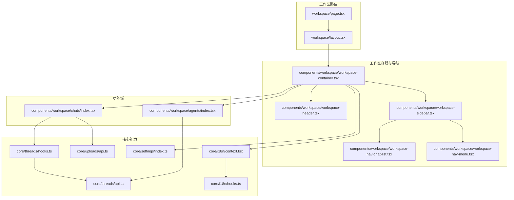
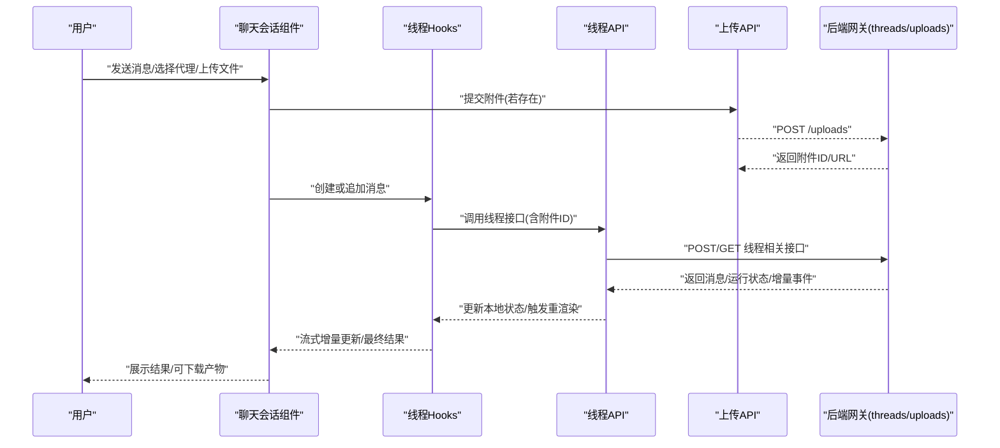
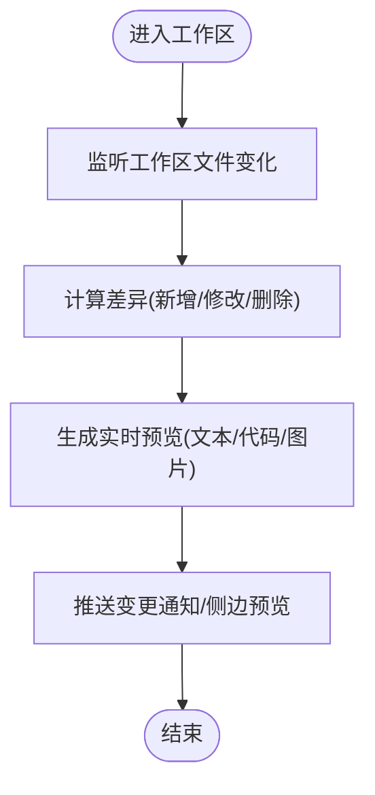
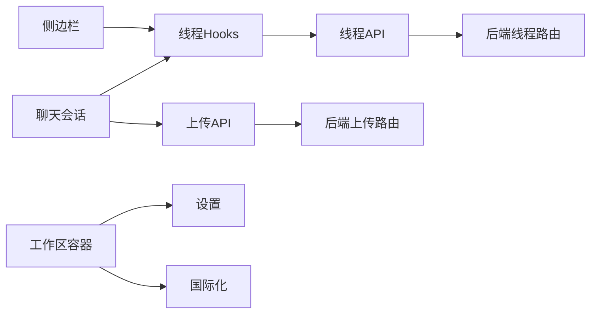

# 工作区模块

<cite>
**本文引用的文件**   
- [frontend/src/app/workspace/page.tsx](file://frontend/src/app/workspace/page.tsx)
- [frontend/src/app/workspace/layout.tsx](file://frontend/src/app/workspace/layout.tsx)
- [frontend/src/components/workspace/workspace-container.tsx](file://frontend/src/components/workspace/workspace-container.tsx)
- [frontend/src/components/workspace/workspace-header.tsx](file://frontend/src/components/workspace/workspace-header.tsx)
- [frontend/src/components/workspace/workspace-sidebar.tsx](file://frontend/src/components/workspace/workspace-sidebar.tsx)
- [frontend/src/components/workspace/workspace-nav-chat-list.tsx](file://frontend/src/components/workspace/workspace-nav-chat-list.tsx)
- [frontend/src/components/workspace/workspace-nav-menu.tsx](file://frontend/src/components/workspace/workspace-nav-menu.tsx)
- [frontend/src/components/workspace/agents/index.tsx](file://frontend/src/components/workspace/agents/index.tsx)
- [frontend/src/components/workspace/chats/index.tsx](file://frontend/src/components/workspace/chats/index.tsx)
- [frontend/src/core/threads/hooks.ts](file://frontend/src/core/threads/hooks.ts)
- [frontend/src/core/threads/api.ts](file://frontend/src/core/threads/api.ts)
- [frontend/src/core/uploads/api.ts](file://frontend/src/core/uploads/api.ts)
- [frontend/src/core/settings/index.ts](file://frontend/src/core/settings/index.ts)
- [frontend/src/core/i18n/context.tsx](file://frontend/src/core/i18n/context.tsx)
- [frontend/src/core/i18n/hooks.ts](file://frontend/src/core/i18n/hooks.ts)
- [backend/app/gateway/routers/uploads.py](file://backend/app/gateway/routers/uploads.py)
- [backend/app/gateway/routers/threads.py](file://backend/app/gateway/routers/threads.py)
</cite>

## 目录
1. [简介](#简介)
2. [项目结构](#项目结构)
3. [核心组件](#核心组件)
4. [架构总览](#架构总览)
5. [详细组件分析](#详细组件分析)
6. [依赖关系分析](#依赖关系分析)
7. [性能考虑](#性能考虑)
8. [故障排查指南](#故障排查指南)
9. [结论](#结论)
10. [附录](#附录)

## 简介
本章节面向 DeerFlow 前端“工作区”模块，聚焦以下目标：
- 代理管理界面与聊天会话管理的实现要点
- 文件上传处理流程（前端到后端）
- 工作区状态管理机制（用户上下文、权限控制、数据同步）
- 变更检测系统（文件监控、差异计算、实时预览）
- 设置管理（用户偏好、主题配置、国际化）
- 与后端 API 的交互模式与数据流
- 扩展开发与自定义组件集成方法

## 项目结构
工作区位于前端应用的路由与工作区组件中，采用页面级路由 + 布局容器 + 功能子组件的组织方式。关键路径如下：
- 页面入口：workspace 路由页与布局
- 容器与导航：工作区容器、头部、侧边栏、导航菜单与聊天列表
- 功能域：代理管理、聊天会话
- 核心能力：线程（会话）API/Hooks、上传 API、设置与国际化

图表来源
- [frontend/src/app/workspace/page.tsx](file://frontend/src/app/workspace/page.tsx)
- [frontend/src/app/workspace/layout.tsx](file://frontend/src/app/workspace/layout.tsx)
- [frontend/src/components/workspace/workspace-container.tsx](file://frontend/src/components/workspace/workspace-container.tsx)
- [frontend/src/components/workspace/workspace-header.tsx](file://frontend/src/components/workspace/workspace-header.tsx)
- [frontend/src/components/workspace/workspace-sidebar.tsx](file://frontend/src/components/workspace/workspace-sidebar.tsx)
- [frontend/src/components/workspace/workspace-nav-chat-list.tsx](file://frontend/src/components/workspace/workspace-nav-chat-list.tsx)
- [frontend/src/components/workspace/workspace-nav-menu.tsx](file://frontend/src/components/workspace/workspace-nav-menu.tsx)
- [frontend/src/components/workspace/agents/index.tsx](file://frontend/src/components/workspace/agents/index.tsx)
- [frontend/src/components/workspace/chats/index.tsx](file://frontend/src/components/workspace/chats/index.tsx)
- [frontend/src/core/threads/hooks.ts](file://frontend/src/core/threads/hooks.ts)
- [frontend/src/core/threads/api.ts](file://frontend/src/core/threads/api.ts)
- [frontend/src/core/uploads/api.ts](file://frontend/src/core/uploads/api.ts)
- [frontend/src/core/settings/index.ts](file://frontend/src/core/settings/index.ts)
- [frontend/src/core/i18n/context.tsx](file://frontend/src/core/i18n/context.tsx)
- [frontend/src/core/i18n/hooks.ts](file://frontend/src/core/i18n/hooks.ts)

章节来源
- [frontend/src/app/workspace/page.tsx](file://frontend/src/app/workspace/page.tsx)
- [frontend/src/app/workspace/layout.tsx](file://frontend/src/app/workspace/layout.tsx)
- [frontend/src/components/workspace/workspace-container.tsx](file://frontend/src/components/workspace/workspace-container.tsx)
- [frontend/src/components/workspace/workspace-header.tsx](file://frontend/src/components/workspace/workspace-header.tsx)
- [frontend/src/components/workspace/workspace-sidebar.tsx](file://frontend/src/components/workspace/workspace-sidebar.tsx)
- [frontend/src/components/workspace/workspace-nav-chat-list.tsx](file://frontend/src/components/workspace/workspace-nav-chat-list.tsx)
- [frontend/src/components/workspace/workspace-nav-menu.tsx](file://frontend/src/components/workspace/workspace-nav-menu.tsx)
- [frontend/src/components/workspace/agents/index.tsx](file://frontend/src/components/workspace/agents/index.tsx)
- [frontend/src/components/workspace/chats/index.tsx](file://frontend/src/components/workspace/chats/index.tsx)
- [frontend/src/core/threads/hooks.ts](file://frontend/src/core/threads/hooks.ts)
- [frontend/src/core/threads/api.ts](file://frontend/src/core/threads/api.ts)
- [frontend/src/core/uploads/api.ts](file://frontend/src/core/uploads/api.ts)
- [frontend/src/core/settings/index.ts](file://frontend/src/core/settings/index.ts)
- [frontend/src/core/i18n/context.tsx](file://frontend/src/core/i18n/context.tsx)
- [frontend/src/core/i18n/hooks.ts](file://frontend/src/core/i18n/hooks.ts)

## 核心组件
- 工作区容器：负责整体布局、全局状态注入（如国际化、设置）、以及子区域挂载。
- 头部：展示工作区标题、快捷操作入口（如设置面板、主题切换等）。
- 侧边栏：聚合导航菜单与聊天列表，提供会话快速切换与新建入口。
- 聊天列表：基于线程 Hooks 拉取并渲染最近会话，支持选择与跳转。
- 代理管理：以卡片或列表形式展示可用代理，支持选择与参数配置。
- 聊天会话：承载消息输入、流式输出、附件上传与结果展示。

章节来源
- [frontend/src/components/workspace/workspace-container.tsx](file://frontend/src/components/workspace/workspace-container.tsx)
- [frontend/src/components/workspace/workspace-header.tsx](file://frontend/src/components/workspace/workspace-header.tsx)
- [frontend/src/components/workspace/workspace-sidebar.tsx](file://frontend/src/components/workspace/workspace-sidebar.tsx)
- [frontend/src/components/workspace/workspace-nav-chat-list.tsx](file://frontend/src/components/workspace/workspace-nav-chat-list.tsx)
- [frontend/src/components/workspace/agents/index.tsx](file://frontend/src/components/workspace/agents/index.tsx)
- [frontend/src/components/workspace/chats/index.tsx](file://frontend/src/components/workspace/chats/index.tsx)

## 架构总览
工作区采用“页面-布局-容器-功能域”的分层组织，结合核心能力模块（线程、上传、设置、国际化）完成端到端的数据流与交互。

图表来源
- [frontend/src/core/threads/hooks.ts](file://frontend/src/core/threads/hooks.ts)
- [frontend/src/core/threads/api.ts](file://frontend/src/core/threads/api.ts)
- [frontend/src/core/uploads/api.ts](file://frontend/src/core/uploads/api.ts)
- [backend/app/gateway/routers/threads.py](file://backend/app/gateway/routers/threads.py)
- [backend/app/gateway/routers/uploads.py](file://backend/app/gateway/routers/uploads.py)

## 详细组件分析

### 工作区容器与布局
- 职责：统一渲染头部、侧边栏与主内容区；注入国际化与设置上下文；维护基础布局状态（如折叠、全屏等）。
- 关键点：
  - 通过上下文提供国际化与设置，避免逐层透传 props。
  - 根据路由与用户选择动态加载代理管理与聊天会话区域。
  - 在布局层集中处理响应式行为与快捷键绑定。

章节来源
- [frontend/src/app/workspace/layout.tsx](file://frontend/src/app/workspace/layout.tsx)
- [frontend/src/components/workspace/workspace-container.tsx](file://frontend/src/components/workspace/workspace-container.tsx)

### 侧边栏与聊天列表
- 职责：提供导航菜单与最近聊天列表；支持新建会话、切换会话、搜索过滤。
- 关键点：
  - 使用线程 Hooks 获取会话列表与选中态。
  - 列表项点击后更新路由与选中会话 ID。
  - 支持键盘导航与无障碍标签。

章节来源
- [frontend/src/components/workspace/workspace-sidebar.tsx](file://frontend/src/components/workspace/workspace-sidebar.tsx)
- [frontend/src/components/workspace/workspace-nav-chat-list.tsx](file://frontend/src/components/workspace/workspace-nav-chat-list.tsx)
- [frontend/src/core/threads/hooks.ts](file://frontend/src/core/threads/hooks.ts)

### 代理管理界面
- 职责：展示可用代理、选择默认代理、查看代理能力与参数。
- 关键点：
  - 从代理配置或远端清单加载代理元信息。
  - 将当前选择的代理 ID 写入线程上下文，影响后续消息路由。
  - 支持按能力筛选与搜索。

章节来源
- [frontend/src/components/workspace/agents/index.tsx](file://frontend/src/components/workspace/agents/index.tsx)
- [frontend/src/core/threads/hooks.ts](file://frontend/src/core/threads/hooks.ts)

### 聊天会话管理
- 职责：消息输入、发送、流式接收、历史加载、附件关联、结果导出。
- 关键点：
  - 使用线程 Hooks 管理消息队列、运行状态与错误提示。
  - 与上传 API 协作，将附件 ID 附加到请求体。
  - 支持分页加载历史消息与增量滚动定位。

章节来源
- [frontend/src/components/workspace/chats/index.tsx](file://frontend/src/components/workspace/chats/index.tsx)
- [frontend/src/core/threads/hooks.ts](file://frontend/src/core/threads/hooks.ts)
- [frontend/src/core/threads/api.ts](file://frontend/src/core/threads/api.ts)
- [frontend/src/core/uploads/api.ts](file://frontend/src/core/uploads/api.ts)

### 文件上传处理
- 职责：校验文件类型与大小、分片/进度上报、失败重试、生成附件 ID。
- 关键点：
  - 前端上传完成后获得附件标识，再随消息一并提交至线程接口。
  - 对大文件进行进度反馈与断点续传（视后端能力而定）。
  - 错误边界：网络异常、类型不支持、大小超限等。

章节来源
- [frontend/src/core/uploads/api.ts](file://frontend/src/core/uploads/api.ts)
- [backend/app/gateway/routers/uploads.py](file://backend/app/gateway/routers/uploads.py)

### 工作区设置管理
- 职责：用户偏好（语言、字体、字号）、主题（明暗/高对比度）、快捷键与通知开关。
- 关键点：
  - 设置持久化到本地存储，并在应用启动时恢复。
  - 主题与国际化通过上下文共享，避免重复订阅。
  - 提供设置面板入口与即时生效机制。

章节来源
- [frontend/src/core/settings/index.ts](file://frontend/src/core/settings/index.ts)
- [frontend/src/core/i18n/context.tsx](file://frontend/src/core/i18n/context.tsx)
- [frontend/src/core/i18n/hooks.ts](file://frontend/src/core/i18n/hooks.ts)

### 工作区状态管理机制
- 用户上下文：通过上下文提供当前用户信息与权限标志，用于条件渲染与操作授权。
- 权限控制：在容器或导航层判断是否允许访问代理管理、设置面板等。
- 数据同步：线程 Hooks 负责消息与运行状态的本地缓存与一致性；上传 API 负责附件生命周期。

章节来源
- [frontend/src/core/threads/hooks.ts](file://frontend/src/core/threads/hooks.ts)
- [frontend/src/core/uploads/api.ts](file://frontend/src/core/uploads/api.ts)
- [frontend/src/core/settings/index.ts](file://frontend/src/core/settings/index.ts)
- [frontend/src/core/i18n/context.tsx](file://frontend/src/core/i18n/context.tsx)

### 工作区变更检测系统
说明：该部分为概念性设计，未直接映射到具体源码文件，因此不附“图表来源”。

[本节为概念流程图，无需图表来源]

## 依赖关系分析
- 组件耦合：
  - 聊天会话强依赖线程 Hooks 与上传 API。
  - 侧边栏依赖线程 Hooks 获取会话列表。
  - 容器依赖设置与国际化上下文。
- 外部依赖：
  - 后端网关提供 threads 与 uploads 路由。
  - 国际化与主题通过 React 上下文共享。

图表来源
- [frontend/src/components/workspace/chats/index.tsx](file://frontend/src/components/workspace/chats/index.tsx)
- [frontend/src/components/workspace/workspace-sidebar.tsx](file://frontend/src/components/workspace/workspace-sidebar.tsx)
- [frontend/src/components/workspace/workspace-container.tsx](file://frontend/src/components/workspace/workspace-container.tsx)
- [frontend/src/core/threads/hooks.ts](file://frontend/src/core/threads/hooks.ts)
- [frontend/src/core/threads/api.ts](file://frontend/src/core/threads/api.ts)
- [frontend/src/core/uploads/api.ts](file://frontend/src/core/uploads/api.ts)
- [backend/app/gateway/routers/threads.py](file://backend/app/gateway/routers/threads.py)
- [backend/app/gateway/routers/uploads.py](file://backend/app/gateway/routers/uploads.py)

## 性能考虑
- 列表虚拟化：聊天列表与代理列表在数据量大时使用虚拟滚动减少渲染开销。
- 增量更新：流式消息采用增量合并策略，避免整段重渲染。
- 懒加载：非首屏区域（如历史记录、附件详情）按需加载。
- 去抖与节流：搜索与自动保存场景下对高频输入做节流。
- 资源复用：相同附件 URL 复用浏览器缓存，减少重复请求。

## 故障排查指南
- 上传失败
  - 检查文件大小与类型限制是否符合后端要求。
  - 确认网络连通性与跨域配置。
  - 查看上传 API 的错误码与重试策略。
- 线程消息不同步
  - 核对线程 Hooks 的状态更新逻辑与副作用清理。
  - 检查后端线程路由是否正确返回增量事件。
- 国际化/主题不生效
  - 确认上下文提供者已正确包裹工作区容器。
  - 检查本地存储中的设置键值是否被覆盖。

章节来源
- [frontend/src/core/uploads/api.ts](file://frontend/src/core/uploads/api.ts)
- [frontend/src/core/threads/hooks.ts](file://frontend/src/core/threads/hooks.ts)
- [frontend/src/core/i18n/context.tsx](file://frontend/src/core/i18n/context.tsx)
- [frontend/src/core/settings/index.ts](file://frontend/src/core/settings/index.ts)
- [backend/app/gateway/routers/uploads.py](file://backend/app/gateway/routers/uploads.py)
- [backend/app/gateway/routers/threads.py](file://backend/app/gateway/routers/threads.py)

## 结论
工作区模块以清晰的层次结构与稳定的核心能力（线程、上传、设置、国际化）为基础，实现了代理管理、聊天会话、文件上传与状态同步等关键功能。通过合理的依赖拆分与上下文共享，既保证了可扩展性，也兼顾了用户体验与性能。建议在生产环境中完善变更检测与权限控制的细节，并结合业务需求持续优化流式渲染与资源复用策略。

## 附录

### 与后端 API 的交互模式
- 线程相关
  - 创建/获取会话、追加消息、查询历史、获取运行状态与增量事件。
- 上传相关
  - 上传附件、查询附件状态、获取下载链接。

章节来源
- [frontend/src/core/threads/api.ts](file://frontend/src/core/threads/api.ts)
- [frontend/src/core/uploads/api.ts](file://frontend/src/core/uploads/api.ts)
- [backend/app/gateway/routers/threads.py](file://backend/app/gateway/routers/threads.py)
- [backend/app/gateway/routers/uploads.py](file://backend/app/gateway/routers/uploads.py)

### 扩展开发与自定义组件集成
- 扩展点
  - 在容器或侧边栏注册新的导航项与页面片段。
  - 通过线程 Hooks 接入新的消息类型或工具调用结果。
  - 在上传 API 中扩展新的附件处理器（如视频转码、图片压缩）。
- 集成步骤
  - 定义新组件并暴露必要的 Props 与回调。
  - 在工作区容器中引入并提供上下文。
  - 在路由或导航中注册入口，确保权限与国际化文案就绪。
- 最佳实践
  - 保持组件单一职责，尽量通过 Hooks 与 API 解耦。
  - 对异步操作增加错误边界与用户提示。
  - 为新特性编写单元测试与端到端用例。

章节来源
- [frontend/src/components/workspace/workspace-container.tsx](file://frontend/src/components/workspace/workspace-container.tsx)
- [frontend/src/core/threads/hooks.ts](file://frontend/src/core/threads/hooks.ts)
- [frontend/src/core/uploads/api.ts](file://frontend/src/core/uploads/api.ts)
- [frontend/src/core/i18n/context.tsx](file://frontend/src/core/i18n/context.tsx)
- [frontend/src/core/settings/index.ts](file://frontend/src/core/settings/index.ts)