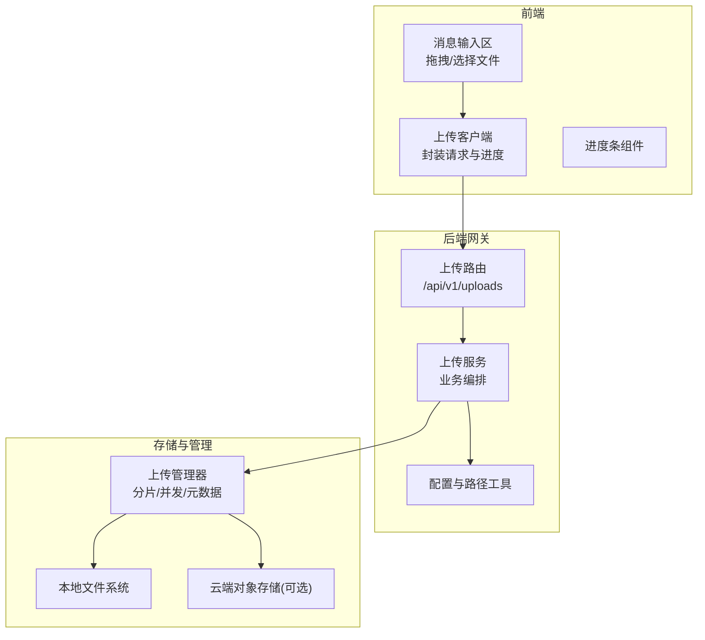
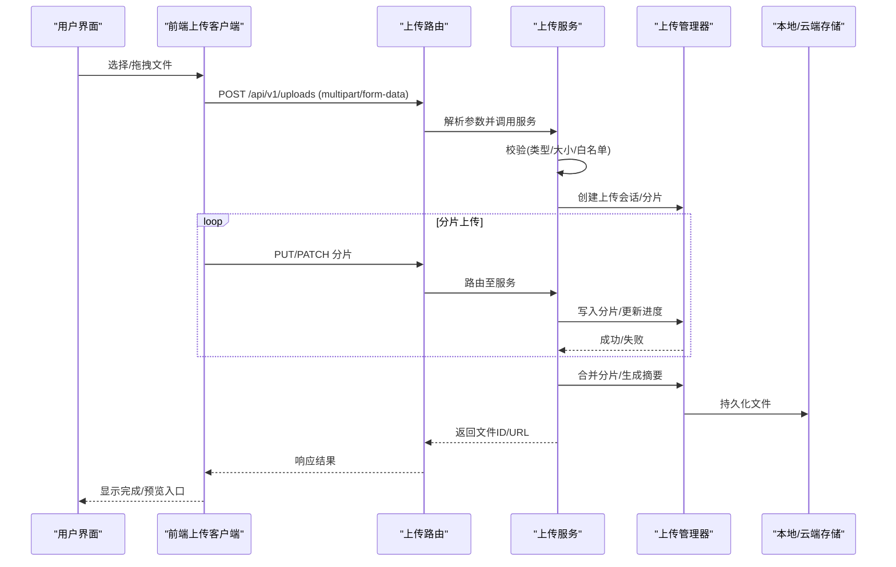
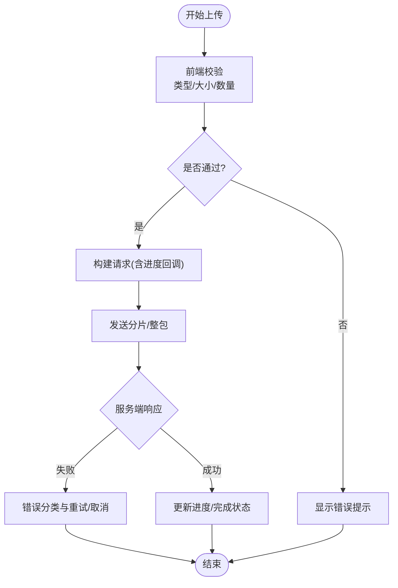
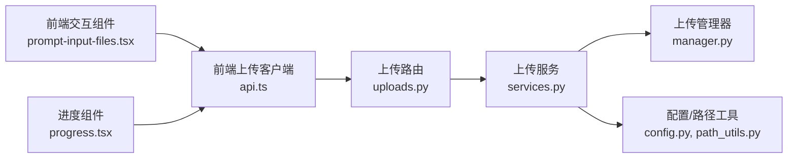

# 文件附件管理

<cite>
**本文引用的文件**   
- [backend/app/gateway/routers/uploads.py](file://backend/app/gateway/routers/uploads.py)
- [backend/app/gateway/services.py](file://backend/app/gateway/services.py)
- [backend/app/gateway/config.py](file://backend/app/gateway/config.py)
- [backend/app/gateway/path_utils.py](file://backend/app/gateway/path_utils.py)
- [backend/packages/harness/deerflow/uploads/manager.py](file://backend/packages/harness/deerflow/uploads/manager.py)
- [backend/docs/FILE_UPLOAD.md](file://backend/docs/FILE_UPLOAD.md)
- [frontend/src/core/uploads/index.ts](file://frontend/src/core/uploads/index.ts)
- [frontend/src/core/uploads/api.ts](file://frontend/src/core/uploads/api.ts)
- [frontend/src/components/workspace/messages/prompt-input-files.tsx](file://frontend/src/components/workspace/messages/prompt-input-files.tsx)
- [frontend/src/components/ui/progress.tsx](file://frontend/src/components/ui/progress.tsx)
- [frontend/tests/unit/core/uploads/file-validation.test.ts](file://frontend/tests/unit/core/uploads/file-validation.test.ts)
- [backend/tests/test_uploads_router.py](file://backend/tests/test_uploads_router.py)
- [backend/tests/test_uploads_manager.py](file://backend/tests/test_uploads_manager.py)
</cite>

## 目录
1. [简介](#简介)
2. [项目结构](#项目结构)
3. [核心组件](#核心组件)
4. [架构总览](#架构总览)
5. [详细组件分析](#详细组件分析)
6. [依赖关系分析](#依赖关系分析)
7. [性能考虑](#性能考虑)
8. [故障排查指南](#故障排查指南)
9. [结论](#结论)
10. [附录](#附录)

## 简介
本文件围绕“文件附件管理”主题，系统性梳理上传、预览、存储、安全与分享等能力，并结合前后端代码路径给出可追溯的实现要点。文档面向不同技术背景的读者，既提供高层概览，也深入到关键模块的调用链路与数据结构，帮助快速定位问题与优化方案。

## 项目结构
后端采用 FastAPI 网关路由 + 服务层 + 上传管理器（Manager）的分层设计；前端基于 Next.js，提供上传交互、进度展示与校验逻辑。

图示来源
- [backend/app/gateway/routers/uploads.py](file://backend/app/gateway/routers/uploads.py)
- [backend/app/gateway/services.py](file://backend/app/gateway/services.py)
- [backend/app/gateway/config.py](file://backend/app/gateway/config.py)
- [backend/packages/harness/deerflow/uploads/manager.py](file://backend/packages/harness/deerflow/uploads/manager.py)
- [frontend/src/core/uploads/api.ts](file://frontend/src/core/uploads/api.ts)
- [frontend/src/components/workspace/messages/prompt-input-files.tsx](file://frontend/src/components/workspace/messages/prompt-input-files.tsx)
- [frontend/src/components/ui/progress.tsx](file://frontend/src/components/ui/progress.tsx)

章节来源
- [backend/app/gateway/routers/uploads.py](file://backend/app/gateway/routers/uploads.py)
- [backend/app/gateway/services.py](file://backend/app/gateway/services.py)
- [backend/app/gateway/config.py](file://backend/app/gateway/config.py)
- [backend/packages/harness/deerflow/uploads/manager.py](file://backend/packages/harness/deerflow/uploads/manager.py)
- [frontend/src/core/uploads/index.ts](file://frontend/src/core/uploads/index.ts)
- [frontend/src/core/uploads/api.ts](file://frontend/src/core/uploads/api.ts)
- [frontend/src/components/workspace/messages/prompt-input-files.tsx](file://frontend/src/components/workspace/messages/prompt-input-files.tsx)
- [frontend/src/components/ui/progress.tsx](file://frontend/src/components/ui/progress.tsx)

## 核心组件
- 上传路由：定义上传接口、接收 multipart/form-data、返回任务或结果标识。
- 上传服务：编排校验、分片策略、并发写入、元数据记录与错误处理。
- 上传管理器：实现分片合并、断点续传、并发控制、临时目录清理与持久化落盘。
- 前端上传客户端：封装请求头、进度回调、重试与取消、错误映射。
- 前端交互组件：支持拖拽、多选、类型与大小校验、实时进度显示。
- 配置与路径工具：统一根目录、子目录组织、命名规则与访问路径生成。

章节来源
- [backend/app/gateway/routers/uploads.py](file://backend/app/gateway/routers/uploads.py)
- [backend/app/gateway/services.py](file://backend/app/gateway/services.py)
- [backend/packages/harness/deerflow/uploads/manager.py](file://backend/packages/harness/deerflow/uploads/manager.py)
- [backend/app/gateway/path_utils.py](file://backend/app/gateway/path_utils.py)
- [frontend/src/core/uploads/api.ts](file://frontend/src/core/uploads/api.ts)
- [frontend/src/components/workspace/messages/prompt-input-files.tsx](file://frontend/src/components/workspace/messages/prompt-input-files.tsx)

## 架构总览
从用户触发到文件落盘的端到端流程如下：

图示来源
- [backend/app/gateway/routers/uploads.py](file://backend/app/gateway/routers/uploads.py)
- [backend/app/gateway/services.py](file://backend/app/gateway/services.py)
- [backend/packages/harness/deerflow/uploads/manager.py](file://backend/packages/harness/deerflow/uploads/manager.py)

## 详细组件分析

### 上传机制（拖拽、进度、错误处理）
- 拖拽上传
  - 前端在消息输入区域监听拖拽事件，阻止默认行为并收集文件列表，进行基础校验后进入上传队列。
  - 参考路径：[prompt-input-files.tsx](file://frontend/src/components/workspace/messages/prompt-input-files.tsx)
- 进度显示
  - 使用浏览器原生 XMLHttpRequest 或 Fetch + ReadableStream 上报进度，驱动进度条组件渲染。
  - 参考路径：[api.ts](file://frontend/src/core/uploads/api.ts)、[progress.tsx](file://frontend/src/components/ui/progress.tsx)
- 错误处理
  - 网络错误、超时、服务端校验失败（类型/大小/配额）均在前端映射为友好提示，并支持重试与取消。
  - 单元测试覆盖常见边界场景。
  - 参考路径：[file-validation.test.ts](file://frontend/tests/unit/core/uploads/file-validation.test.ts)

图示来源
- [frontend/src/core/uploads/api.ts](file://frontend/src/core/uploads/api.ts)
- [frontend/src/components/workspace/messages/prompt-input-files.tsx](file://frontend/src/components/workspace/messages/prompt-input-files.tsx)
- [frontend/src/components/ui/progress.tsx](file://frontend/src/components/ui/progress.tsx)
- [frontend/tests/unit/core/uploads/file-validation.test.ts](file://frontend/tests/unit/core/uploads/file-validation.test.ts)

章节来源
- [frontend/src/components/workspace/messages/prompt-input-files.tsx](file://frontend/src/components/workspace/messages/prompt-input-files.tsx)
- [frontend/src/core/uploads/api.ts](file://frontend/src/core/uploads/api.ts)
- [frontend/src/components/ui/progress.tsx](file://frontend/src/components/ui/progress.tsx)
- [frontend/tests/unit/core/uploads/file-validation.test.ts](file://frontend/tests/unit/core/uploads/file-validation.test.ts)

### 文件预览（图片、文档、代码高亮）
- 图片预览
  - 对图片类型直接以 URL 或 Blob 方式渲染缩略图，支持懒加载与尺寸限制。
- 文档查看
  - 文本类文件（如 .txt/.md/.json/.csv）可直接渲染；二进制需转换为可阅读格式或提供下载。
- 代码高亮
  - 根据扩展名匹配语言，启用语法高亮与行号，提升可读性。
- 安全注意
  - 仅允许安全的 MIME 类型，避免执行脚本；对超大文件做截断或分页渲染。

章节来源
- [backend/docs/FILE_UPLOAD.md](file://backend/docs/FILE_UPLOAD.md)
- [frontend/src/core/uploads/index.ts](file://frontend/src/core/uploads/index.ts)

### 文件存储管理（本地缓存、云端同步、版本控制）
- 本地缓存
  - 上传期间使用临时目录存放分片，完成后合并并生成最终文件；提供清理策略与磁盘水位监控。
- 云端同步
  - 支持将文件同步至对象存储（如 S3/OSS），通过配置切换存储后端；提供一致性校验与失败重试。
- 版本控制
  - 同一文件多次上传按时间戳或哈希生成新版本，保留历史版本以便回滚与审计。
- 元数据与索引
  - 记录文件名、大小、MIME、哈希、创建时间、上传者、所属会话等，便于检索与权限控制。

章节来源
- [backend/packages/harness/deerflow/uploads/manager.py](file://backend/packages/harness/deerflow/uploads/manager.py)
- [backend/app/gateway/services.py](file://backend/app/gateway/services.py)
- [backend/app/gateway/path_utils.py](file://backend/app/gateway/path_utils.py)
- [backend/app/gateway/config.py](file://backend/app/gateway/config.py)

### 文件安全机制（格式验证、大小限制、病毒扫描）
- 格式验证
  - 基于扩展名与 MIME 双重校验，维护白名单；拒绝危险类型（如可执行脚本）。
- 大小限制
  - 全局与单文件上限由配置控制，超限直接拒绝并提示。
- 病毒扫描
  - 可在上传成功后异步触发扫描，标记风险文件并阻断后续使用。
- 访问控制
  - 结合会话/租户维度限制可见范围，敏感文件加密存储与传输。

章节来源
- [backend/app/gateway/services.py](file://backend/app/gateway/services.py)
- [backend/app/gateway/config.py](file://backend/app/gateway/config.py)
- [backend/docs/FILE_UPLOAD.md](file://backend/docs/FILE_UPLOAD.md)

### 文件分享（链接生成、权限控制、访问统计）
- 链接生成
  - 为已上传文件生成一次性或带签名的访问链接，支持有效期与下载次数限制。
- 权限控制
  - 基于角色/会话/租户的鉴权中间件拦截访问，未授权返回 403。
- 访问统计
  - 记录访问者、时间、IP、UA 等指标，用于审计与风控。

章节来源
- [backend/app/gateway/routers/uploads.py](file://backend/app/gateway/routers/uploads.py)
- [backend/app/gateway/services.py](file://backend/app/gateway/services.py)

## 依赖关系分析
- 路由层依赖服务层，服务层依赖上传管理器与配置/路径工具。
- 前端上传客户端依赖通用 API 封装与 UI 进度组件。
- 测试用例覆盖路由与服务的关键路径，保障稳定性。

图示来源
- [backend/app/gateway/routers/uploads.py](file://backend/app/gateway/routers/uploads.py)
- [backend/app/gateway/services.py](file://backend/app/gateway/services.py)
- [backend/packages/harness/deerflow/uploads/manager.py](file://backend/packages/harness/deerflow/uploads/manager.py)
- [backend/app/gateway/config.py](file://backend/app/gateway/config.py)
- [backend/app/gateway/path_utils.py](file://backend/app/gateway/path_utils.py)
- [frontend/src/core/uploads/api.ts](file://frontend/src/core/uploads/api.ts)
- [frontend/src/components/workspace/messages/prompt-input-files.tsx](file://frontend/src/components/workspace/messages/prompt-input-files.tsx)
- [frontend/src/components/ui/progress.tsx](file://frontend/src/components/ui/progress.tsx)

章节来源
- [backend/tests/test_uploads_router.py](file://backend/tests/test_uploads_router.py)
- [backend/tests/test_uploads_manager.py](file://backend/tests/test_uploads_manager.py)

## 性能考虑
- 分片与并发
  - 大文件采用分片上传与并行写入，降低单次请求体积与内存峰值。
- 流式处理
  - 服务端边写边校验，减少全量缓冲；前端使用流式读取提高吞吐。
- 缓存与去重
  - 基于内容哈希的去重策略，避免重复存储；热文件加入缓存层。
- I/O 优化
  - 合理设置线程池与连接池；磁盘 IO 分离（临时目录与持久化目录）。
- 压缩与转码
  - 对图片/视频在服务端按需转码与压缩，降低带宽占用。
- 限流与背压
  - 针对单用户与全局速率限制，防止资源耗尽。

## 故障排查指南
- 常见问题
  - 上传中断：检查网络与分片重试策略；确认服务端会话是否过期。
  - 类型/大小不合法：核对白名单与上限配置；前端二次校验提示。
  - 磁盘不足：监控临时目录与持久化目录容量，及时清理与扩容。
  - 权限错误：确认访问令牌与会话上下文；检查分享链接有效期。
- 日志与追踪
  - 关注上传路由与服务层的错误日志；必要时开启调试模式输出详细堆栈。
- 回归测试
  - 使用现有测试用例复现问题，覆盖边界条件与异常分支。

章节来源
- [backend/tests/test_uploads_router.py](file://backend/tests/test_uploads_router.py)
- [backend/tests/test_uploads_manager.py](file://backend/tests/test_uploads_manager.py)

## 结论
本方案通过前后端协同实现了可靠的文件附件管理能力：前端提供友好的拖拽与进度体验，后端以路由-服务-管理器分层确保可扩展性与稳定性。配合严格的安全校验、灵活的存储后端与完善的测试覆盖，能够满足生产环境对性能、安全与可运维性的要求。建议在生产部署中结合对象存储与 CDN，进一步提升可用性与访问速度。

## 附录
- 相关文档
  - 上传规范与示例：[FILE_UPLOAD.md](file://backend/docs/FILE_UPLOAD.md)
- 关键路径速查
  - 路由：[uploads.py](file://backend/app/gateway/routers/uploads.py)
  - 服务：[services.py](file://backend/app/gateway/services.py)
  - 管理器：[manager.py](file://backend/packages/harness/deerflow/uploads/manager.py)
  - 配置与路径：[config.py](file://backend/app/gateway/config.py)、[path_utils.py](file://backend/app/gateway/path_utils.py)
  - 前端客户端：[api.ts](file://frontend/src/core/uploads/api.ts)
  - 前端交互：[prompt-input-files.tsx](file://frontend/src/components/workspace/messages/prompt-input-files.tsx)
  - 进度组件：[progress.tsx](file://frontend/src/components/ui/progress.tsx)
  - 前端校验测试：[file-validation.test.ts](file://frontend/tests/unit/core/uploads/file-validation.test.ts)
  - 后端路由测试：[test_uploads_router.py](file://backend/tests/test_uploads_router.py)
  - 后端管理器测试：[test_uploads_manager.py](file://backend/tests/test_uploads_manager.py)