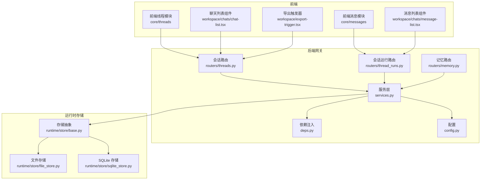
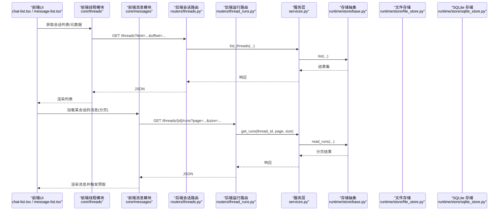
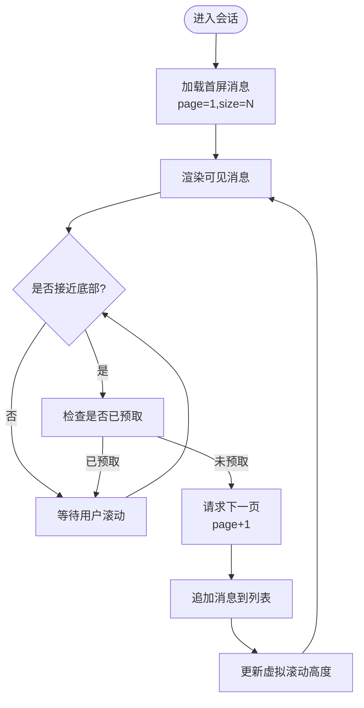
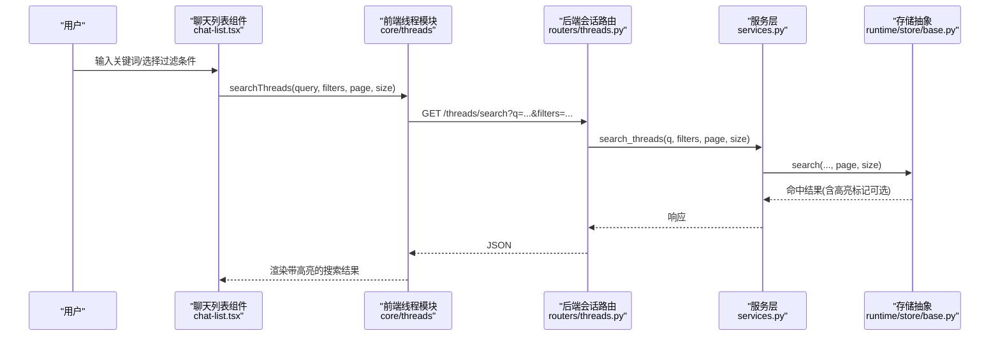
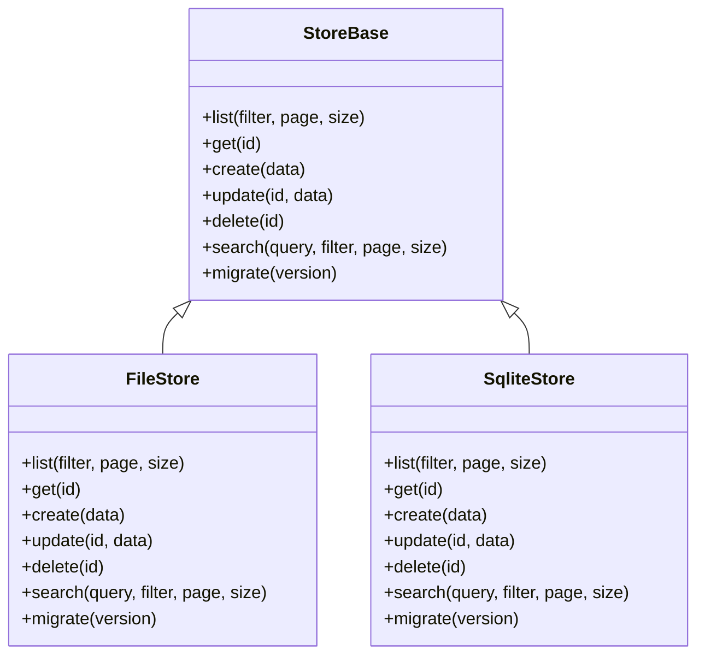
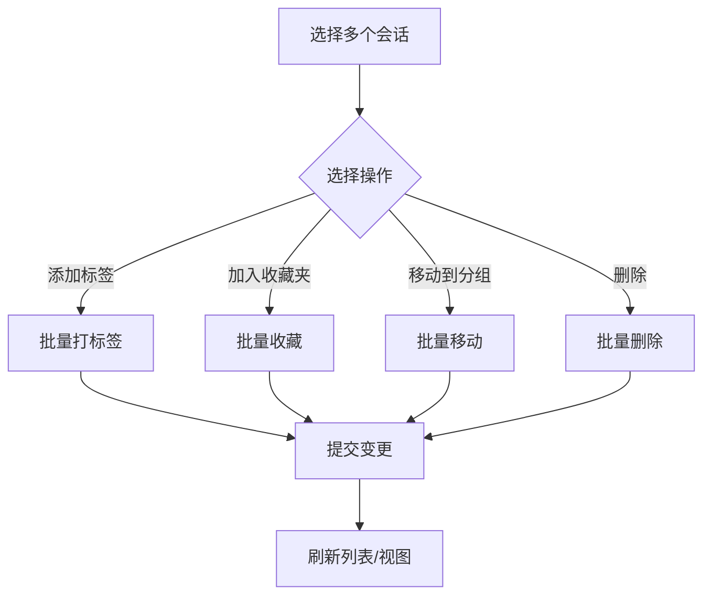
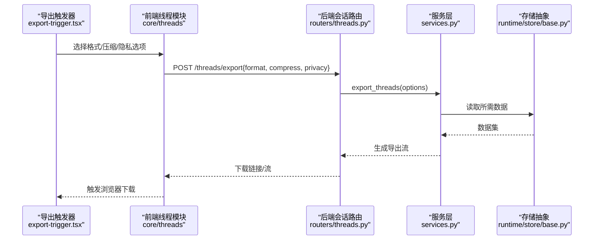
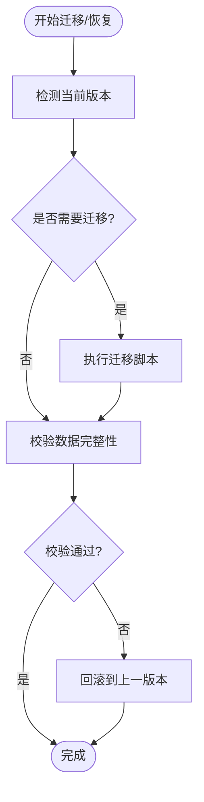
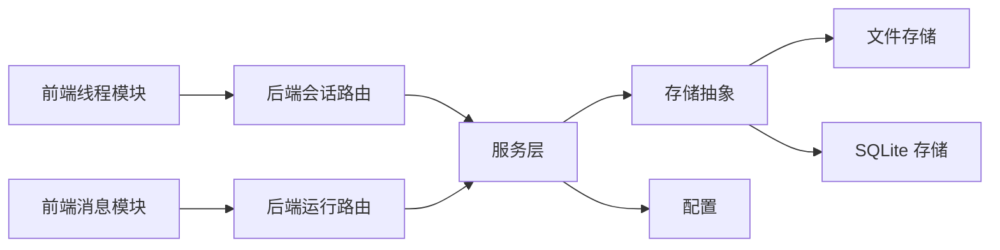

# 会话历史管理

<cite>
**本文引用的文件**   
- [backend/app/gateway/routers/threads.py](file://backend/app/gateway/routers/threads.py)
- [backend/app/gateway/routers/thread_runs.py](file://backend/app/gateway/routers/thread_runs.py)
- [backend/app/gateway/routers/memory.py](file://backend/app/gateway/routers/memory.py)
- [backend/app/gateway/services.py](file://backend/app/gateway/services.py)
- [backend/app/gateway/deps.py](file://backend/app/gateway/deps.py)
- [backend/app/gateway/config.py](file://backend/app/gateway/config.py)
- [backend/packages/harness/deerflow/runtime/store/base.py](file://backend/packages/harness/deerflow/runtime/store/base.py)
- [backend/packages/harness/deerflow/runtime/store/file_store.py](file://backend/packages/harness/deerflow/runtime/store/file_store.py)
- [backend/packages/harness/deerflow/runtime/store/sqlite_store.py](file://backend/packages/harness/deerflow/runtime/store/sqlite_store.py)
- [frontend/src/core/threads/index.ts](file://frontend/src/core/threads/index.ts)
- [frontend/src/core/threads/hooks.ts](file://frontend/src/core/threads/hooks.ts)
- [frontend/src/core/messages/index.ts](file://frontend/src/core/messages/index.ts)
- [frontend/src/components/workspace/chats/chat-list.tsx](file://frontend/src/components/workspace/chats/chat-list.tsx)
- [frontend/src/components/workspace/chats/message-list.tsx](file://frontend/src/components/workspace/chats/message-list.tsx)
- [frontend/src/components/workspace/export-trigger.tsx](file://frontend/src/components/workspace/export-trigger.tsx)
</cite>

## 目录
1. [简介](#简介)
2. [项目结构](#项目结构)
3. [核心组件](#核心组件)
4. [架构总览](#架构总览)
5. [详细组件分析](#详细组件分析)
6. [依赖关系分析](#依赖关系分析)
7. [性能考量](#性能考量)
8. [故障排查指南](#故障排查指南)
9. [结论](#结论)
10. [附录](#附录)

## 简介
本文件围绕“会话历史管理”展开，聚焦以下能力：
- 消息分页加载机制：虚拟滚动、懒加载与预取策略
- 搜索功能：全文检索、过滤条件与搜索结果高亮
- 状态持久化：本地存储、云端同步与版本管理
- 会话组织：标签分类、收藏夹与批量操作
- 导出能力：多格式支持、数据压缩与隐私保护
- 迁移与备份恢复：工具链与流程

为保证准确性，文档在涉及具体实现时均指向仓库中的实际文件路径与行号范围。

## 项目结构
后端通过网关路由暴露会话与运行记录接口，服务层封装业务逻辑，运行时存储抽象提供多种持久化后端；前端基于 React/Next.js 构建，使用 hooks 与 API 客户端进行数据获取与交互。

图表来源
- [backend/app/gateway/routers/threads.py](file://backend/app/gateway/routers/threads.py)
- [backend/app/gateway/routers/thread_runs.py](file://backend/app/gateway/routers/thread_runs.py)
- [backend/app/gateway/routers/memory.py](file://backend/app/gateway/routers/memory.py)
- [backend/app/gateway/services.py](file://backend/app/gateway/services.py)
- [backend/app/gateway/deps.py](file://backend/app/gateway/deps.py)
- [backend/app/gateway/config.py](file://backend/app/gateway/config.py)
- [backend/packages/harness/deerflow/runtime/store/base.py](file://backend/packages/harness/deerflow/runtime/store/base.py)
- [backend/packages/harness/deerflow/runtime/store/file_store.py](file://backend/packages/harness/deerflow/runtime/store/file_store.py)
- [backend/packages/harness/deerflow/runtime/store/sqlite_store.py](file://backend/packages/harness/deerflow/runtime/store/sqlite_store.py)
- [frontend/src/core/threads/index.ts](file://frontend/src/core/threads/index.ts)
- [frontend/src/core/threads/hooks.ts](file://frontend/src/core/threads/hooks.ts)
- [frontend/src/core/messages/index.ts](file://frontend/src/core/messages/index.ts)
- [frontend/src/components/workspace/chats/chat-list.tsx](file://frontend/src/components/workspace/chats/chat-list.tsx)
- [frontend/src/components/workspace/chats/message-list.tsx](file://frontend/src/components/workspace/chats/message-list.tsx)
- [frontend/src/components/workspace/export-trigger.tsx](file://frontend/src/components/workspace/export-trigger.tsx)

章节来源
- [backend/app/gateway/routers/threads.py](file://backend/app/gateway/routers/threads.py)
- [backend/app/gateway/routers/thread_runs.py](file://backend/app/gateway/routers/thread_runs.py)
- [backend/app/gateway/routers/memory.py](file://backend/app/gateway/routers/memory.py)
- [backend/app/gateway/services.py](file://backend/app/gateway/services.py)
- [backend/app/gateway/deps.py](file://backend/app/gateway/deps.py)
- [backend/app/gateway/config.py](file://backend/app/gateway/config.py)
- [backend/packages/harness/deerflow/runtime/store/base.py](file://backend/packages/harness/deerflow/runtime/store/base.py)
- [backend/packages/harness/deerflow/runtime/store/file_store.py](file://backend/packages/harness/deerflow/runtime/store/file_store.py)
- [backend/packages/harness/deerflow/runtime/store/sqlite_store.py](file://backend/packages/harness/deerflow/runtime/store/sqlite_store.py)
- [frontend/src/core/threads/index.ts](file://frontend/src/core/threads/index.ts)
- [frontend/src/core/threads/hooks.ts](file://frontend/src/core/threads/hooks.ts)
- [frontend/src/core/messages/index.ts](file://frontend/src/core/messages/index.ts)
- [frontend/src/components/workspace/chats/chat-list.tsx](file://frontend/src/components/workspace/chats/chat-list.tsx)
- [frontend/src/components/workspace/chats/message-list.tsx](file://frontend/src/components/workspace/chats/message-list.tsx)
- [frontend/src/components/workspace/export-trigger.tsx](file://frontend/src/components/workspace/export-trigger.tsx)

## 核心组件
- 会话路由（threads）：负责会话的创建、列举、更新、删除等基础 CRUD 与元数据查询。
- 会话运行路由（thread_runs）：负责会话内消息的分页读取、追加、重放等。
- 记忆路由（memory）：用于会话上下文记忆、摘要或外部索引的读写。
- 服务层（services）：聚合业务逻辑，协调存储后端与配置。
- 运行时存储抽象（store/base）：定义统一的存储接口，供文件存储与 SQLite 存储实现。
- 前端线程与消息模块：封装 API 调用、缓存与状态管理，驱动 UI 渲染。
- 聊天与消息列表组件：承载分页、虚拟滚动、懒加载与预取的交互逻辑。
- 导出触发器：触发导出任务，选择格式与压缩选项。

章节来源
- [backend/app/gateway/routers/threads.py](file://backend/app/gateway/routers/threads.py)
- [backend/app/gateway/routers/thread_runs.py](file://backend/app/gateway/routers/thread_runs.py)
- [backend/app/gateway/routers/memory.py](file://backend/app/gateway/routers/memory.py)
- [backend/app/gateway/services.py](file://backend/app/gateway/services.py)
- [backend/packages/harness/deerflow/runtime/store/base.py](file://backend/packages/harness/deerflow/runtime/store/base.py)
- [frontend/src/core/threads/index.ts](file://frontend/src/core/threads/index.ts)
- [frontend/src/core/messages/index.ts](file://frontend/src/core/messages/index.ts)
- [frontend/src/components/workspace/chats/chat-list.tsx](file://frontend/src/components/workspace/chats/chat-list.tsx)
- [frontend/src/components/workspace/chats/message-list.tsx](file://frontend/src/components/workspace/chats/message-list.tsx)
- [frontend/src/components/workspace/export-trigger.tsx](file://frontend/src/components/workspace/export-trigger.tsx)

## 架构总览
下图展示了从前端到后端的请求链路以及存储后端的接入方式。

图表来源
- [backend/app/gateway/routers/threads.py](file://backend/app/gateway/routers/threads.py)
- [backend/app/gateway/routers/thread_runs.py](file://backend/app/gateway/routers/thread_runs.py)
- [backend/app/gateway/services.py](file://backend/app/gateway/services.py)
- [backend/packages/harness/deerflow/runtime/store/base.py](file://backend/packages/harness/deerflow/runtime/store/base.py)
- [backend/packages/harness/deerflow/runtime/store/file_store.py](file://backend/packages/harness/deerflow/runtime/store/file_store.py)
- [backend/packages/harness/deerflow/runtime/store/sqlite_store.py](file://backend/packages/harness/deerflow/runtime/store/sqlite_store.py)
- [frontend/src/components/workspace/chats/chat-list.tsx](file://frontend/src/components/workspace/chats/chat-list.tsx)
- [frontend/src/components/workspace/chats/message-list.tsx](file://frontend/src/components/workspace/chats/message-list.tsx)
- [frontend/src/core/threads/index.ts](file://frontend/src/core/threads/index.ts)
- [frontend/src/core/messages/index.ts](file://frontend/src/core/messages/index.ts)

## 详细组件分析

### 消息分页加载机制（虚拟滚动、懒加载、预取）
- 分页参数
  - 后端运行路由通常接受页码/大小或游标式偏移参数，以返回指定区间的消息片段。
  - 前端在首次进入会话时加载首屏消息，随后根据滚动位置按需加载更多。
- 虚拟滚动
  - 通过固定容器高度与动态渲染可见区域项，降低 DOM 节点数量，提升长列表性能。
  - 结合消息项的高度估算与占位骨架，避免布局抖动。
- 懒加载
  - 当用户滚动接近底部时触发下一页请求，减少不必要的网络开销。
- 预取策略
  - 在距离阈值（如剩余 N 条即到底）时提前发起下一批请求，保证无缝体验。
  - 可结合去抖与并发控制，避免重复请求与过载。

图表来源
- [backend/app/gateway/routers/thread_runs.py](file://backend/app/gateway/routers/thread_runs.py)
- [frontend/src/components/workspace/chats/message-list.tsx](file://frontend/src/components/workspace/chats/message-list.tsx)
- [frontend/src/core/messages/index.ts](file://frontend/src/core/messages/index.ts)

章节来源
- [backend/app/gateway/routers/thread_runs.py](file://backend/app/gateway/routers/thread_runs.py)
- [frontend/src/components/workspace/chats/message-list.tsx](file://frontend/src/components/workspace/chats/message-list.tsx)
- [frontend/src/core/messages/index.ts](file://frontend/src/core/messages/index.ts)

### 搜索功能（全文检索、过滤条件、高亮）
- 全文检索
  - 后端可提供按关键词匹配会话标题、内容摘要或消息文本的接口，支持模糊匹配与分词。
  - 前端对输入进行去抖，组合关键词与过滤条件发起查询。
- 过滤条件
  - 支持按时间范围、标签、收藏状态、来源渠道等多维度筛选。
  - 过滤条件与会话列表分页合并，形成复合查询。
- 搜索结果高亮
  - 后端返回命中片段或标记信息，前端对关键词进行高亮渲染。
  - 若后端不返回高亮标记，前端可在安全范围内对文本进行正则替换高亮。

图表来源
- [backend/app/gateway/routers/threads.py](file://backend/app/gateway/routers/threads.py)
- [backend/app/gateway/services.py](file://backend/app/gateway/services.py)
- [backend/packages/harness/deerflow/runtime/store/base.py](file://backend/packages/harness/deerflow/runtime/store/base.py)
- [frontend/src/components/workspace/chats/chat-list.tsx](file://frontend/src/components/workspace/chats/chat-list.tsx)
- [frontend/src/core/threads/index.ts](file://frontend/src/core/threads/index.ts)

章节来源
- [backend/app/gateway/routers/threads.py](file://backend/app/gateway/routers/threads.py)
- [backend/app/gateway/services.py](file://backend/app/gateway/services.py)
- [backend/packages/harness/deerflow/runtime/store/base.py](file://backend/packages/harness/deerflow/runtime/store/base.py)
- [frontend/src/components/workspace/chats/chat-list.tsx](file://frontend/src/components/workspace/chats/chat-list.tsx)
- [frontend/src/core/threads/index.ts](file://frontend/src/core/threads/index.ts)

### 状态持久化方案（本地存储、云端同步、版本管理）
- 本地存储
  - 文件存储后端将会话与运行记录以结构化文件形式落盘，便于调试与迁移。
- 云端同步
  - 可通过扩展存储抽象，对接远程对象存储或数据库，实现跨设备同步。
- 版本管理
  - 在存储层维护数据模型版本，升级时执行迁移脚本，确保向后兼容。
  - 配置中可声明默认存储类型与路径，便于部署切换。

图表来源
- [backend/packages/harness/deerflow/runtime/store/base.py](file://backend/packages/harness/deerflow/runtime/store/base.py)
- [backend/packages/harness/deerflow/runtime/store/file_store.py](file://backend/packages/harness/deerflow/runtime/store/file_store.py)
- [backend/packages/harness/deerflow/runtime/store/sqlite_store.py](file://backend/packages/harness/deerflow/runtime/store/sqlite_store.py)

章节来源
- [backend/packages/harness/deerflow/runtime/store/base.py](file://backend/packages/harness/deerflow/runtime/store/base.py)
- [backend/packages/harness/deerflow/runtime/store/file_store.py](file://backend/packages/harness/deerflow/runtime/store/file_store.py)
- [backend/packages/harness/deerflow/runtime/store/sqlite_store.py](file://backend/packages/harness/deerflow/runtime/store/sqlite_store.py)
- [backend/app/gateway/config.py](file://backend/app/gateway/config.py)

### 会话组织（标签分类、收藏夹、批量操作）
- 标签分类
  - 为会话添加标签集合，支持按标签筛选与聚合统计。
- 收藏夹
  - 置顶常用会话，提供快速入口与独立视图。
- 批量操作
  - 支持多选会话进行移动标签、归档或删除等操作，提高管理效率。

章节来源
- [backend/app/gateway/routers/threads.py](file://backend/app/gateway/routers/threads.py)
- [backend/app/gateway/services.py](file://backend/app/gateway/services.py)
- [frontend/src/components/workspace/chats/chat-list.tsx](file://frontend/src/components/workspace/chats/chat-list.tsx)

### 导出功能（多格式、压缩、隐私保护）
- 多格式支持
  - 支持 Markdown、JSON、CSV 等常见格式，便于二次处理与分享。
- 数据压缩
  - 导出时可启用压缩（如 ZIP），减小体积，便于传输与归档。
- 隐私保护
  - 导出前可进行敏感字段脱敏或选择性导出，避免泄露个人信息。

图表来源
- [backend/app/gateway/routers/threads.py](file://backend/app/gateway/routers/threads.py)
- [backend/app/gateway/services.py](file://backend/app/gateway/services.py)
- [backend/packages/harness/deerflow/runtime/store/base.py](file://backend/packages/harness/deerflow/runtime/store/base.py)
- [frontend/src/components/workspace/export-trigger.tsx](file://frontend/src/components/workspace/export-trigger.tsx)
- [frontend/src/core/threads/index.ts](file://frontend/src/core/threads/index.ts)

章节来源
- [backend/app/gateway/routers/threads.py](file://backend/app/gateway/routers/threads.py)
- [backend/app/gateway/services.py](file://backend/app/gateway/services.py)
- [backend/packages/harness/deerflow/runtime/store/base.py](file://backend/packages/harness/deerflow/runtime/store/base.py)
- [frontend/src/components/workspace/export-trigger.tsx](file://frontend/src/components/workspace/export-trigger.tsx)
- [frontend/src/core/threads/index.ts](file://frontend/src/core/threads/index.ts)

### 迁移工具与备份恢复
- 迁移工具
  - 基于存储抽象的版本迁移方法，统一执行数据模型升级与字段映射。
- 备份恢复
  - 文件存储可直接复制数据目录作为备份；SQLite 存储可导出数据库文件。
  - 恢复时校验版本与完整性，必要时回滚至上一稳定版本。

图表来源
- [backend/packages/harness/deerflow/runtime/store/base.py](file://backend/packages/harness/deerflow/runtime/store/base.py)
- [backend/packages/harness/deerflow/runtime/store/file_store.py](file://backend/packages/harness/deerflow/runtime/store/file_store.py)
- [backend/packages/harness/deerflow/runtime/store/sqlite_store.py](file://backend/packages/harness/deerflow/runtime/store/sqlite_store.py)

章节来源
- [backend/packages/harness/deerflow/runtime/store/base.py](file://backend/packages/harness/deerflow/runtime/store/base.py)
- [backend/packages/harness/deerflow/runtime/store/file_store.py](file://backend/packages/harness/deerflow/runtime/store/file_store.py)
- [backend/packages/harness/deerflow/runtime/store/sqlite_store.py](file://backend/packages/harness/deerflow/runtime/store/sqlite_store.py)

## 依赖关系分析
- 组件耦合
  - 前端模块与后端路由通过 REST API 解耦，服务层屏蔽存储细节。
  - 存储抽象使不同后端可插拔替换，降低耦合度。
- 直接依赖
  - 路由依赖服务层；服务层依赖存储抽象与配置。
- 间接依赖
  - 前端 hooks 依赖 API 客户端与缓存策略。
- 外部集成点
  - 配置中心决定存储类型与路径；可扩展云端存储实现。

图表来源
- [backend/app/gateway/routers/threads.py](file://backend/app/gateway/routers/threads.py)
- [backend/app/gateway/routers/thread_runs.py](file://backend/app/gateway/routers/thread_runs.py)
- [backend/app/gateway/services.py](file://backend/app/gateway/services.py)
- [backend/app/gateway/config.py](file://backend/app/gateway/config.py)
- [backend/packages/harness/deerflow/runtime/store/base.py](file://backend/packages/harness/deerflow/runtime/store/base.py)
- [backend/packages/harness/deerflow/runtime/store/file_store.py](file://backend/packages/harness/deerflow/runtime/store/file_store.py)
- [backend/packages/harness/deerflow/runtime/store/sqlite_store.py](file://backend/packages/harness/deerflow/runtime/store/sqlite_store.py)
- [frontend/src/core/threads/index.ts](file://frontend/src/core/threads/index.ts)
- [frontend/src/core/messages/index.ts](file://frontend/src/core/messages/index.ts)

章节来源
- [backend/app/gateway/routers/threads.py](file://backend/app/gateway/routers/threads.py)
- [backend/app/gateway/routers/thread_runs.py](file://backend/app/gateway/routers/thread_runs.py)
- [backend/app/gateway/services.py](file://backend/app/gateway/services.py)
- [backend/app/gateway/config.py](file://backend/app/gateway/config.py)
- [backend/packages/harness/deerflow/runtime/store/base.py](file://backend/packages/harness/deerflow/runtime/store/base.py)
- [backend/packages/harness/deerflow/runtime/store/file_store.py](file://backend/packages/harness/deerflow/runtime/store/file_store.py)
- [backend/packages/harness/deerflow/runtime/store/sqlite_store.py](file://backend/packages/harness/deerflow/runtime/store/sqlite_store.py)
- [frontend/src/core/threads/index.ts](file://frontend/src/core/threads/index.ts)
- [frontend/src/core/messages/index.ts](file://frontend/src/core/messages/index.ts)

## 性能考量
- 分页与虚拟滚动
  - 合理设置每页大小，避免单次加载过多数据；虚拟滚动显著降低渲染压力。
- 预取与去抖
  - 预取阈值需平衡用户体验与带宽消耗；输入框搜索建议去抖以减少无效请求。
- 存储后端选择
  - 文件存储适合小规模与便携场景；SQLite 适合中等规模与复杂查询。
- 缓存策略
  - 前端可对会话列表与热门会话进行短期缓存，减少重复请求。
- 压缩与传输
  - 大体积导出启用压缩，降低网络传输成本。

[本节为通用指导，无需特定文件引用]

## 故障排查指南
- 常见问题
  - 分页异常：检查后端分页参数解析与边界条件处理。
  - 虚拟滚动错位：确认容器高度与项高度估算是否正确。
  - 搜索无结果：验证关键词分词与过滤条件组合逻辑。
  - 导出失败：检查权限、磁盘空间与压缩库可用性。
- 日志与诊断
  - 在后端服务层与存储层增加关键路径日志，定位问题。
  - 前端开启网络面板与错误上报，收集失败堆栈与请求参数。

章节来源
- [backend/app/gateway/services.py](file://backend/app/gateway/services.py)
- [backend/app/gateway/routers/threads.py](file://backend/app/gateway/routers/threads.py)
- [backend/app/gateway/routers/thread_runs.py](file://backend/app/gateway/routers/thread_runs.py)
- [frontend/src/components/workspace/chats/message-list.tsx](file://frontend/src/components/workspace/chats/message-list.tsx)
- [frontend/src/components/workspace/export-trigger.tsx](file://frontend/src/components/workspace/export-trigger.tsx)

## 结论
本方案通过清晰的前后端分层与存储抽象，实现了高效的会话历史管理与消息分页加载。结合搜索、组织、导出与迁移能力，提供了完整的数据生命周期管理。未来可进一步引入云端同步与更丰富的索引能力，以提升跨设备一致性与检索性能。

[本节为总结性内容，无需特定文件引用]

## 附录
- 术语
  - 会话：一次对话上下文，包含多条消息与元数据。
  - 运行记录：会话内的消息序列与系统事件。
  - 存储抽象：统一的数据访问接口，屏蔽底层实现差异。
- 参考实现路径
  - 后端路由与服务层：参见“后端网关”相关路径。
  - 存储实现：参见“运行时存储”相关路径。
  - 前端模块与组件：参见“前端核心模块与组件”相关路径。

[本节为补充说明，无需特定文件引用]