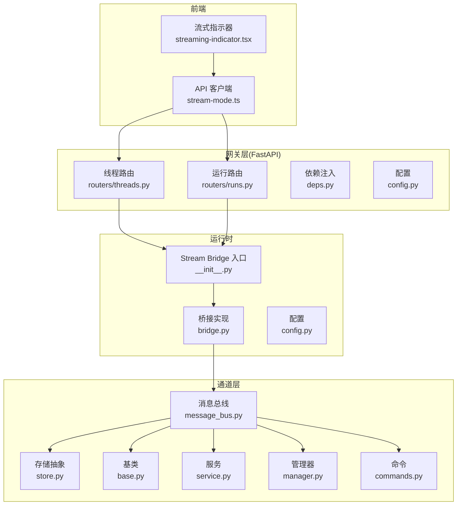
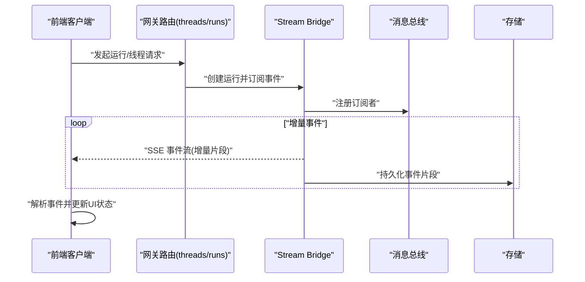
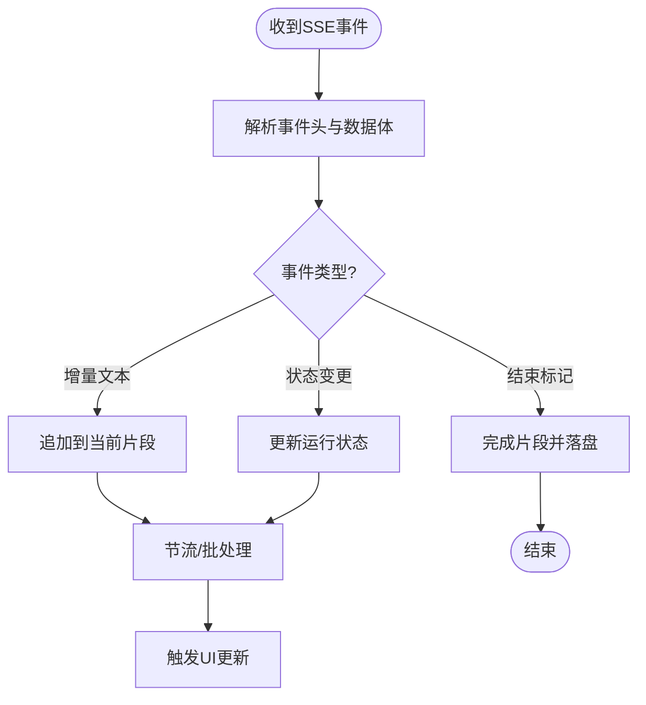
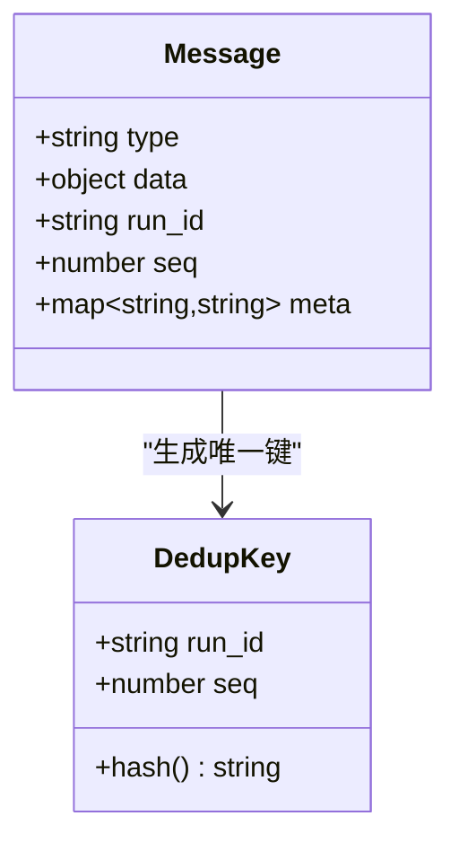
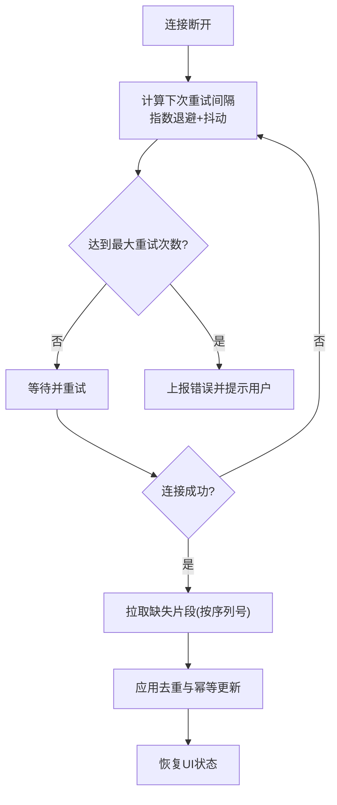
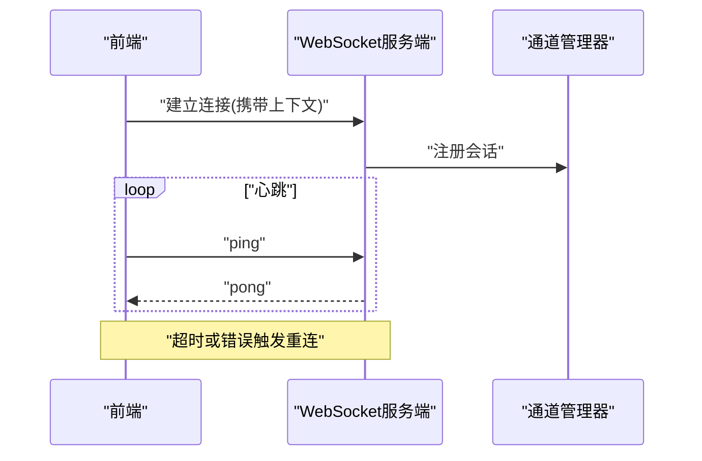
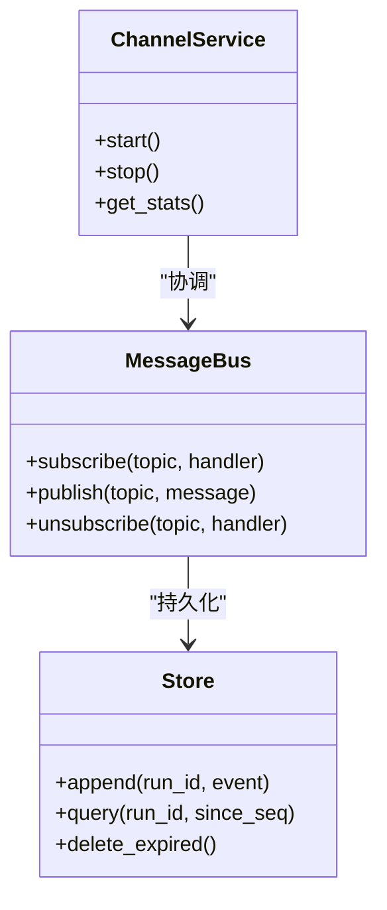

# 实时通信机制

<cite>
**本文引用的文件**
- [backend/app/gateway/routers/threads.py](file://backend/app/gateway/routers/threads.py)
- [backend/app/gateway/routers/runs.py](file://backend/app/gateway/routers/runs.py)
- [backend/app/gateway/services.py](file://backend/app/gateway/services.py)
- [backend/app/gateway/deps.py](file://backend/app/gateway/deps.py)
- [backend/app/gateway/config.py](file://backend/app/gateway/config.py)
- [backend/app/runtime/stream_bridge/__init__.py](file://backend/app/runtime/stream_bridge/__init__.py)
- [backend/app/runtime/stream_bridge/bridge.py](file://backend/app/runtime/stream_bridge/bridge.py)
- [backend/app/runtime/stream_bridge/config.py](file://backend/app/runtime/stream_bridge/config.py)
- [backend/app/channels/message_bus.py](file://backend/app/channels/message_bus.py)
- [backend/app/channels/store.py](file://backend/app/channels/store.py)
- [backend/app/channels/base.py](file://backend/app/channels/base.py)
- [backend/app/channels/service.py](file://backend/app/channels/service.py)
- [backend/app/channels/manager.py](file://backend/app/channels/manager.py)
- [backend/app/channels/commands.py](file://backend/app/channels/commands.py)
- [backend/tests/test_sse_format.py](file://backend/tests/test_sse_format.py)
- [backend/tests/test_stream_bridge.py](file://backend/tests/test_stream_bridge.py)
- [frontend/src/core/api/stream-mode.ts](file://frontend/src/core/api/stream-mode.ts)
- [frontend/src/core/api/api-client.ts](file://frontend/src/core/api/api-client.ts)
- [frontend/src/components/workspace/messages/streaming-indicator.tsx](file://frontend/src/components/workspace/messages/streaming-indicator.tsx)
</cite>

## 目录
1. [简介](#简介)
2. [项目结构](#项目结构)
3. [核心组件](#核心组件)
4. [架构总览](#架构总览)
5. [详细组件分析](#详细组件分析)
6. [依赖关系分析](#依赖关系分析)
7. [性能考虑](#性能考虑)
8. [故障排查指南](#故障排查指南)
9. [结论](#结论)
10. [附录](#附录)

## 简介
本文件聚焦于 Deer-Flow 的实时通信机制，覆盖以下关键主题：
- WebSocket 连接管理：连接建立、心跳检测、错误处理与自动重连策略
- SSE（Server-Sent Events）实现：事件流监听、数据解析与状态同步
- 消息传输协议：消息格式定义、序列号管理与去重机制
- 断线重连算法：指数退避策略、状态恢复与数据一致性保证
- 性能优化技巧：连接池管理、内存泄漏防护与网络请求节流

该文档面向后端与前端开发者，既提供高层架构说明，也深入到具体模块与调用链，帮助读者快速定位问题并实施优化。

## 项目结构
本项目在后端采用 FastAPI 网关层暴露 REST/SSE 接口，并通过运行时 Stream Bridge 将 LangGraph 运行时的增量事件推送至客户端；在通道层使用消息总线与存储抽象进行跨进程/跨服务的事件分发与持久化。前端通过 API 客户端与流模式封装，统一处理 SSE 与 WebSocket 的接入、解析与状态同步。

图表来源
- [backend/app/gateway/routers/threads.py](file://backend/app/gateway/routers/threads.py)
- [backend/app/gateway/routers/runs.py](file://backend/app/gateway/routers/runs.py)
- [backend/app/gateway/deps.py](file://backend/app/gateway/deps.py)
- [backend/app/gateway/config.py](file://backend/app/gateway/config.py)
- [backend/app/runtime/stream_bridge/__init__.py](file://backend/app/runtime/stream_bridge/__init__.py)
- [backend/app/runtime/stream_bridge/bridge.py](file://backend/app/runtime/stream_bridge/bridge.py)
- [backend/app/runtime/stream_bridge/config.py](file://backend/app/runtime/stream_bridge/config.py)
- [backend/app/channels/message_bus.py](file://backend/app/channels/message_bus.py)
- [backend/app/channels/store.py](file://backend/app/channels/store.py)
- [backend/app/channels/base.py](file://backend/app/channels/base.py)
- [backend/app/channels/service.py](file://backend/app/channels/service.py)
- [backend/app/channels/manager.py](file://backend/app/channels/manager.py)
- [backend/app/channels/commands.py](file://backend/app/channels/commands.py)
- [frontend/src/core/api/stream-mode.ts](file://frontend/src/core/api/stream-mode.ts)
- [frontend/src/components/workspace/messages/streaming-indicator.tsx](file://frontend/src/components/workspace/messages/streaming-indicator.tsx)

章节来源
- [backend/app/gateway/routers/threads.py](file://backend/app/gateway/routers/threads.py)
- [backend/app/gateway/routers/runs.py](file://backend/app/gateway/routers/runs.py)
- [backend/app/gateway/deps.py](file://backend/app/gateway/deps.py)
- [backend/app/gateway/config.py](file://backend/app/gateway/config.py)
- [backend/app/runtime/stream_bridge/__init__.py](file://backend/app/runtime/stream_bridge/__init__.py)
- [backend/app/runtime/stream_bridge/bridge.py](file://backend/app/runtime/stream_bridge/bridge.py)
- [backend/app/runtime/stream_bridge/config.py](file://backend/app/runtime/stream_bridge/config.py)
- [backend/app/channels/message_bus.py](file://backend/app/channels/message_bus.py)
- [backend/app/channels/store.py](file://backend/app/channels/store.py)
- [backend/app/channels/base.py](file://backend/app/channels/base.py)
- [backend/app/channels/service.py](file://backend/app/channels/service.py)
- [backend/app/channels/manager.py](file://backend/app/channels/manager.py)
- [backend/app/channels/commands.py](file://backend/app/channels/commands.py)
- [frontend/src/core/api/stream-mode.ts](file://frontend/src/core/api/stream-mode.ts)
- [frontend/src/components/workspace/messages/streaming-indicator.tsx](file://frontend/src/components/workspace/messages/streaming-indicator.tsx)

## 核心组件
- 网关路由层
  - 线程与运行路由负责接收前端请求，创建或复用运行上下文，并将增量事件以 SSE 形式返回给客户端。
  - 依赖注入用于获取配置、运行器与通道服务实例。
- 运行时 Stream Bridge
  - 作为 LangGraph 运行时与网关之间的桥接，订阅运行事件，转换为可序列化的增量片段，并按需写入通道存储。
- 通道层
  - 消息总线提供发布/订阅能力，存储抽象负责持久化与回放，服务与管理器协调生命周期与资源清理。
- 前端流模式
  - 统一封装 SSE 与 WebSocket 的接入逻辑，维护连接状态、重试与节流策略，驱动 UI 渲染。

章节来源
- [backend/app/gateway/routers/threads.py](file://backend/app/gateway/routers/threads.py)
- [backend/app/gateway/routers/runs.py](file://backend/app/gateway/routers/runs.py)
- [backend/app/gateway/deps.py](file://backend/app/gateway/deps.py)
- [backend/app/runtime/stream_bridge/__init__.py](file://backend/app/runtime/stream_bridge/__init__.py)
- [backend/app/runtime/stream_bridge/bridge.py](file://backend/app/runtime/stream_bridge/bridge.py)
- [backend/app/channels/message_bus.py](file://backend/app/channels/message_bus.py)
- [backend/app/channels/store.py](file://backend/app/channels/store.py)
- [backend/app/channels/base.py](file://backend/app/channels/base.py)
- [backend/app/channels/service.py](file://backend/app/channels/service.py)
- [backend/app/channels/manager.py](file://backend/app/channels/manager.py)
- [backend/app/channels/commands.py](file://backend/app/channels/commands.py)
- [frontend/src/core/api/stream-mode.ts](file://frontend/src/core/api/stream-mode.ts)

## 架构总览
下图展示了从前端到后端的完整实时通信链路，包括 SSE 事件流与通道层的交互。

图表来源
- [backend/app/gateway/routers/threads.py](file://backend/app/gateway/routers/threads.py)
- [backend/app/gateway/routers/runs.py](file://backend/app/gateway/routers/runs.py)
- [backend/app/runtime/stream_bridge/__init__.py](file://backend/app/runtime/stream_bridge/__init__.py)
- [backend/app/runtime/stream_bridge/bridge.py](file://backend/app/runtime/stream_bridge/bridge.py)
- [backend/app/channels/message_bus.py](file://backend/app/channels/message_bus.py)
- [backend/app/channels/store.py](file://backend/app/channels/store.py)

## 详细组件分析

### SSE 事件流与数据解析
- 服务端
  - 路由层根据请求参数启动运行，并通过 Stream Bridge 订阅增量事件。
  - 事件以标准 SSE 格式逐条推送，包含事件类型、数据体与可选元信息。
  - 测试用例验证了 SSE 格式的正确性与边界情况。
- 客户端
  - 前端流模式封装了 EventSource 或自定义读取器，按行解析事件流，合并增量片段，触发 UI 更新。
  - 支持节流与批处理，避免频繁渲染导致的性能抖动。

图表来源
- [backend/tests/test_sse_format.py](file://backend/tests/test_sse_format.py)
- [frontend/src/core/api/stream-mode.ts](file://frontend/src/core/api/stream-mode.ts)

章节来源
- [backend/app/gateway/routers/threads.py](file://backend/app/gateway/routers/threads.py)
- [backend/app/gateway/routers/runs.py](file://backend/app/gateway/routers/runs.py)
- [backend/tests/test_sse_format.py](file://backend/tests/test_sse_format.py)
- [frontend/src/core/api/stream-mode.ts](file://frontend/src/core/api/stream-mode.ts)

### 消息传输协议：格式、序列号与去重
- 消息格式
  - 每条事件包含事件类型、数据体与可选元信息（如运行ID、片段索引等）。
  - 增量文本事件携带顺序字段，便于客户端有序拼接。
- 序列号管理
  - 服务端为每个片段分配单调递增的序列号，确保幂等与有序性。
  - 客户端维护已处理的最高序列号，用于断线后的补发与去重。
- 去重机制
  - 基于“运行ID+片段索引”的组合键进行去重，避免重复应用同一事件。
  - 对状态变更事件采用幂等更新策略，相同状态不会引发副作用。

图表来源
- [backend/app/runtime/stream_bridge/bridge.py](file://backend/app/runtime/stream_bridge/bridge.py)
- [backend/app/channels/store.py](file://backend/app/channels/store.py)

章节来源
- [backend/app/runtime/stream_bridge/bridge.py](file://backend/app/runtime/stream_bridge/bridge.py)
- [backend/app/channels/store.py](file://backend/app/channels/store.py)

### 断线重连算法：指数退避、状态恢复与一致性
- 指数退避策略
  - 首次失败等待基础间隔，随后每次失败按指数增长，设置最大上限与抖动因子，避免雪崩。
  - 支持手动触发重连与全局停止信号。
- 状态恢复
  - 客户端记录最后成功序列号，重连后向服务端请求缺失片段，补齐状态。
  - 服务端根据序列号范围回放事件，确保数据一致。
- 一致性保证
  - 结合去重键与幂等更新，确保重放不产生重复效果。
  - 对于事务型状态变更，采用原子提交策略，避免部分应用导致的不一致。

图表来源
- [frontend/src/core/api/stream-mode.ts](file://frontend/src/core/api/stream-mode.ts)
- [backend/app/channels/store.py](file://backend/app/channels/store.py)

章节来源
- [frontend/src/core/api/stream-mode.ts](file://frontend/src/core/api/stream-mode.ts)
- [backend/app/channels/store.py](file://backend/app/channels/store.py)

### WebSocket 连接管理（若启用）
- 连接建立
  - 前端在需要双向通信场景下建立 WebSocket 连接，携带认证与上下文参数。
  - 服务端校验连接参数，分配会话标识，并注册到通道管理器。
- 心跳检测
  - 客户端周期性发送心跳帧，服务端响应心跳，超时则判定连接失效。
- 错误处理与自动重连
  - 捕获网络异常与协议错误，执行指数退避重连。
  - 重连时恢复会话状态，必要时重新初始化上下文。

图表来源
- [backend/app/channels/manager.py](file://backend/app/channels/manager.py)
- [backend/app/channels/service.py](file://backend/app/channels/service.py)
- [frontend/src/core/api/stream-mode.ts](file://frontend/src/core/api/stream-mode.ts)

章节来源
- [backend/app/channels/manager.py](file://backend/app/channels/manager.py)
- [backend/app/channels/service.py](file://backend/app/channels/service.py)
- [frontend/src/core/api/stream-mode.ts](file://frontend/src/core/api/stream-mode.ts)

### 通道层与消息总线
- 消息总线
  - 提供发布/订阅模型，支持多消费者并行处理事件。
  - 支持过滤与路由规则，将事件定向到特定存储或服务。
- 存储抽象
  - 定义统一的读写接口，支持本地内存、磁盘或远程存储后端。
  - 提供回放能力，按条件查询历史事件，用于断线恢复与审计。
- 服务与管理器
  - 服务封装业务逻辑，管理器负责生命周期、资源清理与监控指标。

图表来源
- [backend/app/channels/message_bus.py](file://backend/app/channels/message_bus.py)
- [backend/app/channels/store.py](file://backend/app/channels/store.py)
- [backend/app/channels/service.py](file://backend/app/channels/service.py)

章节来源
- [backend/app/channels/message_bus.py](file://backend/app/channels/message_bus.py)
- [backend/app/channels/store.py](file://backend/app/channels/store.py)
- [backend/app/channels/service.py](file://backend/app/channels/service.py)
- [backend/app/channels/base.py](file://backend/app/channels/base.py)
- [backend/app/channels/manager.py](file://backend/app/channels/manager.py)
- [backend/app/channels/commands.py](file://backend/app/channels/commands.py)

### 前端流式指示器与状态同步
- 流式指示器
  - 根据运行状态显示加载、进行中与完成状态，提升用户体验。
- 状态同步
  - 基于事件流实时更新界面，支持撤销/回滚与快照对比。
  - 与 API 客户端协作，统一处理错误与重试。

章节来源
- [frontend/src/components/workspace/messages/streaming-indicator.tsx](file://frontend/src/components/workspace/messages/streaming-indicator.tsx)
- [frontend/src/core/api/api-client.ts](file://frontend/src/core/api/api-client.ts)

## 依赖关系分析
- 网关层依赖运行时 Stream Bridge 与通道服务，负责事件转发与格式化。
- 运行时 Stream Bridge 依赖消息总线与存储，负责事件转换与持久化。
- 前端依赖 API 客户端与流模式封装，统一处理连接、解析与状态同步。

图表来源
- [backend/app/gateway/routers/threads.py](file://backend/app/gateway/routers/threads.py)
- [backend/app/gateway/routers/runs.py](file://backend/app/gateway/routers/runs.py)
- [backend/app/runtime/stream_bridge/__init__.py](file://backend/app/runtime/stream_bridge/__init__.py)
- [backend/app/runtime/stream_bridge/bridge.py](file://backend/app/runtime/stream_bridge/bridge.py)
- [backend/app/channels/message_bus.py](file://backend/app/channels/message_bus.py)
- [backend/app/channels/store.py](file://backend/app/channels/store.py)
- [frontend/src/core/api/stream-mode.ts](file://frontend/src/core/api/stream-mode.ts)

章节来源
- [backend/app/gateway/routers/threads.py](file://backend/app/gateway/routers/threads.py)
- [backend/app/gateway/routers/runs.py](file://backend/app/gateway/routers/runs.py)
- [backend/app/runtime/stream_bridge/__init__.py](file://backend/app/runtime/stream_bridge/__init__.py)
- [backend/app/runtime/stream_bridge/bridge.py](file://backend/app/runtime/stream_bridge/bridge.py)
- [backend/app/channels/message_bus.py](file://backend/app/channels/message_bus.py)
- [backend/app/channels/store.py](file://backend/app/channels/store.py)
- [frontend/src/core/api/stream-mode.ts](file://frontend/src/core/api/stream-mode.ts)

## 性能考虑
- 连接池管理
  - 复用长连接，减少握手开销；限制最大并发连接数，防止资源耗尽。
- 内存泄漏防护
  - 及时释放订阅者与临时对象；对大对象进行分片与延迟加载。
- 网络请求节流
  - 前端对高频事件进行批处理与节流，降低渲染压力。
- 序列化与压缩
  - 对大数据量事件进行压缩与增量传输，减少带宽占用。
- 监控与告警
  - 统计连接时长、事件吞吐与错误率，设置阈值告警。

[本节为通用指导，无需列出具体文件来源]

## 故障排查指南
- SSE 格式问题
  - 参考测试用例检查事件头与数据体是否符合规范。
- 流式桥接异常
  - 检查 Stream Bridge 日志与通道层错误码，确认事件是否成功持久化。
- 前端解析错误
  - 查看流模式封装的错误处理路径，确认解析器是否正确处理边界情况。
- 重连失败
  - 检查指数退避配置与最大重试次数，确认服务端是否允许重连与会话恢复。

章节来源
- [backend/tests/test_sse_format.py](file://backend/tests/test_sse_format.py)
- [backend/tests/test_stream_bridge.py](file://backend/tests/test_stream_bridge.py)
- [frontend/src/core/api/stream-mode.ts](file://frontend/src/core/api/stream-mode.ts)

## 结论
Deer-Flow 的实时通信机制以 SSE 为主、WebSocket 为辅，结合 Stream Bridge 与通道层实现了高可靠、可扩展的增量事件推送。通过严格的消息格式、序列号与去重机制，以及指数退避与状态恢复的重连策略，系统在弱网与异常场景下仍能保持良好的一致性与可用性。配合连接池、内存管理与节流优化，整体性能与稳定性得到显著提升。

[本节为总结性内容，无需列出具体文件来源]

## 附录
- 相关文档与测试
  - SSE 格式测试：[backend/tests/test_sse_format.py](file://backend/tests/test_sse_format.py)
  - Stream Bridge 测试：[backend/tests/test_stream_bridge.py](file://backend/tests/test_stream_bridge.py)
- 配置项参考
  - 网关配置：[backend/app/gateway/config.py](file://backend/app/gateway/config.py)
  - Stream Bridge 配置：[backend/app/runtime/stream_bridge/config.py](file://backend/app/runtime/stream_bridge/config.py)