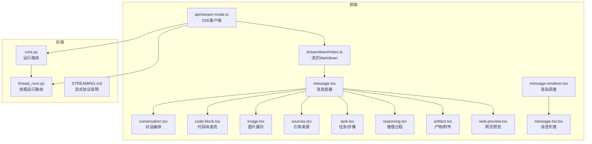
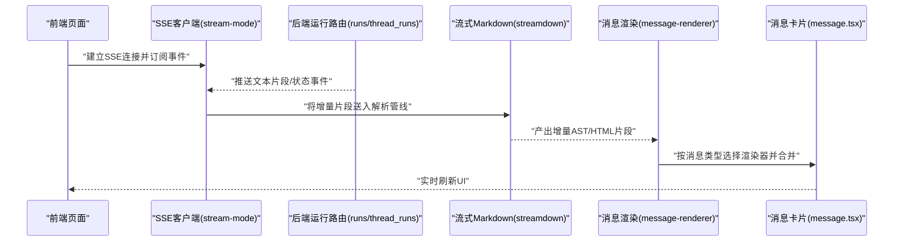
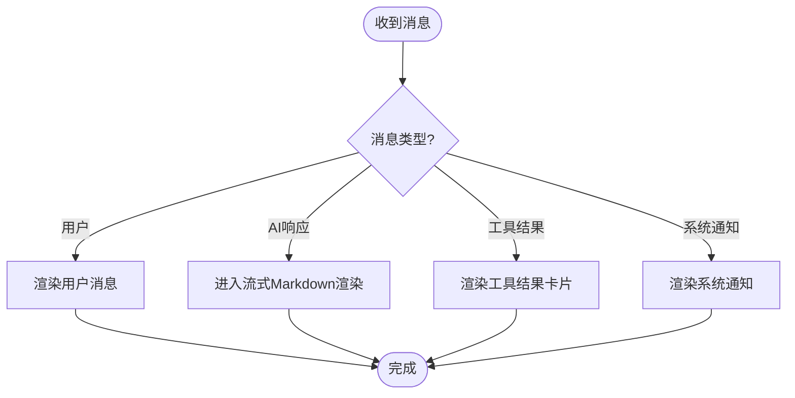
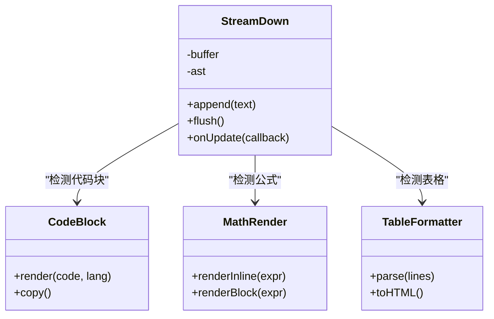
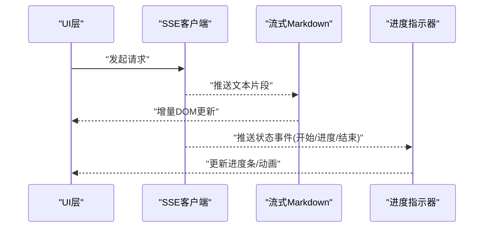
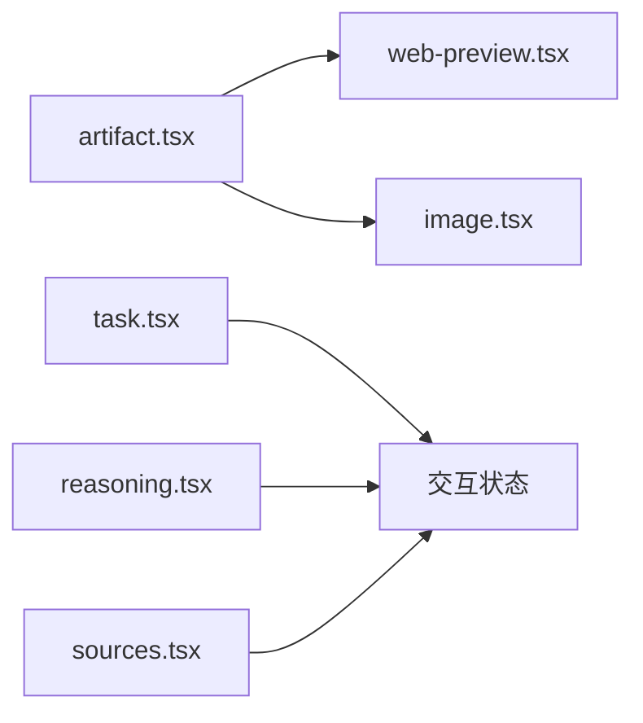
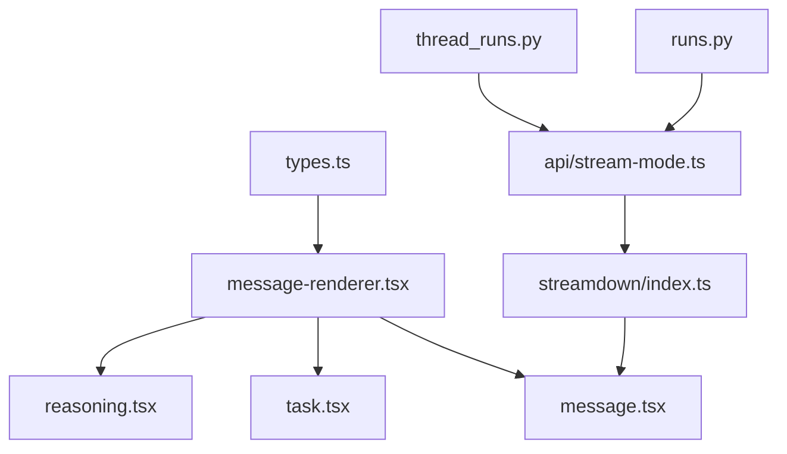

# 消息渲染系统

<cite>
**本文引用的文件**   
- [frontend/src/components/ai-elements/message.tsx](file://frontend/src/components/ai-elements/message.tsx)
- [frontend/src/components/ai-elements/code-block.tsx](file://frontend/src/components/ai-elements/code-block.tsx)
- [frontend/src/components/ai-elements/conversation.tsx](file://frontend/src/components/ai-elements/conversation.tsx)
- [frontend/src/components/ai-elements/artifact.tsx](file://frontend/src/components/ai-elements/artifact.tsx)
- [frontend/src/components/ai-elements/web-preview.tsx](file://frontend/src/components/ai-elements/web-preview.tsx)
- [frontend/src/components/ai-elements/image.tsx](file://frontend/src/components/ai-elements/image.tsx)
- [frontend/src/components/ai-elements/reasoning.tsx](file://frontend/src/components/ai-elements/reasoning.tsx)
- [frontend/src/components/ai-elements/sources.tsx](file://frontend/src/components/ai-elements/sources.tsx)
- [frontend/src/components/ai-elements/task.tsx](file://frontend/src/components/ai-elements/task.tsx)
- [frontend/src/components/ai-elements/checkpoint.tsx](file://frontend/src/components/ai-elements/checkpoint.tsx)
- [frontend/src/components/ai-elements/prompt-input.tsx](file://frontend/src/components/ai-elements/prompt-input.tsx)
- [frontend/src/components/workspace/messages/message-renderer.tsx](file://frontend/src/components/workspace/messages/message-renderer.tsx)
- [frontend/src/components/workspace/messages/message-list.tsx](file://frontend/src/components/workspace/messages/message-list.tsx)
- [frontend/src/components/workspace/streaming-indicator.tsx](file://frontend/src/components/workspace/streaming-indicator.tsx)
- [frontend/src/core/streamdown/index.ts](file://frontend/src/core/streamdown/index.ts)
- [frontend/src/core/messages/types.ts](file://frontend/src/core/messages/types.ts)
- [frontend/src/core/api/stream-mode.ts](file://frontend/src/core/api/stream-mode.ts)
- [backend/app/gateway/routers/runs.py](file://backend/app/gateway/routers/runs.py)
- [backend/app/gateway/routers/thread_runs.py](file://backend/app/gateway/routers/thread_runs.py)
- [backend/docs/STREAMING.md](file://backend/docs/STREAMING.md)
</cite>

## 目录
1. [简介](#简介)
2. [项目结构](#项目结构)
3. [核心组件](#核心组件)
4. [架构总览](#架构总览)
5. [详细组件分析](#详细组件分析)
6. [依赖关系分析](#依赖关系分析)
7. [性能考虑](#性能考虑)
8. [故障排查指南](#故障排查指南)
9. [结论](#结论)
10. [附录](#附录)

## 简介
本文件面向“消息渲染系统”，聚焦以下目标：
- 消息类型识别机制：用户消息、AI响应、工具调用结果、系统通知的区分与处理。
- 富文本解析引擎：Markdown渲染、代码块高亮、数学公式显示、表格格式化。
- 流式内容渲染：实时文本更新、进度指示器、增量加载优化。
- 复杂组件渲染：图表可视化、文件预览、交互式元素、多媒体展示。
- 扩展能力：自定义消息类型的接入方法与样式定制指南。

## 项目结构
前端采用 Next.js + React，消息渲染相关主要位于：
- ai-elements：通用消息卡片与子组件（消息容器、代码块、图片、来源、任务等）。
- workspace/messages：工作区消息列表与渲染编排。
- core/streamdown：流式 Markdown 渲染管线。
- core/messages/types：消息类型定义。
- core/api/stream-mode：SSE 流模式客户端封装。
后端提供 SSE 流式输出与运行状态事件，供前端消费。

图示来源
- [frontend/src/components/ai-elements/message.tsx](file://frontend/src/components/ai-elements/message.tsx)
- [frontend/src/components/ai-elements/conversation.tsx](file://frontend/src/components/ai-elements/conversation.tsx)
- [frontend/src/components/ai-elements/code-block.tsx](file://frontend/src/components/ai-elements/code-block.tsx)
- [frontend/src/components/ai-elements/image.tsx](file://frontend/src/components/ai-elements/image.tsx)
- [frontend/src/components/ai-elements/sources.tsx](file://frontend/src/components/ai-elements/sources.tsx)
- [frontend/src/components/ai-elements/task.tsx](file://frontend/src/components/ai-elements/task.tsx)
- [frontend/src/components/ai-elements/reasoning.tsx](file://frontend/src/components/ai-elements/reasoning.tsx)
- [frontend/src/components/ai-elements/artifact.tsx](file://frontend/src/components/ai-elements/artifact.tsx)
- [frontend/src/components/ai-elements/web-preview.tsx](file://frontend/src/components/ai-elements/web-preview.tsx)
- [frontend/src/components/workspace/messages/message-renderer.tsx](file://frontend/src/components/workspace/messages/message-renderer.tsx)
- [frontend/src/components/workspace/messages/message-list.tsx](file://frontend/src/components/workspace/messages/message-list.tsx)
- [frontend/src/core/streamdown/index.ts](file://frontend/src/core/streamdown/index.ts)
- [frontend/src/core/api/stream-mode.ts](file://frontend/src/core/api/stream-mode.ts)
- [backend/app/gateway/routers/runs.py](file://backend/app/gateway/routers/runs.py)
- [backend/app/gateway/routers/thread_runs.py](file://backend/app/gateway/routers/thread_runs.py)
- [backend/docs/STREAMING.md](file://backend/docs/STREAMING.md)

章节来源
- [frontend/src/components/ai-elements/message.tsx](file://frontend/src/components/ai-elements/message.tsx)
- [frontend/src/components/workspace/messages/message-renderer.tsx](file://frontend/src/components/workspace/messages/message-renderer.tsx)
- [frontend/src/core/streamdown/index.ts](file://frontend/src/core/streamdown/index.ts)
- [frontend/src/core/messages/types.ts](file://frontend/src/core/messages/types.ts)
- [frontend/src/core/api/stream-mode.ts](file://frontend/src/core/api/stream-mode.ts)
- [backend/app/gateway/routers/runs.py](file://backend/app/gateway/routers/runs.py)
- [backend/app/gateway/routers/thread_runs.py](file://backend/app/gateway/routers/thread_runs.py)
- [backend/docs/STREAMING.md](file://backend/docs/STREAMING.md)

## 核心组件
- 消息容器与类型分发
  - message.tsx：统一的消息卡片外壳，负责头像、时间戳、操作栏与内容区域挂载。
  - conversation.tsx：会话级编排，管理消息顺序、滚动、输入框集成。
  - message-renderer.tsx：根据消息类型选择具体渲染器（用户/AI/工具/系统），并组合子组件。
- 富文本与代码渲染
  - code-block.tsx：代码块高亮与复制按钮。
  - streamdown/index.ts：流式 Markdown 解析与增量渲染管线。
- 结构化数据与交互
  - sources.tsx：引用来源列表与跳转。
  - task.tsx：任务/步骤列表与状态。
  - reasoning.tsx：可折叠的推理过程展示。
  - artifact.tsx：产物/附件的通用容器。
  - web-preview.tsx：网页/文档在线预览。
  - image.tsx：图片展示与缩放。
- 流式与进度
  - streaming-indicator.tsx：流式输出时的动态指示器。
  - api/stream-mode.ts：SSE 连接、事件订阅与增量更新。

章节来源
- [frontend/src/components/ai-elements/message.tsx](file://frontend/src/components/ai-elements/message.tsx)
- [frontend/src/components/ai-elements/conversation.tsx](file://frontend/src/components/ai-elements/conversation.tsx)
- [frontend/src/components/workspace/messages/message-renderer.tsx](file://frontend/src/components/workspace/messages/message-renderer.tsx)
- [frontend/src/components/ai-elements/code-block.tsx](file://frontend/src/components/ai-elements/code-block.tsx)
- [frontend/src/core/streamdown/index.ts](file://frontend/src/core/streamdown/index.ts)
- [frontend/src/components/ai-elements/sources.tsx](file://frontend/src/components/ai-elements/sources.tsx)
- [frontend/src/components/ai-elements/task.tsx](file://frontend/src/components/ai-elements/task.tsx)
- [frontend/src/components/ai-elements/reasoning.tsx](file://frontend/src/components/ai-elements/reasoning.tsx)
- [frontend/src/components/ai-elements/artifact.tsx](file://frontend/src/components/ai-elements/artifact.tsx)
- [frontend/src/components/ai-elements/web-preview.tsx](file://frontend/src/components/ai-elements/web-preview.tsx)
- [frontend/src/components/ai-elements/image.tsx](file://frontend/src/components/ai-elements/image.tsx)
- [frontend/src/components/workspace/streaming-indicator.tsx](file://frontend/src/components/workspace/streaming-indicator.tsx)
- [frontend/src/core/api/stream-mode.ts](file://frontend/src/core/api/stream-mode.ts)

## 架构总览
消息渲染系统由“后端流式事件”驱动，前端通过 SSE 接收增量片段，经流式 Markdown 管线转换为 DOM，再由消息容器与渲染器组装为最终 UI。

图示来源
- [frontend/src/core/api/stream-mode.ts](file://frontend/src/core/api/stream-mode.ts)
- [backend/app/gateway/routers/runs.py](file://backend/app/gateway/routers/runs.py)
- [backend/app/gateway/routers/thread_runs.py](file://backend/app/gateway/routers/thread_runs.py)
- [frontend/src/core/streamdown/index.ts](file://frontend/src/core/streamdown/index.ts)
- [frontend/src/components/workspace/messages/message-renderer.tsx](file://frontend/src/components/workspace/messages/message-renderer.tsx)
- [frontend/src/components/ai-elements/message.tsx](file://frontend/src/components/ai-elements/message.tsx)

## 详细组件分析

### 消息类型识别与分发
- 类型来源
  - 消息类型定义集中于 types.ts，包含用户、AI、工具调用、系统通知等字段与枚举。
- 分发策略
  - message-renderer.tsx 依据消息类型字段进行分支渲染：
    - 用户消息：仅展示文本与附件。
    - AI响应：走流式 Markdown 渲染，支持代码块、表格、公式等。
    - 工具调用结果：以结构化卡片呈现（名称、参数、输出摘要、错误信息）。
    - 系统通知：以轻量提示或状态条展示。
- 扩展点
  - 新增自定义类型时，在 renderer 中增加分支，并在 types.ts 中声明新类型与字段。

图示来源
- [frontend/src/core/messages/types.ts](file://frontend/src/core/messages/types.ts)
- [frontend/src/components/workspace/messages/message-renderer.tsx](file://frontend/src/components/workspace/messages/message-renderer.tsx)

章节来源
- [frontend/src/core/messages/types.ts](file://frontend/src/core/messages/types.ts)
- [frontend/src/components/workspace/messages/message-renderer.tsx](file://frontend/src/components/workspace/messages/message-renderer.tsx)

### 富文本解析引擎
- 流式 Markdown 管线
  - streamdown/index.ts 维护一个增量解析器，逐段接收文本，逐步构建 AST/HTML，避免全量重算。
- 代码块高亮
  - code-block.tsx 负责语法高亮与复制功能；流式模式下对未闭合的代码块做安全截断与占位。
- 数学公式
  - 在 Markdown 解析阶段识别行内/块级公式标记，交由数学渲染库（如 KaTeX/MathJax）渲染；流式模式下延迟到完整段落后再渲染，避免抖动。
- 表格格式化
  - 表格在完整行到达后渲染；若出现跨段落的表格片段，解析器会缓冲直至闭合。
- 性能要点
  - 增量拼接、防抖重排、虚拟滚动（长文档）与懒加载图片。

图示来源
- [frontend/src/core/streamdown/index.ts](file://frontend/src/core/streamdown/index.ts)
- [frontend/src/components/ai-elements/code-block.tsx](file://frontend/src/components/ai-elements/code-block.tsx)

章节来源
- [frontend/src/core/streamdown/index.ts](file://frontend/src/core/streamdown/index.ts)
- [frontend/src/components/ai-elements/code-block.tsx](file://frontend/src/components/ai-elements/code-block.tsx)

### 流式内容渲染
- SSE 客户端
  - api/stream-mode.ts 负责建立连接、心跳、错误重试、事件去重与增量合并。
- 实时文本更新
  - 每次收到文本片段即调用 streamdown.append，触发增量渲染回调，最小化重绘。
- 进度指示器
  - streaming-indicator.tsx 监听运行状态事件（开始、进行中、结束、错误），展示动画与百分比。
- 增量加载优化
  - 大文档分页渲染、图片懒加载、代码块按需高亮、表格延迟渲染。

图示来源
- [frontend/src/core/api/stream-mode.ts](file://frontend/src/core/api/stream-mode.ts)
- [frontend/src/core/streamdown/index.ts](file://frontend/src/core/streamdown/index.ts)
- [frontend/src/components/workspace/streaming-indicator.tsx](file://frontend/src/components/workspace/streaming-indicator.tsx)

章节来源
- [frontend/src/core/api/stream-mode.ts](file://frontend/src/core/api/stream-mode.ts)
- [frontend/src/components/workspace/streaming-indicator.tsx](file://frontend/src/components/workspace/streaming-indicator.tsx)

### 复杂组件渲染
- 图表可视化
  - 通过 artifact.tsx 承载图表产物（如 SVG/PNG/JSON），结合 web-preview.tsx 打开在线预览或本地查看器。
- 文件预览
  - web-preview.tsx 支持 PDF/HTML/Markdown 在线预览；图片由 image.tsx 提供缩略图与放大。
- 交互式元素
  - task.tsx 支持步骤展开/收起、状态切换；reasoning.tsx 支持折叠推理链；sources.tsx 支持来源跳转与摘要。
- 多媒体展示
  - image.tsx 负责图片懒加载、占位骨架屏与错误回退。

图示来源
- [frontend/src/components/ai-elements/artifact.tsx](file://frontend/src/components/ai-elements/artifact.tsx)
- [frontend/src/components/ai-elements/web-preview.tsx](file://frontend/src/components/ai-elements/web-preview.tsx)
- [frontend/src/components/ai-elements/image.tsx](file://frontend/src/components/ai-elements/image.tsx)
- [frontend/src/components/ai-elements/task.tsx](file://frontend/src/components/ai-elements/task.tsx)
- [frontend/src/components/ai-elements/reasoning.tsx](file://frontend/src/components/ai-elements/reasoning.tsx)
- [frontend/src/components/ai-elements/sources.tsx](file://frontend/src/components/ai-elements/sources.tsx)

章节来源
- [frontend/src/components/ai-elements/artifact.tsx](file://frontend/src/components/ai-elements/artifact.tsx)
- [frontend/src/components/ai-elements/web-preview.tsx](file://frontend/src/components/ai-elements/web-preview.tsx)
- [frontend/src/components/ai-elements/image.tsx](file://frontend/src/components/ai-elements/image.tsx)
- [frontend/src/components/ai-elements/task.tsx](file://frontend/src/components/ai-elements/task.tsx)
- [frontend/src/components/ai-elements/reasoning.tsx](file://frontend/src/components/ai-elements/reasoning.tsx)
- [frontend/src/components/ai-elements/sources.tsx](file://frontend/src/components/ai-elements/sources.tsx)

### 自定义消息类型与样式定制
- 扩展自定义类型
  - 在 types.ts 中新增类型枚举与字段。
  - 在 message-renderer.tsx 中添加分支逻辑，返回对应组件。
  - 如需流式，确保组件能接受增量更新回调。
- 样式定制
  - 全局样式位于 styles/globals.css，可按需覆盖主题变量。
  - 组件级样式建议通过 CSS Modules 或 Tailwind 类名控制，避免侵入共享组件。
- 行为定制
  - 通过 conversation.tsx 提供的钩子注入自定义操作（如导出、分享、收藏）。
  - 使用 prompt-input.tsx 的扩展点添加快捷命令或模板插入。

章节来源
- [frontend/src/core/messages/types.ts](file://frontend/src/core/messages/types.ts)
- [frontend/src/components/workspace/messages/message-renderer.tsx](file://frontend/src/components/workspace/messages/message-renderer.tsx)
- [frontend/src/components/ai-elements/conversation.tsx](file://frontend/src/components/ai-elements/conversation.tsx)
- [frontend/src/components/ai-elements/prompt-input.tsx](file://frontend/src/components/ai-elements/prompt-input.tsx)

## 依赖关系分析
- 模块耦合
  - message-renderer.tsx 强依赖 types.ts 的类型定义；弱依赖各子组件，便于替换实现。
  - streamdown/index.ts 被所有需要富文本渲染的组件复用，形成单一事实源。
  - api/stream-mode.ts 与后端 runs.py/thread_runs.py 通过 SSE 协议解耦。
- 外部依赖
  - 语法高亮、数学公式、表格解析等第三方库在各自组件中引入，降低核心耦合。
- 潜在循环
  - 当前结构无直接循环依赖；新增组件时应避免反向导入 types 以外的上层模块。

图示来源
- [frontend/src/core/messages/types.ts](file://frontend/src/core/messages/types.ts)
- [frontend/src/components/workspace/messages/message-renderer.tsx](file://frontend/src/components/workspace/messages/message-renderer.tsx)
- [frontend/src/components/ai-elements/message.tsx](file://frontend/src/components/ai-elements/message.tsx)
- [frontend/src/components/ai-elements/task.tsx](file://frontend/src/components/ai-elements/task.tsx)
- [frontend/src/components/ai-elements/reasoning.tsx](file://frontend/src/components/ai-elements/reasoning.tsx)
- [frontend/src/core/streamdown/index.ts](file://frontend/src/core/streamdown/index.ts)
- [frontend/src/core/api/stream-mode.ts](file://frontend/src/core/api/stream-mode.ts)
- [backend/app/gateway/routers/runs.py](file://backend/app/gateway/routers/runs.py)
- [backend/app/gateway/routers/thread_runs.py](file://backend/app/gateway/routers/thread_runs.py)

章节来源
- [frontend/src/core/messages/types.ts](file://frontend/src/core/messages/types.ts)
- [frontend/src/components/workspace/messages/message-renderer.tsx](file://frontend/src/components/workspace/messages/message-renderer.tsx)
- [frontend/src/core/streamdown/index.ts](file://frontend/src/core/streamdown/index.ts)
- [frontend/src/core/api/stream-mode.ts](file://frontend/src/core/api/stream-mode.ts)
- [backend/app/gateway/routers/runs.py](file://backend/app/gateway/routers/runs.py)
- [backend/app/gateway/routers/thread_runs.py](file://backend/app/gateway/routers/thread_runs.py)

## 性能考虑
- 增量渲染
  - 使用 streamdown 的 append 接口，避免整段重算；对长文档启用分页与虚拟滚动。
- 资源懒加载
  - 图片与嵌入媒体采用懒加载与占位骨架屏，减少首屏压力。
- 高亮与公式
  - 代码块与公式仅在可见区域内渲染，必要时延迟至用户交互触发。
- 网络与重试
  - SSE 客户端具备自动重试与断线重连；对大响应分片传输，避免阻塞主线程。
- 内存与清理
  - 组件卸载时断开 SSE 连接、释放解析器缓冲区，防止内存泄漏。

[本节为通用指导，不直接分析具体文件]

## 故障排查指南
- 流式中断
  - 检查 SSE 连接状态与后端日志；确认 runs.py/thread_runs.py 的事件推送是否正常。
  - 参考 STREAMING.md 中的协议约定，核对事件格式与字段。
- 渲染异常
  - 代码块未闭合导致高亮失败：检查 streamdown 的分片边界与占位策略。
  - 公式/表格错位：确认是否等待完整段落再渲染。
- 类型缺失
  - 自定义类型未注册：确认 types.ts 与 message-renderer.tsx 分支一致。
- 样式错乱
  - 全局样式冲突：检查 globals.css 与组件局部样式优先级。

章节来源
- [backend/docs/STREAMING.md](file://backend/docs/STREAMING.md)
- [backend/app/gateway/routers/runs.py](file://backend/app/gateway/routers/runs.py)
- [backend/app/gateway/routers/thread_runs.py](file://backend/app/gateway/routers/thread_runs.py)
- [frontend/src/core/streamdown/index.ts](file://frontend/src/core/streamdown/index.ts)
- [frontend/src/core/messages/types.ts](file://frontend/src/core/messages/types.ts)
- [frontend/src/components/workspace/messages/message-renderer.tsx](file://frontend/src/components/workspace/messages/message-renderer.tsx)

## 结论
本消息渲染系统以“类型识别 + 流式 Markdown 管线 + 模块化组件”为核心，实现了从后端 SSE 到前端 UI 的高效渲染链路。通过清晰的类型定义与渲染分发，系统具备良好的可扩展性；配合增量渲染与资源懒加载，兼顾了性能与体验。未来可在图表可视化、多模态内容与国际化方面继续增强。

[本节为总结性内容，不直接分析具体文件]

## 附录
- 关键入口与文件路径
  - 消息容器：[message.tsx](file://frontend/src/components/ai-elements/message.tsx)
  - 渲染调度：[message-renderer.tsx](file://frontend/src/components/workspace/messages/message-renderer.tsx)
  - 流式 Markdown：[streamdown/index.ts](file://frontend/src/core/streamdown/index.ts)
  - SSE 客户端：[api/stream-mode.ts](file://frontend/src/core/api/stream-mode.ts)
  - 后端运行路由：[runs.py](file://backend/app/gateway/routers/runs.py)、[thread_runs.py](file://backend/app/gateway/routers/thread_runs.py)
  - 流式协议说明：[STREAMING.md](file://backend/docs/STREAMING.md)

[本节为索引性内容，不直接分析具体文件]