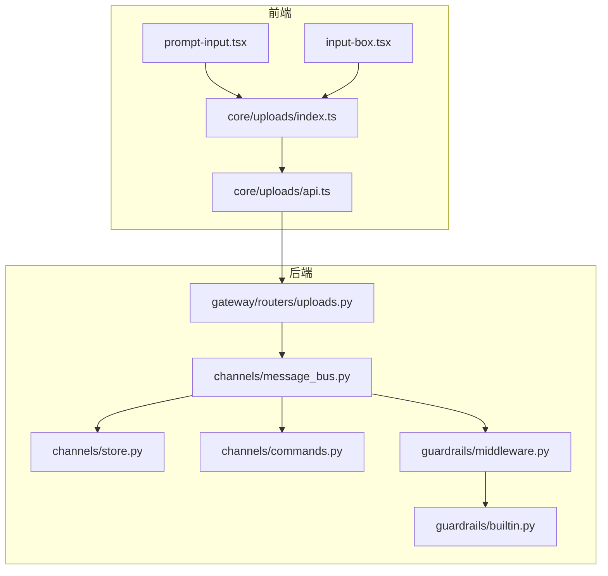
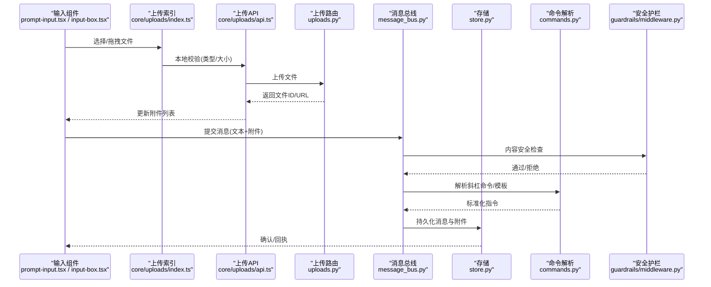
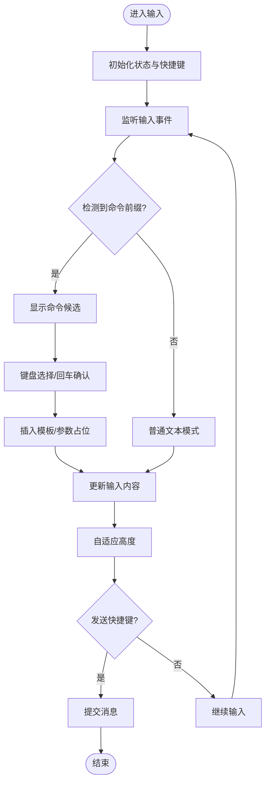
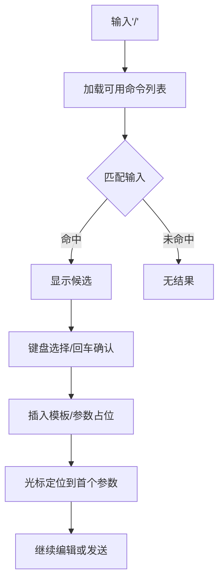
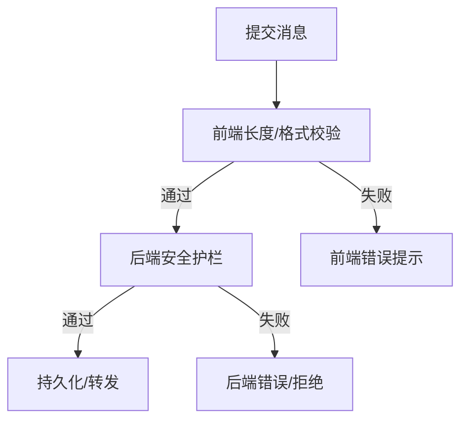
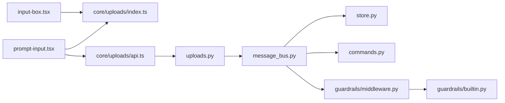

# 消息输入功能

<cite>
**本文引用的文件**   
- [frontend/src/components/ai-elements/prompt-input.tsx](file://frontend/src/components/ai-elements/prompt-input.tsx)
- [frontend/src/components/workspace/input-box.tsx](file://frontend/src/components/workspace/input-box.tsx)
- [frontend/src/core/uploads/index.ts](file://frontend/src/core/uploads/index.ts)
- [frontend/src/core/uploads/api.ts](file://frontend/src/core/uploads/api.ts)
- [backend/app/gateway/routers/uploads.py](file://backend/app/gateway/routers/uploads.py)
- [backend/app/channels/message_bus.py](file://backend/app/channels/message_bus.py)
- [backend/app/channels/store.py](file://backend/app/channels/store.py)
- [backend/app/channels/commands.py](file://backend/app/channels/commands.py)
- [backend/app/harness/deerflow/guardrails/middleware.py](file://backend/app/harness/deerflow/guardrails/middleware.py)
- [backend/app/harness/deerflow/guardrails/builtin.py](file://backend/app/harness/deerflow/guardrails/builtin.py)
- [backend/tests/test_channel_file_attachments.py](file://backend/tests/test_channel_file附件.py)
- [frontend/tests/unit/core/uploads/file-validation.test.ts](file://frontend/tests/unit/core/uploads/file-validation.test.ts)
- [frontend/tests/unit/core/uploads/prompt-input-files.test.ts](file://frontend/tests/unit/core/uploads/prompt-input-files.test.ts)
</cite>

## 目录
1. [简介](#简介)
2. [项目结构](#项目结构)
3. [核心组件](#核心组件)
4. [架构总览](#架构总览)
5. [详细组件分析](#详细组件分析)
6. [依赖关系分析](#依赖关系分析)
7. [性能考虑](#性能考虑)
8. [故障排查指南](#故障排查指南)
9. [结论](#结论)
10. [附录](#附录)

## 简介
本文件聚焦“消息输入”能力，覆盖以下方面：
- 文本编辑器实现：多行输入、自动完成、语法高亮与快捷键支持
- 文件附件：拖拽上传、预览、格式验证与大小限制
- 快捷命令系统：斜杠命令、模板插入与参数配置
- 智能输入辅助：历史建议、上下文感知与自动补全
- 输入验证机制：内容安全检查、长度限制与格式校验
- 扩展与主题定制：自定义输入组件与样式主题

## 项目结构
前端负责输入交互与本地校验，后端提供上传路由、消息总线与存储、以及安全护栏。关键路径如下：
- 前端输入组件：prompt-input.tsx、input-box.tsx
- 前端上传模块：core/uploads/index.ts、api.ts
- 后端上传路由：gateway/routers/uploads.py
- 后端消息通道：channels/message_bus.py、channels/store.py
- 后端命令解析：channels/commands.py
- 安全护栏：guardrails/middleware.py、guardrails/builtin.py
- 测试用例：后端附件测试、前端上传与输入文件测试



图表来源
- [frontend/src/components/ai-elements/prompt-input.tsx](file://frontend/src/components/ai-elements/prompt-input.tsx)
- [frontend/src/components/workspace/input-box.tsx](file://frontend/src/components/workspace/input-box.tsx)
- [frontend/src/core/uploads/index.ts](file://frontend/src/core/uploads/index.ts)
- [frontend/src/core/uploads/api.ts](file://frontend/src/core/uploads/api.ts)
- [backend/app/gateway/routers/uploads.py](file://backend/app/gateway/routers/uploads.py)
- [backend/app/channels/message_bus.py](file://backend/app/channels/message_bus.py)
- [backend/app/channels/store.py](file://backend/app/channels/store.py)
- [backend/app/channels/commands.py](file://backend/app/channels/commands.py)
- [backend/app/harness/deerflow/guardrails/middleware.py](file://backend/app/harness/deerflow/guardrails/middleware.py)
- [backend/app/harness/deerflow/guardrails/builtin.py](file://backend/app/harness/deerflow/guardrails/builtin.py)

章节来源
- [frontend/src/components/ai-elements/prompt-input.tsx](file://frontend/src/components/ai-elements/prompt-input.tsx)
- [frontend/src/components/workspace/input-box.tsx](file://frontend/src/components/workspace/input-box.tsx)
- [frontend/src/core/uploads/index.ts](file://frontend/src/core/uploads/index.ts)
- [frontend/src/core/uploads/api.ts](file://frontend/src/core/uploads/api.ts)
- [backend/app/gateway/routers/uploads.py](file://backend/app/gateway/routers/uploads.py)
- [backend/app/channels/message_bus.py](file://backend/app/channels/message_bus.py)
- [backend/app/channels/store.py](file://backend/app/channels/store.py)
- [backend/app/channels/commands.py](file://backend/app/channels/commands.py)
- [backend/app/harness/deerflow/guardrails/middleware.py](file://backend/app/harness/deerflow/guardrails/middleware.py)
- [backend/app/harness/deerflow/guardrails/builtin.py](file://backend/app/harness/deerflow/guardrails/builtin.py)

## 核心组件
- 文本编辑器（prompt-input.tsx）
  - 多行输入与自适应高度
  - 快捷键绑定（发送、换行等）
  - 与自动完成/命令面板的集成点
- 输入容器（input-box.tsx）
  - 组合输入框、附件区、发送按钮
  - 统一事件分发与状态管理
- 上传模块（core/uploads/index.ts, api.ts）
  - 本地校验（类型、大小）
  - 拖拽处理与进度反馈
  - 调用后端上传接口并返回可引用标识
- 后端上传路由（uploads.py）
  - 接收文件流、持久化、生成访问地址
- 消息总线（message_bus.py）
  - 将用户输入与附件打包为消息事件
- 命令解析（commands.py）
  - 识别斜杠命令、参数提取与模板注入
- 安全护栏（guardrails/middleware.py, builtin.py）
  - 内容安全检查、长度与格式校验、拦截策略

章节来源
- [frontend/src/components/ai-elements/prompt-input.tsx](file://frontend/src/components/ai-elements/prompt-input.tsx)
- [frontend/src/components/workspace/input-box.tsx](file://frontend/src/components/workspace/input-box.tsx)
- [frontend/src/core/uploads/index.ts](file://frontend/src/core/uploads/index.ts)
- [frontend/src/core/uploads/api.ts](file://frontend/src/core/uploads/api.ts)
- [backend/app/gateway/routers/uploads.py](file://backend/app/gateway/routers/uploads.py)
- [backend/app/channels/message_bus.py](file://backend/app/channels/message_bus.py)
- [backend/app/channels/commands.py](file://backend/app/channels/commands.py)
- [backend/app/harness/deerflow/guardrails/middleware.py](file://backend/app/harness/deerflow/guardrails/middleware.py)
- [backend/app/harness/deerflow/guardrails/builtin.py](file://backend/app/harness/deerflow/guardrails/builtin.py)

## 架构总览
消息从前端输入到后端落库的关键流程：



图表来源
- [frontend/src/components/ai-elements/prompt-input.tsx](file://frontend/src/components/ai-elements/prompt-input.tsx)
- [frontend/src/components/workspace/input-box.tsx](file://frontend/src/components/workspace/input-box.tsx)
- [frontend/src/core/uploads/index.ts](file://frontend/src/core/uploads/index.ts)
- [frontend/src/core/uploads/api.ts](file://frontend/src/core/uploads/api.ts)
- [backend/app/gateway/routers/uploads.py](file://backend/app/gateway/routers/uploads.py)
- [backend/app/channels/message_bus.py](file://backend/app/channels/message_bus.py)
- [backend/app/channels/store.py](file://backend/app/channels/store.py)
- [backend/app/channels/commands.py](file://backend/app/channels/commands.py)
- [backend/app/harness/deerflow/guardrails/middleware.py](file://backend/app/harness/deerflow/guardrails/middleware.py)

## 详细组件分析

### 文本编辑器（prompt-input.tsx）
- 多行输入与自适应高度：根据内容动态调整输入区域高度，提升长文编辑体验
- 快捷键支持：
  - 回车发送（可配置是否需 Shift 参与）
  - Tab/Shift+Tab 缩进或触发命令补全
  - Ctrl/Cmd + Enter 快速发送
- 自动完成与命令面板：
  - 监听输入前缀（如“/”）触发命令候选
  - 与全局命令面板联动，支持模糊匹配与键盘导航
- 语法高亮：
  - 在代码块或特定标记处启用高亮渲染
  - 与 Markdown/代码片段工具链集成
- 错误与边界：
  - 超长文本截断提示
  - IME 输入法兼容处理



图表来源
- [frontend/src/components/ai-elements/prompt-input.tsx](file://frontend/src/components/ai-elements/prompt-input.tsx)

章节来源
- [frontend/src/components/ai-elements/prompt-input.tsx](file://frontend/src/components/ai-elements/prompt-input.tsx)

### 输入容器（input-box.tsx）
- 组合输入框、附件区、发送按钮，统一事件分发
- 与上传模块对接，展示已选文件与删除操作
- 与全局快捷键、无障碍属性集成

章节来源
- [frontend/src/components/workspace/input-box.tsx](file://frontend/src/components/workspace/input-box.tsx)

### 文件附件（拖拽上传、预览、验证、大小限制）
- 拖拽上传：
  - 支持拖入文件至输入区域，实时反馈
  - 多文件批量处理与去重
- 本地校验：
  - 类型白名单/黑名单
  - 单文件大小上限
  - 总大小限制
- 预览：
  - 图片/文档缩略图或图标
  - 点击放大预览
- 上传流程：
  - 调用 core/uploads/api.ts 发起上传
  - 成功后在输入区显示附件卡片，附带文件名与大小
  - 失败重试与错误提示

```mermaid
sequenceDiagram
participant User as "用户"
participant Box as "input-box.tsx"
participant UpIdx as "core/uploads/index.ts"
participant UpApi as "core/uploads/api.ts"
participant Router as "uploads.py"
User->>Box : 拖拽文件
Box->>UpIdx : 触发拖拽处理
UpIdx->>UpIdx : 本地校验(类型/大小)
UpIdx->>UpApi : 上传文件
UpApi->>Router : POST /uploads
Router-->>UpApi : 返回{file_id, url}
UpApi-->>UpIdx : 成功回调
UpIdx-->>Box : 更新附件列表
Box-->>User : 显示预览与删除入口
```

图表来源
- [frontend/src/components/workspace/input-box.tsx](file://frontend/src/components/workspace/input-box.tsx)
- [frontend/src/core/uploads/index.ts](file://frontend/src/core/uploads/index.ts)
- [frontend/src/core/uploads/api.ts](file://frontend/src/core/uploads/api.ts)
- [backend/app/gateway/routers/uploads.py](file://backend/app/gateway/routers/uploads.py)

章节来源
- [frontend/src/core/uploads/index.ts](file://frontend/src/core/uploads/index.ts)
- [frontend/src/core/uploads/api.ts](file://frontend/src/core/uploads/api.ts)
- [backend/app/gateway/routers/uploads.py](file://backend/app/gateway/routers/uploads.py)
- [frontend/tests/unit/core/uploads/file-validation.test.ts](file://frontend/tests/unit/core/uploads/file-validation.test.ts)
- [frontend/tests/unit/core/uploads/prompt-input-files.test.ts](file://frontend/tests/unit/core/uploads/prompt-input-files.test.ts)
- [backend/tests/test_channel_file_attachments.py](file://backend/tests/test_channel_file附件.py)

### 快捷命令系统（斜杠命令、模板插入、参数配置）
- 斜杠命令：
  - 以“/”开头触发命令候选
  - 支持模糊搜索与键盘导航
- 模板插入：
  - 选择命令后插入预设模板
  - 支持参数占位符与二次编辑
- 参数配置：
  - 命令定义包含参数描述与默认值
  - 可在输入时进行校验与提示



图表来源
- [frontend/src/components/ai-elements/prompt-input.tsx](file://frontend/src/components/ai-elements/prompt-input.tsx)
- [backend/app/channels/commands.py](file://backend/app/channels/commands.py)

章节来源
- [backend/app/channels/commands.py](file://backend/app/channels/commands.py)
- [frontend/src/components/ai-elements/prompt-input.tsx](file://frontend/src/components/ai-elements/prompt-input.tsx)

### 智能输入辅助（历史建议、上下文感知、自动补全）
- 历史建议：
  - 基于最近输入与常用命令推荐
- 上下文感知：
  - 根据当前会话/线程上下文过滤命令与补全项
- 自动补全：
  - 词级/命令级补全，支持 Tab 接受

章节来源
- [frontend/src/components/ai-elements/prompt-input.tsx](file://frontend/src/components/ai-elements/prompt-input.tsx)

### 输入验证机制（内容安全、长度限制、格式校验）
- 内容安全检查：
  - 后端安全护栏对消息内容进行扫描与拦截
- 长度限制：
  - 前端与后端双重限制，超限提示
- 格式校验：
  - 针对特定命令的参数格式进行校验
  - 上传文件的类型与大小校验



图表来源
- [backend/app/harness/deerflow/guardrails/middleware.py](file://backend/app/harness/deerflow/guardrails/middleware.py)
- [backend/app/harness/deerflow/guardrails/builtin.py](file://backend/app/harness/deerflow/guardrails/builtin.py)

章节来源
- [backend/app/harness/deerflow/guardrails/middleware.py](file://backend/app/harness/deerflow/guardrails/middleware.py)
- [backend/app/harness/deerflow/guardrails/builtin.py](file://backend/app/harness/deerflow/guardrails/builtin.py)

### 扩展与主题定制
- 自定义输入组件：
  - 复用 input-box.tsx 的组合模式，替换 prompt-input.tsx 的实现
  - 通过 props 注入命令源、补全逻辑与快捷键映射
- 主题定制：
  - 使用全局主题提供者与 CSS 变量覆盖
  - 针对输入框、附件卡片、命令面板进行样式覆盖

章节来源
- [frontend/src/components/workspace/input-box.tsx](file://frontend/src/components/workspace/input-box.tsx)
- [frontend/src/components/ai-elements/prompt-input.tsx](file://frontend/src/components/ai-elements/prompt-input.tsx)

## 依赖关系分析
- 前端
  - prompt-input.tsx 依赖 upload index/api 与命令面板
  - input-box.tsx 聚合上传与输入行为
- 后端
  - uploads.py 提供文件上传 API
  - message_bus.py 编排消息生命周期
  - commands.py 解析斜杠命令
  - guardrails 中间件与内置规则执行安全检查



图表来源
- [frontend/src/components/ai-elements/prompt-input.tsx](file://frontend/src/components/ai-elements/prompt-input.tsx)
- [frontend/src/components/workspace/input-box.tsx](file://frontend/src/components/workspace/input-box.tsx)
- [frontend/src/core/uploads/index.ts](file://frontend/src/core/uploads/index.ts)
- [frontend/src/core/uploads/api.ts](file://frontend/src/core/uploads/api.ts)
- [backend/app/gateway/routers/uploads.py](file://backend/app/gateway/routers/uploads.py)
- [backend/app/channels/message_bus.py](file://backend/app/channels/message_bus.py)
- [backend/app/channels/store.py](file://backend/app/channels/store.py)
- [backend/app/channels/commands.py](file://backend/app/channels/commands.py)
- [backend/app/harness/deerflow/guardrails/middleware.py](file://backend/app/harness/deerflow/guardrails/middleware.py)
- [backend/app/harness/deerflow/guardrails/builtin.py](file://backend/app/harness/deerflow/guardrails/builtin.py)

章节来源
- [frontend/src/components/ai-elements/prompt-input.tsx](file://frontend/src/components/ai-elements/prompt-input.tsx)
- [frontend/src/components/workspace/input-box.tsx](file://frontend/src/components/workspace/input-box.tsx)
- [frontend/src/core/uploads/index.ts](file://frontend/src/core/uploads/index.ts)
- [frontend/src/core/uploads/api.ts](file://frontend/src/core/uploads/api.ts)
- [backend/app/gateway/routers/uploads.py](file://backend/app/gateway/routers/uploads.py)
- [backend/app/channels/message_bus.py](file://backend/app/channels/message_bus.py)
- [backend/app/channels/store.py](file://backend/app/channels/store.py)
- [backend/app/channels/commands.py](file://backend/app/channels/commands.py)
- [backend/app/harness/deerflow/guardrails/middleware.py](file://backend/app/harness/deerflow/guardrails/middleware.py)
- [backend/app/harness/deerflow/guardrails/builtin.py](file://backend/app/harness/deerflow/guardrails/builtin.py)

## 性能考虑
- 输入响应性
  - 防抖/节流命令候选与补全计算
  - 大文本分片渲染与虚拟滚动（如需）
- 上传性能
  - 分片上传与并发控制
  - 压缩与转码（图片/文档）
- 内存占用
  - 及时释放预览对象 URL
  - 限制同时在线附件数量

[本节为通用指导，不直接分析具体文件]

## 故障排查指南
- 上传失败
  - 检查本地校验（类型/大小）与后端路由返回码
  - 查看网络请求与跨域配置
- 命令不生效
  - 确认命令前缀与候选列表加载
  - 检查命令参数校验与模板插值
- 内容被拦截
  - 查看安全护栏日志与规则命中详情
  - 调整长度限制与敏感词策略
- 附件无法预览
  - 确认文件类型与 MIME 映射
  - 检查预览资源访问权限

章节来源
- [backend/app/gateway/routers/uploads.py](file://backend/app/gateway/routers/uploads.py)
- [backend/app/harness/deerflow/guardrails/middleware.py](file://backend/app/harness/deerflow/guardrails/middleware.py)
- [backend/app/harness/deerflow/guardrails/builtin.py](file://backend/app/harness/deerflow/guardrails/builtin.py)
- [frontend/tests/unit/core/uploads/file-validation.test.ts](file://frontend/tests/unit/core/uploads/file-validation.test.ts)
- [frontend/tests/unit/core/uploads/prompt-input-files.test.ts](file://frontend/tests/unit/core/uploads/prompt-input-files.test.ts)
- [backend/tests/test_channel_file_attachments.py](file://backend/tests/test_channel_file附件.py)

## 结论
消息输入功能在前端通过模块化组件与上传能力，结合后端的上传路由、消息总线、命令解析与安全护栏，形成端到端的健壮输入链路。通过可扩展的命令系统与智能辅助，显著提升输入效率；通过完善的验证与主题定制，兼顾安全性与个性化需求。

[本节为总结，不直接分析具体文件]

## 附录
- 相关测试
  - 前端上传与输入文件测试：file-validation.test.ts、prompt-input-files.test.ts
  - 后端附件通道测试：test_channel_file_attachments.py

章节来源
- [frontend/tests/unit/core/uploads/file-validation.test.ts](file://frontend/tests/unit/core/uploads/file-validation.test.ts)
- [frontend/tests/unit/core/uploads/prompt-input-files.test.ts](file://frontend/tests/unit/core/uploads/prompt-input-files.test.ts)
- [backend/tests/test_channel_file_attachments.py](file://backend/tests/test_channel_file附件.py)