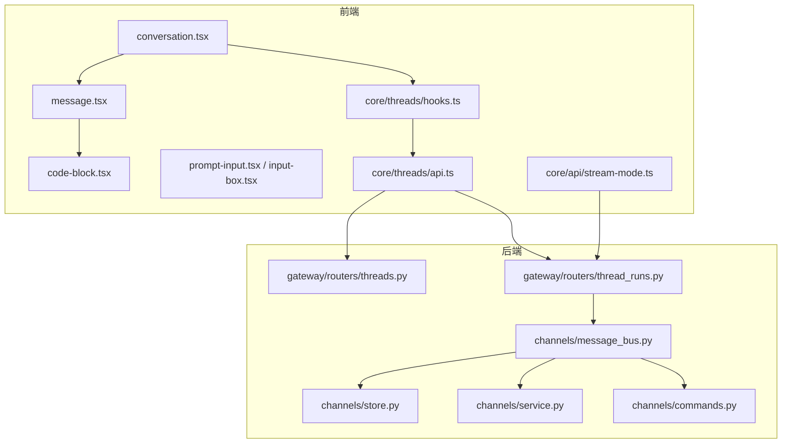
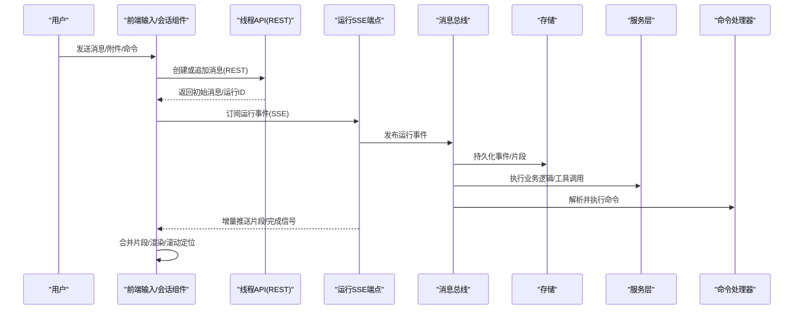
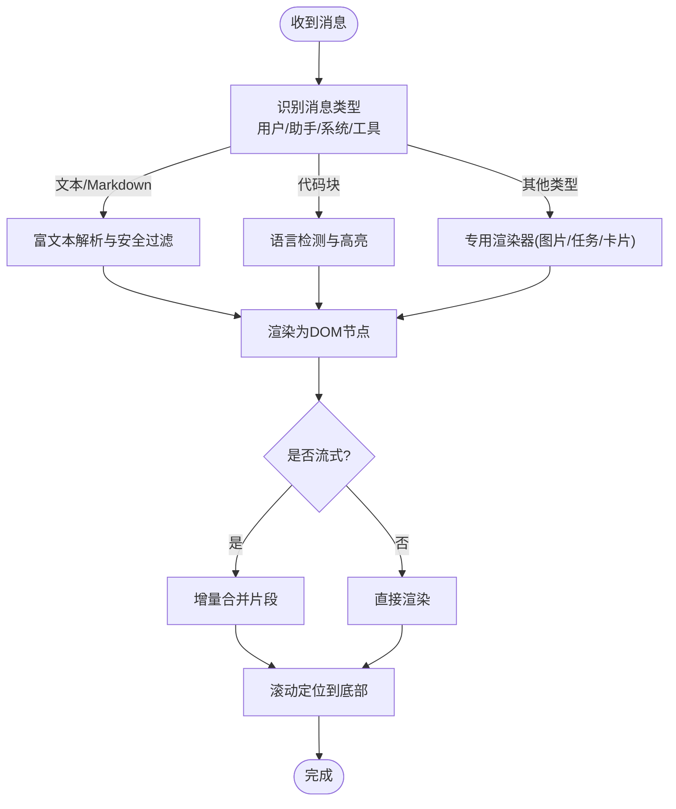
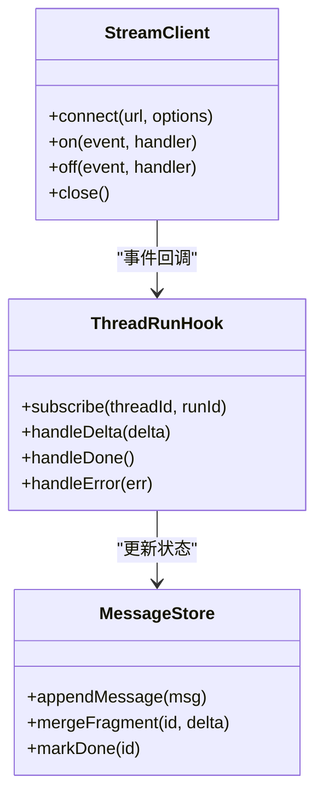
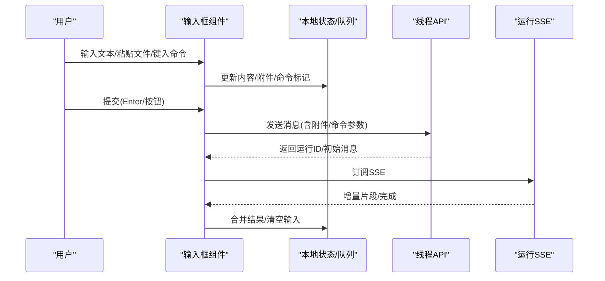
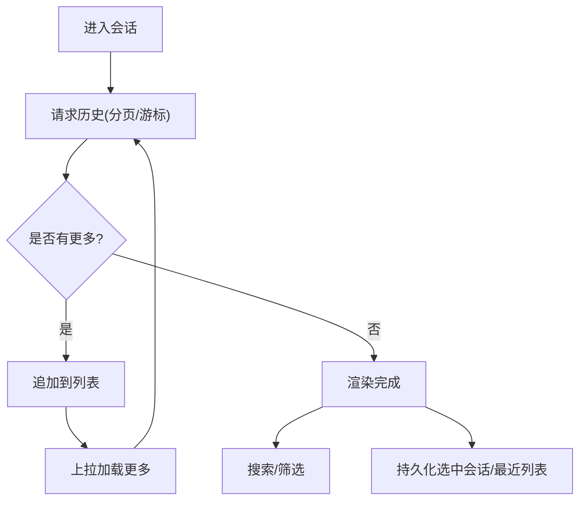
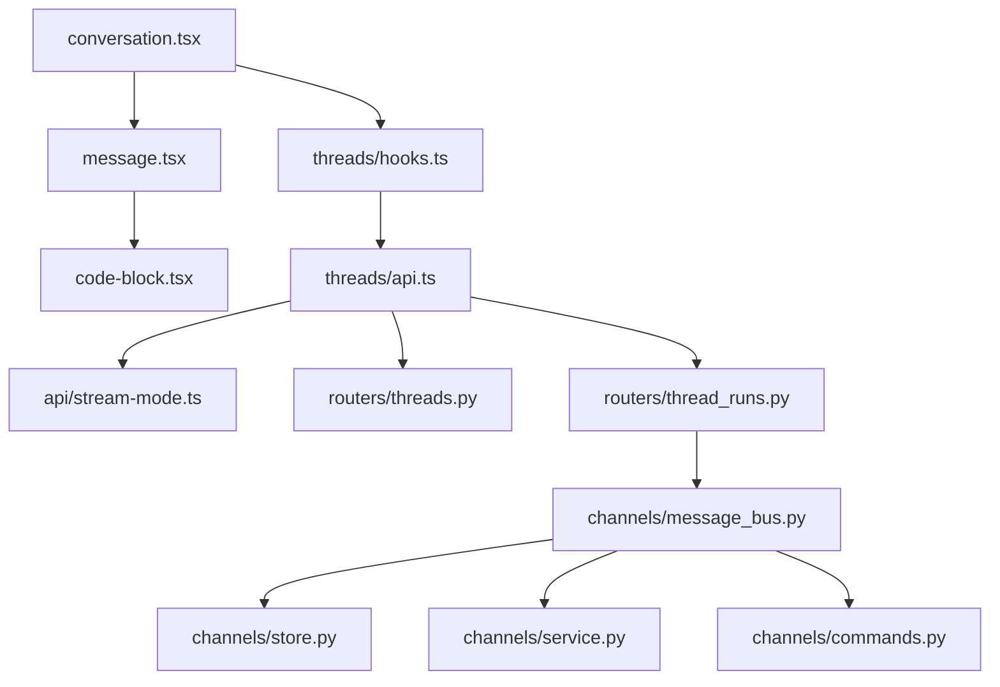

# 聊天会话界面

<cite>
**本文引用的文件**   
- [frontend/src/components/ai-elements/conversation.tsx](file://frontend/src/components/ai-elements/conversation.tsx)
- [frontend/src/components/ai-elements/message.tsx](file://frontend/src/components/ai-elements/message.tsx)
- [frontend/src/components/ai-elements/code-block.tsx](file://frontend/src/components/ai-elements/code-block.tsx)
- [frontend/src/components/ai-elements/prompt-input.tsx](file://frontend/src/components/ai-elements/prompt-input.tsx)
- [frontend/src/components/workspace/input-box.tsx](file://frontend/src/components/workspace/input-box.tsx)
- [frontend/src/components/workspace/recent-chat-list.tsx](file://frontend/src/components/workspace/recent-chat-list.tsx)
- [frontend/src/core/messages/index.ts](file://frontend/src/core/messages/index.ts)
- [frontend/src/core/threads/hooks.ts](file://frontend/src/core/threads/hooks.ts)
- [frontend/src/core/threads/api.ts](file://frontend/src/core/threads/api.ts)
- [frontend/src/core/api/stream-mode.ts](file://frontend/src/core/api/stream-mode.ts)
- [backend/app/gateway/routers/threads.py](file://backend/app/gateway/routers/threads.py)
- [backend/app/gateway/routers/thread_runs.py](file://backend/app/gateway/routers/thread_runs.py)
- [backend/app/channels/message_bus.py](file://backend/app/channels/message_bus.py)
- [backend/app/channels/store.py](file://backend/app/channels/store.py)
- [backend/app/channels/service.py](file://backend/app/channels/service.py)
- [backend/app/channels/commands.py](file://backend/app/channels/commands.py)
</cite>

## 目录
1. [简介](#简介)
2. [项目结构](#项目结构)
3. [核心组件](#核心组件)
4. [架构总览](#架构总览)
5. [详细组件分析](#详细组件分析)
6. [依赖关系分析](#依赖关系分析)
7. [性能考虑](#性能考虑)
8. [故障排查指南](#故障排查指南)
9. [结论](#结论)
10. [附录](#附录)

## 简介
本文件面向“聊天会话界面”的完整实现，围绕以下目标展开：
- 消息渲染系统：消息类型识别、富文本解析与代码高亮
- 实时通信机制：WebSocket/SSE连接管理、消息流处理与断线重连
- 消息输入功能：文本编辑、文件附件与快捷命令
- 会话历史管理：分页加载、搜索与状态持久化
- 高级聊天能力：多轮对话、上下文管理与智能建议
- 性能优化与体验改进

## 项目结构
前端采用 Next.js + React 组件化架构，核心聊天能力集中在 ai-elements 与 workspace 两个目录；后端基于 FastAPI 网关路由与通道子系统提供线程（会话）与运行（流式输出）接口。

图表来源
- [frontend/src/components/ai-elements/conversation.tsx](file://frontend/src/components/ai-elements/conversation.tsx)
- [frontend/src/components/ai-elements/message.tsx](file://frontend/src/components/ai-elements/message.tsx)
- [frontend/src/components/ai-elements/code-block.tsx](file://frontend/src/components/ai-elements/code-block.tsx)
- [frontend/src/components/ai-elements/prompt-input.tsx](file://frontend/src/components/ai-elements/prompt-input.tsx)
- [frontend/src/components/workspace/input-box.tsx](file://frontend/src/components/workspace/input-box.tsx)
- [frontend/src/core/threads/hooks.ts](file://frontend/src/core/threads/hooks.ts)
- [frontend/src/core/threads/api.ts](file://frontend/src/core/threads/api.ts)
- [frontend/src/core/api/stream-mode.ts](file://frontend/src/core/api/stream-mode.ts)
- [backend/app/gateway/routers/threads.py](file://backend/app/gateway/routers/threads.py)
- [backend/app/gateway/routers/thread_runs.py](file://backend/app/gateway/routers/thread_runs.py)
- [backend/app/channels/message_bus.py](file://backend/app/channels/message_bus.py)
- [backend/app/channels/store.py](file://backend/app/channels/store.py)
- [backend/app/channels/service.py](file://backend/app/channels/service.py)
- [backend/app/channels/commands.py](file://backend/app/channels/commands.py)

章节来源
- [frontend/src/components/ai-elements/conversation.tsx](file://frontend/src/components/ai-elements/conversation.tsx)
- [frontend/src/components/ai-elements/message.tsx](file://frontend/src/components/ai-elements/message.tsx)
- [frontend/src/components/ai-elements/code-block.tsx](file://frontend/src/components/ai-elements/code-block.tsx)
- [frontend/src/components/ai-elements/prompt-input.tsx](file://frontend/src/components/ai-elements/prompt-input.tsx)
- [frontend/src/components/workspace/input-box.tsx](file://frontend/src/components/workspace/input-box.tsx)
- [frontend/src/core/threads/hooks.ts](file://frontend/src/core/threads/hooks.ts)
- [frontend/src/core/threads/api.ts](file://frontend/src/core/threads/api.ts)
- [frontend/src/core/api/stream-mode.ts](file://frontend/src/core/api/stream-mode.ts)
- [backend/app/gateway/routers/threads.py](file://backend/app/gateway/routers/threads.py)
- [backend/app/gateway/routers/thread_runs.py](file://backend/app/gateway/routers/thread_runs.py)
- [backend/app/channels/message_bus.py](file://backend/app/channels/message_bus.py)
- [backend/app/channels/store.py](file://backend/app/channels/store.py)
- [backend/app/channels/service.py](file://backend/app/channels/service.py)
- [backend/app/channels/commands.py](file://backend/app/channels/commands.py)

## 核心组件
- 会话容器与消息列表：负责会话生命周期、消息聚合、滚动定位与增量更新
- 消息渲染器：根据消息类型选择不同渲染器（文本、代码块、图片、任务等），并支持富文本与语法高亮
- 输入框与附件：支持多行文本、快捷键、粘贴/拖拽上传、命令触发
- 线程与流式数据：封装线程查询、分页、搜索与 SSE 流式读取，统一错误与重试
- 后端通道总线：将运行事件分发到存储与服务层，支撑实时推送与命令执行

章节来源
- [frontend/src/components/ai-elements/conversation.tsx](file://frontend/src/components/ai-elements/conversation.tsx)
- [frontend/src/components/ai-elements/message.tsx](file://frontend/src/components/ai-elements/message.tsx)
- [frontend/src/components/ai-elements/code-block.tsx](file://frontend/src/components/ai-elements/code-block.tsx)
- [frontend/src/components/ai-elements/prompt-input.tsx](file://frontend/src/components/ai-elements/prompt-input.tsx)
- [frontend/src/components/workspace/input-box.tsx](file://frontend/src/components/workspace/input-box.tsx)
- [frontend/src/core/threads/hooks.ts](file://frontend/src/core/threads/hooks.ts)
- [frontend/src/core/threads/api.ts](file://frontend/src/core/threads/api.ts)
- [frontend/src/core/api/stream-mode.ts](file://frontend/src/core/api/stream-mode.ts)
- [backend/app/channels/message_bus.py](file://backend/app/channels/message_bus.py)
- [backend/app/channels/store.py](file://backend/app/channels/store.py)
- [backend/app/channels/service.py](file://backend/app/channels/service.py)
- [backend/app/channels/commands.py](file://backend/app/channels/commands.py)

## 架构总览
从用户输入到消息落库与实时渲染的关键路径如下：

图表来源
- [frontend/src/core/threads/api.ts](file://frontend/src/core/threads/api.ts)
- [frontend/src/core/api/stream-mode.ts](file://frontend/src/core/api/stream-mode.ts)
- [backend/app/gateway/routers/threads.py](file://backend/app/gateway/routers/threads.py)
- [backend/app/gateway/routers/thread_runs.py](file://backend/app/gateway/routers/thread_runs.py)
- [backend/app/channels/message_bus.py](file://backend/app/channels/message_bus.py)
- [backend/app/channels/store.py](file://backend/app/channels/store.py)
- [backend/app/channels/service.py](file://backend/app/channels/service.py)
- [backend/app/channels/commands.py](file://backend/app/channels/commands.py)

## 详细组件分析

### 消息渲染系统
- 消息类型识别：根据消息字段区分用户/助手/系统/工具等类型，并据此选择渲染器
- 富文本解析：对 Markdown/HTML 片段进行安全解析与渲染，支持链接、表格、列表等
- 代码高亮：通过专用代码块组件进行语言检测与高亮，支持复制、折叠与全屏查看
- 增量渲染：在流式阶段按片段拼接，避免整段重绘，提升流畅度

图表来源
- [frontend/src/components/ai-elements/message.tsx](file://frontend/src/components/ai-elements/message.tsx)
- [frontend/src/components/ai-elements/code-block.tsx](file://frontend/src/components/ai-elements/code-block.tsx)

章节来源
- [frontend/src/components/ai-elements/message.tsx](file://frontend/src/components/ai-elements/message.tsx)
- [frontend/src/components/ai-elements/code-block.tsx](file://frontend/src/components/ai-elements/code-block.tsx)

### 实时通信机制（SSE/WS）
- 连接管理：使用统一的流模式客户端封装，自动处理连接建立、心跳与异常
- 消息流处理：按事件类型分流（开始、片段、结束、错误），合并至当前消息
- 断线重连：指数退避与最大重试次数，失败时回退到 REST 拉取
- 幂等性：以运行ID/片段序号去重，避免重复渲染

图表来源
- [frontend/src/core/api/stream-mode.ts](file://frontend/src/core/api/stream-mode.ts)
- [frontend/src/core/threads/hooks.ts](file://frontend/src/core/threads/hooks.ts)

章节来源
- [frontend/src/core/api/stream-mode.ts](file://frontend/src/core/api/stream-mode.ts)
- [frontend/src/core/threads/hooks.ts](file://frontend/src/core/threads/hooks.ts)
- [backend/app/gateway/routers/thread_runs.py](file://backend/app/gateway/routers/thread_runs.py)
- [backend/app/channels/message_bus.py](file://backend/app/channels/message_bus.py)

### 消息输入功能
- 文本编辑：支持多行输入、回车发送、Shift+Enter 换行、Tab 缩进
- 文件附件：支持粘贴/拖拽上传，显示预览与删除，限制大小与类型
- 快捷命令：以特定前缀触发命令面板或内置命令（如 /clear、/help）
- 组合交互：输入框与最近会话列表联动，快速切换上下文

图表来源
- [frontend/src/components/ai-elements/prompt-input.tsx](file://frontend/src/components/ai-elements/prompt-input.tsx)
- [frontend/src/components/workspace/input-box.tsx](file://frontend/src/components/workspace/input-box.tsx)
- [frontend/src/core/threads/api.ts](file://frontend/src/core/threads/api.ts)
- [frontend/src/core/api/stream-mode.ts](file://frontend/src/core/api/stream-mode.ts)

章节来源
- [frontend/src/components/ai-elements/prompt-input.tsx](file://frontend/src/components/ai-elements/prompt-input.tsx)
- [frontend/src/components/workspace/input-box.tsx](file://frontend/src/components/workspace/input-box.tsx)
- [frontend/src/core/threads/api.ts](file://frontend/src/core/threads/api.ts)
- [frontend/src/core/api/stream-mode.ts](file://frontend/src/core/api/stream-mode.ts)
- [backend/app/channels/commands.py](file://backend/app/channels/commands.py)

### 会话历史管理
- 分页加载：按页码/游标加载历史消息，避免一次性载入大会话
- 搜索功能：关键词匹配与高亮，支持按时间/类型筛选
- 状态持久化：本地缓存最近会话列表与选中会话，刷新后恢复
- 标题生成：后台异步生成会话标题，前端轮询或监听更新

图表来源
- [frontend/src/core/threads/hooks.ts](file://frontend/src/core/threads/hooks.ts)
- [frontend/src/core/threads/api.ts](file://frontend/src/core/threads/api.ts)
- [frontend/src/components/workspace/recent-chat-list.tsx](file://frontend/src/components/workspace/recent-chat-list.tsx)

章节来源
- [frontend/src/core/threads/hooks.ts](file://frontend/src/core/threads/hooks.ts)
- [frontend/src/core/threads/api.ts](file://frontend/src/core/threads/api.ts)
- [frontend/src/components/workspace/recent-chat-list.tsx](file://frontend/src/components/workspace/recent-chat-list.tsx)
- [backend/app/gateway/routers/threads.py](file://backend/app/gateway/routers/threads.py)

### 高级聊天功能
- 多轮对话：基于 threadId 维持上下文，后续消息自动携带历史摘要
- 上下文管理：服务端维护线程状态，前端按需加载上下文片段
- 智能建议：根据当前输入与历史生成建议项，点击即填充或发送
- 工具与技能：通过命令或服务层扩展能力（搜索、绘图、代码执行等）

图表来源
- [backend/app/channels/service.py](file://backend/app/channels/service.py)
- [backend/app/channels/message_bus.py](file://backend/app/channels/message_bus.py)
- [backend/app/channels/commands.py](file://backend/app/channels/commands.py)
- [frontend/src/components/ai-elements/conversation.tsx](file://frontend/src/components/ai-elements/conversation.tsx)

章节来源
- [backend/app/channels/service.py](file://backend/app/channels/service.py)
- [backend/app/channels/message_bus.py](file://backend/app/channels/message_bus.py)
- [backend/app/channels/commands.py](file://backend/app/channels/commands.py)
- [frontend/src/components/ai-elements/conversation.tsx](file://frontend/src/components/ai-elements/conversation.tsx)

## 依赖关系分析
- 前端依赖
  - 组件层：conversation → message → code-block
  - 数据层：hooks → api → stream-mode
  - 工作区：input-box/recent-chat-list 与 hooks 协作
- 后端依赖
  - 路由层：threads.py 与 thread_runs.py 暴露 REST/SSE
  - 通道层：message_bus 作为中枢，调度 store/service/commands
- 外部集成
  - 模型/工具提供者由服务层注入，命令处理器可扩展

图表来源
- [frontend/src/components/ai-elements/message.tsx](file://frontend/src/components/ai-elements/message.tsx)
- [frontend/src/components/ai-elements/code-block.tsx](file://frontend/src/components/ai-elements/code-block.tsx)
- [frontend/src/components/ai-elements/conversation.tsx](file://frontend/src/components/ai-elements/conversation.tsx)
- [frontend/src/core/threads/hooks.ts](file://frontend/src/core/threads/hooks.ts)
- [frontend/src/core/threads/api.ts](file://frontend/src/core/threads/api.ts)
- [frontend/src/core/api/stream-mode.ts](file://frontend/src/core/api/stream-mode.ts)
- [backend/app/gateway/routers/threads.py](file://backend/app/gateway/routers/threads.py)
- [backend/app/gateway/routers/thread_runs.py](file://backend/app/gateway/routers/thread_runs.py)
- [backend/app/channels/message_bus.py](file://backend/app/channels/message_bus.py)
- [backend/app/channels/store.py](file://backend/app/channels/store.py)
- [backend/app/channels/service.py](file://backend/app/channels/service.py)
- [backend/app/channels/commands.py](file://backend/app/channels/commands.py)

章节来源
- [frontend/src/components/ai-elements/message.tsx](file://frontend/src/components/ai-elements/message.tsx)
- [frontend/src/components/ai-elements/code-block.tsx](file://frontend/src/components/ai-elements/code-block.tsx)
- [frontend/src/components/ai-elements/conversation.tsx](file://frontend/src/components/ai-elements/conversation.tsx)
- [frontend/src/core/threads/hooks.ts](file://frontend/src/core/threads/hooks.ts)
- [frontend/src/core/threads/api.ts](file://frontend/src/core/threads/api.ts)
- [frontend/src/core/api/stream-mode.ts](file://frontend/src/core/api/stream-mode.ts)
- [backend/app/gateway/routers/threads.py](file://backend/app/gateway/routers/threads.py)
- [backend/app/gateway/routers/thread_runs.py](file://backend/app/gateway/routers/thread_runs.py)
- [backend/app/channels/message_bus.py](file://backend/app/channels/message_bus.py)
- [backend/app/channels/store.py](file://backend/app/channels/store.py)
- [backend/app/channels/service.py](file://backend/app/channels/service.py)
- [backend/app/channels/commands.py](file://backend/app/channels/commands.py)

## 性能考虑
- 渲染优化
  - 虚拟列表/窗口化：仅渲染可视区域的消息，减少 DOM 节点数量
  - 增量合并：流式片段按 ID 合并，避免整段重建
  - 代码高亮懒加载：仅在可见时启用高亮，首屏更快
- 网络优化
  - 分页与游标：历史按页加载，避免长会话阻塞
  - 压缩与缓存：静态资源与常用配置开启缓存
  - 断线重连：指数退避与最大重试，失败降级为 REST 拉取
- 内存与CPU
  - 清理监听器：组件卸载时关闭 SSE 与事件监听
  - 防抖与节流：输入与滚动事件做节流，降低重排
- 用户体验
  - 骨架屏与占位：等待数据时展示骨架，感知更流畅
  - 错误提示与重试：网络/解析错误给出明确反馈与一键重试

[本节为通用指导，不直接分析具体文件]

## 故障排查指南
- 常见问题
  - 流式无响应：检查 SSE 端点可达性与跨域配置，确认订阅成功
  - 消息重复：核对运行ID与片段序号，确保去重逻辑生效
  - 附件上传失败：校验大小/类型限制与后端上传路由
  - 搜索无结果：确认索引字段与分词策略，检查分页参数
- 定位步骤
  - 前端：打开控制台查看网络请求与 SSE 事件日志
  - 后端：查看运行路由与消息总线日志，确认事件派发与落库
  - 链路追踪：结合运行ID串联前后端日志

章节来源
- [frontend/src/core/api/stream-mode.ts](file://frontend/src/core/api/stream-mode.ts)
- [frontend/src/core/threads/api.ts](file://frontend/src/core/threads/api.ts)
- [backend/app/gateway/routers/thread_runs.py](file://backend/app/gateway/routers/thread_runs.py)
- [backend/app/channels/message_bus.py](file://backend/app/channels/message_bus.py)
- [backend/app/channels/store.py](file://backend/app/channels/store.py)

## 结论
该聊天会话界面通过清晰的前后端分层与模块化设计，实现了高质量的消息渲染、稳定的实时通信、丰富的输入能力与完善的会话管理。配合性能优化与可观测性手段，可在大规模使用场景下保持良好体验。未来可进一步引入更细粒度的上下文摘要、更强的命令生态与更灵活的插件体系。

## 附录
- 术语
  - 线程(Thread)：一次对话的上下文载体
  - 运行(Run)：一次消息处理的执行过程，包含流式事件
  - 片段(Delta)：流式输出的增量内容单元
- 参考文件
  - 前端：conversation、message、code-block、prompt-input、input-box、recent-chat-list、threads/hooks、threads/api、api/stream-mode
  - 后端：routers/threads、routers/thread_runs、channels/message_bus、channels/store、channels/service、channels/commands