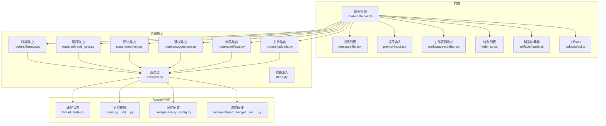
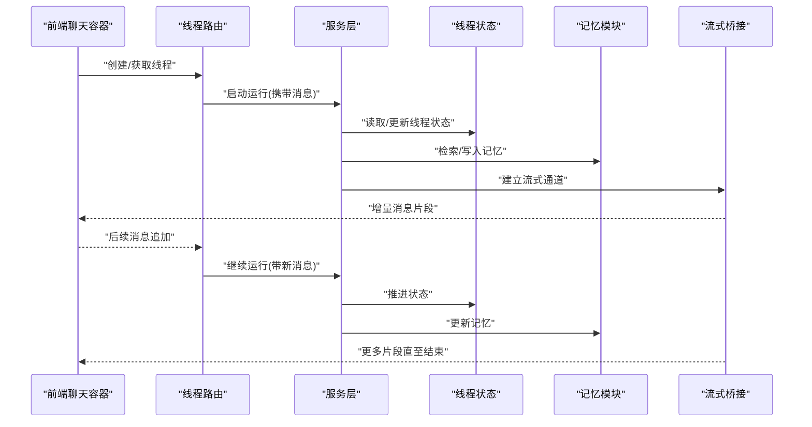
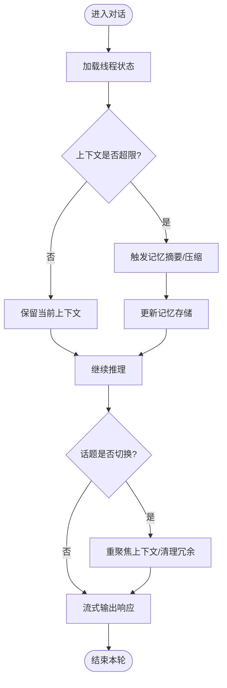
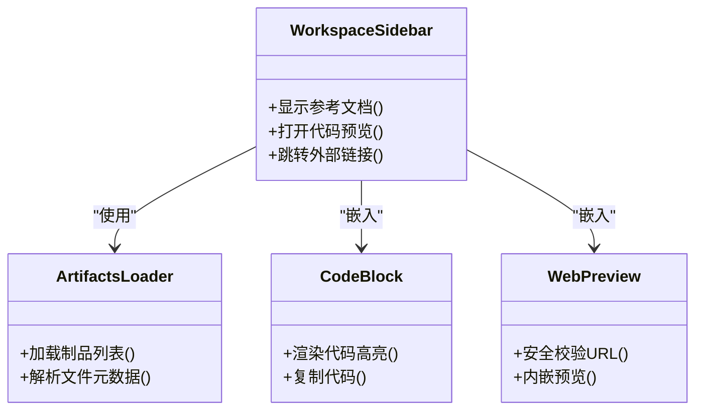
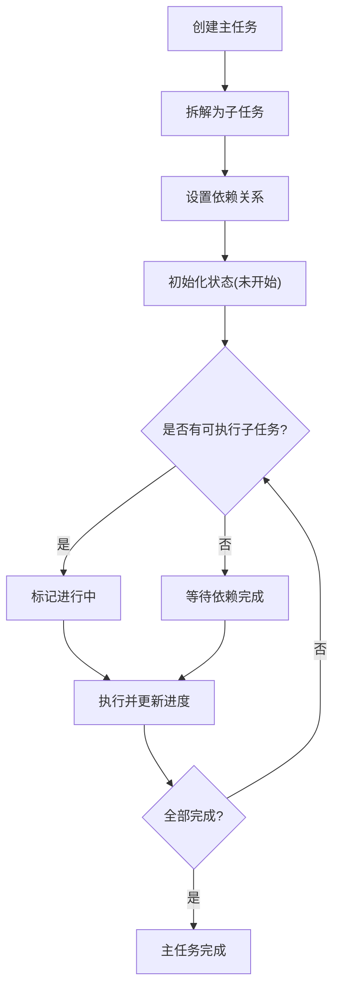
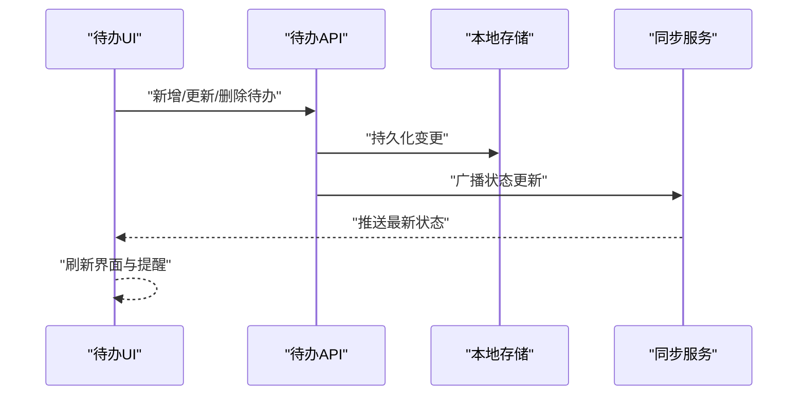
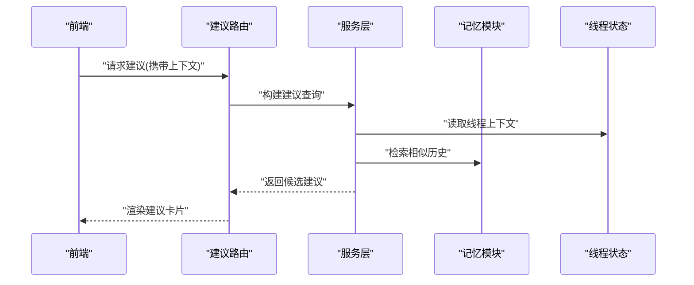
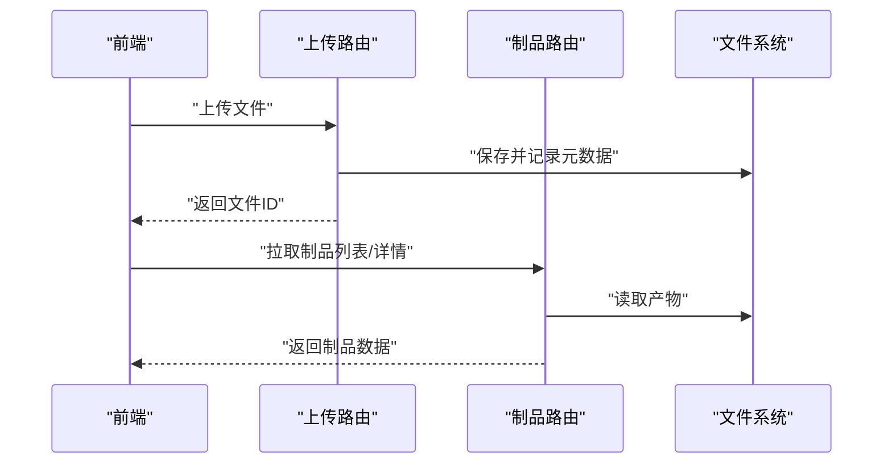
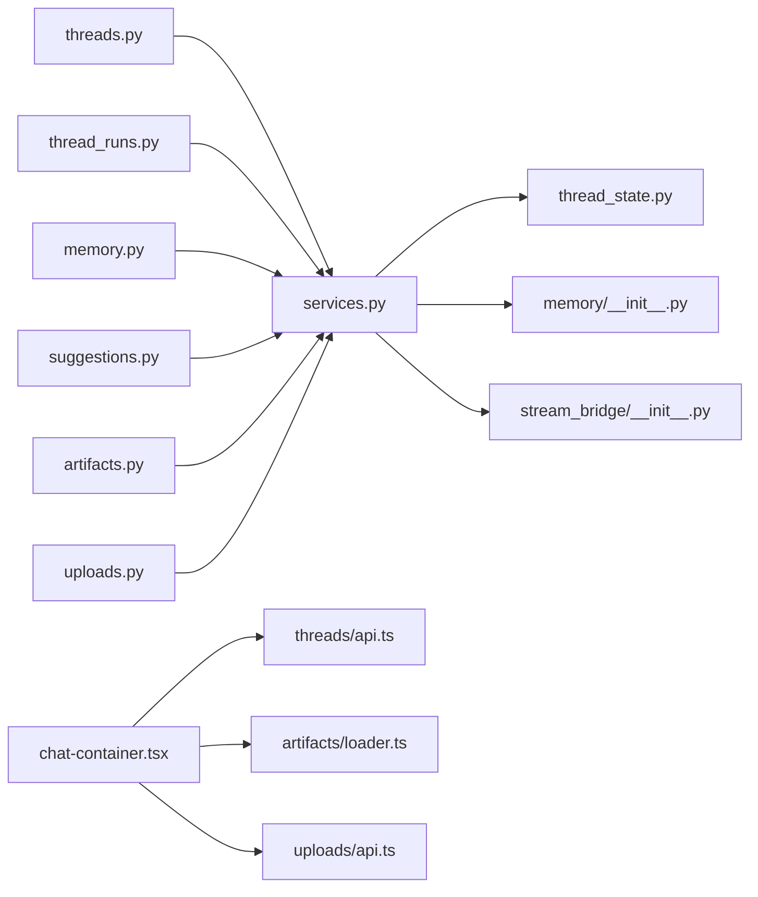

# 高级聊天功能

<cite>
**本文引用的文件**
- [backend/app/gateway/routers/threads.py](file://backend/app/gateway/routers/threads.py)
- [backend/app/gateway/routers/thread_runs.py](file://backend/app/gateway/routers/thread_runs.py)
- [backend/app/gateway/routers/memory.py](file://backend/app/gateway/routers/memory.py)
- [backend/app/gateway/routers/suggestions.py](file://backend/app/gateway/routers/suggestions.py)
- [backend/app/gateway/routers/artifacts.py](file://backend/app/gateway/routers/artifacts.py)
- [backend/app/gateway/routers/uploads.py](file://backend/app/gateway/routers/uploads.py)
- [backend/app/gateway/services.py](file://backend/app/gateway/services.py)
- [backend/app/gateway/deps.py](file://backend/app/gateway/deps.py)
- [backend/packages/harness/deerflow/agents/thread_state.py](file://backend/packages/harness/deerflow/agents/thread_state.py)
- [backend/packages/harness/deerflow/agents/memory/__init__.py](file://backend/packages/harness/deerflow/agents/memory/__init__.py)
- [backend/packages/harness/deerflow/config/memory_config.py](file://backend/packages/harness/deerflow/config/memory_config.py)
- [backend/packages/harness/deerflow/runtime/stream_bridge/__init__.py](file://backend/packages/harness/deerflow/runtime/stream_bridge/__init__.py)
- [frontend/src/components/workspace/chats/chat-container.tsx](file://frontend/src/components/workspace/chats/chat-container.tsx)
- [frontend/src/components/workspace/chats/message-list.tsx](file://frontend/src/components/workspace/chats/message-list.tsx)
- [frontend/src/components/workspace/chats/prompt-input.tsx](file://frontend/src/components/workspace/chats/prompt-input.tsx)
- [frontend/src/components/workspace/workspace-sidebar.tsx](file://frontend/src/components/workspace/workspace-sidebar.tsx)
- [frontend/src/components/workspace/todo-list.tsx](file://frontend/src/components/workspace/todo-list.tsx)
- [frontend/src/core/tasks/index.ts](file://frontend/src/core/tasks/index.ts)
- [frontend/src/core/todos/index.ts](file://frontend/src/core/todos/index.ts)
- [frontend/src/core/threads/hooks.ts](file://frontend/src/core/threads/hooks.ts)
- [frontend/src/core/threads/api.ts](file://frontend/src/core/threads/api.ts)
- [frontend/src/core/messages/index.ts](file://frontend/src/core/messages/index.ts)
- [frontend/src/core/artifacts/hooks.ts](file://frontend/src/core/artifacts/hooks.ts)
- [frontend/src/core/artifacts/loader.ts](file://frontend/src/core/artifacts/loader.ts)
- [frontend/src/core/uploads/api.ts](file://frontend/src/core/uploads/api.ts)
- [frontend/src/components/ai-elements/sources.tsx](file://frontend/src/components/ai-elements/sources.tsx)
- [frontend/src/components/ai-elements/web-preview.tsx](file://frontend/src/components/ai-elements/web-preview.tsx)
- [frontend/src/components/ai-elements/code-block.tsx](file://frontend/src/components/ai-elements/code-block.tsx)
- [frontend/src/components/ai-elements/suggestion.tsx](file://frontend/src/components/ai-elements/suggestion.tsx)
</cite>

## 目录
1. [简介](#简介)
2. [项目结构](#项目结构)
3. [核心组件](#核心组件)
4. [架构总览](#架构总览)
5. [详细组件分析](#详细组件分析)
6. [依赖分析](#依赖分析)
7. [性能考虑](#性能考虑)
8. [故障排查指南](#故障排查指南)
9. [结论](#结论)
10. [附录](#附录)

## 简介
本文件面向“高级聊天功能”的完整实现，覆盖多轮对话管理（上下文窗口控制、记忆保持与话题切换）、侧边栏集成（参考文档查看、代码预览、外部资源链接）、任务分解（子任务创建、进度跟踪、依赖管理）、待办事项系统（清单、提醒、完成状态同步）以及智能建议（上下文感知推荐、相似问题提示、下一步行动建议）。同时提供配置选项与自定义扩展方法，帮助开发者快速集成与二次开发。

## 项目结构
后端采用网关路由 + 服务层 + LangGraph Agent 运行时；前端基于 Next.js 工作区，包含聊天容器、消息列表、输入框、侧边栏、任务与待办模块、上传与制品展示等。

图表来源
- [backend/app/gateway/routers/threads.py](file://backend/app/gateway/routers/threads.py)
- [backend/app/gateway/routers/thread_runs.py](file://backend/app/gateway/routers/thread_runs.py)
- [backend/app/gateway/routers/memory.py](file://backend/app/gateway/routers/memory.py)
- [backend/app/gateway/routers/suggestions.py](file://backend/app/gateway/routers/suggestions.py)
- [backend/app/gateway/routers/artifacts.py](file://backend/app/gateway/routers/artifacts.py)
- [backend/app/gateway/routers/uploads.py](file://backend/app/gateway/routers/uploads.py)
- [backend/app/gateway/services.py](file://backend/app/gateway/services.py)
- [backend/app/gateway/deps.py](file://backend/app/gateway/deps.py)
- [backend/packages/harness/deerflow/agents/thread_state.py](file://backend/packages/harness/deerflow/agents/thread_state.py)
- [backend/packages/harness/deerflow/agents/memory/__init__.py](file://backend/packages/harness/deerflow/agents/memory/__init__.py)
- [backend/packages/harness/deerflow/config/memory_config.py](file://backend/packages/harness/deerflow/config/memory_config.py)
- [backend/packages/harness/deerflow/runtime/stream_bridge/__init__.py](file://backend/packages/harness/deerflow/runtime/stream_bridge/__init__.py)
- [frontend/src/components/workspace/chats/chat-container.tsx](file://frontend/src/components/workspace/chats/chat-container.tsx)
- [frontend/src/components/workspace/chats/message-list.tsx](file://frontend/src/components/workspace/chats/message-list.tsx)
- [frontend/src/components/workspace/chats/prompt-input.tsx](file://frontend/src/components/workspace/chats/prompt-input.tsx)
- [frontend/src/components/workspace/workspace-sidebar.tsx](file://frontend/src/components/workspace/workspace-sidebar.tsx)
- [frontend/src/components/workspace/todo-list.tsx](file://frontend/src/components/workspace/todo-list.tsx)
- [frontend/src/core/artifacts/loader.ts](file://frontend/src/core/artifacts/loader.ts)
- [frontend/src/core/uploads/api.ts](file://frontend/src/core/uploads/api.ts)

章节来源
- [backend/app/gateway/routers/threads.py](file://backend/app/gateway/routers/threads.py)
- [backend/app/gateway/routers/thread_runs.py](file://backend/app/gateway/routers/thread_runs.py)
- [backend/app/gateway/routers/memory.py](file://backend/app/gateway/routers/memory.py)
- [backend/app/gateway/routers/suggestions.py](file://backend/app/gateway/routers/suggestions.py)
- [backend/app/gateway/routers/artifacts.py](file://backend/app/gateway/routers/artifacts.py)
- [backend/app/gateway/routers/uploads.py](file://backend/app/gateway/routers/uploads.py)
- [backend/app/gateway/services.py](file://backend/app/gateway/services.py)
- [backend/app/gateway/deps.py](file://backend/app/gateway/deps.py)
- [backend/packages/harness/deerflow/agents/thread_state.py](file://backend/packages/harness/deerflow/agents/thread_state.py)
- [backend/packages/harness/deerflow/agents/memory/__init__.py](file://backend/packages/harness/deerflow/agents/memory/__init__.py)
- [backend/packages/harness/deerflow/config/memory_config.py](file://backend/packages/harness/deerflow/config/memory_config.py)
- [backend/packages/harness/deerflow/runtime/stream_bridge/__init__.py](file://backend/packages/harness/deerflow/runtime/stream_bridge/__init__.py)
- [frontend/src/components/workspace/chats/chat-container.tsx](file://frontend/src/components/workspace/chats/chat-container.tsx)
- [frontend/src/components/workspace/chats/message-list.tsx](file://frontend/src/components/workspace/chats/message-list.tsx)
- [frontend/src/components/workspace/chats/prompt-input.tsx](file://frontend/src/components/workspace/chats/prompt-input.tsx)
- [frontend/src/components/workspace/workspace-sidebar.tsx](file://frontend/src/components/workspace/workspace-sidebar.tsx)
- [frontend/src/components/workspace/todo-list.tsx](file://frontend/src/components/workspace/todo-list.tsx)
- [frontend/src/core/artifacts/loader.ts](file://frontend/src/core/artifacts/loader.ts)
- [frontend/src/core/uploads/api.ts](file://frontend/src/core/uploads/api.ts)

## 核心组件
- 多轮对话管理：通过线程路由与运行路由协调会话生命周期、消息追加、流式输出与检查点恢复。
- 上下文窗口与记忆：由记忆路由与记忆配置驱动，支持摘要压缩、滑动窗口与持久化存储。
- 侧边栏集成：工作区侧边栏聚合参考文档、代码预览与外部链接，并与制品/上传模块联动。
- 任务分解：前端任务模块负责子任务创建、依赖关系与进度追踪，后端可结合中间件或工具进行执行。
- 待办事项：待办列表与状态同步，支持提醒与完成态更新。
- 智能建议：建议路由根据当前上下文生成相似问题与下一步行动建议。

章节来源
- [backend/app/gateway/routers/threads.py](file://backend/app/gateway/routers/threads.py)
- [backend/app/gateway/routers/thread_runs.py](file://backend/app/gateway/routers/thread_runs.py)
- [backend/app/gateway/routers/memory.py](file://backend/app/gateway/routers/memory.py)
- [backend/app/gateway/routers/suggestions.py](file://backend/app/gateway/routers/suggestions.py)
- [backend/packages/harness/deerflow/config/memory_config.py](file://backend/packages/harness/deerflow/config/memory_config.py)
- [frontend/src/components/workspace/workspace-sidebar.tsx](file://frontend/src/components/workspace/workspace-sidebar.tsx)
- [frontend/src/core/tasks/index.ts](file://frontend/src/core/tasks/index.ts)
- [frontend/src/core/todos/index.ts](file://frontend/src/core/todos/index.ts)

## 架构总览
整体流程：前端发起请求至网关路由，路由调用服务层，服务层编排 Agent 运行时（含线程状态、记忆、流式桥接），结果以 SSE/事件流返回前端，前端渲染消息、制品与侧边栏内容。

图表来源
- [backend/app/gateway/routers/threads.py](file://backend/app/gateway/routers/threads.py)
- [backend/app/gateway/routers/thread_runs.py](file://backend/app/gateway/routers/thread_runs.py)
- [backend/app/gateway/services.py](file://backend/app/gateway/services.py)
- [backend/packages/harness/deerflow/agents/thread_state.py](file://backend/packages/harness/deerflow/agents/thread_state.py)
- [backend/packages/harness/deerflow/agents/memory/__init__.py](file://backend/packages/harness/deerflow/agents/memory/__init__.py)
- [backend/packages/harness/deerflow/runtime/stream_bridge/__init__.py](file://backend/packages/harness/deerflow/runtime/stream_bridge/__init__.py)

## 详细组件分析

### 多轮对话管理（上下文窗口、记忆保持、话题切换）
- 上下文窗口控制：通过记忆配置定义窗口大小、摘要策略与压缩阈值，避免长对话导致上下文溢出。
- 记忆保持：记忆模块在每次运行后持久化关键信息，支持按主题/时间维度检索，确保跨轮次一致性。
- 话题切换：当检测到用户意图变化时，系统可触发记忆摘要与上下文重聚焦，减少无关历史干扰。

图表来源
- [backend/packages/harness/deerflow/config/memory_config.py](file://backend/packages/harness/deerflow/config/memory_config.py)
- [backend/packages/harness/deerflow/agents/memory/__init__.py](file://backend/packages/harness/deerflow/agents/memory/__init__.py)
- [backend/packages/harness/deerflow/agents/thread_state.py](file://backend/packages/harness/deerflow/agents/thread_state.py)

章节来源
- [backend/packages/harness/deerflow/config/memory_config.py](file://backend/packages/harness/deerflow/config/memory_config.py)
- [backend/packages/harness/deerflow/agents/memory/__init__.py](file://backend/packages/harness/deerflow/agents/memory/__init__.py)
- [backend/packages/harness/deerflow/agents/thread_state.py](file://backend/packages/harness/deerflow/agents/thread_state.py)

### 侧边栏集成（参考文档、代码预览、外部资源）
- 参考文档查看：侧边栏加载制品与上传附件，支持文档类型渲染与分页浏览。
- 代码预览：代码块组件提供语法高亮与复制能力，便于开发者快速审阅。
- 外部资源链接：Web 预览组件支持外链嵌入与安全校验，提升信息获取效率。

图表来源
- [frontend/src/components/workspace/workspace-sidebar.tsx](file://frontend/src/components/workspace/workspace-sidebar.tsx)
- [frontend/src/core/artifacts/loader.ts](file://frontend/src/core/artifacts/loader.ts)
- [frontend/src/components/ai-elements/code-block.tsx](file://frontend/src/components/ai-elements/code-block.tsx)
- [frontend/src/components/ai-elements/web-preview.tsx](file://frontend/src/components/ai-elements/web-preview.tsx)

章节来源
- [frontend/src/components/workspace/workspace-sidebar.tsx](file://frontend/src/components/workspace/workspace-sidebar.tsx)
- [frontend/src/core/artifacts/loader.ts](file://frontend/src/core/artifacts/loader.ts)
- [frontend/src/components/ai-elements/code-block.tsx](file://frontend/src/components/ai-elements/code-block.tsx)
- [frontend/src/components/ai-elements/web-preview.tsx](file://frontend/src/components/ai-elements/web-preview.tsx)

### 任务分解（子任务创建、进度跟踪、依赖管理）
- 子任务创建：前端任务模块支持将复杂需求拆分为多个子任务，并维护父子关系。
- 进度跟踪：每个子任务具备状态字段（未开始/进行中/已完成），实时更新汇总进度。
- 依赖管理：子任务间可声明依赖，系统自动计算可执行集合，避免阻塞。

图表来源
- [frontend/src/core/tasks/index.ts](file://frontend/src/core/tasks/index.ts)

章节来源
- [frontend/src/core/tasks/index.ts](file://frontend/src/core/tasks/index.ts)

### 待办事项系统（任务清单、提醒设置、完成状态同步）
- 任务清单：待办列表组件提供增删改查与分组视图。
- 提醒设置：支持定时提醒与到期通知，可与系统通知中心集成。
- 完成状态同步：前端状态变更后即时推送至后端，保证多端一致。

图表来源
- [frontend/src/core/todos/index.ts](file://frontend/src/core/todos/index.ts)
- [frontend/src/components/workspace/todo-list.tsx](file://frontend/src/components/workspace/todo-list.tsx)

章节来源
- [frontend/src/core/todos/index.ts](file://frontend/src/core/todos/index.ts)
- [frontend/src/components/workspace/todo-list.tsx](file://frontend/src/components/workspace/todo-list.tsx)

### 智能建议（上下文感知推荐、相似问题提示、下一步行动建议）
- 上下文感知推荐：基于当前线程状态与最近消息，生成相关建议项。
- 相似问题提示：检索历史问答对，匹配语义相似度，提供快捷入口。
- 下一步行动建议：根据任务/待办状态与当前目标，给出可操作的建议步骤。

图表来源
- [backend/app/gateway/routers/suggestions.py](file://backend/app/gateway/routers/suggestions.py)
- [backend/app/gateway/services.py](file://backend/app/gateway/services.py)
- [backend/packages/harness/deerflow/agents/thread_state.py](file://backend/packages/harness/deerflow/agents/thread_state.py)
- [backend/packages/harness/deerflow/agents/memory/__init__.py](file://backend/packages/harness/deerflow/agents/memory/__init__.py)
- [frontend/src/components/ai-elements/suggestion.tsx](file://frontend/src/components/ai-elements/suggestion.tsx)

章节来源
- [backend/app/gateway/routers/suggestions.py](file://backend/app/gateway/routers/suggestions.py)
- [backend/app/gateway/services.py](file://backend/app/gateway/services.py)
- [backend/packages/harness/deerflow/agents/thread_state.py](file://backend/packages/harness/deerflow/agents/thread_state.py)
- [backend/packages/harness/deerflow/agents/memory/__init__.py](file://backend/packages/harness/deerflow/agents/memory/__init__.py)
- [frontend/src/components/ai-elements/suggestion.tsx](file://frontend/src/components/ai-elements/suggestion.tsx)

### 上传与制品（参考文档与代码预览的数据源）
- 上传路由：接收文件、校验类型与大小、落盘并返回引用。
- 制品路由：列出与下载生成的产物（报告、图表、代码包等）。
- 前端加载器：统一封装制品加载与缓存逻辑，提升渲染性能。

图表来源
- [backend/app/gateway/routers/uploads.py](file://backend/app/gateway/routers/uploads.py)
- [backend/app/gateway/routers/artifacts.py](file://backend/app/gateway/routers/artifacts.py)
- [frontend/src/core/artifacts/loader.ts](file://frontend/src/core/artifacts/loader.ts)
- [frontend/src/core/uploads/api.ts](file://frontend/src/core/uploads/api.ts)

章节来源
- [backend/app/gateway/routers/uploads.py](file://backend/app/gateway/routers/uploads.py)
- [backend/app/gateway/routers/artifacts.py](file://backend/app/gateway/routers/artifacts.py)
- [frontend/src/core/artifacts/loader.ts](file://frontend/src/core/artifacts/loader.ts)
- [frontend/src/core/uploads/api.ts](file://frontend/src/core/uploads/api.ts)

## 依赖分析
- 耦合关系：网关路由与服务层解耦，服务层依赖 Agent 运行时（线程状态、记忆、流式桥接）。
- 外部依赖：前端依赖制品与上传 API，侧边栏依赖这些数据进行展示。
- 循环依赖：前后端通过 REST/SSE 通信，无直接循环依赖。

图表来源
- [backend/app/gateway/routers/threads.py](file://backend/app/gateway/routers/threads.py)
- [backend/app/gateway/routers/thread_runs.py](file://backend/app/gateway/routers/thread_runs.py)
- [backend/app/gateway/routers/memory.py](file://backend/app/gateway/routers/memory.py)
- [backend/app/gateway/routers/suggestions.py](file://backend/app/gateway/routers/suggestions.py)
- [backend/app/gateway/routers/artifacts.py](file://backend/app/gateway/routers/artifacts.py)
- [backend/app/gateway/routers/uploads.py](file://backend/app/gateway/routers/uploads.py)
- [backend/app/gateway/services.py](file://backend/app/gateway/services.py)
- [backend/packages/harness/deerflow/agents/thread_state.py](file://backend/packages/harness/deerflow/agents/thread_state.py)
- [backend/packages/harness/deerflow/agents/memory/__init__.py](file://backend/packages/harness/deerflow/agents/memory/__init__.py)
- [backend/packages/harness/deerflow/runtime/stream_bridge/__init__.py](file://backend/packages/harness/deerflow/runtime/stream_bridge/__init__.py)
- [frontend/src/components/workspace/chats/chat-container.tsx](file://frontend/src/components/workspace/chats/chat-container.tsx)
- [frontend/src/core/threads/api.ts](file://frontend/src/core/threads/api.ts)
- [frontend/src/core/artifacts/loader.ts](file://frontend/src/core/artifacts/loader.ts)
- [frontend/src/core/uploads/api.ts](file://frontend/src/core/uploads/api.ts)

章节来源
- [backend/app/gateway/services.py](file://backend/app/gateway/services.py)
- [backend/app/gateway/deps.py](file://backend/app/gateway/deps.py)

## 性能考虑
- 上下文窗口：合理设置记忆摘要阈值与窗口大小，避免频繁压缩影响延迟。
- 流式输出：利用流式桥接逐步渲染，降低首屏等待时间。
- 制品与上传：启用缓存与懒加载，减少重复网络请求。
- 建议生成：对相似问题检索结果做去重与限流，避免过度计算。

## 故障排查指南
- 线程状态异常：检查线程路由与运行路由的状态流转，确认检查点是否正确保存与恢复。
- 记忆丢失：验证记忆模块的读写路径与配置参数，确认摘要策略是否过于激进。
- 流中断：检查流式桥接的连接稳定性与错误重试机制。
- 上传失败：核对上传路由的文件类型与大小限制，查看服务端日志定位原因。
- 建议为空：确认建议路由的上下文参数与记忆检索条件是否匹配。

章节来源
- [backend/app/gateway/routers/threads.py](file://backend/app/gateway/routers/threads.py)
- [backend/app/gateway/routers/thread_runs.py](file://backend/app/gateway/routers/thread_runs.py)
- [backend/app/gateway/routers/memory.py](file://backend/app/gateway/routers/memory.py)
- [backend/app/gateway/routers/suggestions.py](file://backend/app/gateway/routers/suggestions.py)
- [backend/app/gateway/routers/uploads.py](file://backend/app/gateway/routers/uploads.py)
- [backend/packages/harness/deerflow/runtime/stream_bridge/__init__.py](file://backend/packages/harness/deerflow/runtime/stream_bridge/__init__.py)

## 结论
本方案通过网关路由与服务层协同，结合 Agent 运行时的线程状态、记忆与流式桥接，实现了稳定高效的多轮对话管理。侧边栏集成提升了信息获取效率，任务分解与待办系统增强了协作能力，智能建议则提高了交互体验。配合合理的配置与扩展点，可在不同场景下灵活定制与优化。

## 附录
- 配置选项（示例）
  - 记忆窗口大小、摘要阈值、压缩策略
  - 流式输出缓冲与超时
  - 上传文件大小与类型白名单
  - 建议检索相似度阈值与数量上限
- 自定义扩展方法
  - 新增记忆提供者：实现记忆接口并在服务层注册
  - 扩展建议算法：替换建议路由中的检索与排序逻辑
  - 自定义制品格式：在制品路由中增加新的序列化与渲染方式
  - 前端插件：在侧边栏与工作区容器中挂载自定义面板