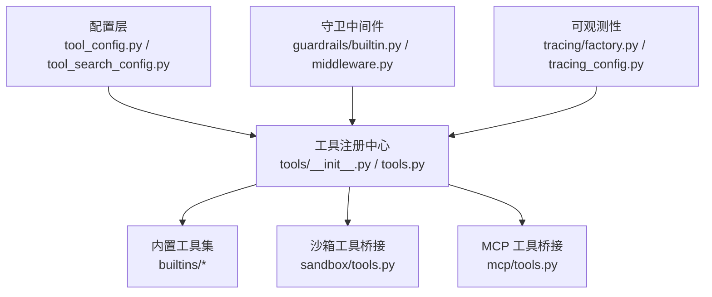
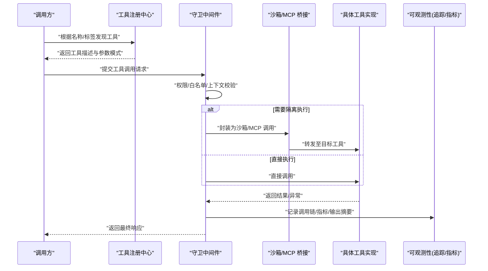
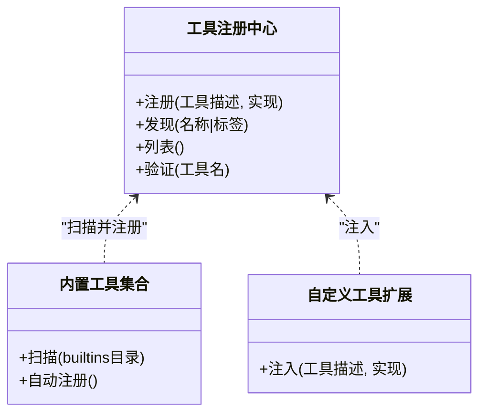
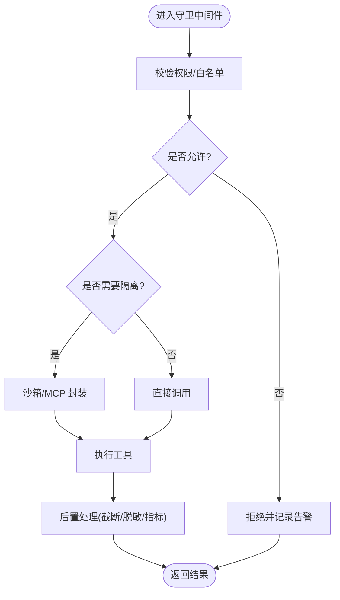
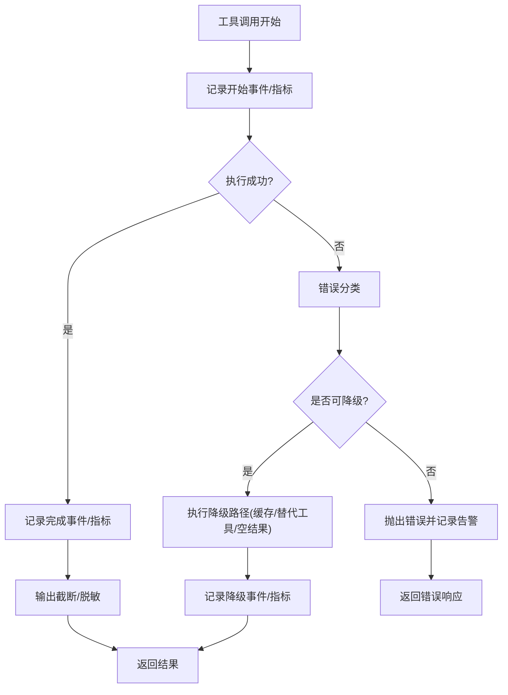
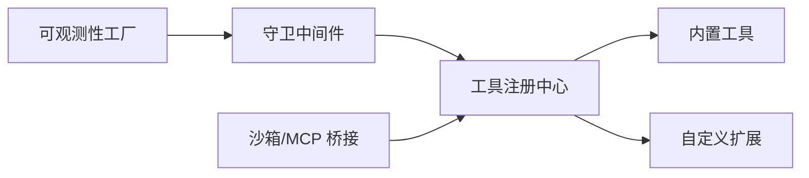

# 工具配置

<cite>
**本文引用的文件**   
- [backend/packages/harness/deerflow/config/tool_config.py](file://backend/packages/harness/deerflow/config/tool_config.py)
- [backend/packages/harness/deerflow/config/tool_search_config.py](file://backend/packages/harness/deerflow/config/tool_search_config.py)
- [backend/packages/harness/deerflow/tools/__init__.py](file://backend/packages/harness/deerflow/tools/__init__.py)
- [backend/packages/harness/deerflow/tools/tools.py](file://backend/packages/harness/deerflow/tools/tools.py)
- [backend/packages/harness/deerflow/tools/builtins/](file://backend/packages/harness/deerflow/tools/builtins/)
- [backend/packages/harness/deerflow/sandbox/tools.py](file://backend/packages/harness/deerflow/sandbox/tools.py)
- [backend/packages/harness/deerflow/mcp/tools.py](file://backend/packages/harness/deerflow/mcp/tools.py)
- [backend/packages/harness/deerflow/guardrails/builtin.py](file://backend/packages/harness/deerflow/guardrails/builtin.py)
- [backend/packages/harness/deerflow/guardrails/middleware.py](file://backend/packages/harness/deerflow/guardrails/middleware.py)
- [backend/packages/harness/deerflow/tracing/factory.py](file://backend/packages/harness/deerflow/tracing/factory.py)
- [backend/packages/harness/deerflow/config/tracing_config.py](file://backend/packages/harness/deerflow/config/tracing_config.py)
- [backend/tests/test_tool_error_handling_middleware.py](file://backend/tests/test_tool_error_handling_middleware.py)
- [backend/tests/test_tool_output_truncation.py](file://backend/tests/test_tool_output截断.py)
- [backend/tests/test_tool_search.py](file://backend/tests/test_tool_search.py)
- [backend/tests/test_local_bash_tool_loading.py](file://backend/tests/test_local_bash_tool_loading.py)
- [backend/tests/test_sandbox_tools_security.py](file://backend/tests/test_sandbox_tools_security.py)
- [config.example.yaml](file://config.example.yaml)
- [extensions_config.example.json](file://extensions_config.example.json)
</cite>

## 目录
1. [简介](#简介)
2. [项目结构](#项目结构)
3. [核心组件](#核心组件)
4. [架构总览](#架构总览)
5. [详细组件分析](#详细组件分析)
6. [依赖分析](#依赖分析)
7. [性能考虑](#性能考虑)
8. [故障排查指南](#故障排查指南)
9. [结论](#结论)
10. [附录](#附录)

## 简介
本文件聚焦“工具配置”，覆盖以下主题：
- 内置工具的启用/禁用管理（搜索、文件操作、代码执行等）
- 自定义工具的注册与发现机制
- 工具参数设置与默认值
- 工具权限控制与访问限制
- 工具调用日志与性能监控
- 错误处理与降级策略
- 工具开发指南与测试方法
- 常用工具使用场景与配置示例

## 项目结构
与工具配置相关的核心位置位于后端 harness 包中，围绕“配置—注册—发现—执行—安全—可观测性”的链路组织。

图示来源
- [backend/packages/harness/deerflow/config/tool_config.py](file://backend/packages/harness/deerflow/config/tool_config.py)
- [backend/packages/harness/deerflow/config/tool_search_config.py](file://backend/packages/harness/deerflow/config/tool_search_config.py)
- [backend/packages/harness/deerflow/tools/__init__.py](file://backend/packages/harness/deerflow/tools/__init__.py)
- [backend/packages/harness/deerflow/tools/tools.py](file://backend/packages/harness/deerflow/tools/tools.py)
- [backend/packages/harness/deerflow/sandbox/tools.py](file://backend/packages/harness/deerflow/sandbox/tools.py)
- [backend/packages/harness/deerflow/mcp/tools.py](file://backend/packages/harness/deerflow/mcp/tools.py)
- [backend/packages/harness/deerflow/guardrails/builtin.py](file://backend/packages/harness/deerflow/guardrails/builtin.py)
- [backend/packages/harness/deerflow/guardrails/middleware.py](file://backend/packages/harness/deerflow/guardrails/middleware.py)
- [backend/packages/harness/deerflow/tracing/factory.py](file://backend/packages/harness/deerflow/tracing/factory.py)
- [backend/packages/harness/deerflow/config/tracing_config.py](file://backend/packages/harness/deerflow/config/tracing_config.py)

章节来源
- [backend/packages/harness/deerflow/config/tool_config.py](file://backend/packages/harness/deerflow/config/tool_config.py)
- [backend/packages/harness/deerflow/config/tool_search_config.py](file://backend/packages/harness/deerflow/config/tool_search_config.py)
- [backend/packages/harness/deerflow/tools/__init__.py](file://backend/packages/harness/deerflow/tools/__init__.py)
- [backend/packages/harness/deerflow/tools/tools.py](file://backend/packages/harness/deerflow/tools/tools.py)
- [backend/packages/harness/deerflow/sandbox/tools.py](file://backend/packages/harness/deerflow/sandbox/tools.py)
- [backend/packages/harness/deerflow/mcp/tools.py](file://backend/packages/harness/deerflow/mcp/tools.py)
- [backend/packages/harness/deerflow/guardrails/builtin.py](file://backend/packages/harness/deerflow/guardrails/builtin.py)
- [backend/packages/harness/deerflow/guardrails/middleware.py](file://backend/packages/harness/deerflow/guardrails/middleware.py)
- [backend/packages/harness/deerflow/tracing/factory.py](file://backend/packages/harness/deerflow/tracing/factory.py)
- [backend/packages/harness/deerflow/config/tracing_config.py](file://backend/packages/harness/deerflow/config/tracing_config.py)

## 核心组件
- 配置层
  - 工具总开关与分组开关：用于启用/禁用搜索、文件操作、代码执行等类别的工具。
  - 搜索工具配置：选择搜索引擎、限流、超时、结果过滤等。
  - 沙箱与 MCP 集成开关：控制是否加载沙箱工具与远程 MCP 工具。
- 注册与发现
  - 工具注册中心负责集中维护工具元数据与实现映射，支持按名称或标签发现。
  - 内置工具通过约定式扫描自动注册；外部工具可通过扩展点注入。
- 执行与安全
  - 工具执行前经过守卫中间件校验（白名单、权限、上下文）。
  - 敏感能力（如命令执行、文件系统写入）默认在沙箱内运行。
- 可观测性与容错
  - 调用链追踪、指标采集、输出截断、错误分类与降级。

章节来源
- [backend/packages/harness/deerflow/config/tool_config.py](file://backend/packages/harness/deerflow/config/tool_config.py)
- [backend/packages/harness/deerflow/config/tool_search_config.py](file://backend/packages/harness/deerflow/config/tool_search_config.py)
- [backend/packages/harness/deerflow/tools/__init__.py](file://backend/packages/harness/deerflow/tools/__init__.py)
- [backend/packages/harness/deerflow/tools/tools.py](file://backend/packages/harness/deerflow/tools/tools.py)
- [backend/packages/harness/deerflow/guardrails/middleware.py](file://backend/packages/harness/deerflow/guardrails/middleware.py)
- [backend/packages/harness/deerflow/sandbox/tools.py](file://backend/packages/harness/deerflow/sandbox/tools.py)
- [backend/packages/harness/deerflow/tracing/factory.py](file://backend/packages/harness/deerflow/tracing/factory.py)

## 架构总览
下图展示从配置到工具执行的端到端流程，包括注册、发现、守卫、执行、追踪与降级。

图示来源
- [backend/packages/harness/deerflow/tools/tools.py](file://backend/packages/harness/deerflow/tools/tools.py)
- [backend/packages/harness/deerflow/guardrails/middleware.py](file://backend/packages/harness/deerflow/guardrails/middleware.py)
- [backend/packages/harness/deerflow/sandbox/tools.py](file://backend/packages/harness/deerflow/sandbox/tools.py)
- [backend/packages/harness/deerflow/mcp/tools.py](file://backend/packages/harness/deerflow/mcp/tools.py)
- [backend/packages/harness/deerflow/tracing/factory.py](file://backend/packages/harness/deerflow/tracing/factory.py)

## 详细组件分析

### 配置层：工具总开关与搜索配置
- 工具总开关与分组
  - 提供全局开关与各功能组开关（如搜索、文件操作、代码执行），便于按需裁剪能力面。
  - 典型键位命名风格见示例配置文件。
- 搜索工具配置
  - 包含引擎选择、并发/限流、超时、结果去重与过滤规则等。
- 沙箱与 MCP 集成
  - 控制是否启用沙箱工具与 MCP 工具，以及连接参数、重试与超时。
- 默认值与合并策略
  - 配置通常具备默认值，运行时可按环境或实例进行覆盖。

章节来源
- [config.example.yaml](file://config.example.yaml)
- [extensions_config.example.json](file://extensions_config.example.json)
- [backend/packages/harness/deerflow/config/tool_config.py](file://backend/packages/harness/deerflow/config/tool_config.py)
- [backend/packages/harness/deerflow/config/tool_search_config.py](file://backend/packages/harness/deerflow/config/tool_search_config.py)

### 注册与发现：工具注册中心与内置工具
- 注册中心职责
  - 维护工具清单、元数据（名称、描述、参数模式）、版本与标签。
  - 提供按名称、标签、能力维度的查询接口。
- 内置工具发现
  - 通过约定式扫描自动发现并注册 builtins 下的工具模块。
  - 支持显式导入与动态加载两种模式。
- 自定义工具扩展
  - 通过扩展点将第三方工具注册到中心，无需修改核心逻辑。

图示来源
- [backend/packages/harness/deerflow/tools/__init__.py](file://backend/packages/harness/deerflow/tools/__init__.py)
- [backend/packages/harness/deerflow/tools/tools.py](file://backend/packages/harness/deerflow/tools/tools.py)
- [backend/packages/harness/deerflow/tools/builtins/](file://backend/packages/harness/deerflow/tools/builtins/)

章节来源
- [backend/packages/harness/deerflow/tools/__init__.py](file://backend/packages/harness/deerflow/tools/__init__.py)
- [backend/packages/harness/deerflow/tools/tools.py](file://backend/packages/harness/deerflow/tools/tools.py)
- [backend/packages/harness/deerflow/tools/builtins/](file://backend/packages/harness/deerflow/tools/builtins/)

### 执行与安全：守卫中间件与沙箱/MCP 桥接
- 守卫中间件
  - 在工具执行前进行权限校验、白名单检查、上下文注入与输入校验。
  - 对高风险工具强制走沙箱或 MCP 通道。
- 沙箱与 MCP 桥接
  - 将本地工具封装为受控执行环境，限制系统调用、网络与文件系统访问范围。
  - MCP 工具以远端服务形式暴露，统一鉴权与审计。

图示来源
- [backend/packages/harness/deerflow/guardrails/middleware.py](file://backend/packages/harness/deerflow/guardrails/middleware.py)
- [backend/packages/harness/deerflow/guardrails/builtin.py](file://backend/packages/harness/deerflow/guardrails/builtin.py)
- [backend/packages/harness/deerflow/sandbox/tools.py](file://backend/packages/harness/deerflow/sandbox/tools.py)
- [backend/packages/harness/deerflow/mcp/tools.py](file://backend/packages/harness/deerflow/mcp/tools.py)

章节来源
- [backend/packages/harness/deerflow/guardrails/middleware.py](file://backend/packages/harness/deerflow/guardrails/middleware.py)
- [backend/packages/harness/deerflow/guardrails/builtin.py](file://backend/packages/harness/deerflow/guardrails/builtin.py)
- [backend/packages/harness/deerflow/sandbox/tools.py](file://backend/packages/harness/deerflow/sandbox/tools.py)
- [backend/packages/harness/deerflow/mcp/tools.py](file://backend/packages/harness/deerflow/mcp/tools.py)

### 可观测性与容错：追踪、指标、输出截断与降级
- 追踪与指标
  - 基于工厂化可观测性组件，记录工具调用的开始/结束、耗时、状态码与关键指标。
- 输出截断与脱敏
  - 对大输出进行截断，避免下游传输压力；对敏感字段进行脱敏。
- 错误分类与降级
  - 区分网络错误、参数错误、权限错误、内部错误等，触发不同降级策略（如回退到缓存、跳过非关键步骤、返回友好提示）。

图示来源
- [backend/packages/harness/deerflow/tracing/factory.py](file://backend/packages/harness/deerflow/tracing/factory.py)
- [backend/packages/harness/deerflow/config/tracing_config.py](file://backend/packages/harness/deerflow/config/tracing_config.py)
- [backend/tests/test_tool_output_truncation.py](file://backend/tests/test_tool_output截断.py)
- [backend/tests/test_tool_error_handling_middleware.py](file://backend/tests/test_tool_error_handling_middleware.py)

章节来源
- [backend/packages/harness/deerflow/tracing/factory.py](file://backend/packages/harness/deerflow/tracing/factory.py)
- [backend/packages/harness/deerflow/config/tracing_config.py](file://backend/packages/harness/deerflow/config/tracing_config.py)
- [backend/tests/test_tool_output_truncation.py](file://backend/tests/test_tool_output截断.py)
- [backend/tests/test_tool_error_handling_middleware.py](file://backend/tests/test_tool_error_handling_middleware.py)

### 搜索工具配置与使用
- 配置要点
  - 选择搜索引擎、设置并发/限流、超时、结果过滤与去重策略。
  - 可按会话或任务维度覆盖默认配置。
- 常见用法
  - 在对话中让模型自动选择合适搜索工具组合，结合守卫中间件进行权限与配额控制。

章节来源
- [backend/packages/harness/deerflow/config/tool_search_config.py](file://backend/packages/harness/deerflow/config/tool_search_config.py)
- [backend/tests/test_tool_search.py](file://backend/tests/test_tool_search.py)

### 文件操作与代码执行工具
- 文件操作
  - 读/写/列目录/移动/复制等操作，默认在沙箱内执行，限制路径范围与文件大小。
- 代码执行
  - 受限解释器或容器化执行环境，禁止危险系统调用，支持超时与资源上限。
- 安全建议
  - 仅对可信用户/角色开放；严格白名单；最小权限原则。

章节来源
- [backend/packages/harness/deerflow/sandbox/tools.py](file://backend/packages/harness/deerflow/sandbox/tools.py)
- [backend/tests/test_sandbox_tools_security.py](file://backend/tests/test_sandbox_tools_security.py)
- [backend/tests/test_local_bash_tool_loading.py](file://backend/tests/test_local_bash_tool_loading.py)

### 自定义工具注册与发现
- 注册方式
  - 通过扩展点向注册中心注入工具描述与实现。
- 发现方式
  - 按名称精确匹配或按标签模糊筛选。
- 最佳实践
  - 明确参数模式与默认值；提供清晰的错误语义；遵循守卫中间件契约。

章节来源
- [backend/packages/harness/deerflow/tools/__init__.py](file://backend/packages/harness/deerflow/tools/__init__.py)
- [backend/packages/harness/deerflow/tools/tools.py](file://backend/packages/harness/deerflow/tools/tools.py)

### 工具权限控制与访问限制
- 权限模型
  - 基于角色/资源的访问控制，结合守卫中间件进行前置校验。
- 访问限制
  - 白名单/黑名单、速率限制、配额与审计日志。
- 沙箱隔离
  - 对高危能力强制隔离执行，限制网络、文件系统与进程能力。

章节来源
- [backend/packages/harness/deerflow/guardrails/middleware.py](file://backend/packages/harness/deerflow/guardrails/middleware.py)
- [backend/packages/harness/deerflow/guardrails/builtin.py](file://backend/packages/harness/deerflow/guardrails/builtin.py)
- [backend/packages/harness/deerflow/sandbox/tools.py](file://backend/packages/harness/deerflow/sandbox/tools.py)

### 工具调用日志与性能监控
- 日志内容
  - 调用入口/出口、参数摘要、耗时、状态码、错误类型与堆栈片段。
- 指标采集
  - QPS、P95/P99 延迟、错误率、降级次数、输出大小分布。
- 追踪关联
  - 与上层链路 ID 关联，便于跨服务定位问题。

章节来源
- [backend/packages/harness/deerflow/tracing/factory.py](file://backend/packages/harness/deerflow/tracing/factory.py)
- [backend/packages/harness/deerflow/config/tracing_config.py](file://backend/packages/harness/deerflow/config/tracing_config.py)

### 错误处理与降级策略
- 错误分类
  - 参数错误、权限错误、网络错误、内部错误、超时等。
- 降级策略
  - 缓存回退、替代工具、部分结果返回、友好提示。
- 测试保障
  - 通过单元测试覆盖各类错误分支与降级路径。

章节来源
- [backend/tests/test_tool_error_handling_middleware.py](file://backend/tests/test_tool_error_handling_middleware.py)

### 工具开发指南与测试方法
- 开发步骤
  - 定义工具描述与参数模式；实现核心逻辑；编写守卫兼容的输入校验；添加追踪埋点。
- 测试方法
  - 单元测试：覆盖正常路径与异常分支。
  - 集成测试：模拟沙箱/MCP 环境，验证权限与隔离。
  - 回归测试：确保输出截断与降级行为稳定。
- 发布流程
  - 更新注册表与文档；灰度发布；观察指标与告警。

章节来源
- [backend/packages/harness/deerflow/tools/builtins/](file://backend/packages/harness/deerflow/tools/builtins/)
- [backend/tests/test_tool_search.py](file://backend/tests/test_tool_search.py)
- [backend/tests/test_sandbox_tools_security.py](file://backend/tests/test_sandbox_tools_security.py)
- [backend/tests/test_tool_output_truncation.py](file://backend/tests/test_tool_output截断.py)
- [backend/tests/test_tool_error_handling_middleware.py](file://backend/tests/test_tool_error_handling_middleware.py)

### 常用工具使用场景与配置示例
- 搜索增强
  - 开启多引擎搜索，设置并发与超时，配合守卫中间件做配额控制。
- 文件协作
  - 在沙箱中进行读写与归档，限制路径与大小，审计所有变更。
- 代码执行
  - 在受限环境中运行脚本，设置超时与内存上限，失败时回退到离线计算。
- 远程能力
  - 通过 MCP 接入外部工具，统一鉴权与审计，失败时降级到本地等价能力。

章节来源
- [config.example.yaml](file://config.example.yaml)
- [extensions_config.example.json](file://extensions_config.example.json)
- [backend/packages/harness/deerflow/config/tool_config.py](file://backend/packages/harness/deerflow/config/tool_config.py)
- [backend/packages/harness/deerflow/config/tool_search_config.py](file://backend/packages/harness/deerflow/config/tool_search_config.py)
- [backend/packages/harness/deerflow/sandbox/tools.py](file://backend/packages/harness/deerflow/sandbox/tools.py)
- [backend/packages/harness/deerflow/mcp/tools.py](file://backend/packages/harness/deerflow/mcp/tools.py)

## 依赖分析
- 组件耦合
  - 注册中心与内置工具低耦合，通过描述符与接口契约交互。
  - 守卫中间件与执行桥接解耦，便于替换沙箱/MCP 实现。
- 外部依赖
  - 追踪与指标组件通过工厂注入，便于切换后端。
- 潜在风险
  - 避免循环依赖；对高危工具增加熔断与限流。

图示来源
- [backend/packages/harness/deerflow/tools/tools.py](file://backend/packages/harness/deerflow/tools/tools.py)
- [backend/packages/harness/deerflow/guardrails/middleware.py](file://backend/packages/harness/deerflow/guardrails/middleware.py)
- [backend/packages/harness/deerflow/sandbox/tools.py](file://backend/packages/harness/deerflow/sandbox/tools.py)
- [backend/packages/harness/deerflow/mcp/tools.py](file://backend/packages/harness/deerflow/mcp/tools.py)
- [backend/packages/harness/deerflow/tracing/factory.py](file://backend/packages/harness/deerflow/tracing/factory.py)

章节来源
- [backend/packages/harness/deerflow/tools/tools.py](file://backend/packages/harness/deerflow/tools/tools.py)
- [backend/packages/harness/deerflow/guardrails/middleware.py](file://backend/packages/harness/deerflow/guardrails/middleware.py)
- [backend/packages/harness/deerflow/sandbox/tools.py](file://backend/packages/harness/deerflow/sandbox/tools.py)
- [backend/packages/harness/deerflow/mcp/tools.py](file://backend/packages/harness/deerflow/mcp/tools.py)
- [backend/packages/harness/deerflow/tracing/factory.py](file://backend/packages/harness/deerflow/tracing/factory.py)

## 性能考虑
- 合理设置并发与超时，避免雪崩。
- 对大输出进行截断与流式返回。
- 对高频工具引入缓存与去重。
- 在沙箱/MCP 调用中加入重试与熔断。
- 通过指标与追踪识别热点与瓶颈。

[本节为通用指导，不直接分析具体文件]

## 故障排查指南
- 常见问题
  - 工具未找到：检查注册中心与发现逻辑。
  - 权限拒绝：核对守卫中间件白名单与角色。
  - 沙箱执行失败：检查隔离环境与资源上限。
  - 输出过大：确认截断阈值与脱敏策略。
  - 错误未降级：检查错误分类与降级路径配置。
- 定位手段
  - 查看追踪与指标，定位耗时与错误类型。
  - 打开调试日志，关注参数与返回值摘要。
  - 复现最小用例，逐步缩小范围。

章节来源
- [backend/tests/test_tool_error_handling_middleware.py](file://backend/tests/test_tool_error_handling_middleware.py)
- [backend/tests/test_tool_output_truncation.py](file://backend/tests/test_tool_output截断.py)
- [backend/tests/test_tool_search.py](file://backend/tests/test_tool_search.py)
- [backend/tests/test_sandbox_tools_security.py](file://backend/tests/test_sandbox_tools_security.py)

## 结论
通过“配置—注册—发现—守卫—执行—可观测—容错”的体系化设计，本项目实现了灵活可控的工具生态。建议在上线前完善权限与降级策略，持续监控关键指标，并建立完善的工具开发与测试规范。

[本节为总结性内容，不直接分析具体文件]

## 附录
- 参考示例
  - 工具总开关与搜索配置示例：参见示例配置文件。
  - 扩展配置示例：参见扩展配置示例文件。

章节来源
- [config.example.yaml](file://config.example.yaml)
- [extensions_config.example.json](file://extensions_config.example.json)