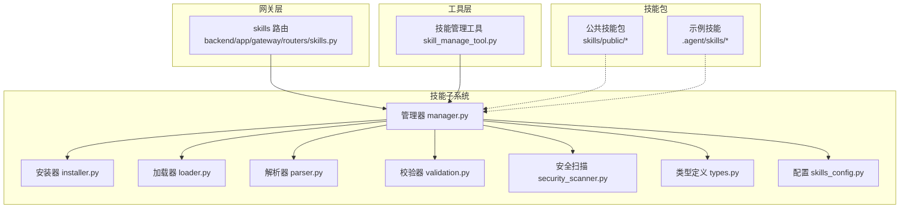
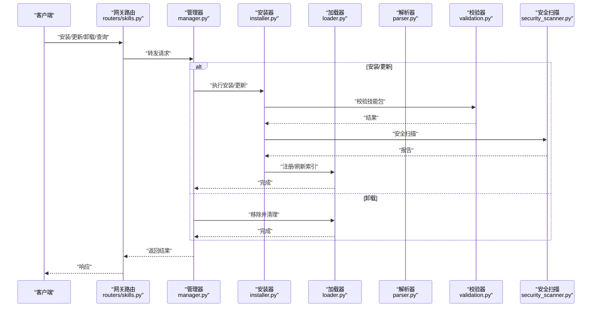
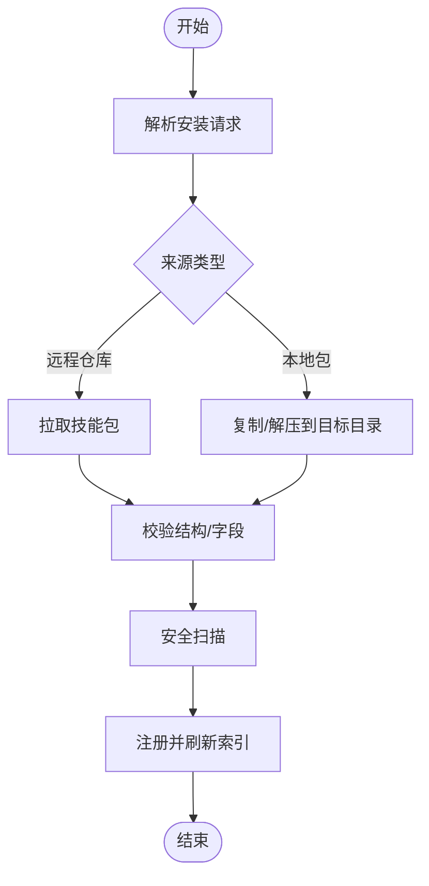
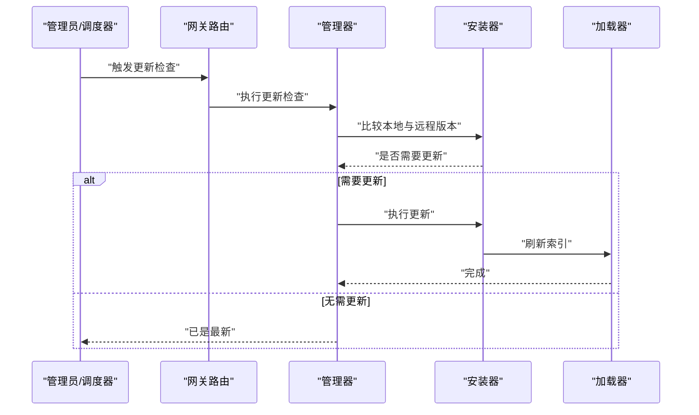
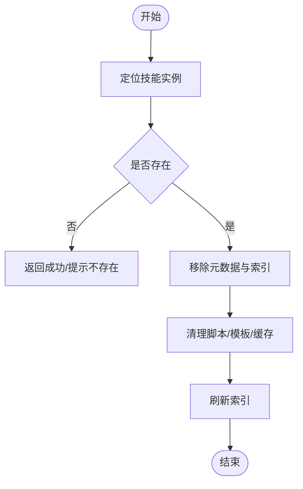
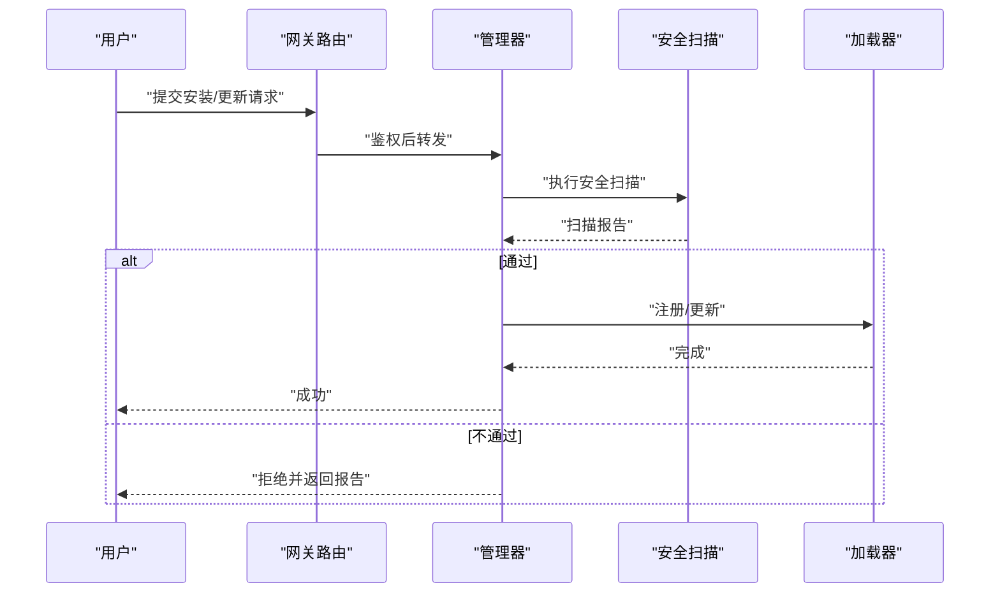
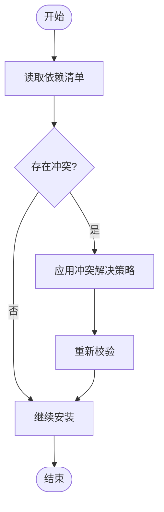
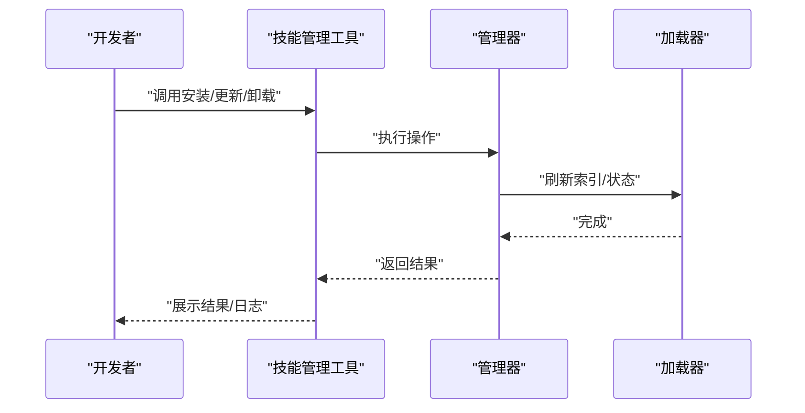
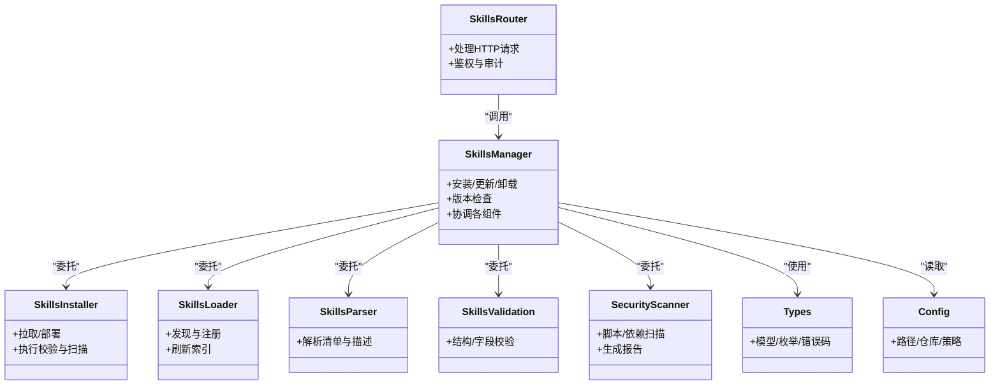

# 技能管理

<cite>
**本文引用的文件**   
- [backend/app/gateway/routers/skills.py](file://backend/app/gateway/routers/skills.py)
- [backend/packages/harness/deerflow/skills/manager.py](file://backend/packages/harness/deerflow/skills/manager.py)
- [backend/packages/harness/deerflow/skills/installer.py](file://backend/packages/harness/deerflow/skills/installer.py)
- [backend/packages/harness/deerflow/skills/loader.py](file://backend/packages/harness/deerflow/skills/loader.py)
- [backend/packages/harness/deerflow/skills/parser.py](file://backend/packages/harness/deerflow/skills/parser.py)
- [backend/packages/harness/deerflow/skills/validation.py](file://backend/packages/harness/deerflow/skills/validation.py)
- [backend/packages/harness/deerflow/skills/security_scanner.py](file://backend/packages/harness/deerflow/skills/security_scanner.py)
- [backend/packages/harness/deerflow/skills/types.py](file://backend/packages/harness/deerflow/skills/types.py)
- [backend/packages/harness/deerflow/config/skills_config.py](file://backend/packages/harness/deerflow/config/skills_config.py)
- [backend/packages/harness/deerflow/tools/skill_manage_tool.py](file://backend/packages/harness/deerflow/tools/skill_manage_tool.py)
- [skills/public/chart-visualization/SKILL.md](file://skills/public/chart-visualization/SKILL.md)
- [skills/public/data-analysis/SKILL.md](file://skills/public/data-analysis/SKILL.md)
- [skills/public/image-generation/SKILL.md](file://skills/public/image-generation/SKILL.md)
- [skills/public/podcast-generation/SKILL.md](file://skills/public/podcast-generation/SKILL.md)
- [skills/public/systematic-literature-review/SKILL.md](file://skills/public/systematic-literature-review/SKILL.md)
- [.agent/skills/smoke-test/SKILL.md](file://.agent/skills/smoke-test/SKILL.md)
</cite>

## 目录
1. [简介](#简介)
2. [项目结构](#项目结构)
3. [核心组件](#核心组件)
4. [架构总览](#架构总览)
5. [详细组件分析](#详细组件分析)
6. [依赖关系分析](#依赖关系分析)
7. [性能考虑](#性能考虑)
8. [故障排查指南](#故障排查指南)
9. [结论](#结论)
10. [附录](#附录)

## 简介
本文件面向“技能管理”能力，系统性阐述技能的安装、更新、卸载与清理、权限与安全扫描、依赖管理与冲突解决、开发者调试与测试方法，以及技能包目录结构与配置文件说明。文档同时提供常用技能的使用示例与最佳实践，帮助使用者与开发者高效掌握技能全生命周期管理。

## 项目结构
技能管理相关代码主要位于后端网关路由与技能子系统模块中，公共技能包位于 skills/public 目录，示例技能位于 .agent/skills 目录。

图表来源
- [backend/app/gateway/routers/skills.py](file://backend/app/gateway/routers/skills.py)
- [backend/packages/harness/deerflow/skills/manager.py](file://backend/packages/harness/deerflow/skills/manager.py)
- [backend/packages/harness/deerflow/skills/installer.py](file://backend/packages/harness/deerflow/skills/installer.py)
- [backend/packages/harness/deerflow/skills/loader.py](file://backend/packages/harness/deerflow/skills/loader.py)
- [backend/packages/harness/deerflow/skills/parser.py](file://backend/packages/harness/deerflow/skills/parser.py)
- [backend/packages/harness/deerflow/skills/validation.py](file://backend/packages/harness/deerflow/skills/validation.py)
- [backend/packages/harness/deerflow/skills/security_scanner.py](file://backend/packages/harness/deerflow/skills/security_scanner.py)
- [backend/packages/harness/deerflow/skills/types.py](file://backend/packages/harness/deerflow/skills/types.py)
- [backend/packages/harness/deerflow/config/skills_config.py](file://backend/packages/harness/deerflow/config/skills_config.py)
- [backend/packages/harness/deerflow/tools/skill_manage_tool.py](file://backend/packages/harness/deerflow/tools/skill_manage_tool.py)

章节来源
- [backend/app/gateway/routers/skills.py](file://backend/app/gateway/routers/skills.py)
- [backend/packages/harness/deerflow/skills/manager.py](file://backend/packages/harness/deerflow/skills/manager.py)
- [backend/packages/harness/deerflow/skills/installer.py](file://backend/packages/harness/deerflow/skills/installer.py)
- [backend/packages/harness/deerflow/skills/loader.py](file://backend/packages/harness/deerflow/skills/loader.py)
- [backend/packages/harness/deerflow/skills/parser.py](file://backend/packages/harness/deerflow/skills/parser.py)
- [backend/packages/harness/deerflow/skills/validation.py](file://backend/packages/harness/deerflow/skills/validation.py)
- [backend/packages/harness/deerflow/skills/security_scanner.py](file://backend/packages/harness/deerflow/skills/security_scanner.py)
- [backend/packages/harness/deerflow/skills/types.py](file://backend/packages/harness/deerflow/skills/types.py)
- [backend/packages/harness/deerflow/config/skills_config.py](file://backend/packages/harness/deerflow/config/skills_config.py)
- [backend/packages/harness/deerflow/tools/skill_manage_tool.py](file://backend/packages/harness/deerflow/tools/skill_manage_tool.py)

## 核心组件
- 网关路由：对外暴露技能管理的 HTTP 接口，负责参数校验、鉴权与调用服务层。
- 管理器：协调安装、卸载、更新、列表查询、状态查看等核心流程。
- 安装器：实现从远程仓库（技能市场）拉取与本地包部署的完整流程。
- 加载器：发现并加载已安装的技能元数据与资源。
- 解析器：解析技能清单与描述文件，生成结构化元数据。
- 校验器：对技能包结构、字段约束进行合法性检查。
- 安全扫描：对脚本、依赖、网络访问等进行风险检测。
- 类型定义：统一技能模型、枚举与错误码。
- 配置：集中管理技能路径、仓库源、扫描策略等。
- 工具：为 Agent 提供可执行的操作入口（如安装、卸载、更新）。

章节来源
- [backend/app/gateway/routers/skills.py](file://backend/app/gateway/routers/skills.py)
- [backend/packages/harness/deerflow/skills/manager.py](file://backend/packages/harness/deerflow/skills/manager.py)
- [backend/packages/harness/deerflow/skills/installer.py](file://backend/packages/harness/deerflow/skills/installer.py)
- [backend/packages/harness/deerflow/skills/loader.py](file://backend/packages/harness/deerflow/skills/loader.py)
- [backend/packages/harness/deerflow/skills/parser.py](file://backend/packages/harness/deerflow/skills/parser.py)
- [backend/packages/harness/deerflow/skills/validation.py](file://backend/packages/harness/deerflow/skills/validation.py)
- [backend/packages/harness/deerflow/skills/security_scanner.py](file://backend/packages/harness/deerflow/skills/security_scanner.py)
- [backend/packages/harness/deerflow/skills/types.py](file://backend/packages/harness/deerflow/skills/types.py)
- [backend/packages/harness/deerflow/config/skills_config.py](file://backend/packages/harness/deerflow/config/skills_config.py)
- [backend/packages/harness/deerflow/tools/skill_manage_tool.py](file://backend/packages/harness/deerflow/tools/skill_manage_tool.py)

## 架构总览
下图展示了从前端或外部系统发起请求到技能子系统处理的端到端流程。

图表来源
- [backend/app/gateway/routers/skills.py](file://backend/app/gateway/routers/skills.py)
- [backend/packages/harness/deerflow/skills/manager.py](file://backend/packages/harness/deerflow/skills/manager.py)
- [backend/packages/harness/deerflow/skills/installer.py](file://backend/packages/harness/deerflow/skills/installer.py)
- [backend/packages/harness/deerflow/skills/loader.py](file://backend/packages/harness/deerflow/skills/loader.py)
- [backend/packages/harness/deerflow/skills/parser.py](file://backend/packages/harness/deerflow/skills/parser.py)
- [backend/packages/harness/deerflow/skills/validation.py](file://backend/packages/harness/deerflow/skills/validation.py)
- [backend/packages/harness/deerflow/skills/security_scanner.py](file://backend/packages/harness/deerflow/skills/security_scanner.py)

## 详细组件分析

### 技能安装流程（从技能市场安装与本地包部署）
- 远程安装（技能市场）
  - 通过网关路由接收安装请求，管理器调用安装器。
  - 安装器根据配置中的仓库源下载技能包，执行校验与安全扫描后，由加载器注册并刷新索引。
- 本地包部署
  - 支持将本地打包好的技能目录或归档直接部署至指定路径，同样经过校验与扫描后注册。

图表来源
- [backend/app/gateway/routers/skills.py](file://backend/app/gateway/routers/skills.py)
- [backend/packages/harness/deerflow/skills/manager.py](file://backend/packages/harness/deerflow/skills/manager.py)
- [backend/packages/harness/deerflow/skills/installer.py](file://backend/packages/harness/deerflow/skills/installer.py)
- [backend/packages/harness/deerflow/skills/validation.py](file://backend/packages/harness/deerflow/skills/validation.py)
- [backend/packages/harness/deerflow/skills/security_scanner.py](file://backend/packages/harness/deerflow/skills/security_scanner.py)
- [backend/packages/harness/deerflow/skills/loader.py](file://backend/packages/harness/deerflow/skills/loader.py)

章节来源
- [backend/app/gateway/routers/skills.py](file://backend/app/gateway/routers/skills.py)
- [backend/packages/harness/deerflow/skills/manager.py](file://backend/packages/harness/deerflow/skills/manager.py)
- [backend/packages/harness/deerflow/skills/installer.py](file://backend/packages/harness/deerflow/skills/installer.py)
- [backend/packages/harness/deerflow/skills/validation.py](file://backend/packages/harness/deerflow/skills/validation.py)
- [backend/packages/harness/deerflow/skills/security_scanner.py](file://backend/packages/harness/deerflow/skills/security_scanner.py)
- [backend/packages/harness/deerflow/skills/loader.py](file://backend/packages/harness/deerflow/skills/loader.py)

### 技能更新机制（版本检查与自动更新）
- 版本检查
  - 管理器在更新流程中对比本地版本与仓库最新版本，决定是否升级。
- 自动更新
  - 结合定时任务或触发式钩子，按策略批量检查并执行更新。
- 回滚与一致性
  - 更新前备份当前版本，失败时回滚；更新完成后刷新索引，确保加载一致。

图表来源
- [backend/app/gateway/routers/skills.py](file://backend/app/gateway/routers/skills.py)
- [backend/packages/harness/deerflow/skills/manager.py](file://backend/packages/harness/deerflow/skills/manager.py)
- [backend/packages/harness/deerflow/skills/installer.py](file://backend/packages/harness/deerflow/skills/installer.py)
- [backend/packages/harness/deerflow/skills/loader.py](file://backend/packages/harness/deerflow/skills/loader.py)

章节来源
- [backend/packages/harness/deerflow/skills/manager.py](file://backend/packages/harness/deerflow/skills/manager.py)
- [backend/packages/harness/deerflow/skills/installer.py](file://backend/packages/harness/deerflow/skills/installer.py)
- [backend/packages/harness/deerflow/skills/loader.py](file://backend/packages/harness/deerflow/skills/loader.py)

### 技能卸载与清理操作
- 卸载流程
  - 管理器调用加载器移除技能元数据与索引项，并清理关联资源（脚本、模板、缓存等）。
- 幂等性与健壮性
  - 重复卸载应返回成功或提示不存在；异常时记录日志并保留最小可用状态。

图表来源
- [backend/packages/harness/deerflow/skills/manager.py](file://backend/packages/harness/deerflow/skills/manager.py)
- [backend/packages/harness/deerflow/skills/loader.py](file://backend/packages/harness/deerflow/skills/loader.py)

章节来源
- [backend/packages/harness/deerflow/skills/manager.py](file://backend/packages/harness/deerflow/skills/manager.py)
- [backend/packages/harness/deerflow/skills/loader.py](file://backend/packages/harness/deerflow/skills/loader.py)

### 权限控制与安全扫描结果查看
- 权限控制
  - 网关层对敏感操作（安装、更新、卸载）进行鉴权与审计；仅授权用户可执行。
- 安全扫描
  - 安装/更新前对脚本、依赖、网络访问等进行扫描，输出风险等级与建议。
- 结果查看
  - 提供接口查询最近一次扫描结果与历史报告，便于审计与回溯。

图表来源
- [backend/app/gateway/routers/skills.py](file://backend/app/gateway/routers/skills.py)
- [backend/packages/harness/deerflow/skills/manager.py](file://backend/packages/harness/deerflow/skills/manager.py)
- [backend/packages/harness/deerflow/skills/security_scanner.py](file://backend/packages/harness/deerflow/skills/security_scanner.py)
- [backend/packages/harness/deerflow/skills/loader.py](file://backend/packages/harness/deerflow/skills/loader.py)

章节来源
- [backend/app/gateway/routers/skills.py](file://backend/app/gateway/routers/skills.py)
- [backend/packages/harness/deerflow/skills/security_scanner.py](file://backend/packages/harness/deerflow/skills/security_scanner.py)
- [backend/packages/harness/deerflow/skills/manager.py](file://backend/packages/harness/deerflow/skills/manager.py)

### 依赖管理与冲突解决
- 依赖声明
  - 通过类型定义与解析器读取技能依赖清单（脚本、库、外部服务）。
- 冲突检测
  - 管理器在安装/更新时检测版本冲突与路径覆盖风险，给出建议或阻止安装。
- 解决策略
  - 支持隔离安装、版本锁定、按需启用/禁用等策略。

图表来源
- [backend/packages/harness/deerflow/skills/types.py](file://backend/packages/harness/deerflow/skills/types.py)
- [backend/packages/harness/deerflow/skills/parser.py](file://backend/packages/harness/deerflow/skills/parser.py)
- [backend/packages/harness/deerflow/skills/manager.py](file://backend/packages/harness/deerflow/skills/manager.py)

章节来源
- [backend/packages/harness/deerflow/skills/types.py](file://backend/packages/harness/deerflow/skills/types.py)
- [backend/packages/harness/deerflow/skills/parser.py](file://backend/packages/harness/deerflow/skills/parser.py)
- [backend/packages/harness/deerflow/skills/manager.py](file://backend/packages/harness/deerflow/skills/manager.py)

### 开发者调试与测试方法
- 调试工具
  - 通过工具层提供的“技能管理工具”，可在 Agent 环境中直接执行安装、卸载、更新等操作，便于联调。
- 测试方法
  - 使用示例技能进行冒烟测试，验证安装、运行、输出是否符合预期。
  - 结合安全扫描与校验器，快速定位问题。

图表来源
- [backend/packages/harness/deerflow/tools/skill_manage_tool.py](file://backend/packages/harness/deerflow/tools/skill_manage_tool.py)
- [backend/packages/harness/deerflow/skills/manager.py](file://backend/packages/harness/deerflow/skills/manager.py)
- [backend/packages/harness/deerflow/skills/loader.py](file://backend/packages/harness/deerflow/skills/loader.py)

章节来源
- [backend/packages/harness/deerflow/tools/skill_manage_tool.py](file://backend/packages/harness/deerflow/tools/skill_manage_tool.py)
- [backend/packages/harness/deerflow/skills/manager.py](file://backend/packages/harness/deerflow/skills/manager.py)
- [backend/packages/harness/deerflow/skills/loader.py](file://backend/packages/harness/deerflow/skills/loader.py)

### 技能包目录结构与配置文件说明
- 典型目录
  - SKILL.md：技能描述与使用说明。
  - scripts/：可执行脚本（如数据分析、可视化生成等）。
  - templates/：模板文件（用于报告或内容生成）。
  - references/：参考文档与规范。
  - assets/：静态资源（如图表样式、报告模板等）。
- 配置要点
  - 通过配置模块集中管理技能根路径、仓库源、扫描策略等。
  - 类型定义与解析器负责将目录结构映射为统一的元数据结构。

章节来源
- [skills/public/chart-visualization/SKILL.md](file://skills/public/chart-visualization/SKILL.md)
- [skills/public/data-analysis/SKILL.md](file://skills/public/data-analysis/SKILL.md)
- [skills/public/image-generation/SKILL.md](file://skills/public/image-generation/SKILL.md)
- [skills/public/podcast-generation/SKILL.md](file://skills/public/podcast-generation/SKILL.md)
- [skills/public/systematic-literature-review/SKILL.md](file://skills/public/systematic-literature-review/SKILL.md)
- [.agent/skills/smoke-test/SKILL.md](file://.agent/skills/smoke-test/SKILL.md)
- [backend/packages/harness/deerflow/config/skills_config.py](file://backend/packages/harness/deerflow/config/skills_config.py)
- [backend/packages/harness/deerflow/skills/types.py](file://backend/packages/harness/deerflow/skills/types.py)
- [backend/packages/harness/deerflow/skills/parser.py](file://backend/packages/harness/deerflow/skills/parser.py)

### 常用技能使用示例与最佳实践
- 图表可视化
  - 适用于生成多种图表（流程图、思维导图、饼图等），适合汇报与演示场景。
- 数据分析
  - 提供数据处理与分析脚本，适合探索性分析与报表生成。
- 图像生成
  - 基于模板与脚本生成图片，适合营销素材与内容创作。
- 播客生成
  - 将文本内容转换为音频脚本与生成流程，适合知识传播。
- 系统文献综述
  - 自动化检索、筛选与整理学术文献，适合研究辅助。

最佳实践
- 明确依赖与权限，避免越权访问。
- 使用模板与引用文档提升可维护性。
- 定期更新与安全检查，保持版本一致。
- 小步迭代，先冒烟再上线。

章节来源
- [skills/public/chart-visualization/SKILL.md](file://skills/public/chart-visualization/SKILL.md)
- [skills/public/data-analysis/SKILL.md](file://skills/public/data-analysis/SKILL.md)
- [skills/public/image-generation/SKILL.md](file://skills/public/image-generation/SKILL.md)
- [skills/public/podcast-generation/SKILL.md](file://skills/public/podcast-generation/SKILL.md)
- [skills/public/systematic-literature-review/SKILL.md](file://skills/public/systematic-literature-review/SKILL.md)

## 依赖关系分析
- 组件耦合
  - 管理器作为编排中心，依赖安装器、加载器、解析器、校验器、安全扫描器与类型定义。
  - 网关路由仅与管理器交互，屏蔽内部细节。
- 外部依赖
  - 技能包目录与仓库源由配置模块统一管理，便于扩展与替换。
- 潜在循环
  - 各模块职责清晰，未见明显循环依赖；若新增功能需遵循单向依赖原则。

图表来源
- [backend/app/gateway/routers/skills.py](file://backend/app/gateway/routers/skills.py)
- [backend/packages/harness/deerflow/skills/manager.py](file://backend/packages/harness/deerflow/skills/manager.py)
- [backend/packages/harness/deerflow/skills/installer.py](file://backend/packages/harness/deerflow/skills/installer.py)
- [backend/packages/harness/deerflow/skills/loader.py](file://backend/packages/harness/deerflow/skills/loader.py)
- [backend/packages/harness/deerflow/skills/parser.py](file://backend/packages/harness/deerflow/skills/parser.py)
- [backend/packages/harness/deerflow/skills/validation.py](file://backend/packages/harness/deerflow/skills/validation.py)
- [backend/packages/harness/deerflow/skills/security_scanner.py](file://backend/packages/harness/deerflow/skills/security_scanner.py)
- [backend/packages/harness/deerflow/skills/types.py](file://backend/packages/harness/deerflow/skills/types.py)
- [backend/packages/harness/deerflow/config/skills_config.py](file://backend/packages/harness/deerflow/config/skills_config.py)

章节来源
- [backend/app/gateway/routers/skills.py](file://backend/app/gateway/routers/skills.py)
- [backend/packages/harness/deerflow/skills/manager.py](file://backend/packages/harness/deerflow/skills/manager.py)
- [backend/packages/harness/deerflow/skills/installer.py](file://backend/packages/harness/deerflow/skills/installer.py)
- [backend/packages/harness/deerflow/skills/loader.py](file://backend/packages/harness/deerflow/skills/loader.py)
- [backend/packages/harness/deerflow/skills/parser.py](file://backend/packages/harness/deerflow/skills/parser.py)
- [backend/packages/harness/deerflow/skills/validation.py](file://backend/packages/harness/deerflow/skills/validation.py)
- [backend/packages/harness/deerflow/skills/security_scanner.py](file://backend/packages/harness/deerflow/skills/security_scanner.py)
- [backend/packages/harness/deerflow/skills/types.py](file://backend/packages/harness/deerflow/skills/types.py)
- [backend/packages/harness/deerflow/config/skills_config.py](file://backend/packages/harness/deerflow/config/skills_config.py)

## 性能考虑
- 索引刷新
  - 批量操作后合并刷新索引，减少频繁 IO。
- 并发控制
  - 对安装/更新操作加锁，避免并发写入导致不一致。
- 缓存策略
  - 缓存常见元数据与扫描结果，缩短查询时间。
- 资源限制
  - 对脚本执行设置超时与内存上限，防止资源耗尽。

[本节为通用指导，不涉及具体文件分析]

## 故障排查指南
- 常见问题
  - 安装失败：检查仓库连通性与权限；查看安全扫描报告。
  - 更新失败：确认版本兼容性与依赖冲突；尝试回滚。
  - 卸载残留：手动清理未释放的文件与缓存。
- 诊断步骤
  - 查看网关日志与审计记录。
  - 使用工具层接口获取最近操作与扫描结果。
  - 校验器与解析器的错误信息有助于定位结构问题。

章节来源
- [backend/app/gateway/routers/skills.py](file://backend/app/gateway/routers/skills.py)
- [backend/packages/harness/deerflow/skills/manager.py](file://backend/packages/harness/deerflow/skills/manager.py)
- [backend/packages/harness/deerflow/skills/security_scanner.py](file://backend/packages/harness/deerflow/skills/security_scanner.py)
- [backend/packages/harness/deerflow/skills/validation.py](file://backend/packages/harness/deerflow/skills/validation.py)
- [backend/packages/harness/deerflow/skills/parser.py](file://backend/packages/harness/deerflow/skills/parser.py)

## 结论
技能管理模块以管理器为核心，围绕安装、更新、卸载、安全扫描与依赖管理形成闭环。通过清晰的组件边界与配置化策略，既满足生产环境的稳定性要求，也为开发者提供了便捷的调试与测试手段。建议在生产环境严格实施权限控制与安全扫描，并结合版本策略与回滚机制保障持续交付质量。

[本节为总结性内容，不涉及具体文件分析]

## 附录
- 术语
  - 技能：具备独立功能与资源的可插拔单元。
  - 技能包：包含脚本、模板、描述文件的集合。
  - 仓库源：提供技能包的远程存储位置。
- 参考
  - 公共技能包与示例技能可作为开发参考与学习材料。

[本节为补充说明，不涉及具体文件分析]