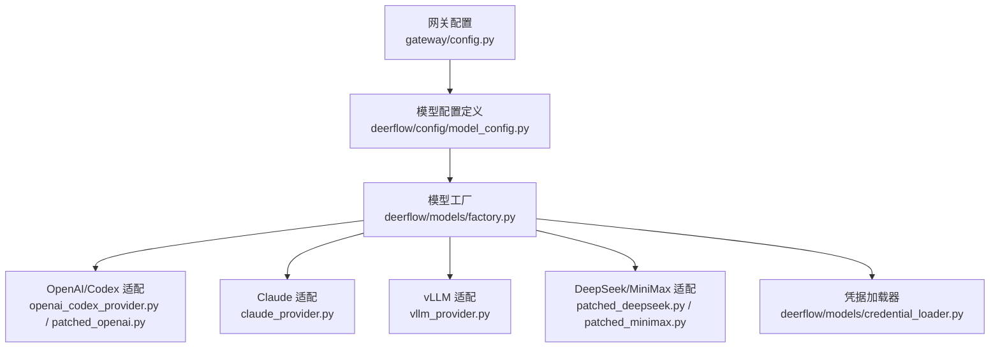
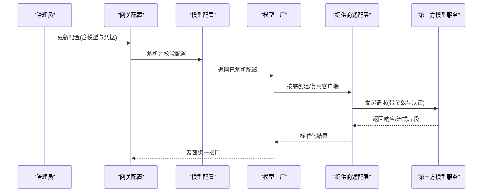
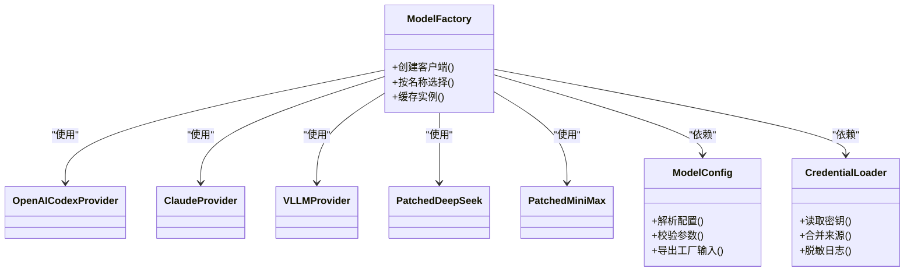

# 模型提供商配置

<cite>
**本文引用的文件**   
- [backend/app/gateway/config.py](file://backend/app/gateway/config.py)
- [backend/packages/harness/deerflow/config/model_config.py](file://backend/packages/harness/deerflow/config/model_config.py)
- [backend/packages/harness/deerflow/models/factory.py](file://backend/packages/harness/deerflow/models/factory.py)
- [backend/packages/harness/deerflow/models/claude_provider.py](file://backend/packages/harness/deerflow/models/claude_provider.py)
- [backend/packages/harness/deerflow/models/openai_codex_provider.py](file://backend/packages/harness/deerflow/models/openai_codex_provider.py)
- [backend/packages/harness/deerflow/models/vllm_provider.py](file://backend/packages/harness/deerflow/models/vllm_provider.py)
- [backend/packages/harness/deerflow/models/patched_openai.py](file://backend/packages/harness/deerflow/models/patched_openai.py)
- [backend/packages/harness/deerflow/models/patched_deepseek.py](file://backend/packages/harness/deerflow/models/patched_deepseek.py)
- [backend/packages/harness/deerflow/models/patched_minimax.py](file://backend/packages/harness/deerflow/models/patched_minimax.py)
- [backend/packages/harness/deerflow/models/credential_loader.py](file://backend/packages/harness/deerflow/models/credential_loader.py)
- [backend/tests/test_model_config.py](file://backend/tests/test_model_config.py)
- [backend/tests/test_credential_loader.py](file://backend/tests/test_credential_loader.py)
- [backend/tests/test_claude_provider_oauth_billing.py](file://backend/tests/test_claude_provider_oauth_billing.py)
- [backend/tests/test_patched_openai.py](file://backend/tests/test_patched_openai.py)
- [backend/tests/test_patched_deepseek.py](file://backend/tests/test_patched_deepseek.py)
- [backend/tests/test_patched_minimax.py](file://backend/tests/test_patched_minimax.py)
- [backend/tests/test_vllm_provider.py](file://backend/tests/test_vllm_provider.py)
- [config.example.yaml](file://config.example.yaml)
</cite>

## 目录
1. [简介](#简介)
2. [项目结构](#项目结构)
3. [核心组件](#核心组件)
4. [架构总览](#架构总览)
5. [详细组件分析](#详细组件分析)
6. [依赖关系分析](#依赖关系分析)
7. [性能与参数调优](#性能与参数调优)
8. [负载均衡与故障转移](#负载均衡与故障转移)
9. [多模型切换与优先级](#多模型切换与优先级)
10. [错误处理与重试机制](#错误处理与重试机制)
11. [安全与密钥管理](#安全与密钥管理)
12. [各提供商配置示例](#各提供商配置示例)
13. [故障排查指南](#故障排查指南)
14. [结论](#结论)

## 简介
本文件面向需要为 Deer-Flow 后端配置多种大模型提供商（如 OpenAI、Claude、Gemini 等）的工程师与运维人员，系统性地说明：
- 支持的模型提供商与接入方式
- API 密钥管理与安全存储机制
- 模型参数调优选项（温度、最大令牌数、超时等）
- 负载均衡与故障转移策略
- 多模型切换与优先级设置
- 各提供商特定配置与性能优化建议
- 错误处理与重试机制的配置要点

## 项目结构
与“模型提供商配置”直接相关的代码主要位于后端 harness 的 models 与 config 模块中，并通过 gateway 层进行统一加载与暴露。关键路径如下：
- 网关配置入口：gateway/config.py
- 模型配置定义与解析：deerflow/config/model_config.py
- 模型工厂与实例化：deerflow/models/factory.py
- 具体提供商实现：claude_provider.py、openai_codex_provider.py、vllm_provider.py 以及若干 patched_* 适配层
- 凭据加载器：deerflow/models/credential_loader.py
- 测试用例覆盖：test_model_config.py、test_credential_loader.py、test_claude_provider_oauth_billing.py、test_patched_*.py、test_vllm_provider.py
- 示例配置：config.example.yaml

图表来源
- [backend/app/gateway/config.py](file://backend/app/gateway/config.py)
- [backend/packages/harness/deerflow/config/model_config.py](file://backend/packages/harness/deerflow/config/model_config.py)
- [backend/packages/harness/deerflow/models/factory.py](file://backend/packages/harness/deerflow/models/factory.py)
- [backend/packages/harness/deerflow/models/claude_provider.py](file://backend/packages/harness/deerflow/models/claude_provider.py)
- [backend/packages/harness/deerflow/models/openai_codex_provider.py](file://backend/packages/harness/deerflow/models/openai_codex_provider.py)
- [backend/packages/harness/deerflow/models/vllm_provider.py](file://backend/packages/harness/deerflow/models/vllm_provider.py)
- [backend/packages/harness/deerflow/models/patched_openai.py](file://backend/packages/harness/deerflow/models/patched_openai.py)
- [backend/packages/harness/deerflow/models/patched_deepseek.py](file://backend/packages/harness/deerflow/models/patched_deepseek.py)
- [backend/packages/harness/deerflow/models/patched_minimax.py](file://backend/packages/harness/deerflow/models/patched_minimax.py)
- [backend/packages/harness/deerflow/models/credential_loader.py](file://backend/packages/harness/deerflow/models/credential_loader.py)

章节来源
- [backend/app/gateway/config.py](file://backend/app/gateway/config.py)
- [backend/packages/harness/deerflow/config/model_config.py](file://backend/packages/harness/deerflow/config/model_config.py)
- [backend/packages/harness/deerflow/models/factory.py](file://backend/packages/harness/deerflow/models/factory.py)

## 核心组件
- 模型配置定义与校验：负责解析 YAML/环境变量中的模型相关配置项，提供默认值与约束检查。
- 模型工厂：根据配置动态创建并缓存不同提供商的客户端实例，支持按名称或别名选择。
- 提供商适配层：对 OpenAI、Claude、vLLM 及 DeepSeek、MiniMax 等进行封装，屏蔽底层差异。
- 凭据加载器：集中读取 API Key、OAuth Token、代理与自定义端点等敏感信息，支持从环境变量或外部密钥源注入。
- 测试套件：覆盖配置解析、凭据加载、各提供商初始化与 OAuth/Billing 行为验证。

章节来源
- [backend/packages/harness/deerflow/config/model_config.py](file://backend/packages/harness/deerflow/config/model_config.py)
- [backend/packages/harness/deerflow/models/factory.py](file://backend/packages/harness/deerflow/models/factory.py)
- [backend/packages/harness/deerflow/models/credential_loader.py](file://backend/packages/harness/deerflow/models/credential_loader.py)
- [backend/tests/test_model_config.py](file://backend/tests/test_model_config.py)
- [backend/tests/test_credential_loader.py](file://backend/tests/test_credential_loader.py)

## 架构总览
下图展示了从配置到运行时调用的一条典型链路：配置加载 → 模型工厂 → 提供商适配 → 第三方服务。

图表来源
- [backend/app/gateway/config.py](file://backend/app/gateway/config.py)
- [backend/packages/harness/deerflow/config/model_config.py](file://backend/packages/harness/deerflow/config/model_config.py)
- [backend/packages/harness/deerflow/models/factory.py](file://backend/packages/harness/deerflow/models/factory.py)
- [backend/packages/harness/deerflow/models/claude_provider.py](file://backend/packages/harness/deerflow/models/claude_provider.py)
- [backend/packages/harness/deerflow/models/openai_codex_provider.py](file://backend/packages/harness/deerflow/models/openai_codex_provider.py)
- [backend/packages/harness/deerflow/models/vllm_provider.py](file://backend/packages/harness/deerflow/models/vllm_provider.py)

## 详细组件分析

### 模型配置定义与解析
- 职责
  - 定义模型相关配置项（提供商、模型名、API Key、端点、代理、并发、超时、重试、负载均衡策略等）。
  - 提供默认值、类型转换与必填字段校验。
  - 将配置映射到工厂可消费的中间表示。
- 关键点
  - 支持通过配置文件与环境变量两种方式注入。
  - 对敏感字段（如 API Key）采用最小可见原则，避免在日志中输出。
  - 对数值型参数（温度、最大令牌数、超时）进行范围校验与单位规范化。
- 参考路径
  - [backend/packages/harness/deerflow/config/model_config.py](file://backend/packages/harness/deerflow/config/model_config.py)
  - [backend/tests/test_model_config.py](file://backend/tests/test_model_config.py)

章节来源
- [backend/packages/harness/deerflow/config/model_config.py](file://backend/packages/harness/deerflow/config/model_config.py)
- [backend/tests/test_model_config.py](file://backend/tests/test_model_config.py)

### 模型工厂与实例化
- 职责
  - 根据配置创建对应提供商的客户端实例，并进行缓存与复用。
  - 支持按名称/别名选择模型，便于多模型场景下的路由。
  - 暴露统一的调用接口，屏蔽底层差异。
- 关键点
  - 懒加载：仅在首次使用时创建实例，降低启动开销。
  - 健康检查：可选地在创建时探测端点可达性。
  - 扩展性：新增提供商只需注册新的适配器与工厂分支。
- 参考路径
  - [backend/packages/harness/deerflow/models/factory.py](file://backend/packages/harness/deerflow/models/factory.py)

章节来源
- [backend/packages/harness/deerflow/models/factory.py](file://backend/packages/harness/deerflow/models/factory.py)

### 提供商适配层
- OpenAI/Codex
  - 通过 openai_codex_provider.py 与 patched_openai.py 适配 OpenAI 兼容接口，支持自定义 Base URL、组织 ID、代理等。
  - 参考路径
    - [backend/packages/harness/deerflow/models/openai_codex_provider.py](file://backend/packages/harness/deerflow/models/openai_codex_provider.py)
    - [backend/packages/harness/deerflow/models/patched_openai.py](file://backend/packages/harness/deerflow/models/patched_openai.py)
    - [backend/tests/test_patched_openai.py](file://backend/tests/test_patched_openai.py)
- Claude
  - 通过 claude_provider.py 适配 Anthropic 接口，支持 OAuth 与计费上下文传递。
  - 参考路径
    - [backend/packages/harness/deerflow/models/claude_provider.py](file://backend/packages/harness/deerflow/models/claude_provider.py)
    - [backend/tests/test_claude_provider_oauth_billing.py](file://backend/tests/test_claude_provider_oauth_billing.py)
- vLLM
  - 通过 vllm_provider.py 适配本地或集群部署的 vLLM 推理服务。
  - 参考路径
    - [backend/packages/harness/deerflow/models/vllm_provider.py](file://backend/packages/harness/deerflow/models/vllm_provider.py)
    - [backend/tests/test_vllm_provider.py](file://backend/tests/test_vllm_provider.py)
- DeepSeek/MiniMax
  - 通过 patched_deepseek.py 与 patched_minimax.py 适配各自兼容接口。
  - 参考路径
    - [backend/packages/harness/deerflow/models/patched_deepseek.py](file://backend/packages/harness/deerflow/models/patched_deepseek.py)
    - [backend/packages/harness/deerflow/models/patched_minimax.py](file://backend/packages/harness/deerflow/models/patched_minimax.py)
    - [backend/tests/test_patched_deepseek.py](file://backend/tests/test_patched_deepseek.py)
    - [backend/tests/test_patched_minimax.py](file://backend/tests/test_patched_minimax.py)

章节来源
- [backend/packages/harness/deerflow/models/openai_codex_provider.py](file://backend/packages/harness/deerflow/models/openai_codex_provider.py)
- [backend/packages/harness/deerflow/models/patched_openai.py](file://backend/packages/harness/deerflow/models/patched_openai.py)
- [backend/packages/harness/deerflow/models/claude_provider.py](file://backend/packages/harness/deerflow/models/claude_provider.py)
- [backend/packages/harness/deerflow/models/vllm_provider.py](file://backend/packages/harness/deerflow/models/vllm_provider.py)
- [backend/packages/harness/deerflow/models/patched_deepseek.py](file://backend/packages/harness/deerflow/models/patched_deepseek.py)
- [backend/packages/harness/deerflow/models/patched_minimax.py](file://backend/packages/harness/deerflow/models/patched_minimax.py)
- [backend/tests/test_patched_openai.py](file://backend/tests/test_patched_openai.py)
- [backend/tests/test_claude_provider_oauth_billing.py](file://backend/tests/test_claude_provider_oauth_billing.py)
- [backend/tests/test_vllm_provider.py](file://backend/tests/test_vllm_provider.py)
- [backend/tests/test_patched_deepseek.py](file://backend/tests/test_patched_deepseek.py)
- [backend/tests/test_patched_minimax.py](file://backend/tests/test_patched_minimax.py)

### 凭据加载器
- 职责
  - 集中读取 API Key、OAuth Token、代理、自定义端点等敏感信息。
  - 支持从环境变量、配置文件或外部密钥管理服务注入。
  - 提供最小权限与脱敏打印能力。
- 关键点
  - 优先顺序：显式传入 > 环境变量 > 配置文件 > 默认值。
  - 安全：不在日志中输出完整密钥；失败时给出明确但不过度泄露的错误信息。
- 参考路径
  - [backend/packages/harness/deerflow/models/credential_loader.py](file://backend/packages/harness/deerflow/models/credential_loader.py)
  - [backend/tests/test_credential_loader.py](file://backend/tests/test_credential_loader.py)

章节来源
- [backend/packages/harness/deerflow/models/credential_loader.py](file://backend/packages/harness/deerflow/models/credential_loader.py)
- [backend/tests/test_credential_loader.py](file://backend/tests/test_credential_loader.py)

## 依赖关系分析
- 耦合与内聚
  - factory 与 provider 之间通过抽象接口解耦，新增提供商无需改动现有逻辑。
  - model_config 与 credential_loader 低耦合，分别关注配置结构与凭据获取。
- 外部依赖
  - OpenAI、Anthropic、vLLM 等第三方 SDK/HTTP 客户端。
  - 网络代理与证书信任链。
- 潜在循环依赖
  - 当前分层清晰，未见明显循环引用；新增适配时应遵循单向依赖原则。

图表来源
- [backend/packages/harness/deerflow/config/model_config.py](file://backend/packages/harness/deerflow/config/model_config.py)
- [backend/packages/harness/deerflow/models/factory.py](file://backend/packages/harness/deerflow/models/factory.py)
- [backend/packages/harness/deerflow/models/credential_loader.py](file://backend/packages/harness/deerflow/models/credential_loader.py)
- [backend/packages/harness/deerflow/models/openai_codex_provider.py](file://backend/packages/harness/deerflow/models/openai_codex_provider.py)
- [backend/packages/harness/deerflow/models/claude_provider.py](file://backend/packages/harness/deerflow/models/claude_provider.py)
- [backend/packages/harness/deerflow/models/vllm_provider.py](file://backend/packages/harness/deerflow/models/vllm_provider.py)
- [backend/packages/harness/deerflow/models/patched_deepseek.py](file://backend/packages/harness/deerflow/models/patched_deepseek.py)
- [backend/packages/harness/deerflow/models/patched_minimax.py](file://backend/packages/harness/deerflow/models/patched_minimax.py)

## 性能与参数调优
- 温度（temperature）
  - 控制生成随机性与创造性。较低值更稳定，较高值更具多样性。
  - 建议：任务型/代码生成偏向低温度；创意写作可适当提高。
- 最大令牌数（max_tokens）
  - 限制单次响应长度，影响成本与延迟。
  - 建议：结合业务输出规模预估上限，避免频繁截断。
- 超时（timeout）
  - 连接与读写超时需合理设置，避免长尾请求拖垮资源。
  - 建议：根据网络质量与模型规模设定，配合重试策略使用。
- 并发与连接池
  - 在高吞吐场景下，适当提升并发与连接池大小可降低排队延迟。
  - 注意：需评估下游 QPS 限额与自身资源占用。
- 流式输出
  - 对长文本生成启用流式传输，改善首字延迟与用户体验。
- 参考路径
  - [backend/packages/harness/deerflow/config/model_config.py](file://backend/packages/harness/deerflow/config/model_config.py)
  - [backend/packages/harness/deerflow/models/factory.py](file://backend/packages/harness/deerflow/models/factory.py)

[本节为通用指导，不直接分析具体文件]

## 负载均衡与故障转移
- 负载均衡策略
  - 轮询/加权轮询：适用于多家同构提供商或多实例部署。
  - 最少活跃连接/延迟感知：适合异构环境，依据实时指标调度。
- 故障转移
  - 快速失败与降级：当主提供商不可用时自动切换到备用提供商或本地 vLLM。
  - 熔断与退避：连续失败后暂停向该实例发送请求，指数退避重试。
- 健康检查
  - 启动时与周期性探测端点可用性，剔除异常节点。
- 参考路径
  - [backend/packages/harness/deerflow/models/factory.py](file://backend/packages/harness/deerflow/models/factory.py)
  - [backend/packages/harness/deerflow/models/vllm_provider.py](file://backend/packages/harness/deerflow/models/vllm_provider.py)

章节来源
- [backend/packages/harness/deerflow/models/factory.py](file://backend/packages/harness/deerflow/models/factory.py)
- [backend/packages/harness/deerflow/models/vllm_provider.py](file://backend/packages/harness/deerflow/models/vllm_provider.py)

## 多模型切换与优先级
- 命名与别名
  - 为同一提供商的不同模型分配别名，便于上层以语义化名称选择。
- 优先级队列
  - 配置优先级列表，按顺序尝试，直至成功或耗尽。
- 动态切换
  - 运行时根据负载、成本或质量指标动态调整首选模型。
- 参考路径
  - [backend/packages/harness/deerflow/config/model_config.py](file://backend/packages/harness/deerflow/config/model_config.py)
  - [backend/packages/harness/deerflow/models/factory.py](file://backend/packages/harness/deerflow/models/factory.py)

章节来源
- [backend/packages/harness/deerflow/config/model_config.py](file://backend/packages/harness/deerflow/config/model_config.py)
- [backend/packages/harness/deerflow/models/factory.py](file://backend/packages/harness/deerflow/models/factory.py)

## 错误处理与重试机制
- 错误分类
  - 网络错误、鉴权失败、限流（429）、服务端错误（5xx）、超时等。
- 重试策略
  - 仅对幂等且可恢复错误进行重试；非幂等操作谨慎重试。
  - 指数退避与抖动，避免雪崩。
- 熔断与降级
  - 达到阈值后熔断，回退到备用提供商或本地模型。
- 参考路径
  - [backend/packages/harness/deerflow/models/factory.py](file://backend/packages/harness/deerflow/models/factory.py)
  - [backend/packages/harness/deerflow/models/claude_provider.py](file://backend/packages/harness/deerflow/models/claude_provider.py)
  - [backend/packages/harness/deerflow/models/openai_codex_provider.py](file://backend/packages/harness/deerflow/models/openai_codex_provider.py)
  - [backend/packages/harness/deerflow/models/vllm_provider.py](file://backend/packages/harness/deerflow/models/vllm_provider.py)

章节来源
- [backend/packages/harness/deerflow/models/factory.py](file://backend/packages/harness/deerflow/models/factory.py)
- [backend/packages/harness/deerflow/models/claude_provider.py](file://backend/packages/harness/deerflow/models/claude_provider.py)
- [backend/packages/harness/deerflow/models/openai_codex_provider.py](file://backend/packages/harness/deerflow/models/openai_codex_provider.py)
- [backend/packages/harness/deerflow/models/vllm_provider.py](file://backend/packages/harness/deerflow/models/vllm_provider.py)

## 安全与密钥管理
- 密钥来源优先级
  - 显式传入 > 环境变量 > 配置文件 > 默认值。
- 最小权限与隔离
  - 为不同提供商/环境使用独立密钥，避免共享。
- 脱敏与审计
  - 日志中脱敏输出；记录必要审计信息但不包含敏感内容。
- 参考路径
  - [backend/packages/harness/deerflow/models/credential_loader.py](file://backend/packages/harness/deerflow/models/credential_loader.py)
  - [backend/tests/test_credential_loader.py](file://backend/tests/test_credential_loader.py)

章节来源
- [backend/packages/harness/deerflow/models/credential_loader.py](file://backend/packages/harness/deerflow/models/credential_loader.py)
- [backend/tests/test_credential_loader.py](file://backend/tests/test_credential_loader.py)

## 各提供商配置示例
以下为常见提供商的关键配置项说明与示例路径，实际键名与默认值以配置解析模块为准。

- OpenAI/Codex
  - 关键项：base_url、organization、api_key、model、temperature、max_tokens、timeout、retries、proxy。
  - 示例路径：[config.example.yaml](file://config.example.yaml)
  - 参考实现：
    - [backend/packages/harness/deerflow/models/openai_codex_provider.py](file://backend/packages/harness/deerflow/models/openai_codex_provider.py)
    - [backend/packages/harness/deerflow/models/patched_openai.py](file://backend/packages/harness/deerflow/models/patched_openai.py)
    - [backend/tests/test_patched_openai.py](file://backend/tests/test_patched_openai.py)
- Claude
  - 关键项：api_key 或 oauth_token、model、temperature、max_tokens、timeout、retries、billing_context。
  - 示例路径：[config.example.yaml](file://config.example.yaml)
  - 参考实现：
    - [backend/packages/harness/deerflow/models/claude_provider.py](file://backend/packages/harness/deerflow/models/claude_provider.py)
    - [backend/tests/test_claude_provider_oauth_billing.py](file://backend/tests/test_claude_provider_oauth_billing.py)
- Gemini
  - 关键项：api_key、model、temperature、max_tokens、timeout、retries、endpoint（若使用自定义网关）。
  - 示例路径：[config.example.yaml](file://config.example.yaml)
  - 注：若尚未内置适配，可通过 OpenAI 兼容模式或自定义适配层接入。
- vLLM
  - 关键项：base_url、model、temperature、max_tokens、timeout、retries、token（如需鉴权）。
  - 示例路径：[config.example.yaml](file://config.example.yaml)
  - 参考实现：
    - [backend/packages/harness/deerflow/models/vllm_provider.py](file://backend/packages/harness/deerflow/models/vllm_provider.py)
    - [backend/tests/test_vllm_provider.py](file://backend/tests/test_vllm_provider.py)
- DeepSeek/MiniMax
  - 关键项：api_key、model、temperature、max_tokens、timeout、retries、custom_endpoint。
  - 示例路径：[config.example.yaml](file://config.example.yaml)
  - 参考实现：
    - [backend/packages/harness/deerflow/models/patched_deepseek.py](file://backend/packages/harness/deerflow/models/patched_deepseek.py)
    - [backend/packages/harness/deerflow/models/patched_minimax.py](file://backend/packages/harness/deerflow/models/patched_minimax.py)
    - [backend/tests/test_patched_deepseek.py](file://backend/tests/test_patched_deepseek.py)
    - [backend/tests/test_patched_minimax.py](file://backend/tests/test_patched_minimax.py)

章节来源
- [config.example.yaml](file://config.example.yaml)
- [backend/packages/harness/deerflow/models/openai_codex_provider.py](file://backend/packages/harness/deerflow/models/openai_codex_provider.py)
- [backend/packages/harness/deerflow/models/patched_openai.py](file://backend/packages/harness/deerflow/models/patched_openai.py)
- [backend/packages/harness/deerflow/models/claude_provider.py](file://backend/packages/harness/deerflow/models/claude_provider.py)
- [backend/packages/harness/deerflow/models/vllm_provider.py](file://backend/packages/harness/deerflow/models/vllm_provider.py)
- [backend/packages/harness/deerflow/models/patched_deepseek.py](file://backend/packages/harness/deerflow/models/patched_deepseek.py)
- [backend/packages/harness/deerflow/models/patched_minimax.py](file://backend/packages/harness/deerflow/models/patched_minimax.py)
- [backend/tests/test_patched_openai.py](file://backend/tests/test_patched_openai.py)
- [backend/tests/test_claude_provider_oauth_billing.py](file://backend/tests/test_claude_provider_oauth_billing.py)
- [backend/tests/test_vllm_provider.py](file://backend/tests/test_vllm_provider.py)
- [backend/tests/test_patched_deepseek.py](file://backend/tests/test_patched_deepseek.py)
- [backend/tests/test_patched_minimax.py](file://backend/tests/test_patched_minimax.py)

## 故障排查指南
- 常见问题
  - 鉴权失败：检查 api_key/oauth_token 是否正确注入，是否被代理或网关拦截。
  - 限流（429）：确认配额与速率限制，调整重试退避与并发。
  - 超时：检查网络连通性与远端服务状态，适当增大 timeout。
  - 模型不存在：核对 model 名称与提供商版本兼容性。
- 定位手段
  - 开启调试日志（确保脱敏），观察请求头与错误码。
  - 使用健康检查与最小可用请求验证端点可达性。
- 参考路径
  - [backend/packages/harness/deerflow/models/credential_loader.py](file://backend/packages/harness/deerflow/models/credential_loader.py)
  - [backend/packages/harness/deerflow/models/factory.py](file://backend/packages/harness/deerflow/models/factory.py)
  - [backend/tests/test_credential_loader.py](file://backend/tests/test_credential_loader.py)
  - [backend/tests/test_model_config.py](file://backend/tests/test_model_config.py)

章节来源
- [backend/packages/harness/deerflow/models/credential_loader.py](file://backend/packages/harness/deerflow/models/credential_loader.py)
- [backend/packages/harness/deerflow/models/factory.py](file://backend/packages/harness/deerflow/models/factory.py)
- [backend/tests/test_credential_loader.py](file://backend/tests/test_credential_loader.py)
- [backend/tests/test_model_config.py](file://backend/tests/test_model_config.py)

## 结论
通过统一的配置解析、工厂化实例化与提供商适配层，Deer-Flow 实现了多模型、多提供商的统一接入与灵活编排。结合合理的参数调优、负载均衡与故障转移策略，可在保证高可用的同时兼顾成本与性能。建议在上线前完成端到端健康检查与压测，持续监控关键指标并根据业务变化动态调整。