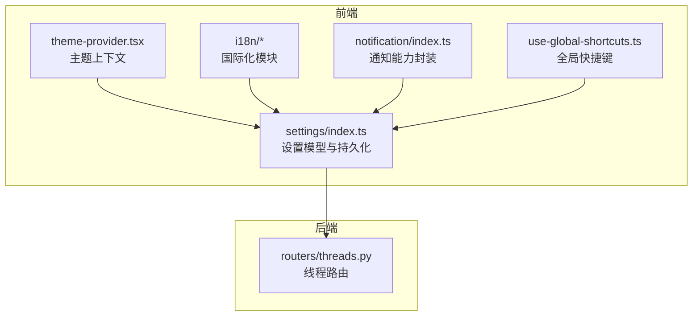
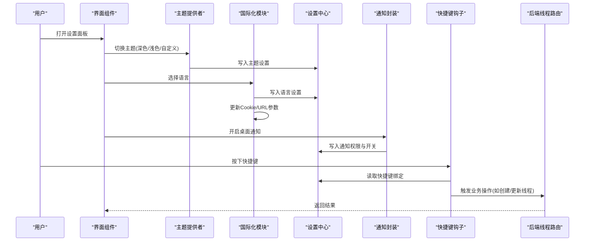
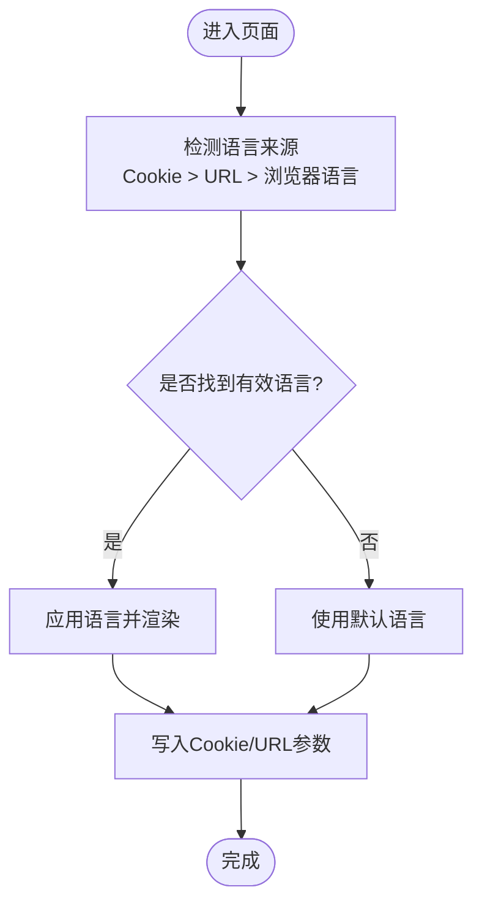
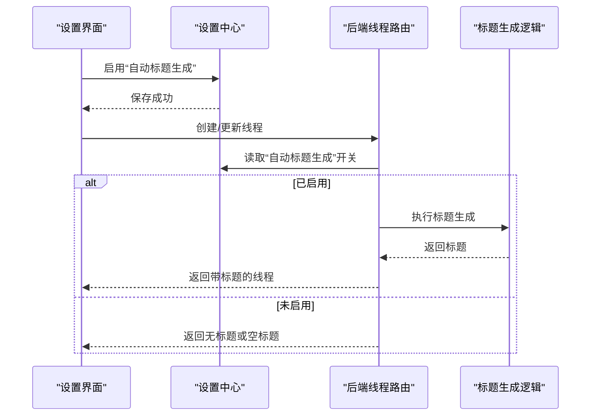
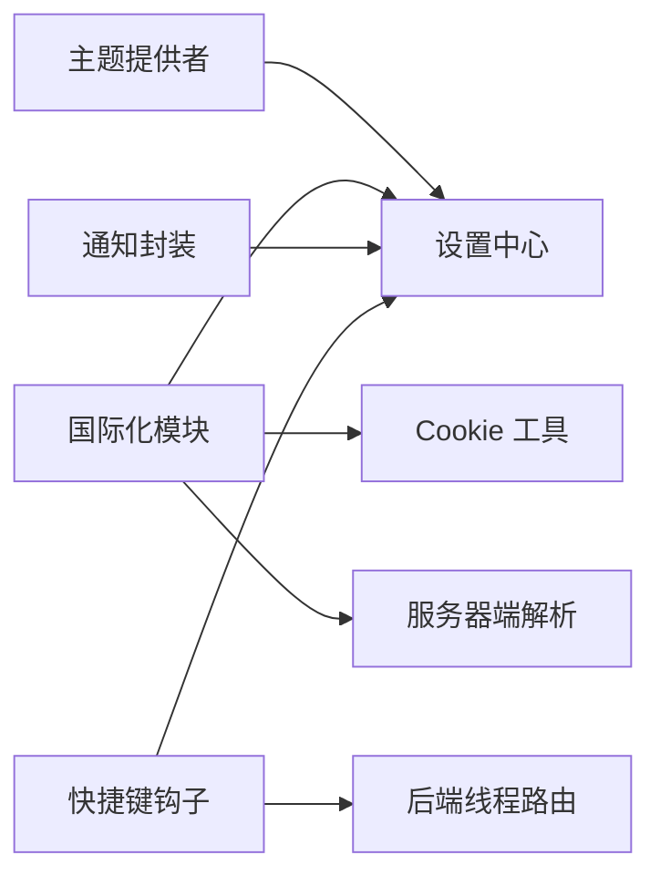

# 用户偏好设置

<cite>
**本文引用的文件**   
- [frontend/src/components/theme-provider.tsx](file://frontend/src/components/theme-provider.tsx)
- [frontend/src/core/i18n/index.ts](file://frontend/src/core/i18n/index.ts)
- [frontend/src/core/i18n/hooks.ts](file://frontend/src/core/i18n/hooks.ts)
- [frontend/src/core/i18n/cookies.ts](file://frontend/src/core/i18n/cookies.ts)
- [frontend/src/core/i18n/locale.ts](file://frontend/src/core/i18n/locale.ts)
- [frontend/src/core/i18n/server.ts](file://frontend/src/core/i18n/server.ts)
- [frontend/src/core/i18n/translations.ts](file://frontend/src/core/i18n/translations.ts)
- [frontend/src/core/settings/index.ts](file://frontend/src/core/settings/index.ts)
- [frontend/src/core/notification/index.ts](file://frontend/src/core/notification/index.ts)
- [frontend/src/hooks/use-global-shortcuts.ts](file://frontend/src/hooks/use-global-shortcuts.ts)
- [backend/app/gateway/routers/threads.py](file://backend/app/gateway/routers/threads.py)
</cite>

## 目录
1. [简介](#简介)
2. [项目结构](#项目结构)
3. [核心组件](#核心组件)
4. [架构总览](#架构总览)
5. [详细组件分析](#详细组件分析)
6. [依赖分析](#依赖分析)
7. [性能考虑](#性能考虑)
8. [故障排查指南](#故障排查指南)
9. [结论](#结论)
10. [附录](#附录)

## 简介
本文件面向最终用户与开发者，系统化说明 Deer Flow 的用户偏好设置能力，覆盖以下方面：
- 界面主题配置：深色模式、浅色模式与自定义主题
- 语言国际化：支持的语言列表与切换机制
- 通知选项：桌面通知、邮件提醒与消息推送的配置方式
- 键盘快捷键自定义与功能开关管理
- 设置数据的本地存储机制与同步策略
- 具体配置示例与常见问题解决方案

## 项目结构
与“用户偏好设置”相关的前端代码主要位于 frontend 目录，后端提供部分运行时数据（如会话标题生成）的接口。关键路径如下：
- 主题与国际化：frontend/src/components/theme-provider.tsx、frontend/src/core/i18n/*
- 设置与通知：frontend/src/core/settings/index.ts、frontend/src/core/notification/index.ts
- 快捷键：frontend/src/hooks/use-global-shortcuts.ts
- 后端相关：backend/app/gateway/routers/threads.py（用于演示设置项如何影响后端行为）

图表来源
- [frontend/src/components/theme-provider.tsx](file://frontend/src/components/theme-provider.tsx)
- [frontend/src/core/i18n/index.ts](file://frontend/src/core/i18n/index.ts)
- [frontend/src/core/settings/index.ts](file://frontend/src/core/settings/index.ts)
- [frontend/src/core/notification/index.ts](file://frontend/src/core/notification/index.ts)
- [frontend/src/hooks/use-global-shortcuts.ts](file://frontend/src/hooks/use-global-shortcuts.ts)
- [backend/app/gateway/routers/threads.py](file://backend/app/gateway/routers/threads.py)

章节来源
- [frontend/src/components/theme-provider.tsx](file://frontend/src/components/theme-provider.tsx)
- [frontend/src/core/i18n/index.ts](file://frontend/src/core/i18n/index.ts)
- [frontend/src/core/settings/index.ts](file://frontend/src/core/settings/index.ts)
- [frontend/src/core/notification/index.ts](file://frontend/src/core/notification/index.ts)
- [frontend/src/hooks/use-global-shortcuts.ts](file://frontend/src/hooks/use-global-shortcuts.ts)
- [backend/app/gateway/routers/threads.py](file://backend/app/gateway/routers/threads.py)

## 核心组件
- 主题提供者：负责应用级主题状态、切换逻辑与样式注入
- 国际化模块：提供语言检测、切换、Cookie 持久化与服务器端解析
- 设置中心：定义设置数据结构、默认值、读写与持久化策略
- 通知封装：封装桌面通知权限与触发流程
- 快捷键钩子：注册全局快捷键并映射到功能动作
- 后端线程路由：读取用户设置以控制某些行为（例如自动标题生成）

章节来源
- [frontend/src/components/theme-provider.tsx](file://frontend/src/components/theme-provider.tsx)
- [frontend/src/core/i18n/index.ts](file://frontend/src/core/i18n/index.ts)
- [frontend/src/core/i18n/hooks.ts](file://frontend/src/core/i18n/hooks.ts)
- [frontend/src/core/i18n/cookies.ts](file://frontend/src/core/i18n/cookies.ts)
- [frontend/src/core/i18n/locale.ts](file://frontend/src/core/i18n/locale.ts)
- [frontend/src/core/i18n/server.ts](file://frontend/src/core/i18n/server.ts)
- [frontend/src/core/settings/index.ts](file://frontend/src/core/settings/index.ts)
- [frontend/src/core/notification/index.ts](file://frontend/src/core/notification/index.ts)
- [frontend/src/hooks/use-global-shortcuts.ts](file://frontend/src/hooks/use-global-shortcuts.ts)
- [backend/app/gateway/routers/threads.py](file://backend/app/gateway/routers/threads.py)

## 架构总览
下图展示“用户偏好设置”在前后端的交互关系与数据流向。

图表来源
- [frontend/src/components/theme-provider.tsx](file://frontend/src/components/theme-provider.tsx)
- [frontend/src/core/i18n/index.ts](file://frontend/src/core/i18n/index.ts)
- [frontend/src/core/settings/index.ts](file://frontend/src/core/settings/index.ts)
- [frontend/src/core/notification/index.ts](file://frontend/src/core/notification/index.ts)
- [frontend/src/hooks/use-global-shortcuts.ts](file://frontend/src/hooks/use-global-shortcuts.ts)
- [backend/app/gateway/routers/threads.py](file://backend/app/gateway/routers/threads.py)

## 详细组件分析

### 界面主题配置
- 支持的视觉模式
  - 深色模式：降低背景亮度，提高对比度，适合夜间或低光环境
  - 浅色模式：标准亮色主题，适合日间或高亮环境
  - 自定义主题：允许通过变量或配置文件调整颜色、字体等视觉元素
- 切换机制
  - 通过主题提供者提供的上下文进行全局切换
  - 切换后即时应用到所有使用主题的组件
- 持久化
  - 主题选择保存到设置中心，刷新页面后保持上次选择
- 最佳实践
  - 避免硬编码颜色，统一从主题变量中取值
  - 为自定义主题提供最小可用配色方案，确保可读性

章节来源
- [frontend/src/components/theme-provider.tsx](file://frontend/src/components/theme-provider.tsx)
- [frontend/src/core/settings/index.ts](file://frontend/src/core/settings/index.ts)

### 语言国际化配置
- 支持的语言
  - 英文(en)、中文(zh) 等（以实际翻译资源为准）
- 切换机制
  - 客户端：通过 hooks 切换当前语言，并更新 Cookie 或 URL 参数
  - 服务端：根据 Cookie 或请求头解析语言，渲染对应内容
- 持久化
  - 优先使用 Cookie 保存语言，保证跨页面一致
  - 若 Cookie 不可用，回退到 URL 参数或浏览器语言
- 扩展新语言
  - 新增翻译资源文件
  - 在索引文件中注册语言键与资源映射
  - 在服务器端解析器中添加语言识别规则

图表来源
- [frontend/src/core/i18n/index.ts](file://frontend/src/core/i18n/index.ts)
- [frontend/src/core/i18n/hooks.ts](file://frontend/src/core/i18n/hooks.ts)
- [frontend/src/core/i18n/cookies.ts](file://frontend/src/core/i18n/cookies.ts)
- [frontend/src/core/i18n/locale.ts](file://frontend/src/core/i18n/locale.ts)
- [frontend/src/core/i18n/server.ts](file://frontend/src/core/i18n/server.ts)
- [frontend/src/core/i18n/translations.ts](file://frontend/src/core/i18n/translations.ts)

章节来源
- [frontend/src/core/i18n/index.ts](file://frontend/src/core/i18n/index.ts)
- [frontend/src/core/i18n/hooks.ts](file://frontend/src/core/i18n/hooks.ts)
- [frontend/src/core/i18n/cookies.ts](file://frontend/src/core/i18n/cookies.ts)
- [frontend/src/core/i18n/locale.ts](file://frontend/src/core/i18n/locale.ts)
- [frontend/src/core/i18n/server.ts](file://frontend/src/core/i18n/server.ts)
- [frontend/src/core/i18n/translations.ts](file://frontend/src/core/i18n/translations.ts)

### 通知选项设置
- 通知类型
  - 桌面通知：基于浏览器 Notification API
  - 邮件提醒：由后端服务发送（需配置 SMTP 或第三方服务）
  - 消息推送：通过通道（如飞书、Slack、Telegram 等）推送
- 权限与可用性
  - 首次启用桌面通知时请求用户授权
  - 若被拒绝，提示用户手动在系统设置中开启
- 配置项建议
  - 是否启用桌面通知
  - 通知事件白名单（如任务完成、错误告警）
  - 邮件地址与模板选择
  - 推送渠道与目标群组/频道

章节来源
- [frontend/src/core/notification/index.ts](file://frontend/src/core/notification/index.ts)
- [frontend/src/core/settings/index.ts](file://frontend/src/core/settings/index.ts)

### 键盘快捷键自定义与功能开关管理
- 快捷键
  - 支持自定义按键组合，映射到常用操作（如新建对话、搜索、导出）
  - 冲突检测：当新绑定与已有快捷键冲突时给出提示
- 功能开关
  - 将可插拔特性抽象为布尔开关，便于按需启用/禁用
  - 开关变更实时生效，无需重启应用
- 持久化
  - 快捷键与开关均保存在设置中心，刷新后保持一致

章节来源
- [frontend/src/hooks/use-global-shortcuts.ts](file://frontend/src/hooks/use-global-shortcuts.ts)
- [frontend/src/core/settings/index.ts](file://frontend/src/core/settings/index.ts)

### 设置数据的本地存储与同步策略
- 本地存储
  - 使用浏览器本地存储（如 localStorage）缓存设置，提升加载速度
  - 对敏感信息不建议明文存储，应加密或交由后端托管
- 同步策略
  - 登录态下：设置变更后同步至后端，多设备间保持一致
  - 未登录态：仅本地持久化，不上传
  - 冲突处理：以最近修改时间戳为准，或采用合并策略
- 版本兼容
  - 设置结构升级时需做迁移脚本，保证旧版本设置可平滑过渡

章节来源
- [frontend/src/core/settings/index.ts](file://frontend/src/core/settings/index.ts)

### 后端联动：设置影响的行为示例
- 线程标题自动生成
  - 当用户在设置中启用“自动标题生成”，后端在创建或更新线程时调用相应逻辑生成标题
  - 该行为可通过设置开关控制，避免不必要的计算开销

图表来源
- [backend/app/gateway/routers/threads.py](file://backend/app/gateway/routers/threads.py)
- [frontend/src/core/settings/index.ts](file://frontend/src/core/settings/index.ts)

章节来源
- [backend/app/gateway/routers/threads.py](file://backend/app/gateway/routers/threads.py)
- [frontend/src/core/settings/index.ts](file://frontend/src/core/settings/index.ts)

## 依赖分析
- 组件耦合
  - 主题提供者依赖设置中心进行持久化
  - 国际化模块依赖 Cookie 与服务器端解析，同时与设置中心协同
  - 通知封装与快捷键钩子均读取设置中心的配置项
- 外部依赖
  - 浏览器 API：Notification、localStorage/Cookie
  - 后端 API：线程路由等接口

图表来源
- [frontend/src/components/theme-provider.tsx](file://frontend/src/components/theme-provider.tsx)
- [frontend/src/core/i18n/index.ts](file://frontend/src/core/i18n/index.ts)
- [frontend/src/core/i18n/cookies.ts](file://frontend/src/core/i18n/cookies.ts)
- [frontend/src/core/i18n/server.ts](file://frontend/src/core/i18n/server.ts)
- [frontend/src/core/settings/index.ts](file://frontend/src/core/settings/index.ts)
- [frontend/src/core/notification/index.ts](file://frontend/src/core/notification/index.ts)
- [frontend/src/hooks/use-global-shortcuts.ts](file://frontend/src/hooks/use-global-shortcuts.ts)
- [backend/app/gateway/routers/threads.py](file://backend/app/gateway/routers/threads.py)

章节来源
- [frontend/src/components/theme-provider.tsx](file://frontend/src/components/theme-provider.tsx)
- [frontend/src/core/i18n/index.ts](file://frontend/src/core/i18n/index.ts)
- [frontend/src/core/i18n/cookies.ts](file://frontend/src/core/i18n/cookies.ts)
- [frontend/src/core/i18n/server.ts](file://frontend/src/core/i18n/server.ts)
- [frontend/src/core/settings/index.ts](file://frontend/src/core/settings/index.ts)
- [frontend/src/core/notification/index.ts](file://frontend/src/core/notification/index.ts)
- [frontend/src/hooks/use-global-shortcuts.ts](file://frontend/src/hooks/use-global-shortcuts.ts)
- [backend/app/gateway/routers/threads.py](file://backend/app/gateway/routers/threads.py)

## 性能考虑
- 主题切换应避免全量重绘，尽量通过 CSS 变量或类名切换
- 国际化资源按需加载，减少首屏体积
- 设置持久化批量写入，避免频繁 IO
- 通知与快捷键监听仅在需要时注册，释放时及时解绑

## 故障排查指南
- 主题未生效
  - 检查主题提供者是否正确包裹根组件
  - 确认设置中心是否成功写入并读取主题值
- 语言切换无效
  - 检查 Cookie 是否被浏览器拦截或过期
  - 确认服务器端解析器能正确识别语言参数
- 桌面通知无法弹出
  - 检查浏览器是否授予通知权限
  - 确认通知开关已启用且事件在白名单内
- 快捷键冲突
  - 查看冲突提示，重新分配按键组合
  - 确认快捷键注册时机与生命周期
- 设置不同步
  - 检查网络状态与登录态
  - 查看后端日志与错误码，确认同步接口正常

章节来源
- [frontend/src/components/theme-provider.tsx](file://frontend/src/components/theme-provider.tsx)
- [frontend/src/core/i18n/index.ts](file://frontend/src/core/i18n/index.ts)
- [frontend/src/core/i18n/cookies.ts](file://frontend/src/core/i18n/cookies.ts)
- [frontend/src/core/i18n/server.ts](file://frontend/src/core/i18n/server.ts)
- [frontend/src/core/settings/index.ts](file://frontend/src/core/settings/index.ts)
- [frontend/src/core/notification/index.ts](file://frontend/src/core/notification/index.ts)
- [frontend/src/hooks/use-global-shortcuts.ts](file://frontend/src/hooks/use-global-shortcuts.ts)
- [backend/app/gateway/routers/threads.py](file://backend/app/gateway/routers/threads.py)

## 结论
通过主题提供者、国际化模块、设置中心、通知封装与快捷键钩子的协作，Deer Flow 提供了完善的用户偏好设置能力。结合后端联动，可实现更智能的体验（如自动标题生成）。建议在后续迭代中完善多设备同步、设置版本迁移与更细粒度的权限控制。

## 附录
- 配置示例（概念性）
  - 主题：{ mode: "dark" | "light" | "custom", customTheme: { ... } }
  - 语言：{ locale: "zh" | "en", fallback: "en" }
  - 通知：{ desktop: true, email: { enabled: false, address: "" }, push: { channels: [] } }
  - 快捷键：{ newChat: ["Ctrl", "N"], search: ["Ctrl", "K"] }
  - 功能开关：{ autoTitle: true, streaming: true }
- 常见问答
  - 问：如何恢复默认设置？
    - 答：在设置面板中选择“恢复默认”，系统将重置为内置默认值并持久化
  - 问：如何在无网络环境下使用设置？
    - 答：设置会保存在本地，联网后再尝试同步
  - 问：如何为新语言添加翻译？
    - 答：新增翻译资源文件并在索引中注册，同时在服务器端解析器中添加识别规则