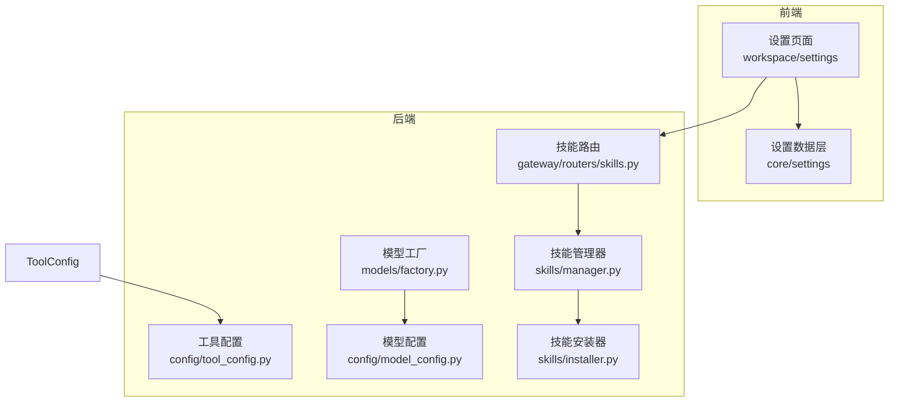
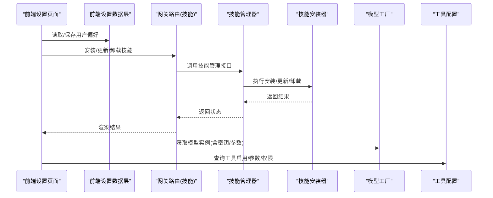
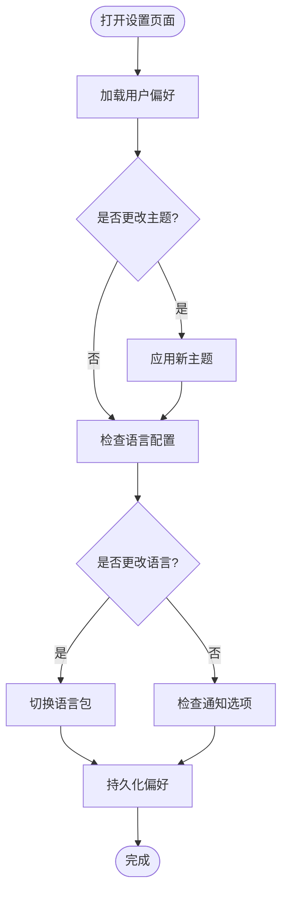
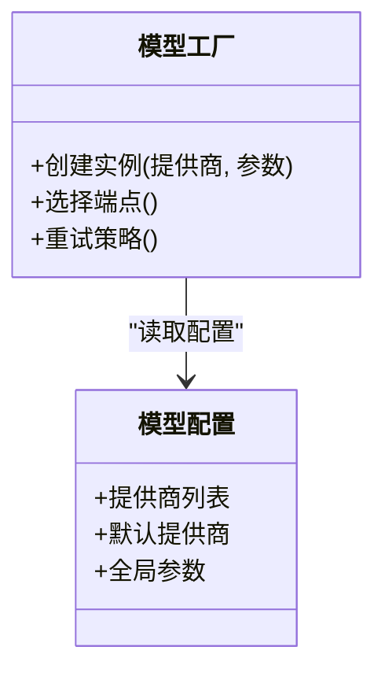
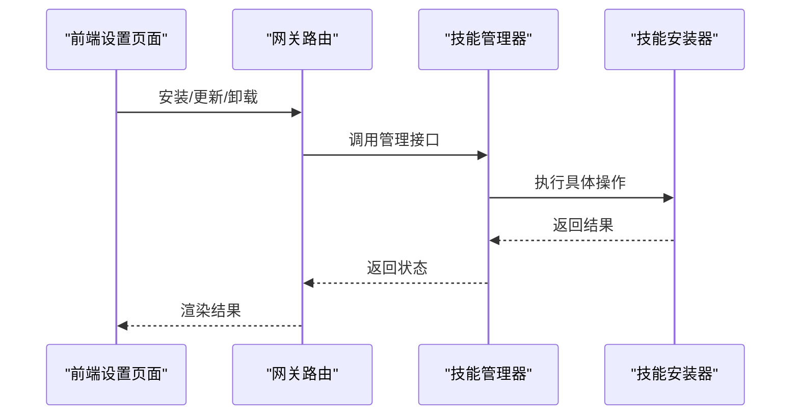
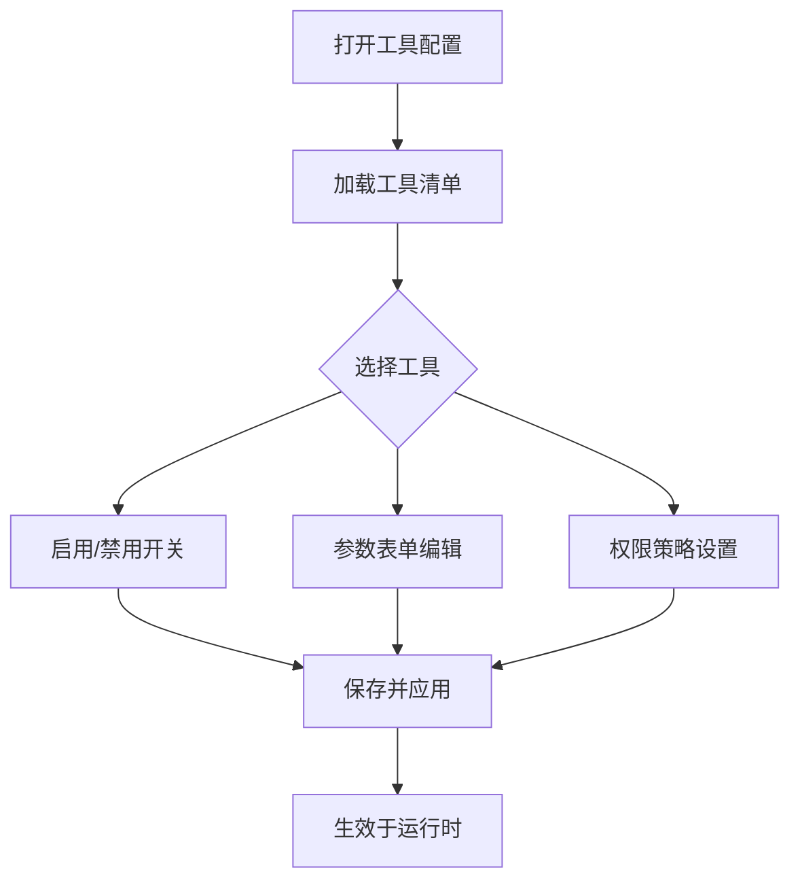
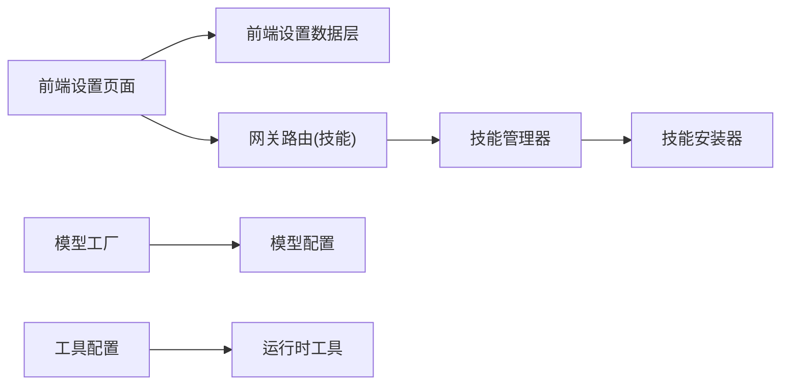

# 设置管理

<cite>
**本文引用的文件**   
- [backend/app/gateway/routers/skills.py](file://backend/app/gateway/routers/skills.py)
- [backend/packages/harness/deerflow/config/tool_config.py](file://backend/packages/harness/deerflow/config/tool_config.py)
- [backend/packages/harness/deerflow/config/model_config.py](file://backend/packages/harness/deerflow/config/model_config.py)
- [backend/packages/harness/deerflow/models/factory.py](file://backend/packages/harness/deerflow/models/factory.py)
- [backend/packages/harness/deerflow/skills/manager.py](file://backend/packages/harness/deerflow/skills/manager.py)
- [backend/packages/harness/deerflow/skills/installer.py](file://backend/packages/harness/deerflow/skills/installer.py)
- [frontend/src/components/workspace/settings/index.tsx](file://frontend/src/components/workspace/settings/index.tsx)
- [frontend/src/core/settings/index.ts](file://frontend/src/core/settings/index.ts)
- [config.example.yaml](file://config.example.yaml)
</cite>

## 目录
1. [简介](#简介)
2. [项目结构](#项目结构)
3. [核心组件](#核心组件)
4. [架构总览](#架构总览)
5. [详细组件分析](#详细组件分析)
6. [依赖分析](#依赖分析)
7. [性能考虑](#性能考虑)
8. [故障排查指南](#故障排查指南)
9. [结论](#结论)
10. [附录](#附录)

## 简介
本文件面向“设置管理”能力，覆盖用户偏好设置、模型提供商配置、技能管理界面、工具配置面板与高级设置选项，并说明设置数据的同步机制与备份恢复流程。文档以仓库现有实现为依据，提供从前端到后端的端到端视图，帮助读者快速理解并正确使用各项设置功能。

## 项目结构
设置相关的前后端职责划分如下：
- 前端
  - 设置入口与页面组织：位于工作区设置模块中，负责展示各分类设置项并提供交互。
  - 设置数据层：封装本地存储、国际化与默认值合并等逻辑。
- 后端
  - 网关路由：暴露技能管理等设置相关的 API。
  - 配置模型：定义工具、模型等配置的加载与校验。
  - 运行时工厂：根据配置动态创建模型实例（含密钥与参数）。
  - 技能管理器：负责技能的安装、更新、卸载与生命周期管理。

图表来源
- [backend/app/gateway/routers/skills.py](file://backend/app/gateway/routers/skills.py)
- [backend/packages/harness/deerflow/config/tool_config.py](file://backend/packages/harness/deerflow/config/tool_config.py)
- [backend/packages/harness/deerflow/config/model_config.py](file://backend/packages/harness/deerflow/config/model_config.py)
- [backend/packages/harness/deerflow/models/factory.py](file://backend/packages/harness/deerflow/models/factory.py)
- [backend/packages/harness/deerflow/skills/manager.py](file://backend/packages/harness/deerflow/skills/manager.py)
- [backend/packages/harness/deerflow/skills/installer.py](file://backend/packages/harness/deerflow/skills/installer.py)
- [frontend/src/components/workspace/settings/index.tsx](file://frontend/src/components/workspace/settings/index.tsx)
- [frontend/src/core/settings/index.ts](file://frontend/src/core/settings/index.ts)

章节来源
- [frontend/src/components/workspace/settings/index.tsx](file://frontend/src/components/workspace/settings/index.tsx)
- [frontend/src/core/settings/index.ts](file://frontend/src/core/settings/index.ts)
- [backend/app/gateway/routers/skills.py](file://backend/app/gateway/routers/skills.py)
- [backend/packages/harness/deerflow/config/tool_config.py](file://backend/packages/harness/deerflow/config/tool_config.py)
- [backend/packages/harness/deerflow/config/model_config.py](file://backend/packages/harness/deerflow/config/model_config.py)
- [backend/packages/harness/deerflow/models/factory.py](file://backend/packages/harness/deerflow/models/factory.py)
- [backend/packages/harness/deerflow/skills/manager.py](file://backend/packages/harness/deerflow/skills/manager.py)
- [backend/packages/harness/deerflow/skills/installer.py](file://backend/packages/harness/deerflow/skills/installer.py)

## 核心组件
- 用户偏好设置
  - 界面主题：由前端设置页面提供切换入口，结合主题上下文生效。
  - 语言配置：通过前端 i18n 模块加载对应语言包，持久化至本地存储。
  - 通知选项：在设置页中开关各类通知渠道或提示策略。
- 模型提供商配置
  - API 密钥管理：在后端模型工厂中按提供商注入密钥，避免硬编码。
  - 参数调优：支持温度、最大令牌数、重试次数等参数的集中配置。
  - 负载均衡：在多实例或多端点场景下，通过工厂选择与重试策略提升可用性。
- 技能管理界面
  - 安装：通过后端技能安装器拉取并验证技能包，注册到管理器。
  - 更新：检测版本差异并执行增量更新。
  - 卸载：移除已安装技能及其关联资源。
- 工具配置面板
  - 启用/禁用：基于工具配置中心控制工具可用性与可见性。
  - 参数设置：为每个工具提供可编辑的参数键值对。
  - 权限控制：依据角色或范围限制工具的调用权限。
- 高级设置选项
  - 调试模式：开启详细日志与中间件追踪。
  - 日志级别：全局调整日志输出粒度。
  - 性能监控：采集关键指标（如延迟、错误率）供观测。

章节来源
- [frontend/src/components/workspace/settings/index.tsx](file://frontend/src/components/workspace/settings/index.tsx)
- [frontend/src/core/settings/index.ts](file://frontend/src/core/settings/index.ts)
- [backend/packages/harness/deerflow/config/model_config.py](file://backend/packages/harness/deerflow/config/model_config.py)
- [backend/packages/harness/deerflow/models/factory.py](file://backend/packages/harness/deerflow/models/factory.py)
- [backend/packages/harness/deerflow/skills/manager.py](file://backend/packages/harness/deerflow/skills/manager.py)
- [backend/packages/harness/deerflow/skills/installer.py](file://backend/packages/harness/deerflow/skills/installer.py)
- [backend/packages/harness/deerflow/config/tool_config.py](file://backend/packages/harness/deerflow/config/tool_config.py)

## 架构总览
下图展示了设置管理的端到端调用链：前端设置页面发起请求，网关路由转发至技能管理器，后者协调安装器完成具体操作；同时，模型工厂依据模型配置构建运行时实例，工具配置中心统一管控工具行为。

图表来源
- [backend/app/gateway/routers/skills.py](file://backend/app/gateway/routers/skills.py)
- [backend/packages/harness/deerflow/skills/manager.py](file://backend/packages/harness/deerflow/skills/manager.py)
- [backend/packages/harness/deerflow/skills/installer.py](file://backend/packages/harness/deerflow/skills/installer.py)
- [backend/packages/harness/deerflow/models/factory.py](file://backend/packages/harness/deerflow/models/factory.py)
- [backend/packages/harness/deerflow/config/tool_config.py](file://backend/packages/harness/deerflow/config/tool_config.py)
- [frontend/src/components/workspace/settings/index.tsx](file://frontend/src/components/workspace/settings/index.tsx)
- [frontend/src/core/settings/index.ts](file://frontend/src/core/settings/index.ts)

## 详细组件分析

### 用户偏好设置
- 界面主题
  - 前端提供主题切换入口，并在设置数据层中持久化当前主题。
  - 主题变更即时生效，无需重启服务。
- 语言配置
  - 通过 i18n 模块加载对应语言包，支持热切换。
  - 语言偏好保存在本地存储，下次启动自动应用。
- 通知选项
  - 提供开关项用于控制不同通知渠道的显示与触发策略。
  - 与系统通知或站内消息集成，遵循最小打扰原则。

章节来源
- [frontend/src/components/workspace/settings/index.tsx](file://frontend/src/components/workspace/settings/index.tsx)
- [frontend/src/core/settings/index.ts](file://frontend/src/core/settings/index.ts)

### 模型提供商配置
- API 密钥管理
  - 密钥由后端模型工厂按需注入，避免在前端暴露敏感信息。
  - 支持多提供商并存，按名称或标识选择目标实例。
- 参数调优
  - 提供通用参数（如温度、最大令牌数、重试次数）与提供商特定参数。
  - 参数变更实时生效，影响后续推理调用。
- 负载均衡
  - 在多个端点或实例间进行分发与失败重试，提高稳定性。
  - 可通过配置指定权重或健康检查策略。

图表来源
- [backend/packages/harness/deerflow/config/model_config.py](file://backend/packages/harness/deerflow/config/model_config.py)
- [backend/packages/harness/deerflow/models/factory.py](file://backend/packages/harness/deerflow/models/factory.py)

章节来源
- [backend/packages/harness/deerflow/config/model_config.py](file://backend/packages/harness/deerflow/config/model_config.py)
- [backend/packages/harness/deerflow/models/factory.py](file://backend/packages/harness/deerflow/models/factory.py)

### 技能管理界面
- 安装
  - 前端发起安装请求，网关路由转发至技能管理器。
  - 安装器拉取技能包、校验完整性并注册到运行环境。
- 更新
  - 检测远程版本与本地版本差异，执行增量更新。
  - 更新失败时回滚至上一稳定版本。
- 卸载
  - 移除技能文件与元数据，释放占用资源。
  - 卸载前检查是否有任务正在使用该技能。

图表来源
- [backend/app/gateway/routers/skills.py](file://backend/app/gateway/routers/skills.py)
- [backend/packages/harness/deerflow/skills/manager.py](file://backend/packages/harness/deerflow/skills/manager.py)
- [backend/packages/harness/deerflow/skills/installer.py](file://backend/packages/harness/deerflow/skills/installer.py)

章节来源
- [backend/app/gateway/routers/skills.py](file://backend/app/gateway/routers/skills.py)
- [backend/packages/harness/deerflow/skills/manager.py](file://backend/packages/harness/deerflow/skills/manager.py)
- [backend/packages/harness/deerflow/skills/installer.py](file://backend/packages/harness/deerflow/skills/installer.py)

### 工具配置面板
- 启用/禁用
  - 通过工具配置中心控制工具的全局开关与可见性。
  - 支持按会话或角色维度临时启用。
- 参数设置
  - 为每个工具提供参数表单，支持类型校验与默认值。
  - 参数变更即时生效，无需重启。
- 权限控制
  - 基于角色或范围限制工具的调用权限。
  - 未授权调用将被拒绝并记录审计日志。

章节来源
- [backend/packages/harness/deerflow/config/tool_config.py](file://backend/packages/harness/deerflow/config/tool_config.py)

### 高级设置选项
- 调试模式
  - 开启后输出更详细的中间件与调用链路信息。
  - 建议仅在开发或问题定位时启用。
- 日志级别
  - 支持全局调整日志输出粒度（如 INFO、DEBUG、ERROR）。
  - 高日志级别可能带来额外 I/O 开销。
- 性能监控
  - 采集关键指标（延迟、吞吐、错误率）以供观测。
  - 可与外部监控系统对接，便于告警与容量规划。

章节来源
- [config.example.yaml](file://config.example.yaml)

## 依赖分析
- 前端设置页面依赖设置数据层，负责 UI 交互与本地持久化。
- 网关路由依赖技能管理器，后者再依赖安装器完成具体操作。
- 模型工厂依赖模型配置，工具配置中心独立管理工具行为。
- 配置文件作为权威源，驱动后端行为与前端默认值。

图表来源
- [frontend/src/components/workspace/settings/index.tsx](file://frontend/src/components/workspace/settings/index.tsx)
- [frontend/src/core/settings/index.ts](file://frontend/src/core/settings/index.ts)
- [backend/app/gateway/routers/skills.py](file://backend/app/gateway/routers/skills.py)
- [backend/packages/harness/deerflow/skills/manager.py](file://backend/packages/harness/deerflow/skills/manager.py)
- [backend/packages/harness/deerflow/skills/installer.py](file://backend/packages/harness/deerflow/skills/installer.py)
- [backend/packages/harness/deerflow/models/factory.py](file://backend/packages/harness/deerflow/models/factory.py)
- [backend/packages/harness/deerflow/config/model_config.py](file://backend/packages/harness/deerflow/config/model_config.py)
- [backend/packages/harness/deerflow/config/tool_config.py](file://backend/packages/harness/deerflow/config/tool_config.py)

章节来源
- [frontend/src/components/workspace/settings/index.tsx](file://frontend/src/components/workspace/settings/index.tsx)
- [frontend/src/core/settings/index.ts](file://frontend/src/core/settings/index.ts)
- [backend/app/gateway/routers/skills.py](file://backend/app/gateway/routers/skills.py)
- [backend/packages/harness/deerflow/skills/manager.py](file://backend/packages/harness/deerflow/skills/manager.py)
- [backend/packages/harness/deerflow/skills/installer.py](file://backend/packages/harness/deerflow/skills/installer.py)
- [backend/packages/harness/deerflow/models/factory.py](file://backend/packages/harness/deerflow/models/factory.py)
- [backend/packages/harness/deerflow/config/model_config.py](file://backend/packages/harness/deerflow/config/model_config.py)
- [backend/packages/harness/deerflow/config/tool_config.py](file://backend/packages/harness/deerflow/config/tool_config.py)

## 性能考虑
- 模型调用
  - 合理设置重试次数与超时时间，避免雪崩效应。
  - 使用连接池与缓存减少重复初始化成本。
- 技能安装/更新
  - 增量更新优先，减少网络与磁盘 I/O。
  - 并行下载与校验，提升安装速度。
- 工具配置
  - 批量更新时采用事务式提交，保证一致性。
  - 高频读路径增加缓存，降低配置中心压力。
- 日志与监控
  - 生产环境谨慎开启高日志级别，避免性能退化。
  - 采样上报监控指标，平衡精度与开销。

[本节为通用指导，不直接分析具体文件]

## 故障排查指南
- 模型调用失败
  - 检查 API 密钥是否正确注入与有效。
  - 确认提供商端点可达且配额充足。
  - 查看重试与降级策略是否生效。
- 技能安装/更新异常
  - 核对技能包完整性与签名。
  - 检查网络连通性与镜像/仓库访问权限。
  - 查看安装器日志定位具体失败阶段。
- 工具不可用
  - 确认工具开关与权限策略。
  - 检查参数校验与默认值是否合法。
  - 查看工具运行时的错误日志与审计记录。

章节来源
- [backend/packages/harness/deerflow/models/factory.py](file://backend/packages/harness/deerflow/models/factory.py)
- [backend/packages/harness/deerflow/skills/installer.py](file://backend/packages/harness/deerflow/skills/installer.py)
- [backend/packages/harness/deerflow/config/tool_config.py](file://backend/packages/harness/deerflow/config/tool_config.py)

## 结论
设置管理贯穿前后端，涵盖用户偏好、模型配置、技能与工具管理以及高级选项。通过清晰的职责划分与模块化设计，系统实现了灵活的配置管理与稳定的运行时行为。建议在部署与运维中重视密钥安全、参数调优与监控告警，以获得最佳的用户体验与系统可靠性。

[本节为总结性内容，不直接分析具体文件]

## 附录
- 示例配置
  - 参考示例配置文件了解可用的全局设置项与默认值。
- 术语表
  - 技能：可插拔的功能单元，包含脚本、模板与描述。
  - 工具：可在对话或任务中调用的能力，受配置与权限控制。
  - 模型工厂：根据配置动态创建模型实例的组件。

章节来源
- [config.example.yaml](file://config.example.yaml)