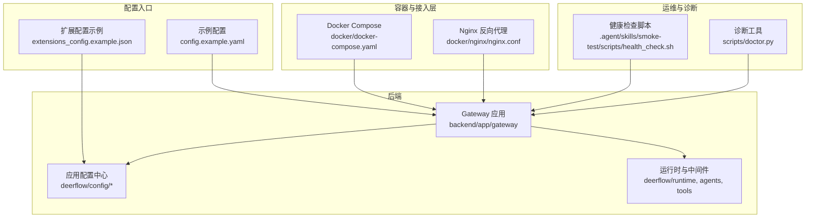
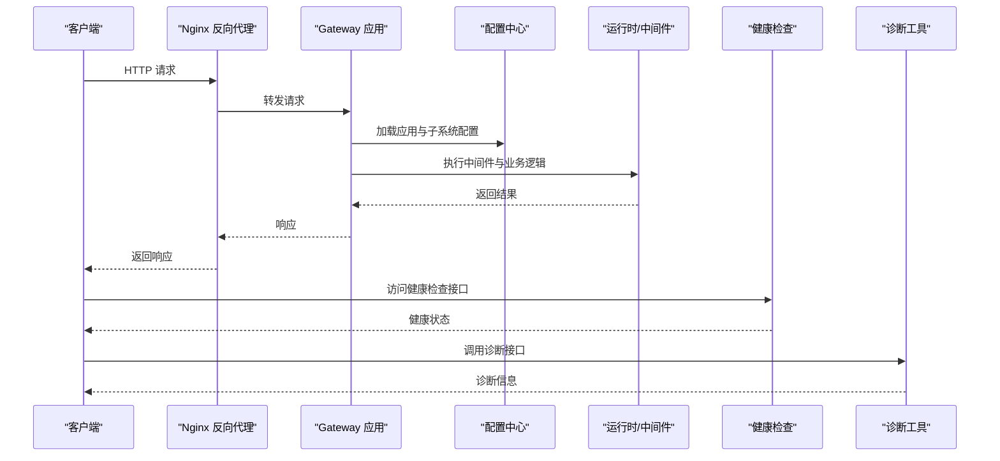

# 高级设置

<cite>
**本文引用的文件**   
- [config.example.yaml](file://config.example.yaml)
- [extensions_config.example.json](file://extensions_config.example.json)
- [backend/app/gateway/config.py](file://backend/app/gateway/config.py)
- [backend/app/gateway/app.py](file://backend/app/gateway/app.py)
- [backend/packages/harness/deerflow/config/app_config.py](file://backend/packages/harness/deerflow/config/app_config.py)
- [backend/packages/harness/deerflow/config/tracing_config.py](file://backend/packages/harness/deerflow/config/tracing_config.py)
- [backend/packages/harness/deerflow/config/memory_config.py](file://backend/packages/harness/deerflow/config/memory_config.py)
- [backend/packages/harness/deerflow/config/model_config.py](file://backend/packages/harness/deerflow/config/model_config.py)
- [backend/packages/harness/deerflow/config/tool_config.py](file://backend/packages/harness/deerflow/config/tool_config.py)
- [backend/packages/harness/deerflow/config/sandbox_config.py](file://backend/packages/harness/deerflow/config/sandbox_config.py)
- [backend/packages/harness/deerflow/config/stream_bridge_config.py](file://backend/packages/harness/deerflow/config/stream_bridge_config.py)
- [backend/packages/harness/deerflow/config/agents_config.py](file://backend/packages/harness/deerflow/config/agents_config.py)
- [backend/packages/harness/deerflow/config/checkpointer_config.py](file://backend/packages/harness/deerflow/config/checkpointer_config.py)
- [backend/packages/harness/deerflow/config/token_usage_config.py](file://backend/packages/harness/deerflow/config/token_usage_config.py)
- [backend/packages/harness/deerflow/config/title_config.py](file://backend/packages/harness/deerflow/config/title_config.py)
- [backend/packages/harness/deerflow/config/teams_config.py](file://backend/packages/harness/deerflow/config/teams_config.py)
- [backend/packages/harness/deerflow/config/subagents_config.py](file://backend/packages/harness/deerflow/config/subagents_config.py)
- [backend/packages/harness/deerflow/config/extensions_config.py](file://backend/packages/harness/deerflow/config/extensions_config.py)
- [backend/packages/harness/deerflow/config/acp_config.py](file://backend/packages/harness/deerflow/config/acp_config.py)
- [backend/packages/harness/deerflow/config/guardrails_config.py](file://backend/packages/harness/deerflow/config/guardrails_config.py)
- [backend/packages/harness/deerflow/config/skills_config.py](file://backend/packages/harness/deerflow/config/skills_config.py)
- [backend/packages/harness/deerflow/config/tool_search_config.py](file://backend/packages/harness/deerflow/config/tool_search_config.py)
- [backend/packages/harness/deerflow/config/summarization_config.py](file://backend/packages/harness/deerflow/config/summarization_config.py)
- [backend/packages/harness/deerflow/config/paths.py](file://backend/packages/harness/deerflow/config/paths.py)
- [backend/debug.py](file://backend/debug.py)
- [docker/docker-compose.yaml](file://docker/docker-compose.yaml)
- [docker/nginx/nginx.conf](file://docker/nginx/nginx.conf)
- [.agent/skills/smoke-test/scripts/health_check.sh](file://.agent/skills/smoke-test/scripts/health_check.sh)
- [scripts/doctor.py](file://scripts/doctor.py)
</cite>

## 目录
1. [简介](#简介)
2. [项目结构](#项目结构)
3. [核心组件](#核心组件)
4. [架构总览](#架构总览)
5. [详细组件分析](#详细组件分析)
6. [依赖关系分析](#依赖关系分析)
7. [性能考虑](#性能考虑)
8. [故障排查指南](#故障排查指南)
9. [结论](#结论)
10. [附录](#附录)

## 简介
本章节面向生产与运维读者，系统化阐述 deer-flow 的高级设置能力，覆盖调试模式、日志级别与轮转、性能分析与监控指标、缓存与内存优化、数据库连接池与并发、健康检查与诊断工具，以及生产部署最佳实践与常见问题排查。文档以配置为中心，结合后端网关与应用配置模块，给出可操作的调优建议与可视化方案。

## 项目结构
本项目采用前后端分离与多包组织：
- 后端网关位于 backend/app/gateway，负责应用启动、路由与服务装配。
- 业务与运行时逻辑位于 backend/packages/harness/deerflow，包含大量配置子模块（app_config、tracing_config、memory_config、model_config 等）。
- 容器化与反向代理在 docker 目录下提供 compose 与 nginx 配置。
- 根级示例配置文件 config.example.yaml 与 extensions_config.example.json 提供默认参数参考。
- 诊断与健康检查脚本位于 .agent/skills/smoke-test/scripts 与 scripts 目录。

图表来源
- [backend/app/gateway/app.py](file://backend/app/gateway/app.py)
- [backend/app/gateway/config.py](file://backend/app/gateway/config.py)
- [backend/packages/harness/deerflow/config/app_config.py](file://backend/packages/harness/deerflow/config/app_config.py)
- [docker/docker-compose.yaml](file://docker/docker-compose.yaml)
- [docker/nginx/nginx.conf](file://docker/nginx/nginx.conf)
- [.agent/skills/smoke-test/scripts/health_check.sh](file://.agent/skills/smoke-test/scripts/health_check.sh)
- [scripts/doctor.py](file://scripts/doctor.py)

章节来源
- [backend/app/gateway/app.py](file://backend/app/gateway/app.py)
- [backend/app/gateway/config.py](file://backend/app/gateway/config.py)
- [backend/packages/harness/deerflow/config/app_config.py](file://backend/packages/harness/deerflow/config/app_config.py)
- [docker/docker-compose.yaml](file://docker/docker-compose.yaml)
- [docker/nginx/nginx.conf](file://docker/nginx/nginx.conf)
- [.agent/skills/smoke-test/scripts/health_check.sh](file://.agent/skills/smoke-test/scripts/health_check.sh)
- [scripts/doctor.py](file://scripts/doctor.py)

## 核心组件
- 应用配置中心：聚合各子系统配置（应用、追踪、内存、模型、工具、沙箱、流桥、代理、技能、标题生成、团队、子代理、令牌用量等），为网关与运行时提供统一读取接口。
- 网关应用：加载配置、注册路由、挂载中间件、暴露健康与诊断接口。
- 容器与接入层：通过 Docker Compose 编排服务，Nginx 作为反向代理与静态资源入口。
- 运维与诊断：健康检查脚本与诊断工具辅助定位问题。

章节来源
- [backend/packages/harness/deerflow/config/app_config.py](file://backend/packages/harness/deerflow/config/app_config.py)
- [backend/app/gateway/app.py](file://backend/app/gateway/app.py)
- [docker/docker-compose.yaml](file://docker/docker-compose.yaml)
- [docker/nginx/nginx.conf](file://docker/nginx/nginx.conf)

## 架构总览
下图展示从外部请求到内部处理的关键路径，以及配置与监控的接入点。

图表来源
- [docker/nginx/nginx.conf](file://docker/nginx/nginx.conf)
- [backend/app/gateway/app.py](file://backend/app/gateway/app.py)
- [backend/packages/harness/deerflow/config/app_config.py](file://backend/packages/harness/deerflow/config/app_config.py)
- [.agent/skills/smoke-test/scripts/health_check.sh](file://.agent/skills/smoke-test/scripts/health_check.sh)
- [scripts/doctor.py](file://scripts/doctor.py)

## 详细组件分析

### 调试模式与详细日志输出
- 调试开关：通常由环境变量或配置项控制，用于启用更详细的日志与额外诊断信息。建议在开发环境开启，在生产环境谨慎使用。
- 日志级别：支持多级日志（如 DEBUG/INFO/WARNING/ERROR），可通过配置集中管理。建议生产默认 INFO，仅在定位问题时临时提升。
- 日志轮转策略：建议按大小或时间进行轮转，保留固定数量与时长，避免磁盘占满。可结合系统日志收集器（如 journald、Fluent Bit）统一采集。
- 结构化日志：推荐 JSON 格式输出，便于检索与分析。

章节来源
- [backend/app/gateway/config.py](file://backend/app/gateway/config.py)
- [backend/packages/harness/deerflow/config/app_config.py](file://backend/packages/harness/deerflow/config/app_config.py)
- [config.example.yaml](file://config.example.yaml)

### 性能分析与追踪
- 追踪配置：通过 tracing_config 启用分布式追踪与采样策略，对接外部追踪平台（如 OpenTelemetry、Langfuse 等）。
- 指标收集：可在关键路径埋点，收集延迟、吞吐、错误率等指标，并导出至监控系统（Prometheus/Grafana）。
- 可视化：将指标与追踪数据接入可视化平台，建立仪表盘与告警规则。

章节来源
- [backend/packages/harness/deerflow/config/tracing_config.py](file://backend/packages/harness/deerflow/config/tracing_config.py)
- [backend/packages/harness/deerflow/config/app_config.py](file://backend/packages/harness/deerflow/config/app_config.py)

### 日志级别与轮转策略
- 级别设置：根据运行阶段调整全局与模块级日志级别，避免过度输出影响性能。
- 轮转策略：按文件大小或周期切分，限制保留份数与生命周期；对敏感信息进行脱敏。
- 输出目标：控制台、文件、远程日志服务均可配置。

章节来源
- [backend/app/gateway/config.py](file://backend/app/gateway/config.py)
- [config.example.yaml](file://config.example.yaml)

### 性能监控指标与可视化
- 指标维度：请求耗时、队列长度、缓存命中率、数据库连接池使用率、CPU/内存占用、LLM 调用统计等。
- 采集方式：应用内埋点 + 系统探针（进程、容器、网络）。
- 可视化：Grafana 面板模板与告警阈值建议。

章节来源
- [backend/packages/harness/deerflow/config/app_config.py](file://backend/packages/harness/deerflow/config/app_config.py)
- [backend/packages/harness/deerflow/config/tracing_config.py](file://backend/packages/harness/deerflow/config/tracing_config.py)

### 缓存策略与内存使用优化
- 缓存策略：针对高频查询与计算结果启用缓存，合理设置 TTL 与容量上限。
- 内存优化：控制对象大小、减少大对象驻留、及时释放引用；对长会话与历史消息进行压缩或归档。
- 监控：关注堆内存、GC 行为与缓存命中率。

章节来源
- [backend/packages/harness/deerflow/config/memory_config.py](file://backend/packages/harness/deerflow/config/memory_config.py)
- [backend/packages/harness/deerflow/config/app_config.py](file://backend/packages/harness/deerflow/config/app_config.py)

### 数据库连接池与并发处理
- 连接池：配置最大连接数、空闲超时、获取超时与重试策略，避免连接泄漏。
- 并发：合理设置工作进程/线程数，结合 CPU 与 IO 特性调优；对阻塞操作引入异步或队列。
- 监控：连接池使用率、等待时间、失败率。

章节来源
- [backend/packages/harness/deerflow/config/app_config.py](file://backend/packages/harness/deerflow/config/app_config.py)

### 模型与工具配置
- 模型配置：选择模型提供商、鉴权方式、速率限制与回退策略。
- 工具配置：启用/禁用工具、限流与超时、安全扫描与沙箱隔离。
- 技能与搜索：技能安装与版本管理、工具搜索索引更新策略。

章节来源
- [backend/packages/harness/deerflow/config/model_config.py](file://backend/packages/harness/deerflow/config/model_config.py)
- [backend/packages/harness/deerflow/config/tool_config.py](file://backend/packages/harness/deerflow/config/tool_config.py)
- [backend/packages/harness/deerflow/config/skills_config.py](file://backend/packages/harness/deerflow/config/skills_config.py)
- [backend/packages/harness/deerflow/config/tool_search_config.py](file://backend/packages/harness/deerflow/config/tool_search_config.py)

### 沙箱与流式桥接
- 沙箱：代码执行隔离、文件系统访问控制、资源配额与安全策略。
- 流式桥接：SSE/WebSocket 流式传输配置、背压与断线重连。

章节来源
- [backend/packages/harness/deerflow/config/sandbox_config.py](file://backend/packages/harness/deerflow/config/sandbox_config.py)
- [backend/packages/harness/deerflow/config/stream_bridge_config.py](file://backend/packages/harness/deerflow/config/stream_bridge_config.py)

### 代理、守卫与权限
- ACP 代理：代理模式、认证与授权、审计日志。
- 守卫（Guardrails）：内容安全策略、输入输出校验、违规拦截。

章节来源
- [backend/packages/harness/deerflow/config/acp_config.py](file://backend/packages/harness/deerflow/config/acp_config.py)
- [backend/packages/harness/deerflow/config/guardrails_config.py](file://backend/packages/harness/deerflow/config/guardrails_config.py)

### 主题、标题与摘要
- 标题生成：自动标题策略、触发条件与质量评估。
- 摘要：长对话摘要策略、窗口大小与压缩算法。

章节来源
- [backend/packages/harness/deerflow/config/title_config.py](file://backend/packages/harness/deerflow/config/title_config.py)
- [backend/packages/harness/deerflow/config/summarization_config.py](file://backend/packages/harness/deerflow/config/summarization_config.py)

### 团队与子代理
- 团队：角色分工、协作协议与任务分配。
- 子代理：并发度、超时与降级策略。

章节来源
- [backend/packages/harness/deerflow/config/teams_config.py](file://backend/packages/harness/deerflow/config/teams_config.py)
- [backend/packages/harness/deerflow/config/subagents_config.py](file://backend/packages/harness/deerflow/config/subagents_config.py)

### 检查点与持久化
- 检查点：状态快照策略、存储后端与恢复机制。
- 路径与存储：数据目录、备份与迁移策略。

章节来源
- [backend/packages/harness/deerflow/config/checkpointer_config.py](file://backend/packages/harness/deerflow/config/checkpointer_config.py)
- [backend/packages/harness/deerflow/config/paths.py](file://backend/packages/harness/deerflow/config/paths.py)

### 令牌用量与成本管控
- 用量统计：按模型、会话、用户维度统计令牌消耗。
- 预算与告警：设定预算上限与超阈告警。

章节来源
- [backend/packages/harness/deerflow/config/token_usage_config.py](file://backend/packages/harness/deerflow/config/token_usage_config.py)

### 扩展与插件
- 扩展配置：动态加载、版本兼容与热更新。
- 插件生态：第三方集成与自定义扩展点。

章节来源
- [backend/packages/harness/deerflow/config/extensions_config.py](file://backend/packages/harness/deerflow/config/extensions_config.py)
- [extensions_config.example.json](file://extensions_config.example.json)

### 健康检查与诊断工具
- 健康检查：提供就绪与存活探针，供编排系统与负载均衡检测。
- 诊断工具：收集运行时状态、依赖连通性、配置一致性等信息。

章节来源
- [.agent/skills/smoke-test/scripts/health_check.sh](file://.agent/skills/smoke-test/scripts/health_check.sh)
- [scripts/doctor.py](file://scripts/doctor.py)

## 依赖关系分析
配置模块之间相互独立且职责清晰，网关与应用配置中心解耦，便于替换与扩展。

```mermaid
classDiagram
class AppConfig {
+加载应用配置
+合并默认值
+暴露统一接口
}
class TracingConfig {
+启用追踪
+采样策略
+导出配置
}
class MemoryConfig {
+缓存策略
+内存优化
+监控指标
}
class ModelConfig {
+模型选择
+鉴权与限流
+回退策略
}
class ToolConfig {
+工具开关
+超时与重试
+安全策略
}
class SandboxConfig {
+执行隔离
+资源配额
+安全扫描
}
class StreamBridgeConfig {
+流式传输
+背压控制
+断线重连
}
class AgentsConfig {
+代理配置
+权限与审计
}
class CheckpointerConfig {
+检查点策略
+存储后端
}
class TokenUsageConfig {
+用量统计
+预算与告警
}
class TitleConfig {
+标题生成
+触发条件
}
class TeamsConfig {
+团队协作
+任务分配
}
class SubagentsConfig {
+子代理并发
+超时与降级
}
class ExtensionsConfig {
+扩展加载
+版本兼容
}
class AcpConfig {
+ACP 代理
+认证授权
}
class GuardrailsConfig {
+内容安全
+输入输出校验
}
class SkillsConfig {
+技能管理
+安装与更新
}
class ToolSearchConfig {
+工具搜索
+索引更新
}
class SummarizationConfig {
+摘要策略
+压缩算法
}
class PathsConfig {
+路径配置
+数据目录
}
AppConfig --> TracingConfig : "组合"
AppConfig --> MemoryConfig : "组合"
AppConfig --> ModelConfig : "组合"
AppConfig --> ToolConfig : "组合"
AppConfig --> SandboxConfig : "组合"
AppConfig --> StreamBridgeConfig : "组合"
AppConfig --> AgentsConfig : "组合"
AppConfig --> CheckpointerConfig : "组合"
AppConfig --> TokenUsageConfig : "组合"
AppConfig --> TitleConfig : "组合"
AppConfig --> TeamsConfig : "组合"
AppConfig --> SubagentsConfig : "组合"
AppConfig --> ExtensionsConfig : "组合"
AppConfig --> AcpConfig : "组合"
AppConfig --> GuardrailsConfig : "组合"
AppConfig --> SkillsConfig : "组合"
AppConfig --> ToolSearchConfig : "组合"
AppConfig --> SummarizationConfig : "组合"
AppConfig --> PathsConfig : "组合"
```

图表来源
- [backend/packages/harness/deerflow/config/app_config.py](file://backend/packages/harness/deerflow/config/app_config.py)
- [backend/packages/harness/deerflow/config/tracing_config.py](file://backend/packages/harness/deerflow/config/tracing_config.py)
- [backend/packages/harness/deerflow/config/memory_config.py](file://backend/packages/harness/deerflow/config/memory_config.py)
- [backend/packages/harness/deerflow/config/model_config.py](file://backend/packages/harness/deerflow/config/model_config.py)
- [backend/packages/harness/deerflow/config/tool_config.py](file://backend/packages/harness/deerflow/config/tool_config.py)
- [backend/packages/harness/deerflow/config/sandbox_config.py](file://backend/packages/harness/deerflow/config/sandbox_config.py)
- [backend/packages/harness/deerflow/config/stream_bridge_config.py](file://backend/packages/harness/deerflow/config/stream_bridge_config.py)
- [backend/packages/harness/deerflow/config/agents_config.py](file://backend/packages/harness/deerflow/config/agents_config.py)
- [backend/packages/harness/deerflow/config/checkpointer_config.py](file://backend/packages/harness/deerflow/config/checkpointer_config.py)
- [backend/packages/harness/deerflow/config/token_usage_config.py](file://backend/packages/harness/deerflow/config/token_usage_config.py)
- [backend/packages/harness/deerflow/config/title_config.py](file://backend/packages/harness/deerflow/config/title_config.py)
- [backend/packages/harness/deerflow/config/teams_config.py](file://backend/packages/harness/deerflow/config/teams_config.py)
- [backend/packages/harness/deerflow/config/subagents_config.py](file://backend/packages/harness/deerflow/config/subagents_config.py)
- [backend/packages/harness/deerflow/config/extensions_config.py](file://backend/packages/harness/deerflow/config/extensions_config.py)
- [backend/packages/harness/deerflow/config/acp_config.py](file://backend/packages/harness/deerflow/config/acp_config.py)
- [backend/packages/harness/deerflow/config/guardrails_config.py](file://backend/packages/harness/deerflow/config/guardrails_config.py)
- [backend/packages/harness/deerflow/config/skills_config.py](file://backend/packages/harness/deerflow/config/skills_config.py)
- [backend/packages/harness/deerflow/config/tool_search_config.py](file://backend/packages/harness/deerflow/config/tool_search_config.py)
- [backend/packages/harness/deerflow/config/summarization_config.py](file://backend/packages/harness/deerflow/config/summarization_config.py)
- [backend/packages/harness/deerflow/config/paths.py](file://backend/packages/harness/deerflow/config/paths.py)

## 性能考虑
- 日志与追踪：生产环境关闭 DEBUG 级别日志，按需启用追踪采样，避免高开销。
- 缓存与内存：提高缓存命中率，控制对象生命周期，定期清理历史数据。
- 连接池与并发：根据负载曲线调整连接池与工作进程数，避免锁竞争与上下文切换。
- 流式传输：合理设置缓冲区与背压，防止内存峰值。
- 外部依赖：对 LLM 与工具调用增加超时与重试，配置熔断与降级。

[本节为通用指导，不直接分析具体文件]

## 故障排查指南
- 健康检查：通过健康检查脚本验证服务可用性、端口监听与依赖连通性。
- 诊断工具：运行诊断脚本收集运行时状态、配置一致性与常见异常信息。
- 日志定位：提升日志级别并查看关键中间件与网关日志，关注错误堆栈与超时信息。
- 指标与追踪：结合指标与追踪链路定位瓶颈与异常节点。

章节来源
- [.agent/skills/smoke-test/scripts/health_check.sh](file://.agent/skills/smoke-test/scripts/health_check.sh)
- [scripts/doctor.py](file://scripts/doctor.py)
- [backend/app/gateway/config.py](file://backend/app/gateway/config.py)

## 结论
通过统一的配置中心与模块化设计，deer-flow 提供了完善的调试、日志、追踪、缓存、内存、连接池与并发调优能力。配合健康检查与诊断工具，可在生产环境中实现稳定、可观测与可维护的运行体系。建议遵循最小权限与渐进式变更原则，逐步引入监控与告警，持续优化性能与成本。

[本节为总结，不直接分析具体文件]

## 附录
- 示例配置：参考根级示例配置文件，快速搭建基础环境与高级选项。
- 容器编排：使用 Docker Compose 一键拉起服务，结合 Nginx 反向代理对外暴露。
- 扩展配置：通过扩展配置示例启用第三方集成与自定义功能。

章节来源
- [config.example.yaml](file://config.example.yaml)
- [docker/docker-compose.yaml](file://docker/docker-compose.yaml)
- [docker/nginx/nginx.conf](file://docker/nginx/nginx.conf)
- [extensions_config.example.json](file://extensions_config.example.json)