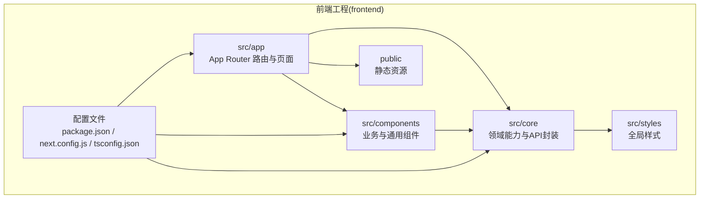
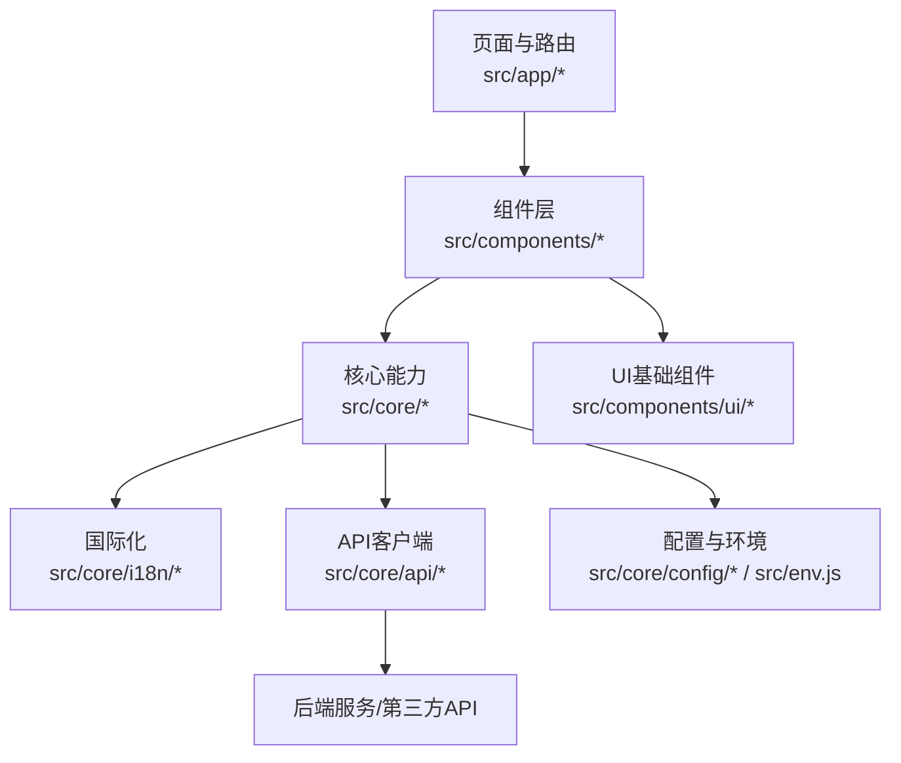
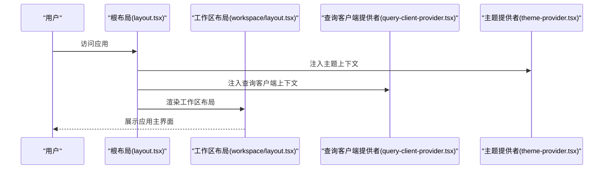
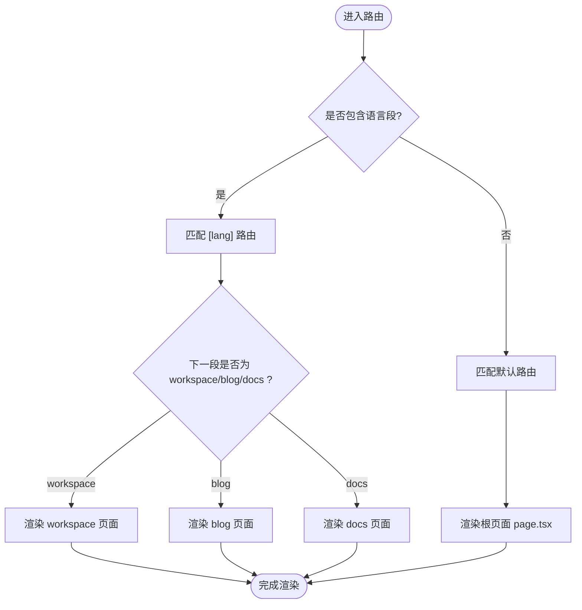
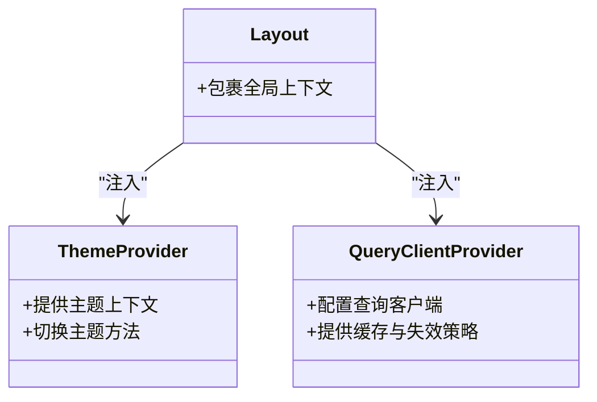
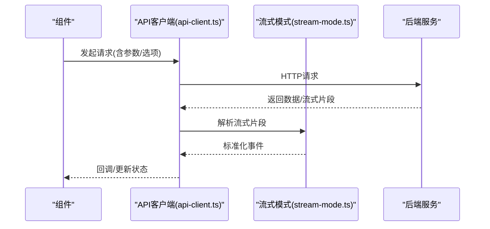
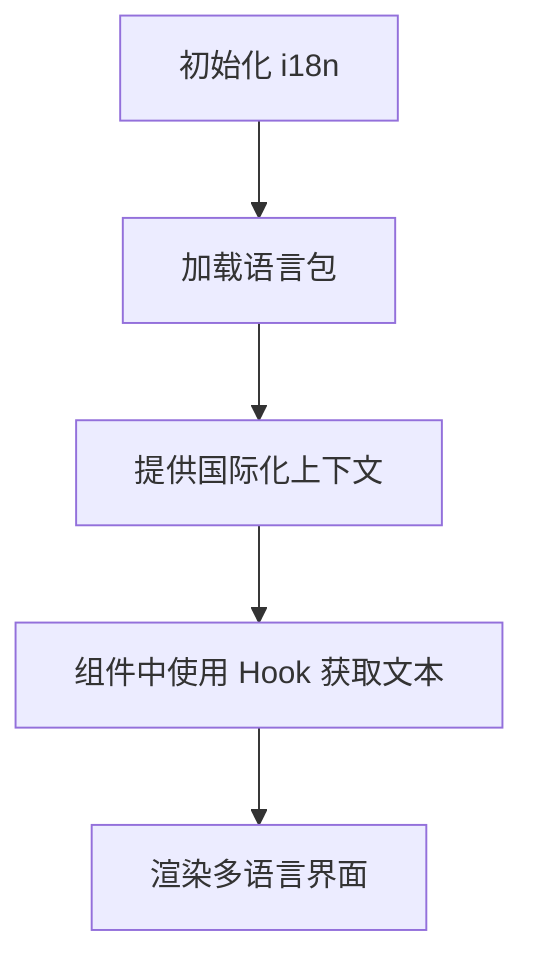
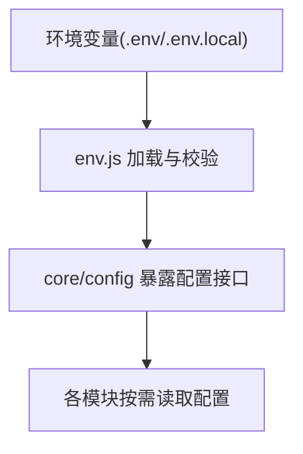
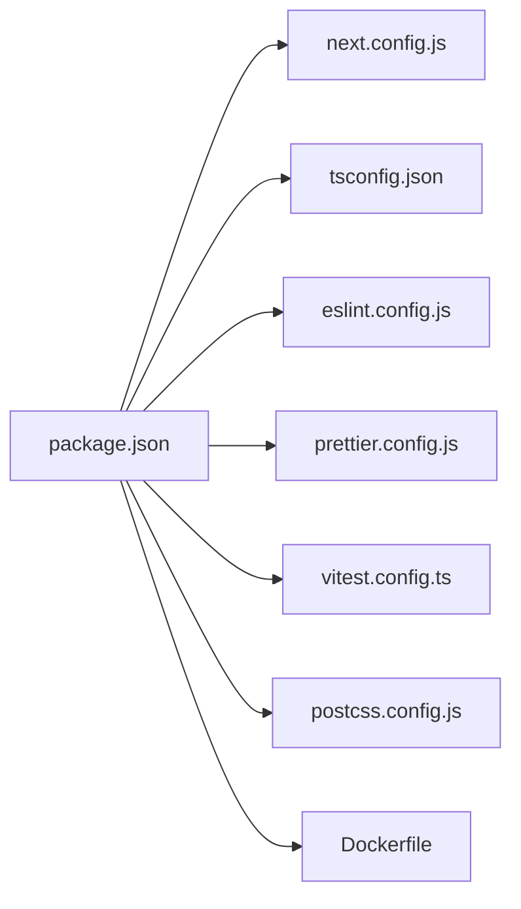

# 应用架构

<cite>
**本文引用的文件**   
- [frontend/package.json](file://frontend/package.json)
- [frontend/next.config.js](file://frontend/next.config.js)
- [frontend/tsconfig.json](file://frontend/tsconfig.json)
- [frontend/postcss.config.js](file://frontend/postcss.config.js)
- [frontend/eslint.config.js](file://frontend/eslint.config.js)
- [frontend/prettier.config.js](file://frontend/prettier.config.js)
- [frontend/vitest.config.ts](file://frontend/vitest.config.ts)
- [frontend/Dockerfile](file://frontend/Dockerfile)
- [frontend/src/app/layout.tsx](file://frontend/src/app/layout.tsx)
- [frontend/src/app/page.tsx](file://frontend/src/app/page.tsx)
- [frontend/src/app/workspace/layout.tsx](file://frontend/src/app/workspace/layout.tsx)
- [frontend/src/app/workspace/page.tsx](file://frontend/src/app/workspace/page.tsx)
- [frontend/src/components/theme-provider.tsx](file://frontend/src/components/theme-provider.tsx)
- [frontend/src/components/query-client-provider.tsx](file://frontend/src/components/query-client-provider.tsx)
- [frontend/src/core/api/api-client.ts](file://frontend/src/core/api/api-client.ts)
- [frontend/src/core/i18n/index.ts](file://frontend/src/core/i18n/index.ts)
- [frontend/src/core/i18n/hooks.ts](file://frontend/src/core/i18n/hooks.ts)
- [frontend/src/core/config/index.ts](file://frontend/src/core/config/index.ts)
- [frontend/src/env.js](file://frontend/src/env.js)
</cite>

## 目录
1. [简介](#简介)
2. [项目结构](#项目结构)
3. [核心组件](#核心组件)
4. [架构总览](#架构总览)
5. [详细组件分析](#详细组件分析)
6. [依赖分析](#依赖分析)
7. [性能考虑](#性能考虑)
8. [故障排查指南](#故障排查指南)
9. [结论](#结论)
10. [附录](#附录)

## 简介
本文件面向DeerFlow前端工程，聚焦基于Next.js与React技术栈的架构设计与工程化实践。文档从系统架构、目录组织、路由与布局、构建与优化、类型系统与开发调试、工程规范与依赖管理等方面展开，帮助读者快速理解并高效参与前端开发与维护。

## 项目结构
前端位于仓库根目录下的 frontend 子目录，采用Next.js App Router（src/app）进行页面与路由组织，结合组件分层（components）、领域核心模块（core）、UI基础组件（ui）、国际化（i18n）、配置与环境变量（env.js、core/config）等模块划分。

图表来源
- [frontend/package.json](file://frontend/package.json)
- [frontend/next.config.js](file://frontend/next.config.js)
- [frontend/tsconfig.json](file://frontend/tsconfig.json)

章节来源
- [frontend/package.json](file://frontend/package.json)
- [frontend/next.config.js](file://frontend/next.config.js)
- [frontend/tsconfig.json](file://frontend/tsconfig.json)

## 核心组件
本节概述前端的关键基础设施与核心模块：

- 应用入口与布局
  - 根布局与页面：定义全局布局、主题、查询客户端等上下文；首页作为导航入口。
  - 工作区布局与工作区首页：承载主应用Shell与功能区域。

- 主题与状态
  - 主题提供者：统一主题切换与样式注入。
  - 查询客户端提供者：集中管理数据请求缓存与失效策略。

- 领域核心模块(core)
  - API客户端：统一HTTP请求封装、错误处理、流式模式支持。
  - 国际化(i18n)：多语言加载、Hook与服务器端工具。
  - 配置中心：集中读取环境变量与运行时配置。

章节来源
- [frontend/src/app/layout.tsx](file://frontend/src/app/layout.tsx)
- [frontend/src/app/page.tsx](file://frontend/src/app/page.tsx)
- [frontend/src/app/workspace/layout.tsx](file://frontend/src/app/workspace/layout.tsx)
- [frontend/src/app/workspace/page.tsx](file://frontend/src/app/workspace/page.tsx)
- [frontend/src/components/theme-provider.tsx](file://frontend/src/components/theme-provider.tsx)
- [frontend/src/components/query-client-provider.tsx](file://frontend/src/components/query-client-provider.tsx)
- [frontend/src/core/api/api-client.ts](file://frontend/src/core/api/api-client.ts)
- [frontend/src/core/i18n/index.ts](file://frontend/src/core/i18n/index.ts)
- [frontend/src/core/i18n/hooks.ts](file://frontend/src/core/i18n/hooks.ts)
- [frontend/src/core/config/index.ts](file://frontend/src/core/config/index.ts)

## 架构总览
整体架构遵循“页面层(App Router) -> 组件层(业务/通用) -> 核心层(core) -> 外部服务”的分层模型。页面通过组件组合呈现界面，组件调用core中的领域能力与API封装，最终与后端或第三方服务交互。

图表来源
- [frontend/src/app/layout.tsx](file://frontend/src/app/layout.tsx)
- [frontend/src/components/theme-provider.tsx](file://frontend/src/components/theme-provider.tsx)
- [frontend/src/components/query-client-provider.tsx](file://frontend/src/components/query-client-provider.tsx)
- [frontend/src/core/api/api-client.ts](file://frontend/src/core/api/api-client.ts)
- [frontend/src/core/i18n/index.ts](file://frontend/src/core/i18n/index.ts)
- [frontend/src/core/config/index.ts](file://frontend/src/core/config/index.ts)
- [frontend/src/env.js](file://frontend/src/env.js)

## 详细组件分析

### 应用入口与布局
- 根布局负责注入全局上下文（如主题、查询客户端），并提供统一的头部/侧边栏/内容区域结构。
- 工作区布局为应用主体容器，承载聊天、代理、设置等功能页。
- 首页提供导航与引导，便于用户进入工作区。

图表来源
- [frontend/src/app/layout.tsx](file://frontend/src/app/layout.tsx)
- [frontend/src/app/workspace/layout.tsx](file://frontend/src/app/workspace/layout.tsx)
- [frontend/src/components/theme-provider.tsx](file://frontend/src/components/theme-provider.tsx)
- [frontend/src/components/query-client-provider.tsx](file://frontend/src/components/query-client-provider.tsx)

章节来源
- [frontend/src/app/layout.tsx](file://frontend/src/app/layout.tsx)
- [frontend/src/app/workspace/layout.tsx](file://frontend/src/app/workspace/layout.tsx)
- [frontend/src/components/theme-provider.tsx](file://frontend/src/components/theme-provider.tsx)
- [frontend/src/components/query-client-provider.tsx](file://frontend/src/components/query-client-provider.tsx)

### 路由与页面组织
- App Router采用文件系统即路由的方式，src/app下按功能域划分目录（如workspace、blog、docs等）。
- 动态路由使用方括号语法，例如[lang]用于多语言前缀，[[...mdxPath]]用于MDX文档路由。
- 页面与布局可嵌套，布局在页面之上提供共享结构与上下文。

图表来源
- [frontend/src/app/page.tsx](file://frontend/src/app/page.tsx)
- [frontend/src/app/workspace/page.tsx](file://frontend/src/app/workspace/page.tsx)

章节来源
- [frontend/src/app/page.tsx](file://frontend/src/app/page.tsx)
- [frontend/src/app/workspace/page.tsx](file://frontend/src/app/workspace/page.tsx)

### 主题与查询客户端
- 主题提供者：集中管理主题状态与样式注入，供全应用订阅。
- 查询客户端提供者：集中配置网络请求、缓存策略、重试与错误处理，供各页面与组件复用。

图表来源
- [frontend/src/components/theme-provider.tsx](file://frontend/src/components/theme-provider.tsx)
- [frontend/src/components/query-client-provider.tsx](file://frontend/src/components/query-client-provider.tsx)
- [frontend/src/app/layout.tsx](file://frontend/src/app/layout.tsx)

章节来源
- [frontend/src/components/theme-provider.tsx](file://frontend/src/components/theme-provider.tsx)
- [frontend/src/components/query-client-provider.tsx](file://frontend/src/components/query-client-provider.tsx)
- [frontend/src/app/layout.tsx](file://frontend/src/app/layout.tsx)

### API客户端与流式模式
- API客户端统一封装HTTP请求、鉴权头、错误处理与重试逻辑。
- 流式模式支持SSE/流式响应，适用于AI对话与长任务进度反馈。

图表来源
- [frontend/src/core/api/api-client.ts](file://frontend/src/core/api/api-client.ts)
- [frontend/src/core/api/stream-mode.ts](file://frontend/src/core/api/stream-mode.ts)

章节来源
- [frontend/src/core/api/api-client.ts](file://frontend/src/core/api/api-client.ts)
- [frontend/src/core/api/stream-mode.ts](file://frontend/src/core/api/stream-mode.ts)

### 国际化(i18n)
- 多语言资源按语言目录组织，提供加载器与Hook以在组件中获取翻译文本。
- 服务端工具支持SSR场景下的语言解析与预取。

图表来源
- [frontend/src/core/i18n/index.ts](file://frontend/src/core/i18n/index.ts)
- [frontend/src/core/i18n/hooks.ts](file://frontend/src/core/i18n/hooks.ts)

章节来源
- [frontend/src/core/i18n/index.ts](file://frontend/src/core/i18n/index.ts)
- [frontend/src/core/i18n/hooks.ts](file://frontend/src/core/i18n/hooks.ts)

### 配置与环境变量
- 配置中心集中读取环境变量与运行时配置，供各模块消费。
- env.js用于前端环境变量的校验与导出，确保运行期安全与一致性。

图表来源
- [frontend/src/env.js](file://frontend/src/env.js)
- [frontend/src/core/config/index.ts](file://frontend/src/core/config/index.ts)

章节来源
- [frontend/src/env.js](file://frontend/src/env.js)
- [frontend/src/core/config/index.ts](file://frontend/src/core/config/index.ts)

## 依赖分析
- 包管理与脚本：package.json定义了依赖、版本约束与常用脚本（开发、构建、测试、打包等）。
- 构建与样式：next.config.js控制Next.js行为（如路径别名、中间件、输出格式等）；postcss.config.js管理CSS后处理。
- 类型系统：tsconfig.json定义TypeScript编译选项与路径映射。
- 代码质量：eslint.config.js与prettier.config.js统一代码风格与检查规则。
- 测试：vitest.config.ts配置单元测试与集成测试。
- 容器化：Dockerfile定义前端镜像构建流程，便于部署。

图表来源
- [frontend/package.json](file://frontend/package.json)
- [frontend/next.config.js](file://frontend/next.config.js)
- [frontend/tsconfig.json](file://frontend/tsconfig.json)
- [frontend/eslint.config.js](file://frontend/eslint.config.js)
- [frontend/prettier.config.js](file://frontend/prettier.config.js)
- [frontend/vitest.config.ts](file://frontend/vitest.config.ts)
- [frontend/postcss.config.js](file://frontend/postcss.config.js)
- [frontend/Dockerfile](file://frontend/Dockerfile)

章节来源
- [frontend/package.json](file://frontend/package.json)
- [frontend/next.config.js](file://frontend/next.config.js)
- [frontend/tsconfig.json](file://frontend/tsconfig.json)
- [frontend/eslint.config.js](file://frontend/eslint.config.js)
- [frontend/prettier.config.js](file://frontend/prettier.config.js)
- [frontend/vitest.config.ts](file://frontend/vitest.config.ts)
- [frontend/postcss.config.js](file://frontend/postcss.config.js)
- [frontend/Dockerfile](file://frontend/Dockerfile)

## 性能考虑
- 构建与打包
  - 使用Next.js内置的代码分割与按需加载机制，减少首屏体积。
  - 合理拆分大组件与第三方库，避免一次性引入导致阻塞。
  - 图片与静态资源建议走CDN，启用浏览器缓存与压缩。

- 运行时优化
  - 利用查询客户端的缓存与失效策略，减少重复请求。
  - 对长列表与复杂视图采用虚拟滚动与懒加载。
  - 流式响应优先，提升用户感知速度。

- 样式与主题
  - 使用PostCSS与按需引入的UI组件，避免冗余CSS。
  - 主题切换时尽量局部更新，避免整页重绘。

- 监控与分析
  - 接入前端性能监控与错误上报，定位瓶颈与异常。
  - 定期审查Bundle大小与依赖树，清理无用依赖。

[本节为通用指导，不直接分析具体文件]

## 故障排查指南
- 构建失败
  - 检查Node与包管理器版本是否与package.json要求一致。
  - 确认环境变量与配置文件路径正确，避免缺失关键变量。
  - 查看构建日志，定位具体报错位置与原因。

- 运行时错误
  - 打开浏览器控制台与网络面板，检查API请求与响应。
  - 核对鉴权头与跨域配置，确保后端允许前端域名与方法。
  - 使用查询客户端的错误回调与重试配置，捕获并记录异常。

- 国际化问题
  - 确认语言包加载成功且键名一致。
  - 检查服务端渲染时的语言解析是否正确。

- 主题与样式
  - 验证主题提供者是否在根布局中正确注入。
  - 检查CSS冲突与覆盖顺序，必要时调整选择器优先级。

章节来源
- [frontend/src/core/api/api-client.ts](file://frontend/src/core/api/api-client.ts)
- [frontend/src/core/i18n/index.ts](file://frontend/src/core/i18n/index.ts)
- [frontend/src/components/theme-provider.tsx](file://frontend/src/components/theme-provider.tsx)
- [frontend/src/components/query-client-provider.tsx](file://frontend/src/components/query-client-provider.tsx)

## 结论
DeerFlow前端采用Next.js App Router与React生态，形成清晰的层次化架构与工程化体系。通过统一的API客户端、国际化与配置中心，提升了可维护性与扩展性。配合严格的代码规范、类型系统与测试框架，保障了交付质量。建议在后续迭代中持续优化构建产物、完善监控与自动化流程，进一步提升用户体验与研发效率。

[本节为总结性内容，不直接分析具体文件]

## 附录
- 开发环境搭建
  - 安装Node与包管理器，执行依赖安装与本地启动脚本。
  - 配置环境变量与后端地址，确保API可达。
  - 使用ESLint与Prettier进行代码格式化与检查。

- 调试配置
  - 启用浏览器开发者工具与Source Map。
  - 使用查询客户端的调试开关，观察缓存与请求详情。
  - 针对流式响应，使用专用工具或控制台监听事件。

- 工程规范与最佳实践
  - 组件职责单一，命名清晰，文件组织按功能域划分。
  - 类型定义集中管理，避免any滥用。
  - 提交信息遵循约定，分支策略明确，变更可追溯。

- 依赖管理与版本控制
  - 锁定依赖版本，定期升级并评估兼容性。
  - 使用语义化版本，发布前进行回归测试与性能对比。

[本节为通用指导，不直接分析具体文件]