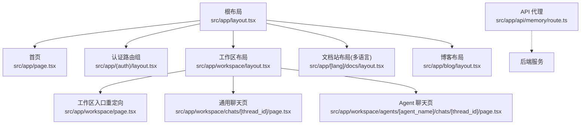
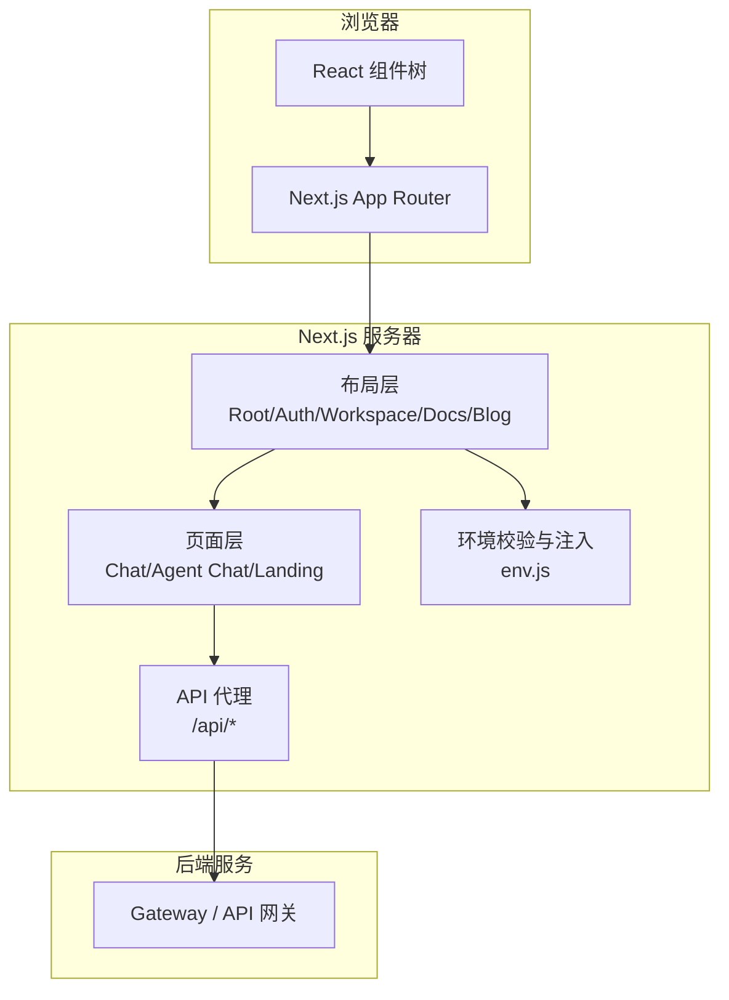
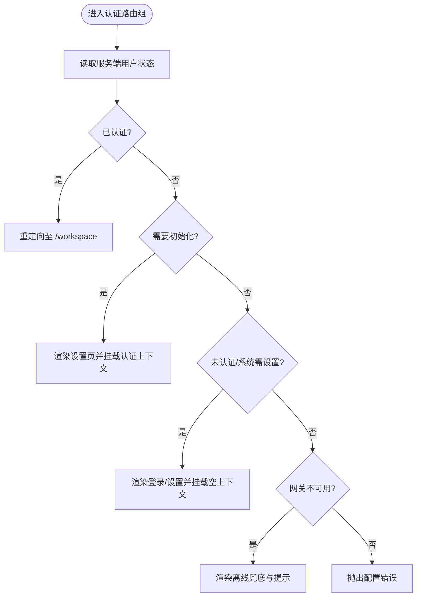
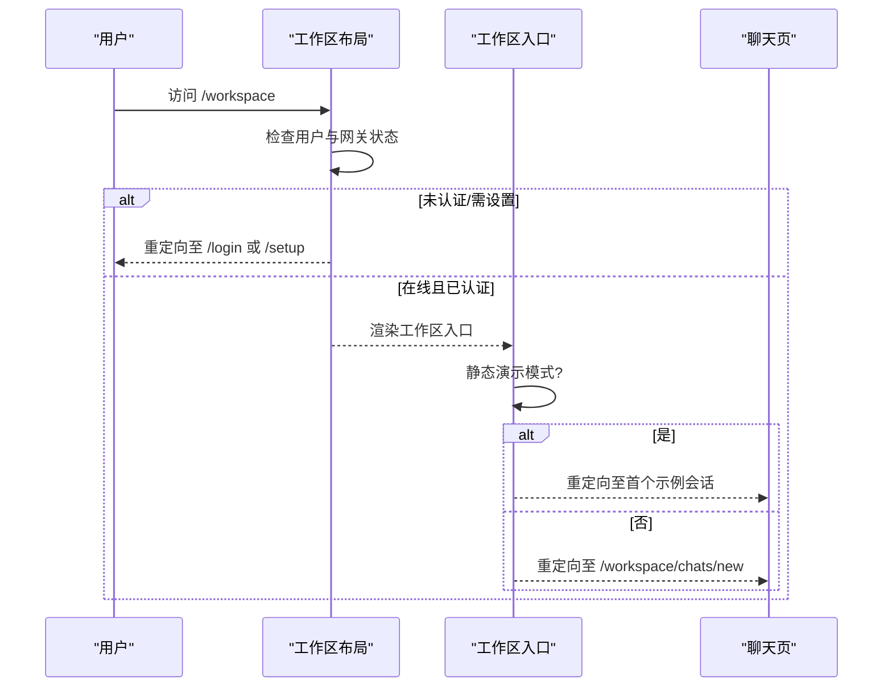
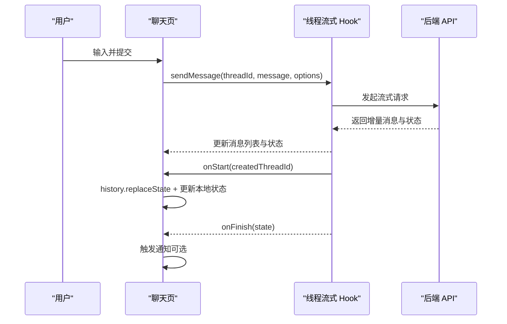
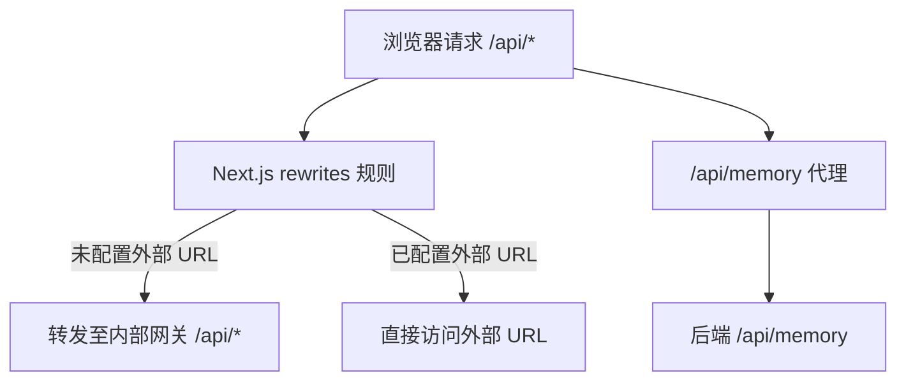
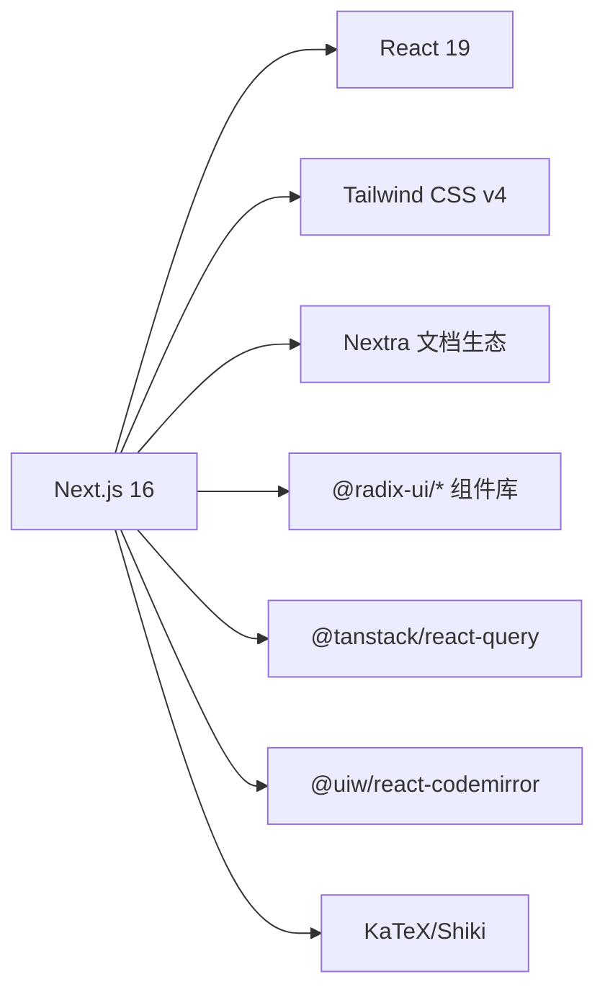

# 应用架构设计

<cite>
**本文引用的文件**
- [frontend/package.json](file://frontend/package.json)
- [frontend/next.config.js](file://frontend/next.config.js)
- [frontend/src/app/layout.tsx](file://frontend/src/app/layout.tsx)
- [frontend/src/app/page.tsx](file://frontend/src/app/page.tsx)
- [frontend/src/app/(auth)/layout.tsx](file://frontend/src/app/(auth)/layout.tsx)
- [frontend/src/app/workspace/layout.tsx](file://frontend/src/app/workspace/layout.tsx)
- [frontend/src/app/workspace/page.tsx](file://frontend/src/app/workspace/page.tsx)
- [frontend/src/app/[lang]/docs/layout.tsx](file://frontend/src/app/[lang]/docs/layout.tsx)
- [frontend/src/app/blog/layout.tsx](file://frontend/src/app/blog/layout.tsx)
- [frontend/src/app/workspace/chats/[thread_id]/page.tsx](file://frontend/src/app/workspace/chats/[thread_id]/page.tsx)
- [frontend/src/app/workspace/agents/[agent_name]/chats/[thread_id]/page.tsx](file://frontend/src/app/workspace/agents/[agent_name]/chats/[thread_id]/page.tsx)
- [frontend/src/app/api/memory/route.ts](file://frontend/src/app/api/memory/route.ts)
- [frontend/src/env.js](file://frontend/src/env.js)
</cite>

## 目录
1. [引言](#引言)
2. [项目结构](#项目结构)
3. [核心组件](#核心组件)
4. [架构总览](#架构总览)
5. [详细组件分析](#详细组件分析)
6. [依赖分析](#依赖分析)
7. [性能考虑](#性能考虑)
8. [故障排查指南](#故障排查指南)
9. [结论](#结论)
10. [附录](#附录)

## 引言
本文件面向 DeerFlow 前端应用，基于 Next.js 16 与 React 19，系统性阐述整体架构、App Router 使用模式（布局嵌套、动态路由、并行路由）、前后端分离策略（API 代理与环境变量）、构建优化、开发工作流与性能调优。文档以源码为依据，提供可视化图示与可追溯的“章节来源”，帮助读者快速理解并高效扩展。

## 项目结构
前端采用 Next.js App Router 组织页面与布局：
- 根布局负责主题、国际化与全局元信息注入
- (auth) 路由组用于认证相关页面的统一守卫与上下文挂载
- workspace 为应用主区域，包含聊天、Agent 对话、计划任务等子域
- [lang]/docs 与 blog 使用 Nextra 文档站点能力，支持多语言与侧边栏导航
- app/api 下实现服务端 API 代理，屏蔽后端地址差异

图表来源
- [frontend/src/app/layout.tsx:1-29](file://frontend/src/app/layout.tsx#L1-L29)
- [frontend/src/app/page.tsx:1-26](file://frontend/src/app/page.tsx#L1-L26)
- [frontend/src/app/(auth)/layout.tsx:1-46](file://frontend/src/app/(auth)/layout.tsx#L1-L46)
- [frontend/src/app/workspace/layout.tsx:1-45](file://frontend/src/app/workspace/layout.tsx#L1-L45)
- [frontend/src/app/workspace/page.tsx:1-21](file://frontend/src/app/workspace/page.tsx#L1-L21)
- [frontend/src/app/workspace/chats/[thread_id]/page.tsx:1-386](file://frontend/src/app/workspace/chats/[thread_id]/page.tsx#L1-L386)
- [frontend/src/app/workspace/agents/[agent_name]/chats/[thread_id]/page.tsx:1-348](file://frontend/src/app/workspace/agents/[agent_name]/chats/[thread_id]/page.tsx#L1-L348)
- [frontend/src/app/[lang]/docs/layout.tsx:1-52](file://frontend/src/app/[lang]/docs/layout.tsx#L1-L52)
- [frontend/src/app/blog/layout.tsx:1-23](file://frontend/src/app/blog/layout.tsx#L1-L23)
- [frontend/src/app/api/memory/route.ts:1-36](file://frontend/src/app/api/memory/route.ts#L1-L36)

章节来源
- [frontend/src/app/layout.tsx:1-29](file://frontend/src/app/layout.tsx#L1-L29)
- [frontend/src/app/page.tsx:1-26](file://frontend/src/app/page.tsx#L1-L26)
- [frontend/src/app/(auth)/layout.tsx:1-46](file://frontend/src/app/(auth)/layout.tsx#L1-L46)
- [frontend/src/app/workspace/layout.tsx:1-45](file://frontend/src/app/workspace/layout.tsx#L1-L45)
- [frontend/src/app/workspace/page.tsx:1-21](file://frontend/src/app/workspace/page.tsx#L1-L21)
- [frontend/src/app/[lang]/docs/layout.tsx:1-52](file://frontend/src/app/[lang]/docs/layout.tsx#L1-L52)
- [frontend/src/app/blog/layout.tsx:1-23](file://frontend/src/app/blog/layout.tsx#L1-L23)
- [frontend/src/app/api/memory/route.ts:1-36](file://frontend/src/app/api/memory/route.ts#L1-L36)

## 核心组件
- 根布局与主题/国际化
  - 在根布局中注入主题提供者与国际化上下文，设置默认元信息与语言检测
- 认证路由组
  - 根据服务端用户状态进行重定向或渲染离线兜底，统一挂载认证上下文
- 工作区布局
  - 校验登录态与系统配置，未通过则重定向至登录/设置；在线时挂载工作区内容容器
- 文档与博客布局
  - 基于 Nextra 的 Layout 与 pageMap 生成侧边栏，支持多语言切换与仓库链接
- 聊天页面
  - 通用聊天与 Agent 专属聊天共享一致的交互模型：欢迎态、消息列表、输入框、目标/待办、Token 用量、导出与侧车面板

章节来源
- [frontend/src/app/layout.tsx:1-29](file://frontend/src/app/layout.tsx#L1-L29)
- [frontend/src/app/(auth)/layout.tsx:1-46](file://frontend/src/app/(auth)/layout.tsx#L1-L46)
- [frontend/src/app/workspace/layout.tsx:1-45](file://frontend/src/app/workspace/layout.tsx#L1-L45)
- [frontend/src/app/[lang]/docs/layout.tsx:1-52](file://frontend/src/app/[lang]/docs/layout.tsx#L1-L52)
- [frontend/src/app/blog/layout.tsx:1-23](file://frontend/src/app/blog/layout.tsx#L1-L23)
- [frontend/src/app/workspace/chats/[thread_id]/page.tsx:1-386](file://frontend/src/app/workspace/chats/[thread_id]/page.tsx#L1-L386)
- [frontend/src/app/workspace/agents/[agent_name]/chats/[thread_id]/page.tsx:1-348](file://frontend/src/app/workspace/agents/[agent_name]/chats/[thread_id]/page.tsx#L1-L348)

## 架构总览
Next.js 作为前端运行时，承担以下职责：
- 页面渲染与路由分发（App Router）
- 静态资源与文档站点（Nextra）
- 服务端 API 代理（app/api）
- 环境变量校验与注入（@t3-oss/env-nextjs）

图表来源
- [frontend/next.config.js:1-82](file://frontend/next.config.js#L1-L82)
- [frontend/src/app/layout.tsx:1-29](file://frontend/src/app/layout.tsx#L1-L29)
- [frontend/src/app/(auth)/layout.tsx:1-46](file://frontend/src/app/(auth)/layout.tsx#L1-L46)
- [frontend/src/app/workspace/layout.tsx:1-45](file://frontend/src/app/workspace/layout.tsx#L1-L45)
- [frontend/src/app/[lang]/docs/layout.tsx:1-52](file://frontend/src/app/[lang]/docs/layout.tsx#L1-L52)
- [frontend/src/app/blog/layout.tsx:1-23](file://frontend/src/app/blog/layout.tsx#L1-L23)
- [frontend/src/app/api/memory/route.ts:1-36](file://frontend/src/app/api/memory/route.ts#L1-L36)
- [frontend/src/env.js:1-51](file://frontend/src/env.js#L1-L51)

## 详细组件分析

### 应用入口与根布局
- 作用
  - 定义全局元数据、引入全局样式与数学公式样式
  - 在服务端检测当前语言，注入到 html 标签
  - 包裹主题与国际化上下文，确保全应用可用
- 关键点
  - 使用异步布局函数获取语言
  - 通过属性控制主题行为与警告抑制

章节来源
- [frontend/src/app/layout.tsx:1-29](file://frontend/src/app/layout.tsx#L1-L29)

### 首页与着陆页
- 作用
  - 组合头部、英雄区、案例、技能、沙箱、更新与社区等区块
- 关键点
  - 纯展示型页面，便于 SEO 与首屏加载

章节来源
- [frontend/src/app/page.tsx:1-26](file://frontend/src/app/page.tsx#L1-L26)

### 认证路由组与守卫
- 作用
  - 根据服务端用户状态决定重定向或渲染
  - 处理网关不可用时的降级展示
- 关键流程
  - 已认证 → 跳转工作区
  - 需要设置 → 允许进入设置页
  - 未认证/系统需设置 → 进入登录/设置
  - 网关不可用 → 显示离线提示并保留基础交互能力

图表来源
- [frontend/src/app/(auth)/layout.tsx:1-46](file://frontend/src/app/(auth)/layout.tsx#L1-L46)

章节来源
- [frontend/src/app/(auth)/layout.tsx:1-46](file://frontend/src/app/(auth)/layout.tsx#L1-L46)

### 工作区布局与入口重定向
- 作用
  - 校验登录态与系统配置，未通过则重定向
  - 在线时渲染工作区内容容器
- 入口重定向
  - 静态演示模式下，自动跳转到首个示例会话
  - 否则统一重定向至新建会话

图表来源
- [frontend/src/app/workspace/layout.tsx:1-45](file://frontend/src/app/workspace/layout.tsx#L1-L45)
- [frontend/src/app/workspace/page.tsx:1-21](file://frontend/src/app/workspace/page.tsx#L1-L21)

章节来源
- [frontend/src/app/workspace/layout.tsx:1-45](file://frontend/src/app/workspace/layout.tsx#L1-L45)
- [frontend/src/app/workspace/page.tsx:1-21](file://frontend/src/app/workspace/page.tsx#L1-L21)

### 文档与博客布局（Nextra）
- 作用
  - 基于 Nextra 的 Layout 与 pageMap 生成侧边栏与导航
  - 文档布局支持多语言 i18n 与仓库链接
  - 博客布局提供文章索引与侧边栏
- 关键点
  - 动态拼接路由前缀，适配多语言路径
  - 将 Header/Footer 与 Nextra 布局集成

章节来源
- [frontend/src/app/[lang]/docs/layout.tsx:1-52](file://frontend/src/app/[lang]/docs/layout.tsx#L1-L52)
- [frontend/src/app/blog/layout.tsx:1-23](file://frontend/src/app/blog/layout.tsx#L1-L23)

### 聊天页面（通用与 Agent 专属）
- 共同特性
  - 欢迎态与正式态切换
  - 消息列表、历史分页、再生成、分支
  - Token 用量指示器、导出、侧车面板
  - 目标与待办条目的可视化
- 差异化
  - Agent 专属页面在上下文中注入 agent_name，并在标题处展示 Agent 标识
- 重要细节
  - 新会话创建后使用原生 history.replaceState 避免 React 重新挂载导致的状态丢失
  - 当会话不存在或为空时回退至新建会话

图表来源
- [frontend/src/app/workspace/chats/[thread_id]/page.tsx:1-386](file://frontend/src/app/workspace/chats/[thread_id]/page.tsx#L1-L386)
- [frontend/src/app/workspace/agents/[agent_name]/chats/[thread_id]/page.tsx:1-348](file://frontend/src/app/workspace/agents/[agent_name]/chats/[thread_id]/page.tsx#L1-L348)

章节来源
- [frontend/src/app/workspace/chats/[thread_id]/page.tsx:1-386](file://frontend/src/app/workspace/chats/[thread_id]/page.tsx#L1-L386)
- [frontend/src/app/workspace/agents/[agent_name]/chats/[thread_id]/page.tsx:1-348](file://frontend/src/app/workspace/agents/[agent_name]/chats/[thread_id]/page.tsx#L1-L348)

### API 代理与环境变量
- 代理策略
  - 通过 next.config.js 的 rewrites 将 /api/* 转发至后端网关
  - 若显式配置 NEXT_PUBLIC_LANGGRAPH_BASE_URL/NEXT_PUBLIC_BACKEND_BASE_URL，则按开关决定是否重写
- 服务端代理
  - app/api/memory 提供 GET/DELETE 代理，剥离不需要的请求头并透传响应体
- 环境变量
  - 使用 @t3-oss/env-nextjs 对客户端与服务端变量进行类型化校验
  - 支持跳过校验以适配 Docker 构建场景

图表来源
- [frontend/next.config.js:1-82](file://frontend/next.config.js#L1-L82)
- [frontend/src/app/api/memory/route.ts:1-36](file://frontend/src/app/api/memory/route.ts#L1-L36)
- [frontend/src/env.js:1-51](file://frontend/src/env.js#L1-L51)

章节来源
- [frontend/next.config.js:1-82](file://frontend/next.config.js#L1-L82)
- [frontend/src/app/api/memory/route.ts:1-36](file://frontend/src/app/api/memory/route.ts#L1-L36)
- [frontend/src/env.js:1-51](file://frontend/src/env.js#L1-L51)

## 依赖分析
- 运行时依赖
  - Next.js 16、React 19、Tailwind CSS、Radix UI、TanStack Query、Nextra 文档生态、CodeMirror、KaTeX、Shiki 等
- 开发依赖
  - ESLint、TypeScript、Playwright、Rstest、PostCSS、Prettier、Tailwind v4 等
- 包管理器
  - pnpm

图表来源
- [frontend/package.json:1-120](file://frontend/package.json#L1-L120)

章节来源
- [frontend/package.json:1-120](file://frontend/package.json#L1-L120)

## 性能考虑
- 代码分割与懒加载
  - App Router 天然按路由粒度进行代码分割；大型组件可通过动态导入进一步拆分
- 预取与缓存
  - 结合 TanStack Query 进行数据缓存与失效策略；利用 Next.js 的缓存与并发渲染减少重复请求
- 资源优化
  - 图片与静态资源按需加载；Math 与语法高亮按需引入
- 构建输出
  - 支持 standalone 输出模式，便于容器化部署与冷启动优化

[本节为通用指导，无需源码引用]

## 故障排查指南
- 环境变量缺失或格式错误
  - 现象：构建失败或运行时报错
  - 定位：检查 env.js 的 schema 与 runtimeEnv 映射；必要时启用 SKIP_ENV_VALIDATION
- 网关不可用
  - 现象：认证与工作区页面出现离线兜底
  - 定位：确认 DEER_FLOW_INTERNAL_GATEWAY_BASE_URL 或外部 URL 配置
- API 代理异常
  - 现象：/api/* 请求 404 或跨域
  - 定位：检查 next.config.js 的 rewrites 规则与 NEXT_PUBLIC_* 变量是否冲突
- 会话状态丢失
  - 现象：新会话创建后刷新或跳转导致状态重置
  - 定位：确认使用 history.replaceState 而非 router.push 进行同组件内导航

章节来源
- [frontend/src/env.js:1-51](file://frontend/src/env.js#L1-L51)
- [frontend/next.config.js:1-82](file://frontend/next.config.js#L1-L82)
- [frontend/src/app/(auth)/layout.tsx:1-46](file://frontend/src/app/(auth)/layout.tsx#L1-L46)
- [frontend/src/app/workspace/layout.tsx:1-45](file://frontend/src/app/workspace/layout.tsx#L1-L45)
- [frontend/src/app/workspace/chats/[thread_id]/page.tsx:1-386](file://frontend/src/app/workspace/chats/[thread_id]/page.tsx#L1-L386)

## 结论
DeerFlow 前端以 Next.js App Router 为核心，结合 Nextra 文档生态与严格的类型化环境变量管理，实现了清晰的页面分层、灵活的认证与工作区守卫、以及稳定的前后端分离架构。通过合理的代理策略与构建优化，兼顾了开发体验与生产性能。建议后续持续完善组件级懒加载、细粒度缓存策略与端到端监控，进一步提升用户体验与可观测性。

[本节为总结性内容，无需源码引用]

## 附录
- 开发命令
  - 开发：pnpm dev（启用 Turbo 加速）
  - 构建：pnpm build
  - 预览：pnpm preview
  - 测试：pnpm test / pnpm test:e2e
  - 类型检查与格式化：pnpm typecheck / pnpm format / pnpm lint
- 环境变量清单（部分）
  - NEXT_PUBLIC_BACKEND_BASE_URL：后端基础地址
  - NEXT_PUBLIC_LANGGRAPH_BASE_URL：LangGraph 兼容接口地址
  - NEXT_PUBLIC_STATIC_WEBSITE_ONLY：仅静态演示模式开关
  - GITHUB_OAUTH_TOKEN：GitHub OAuth 令牌（服务端）
  - NODE_ENV：运行环境
  - SKIP_ENV_VALIDATION：跳过环境变量校验（构建期）

章节来源
- [frontend/package.json:1-120](file://frontend/package.json#L1-L120)
- [frontend/src/env.js:1-51](file://frontend/src/env.js#L1-L51)