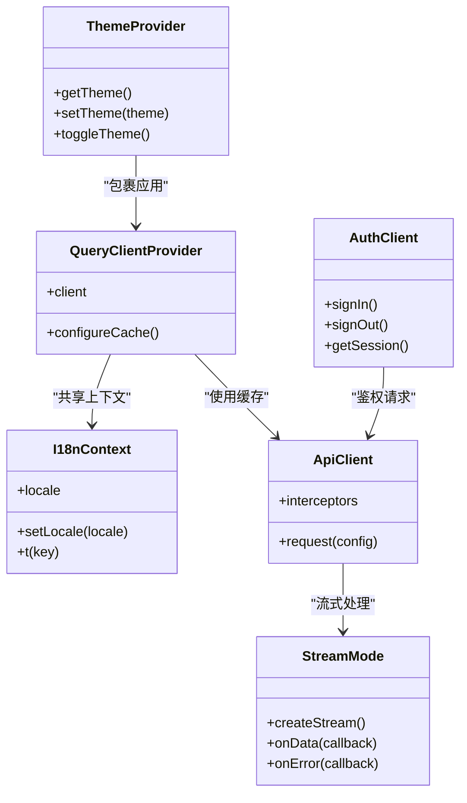
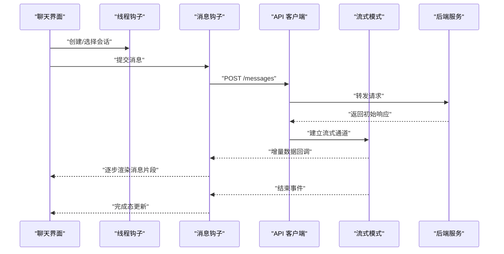
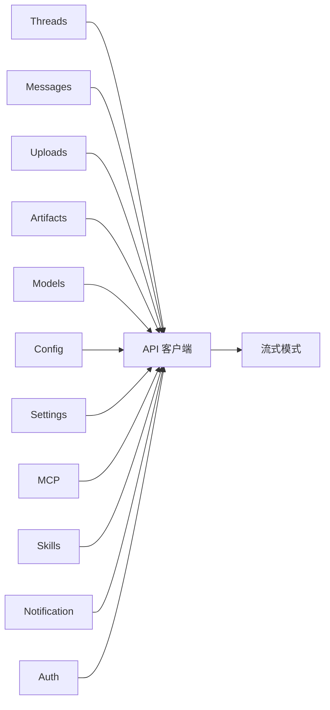

# 状态管理

<cite>
**本文引用的文件**   
- [frontend/src/components/theme-provider.tsx](file://frontend/src/components/theme-provider.tsx)
- [frontend/src/components/query-client-provider.tsx](file://frontend/src/components/query-client-provider.tsx)
- [frontend/src/core/i18n/context.tsx](file://frontend/src/core/i18n/context.tsx)
- [frontend/src/core/i18n/hooks.ts](file://frontend/src/core/i18n/hooks.ts)
- [frontend/src/core/i18n/cookies.ts](file://frontend/src/core/i18n/cookies.ts)
- [frontend/src/core/i18n/locale.ts](file://frontend/src/core/i18n/locale.ts)
- [frontend/src/core/config/index.ts](file://frontend/src/core/config/index.ts)
- [frontend/src/server/better-auth/client.ts](file://frontend/src/server/better-auth/client.ts)
- [frontend/src/server/better-auth/config.ts](file://frontend/src/server/better-auth/config.ts)
- [frontend/src/server/better-auth/server.ts](file://frontend/src/server/better-auth/server.ts)
- [frontend/src/app/api/auth/[...all]/route.ts](file://frontend/src/app/api/auth/[...all]/route.ts)
- [frontend/src/core/settings/index.ts](file://frontend/src/core/settings/index.ts)
- [frontend/src/core/settings/hooks.ts](file://frontend/src/core/settings/hooks.ts)
- [frontend/src/core/models/index.ts](file://frontend/src/core/models/index.ts)
- [frontend/src/core/models/hooks.ts](file://frontend/src/core/models/hooks.ts)
- [frontend/src/core/threads/index.ts](file://frontend/src/core/threads/index.ts)
- [frontend/src/core/threads/hooks.ts](file://frontend/src/core/threads/hooks.ts)
- [frontend/src/core/messages/index.ts](file://frontend/src/core/messages/index.ts)
- [frontend/src/core/tasks/index.ts](file://frontend/src/core/tasks/index.ts)
- [frontend/src/core/todos/index.ts](file://frontend/src/core/todos/index.ts)
- [frontend/src/core/uploads/index.ts](file://frontend/src/core/uploads/index.ts)
- [frontend/src/core/artifacts/index.ts](file://frontend/src/core/artifacts/index.ts)
- [frontend/src/core/mcp/index.ts](file://frontend/src/core/mcp/index.ts)
- [frontend/src/core/skills/index.ts](file://frontend/src/core/skills/index.ts)
- [frontend/src/core/notification/index.ts](file://frontend/src/core/notification/index.ts)
- [frontend/src/core/utils/index.ts](file://frontend/src/core/utils/index.ts)
- [frontend/src/core/api/api-client.ts](file://frontend/src/core/api/api-client.ts)
- [frontend/src/core/api/stream-mode.ts](file://frontend/src/core/api/stream-mode.ts)
</cite>

## 目录
1. [简介](#简介)
2. [项目结构](#项目结构)
3. [核心组件](#核心组件)
4. [架构总览](#架构总览)
5. [详细组件分析](#详细组件分析)
6. [依赖关系分析](#依赖关系分析)
7. [性能考虑](#性能考虑)
8. [故障排查指南](#故障排查指南)
9. [结论](#结论)
10. [附录](#附录)

## 简介
本文件聚焦 DeerFlow 前端的状态管理体系，围绕 React Context 与 Zustand（通过 TanStack Query 的持久化能力）进行系统化说明。内容覆盖：
- 全局状态：用户认证、应用配置、主题设置、国际化等
- 组件级状态：表单、UI 交互、临时数据
- 持久化机制：localStorage 存储、状态同步与版本迁移
- 异步状态：API 请求、缓存策略、错误处理
- 最佳实践与性能优化建议
- 调试工具与开发技巧

## 项目结构
DeerFlow 前端采用“领域分层 + 提供者模式”的组织方式：
- 全局上下文与提供者：主题、查询客户端、国际化等
- 领域模块：认证、配置、模型、会话、消息、任务、上传、制品、MCP、技能、通知等
- API 层：统一客户端、流式模式封装
- 工具与类型：通用工具函数、类型定义

```mermaid
graph TB
subgraph "全局提供者"
Theme["主题提供者<br/>theme-provider.tsx"]
QueryClient["查询客户端提供者<br/>query-client-provider.tsx"]
I18nCtx["国际化上下文<br/>i18n/context.tsx"]
end
subgraph "领域状态"
Auth["认证客户端<br/>server/better-auth/*"]
Config["应用配置<br/>core/config/index.ts"]
Settings["设置模块<br/>core/settings/*"]
Models["模型选择<br/>core/models/*"]
Threads["会话状态<br/>core/threads/*"]
Messages["消息状态<br/>core/messages/*"]
Tasks["任务状态<br/>core/tasks/*"]
Todos["待办状态<br/>core/todos/*"]
Uploads["上传状态<br/>core/uploads/*"]
Artifacts["制品状态<br/>core/artifacts/*"]
MCP["MCP 状态<br/>core/mcp/*"]
Skills["技能状态<br/>core/skills/*"]
Notify["通知状态<br/>core/notification/*"]
end
subgraph "API 层"
ApiClient["API 客户端<br/>core/api/api-client.ts"]
StreamMode["流式模式<br/>core/api/stream-mode.ts"]
end
Theme --> QueryClient
QueryClient --> Threads
QueryClient --> Messages
QueryClient --> Models
QueryClient --> Config
QueryClient --> Settings
QueryClient --> Uploads
QueryClient --> Artifacts
QueryClient --> MCP
QueryClient --> Skills
QueryClient --> Notify
I18nCtx --> Threads
I18nCtx --> Settings
Auth --> Threads
Auth --> Messages
ApiClient --> Threads
ApiClient --> Messages
ApiClient --> Models
ApiClient --> Config
ApiClient --> Settings
ApiClient --> Uploads
ApiClient --> Artifacts
ApiClient --> MCP
ApiClient --> Skills
StreamMode --> ApiClient
```

图表来源
- [frontend/src/components/theme-provider.tsx](file://frontend/src/components/theme-provider.tsx)
- [frontend/src/components/query-client-provider.tsx](file://frontend/src/components/query-client-provider.tsx)
- [frontend/src/core/i18n/context.tsx](file://frontend/src/core/i18n/context.tsx)
- [frontend/src/core/config/index.ts](file://frontend/src/core/config/index.ts)
- [frontend/src/core/settings/index.ts](file://frontend/src/core/settings/index.ts)
- [frontend/src/core/models/index.ts](file://frontend/src/core/models/index.ts)
- [frontend/src/core/threads/index.ts](file://frontend/src/core/threads/index.ts)
- [frontend/src/core/messages/index.ts](file://frontend/src/core/messages/index.ts)
- [frontend/src/core/tasks/index.ts](file://frontend/src/core/tasks/index.ts)
- [frontend/src/core/todos/index.ts](file://frontend/src/core/todos/index.ts)
- [frontend/src/core/uploads/index.ts](file://frontend/src/core/uploads/index.ts)
- [frontend/src/core/artifacts/index.ts](file://frontend/src/core/artifacts/index.ts)
- [frontend/src/core/mcp/index.ts](file://frontend/src/core/mcp/index.ts)
- [frontend/src/core/skills/index.ts](file://frontend/src/core/skills/index.ts)
- [frontend/src/core/notification/index.ts](file://frontend/src/core/notification/index.ts)
- [frontend/src/core/api/api-client.ts](file://frontend/src/core/api/api-client.ts)
- [frontend/src/core/api/stream-mode.ts](file://frontend/src/core/api/stream-mode.ts)

章节来源
- [frontend/src/components/theme-provider.tsx](file://frontend/src/components/theme-provider.tsx)
- [frontend/src/components/query-client-provider.tsx](file://frontend/src/components/query-client-provider.tsx)
- [frontend/src/core/i18n/context.tsx](file://frontend/src/core/i18n/context.tsx)
- [frontend/src/core/config/index.ts](file://frontend/src/core/config/index.ts)
- [frontend/src/core/settings/index.ts](file://frontend/src/core/settings/index.ts)
- [frontend/src/core/models/index.ts](file://frontend/src/core/models/index.ts)
- [frontend/src/core/threads/index.ts](file://frontend/src/core/threads/index.ts)
- [frontend/src/core/messages/index.ts](file://frontend/src/core/messages/index.ts)
- [frontend/src/core/tasks/index.ts](file://frontend/src/core/tasks/index.ts)
- [frontend/src/core/todos/index.ts](file://frontend/src/core/todos/index.ts)
- [frontend/src/core/uploads/index.ts](file://frontend/src/core/uploads/index.ts)
- [frontend/src/core/artifacts/index.ts](file://frontend/src/core/artifacts/index.ts)
- [frontend/src/core/mcp/index.ts](file://frontend/src/core/mcp/index.ts)
- [frontend/src/core/skills/index.ts](file://frontend/src/core/skills/index.ts)
- [frontend/src/core/notification/index.ts](file://frontend/src/core/notification/index.ts)
- [frontend/src/core/api/api-client.ts](file://frontend/src/core/api/api-client.ts)
- [frontend/src/core/api/stream-mode.ts](file://frontend/src/core/api/stream-mode.ts)

## 核心组件
本节概述全局状态的关键提供者与领域模块的职责边界。

- 主题提供者
  - 职责：提供当前主题、切换方法、持久化到本地存储
  - 典型用法：在根布局包裹应用，使所有子组件可读取/更新主题
  - 参考路径：[frontend/src/components/theme-provider.tsx](file://frontend/src/components/theme-provider.tsx)

- 查询客户端提供者
  - 职责：初始化并注入 TanStack Query 客户端，配置缓存、重试、去重、失效时间等
  - 典型用法：在应用顶层包裹，为所有使用 query hooks 的模块提供缓存与状态
  - 参考路径：[frontend/src/components/query-client-provider.tsx](file://frontend/src/components/query-client-provider.tsx)

- 国际化上下文
  - 职责：维护语言、翻译资源、切换语言；支持 Cookie 持久化
  - 典型用法：在页面或应用层提供，配合 i18n hooks 使用
  - 参考路径：
    - [frontend/src/core/i18n/context.tsx](file://frontend/src/core/i18n/context.tsx)
    - [frontend/src/core/i18n/hooks.ts](file://frontend/src/core/i18n/hooks.ts)
    - [frontend/src/core/i18n/cookies.ts](file://frontend/src/core/i18n/cookies.ts)
    - [frontend/src/core/i18n/locale.ts](file://frontend/src/core/i18n/locale.ts)

- 认证客户端
  - 职责：封装 Better-Auth 客户端与服务端路由，提供登录、登出、会话状态
  - 典型用法：在需要鉴权的页面或 API 调用前检查会话
  - 参考路径：
    - [frontend/src/server/better-auth/client.ts](file://frontend/src/server/better-auth/client.ts)
    - [frontend/src/server/better-auth/config.ts](file://frontend/src/server/better-auth/config.ts)
    - [frontend/src/server/better-auth/server.ts](file://frontend/src/server/better-auth/server.ts)
    - [frontend/src/app/api/auth/[...all]/route.ts](file://frontend/src/app/api/auth/[...all]/route.ts)

- 配置与设置
  - 职责：加载应用配置、用户设置；提供读写接口与默认值
  - 典型用法：在启动时拉取配置，渲染 UI 与行为开关
  - 参考路径：
    - [frontend/src/core/config/index.ts](file://frontend/src/core/config/index.ts)
    - [frontend/src/core/settings/index.ts](file://frontend/src/core/settings/index.ts)
    - [frontend/src/core/settings/hooks.ts](file://frontend/src/core/settings/hooks.ts)

- 领域状态（Threads/Messages/Tasks/Todos/Uploads/Artifacts/MCP/Skills/Notification）
  - 职责：各自领域的状态组织、API 集成、缓存与错误处理
  - 典型用法：通过对应 hooks 订阅与触发操作
  - 参考路径：
    - [frontend/src/core/threads/index.ts](file://frontend/src/core/threads/index.ts)
    - [frontend/src/core/threads/hooks.ts](file://frontend/src/core/threads/hooks.ts)
    - [frontend/src/core/messages/index.ts](file://frontend/src/core/messages/index.ts)
    - [frontend/src/core/tasks/index.ts](file://frontend/src/core/tasks/index.ts)
    - [frontend/src/core/todos/index.ts](file://frontend/src/core/todos/index.ts)
    - [frontend/src/core/uploads/index.ts](file://frontend/src/core/uploads/index.ts)
    - [frontend/src/core/artifacts/index.ts](file://frontend/src/core/artifacts/index.ts)
    - [frontend/src/core/mcp/index.ts](file://frontend/src/core/mcp/index.ts)
    - [frontend/src/core/skills/index.ts](file://frontend/src/core/skills/index.ts)
    - [frontend/src/core/notification/index.ts](file://frontend/src/core/notification/index.ts)

- API 层
  - 职责：统一 HTTP 客户端、拦截器、错误归一化、流式响应处理
  - 典型用法：各模块通过该层发起请求，避免重复网络逻辑
  - 参考路径：
    - [frontend/src/core/api/api-client.ts](file://frontend/src/core/api/api-client.ts)
    - [frontend/src/core/api/stream-mode.ts](file://frontend/src/core/api/stream-mode.ts)

章节来源
- [frontend/src/components/theme-provider.tsx](file://frontend/src/components/theme-provider.tsx)
- [frontend/src/components/query-client-provider.tsx](file://frontend/src/components/query-client-provider.tsx)
- [frontend/src/core/i18n/context.tsx](file://frontend/src/core/i18n/context.tsx)
- [frontend/src/core/i18n/hooks.ts](file://frontend/src/core/i18n/hooks.ts)
- [frontend/src/core/i18n/cookies.ts](file://frontend/src/core/i18n/cookies.ts)
- [frontend/src/core/i18n/locale.ts](file://frontend/src/core/i18n/locale.ts)
- [frontend/src/server/better-auth/client.ts](file://frontend/src/server/better-auth/client.ts)
- [frontend/src/server/better-auth/config.ts](file://frontend/src/server/better-auth/config.ts)
- [frontend/src/server/better-auth/server.ts](file://frontend/src/server/better-auth/server.ts)
- [frontend/src/app/api/auth/[...all]/route.ts](file://frontend/src/app/api/auth/[...all]/route.ts)
- [frontend/src/core/config/index.ts](file://frontend/src/core/config/index.ts)
- [frontend/src/core/settings/index.ts](file://frontend/src/core/settings/index.ts)
- [frontend/src/core/settings/hooks.ts](file://frontend/src/core/settings/hooks.ts)
- [frontend/src/core/threads/index.ts](file://frontend/src/core/threads/index.ts)
- [frontend/src/core/threads/hooks.ts](file://frontend/src/core/threads/hooks.ts)
- [frontend/src/core/messages/index.ts](file://frontend/src/core/messages/index.ts)
- [frontend/src/core/tasks/index.ts](file://frontend/src/core/tasks/index.ts)
- [frontend/src/core/todos/index.ts](file://frontend/src/core/todos/index.ts)
- [frontend/src/core/uploads/index.ts](file://frontend/src/core/uploads/index.ts)
- [frontend/src/core/artifacts/index.ts](file://frontend/src/core/artifacts/index.ts)
- [frontend/src/core/mcp/index.ts](file://frontend/src/core/mcp/index.ts)
- [frontend/src/core/skills/index.ts](file://frontend/src/core/skills/index.ts)
- [frontend/src/core/notification/index.ts](file://frontend/src/core/notification/index.ts)
- [frontend/src/core/api/api-client.ts](file://frontend/src/core/api/api-client.ts)
- [frontend/src/core/api/stream-mode.ts](file://frontend/src/core/api/stream-mode.ts)

## 架构总览
整体架构以“React Context 提供全局上下文 + TanStack Query 管理异步状态”为核心，辅以领域模块的局部状态与工具库。

图表来源
- [frontend/src/components/theme-provider.tsx](file://frontend/src/components/theme-provider.tsx)
- [frontend/src/components/query-client-provider.tsx](file://frontend/src/components/query-client-provider.tsx)
- [frontend/src/core/i18n/context.tsx](file://frontend/src/core/i18n/context.tsx)
- [frontend/src/server/better-auth/client.ts](file://frontend/src/server/better-auth/client.ts)
- [frontend/src/core/api/api-client.ts](file://frontend/src/core/api/api-client.ts)
- [frontend/src/core/api/stream-mode.ts](file://frontend/src/core/api/stream-mode.ts)

## 详细组件分析

### 主题设置（Theme）
- 设计要点
  - 使用 React Context 暴露 get/set/toggle 方法
  - 将主题键值写入 localStorage，实现跨会话持久化
  - 在应用根节点提供，确保全链路可用
- 关键流程
  - 初始化：从 localStorage 读取上次主题，若无则回退默认
  - 切换：更新 context 并写回 localStorage
  - 消费：组件通过 hook 读取主题类名或变量
- 参考路径
  - [frontend/src/components/theme-provider.tsx](file://frontend/src/components/theme-provider.tsx)

章节来源
- [frontend/src/components/theme-provider.tsx](file://frontend/src/components/theme-provider.tsx)

### 国际化（I18n）
- 设计要点
  - 使用 React Context 维护 locale 与翻译资源
  - 提供 setLocale 与 t 方法，支持动态切换
  - 通过 Cookie 持久化语言偏好
- 关键流程
  - 初始化：解析 Cookie 或浏览器语言，加载对应资源
  - 切换：更新 locale，刷新受影响的组件
  - 消费：组件通过 i18n hooks 获取文本
- 参考路径
  - [frontend/src/core/i18n/context.tsx](file://frontend/src/core/i18n/context.tsx)
  - [frontend/src/core/i18n/hooks.ts](file://frontend/src/core/i18n/hooks.ts)
  - [frontend/src/core/i18n/cookies.ts](file://frontend/src/core/i18n/cookies.ts)
  - [frontend/src/core/i18n/locale.ts](file://frontend/src/core/i18n/locale.ts)

章节来源
- [frontend/src/core/i18n/context.tsx](file://frontend/src/core/i18n/context.tsx)
- [frontend/src/core/i18n/hooks.ts](file://frontend/src/core/i18n/hooks.ts)
- [frontend/src/core/i18n/cookies.ts](file://frontend/src/core/i18n/cookies.ts)
- [frontend/src/core/i18n/locale.ts](file://frontend/src/core/i18n/locale.ts)

### 认证（Auth）
- 设计要点
  - 基于 Better-Auth 的客户端与服务端路由
  - 提供 signIn/signOut/getSession 等方法
  - 与 API 层结合，自动附加鉴权头或重定向
- 关键流程
  - 登录：调用客户端方法，服务端路由完成认证后返回会话
  - 鉴权：在受保护页面或服务端 API 中校验会话
  - 登出：清除会话并清理本地状态
- 参考路径
  - [frontend/src/server/better-auth/client.ts](file://frontend/src/server/better-auth/client.ts)
  - [frontend/src/server/better-auth/config.ts](file://frontend/src/server/better-auth/config.ts)
  - [frontend/src/server/better-auth/server.ts](file://frontend/src/server/better-auth/server.ts)
  - [frontend/src/app/api/auth/[...all]/route.ts](file://frontend/src/app/api/auth/[...all]/route.ts)

章节来源
- [frontend/src/server/better-auth/client.ts](file://frontend/src/server/better-auth/client.ts)
- [frontend/src/server/better-auth/config.ts](file://frontend/src/server/better-auth/config.ts)
- [frontend/src/server/better-auth/server.ts](file://frontend/src/server/better-auth/server.ts)
- [frontend/src/app/api/auth/[...all]/route.ts](file://frontend/src/app/api/auth/[...all]/route.ts)

### 应用配置与设置（Config & Settings）
- 设计要点
  - 配置：集中管理应用级开关、功能特性、后端地址等
  - 设置：用户偏好、界面选项、行为参数
  - 持久化：优先使用 localStorage，必要时与后端同步
- 关键流程
  - 启动：拉取配置与设置，合并默认值
  - 变更：更新内存状态并持久化
  - 消费：通过 hooks 订阅变化
- 参考路径
  - [frontend/src/core/config/index.ts](file://frontend/src/core/config/index.ts)
  - [frontend/src/core/settings/index.ts](file://frontend/src/core/settings/index.ts)
  - [frontend/src/core/settings/hooks.ts](file://frontend/src/core/settings/hooks.ts)

章节来源
- [frontend/src/core/config/index.ts](file://frontend/src/core/config/index.ts)
- [frontend/src/core/settings/index.ts](file://frontend/src/core/settings/index.ts)
- [frontend/src/core/settings/hooks.ts](file://frontend/src/core/settings/hooks.ts)

### 模型选择（Models）
- 设计要点
  - 维护可选模型列表、当前选中模型、能力元信息
  - 通过 API 拉取模型清单，缓存于 Query Client
- 关键流程
  - 初始化：请求模型列表，填充下拉选项
  - 切换：更新当前模型，影响后续对话与生成行为
- 参考路径
  - [frontend/src/core/models/index.ts](file://frontend/src/core/models/index.ts)
  - [frontend/src/core/models/hooks.ts](file://frontend/src/core/models/hooks.ts)

章节来源
- [frontend/src/core/models/index.ts](file://frontend/src/core/models/index.ts)
- [frontend/src/core/models/hooks.ts](file://frontend/src/core/models/hooks.ts)

### 会话与消息（Threads & Messages）
- 设计要点
  - 会话：创建、切换、删除、标题管理等
  - 消息：追加、编辑、删除、分页、搜索
  - 流式：通过 StreamMode 增量渲染
- 关键流程
  - 发送消息：创建或追加消息，进入流式接收
  - 流式更新：按块增量更新 UI，最终落盘
  - 错误处理：网络异常、超时、服务不可用等降级
- 参考路径
  - [frontend/src/core/threads/index.ts](file://frontend/src/core/threads/index.ts)
  - [frontend/src/core/threads/hooks.ts](file://frontend/src/core/threads/hooks.ts)
  - [frontend/src/core/messages/index.ts](file://frontend/src/core/messages/index.ts)
  - [frontend/src/core/api/stream-mode.ts](file://frontend/src/core/api/stream-mode.ts)

图表来源
- [frontend/src/core/threads/hooks.ts](file://frontend/src/core/threads/hooks.ts)
- [frontend/src/core/messages/index.ts](file://frontend/src/core/messages/index.ts)
- [frontend/src/core/api/api-client.ts](file://frontend/src/core/api/api-client.ts)
- [frontend/src/core/api/stream-mode.ts](file://frontend/src/core/api/stream-mode.ts)

章节来源
- [frontend/src/core/threads/index.ts](file://frontend/src/core/threads/index.ts)
- [frontend/src/core/threads/hooks.ts](file://frontend/src/core/threads/hooks.ts)
- [frontend/src/core/messages/index.ts](file://frontend/src/core/messages/index.ts)
- [frontend/src/core/api/stream-mode.ts](file://frontend/src/core/api/stream-mode.ts)

### 任务与待办（Tasks & Todos）
- 设计要点
  - 任务：长流程任务的进度、步骤、状态机
  - 待办：轻量级清单，支持增删改查与排序
- 关键流程
  - 任务：开始、暂停、继续、失败重试
  - 待办：本地快速操作，必要时同步至后端
- 参考路径
  - [frontend/src/core/tasks/index.ts](file://frontend/src/core/tasks/index.ts)
  - [frontend/src/core/todos/index.ts](file://frontend/src/core/todos/index.ts)

章节来源
- [frontend/src/core/tasks/index.ts](file://frontend/src/core/tasks/index.ts)
- [frontend/src/core/todos/index.ts](file://frontend/src/core/todos/index.ts)

### 上传与制品（Uploads & Artifacts）
- 设计要点
  - 上传：分片、断点续传、进度反馈、错误重试
  - 制品：生成结果的管理、预览、下载
- 关键流程
  - 上传：选择文件 -> 校验 -> 分片上传 -> 合并 -> 返回链接
  - 制品：创建、关联会话、展示、导出
- 参考路径
  - [frontend/src/core/uploads/index.ts](file://frontend/src/core/uploads/index.ts)
  - [frontend/src/core/artifacts/index.ts](file://frontend/src/core/artifacts/index.ts)

章节来源
- [frontend/src/core/uploads/index.ts](file://frontend/src/core/uploads/index.ts)
- [frontend/src/core/artifacts/index.ts](file://frontend/src/core/artifacts/index.ts)

### MCP 与技能（MCP & Skills）
- 设计要点
  - MCP：外部协议/工具的发现、注册、调用
  - 技能：可插拔能力的安装、启用、配置
- 关键流程
  - 发现：扫描/拉取 MCP 与技能清单
  - 启用：加载配置，注入运行时
  - 调用：通过统一入口执行
- 参考路径
  - [frontend/src/core/mcp/index.ts](file://frontend/src/core/mcp/index.ts)
  - [frontend/src/core/skills/index.ts](file://frontend/src/core/skills/index.ts)

章节来源
- [frontend/src/core/mcp/index.ts](file://frontend/src/core/mcp/index.ts)
- [frontend/src/core/skills/index.ts](file://frontend/src/core/skills/index.ts)

### 通知（Notification）
- 设计要点
  - 全局通知中心，支持成功、警告、错误等类型
  - 自动消隐、手动关闭、批量操作
- 关键流程
  - 触发：业务模块调用通知 API
  - 展示：队列渲染，优先级控制
  - 清理：过期移除、手动清空
- 参考路径
  - [frontend/src/core/notification/index.ts](file://frontend/src/core/notification/index.ts)

章节来源
- [frontend/src/core/notification/index.ts](file://frontend/src/core/notification/index.ts)

### 工具与通用（Utils）
- 设计要点
  - 通用工具：格式化、校验、防抖节流、URL 构建等
  - 类型：TS 类型定义与约束
- 参考路径
  - [frontend/src/core/utils/index.ts](file://frontend/src/core/utils/index.ts)

章节来源
- [frontend/src/core/utils/index.ts](file://frontend/src/core/utils/index.ts)

## 依赖关系分析
- 耦合与内聚
  - 领域模块通过 API 层访问后端，降低直接网络耦合
  - 全局提供者（主题、查询客户端、国际化）被广泛依赖，保持高内聚
- 外部依赖
  - TanStack Query：缓存、重试、去重、失效策略
  - Better-Auth：认证与会话管理
  - 浏览器存储：localStorage/Cookie 用于持久化
- 潜在循环依赖
  - 应避免模块间相互引用，使用工具层或事件总线解耦

图表来源
- [frontend/src/core/threads/index.ts](file://frontend/src/core/threads/index.ts)
- [frontend/src/core/messages/index.ts](file://frontend/src/core/messages/index.ts)
- [frontend/src/core/uploads/index.ts](file://frontend/src/core/uploads/index.ts)
- [frontend/src/core/artifacts/index.ts](file://frontend/src/core/artifacts/index.ts)
- [frontend/src/core/models/index.ts](file://frontend/src/core/models/index.ts)
- [frontend/src/core/config/index.ts](file://frontend/src/core/config/index.ts)
- [frontend/src/core/settings/index.ts](file://frontend/src/core/settings/index.ts)
- [frontend/src/core/mcp/index.ts](file://frontend/src/core/mcp/index.ts)
- [frontend/src/core/skills/index.ts](file://frontend/src/core/skills/index.ts)
- [frontend/src/core/notification/index.ts](file://frontend/src/core/notification/index.ts)
- [frontend/src/server/better-auth/client.ts](file://frontend/src/server/better-auth/client.ts)
- [frontend/src/core/api/api-client.ts](file://frontend/src/core/api/api-client.ts)
- [frontend/src/core/api/stream-mode.ts](file://frontend/src/core/api/stream-mode.ts)

章节来源
- [frontend/src/core/threads/index.ts](file://frontend/src/core/threads/index.ts)
- [frontend/src/core/messages/index.ts](file://frontend/src/core/messages/index.ts)
- [frontend/src/core/uploads/index.ts](file://frontend/src/core/uploads/index.ts)
- [frontend/src/core/artifacts/index.ts](file://frontend/src/core/artifacts/index.ts)
- [frontend/src/core/models/index.ts](file://frontend/src/core/models/index.ts)
- [frontend/src/core/config/index.ts](file://frontend/src/core/config/index.ts)
- [frontend/src/core/settings/index.ts](file://frontend/src/core/settings/index.ts)
- [frontend/src/core/mcp/index.ts](file://frontend/src/core/mcp/index.ts)
- [frontend/src/core/skills/index.ts](file://frontend/src/core/skills/index.ts)
- [frontend/src/core/notification/index.ts](file://frontend/src/core/notification/index.ts)
- [frontend/src/server/better-auth/client.ts](file://frontend/src/server/better-auth/client.ts)
- [frontend/src/core/api/api-client.ts](file://frontend/src/core/api/api-client.ts)
- [frontend/src/core/api/stream-mode.ts](file://frontend/src/core/api/stream-mode.ts)

## 性能考虑
- 缓存策略
  - 合理设置 staleTime 与 gcTime，减少重复请求
  - 对热点数据（如模型列表、配置）提高缓存命中
- 细粒度订阅
  - 使用具体字段或派生选择器，避免整块状态变更导致大面积重渲染
- 流式渲染
  - 增量更新 UI，避免一次性大对象替换
- 防抖与节流
  - 输入框、滚动、窗口尺寸变化等高频事件需节流/防抖
- 懒加载与代码分割
  - 非首屏模块按需加载，缩短首屏时间
- 并发与去重
  - 利用 Query Client 的去重与并发控制，避免风暴式请求

## 故障排查指南
- 常见问题
  - 认证失败：检查会话是否有效、路由是否正确、Cookie 是否携带
  - 流式中断：检查网络稳定性、服务端 SSE 支持、错误回调
  - 缓存不一致：清理 Query Cache、强制重新获取、检查 key 唯一性
  - 主题不生效：确认 Provider 包裹层级、CSS 变量是否加载
- 调试技巧
  - 打开浏览器开发者工具的网络面板，观察请求与响应
  - 使用 React DevTools 查看组件树与状态变化
  - 在关键路径添加日志输出，记录状态快照与错误堆栈
- 错误处理
  - 统一错误码映射与用户提示
  - 对可恢复错误实施重试与降级策略

## 结论
DeerFlow 前端状态管理以 React Context 提供全局上下文、TanStack Query 管理异步状态为核心，结合领域模块的局部状态与工具库，形成清晰的分层与职责边界。通过合理的缓存策略、流式渲染与错误处理，兼顾了用户体验与系统稳定性。遵循本文的最佳实践与调试技巧，有助于进一步提升可维护性与性能表现。

## 附录
- 术语
  - 全局状态：应用范围内共享的状态
  - 组件级状态：仅在当前组件或子树使用的状态
  - 持久化：将状态保存到本地存储或后端
  - 流式：增量传输与渲染数据
- 参考路径汇总
  - 全局提供者：[frontend/src/components/theme-provider.tsx](file://frontend/src/components/theme-provider.tsx)、[frontend/src/components/query-client-provider.tsx](file://frontend/src/components/query-client-provider.tsx)
  - 国际化：[frontend/src/core/i18n/context.tsx](file://frontend/src/core/i18n/context.tsx)、[frontend/src/core/i18n/hooks.ts](file://frontend/src/core/i18n/hooks.ts)、[frontend/src/core/i18n/cookies.ts](file://frontend/src/core/i18n/cookies.ts)、[frontend/src/core/i18n/locale.ts](file://frontend/src/core/i18n/locale.ts)
  - 认证：[frontend/src/server/better-auth/client.ts](file://frontend/src/server/better-auth/client.ts)、[frontend/src/server/better-auth/config.ts](file://frontend/src/server/better-auth/config.ts)、[frontend/src/server/better-auth/server.ts](file://frontend/src/server/better-auth/server.ts)、[frontend/src/app/api/auth/[...all]/route.ts](file://frontend/src/app/api/auth/[...all]/route.ts)
  - 配置与设置：[frontend/src/core/config/index.ts](file://frontend/src/core/config/index.ts)、[frontend/src/core/settings/index.ts](file://frontend/src/core/settings/index.ts)、[frontend/src/core/settings/hooks.ts](file://frontend/src/core/settings/hooks.ts)
  - 模型：[frontend/src/core/models/index.ts](file://frontend/src/core/models/index.ts)、[frontend/src/core/models/hooks.ts](file://frontend/src/core/models/hooks.ts)
  - 会话与消息：[frontend/src/core/threads/index.ts](file://frontend/src/core/threads/index.ts)、[frontend/src/core/threads/hooks.ts](file://frontend/src/core/threads/hooks.ts)、[frontend/src/core/messages/index.ts](file://frontend/src/core/messages/index.ts)
  - 任务与待办：[frontend/src/core/tasks/index.ts](file://frontend/src/core/tasks/index.ts)、[frontend/src/core/todos/index.ts](file://frontend/src/core/todos/index.ts)
  - 上传与制品：[frontend/src/core/uploads/index.ts](file://frontend/src/core/uploads/index.ts)、[frontend/src/core/artifacts/index.ts](file://frontend/src/core/artifacts/index.ts)
  - MCP 与技能：[frontend/src/core/mcp/index.ts](file://frontend/src/core/mcp/index.ts)、[frontend/src/core/skills/index.ts](file://frontend/src/core/skills/index.ts)
  - 通知：[frontend/src/core/notification/index.ts](file://frontend/src/core/notification/index.ts)
  - API 层：[frontend/src/core/api/api-client.ts](file://frontend/src/core/api/api-client.ts)、[frontend/src/core/api/stream-mode.ts](file://frontend/src/core/api/stream-mode.ts)
  - 工具：[frontend/src/core/utils/index.ts](file://frontend/src/core/utils/index.ts)