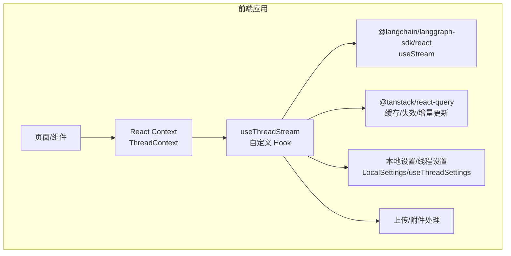
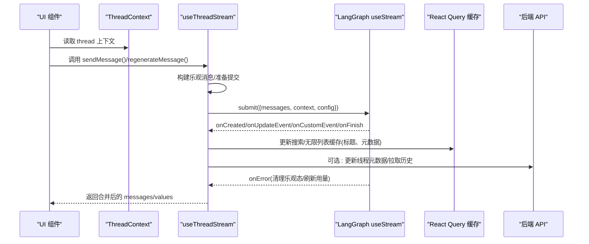
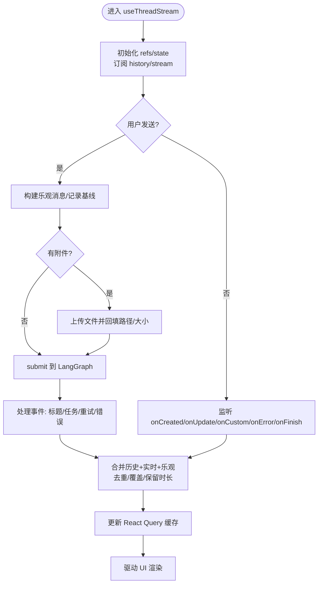
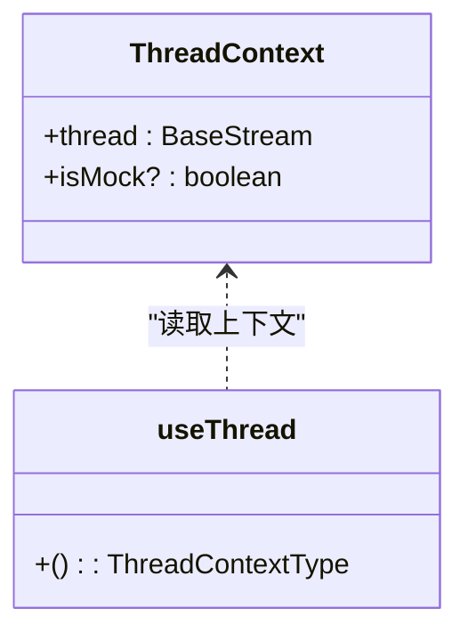
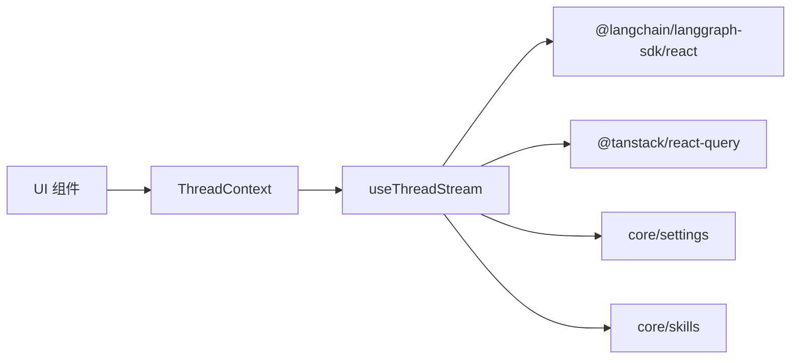

# 状态管理

<cite>
**本文引用的文件**   
- [frontend/src/core/threads/hooks.ts](file://frontend/src/core/threads/hooks.ts)
- [frontend/src/core/threads/types.ts](file://frontend/src/core/threads/types.ts)
- [frontend/src/components/workspace/messages/context.ts](file://frontend/src/components/workspace/messages/context.ts)
- [frontend/src/core/settings/index.ts](file://frontend/src/core/settings/index.ts)
- [frontend/src/core/skills/index.ts](file://frontend/src/core/skills/index.ts)
- [frontend/package.json](file://frontend/package.json)
</cite>

## 目录
1. [简介](#简介)
2. [项目结构](#项目结构)
3. [核心组件](#核心组件)
4. [架构总览](#架构总览)
5. [详细组件分析](#详细组件分析)
6. [依赖分析](#依赖分析)
7. [性能考虑](#性能考虑)
8. [故障排查指南](#故障排查指南)
9. [结论](#结论)
10. [附录](#附录)

## 简介
本文件面向 DeerFlow 前端的状态管理系统，聚焦于基于 React Context 与自定义 Hooks 的统一状态管理模式。文档覆盖：
- 全局、局部与服务端状态的统一策略
- 聊天状态管理（消息列表、线程状态、用户输入、实时更新）
- 工作区状态管理（代理配置、技能状态、设置偏好、会话持久化）
- 状态同步机制（客户端与服务器一致性、冲突解决、离线支持）
- 性能优化（选择器、缓存、重渲染优化）
- 调试工具与最佳实践

## 项目结构
前端采用 Next.js + React 技术栈，状态相关代码主要分布在 core 与 components 目录：
- core/threads：聊天线程与消息流的核心逻辑与类型定义
- components/workspace/messages：线程上下文（React Context）封装
- core/settings：本地设置与线程级设置的导出入口
- core/skills：技能模块的 API 与类型导出入口
- package.json：声明式依赖（如 @tanstack/react-query、@langchain/langgraph-sdk/react）

图表来源
- [frontend/src/components/workspace/messages/context.ts:1-21](file://frontend/src/components/workspace/messages/context.ts#L1-L21)
- [frontend/src/core/threads/hooks.ts:786-1573](file://frontend/src/core/threads/hooks.ts#L786-L1573)
- [frontend/src/core/settings/index.ts:1-3](file://frontend/src/core/settings/index.ts#L1-L3)
- [frontend/package.json:49-93](file://frontend/package.json#L49-L93)

章节来源
- [frontend/src/core/threads/hooks.ts:786-1573](file://frontend/src/core/threads/hooks.ts#L786-L1573)
- [frontend/src/components/workspace/messages/context.ts:1-21](file://frontend/src/components/workspace/messages/context.ts#L1-L21)
- [frontend/src/core/settings/index.ts:1-3](file://frontend/src/core/settings/index.ts#L1-L3)
- [frontend/src/core/skills/index.ts:1-3](file://frontend/src/core/skills/index.ts#L1-L3)
- [frontend/package.json:49-93](file://frontend/package.json#L49-L93)

## 核心组件
- ThreadContext（React Context）
  - 提供当前 BaseStream 实例与是否 Mock 模式标记，供子树消费
  - 通过 useThread() 获取上下文，未包裹时抛出错误，保证使用安全
- useThreadStream（核心自定义 Hook）
  - 基于 @langchain/langgraph-sdk/react 的 useStream 封装
  - 负责：乐观消息、历史分页加载、合并展示、摘要归档桥接、任务事件、错误恢复、停止与缓存失效
  - 暴露：thread（含 values/messages）、sendMessage、regenerateMessage、isUploading、历史分页能力
- 类型体系
  - AgentThreadState、AgentThread、RunMessage、GoalState 等，描述线程状态、上下文、运行消息与令牌用量响应

章节来源
- [frontend/src/components/workspace/messages/context.ts:1-21](file://frontend/src/components/workspace/messages/context.ts#L1-L21)
- [frontend/src/core/threads/hooks.ts:786-1573](file://frontend/src/core/threads/hooks.ts#L786-L1573)
- [frontend/src/core/threads/types.ts:1-78](file://frontend/src/core/threads/types.ts#L1-L78)

## 架构总览
下图展示了从 UI 到服务端的全链路状态流转：UI 通过 Context 注入线程流，Hook 组合历史与实时流，必要时进行乐观更新与摘要归档桥接，最终驱动视图渲染。

图表来源
- [frontend/src/core/threads/hooks.ts:890-1082](file://frontend/src/core/threads/hooks.ts#L890-L1082)
- [frontend/src/core/threads/hooks.ts:1208-1411](file://frontend/src/core/threads/hooks.ts#L1208-L1411)
- [frontend/src/core/threads/hooks.ts:1413-1518](file://frontend/src/core/threads/hooks.ts#L1413-L1518)
- [frontend/src/components/workspace/messages/context.ts:1-21](file://frontend/src/components/workspace/messages/context.ts#L1-L21)

## 详细组件分析

### 聊天状态管理（消息、线程、输入、实时更新）
- 消息合并与去重
  - 历史消息与实时流存在重叠时，按可见性规则与 identity 进行裁剪与去重，保留 turn_duration 等关键信息
  - 对“被替代”的 run 进行过滤，避免显示过时内容
- 上下文摘要归档桥接
  - 当后端触发 SummarizationMiddleware 时，计算将被移除的消息并同步缓冲，确保在异步归档完成前不丢失历史
  - 根据已确认的历史吸收情况修剪缓冲，防止旧快照复活被过滤的消息
- 乐观更新与上传流程
  - 发送前插入乐观 human/AI 消息；若包含附件，先上传并回填路径与大小，再提交
  - 失败时清理乐观态并提示错误
- 重新生成（Regenerate）
  - 先 prepare 目标 run 与 checkpoint，标记待替代的 run/message ids，提交后刷新相关缓存
- 停止与失效
  - 停止后延迟再次失效，确保最终一致

图表来源
- [frontend/src/core/threads/hooks.ts:1208-1411](file://frontend/src/core/threads/hooks.ts#L1208-L1411)
- [frontend/src/core/threads/hooks.ts:890-1082](file://frontend/src/core/threads/hooks.ts#L890-L1082)
- [frontend/src/core/threads/hooks.ts:1413-1518](file://frontend/src/core/threads/hooks.ts#L1413-L1518)
- [frontend/src/core/threads/hooks.ts:1575-1599](file://frontend/src/core/threads/hooks.ts#L1575-L1599)

章节来源
- [frontend/src/core/threads/hooks.ts:786-1573](file://frontend/src/core/threads/hooks.ts#L786-L1573)
- [frontend/src/core/threads/hooks.ts:1575-1599](file://frontend/src/core/threads/hooks.ts#L1575-L1599)
- [frontend/src/core/threads/types.ts:1-78](file://frontend/src/core/threads/types.ts#L1-L78)

### 工作区状态管理（代理、技能、设置、会话）
- 设置与偏好
  - LocalSettings 与 useThreadSettings 由 core/settings 导出，用于保存用户偏好与线程级设置
- 技能状态
  - core/skills 提供 API 与类型导出，便于在工作区中加载与管理技能
- 代理配置
  - 结合 agents 模块（hooks/api/types）与工作区页面，实现代理创建、删除、切换等状态联动
- 会话持久化
  - 通过 React Query 的默认持久化策略与本地存储配合，保持线程列表、搜索缓存与线程元数据的跨会话一致性

章节来源
- [frontend/src/core/settings/index.ts:1-3](file://frontend/src/core/settings/index.ts#L1-L3)
- [frontend/src/core/skills/index.ts:1-3](file://frontend/src/core/skills/index.ts#L1-L3)

### 线程上下文（React Context）
- ThreadContext 提供 BaseStream 实例与 isMock 标志，简化子树访问
- useThread 钩子在未包裹时抛出错误，保障契约

图表来源
- [frontend/src/components/workspace/messages/context.ts:1-21](file://frontend/src/components/workspace/messages/context.ts#L1-L21)

章节来源
- [frontend/src/components/workspace/messages/context.ts:1-21](file://frontend/src/components/workspace/messages/context.ts#L1-L21)

## 依赖分析
- 运行时依赖
  - @langchain/langgraph-sdk/react：提供 useStream 与 BaseStream，支撑实时流与状态订阅
  - @tanstack/react-query：提供查询缓存、无限滚动、增量更新与失效策略
  - react：提供 Context、Hooks、状态管理与渲染
- 内部依赖
  - core/threads：核心状态与算法（合并、去重、摘要归档桥接）
  - components/workspace/messages：线程上下文
  - core/settings：本地与线程级设置
  - core/skills：技能模块接口

图表来源
- [frontend/package.json:49-93](file://frontend/package.json#L49-L93)
- [frontend/src/core/threads/hooks.ts:786-1573](file://frontend/src/core/threads/hooks.ts#L786-L1573)
- [frontend/src/components/workspace/messages/context.ts:1-21](file://frontend/src/components/workspace/messages/context.ts#L1-L21)
- [frontend/src/core/settings/index.ts:1-3](file://frontend/src/core/settings/index.ts#L1-L3)
- [frontend/src/core/skills/index.ts:1-3](file://frontend/src/core/skills/index.ts#L1-L3)

章节来源
- [frontend/package.json:49-93](file://frontend/package.json#L49-L93)
- [frontend/src/core/threads/hooks.ts:786-1573](file://frontend/src/core/threads/hooks.ts#L786-L1573)
- [frontend/src/components/workspace/messages/context.ts:1-21](file://frontend/src/components/workspace/messages/context.ts#L1-L21)
- [frontend/src/core/settings/index.ts:1-3](file://frontend/src/core/settings/index.ts#L1-L3)
- [frontend/src/core/skills/index.ts:1-3](file://frontend/src/core/skills/index.ts#L1-L3)

## 性能考虑
- 选择器与最小化更新
  - 使用 useMemo 派生 visibleHistory/persistedMessages，减少不必要的重渲染
  - 仅对当前查看的线程叠加乐观消息与摘要归档缓冲，避免跨线程泄漏
- 缓存与增量更新
  - 通过 React Query 的 setQueriesData 对搜索与无限列表进行原地更新，避免全量刷新
  - 标题变更、线程元数据变更即时反映到缓存，提升交互响应
- 去重与合并
  - 基于 message identity 的去重与覆盖策略，避免重复渲染与闪烁
  - 对“被替代”的 run 进行过滤，降低无效渲染
- 上传与并发控制
  - 发送防抖（in-flight guard），避免重复提交
  - 上传完成后回填路径与大小，减少二次请求
- 历史分页与懒加载
  - 按需加载历史，维护 before_seq 游标，避免一次性载入大量数据

章节来源
- [frontend/src/core/threads/hooks.ts:1097-1172](file://frontend/src/core/threads/hooks.ts#L1097-L1172)
- [frontend/src/core/threads/hooks.ts:1174-1207](file://frontend/src/core/threads/hooks.ts#L1174-L1207)
- [frontend/src/core/threads/hooks.ts:1208-1411](file://frontend/src/core/threads/hooks.ts#L1208-L1411)
- [frontend/src/core/threads/hooks.ts:1575-1599](file://frontend/src/core/threads/hooks.ts#L1575-L1599)

## 故障排查指南
- 常见错误与恢复
  - 网络或后端异常：onError 清理乐观态、重置线程标识、提示错误并刷新用量统计
  - 403/404 不可访问线程：视为缺失，引导回空白聊天页
  - 上传失败：捕获错误并提示，清空乐观态
- 调试建议
  - 观察 React Query 缓存键 ["threads","search"] 与 INFINITE_THREADS_QUERY_KEY_PREFIX 的变化
  - 检查 pendingSupersededRunIds/pendingSupersededMessageIds 集合，确认被替代项是否正确隐藏
  - 验证摘要归档缓冲（pendingArchivedMessagesRef）与 visibleHistory 的一致性

章节来源
- [frontend/src/core/threads/hooks.ts:1055-1082](file://frontend/src/core/threads/hooks.ts#L1055-L1082)
- [frontend/src/core/threads/hooks.ts:1413-1518](file://frontend/src/core/threads/hooks.ts#L1413-L1518)
- [frontend/src/core/threads/hooks.ts:1174-1207](file://frontend/src/core/threads/hooks.ts#L1174-L1207)

## 结论
DeerFlow 前端的状态管理以 React Context 为入口，结合 @langchain/langgraph-sdk/react 的实时流与 @tanstack/react-query 的缓存机制，形成“历史+实时+乐观”的三源合一模型。通过严格的去重、覆盖与摘要归档桥接，保证了复杂场景下的一致性与流畅体验。同时，利用 React Query 的增量更新与选择器优化，显著降低了重渲染成本。建议在扩展新功能时遵循现有模式：明确状态边界、谨慎使用乐观更新、充分利用缓存与失效策略，并完善错误处理与可观测性。

## 附录
- 最佳实践清单
  - 始终在 ThreadContext 包裹内使用 useThread
  - 使用 useThreadStream 提供的 sendMessage/regenerateMessage，避免直接操作底层流
  - 对长列表使用 React Query 的无限滚动与分页参数
  - 对敏感操作增加 in-flight 保护与错误提示
  - 合理设置缓存键，避免过度失效导致抖动