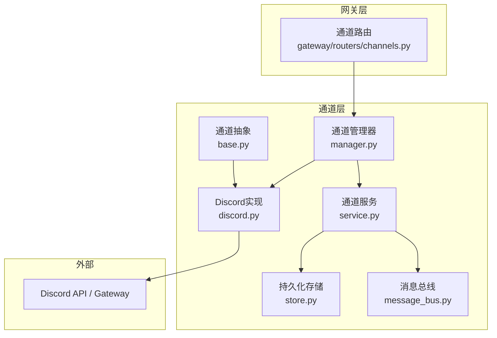
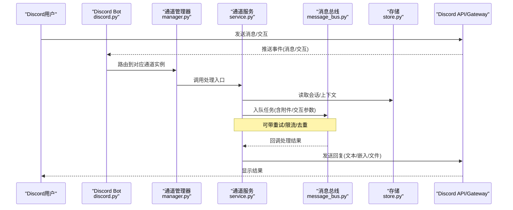
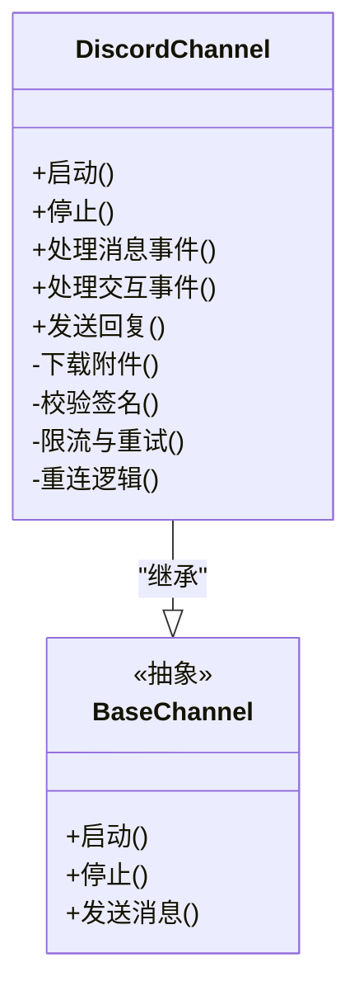
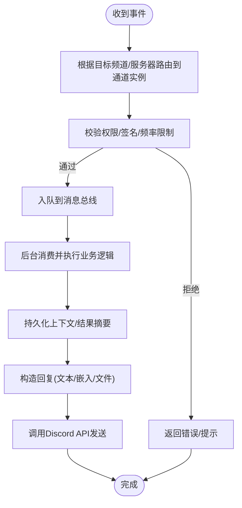
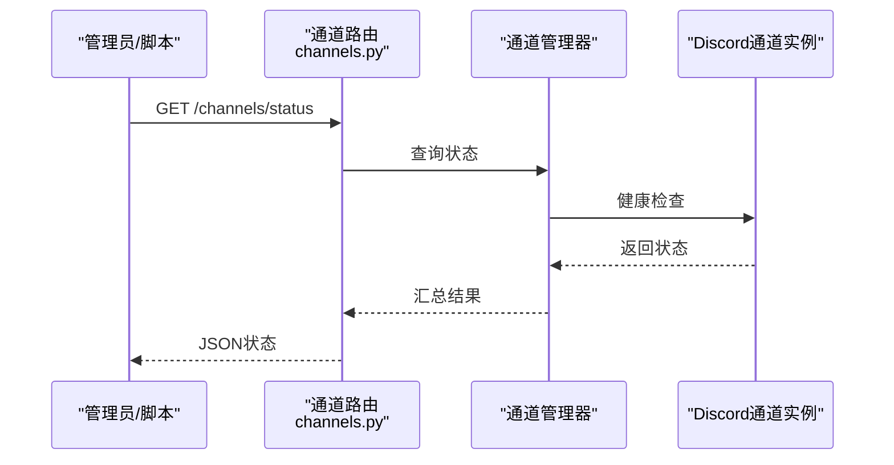
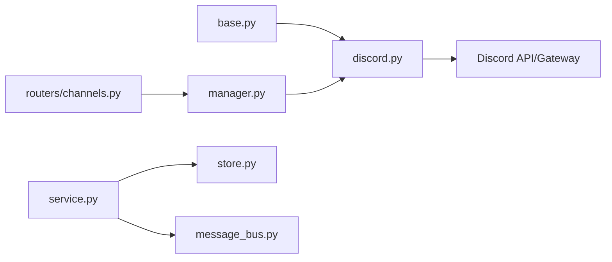

# Discord渠道集成

<cite>
**本文引用的文件**
- [backend/app/channels/discord.py](file://backend/app/channels/discord.py)
- [backend/app/channels/base.py](file://backend/app/channels/base.py)
- [backend/app/channels/manager.py](file://backend/app/channels/manager.py)
- [backend/app/channels/service.py](file://backend/app/channels/service.py)
- [backend/app/channels/store.py](file://backend/app/channels/store.py)
- [backend/app/channels/message_bus.py](file://backend/app/channels/message_bus.py)
- [backend/app/gateway/routers/channels.py](file://backend/app/gateway/routers/channels.py)
- [backend/tests/test_discord_channel.py](file://backend/tests/test_discord_channel.py)
</cite>

## 目录
1. [简介](#简介)
2. [项目结构](#项目结构)
3. [核心组件](#核心组件)
4. [架构总览](#架构总览)
5. [详细组件分析](#详细组件分析)
6. [依赖关系分析](#依赖关系分析)
7. [性能与可靠性](#性能与可靠性)
8. [故障排查指南](#故障排查指南)
9. [结论](#结论)
10. [附录：Discord开发者门户配置清单](#附录discord开发者门户配置清单)

## 简介
本文件面向需要在系统中接入Discord渠道的工程师与运维人员，系统性说明Discord Bot的创建与配置、消息处理机制（文本、嵌入、附件）、高级交互（Slash命令、按钮、选择菜单）适配方式、用户角色与权限集成策略，以及速率限制与WebSocket重连的实现要点。文档同时提供端到端架构图与关键流程时序图，帮助快速落地并稳定运行。

## 项目结构
Discord渠道位于后端channels模块中，采用“统一通道抽象 + 具体实现”的分层设计：
- 抽象基类定义通用接口与生命周期钩子
- Discord具体实现封装Bot客户端、事件监听、消息路由与响应发送
- 通道管理器负责注册、启停与调度
- 网关路由暴露管理接口，便于外部系统启用/禁用或查询状态
- 测试覆盖Discord通道的关键路径

图表来源
- [backend/app/channels/base.py](file://backend/app/channels/base.py)
- [backend/app/channels/discord.py](file://backend/app/channels/discord.py)
- [backend/app/channels/manager.py](file://backend/app/channels/manager.py)
- [backend/app/channels/service.py](file://backend/app/channels/service.py)
- [backend/app/channels/store.py](file://backend/app/channels/store.py)
- [backend/app/channels/message_bus.py](file://backend/app/channels/message_bus.py)
- [backend/app/gateway/routers/chapters.py](file://backend/app/gateway/routers/channels.py)

章节来源
- [backend/app/channels/base.py](file://backend/app/channels/base.py)
- [backend/app/channels/discord.py](file://backend/app/channels/discord.py)
- [backend/app/channels/manager.py](file://backend/app/channels/manager.py)
- [backend/app/gateway/routers/channels.py](file://backend/app/gateway/routers/channels.py)

## 核心组件
- 通道抽象基类：定义启动、停止、发送消息、处理事件等统一接口，确保各渠道一致的生命周期与错误处理语义。
- Discord实现：封装Discord Bot初始化、事件监听（文本、嵌入、附件、交互）、消息路由到内部工作流、结果回写至频道。
- 通道管理器：集中注册与启停所有已配置的渠道实例，提供健康检查与动态控制能力。
- 通道服务：协调消息总线与存储，完成消息入队、出队、重试与幂等处理。
- 存储：用于保存会话上下文、消息元数据、附件索引等。
- 消息总线：解耦上游事件与下游处理，支持异步并发与背压。
- 网关路由：对外暴露通道管理API，如启用/禁用、查看状态、触发诊断。

章节来源
- [backend/app/channels/base.py](file://backend/app/channels/base.py)
- [backend/app/channels/discord.py](file://backend/app/channels/discord.py)
- [backend/app/channels/manager.py](file://backend/app/channels/manager.py)
- [backend/app/channels/service.py](file://backend/app/channels/service.py)
- [backend/app/channels/store.py](file://backend/app/channels/store.py)
- [backend/app/channels/message_bus.py](file://backend/app/channels/message_bus.py)
- [backend/app/gateway/routers/channels.py](file://backend/app/gateway/routers/channels.py)

## 架构总览
下图展示从Discord客户端到后端处理再到回复的全链路流程，包括高级交互与附件处理分支。

图表来源
- [backend/app/channels/discord.py](file://backend/app/channels/discord.py)
- [backend/app/channels/manager.py](file://backend/app/channels/manager.py)
- [backend/app/channels/service.py](file://backend/app/channels/service.py)
- [backend/app/channels/store.py](file://backend/app/channels/store.py)
- [backend/app/channels/message_bus.py](file://backend/app/channels/message_bus.py)

## 详细组件分析

### Discord实现组件
- 职责
  - 初始化Bot客户端，加载Token与必要权限
  - 注册事件处理器：文本消息、嵌入消息、文件附件、Slash命令、按钮点击、选择菜单
  - 将事件转换为内部消息模型，交由通道服务处理
  - 将处理结果以文本、嵌入或文件形式回写到原频道
- 关键特性
  - 支持多服务器/多频道隔离与会话绑定
  - 对附件进行下载、校验与上传转发
  - 对交互事件进行签名验证与防重放
  - 内置速率限制与退避重试，避免触发Discord API限制
  - WebSocket断线自动重连与心跳保活

图表来源
- [backend/app/channels/discord.py](file://backend/app/channels/discord.py)
- [backend/app/channels/base.py](file://backend/app/channels/base.py)

章节来源
- [backend/app/channels/discord.py](file://backend/app/channels/discord.py)
- [backend/app/channels/base.py](file://backend/app/channels/base.py)

### 通道管理器与服务
- 通道管理器
  - 维护通道实例集合，按名称/标识分发事件
  - 提供启停、健康检查、热重载能力
- 通道服务
  - 编排消息入队、执行、重试、落盘
  - 与存储交互，读写会话与上下文
  - 对接消息总线，实现异步与并发控制

图表来源
- [backend/app/channels/manager.py](file://backend/app/channels/manager.py)
- [backend/app/channels/service.py](file://backend/app/channels/service.py)
- [backend/app/channels/message_bus.py](file://backend/app/channels/message_bus.py)
- [backend/app/channels/store.py](file://backend/app/channels/store.py)

章节来源
- [backend/app/channels/manager.py](file://backend/app/channels/manager.py)
- [backend/app/channels/service.py](file://backend/app/channels/service.py)
- [backend/app/channels/message_bus.py](file://backend/app/channels/message_bus.py)
- [backend/app/channels/store.py](file://backend/app/channels/store.py)

### 网关路由与管理接口
- 提供REST接口用于：
  - 列出已注册的通道
  - 启用/禁用特定通道
  - 获取通道健康状态与统计信息
  - 触发诊断日志与指标导出
- 典型调用链：前端/运维工具 → 网关路由 → 通道管理器 → 通道实例

图表来源
- [backend/app/gateway/routers/channels.py](file://backend/app/gateway/routers/channels.py)
- [backend/app/channels/manager.py](file://backend/app/channels/manager.py)
- [backend/app/channels/discord.py](file://backend/app/channels/discord.py)

章节来源
- [backend/app/gateway/routers/channels.py](file://backend/app/gateway/routers/channels.py)
- [backend/app/channels/manager.py](file://backend/app/channels/manager.py)

### 单元测试与回归保障
- 针对Discord通道的关键路径编写了单测，覆盖：
  - 事件解析与路由
  - 附件下载与上传
  - 交互事件签名校验
  - 限流与重试行为
  - 异常恢复与错误上报
- 建议新增用例时保持与现有测试风格一致，确保回归稳定性。

章节来源
- [backend/tests/test_discord_channel.py](file://backend/tests/test_discord_channel.py)

## 依赖关系分析
- 内聚与耦合
  - Discord实现强依赖Discord SDK与HTTP/WebSocket客户端
  - 与通道抽象低耦合，便于替换或扩展其他渠道
  - 与通道管理器松耦合，通过接口注册与事件分发
- 外部依赖
  - Discord API/Gateway：受速率限制与连接质量影响
  - 存储与消息总线：决定吞吐与一致性级别
- 潜在循环依赖
  - 通过分层与接口隔离避免直接循环引用

图表来源
- [backend/app/channels/base.py](file://backend/app/channels/base.py)
- [backend/app/channels/discord.py](file://backend/app/channels/discord.py)
- [backend/app/channels/manager.py](file://backend/app/channels/manager.py)
- [backend/app/channels/service.py](file://backend/app/channels/service.py)
- [backend/app/channels/store.py](file://backend/app/channels/store.py)
- [backend/app/channels/message_bus.py](file://backend/app/channels/message_bus.py)
- [backend/app/gateway/routers/channels.py](file://backend/app/gateway/routers/channels.py)

章节来源
- [backend/app/channels/base.py](file://backend/app/channels/base.py)
- [backend/app/channels/discord.py](file://backend/app/channels/discord.py)
- [backend/app/channels/manager.py](file://backend/app/channels/manager.py)
- [backend/app/channels/service.py](file://backend/app/channels/service.py)
- [backend/app/channels/store.py](file://backend/app/channels/store.py)
- [backend/app/channels/message_bus.py](file://backend/app/channels/message_bus.py)
- [backend/app/gateway/routers/channels.py](file://backend/app/gateway/routers/channels.py)

## 性能与可靠性
- 速率限制处理
  - 在发送消息、编辑消息、上传附件等高频操作前进行令牌桶/滑动窗口限流
  - 遇到429时实施指数退避与抖动，避免雪崩
  - 对全局与频道级配额分别计数，防止跨频道干扰
- WebSocket重连机制
  - 监听断线事件，自动重建连接并恢复会话
  - 使用心跳与超时检测，及时感知网络异常
  - 重连失败时降级为轮询或告警，保证可用性
- 并发与背压
  - 基于消息总线进行异步处理，设置最大并发与队列长度
  - 对长耗时任务采用分片与进度反馈，避免阻塞
- 资源与内存
  - 大附件流式下载/上传，避免一次性加载到内存
  - 定期清理临时文件与过期会话缓存

[本节为通用指导，不直接分析具体文件]

## 故障排查指南
- 常见问题定位
  - Token无效或权限不足：检查Bot Token与所需权限位是否开启
  - 无法加入服务器：确认邀请链接有效且Bot具备“加入服务器”权限
  - 消息未送达：检查速率限制与网络连通性，查看429与超时日志
  - 附件失败：核对大小限制、MIME类型与存储空间
  - 交互无响应：校验签名、事件ID与幂等键
- 诊断手段
  - 通过网关路由获取通道健康状态与最近错误
  - 打开调试日志，关注事件解析、限流与重连细节
  - 使用单测套件复现问题路径，逐步缩小范围

章节来源
- [backend/app/gateway/routers/channels.py](file://backend/app/gateway/routers/channels.py)
- [backend/tests/test_discord_channel.py](file://backend/tests/test_discord_channel.py)

## 结论
本集成方案以统一的通道抽象为基础，结合Discord SDK的事件驱动模型，实现了文本、嵌入、附件与高级交互的全面支持。通过限流、重连与消息总线，系统在稳定性与可扩展性方面具备良好表现。配合完善的测试与诊断接口，能够快速定位与解决问题，满足生产环境的高可用要求。

[本节为总结性内容，不直接分析具体文件]

## 附录：Discord开发者门户配置清单
- 创建应用与Bot
  - 在开发者门户创建应用，添加Bot用户，生成并保管好Bot Token
- 权限设置
  - 按需开启“发送消息”、“嵌入链接”、“上传文件”、“读取消息历史”、“使用斜杠命令”等权限
- 服务器邀请
  - 使用OAuth2授权码流程或邀请链接将Bot添加到目标服务器，并确保Bot拥有相应频道权限
- 交互功能
  - 注册Slash命令、按钮与选择菜单的回调标识
  - 配置交互签名密钥，并在服务端进行校验
- 安全与合规
  - 仅申请最小必要权限，遵循隐私与数据安全规范
  - 记录审计日志，保留必要的请求ID以便追踪

[本节为概念性指引，不直接分析具体文件]