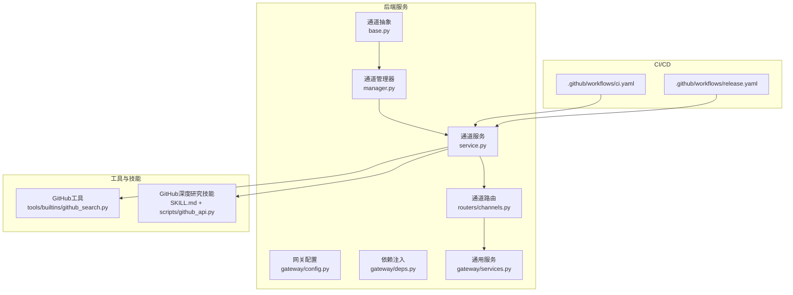
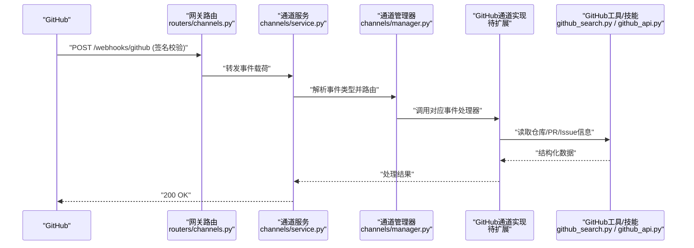
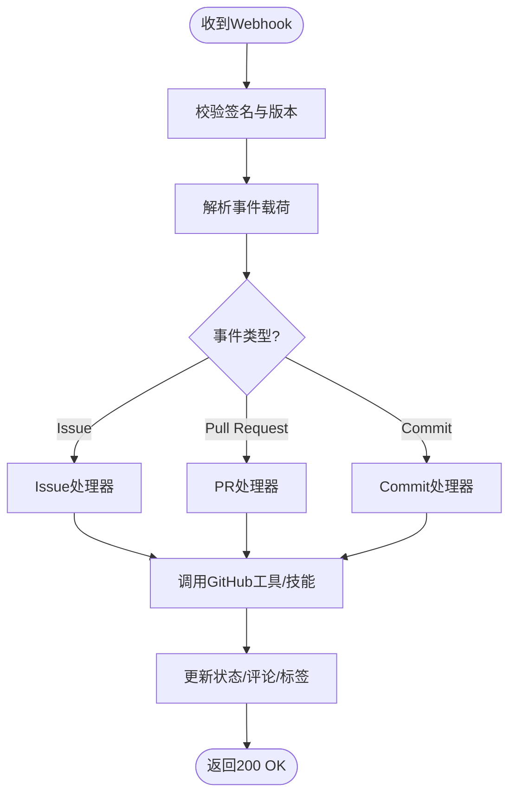
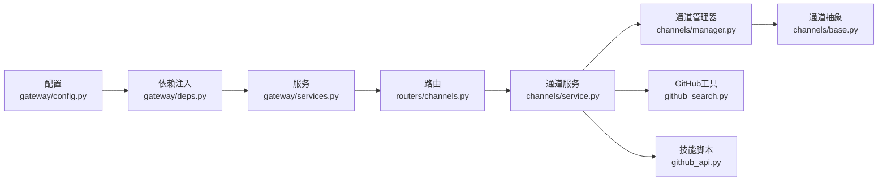

# GitHub渠道集成

<cite>
**本文引用的文件**   
- [backend/app/channels/base.py](file://backend/app/channels/base.py)
- [backend/app/channels/manager.py](file://backend/app/channels/manager.py)
- [backend/app/channels/service.py](file://backend/app/channels/service.py)
- [backend/app/gateway/routers/channels.py](file://backend/app/gateway/routers/channels.py)
- [backend/app/gateway/config.py](file://backend/app/gateway/config.py)
- [backend/app/gateway/deps.py](file://backend/app/gateway/deps.py)
- [backend/app/gateway/services.py](file://backend/app/gateway/services.py)
- [backend/app/harness/deerflow/tools/builtins/github_search.py](file://backend/app/harness/deerflow/tools/builtins/github_search.py)
- [skills/public/github-deep-research/SKILL.md](file://skills/public/github-deep-research/SKILL.md)
- [skills/public/github-deep-research/scripts/github_api.py](file://skills/public/github-deep-research/scripts/github_api.py)
- [.github/workflows/ci.yaml](file://.github/workflows/ci.yaml)
- [.github/workflows/release.yaml](file://.github/workflows/release.yaml)
- [config.example.yaml](file://config.example.yaml)
</cite>

## 目录
1. [简介](#简介)
2. [项目结构](#项目结构)
3. [核心组件](#核心组件)
4. [架构总览](#架构总览)
5. [详细组件分析](#详细组件分析)
6. [依赖关系分析](#依赖关系分析)
7. [性能考虑](#性能考虑)
8. [故障排查指南](#故障排查指南)
9. [结论](#结论)
10. [附录](#附录)

## 简介
本文件面向希望在系统中接入GitHub渠道的开发者与运维人员，提供从GitHub App创建、安装与权限配置，到事件监听（Issue、Pull Request、Commit等）、用户身份与仓库权限集成、以及GitHub Actions工作流集成的完整指南。同时结合现有代码库中的通道抽象与工具能力，给出可扩展的实现建议与最佳实践。

## 项目结构
当前仓库已具备通用的“通道”抽象与网关路由层，适合在此基础上扩展GitHub渠道。关键位置如下：
- 通道抽象与注册：位于后端通道模块，定义了统一的通道接口、管理器与服务入口。
- 网关路由：提供HTTP API用于外部系统（如GitHub Webhook）回调或查询。
- 内置工具：包含GitHub搜索等工具，可作为后续扩展的基础。
- 技能示例：提供基于脚本调用GitHub API的参考实现。
- GitHub Actions：已有CI/Release工作流模板，可复用并扩展为自动化流水线。

图表来源
- [backend/app/channels/base.py](file://backend/app/channels/base.py)
- [backend/app/channels/manager.py](file://backend/app/channels/manager.py)
- [backend/app/channels/service.py](file://backend/app/channels/service.py)
- [backend/app/gateway/routers/channels.py](file://backend/app/gateway/routers/channels.py)
- [backend/app/gateway/config.py](file://backend/app/gateway/config.py)
- [backend/app/gateway/deps.py](file://backend/app/gateway/deps.py)
- [backend/app/gateway/services.py](file://backend/app/gateway/services.py)
- [backend/app/harness/deerflow/tools/builtins/github_search.py](file://backend/app/harness/deerflow/tools/builtins/github_search.py)
- [skills/public/github-deep-research/SKILL.md](file://skills/public/github-deep-research/SKILL.md)
- [skills/public/github-deep-research/scripts/github_api.py](file://skills/public/github-deep-research/scripts/github_api.py)
- [.github/workflows/ci.yaml](file://.github/workflows/ci.yaml)
- [.github/workflows/release.yaml](file://.github/workflows/release.yaml)

章节来源
- [backend/app/channels/base.py](file://backend/app/channels/base.py)
- [backend/app/channels/manager.py](file://backend/app/channels/manager.py)
- [backend/app/channels/service.py](file://backend/app/channels/service.py)
- [backend/app/gateway/routers/channels.py](file://backend/app/gateway/routers/channels.py)
- [backend/app/gateway/config.py](file://backend/app/gateway/config.py)
- [backend/app/gateway/deps.py](file://backend/app/gateway/deps.py)
- [backend/app/gateway/services.py](file://backend/app/gateway/services.py)
- [backend/app/harness/deerflow/tools/builtins/github_search.py](file://backend/app/harness/deerflow/tools/builtins/github_search.py)
- [skills/public/github-deep-research/SKILL.md](file://skills/public/github-deep-research/SKILL.md)
- [skills/public/github-deep-research/scripts/github_api.py](file://skills/public/github-deep-research/scripts/github_api.py)
- [.github/workflows/ci.yaml](file://.github/workflows/ci.yaml)
- [.github/workflows/release.yaml](file://.github/workflows/release.yaml)

## 核心组件
- 通道抽象与生命周期：定义统一接口，包括初始化、消息收发、健康检查与关闭流程，便于新增GitHub渠道时遵循一致模式。
- 通道管理器：负责通道的注册、查找与调度，支持多通道并存与动态加载。
- 通道服务：对外暴露通道相关API，供网关路由调用。
- 网关路由：提供HTTP端点，可用于接收Webhook回调、查询通道状态或触发任务。
- 内置GitHub工具：提供对GitHub资源的检索能力，可作为事件处理与自动化任务的支撑。
- 技能脚本：演示如何通过脚本调用GitHub API，便于快速验证与原型开发。

章节来源
- [backend/app/channels/base.py](file://backend/app/channels/base.py)
- [backend/app/channels/manager.py](file://backend/app/channels/manager.py)
- [backend/app/channels/service.py](file://backend/app/channels/service.py)
- [backend/app/gateway/routers/channels.py](file://backend/app/gateway/routers/channels.py)
- [backend/app/harness/deerflow/tools/builtins/github_search.py](file://backend/app/harness/deerflow/tools/builtins/github_search.py)
- [skills/public/github-deep-research/scripts/github_api.py](file://skills/public/github-deep-research/scripts/github_api.py)

## 架构总览
下图展示GitHub渠道在系统中的整体交互：GitHub通过App安装与Webhook将事件推送至后端；后端通过通道服务与管理器进行分发；事件处理器调用GitHub工具或技能脚本完成业务逻辑；结果可通过通道返回或写入持久化存储。

图表来源
- [backend/app/gateway/routers/channels.py](file://backend/app/gateway/routers/channels.py)
- [backend/app/channels/service.py](file://backend/app/channels/service.py)
- [backend/app/channels/manager.py](file://backend/app/channels/manager.py)
- [backend/app/harness/deerflow/tools/builtins/github_search.py](file://backend/app/harness/deerflow/tools/builtins/github_search.py)
- [skills/public/github-deep-research/scripts/github_api.py](file://skills/public/github-deep-research/scripts/github_api.py)

## 详细组件分析

### GitHub App创建与配置
- 创建GitHub App：在目标组织或账户下新建App，记录App ID与私钥。
- 安装App：选择安装范围（全部仓库或指定仓库），授予所需权限。
- Webhook设置：配置回调URL指向后端网关的Webhook端点，启用事件订阅（如Issues、Pull Requests、Commits）。
- 权限范围：按需开启读写权限，例如读取Issue/PR、提交评论、更新标签等。

章节来源
- [backend/app/gateway/routers/channels.py](file://backend/app/gateway/routers/channels.py)
- [backend/app/gateway/config.py](file://backend/app/gateway/config.py)

### 事件处理机制（Issue、Pull Request、Commit）
- 事件接收：网关路由对请求进行签名校验与格式解析。
- 事件分发：通道服务根据action与event类型路由到具体处理器。
- 数据处理：调用GitHub工具或技能脚本获取上下文信息，执行策略（如自动打标签、生成摘要、触发审查）。
- 结果反馈：向GitHub写回评论、状态或更新Issue/PR字段。

图表来源
- [backend/app/gateway/routers/channels.py](file://backend/app/gateway/routers/channels.py)
- [backend/app/channels/service.py](file://backend/app/channels/service.py)
- [backend/app/harness/deerflow/tools/builtins/github_search.py](file://backend/app/harness/deerflow/tools/builtins/github_search.py)
- [skills/public/github-deep-research/scripts/github_api.py](file://skills/public/github-deep-research/scripts/github_api.py)

### GitHub特有功能适配
- 代码审查：在PR事件处理器中，自动添加审查者、生成变更摘要、标记风险点。
- 自动化工作流：通过Webhook触发内部任务，或在GitHub Actions中编排端到端流程。
- 项目看板：根据Issue状态同步到看板列，自动分配负责人与优先级。

章节来源
- [skills/public/github-deep-research/SKILL.md](file://skills/public/github-deep-research/SKILL.md)
- [skills/public/github-deep-research/scripts/github_api.py](file://skills/public/github-deep-research/scripts/github_api.py)

### 用户身份与仓库权限集成
- 使用App私钥生成JWT访问令牌，以应用身份访问受限资源。
- 针对特定仓库，使用安装令牌进行细粒度授权。
- 在事件处理中，依据仓库成员与角色决定操作权限。

章节来源
- [backend/app/gateway/config.py](file://backend/app/gateway/config.py)
- [backend/app/gateway/deps.py](file://backend/app/gateway/deps.py)
- [backend/app/gateway/services.py](file://backend/app/gateway/services.py)

### GitHub Actions集成示例与自定义工作流
- 复用现有CI/Release模板，增加构建、测试、发布步骤。
- 在PR事件中触发质量门禁（lint、test、security scan）。
- 在合并后自动部署或生成制品。

章节来源
- [.github/workflows/ci.yaml](file://.github/workflows/ci.yaml)
- [.github/workflows/release.yaml](file://.github/workflows/release.yaml)

### GitHub API访问令牌管理与错误处理策略
- 令牌管理：集中化存储与轮换，避免硬编码；按作用域最小化授权。
- 重试与退避：对限流与网络异常实施指数退避与重试。
- 幂等性：确保重复事件不会导致副作用（如重复评论）。
- 审计日志：记录关键操作与失败原因，便于排障。

章节来源
- [backend/app/gateway/config.py](file://backend/app/gateway/config.py)
- [backend/app/gateway/deps.py](file://backend/app/gateway/deps.py)
- [backend/app/gateway/services.py](file://backend/app/gateway/services.py)

## 依赖关系分析
- 通道层依赖网关配置与依赖注入，保证可插拔与可测试性。
- 事件处理器依赖GitHub工具与技能脚本，形成松耦合的数据访问层。
- CI/CD与工作流作为外部驱动，通过API或Webhook与后端交互。

图表来源
- [backend/app/gateway/config.py](file://backend/app/gateway/config.py)
- [backend/app/gateway/deps.py](file://backend/app/gateway/deps.py)
- [backend/app/gateway/services.py](file://backend/app/gateway/services.py)
- [backend/app/gateway/routers/channels.py](file://backend/app/gateway/routers/channels.py)
- [backend/app/channels/service.py](file://backend/app/channels/service.py)
- [backend/app/channels/manager.py](file://backend/app/channels/manager.py)
- [backend/app/channels/base.py](file://backend/app/channels/base.py)
- [backend/app/harness/deerflow/tools/builtins/github_search.py](file://backend/app/harness/deerflow/tools/builtins/github_search.py)
- [skills/public/github-deep-research/scripts/github_api.py](file://skills/public/github-deep-research/scripts/github_api.py)

章节来源
- [backend/app/gateway/config.py](file://backend/app/gateway/config.py)
- [backend/app/gateway/deps.py](file://backend/app/gateway/deps.py)
- [backend/app/gateway/services.py](file://backend/app/gateway/services.py)
- [backend/app/gateway/routers/channels.py](file://backend/app/gateway/routers/channels.py)
- [backend/app/channels/service.py](file://backend/app/channels/service.py)
- [backend/app/channels/manager.py](file://backend/app/channels/manager.py)
- [backend/app/channels/base.py](file://backend/app/channels/base.py)
- [backend/app/harness/deerflow/tools/builtins/github_search.py](file://backend/app/harness/deerflow/tools/builtins/github_search.py)
- [skills/public/github-deep-research/scripts/github_api.py](file://skills/public/github-deep-research/scripts/github_api.py)

## 性能考虑
- 事件去重与批处理：避免重复处理相同事件，必要时聚合批量处理。
- 异步与并发：对I/O密集操作采用异步模型，提升吞吐。
- 缓存热点数据：对频繁读取的仓库元数据与用户信息进行缓存。
- 限流与背压：遵循GitHub API速率限制，合理排队与降级。

[本节为通用指导，不直接分析具体文件]

## 故障排查指南
- Webhook签名校验失败：确认密钥与算法匹配，检查时间戳与重放保护。
- 令牌无效或过期：检查App私钥与安装令牌有效期，确保作用域正确。
- 事件未触发：核对Webhook订阅的事件类型与回调URL可达性。
- 处理超时或失败：查看日志与重试策略，定位下游依赖问题。

章节来源
- [backend/app/gateway/routers/channels.py](file://backend/app/gateway/routers/channels.py)
- [backend/app/gateway/config.py](file://backend/app/gateway/config.py)
- [backend/app/gateway/deps.py](file://backend/app/gateway/deps.py)
- [backend/app/gateway/services.py](file://backend/app/gateway/services.py)

## 结论
通过在现有通道抽象与网关路由基础上扩展GitHub渠道，可实现稳定的事件驱动集成。配合GitHub App的权限控制与Actions工作流，能够覆盖代码审查、自动化流水线与项目管理等协作场景。建议在实现中重视令牌管理、幂等性与可观测性，以确保生产环境的可靠性与可维护性。

## 附录
- 配置示例与环境变量：参考配置文件样例，完善GitHub相关参数。
- 技能文档与脚本：参考GitHub深度研究技能说明与脚本，快速验证API调用。

章节来源
- [config.example.yaml](file://config.example.yaml)
- [skills/public/github-deep-research/SKILL.md](file://skills/public/github-deep-research/SKILL.md)
- [skills/public/github-deep-research/scripts/github_api.py](file://skills/public/github-deep-research/scripts/github_api.py)