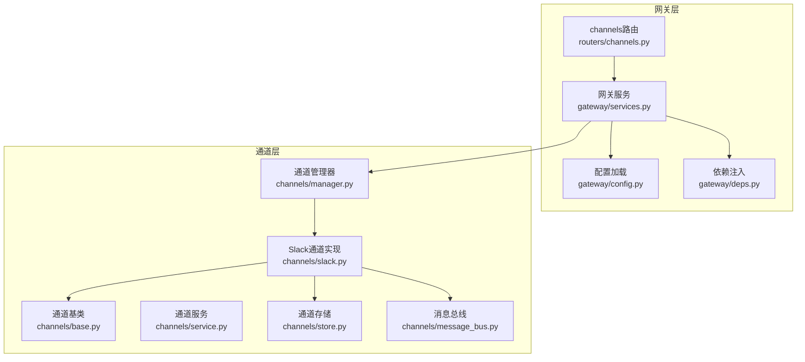
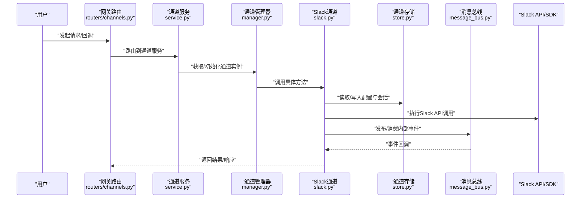
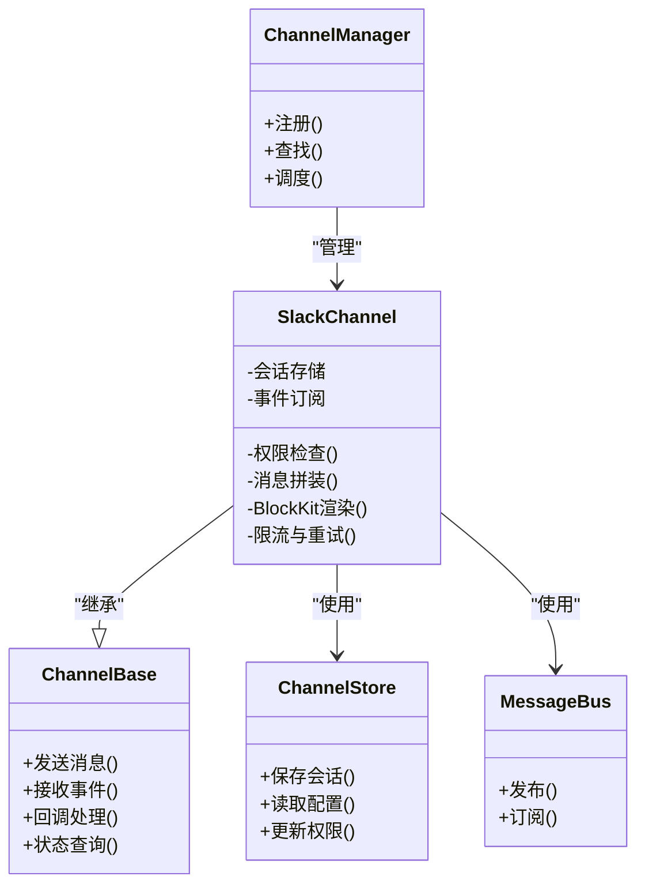
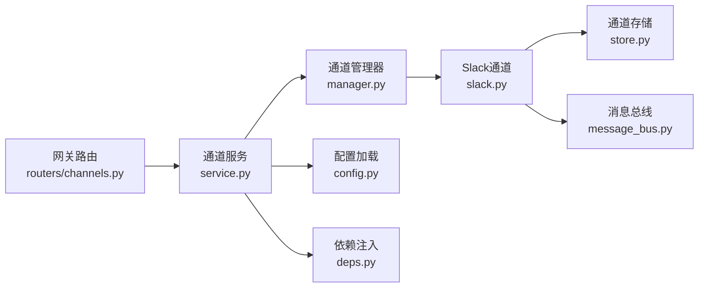

# Slack渠道集成

<cite>
**本文引用的文件**   
- [backend/app/channels/slack.py](file://backend/app/channels/slack.py)
- [backend/app/channels/base.py](file://backend/app/channels/base.py)
- [backend/app/channels/manager.py](file://backend/app/channels/manager.py)
- [backend/app/channels/service.py](file://backend/app/channels/service.py)
- [backend/app/channels/store.py](file://backend/app/channels/store.py)
- [backend/app/channels/message_bus.py](file://backend/app/channels/message_bus.py)
- [backend/app/gateway/routers/channels.py](file://backend/app/gateway/routers/channels.py)
- [backend/app/gateway/config.py](file://backend/app/gateway/config.py)
- [backend/app/gateway/deps.py](file://backend/app/gateway/deps.py)
- [backend/app/gateway/services.py](file://backend/app/gateway/services.py)
- [backend/tests/test_channels.py](file://backend/tests/test_channels.py)
</cite>

## 目录
1. [简介](#简介)
2. [项目结构](#项目结构)
3. [核心组件](#核心组件)
4. [架构总览](#架构总览)
5. [详细组件分析](#详细组件分析)
6. [依赖关系分析](#依赖关系分析)
7. [性能与限流](#性能与限流)
8. [故障排查指南](#故障排查指南)
9. [结论](#结论)
10. [附录：配置与密钥管理](#附录配置与密钥管理)

## 简介
本文件面向需要在系统中接入Slack渠道的工程师与运维人员，提供从应用创建、OAuth授权、权限申请、事件订阅到消息处理、Block Kit界面、交互式组件、多行消息展示、用户组与频道权限管理、API限流与错误重试等全链路实现说明。文档基于仓库中Slack渠道相关源码进行梳理，确保内容与实际代码一致。

## 项目结构
Slack渠道位于后端channels模块，遵循统一的Channel抽象接口，并通过网关路由暴露对外能力。关键位置如下：
- channels层：定义Slack通道实现、基础抽象、通道管理器、服务编排、持久化存储与消息总线
- gateway层：提供通道相关的HTTP路由、配置加载、依赖注入与服务调用
- tests层：包含通道相关测试用例

图表来源
- [backend/app/gateway/routers/channels.py](file://backend/app/gateway/routers/channels.py)
- [backend/app/gateway/config.py](file://backend/app/gateway/config.py)
- [backend/app/gateway/deps.py](file://backend/app/gateway/deps.py)
- [backend/app/gateway/services.py](file://backend/app/gateway/services.py)
- [backend/app/channels/base.py](file://backend/app/channels/base.py)
- [backend/app/channels/slack.py](file://backend/app/channels/slack.py)
- [backend/app/channels/manager.py](file://backend/app/channels/manager.py)
- [backend/app/channels/service.py](file://backend/app/channels/service.py)
- [backend/app/channels/store.py](file://backend/app/channels/store.py)
- [backend/app/channels/message_bus.py](file://backend/app/channels/message_bus.py)

章节来源
- [backend/app/channels/slack.py](file://backend/app/channels/slack.py)
- [backend/app/channels/base.py](file://backend/app/channels/base.py)
- [backend/app/channels/manager.py](file://backend/app/channels/manager.py)
- [backend/app/channels/service.py](file://backend/app/channels/service.py)
- [backend/app/channels/store.py](file://backend/app/channels/store.py)
- [backend/app/channels/message_bus.py](file://backend/app/channels/message_bus.py)
- [backend/app/gateway/routers/channels.py](file://backend/app/gateway/routers/channels.py)
- [backend/app/gateway/config.py](file://backend/app/gateway/config.py)
- [backend/app/gateway/deps.py](file://backend/app/gateway/deps.py)
- [backend/app/gateway/services.py](file://backend/app/gateway/services.py)

## 核心组件
- 通道基类（Base）：定义统一的消息发送、接收、回调、状态查询等接口契约，供各渠道复用
- Slack通道实现（Slack）：封装Slack SDK调用、事件解析、消息拼装、Block Kit渲染、交互回调处理、线程与频道上下文管理
- 通道管理器（Manager）：负责通道实例生命周期、注册、查找与调度
- 通道服务（Service）：编排业务逻辑，协调管理器、存储、消息总线与外部SDK
- 通道存储（Store）：持久化Slack会话、令牌、频道/用户映射、事件订阅配置等
- 消息总线（MessageBus）：内部异步消息分发，解耦Slack事件与业务处理
- 网关路由（Gateway Channels Router）：暴露REST API用于配置、鉴权、事件回调入口等

章节来源
- [backend/app/channels/base.py](file://backend/app/channels/base.py)
- [backend/app/channels/slack.py](file://backend/app/channels/slack.py)
- [backend/app/channels/manager.py](file://backend/app/channels/manager.py)
- [backend/app/channels/service.py](file://backend/app/channels/service.py)
- [backend/app/channels/store.py](file://backend/app/channels/store.py)
- [backend/app/channels/message_bus.py](file://backend/app/channels/message_bus.py)
- [backend/app/gateway/routers/channels.py](file://backend/app/gateway/routers/channels.py)

## 架构总览
整体采用“网关路由 -> 通道服务 -> 通道管理器 -> 具体通道实现”的分层架构。Slack通道通过消息总线与系统其他部分解耦，使用存储保存会话与配置，通过Slack官方SDK完成认证、事件订阅与消息发送。

图表来源
- [backend/app/gateway/routers/channels.py](file://backend/app/gateway/routers/channels.py)
- [backend/app/gateway/services.py](file://backend/app/gateway/services.py)
- [backend/app/channels/service.py](file://backend/app/channels/service.py)
- [backend/app/channels/manager.py](file://backend/app/channels/manager.py)
- [backend/app/channels/slack.py](file://backend/app/channels/slack.py)
- [backend/app/channels/store.py](file://backend/app/channels/store.py)
- [backend/app/channels/message_bus.py](file://backend/app/channels/message_bus.py)

## 详细组件分析

### Slack通道实现（Slack）
- 职责
  - 封装Slack OAuth流程、令牌刷新、权限校验
  - 解析Slack事件（消息、回调、按钮点击等），转换为内部消息模型
  - 构建并发送消息，支持Block Kit、交互式组件、多行消息
  - 维护频道/线程上下文，处理用户组与频道权限
  - 对接消息总线，触发或消费内部事件
- 关键设计
  - 继承自通道基类，统一接口约束
  - 通过存储读写Slack会话、频道映射、事件订阅配置
  - 对Slack API调用进行限流与重试包装
- 典型流程
  - 事件到达：网关回调 -> 通道服务 -> 通道管理器 -> Slack通道 -> 解析事件 -> 更新存储 -> 发布内部事件
  - 消息发送：业务侧 -> 通道服务 -> 通道管理器 -> Slack通道 -> 组装Block Kit -> 调用Slack API -> 返回结果

图表来源
- [backend/app/channels/base.py](file://backend/app/channels/base.py)
- [backend/app/channels/slack.py](file://backend/app/channels/slack.py)
- [backend/app/channels/manager.py](file://backend/app/channels/manager.py)
- [backend/app/channels/store.py](file://backend/app/channels/store.py)
- [backend/app/channels/message_bus.py](file://backend/app/channels/message_bus.py)

章节来源
- [backend/app/channels/slack.py](file://backend/app/channels/slack.py)
- [backend/app/channels/base.py](file://backend/app/channels/base.py)
- [backend/app/channels/manager.py](file://backend/app/channels/manager.py)
- [backend/app/channels/store.py](file://backend/app/channels/store.py)
- [backend/app/channels/message_bus.py](file://backend/app/channels/message_bus.py)

### 通道服务（Service）
- 职责
  - 编排Slack通道的业务流程，如事件处理、消息发送、权限校验
  - 协调管理器、存储与消息总线
  - 提供对外可调用的服务方法
- 关键点
  - 在调用Slack通道前进行参数校验与权限检查
  - 将异常转换为统一错误码，便于上层处理
  - 记录关键日志，便于追踪与排障

章节来源
- [backend/app/channels/service.py](file://backend/app/channels/service.py)

### 通道管理器（Manager）
- 职责
  - 注册与发现Slack通道实例
  - 根据上下文选择正确的通道实例进行处理
  - 管理通道生命周期与资源清理
- 关键点
  - 避免重复初始化，提高并发性能
  - 支持动态扩展新通道类型

章节来源
- [backend/app/channels/manager.py](file://backend/app/channels/manager.py)

### 通道存储（Store）
- 职责
  - 持久化Slack会话、令牌、频道/用户映射、事件订阅配置
  - 提供原子性读写操作，保证一致性
- 关键点
  - 敏感信息加密存储
  - 支持热更新配置

章节来源
- [backend/app/channels/store.py](file://backend/app/channels/store.py)

### 消息总线（MessageBus）
- 职责
  - 内部异步消息分发，解耦Slack事件与业务处理
  - 支持订阅/发布模式，提升可扩展性
- 关键点
  - 失败重试与死信队列（可选）
  - 顺序性与幂等性保障

章节来源
- [backend/app/channels/message_bus.py](file://backend/app/channels/message_bus.py)

### 网关路由（Channels Router）
- 职责
  - 暴露Slack相关HTTP端点，包括配置、鉴权、事件回调入口
  - 将请求转发至通道服务
- 关键点
  - 验证签名与时间戳，防止伪造回调
  - 限流与访问控制

章节来源
- [backend/app/gateway/routers/channels.py](file://backend/app/gateway/routers/channels.py)

## 依赖关系分析
- 组件耦合
  - Slack通道强依赖存储与消息总线，弱依赖网关路由
  - 通道服务聚合管理器、存储与消息总线，保持高内聚
- 外部依赖
  - Slack官方SDK：用于OAuth、事件订阅、消息发送、Block Kit渲染
  - 配置中心/环境变量：用于加载App凭证、回调URL、权限范围等
- 潜在循环依赖
  - 通过服务层与消息总线解耦，避免直接循环引用

图表来源
- [backend/app/gateway/routers/channels.py](file://backend/app/gateway/routers/channels.py)
- [backend/app/gateway/services.py](file://backend/app/gateway/services.py)
- [backend/app/gateway/config.py](file://backend/app/gateway/config.py)
- [backend/app/gateway/deps.py](file://backend/app/gateway/deps.py)
- [backend/app/channels/service.py](file://backend/app/channels/service.py)
- [backend/app/channels/manager.py](file://backend/app/channels/manager.py)
- [backend/app/channels/slack.py](file://backend/app/channels/slack.py)
- [backend/app/channels/store.py](file://backend/app/channels/store.py)
- [backend/app/channels/message_bus.py](file://backend/app/channels/message_bus.py)

章节来源
- [backend/app/gateway/routers/channels.py](file://backend/app/gateway/routers/channels.py)
- [backend/app/gateway/services.py](file://backend/app/gateway/services.py)
- [backend/app/gateway/config.py](file://backend/app/gateway/config.py)
- [backend/app/gateway/deps.py](file://backend/app/gateway/deps.py)
- [backend/app/channels/service.py](file://backend/app/channels/service.py)
- [backend/app/channels/manager.py](file://backend/app/channels/manager.py)
- [backend/app/channels/slack.py](file://backend/app/channels/slack.py)
- [backend/app/channels/store.py](file://backend/app/channels/store.py)
- [backend/app/channels/message_bus.py](file://backend/app/channels/message_bus.py)

## 性能与限流
- 限流策略
  - 基于Slack API速率限制，实现令牌桶或滑动窗口算法
  - 针对高频操作（如批量发送、回调处理）设置独立配额
- 重试机制
  - 对可重试错误（网络抖动、临时限流）实施指数退避与最大重试次数
  - 幂等键去重，避免重复处理导致副作用
- 并发控制
  - 使用连接池与异步IO提升吞吐
  - 对阻塞型操作引入超时与熔断保护
- 监控与告警
  - 记录限流命中、重试次数、失败率等指标
  - 阈值告警与自动降级

章节来源
- [backend/app/channels/slack.py](file://backend/app/channels/slack.py)

## 故障排查指南
- 常见问题
  - 回调签名校验失败：检查回调URL、签名密钥与时间戳
  - OAuth授权失败：确认App凭证、权限范围与重定向URI
  - 消息发送失败：检查频道ID、线程ID与权限
  - 限流频繁：调整配额与重试策略，观察Slack控制台配额
- 定位步骤
  - 查看网关路由日志与通道服务日志
  - 检查存储中的会话与配置是否正确
  - 核对消息总线的事件消费情况
- 恢复建议
  - 重置会话与令牌
  - 重新订阅事件
  - 调整限流与重试参数

章节来源
- [backend/app/gateway/routers/channels.py](file://backend/app/gateway/routers/channels.py)
- [backend/app/channels/service.py](file://backend/app/channels/service.py)
- [backend/app/channels/slack.py](file://backend/app/channels/slack.py)
- [backend/app/channels/store.py](file://backend/app/channels/store.py)
- [backend/app/channels/message_bus.py](file://backend/app/channels/message_bus.py)

## 结论
本Slack渠道集成方案以统一通道抽象为基础，结合网关路由、服务编排、存储与消息总线，实现了高内聚、低耦合的可扩展架构。通过对Slack API的限流与重试封装，提升了稳定性与可用性。后续可在Block Kit模板库、交互式组件与权限精细化方面持续优化。

## 附录：配置与密钥管理
- App创建与配置
  - 在Slack开发者平台创建App，启用OAuth与事件订阅
  - 配置回调URL、权限范围（scopes）、重定向URI
- 密钥管理
  - 使用环境变量或配置中心管理Client ID、Client Secret、Signing Secret、Bot Token
  - 敏感信息加密存储，定期轮换
- 权限与用户组
  - 按频道与用户组最小权限原则分配scopes
  - 动态更新权限映射，支持热重载
- 事件订阅
  - 订阅消息、回调、成员变更等事件
  - 校验签名与时间戳，防伪造
- 限流与重试
  - 依据Slack配额设置合理阈值
  - 实现指数退避与最大重试次数
- 测试与验证
  - 使用单元测试与集成测试覆盖关键路径
  - 模拟限流与失败场景，验证重试与降级

章节来源
- [backend/app/gateway/config.py](file://backend/app/gateway/config.py)
- [backend/app/gateway/deps.py](file://backend/app/gateway/deps.py)
- [backend/app/channels/slack.py](file://backend/app/channels/slack.py)
- [backend/app/channels/store.py](file://backend/app/channels/store.py)
- [backend/tests/test_channels.py](file://backend/tests/test_channels.py)