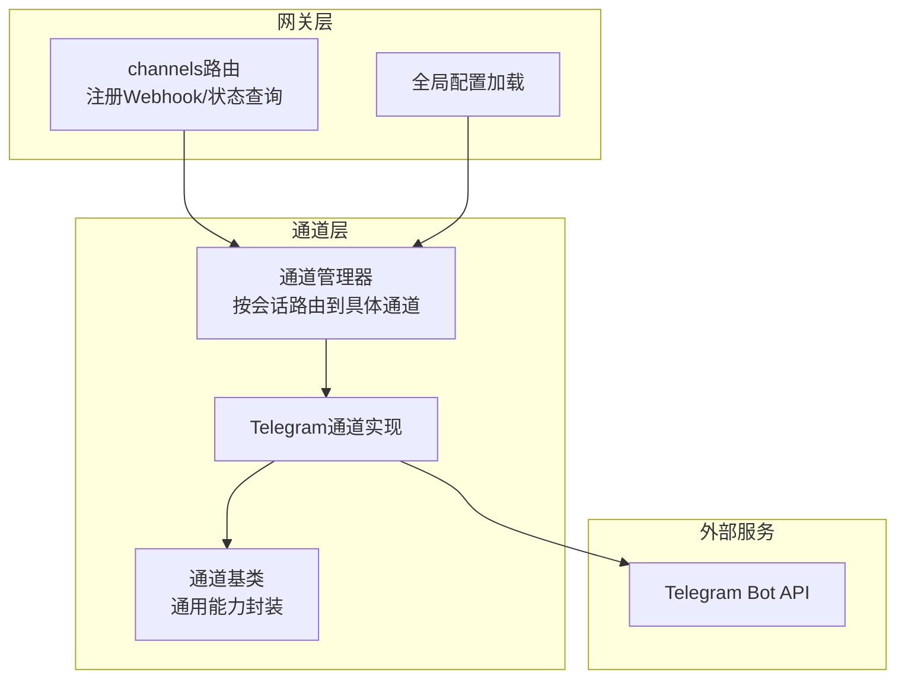
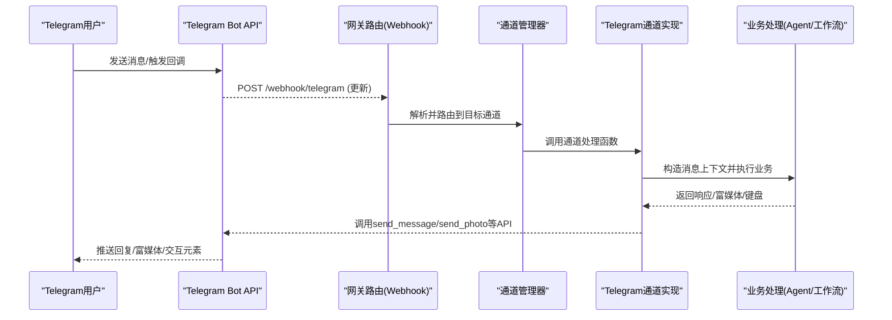
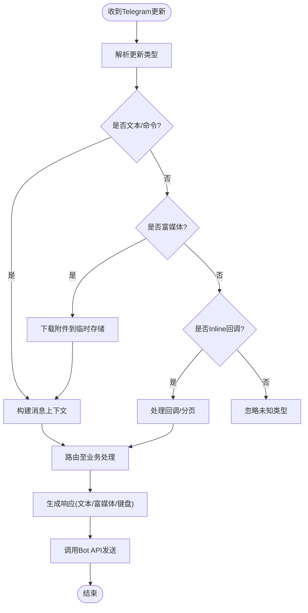
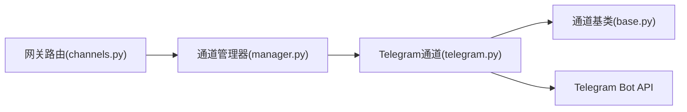

# Telegram渠道集成

<cite>
**本文引用的文件**   
- [backend/app/channels/telegram.py](file://backend/app/channels/telegram.py)
- [backend/app/channels/base.py](file://backend/app/channels/base.py)
- [backend/app/channels/manager.py](file://backend/app/channels/manager.py)
- [backend/app/gateway/routers/channels.py](file://backend/app/gateway/routers/channels.py)
- [backend/app/gateway/config.py](file://backend/app/gateway/config.py)
- [docker/docker-compose.yaml](file://docker/docker-compose.yaml)
</cite>

## 目录
1. [简介](#简介)
2. [项目结构](#项目结构)
3. [核心组件](#核心组件)
4. [架构总览](#架构总览)
5. [详细组件分析](#详细组件分析)
6. [依赖分析](#依赖分析)
7. [性能考虑](#性能考虑)
8. [故障排查指南](#故障排查指南)
9. [结论](#结论)
10. [附录](#附录)

## 简介
本文件面向需要在系统中接入Telegram渠道的开发者与运维人员，系统性说明：
- Bot Token获取、权限设置与Webhook配置方法
- 文本消息与富媒体（图片、文件、视频）的接收与发送流程
- Telegram特有交互元素适配（Inline键盘、Reply键盘、分页按钮等）
- 用户身份映射与会话管理机制
- 完整配置示例与Docker容器化部署步骤
- 常见问题排查方法与性能优化建议

## 项目结构
本项目在后端通过“通道抽象层”统一接入多种IM渠道，其中Telegram通道位于channels模块。Gateway提供HTTP路由以注册Webhook并暴露管理接口。

图示来源
- [backend/app/gateway/routers/channels.py](file://backend/app/gateway/routers/channels.py)
- [backend/app/channels/manager.py](file://backend/app/channels/manager.py)
- [backend/app/channels/telegram.py](file://backend/app/channels/telegram.py)
- [backend/app/channels/base.py](file://backend/app/channels/base.py)

章节来源
- [backend/app/channels/telegram.py](file://backend/app/channels/telegram.py)
- [backend/app/channels/base.py](file://backend/app/channels/base.py)
- [backend/app/channels/manager.py](file://backend/app/channels/manager.py)
- [backend/app/gateway/routers/channels.py](file://backend/app/gateway/routers/channels.py)

## 核心组件
- Telegram通道实现：负责解析Telegram更新、调用Bot API发送消息与富媒体、处理交互回调与分页。
- 通道基类：定义统一的通道接口与通用逻辑（如鉴权、重试、错误码映射）。
- 通道管理器：根据会话ID或用户标识将消息路由到对应通道实例。
- 网关路由：对外暴露Webhook注册与管理接口，供系统启动时自动完成Webhook绑定。

章节来源
- [backend/app/channels/telegram.py](file://backend/app/channels/telegram.py)
- [backend/app/channels/base.py](file://backend/app/channels/base.py)
- [backend/app/channels/manager.py](file://backend/app/channels/manager.py)
- [backend/app/gateway/routers/channels.py](file://backend/app/gateway/routers/channels.py)

## 架构总览
下图展示从Telegram客户端到系统内部的处理链路，以及Webhook注册过程。

图示来源
- [backend/app/gateway/routers/channels.py](file://backend/app/gateway/routers/channels.py)
- [backend/app/channels/manager.py](file://backend/app/channels/manager.py)
- [backend/app/channels/telegram.py](file://backend/app/channels/telegram.py)

## 详细组件分析

### Telegram通道实现
- 功能要点
  - 解析Telegram更新：文本、命令、富媒体（photo、document、video）、回调数据（Inline回调）。
  - 发送消息：文本、Markdown/HTML格式、富媒体（图片、文件、视频）、内联/回复键盘、分页按钮。
  - 错误处理：网络异常、限流、无效Token、权限不足等情形的降级与重试策略。
  - 会话关联：基于chat_id/user_id建立会话上下文，支持多会话隔离。
- 关键流程
  - Webhook入口：接收更新后交由通道处理器解析。
  - 富媒体下载：当收到富媒体时，先下载到本地临时存储，再转交给上层处理。
  - 富媒体发送：根据类型选择对应API（例如图片、文档、视频），必要时附带缩略图或描述。
  - 交互元素：构建Inline/Reply键盘，处理分页回调，维护页码状态。

图示来源
- [backend/app/channels/telegram.py](file://backend/app/channels/telegram.py)

章节来源
- [backend/app/channels/telegram.py](file://backend/app/channels/telegram.py)

### 通道基类与通用能力
- 职责
  - 定义通道统一接口：初始化、发送消息、发送富媒体、发送键盘、错误处理。
  - 提供通用重试、超时、日志与指标上报能力。
  - 标准化错误码与异常信息，便于上层统一处理。
- 设计模式
  - 模板方法：子类仅实现平台特定细节，复用通用流程。
  - 依赖注入：通过配置对象注入Bot Token、代理、超时等参数。

章节来源
- [backend/app/channels/base.py](file://backend/app/channels/base.py)

### 通道管理器与会话路由
- 职责
  - 根据会话标识（如chat_id）选择或创建对应的Telegram通道实例。
  - 维护通道实例生命周期与资源清理。
  - 为不同会话隔离上下文，避免跨会话污染。
- 关键点
  - 并发安全：对共享资源的访问进行同步控制。
  - 可扩展性：新增通道只需实现接口并在管理器中注册。

章节来源
- [backend/app/channels/manager.py](file://backend/app/channels/manager.py)

### 网关路由与Webhook注册
- 职责
  - 提供Webhook端点，接收Telegram服务器推送的更新。
  - 提供管理接口用于设置/删除Webhook、查询状态。
  - 校验请求来源与签名（可选），防止伪造请求。
- 配置项
  - Webhook路径、域名、证书（HTTPS要求）。
  - 最大连接数、超时时间、重试次数。

章节来源
- [backend/app/gateway/routers/channels.py](file://backend/app/gateway/routers/channels.py)

## 依赖分析
- 外部依赖
  - Telegram Bot API：所有消息收发与文件操作均通过官方API完成。
  - HTTP客户端：用于发起API请求与下载上传文件。
- 内部依赖
  - 通道基类：Telegram通道继承自基类，复用通用逻辑。
  - 通道管理器：由网关路由调用，负责实例化与路由。
  - 全局配置：从配置中心或环境变量加载Bot Token、Webhook URL等。

图示来源
- [backend/app/gateway/routers/channels.py](file://backend/app/gateway/routers/channels.py)
- [backend/app/channels/manager.py](file://backend/app/channels/manager.py)
- [backend/app/channels/telegram.py](file://backend/app/channels/telegram.py)
- [backend/app/channels/base.py](file://backend/app/channels/base.py)

章节来源
- [backend/app/gateway/routers/channels.py](file://backend/app/gateway/routers/channels.py)
- [backend/app/channels/manager.py](file://backend/app/channels/manager.py)
- [backend/app/channels/telegram.py](file://backend/app/channels/telegram.py)
- [backend/app/channels/base.py](file://backend/app/channels/base.py)

## 性能考虑
- 连接池与并发
  - 复用HTTP连接，减少握手开销；合理设置并发上限，避免阻塞。
- 超时与重试
  - 针对网络抖动与Telegram限流设置指数退避重试；区分可重试与不可重试错误。
- 富媒体处理
  - 大文件分块下载/上传；使用临时目录并定期清理；限制单文件大小。
- 缓存与去重
  - 对频繁使用的静态资源（如头像、缩略图）进行缓存；对重复消息进行去重。
- 监控与告警
  - 记录关键指标：QPS、延迟、失败率、文件大小分布；设置阈值告警。

[本节为通用指导，不直接分析具体文件]

## 故障排查指南
- Webhook无法接收
  - 检查公网可达性与HTTPS证书；确认Webhook路径与端口正确；查看网关日志。
- 消息未送达
  - 核对Bot Token与权限；检查chat_id有效性；查看Telegram API返回的错误码。
- 富媒体失败
  - 验证文件大小与类型限制；检查磁盘空间与临时目录权限；确认网络代理配置。
- 交互元素无响应
  - 确认回调数据签名与payload格式；检查分页状态是否越界；查看回调处理日志。
- 限流与错误码
  - 关注Telegram限流提示；实现退避重试；对不可恢复错误快速失败并记录详情。

章节来源
- [backend/app/gateway/routers/channels.py](file://backend/app/gateway/routers/channels.py)
- [backend/app/channels/telegram.py](file://backend/app/channels/telegram.py)

## 结论
通过统一的通道抽象与清晰的Webhook路由，Telegram渠道在本项目中具备良好的扩展性与稳定性。结合合理的性能优化与完善的故障排查手段，可在生产环境中稳定支撑文本与富媒体消息、以及丰富的交互场景。

[本节为总结性内容，不直接分析具体文件]

## 附录

### 一、Bot Token获取与权限设置
- 获取Bot Token
  - 通过@BotFather创建新Bot，保存其Token。
- 必要权限
  - 启用Webhook模式；如需接收富媒体，确保Bot具备相应能力（默认已包含）。
- 安全建议
  - 将Token作为环境变量注入，避免硬编码；限制Webhook来源IP（可选）。

[本节为通用指导，不直接分析具体文件]

### 二、Webhook配置
- 配置项
  - Webhook URL：公网可达的HTTPS地址，如 https://your-domain/webhook/telegram
  - 最大连接数与超时：根据负载调整
  - 证书：使用受信任CA签发的证书
- 注册流程
  - 启动时调用管理接口设置Webhook；或通过网关路由提供的接口动态注册。
- 验证方式
  - 向Bot发送消息，观察是否收到更新；查看网关日志与Telegram侧状态。

章节来源
- [backend/app/gateway/routers/channels.py](file://backend/app/gateway/routers/channels.py)

### 三、环境变量与配置示例
- 推荐环境变量
  - TELEGRAM_BOT_TOKEN：Bot Token
  - WEBHOOK_URL：Webhook公网地址
  - MAX_CONNECTIONS：HTTP最大连接数
  - REQUEST_TIMEOUT：请求超时秒数
  - RETRY_MAX：最大重试次数
- 配置加载
  - 从环境变量读取并注入到通道管理器与网关路由。

章节来源
- [backend/app/gateway/config.py](file://backend/app/gateway/config.py)

### 四、Docker容器化部署
- 镜像构建
  - 使用项目根目录Dockerfile构建后端镜像。
- 编排文件
  - 使用docker-compose.yaml定义服务、端口映射、环境变量与卷挂载。
- 运行步骤
  - 准备.env文件，填入TELEGRAM_BOT_TOKEN与WEBHOOK_URL等变量。
  - 执行编排脚本启动服务；确认Webhook注册成功。
- 反向代理
  - 建议使用Nginx/Traefik提供HTTPS与证书管理。

章节来源
- [docker/docker-compose.yaml](file://docker/docker-compose.yaml)

### 五、消息处理与富媒体流程
- 文本与命令
  - 解析文本内容，提取命令与参数，构造上下文后进入业务处理。
- 富媒体接收
  - 识别photo/document/video等类型，下载至临时目录，传递文件路径给上层。
- 富媒体发送
  - 根据类型选择对应API，附带描述或缩略图；对超大文件进行压缩或分片。
- 交互元素
  - Inline键盘：用于内联操作与回调；Reply键盘：用于快捷输入；分页按钮：维护页码状态。

章节来源
- [backend/app/channels/telegram.py](file://backend/app/channels/telegram.py)

### 六、用户身份映射与会话管理
- 身份映射
  - 使用chat_id/user_id作为唯一标识，映射到系统内部用户模型。
- 会话隔离
  - 每个chat_id对应独立会话上下文，避免消息交叉。
- 状态持久化
  - 将分页状态、临时文件路径等写入会话存储，保证重启后可恢复。

章节来源
- [backend/app/channels/manager.py](file://backend/app/channels/manager.py)
- [backend/app/channels/telegram.py](file://backend/app/channels/telegram.py)

### 七、常见配置清单与最佳实践
- 最小可用配置
  - TELEGRAM_BOT_TOKEN、WEBHOOK_URL、MAX_CONNECTIONS、REQUEST_TIMEOUT
- 生产环境建议
  - 启用HTTPS与证书轮换；限制请求大小；开启健康检查与探针；集中日志与追踪。
- 回滚与灰度
  - 通过编排文件版本化管理；逐步切换流量；保留旧版本以便快速回滚。

章节来源
- [backend/app/gateway/config.py](file://backend/app/gateway/config.py)
- [docker/docker-compose.yaml](file://docker/docker-compose.yaml)