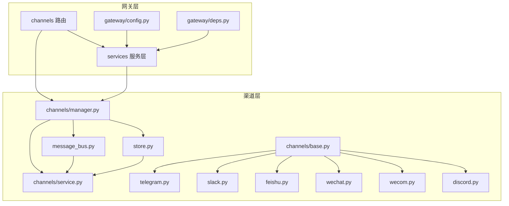
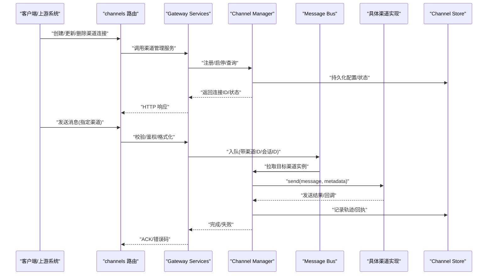
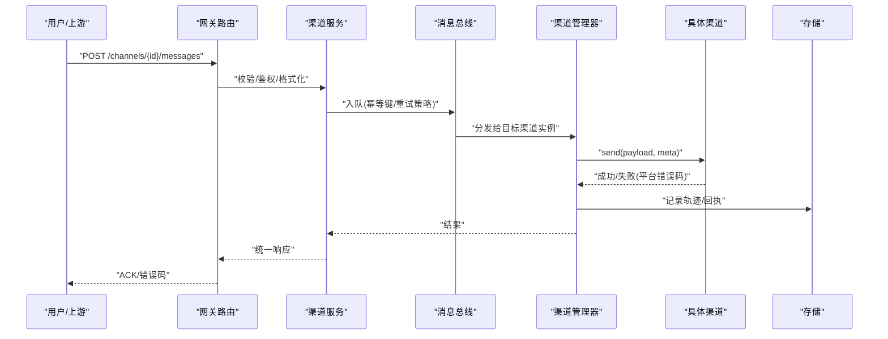
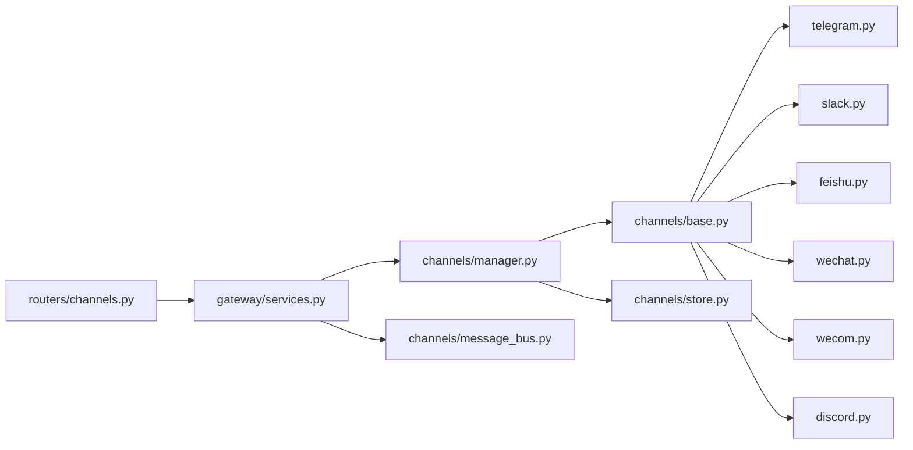

# 多渠道集成

<cite>
**本文引用的文件**
- [backend/app/channels/base.py](file://backend/app/channels/base.py)
- [backend/app/channels/manager.py](file://backend/app/channels/manager.py)
- [backend/app/channels/service.py](file://backend/app/channels/service.py)
- [backend/app/channels/message_bus.py](file://backend/app/channels/message_bus.py)
- [backend/app/channels/store.py](file://backend/app/channels/store.py)
- [backend/app/channels/telegram.py](file://backend/app/channels/telegram.py)
- [backend/app/channels/slack.py](file://backend/app/channels/slack.py)
- [backend/app/channels/feishu.py](file://backend/app/channels/feishu.py)
- [backend/app/channels/wechat.py](file://backend/app/channels/wechat.py)
- [backend/app/channels/wecom.py](file://backend/app/channels/wecom.py)
- [backend/app/channels/discord.py](file://backend/app/channels/discord.py)
- [backend/app/gateway/routers/channels.py](file://backend/app/gateway/routers/channels.py)
- [backend/app/gateway/services.py](file://backend/app/gateway/services.py)
- [backend/app/gateway/config.py](file://backend/app/gateway/config.py)
- [backend/app/gateway/deps.py](file://backend/app/gateway/deps.py)
- [backend/tests/test_channels.py](file://backend/tests/test_channels.py)
- [backend/tests/test_wechat_channel.py](file://backend/tests/test_wechat_channel.py)
- [backend/tests/test_discord_channel.py](file://backend/tests/test_discord_channel.py)
- [backend/tests/test_feishu_parser.py](file://backend/tests/test_feishu_parser.py)
- [backend/tests/test_channel_file_attachments.py](file://backend/tests/test_channel_file_attachments.py)
- [config.example.yaml](file://config.example.yaml)
</cite>

## 目录
1. [简介](#简介)
2. [项目结构](#项目结构)
3. [核心组件](#核心组件)
4. [架构总览](#架构总览)
5. [详细组件分析](#详细组件分析)
6. [依赖关系分析](#依赖关系分析)
7. [性能考量](#性能考量)
8. [故障排查指南](#故障排查指南)
9. [结论](#结论)
10. [附录](#附录)

## 简介
本文件面向 DeerFlow 的多渠道 IM 集成，系统性阐述已支持的渠道（Telegram、Slack、飞书、微信、企业微信、Discord）的接入方式与能力边界；说明连接管理（认证配置、连接池、重连策略）、消息处理流程（接收、解析、路由、响应）、渠道特定功能适配（富媒体、文件、交互按钮）、状态与健康检查机制，以及自定义渠道开发规范。文末提供多渠道部署的配置示例与运维监控建议，帮助读者快速落地并稳定运行。

## 项目结构
DeerFlow 的后端将“渠道”抽象为统一接口，并通过网关暴露 REST API 进行连接管理与消息路由。关键目录与职责如下：
- backend/app/channels：渠道抽象与具体实现、通道管理器、消息总线、持久化存储等
- backend/app/gateway/routers/channels.py：渠道管理的 HTTP 路由
- backend/app/gateway/services.py：网关服务层，协调渠道服务与业务逻辑
- backend/app/gateway/config.py：网关配置加载
- backend/app/gateway/deps.py：依赖注入与生命周期钩子
- config.example.yaml：全局配置示例（含渠道开关、密钥、队列等）

图表来源
- [backend/app/gateway/routers/channels.py](file://backend/app/gateway/routers/channels.py)
- [backend/app/gateway/services.py](file://backend/app/gateway/services.py)
- [backend/app/gateway/config.py](file://backend/app/gateway/config.py)
- [backend/app/gateway/deps.py](file://backend/app/gateway/deps.py)
- [backend/app/channels/manager.py](file://backend/app/channels/manager.py)
- [backend/app/channels/service.py](file://backend/app/channels/service.py)
- [backend/app/channels/base.py](file://backend/app/channels/base.py)
- [backend/app/channels/telegram.py](file://backend/app/channels/telegram.py)
- [backend/app/channels/slack.py](file://backend/app/channels/slack.py)
- [backend/app/channels/feishu.py](file://backend/app/channels/feishu.py)
- [backend/app/channels/wechat.py](file://backend/app/channels/wechat.py)
- [backend/app/channels/wecom.py](file://backend/app/channels/wecom.py)
- [backend/app/channels/discord.py](file://backend/app/channels/discord.py)
- [backend/app/channels/message_bus.py](file://backend/app/channels/message_bus.py)
- [backend/app/channels/store.py](file://backend/app/channels/store.py)

章节来源
- [backend/app/channels/base.py](file://backend/app/channels/base.py)
- [backend/app/channels/manager.py](file://backend/app/channels/manager.py)
- [backend/app/channels/service.py](file://backend/app/channels/service.py)
- [backend/app/channels/message_bus.py](file://backend/app/channels/message_bus.py)
- [backend/app/channels/store.py](file://backend/app/channels/store.py)
- [backend/app/gateway/routers/channels.py](file://backend/app/gateway/routers/channels.py)
- [backend/app/gateway/services.py](file://backend/app/gateway/services.py)
- [backend/app/gateway/config.py](file://backend/app/gateway/config.py)
- [backend/app/gateway/deps.py](file://backend/app/gateway/deps.py)
- [config.example.yaml](file://config.example.yaml)

## 核心组件
- 渠道基类与协议
  - 定义统一的渠道抽象：连接生命周期、消息收发、健康检查、元数据与错误模型。所有具体渠道均继承该基类，保证上层一致调用。
- 渠道管理器
  - 负责渠道实例的注册、启动、停止、按标识查找、批量启停、状态聚合与统计。
- 渠道服务
  - 编排消息从网关到具体渠道的完整流程：鉴权、入队、转发、结果回写、重试与降级。
- 消息总线
  - 解耦网关与渠道，承载异步消息分发、背压控制、幂等与去重。
- 存储
  - 持久化连接配置、会话上下文、消息轨迹与审计日志，支持热更新与恢复。

章节来源
- [backend/app/channels/base.py](file://backend/app/channels/base.py)
- [backend/app/channels/manager.py](file://backend/app/channels/manager.py)
- [backend/app/channels/service.py](file://backend/app/channels/service.py)
- [backend/app/channels/message_bus.py](file://backend/app/channels/message_bus.py)
- [backend/app/channels/store.py](file://backend/app/channels/store.py)

## 架构总览
下图展示了从网关到渠道的端到端路径，包括连接管理、消息总线与存储的协作关系。

图表来源
- [backend/app/gateway/routers/channels.py](file://backend/app/gateway/routers/channels.py)
- [backend/app/gateway/services.py](file://backend/app/gateway/services.py)
- [backend/app/channels/manager.py](file://backend/app/channels/manager.py)
- [backend/app/channels/message_bus.py](file://backend/app/channels/message_bus.py)
- [backend/app/channels/store.py](file://backend/app/channels/store.py)

## 详细组件分析

### 渠道抽象与通用能力
- 统一接口
  - 连接生命周期：初始化、启动、停止、销毁
  - 消息收发：文本、富媒体、文件、交互式元素
  - 健康检查：心跳、可用性探测、指标上报
  - 错误模型：平台错误映射、可重试判定、降级策略
- 扩展点
  - 格式转换器：平台消息体与内部消息模型的互转
  - 附件处理器：上传、下载、大小限制、类型白名单
  - 事件订阅：回调、Webhook、长轮询等接入模式

章节来源
- [backend/app/channels/base.py](file://backend/app/channels/base.py)

### 渠道管理器（连接池与生命周期）
- 职责
  - 维护各渠道实例字典，提供按 channel_id 查找
  - 批量启停、优雅关闭、资源回收
  - 连接池参数：最大并发、超时、限流、退避
  - 健康探针：周期性检测、异常告警、自动恢复
- 重连策略
  - 指数退避、抖动、最大重试次数、熔断窗口
  - 断线恢复：会话重建、未消费消息补偿（由总线保障）

章节来源
- [backend/app/channels/manager.py](file://backend/app/channels/manager.py)

### 渠道服务（编排与路由）
- 职责
  - 接收网关请求，执行鉴权、配额、审计
  - 将消息投递至消息总线，等待异步结果
  - 根据渠道能力选择最佳发送路径（直发/代理/转码）
  - 聚合多源错误，返回统一响应
- 与存储交互
  - 写入消息轨迹、回执、失败原因，便于追踪与对账

章节来源
- [backend/app/channels/service.py](file://backend/app/channels/service.py)

### 消息总线（异步与可靠性）
- 特性
  - 高吞吐入队、消费者并行、顺序性可选
  - 幂等键、去重、死信队列、重试策略
  - 背压与限流：保护下游渠道与外部 API
- 与渠道耦合
  - 通过 channel_id 路由到对应实例
  - 支持跨进程/跨节点扩展（基于底层队列实现）

章节来源
- [backend/app/channels/message_bus.py](file://backend/app/channels/message_bus.py)

### 存储（配置与会话）
- 内容
  - 渠道连接配置（凭据、URL、签名、证书等）
  - 会话上下文（thread_id、用户标识、权限范围）
  - 消息轨迹（时间戳、状态、错误码、重试次数）
- 一致性
  - 读写分离、缓存热点配置、变更热加载

章节来源
- [backend/app/channels/store.py](file://backend/app/channels/store.py)

### 网关路由与服务层
- channels 路由
  - 提供连接 CRUD、状态查询、消息发送、健康检查等 REST 接口
  - 输入校验、鉴权、速率限制、审计日志
- services 服务层
  - 封装业务编排，调用渠道服务与管理器
  - 统一错误码与响应结构

章节来源
- [backend/app/gateway/routers/channels.py](file://backend/app/gateway/routers/channels.py)
- [backend/app/gateway/services.py](file://backend/app/gateway/services.py)

### 具体渠道实现概览
- Telegram
  - 接入模式：Bot Token + Webhook/长轮询
  - 能力：文本、图片、文档、内联按钮、命令
  - 注意：文件大小限制、频控、群组/频道差异
- Slack
  - 接入模式：Bot Token + Events API
  - 能力：消息、富文本 Blocks、文件、Actions
  - 注意：事件签名验证、速率限制、线程消息
- 飞书
  - 接入模式：App ID/Secret + 事件订阅
  - 能力：消息卡片、富文本、文件、交互按钮
  - 注意：事件解密、租户隔离、消息模板
- 微信（公众号/小程序）
  - 接入模式：AppID/Secret + 回调 URL
  - 能力：文本、图文、模板消息、客服消息
  - 注意：加密签名、消息去重、敏感词过滤
- 企业微信（WeCom）
  - 接入模式：CorpID/AgentId/Secret + 回调
  - 能力：应用消息、群机器人、富文本、文件
  - 注意：安全域名、IP 白名单、权限范围
- Discord
  - 接入模式：Bot Token + Gateway
  - 能力：文本、嵌入、附件、按钮、线程
  - 注意：权限范围、速率限制、大群聊优化

章节来源
- [backend/app/channels/telegram.py](file://backend/app/channels/telegram.py)
- [backend/app/channels/slack.py](file://backend/app/channels/slack.py)
- [backend/app/channels/feishu.py](file://backend/app/channels/feishu.py)
- [backend/app/channels/wechat.py](file://backend/app/channels/wechat.py)
- [backend/app/channels/wecom.py](file://backend/app/channels/wecom.py)
- [backend/app/channels/discord.py](file://backend/app/channels/discord.py)

### 消息处理流程（序列图）

图表来源
- [backend/app/gateway/routers/channels.py](file://backend/app/gateway/routers/channels.py)
- [backend/app/gateway/services.py](file://backend/app/gateway/services.py)
- [backend/app/channels/service.py](file://backend/app/channels/service.py)
- [backend/app/channels/message_bus.py](file://backend/app/channels/message_bus.py)
- [backend/app/channels/manager.py](file://backend/app/channels/manager.py)
- [backend/app/channels/store.py](file://backend/app/channels/store.py)

### 渠道特定功能适配
- 富媒体消息
  - 图片/视频/音频：统一上传入口，按渠道能力裁剪尺寸与编码
  - 富文本：Markdown/HTML 到平台原生格式的转换
- 文件传输
  - 大小限制、类型白名单、病毒扫描（可选）、分片上传（大文件）
  - 下载与预览：生成临时链接、访问控制、过期策略
- 交互式按钮与表单
  - 按钮 Action 映射、回调签名校验、防重放
  - 表单提交：字段校验、默认值填充、错误提示

章节来源
- [backend/app/channels/base.py](file://backend/app/channels/base.py)
- [backend/app/channels/telegram.py](file://backend/app/channels/telegram.py)
- [backend/app/channels/slack.py](file://backend/app/channels/slack.py)
- [backend/app/channels/feishu.py](file://backend/app/channels/feishu.py)
- [backend/app/channels/wechat.py](file://backend/app/channels/wechat.py)
- [backend/app/channels/wecom.py](file://backend/app/channels/wecom.py)
- [backend/app/channels/discord.py](file://backend/app/channels/discord.py)

### 状态管理与健康检查
- 状态机
  - 未初始化 -> 已配置 -> 已连接 -> 运行中 -> 异常 -> 已停止
- 健康检查
  - 主动探测：心跳、最小消息往返时延、错误率
  - 被动探测：平台回调可达性、签名校验、事件积压
- 自愈
  - 自动重连、熔断、降级（仅文本/仅文件/只读）
  - 指标采集：QPS、延迟、失败率、重试次数、死信数

章节来源
- [backend/app/channels/manager.py](file://backend/app/channels/manager.py)
- [backend/app/channels/base.py](file://backend/app/channels/base.py)

### 自定义渠道开发指南
- 步骤
  1) 新建模块：在 channels 目录下新增 xxx.py，继承渠道基类
  2) 实现接口：连接生命周期、消息发送、健康检查、错误映射
  3) 注册发现：在管理器或工厂中注册新渠道标识
  4) 配置项：在 store/config 中增加凭据与开关
  5) 测试：编写单测与集成用例，覆盖正常/异常/边界
- 消息协议
  - 内部消息模型：统一字段（sender、receiver、content_type、attachments、metadata）
  - 平台适配：在渠道实现中做双向转换
- 错误处理
  - 平台错误码映射为内部错误模型
  - 区分可重试与不可重试，设置重试策略与死信
- 参考实现
  - 参考现有渠道实现的结构与注释，保持风格一致

章节来源
- [backend/app/channels/base.py](file://backend/app/channels/base.py)
- [backend/app/channels/manager.py](file://backend/app/channels/manager.py)
- [backend/app/channels/store.py](file://backend/app/channels/store.py)

## 依赖关系分析
- 组件耦合
  - 路由层仅依赖服务层，服务层依赖管理器与总线，避免直接耦合具体渠道
  - 具体渠道仅依赖基类与通用工具，降低横向耦合
- 外部依赖
  - 各渠道 SDK/HTTP 客户端、队列后端（如 Redis/RabbitMQ/Kafka，取决于部署）
  - 存储后端（SQLite/PostgreSQL/对象存储用于附件）
- 潜在循环依赖
  - 通过服务层与总线解耦，避免 manager/channel 相互引用

图表来源
- [backend/app/gateway/routers/channels.py](file://backend/app/gateway/routers/channels.py)
- [backend/app/gateway/services.py](file://backend/app/gateway/services.py)
- [backend/app/channels/manager.py](file://backend/app/channels/manager.py)
- [backend/app/channels/message_bus.py](file://backend/app/channels/message_bus.py)
- [backend/app/channels/base.py](file://backend/app/channels/base.py)
- [backend/app/channels/store.py](file://backend/app/channels/store.py)
- [backend/app/channels/telegram.py](file://backend/app/channels/telegram.py)
- [backend/app/channels/slack.py](file://backend/app/channels/slack.py)
- [backend/app/channels/feishu.py](file://backend/app/channels/feishu.py)
- [backend/app/channels/wechat.py](file://backend/app/channels/wechat.py)
- [backend/app/channels/wecom.py](file://backend/app/channels/wecom.py)
- [backend/app/channels/discord.py](file://backend/app/channels/discord.py)

章节来源
- [backend/app/gateway/routers/channels.py](file://backend/app/gateway/routers/channels.py)
- [backend/app/gateway/services.py](file://backend/app/gateway/services.py)
- [backend/app/channels/manager.py](file://backend/app/channels/manager.py)
- [backend/app/channels/message_bus.py](file://backend/app/channels/message_bus.py)
- [backend/app/channels/base.py](file://backend/app/channels/base.py)
- [backend/app/channels/store.py](file://backend/app/channels/store.py)

## 性能考量
- 连接池与并发
  - 合理设置每渠道最大并发与超时，避免雪崩
  - 使用连接复用与 Keep-Alive
- 消息队列
  - 分区与顺序性权衡，热点 channel_id 单独分区
  - 背压：消费者限速、丢弃非关键消息
- 富媒体
  - 压缩与转码、CDN 加速、分片上传
- 存储
  - 读写分离、索引优化、冷热数据分层
- 观测性
  - 指标：QPS、P95/P99 延迟、错误率、重试/死信
  - 链路追踪：跨服务 TraceID 透传

[本节为通用指导，不直接分析具体文件]

## 故障排查指南
- 常见问题
  - 连接失败：检查凭据、网络可达、签名/证书、回调 URL 公网可达
  - 消息丢失：确认幂等键、去重策略、死信队列、重试次数
  - 富媒体失败：检查大小限制、类型白名单、编码格式、CDN 权限
  - 频控报错：查看平台限流、退避策略、队列堆积
- 定位手段
  - 查看渠道健康状态与最近错误码
  - 检索消息轨迹与审计日志
  - 抓取平台侧回调与签名校验结果
- 恢复策略
  - 重启渠道实例、清理死信、扩容消费者、切换备用渠道

章节来源
- [backend/app/channels/manager.py](file://backend/app/channels/manager.py)
- [backend/app/channels/store.py](file://backend/app/channels/store.py)
- [backend/app/channels/message_bus.py](file://backend/app/channels/message_bus.py)

## 结论
DeerFlow 的多渠道集成以统一抽象为核心，通过管理器、服务层与消息总线实现高内聚低耦合的架构。各渠道遵循相同接口与错误模型，具备完善的健康检查与自愈能力。配合合理的配置与监控，可在生产环境稳定支撑多 IM 平台的统一接入与消息流转。

[本节为总结，不直接分析具体文件]

## 附录

### 配置示例与要点
- 全局开关与凭据
  - 渠道启用开关、Bot/App 凭据、回调地址、签名密钥
- 队列与存储
  - 队列后端地址、主题/队列名、持久化与备份策略
- 限流与重试
  - 全局与渠道级 QPS、超时、重试次数、退避策略
- 参考
  - 参见配置文件示例中的相关段落

章节来源
- [config.example.yaml](file://config.example.yaml)

### 单元测试与验收
- 渠道连通性与基础能力
  - 文本发送、富媒体、文件、交互按钮
- 异常与边界
  - 网络异常、平台限流、无效凭据、超大附件
- 回归用例
  - 参考现有测试文件，确保新增渠道行为一致

章节来源
- [backend/tests/test_channels.py](file://backend/tests/test_channels.py)
- [backend/tests/test_wechat_channel.py](file://backend/tests/test_wechat_channel.py)
- [backend/tests/test_discord_channel.py](file://backend/tests/test_discord_channel.py)
- [backend/tests/test_feishu_parser.py](file://backend/tests/test_feishu_parser.py)
- [backend/tests/test_channel_file_attachments.py](file://backend/tests/test_channel_file_attachments.py)