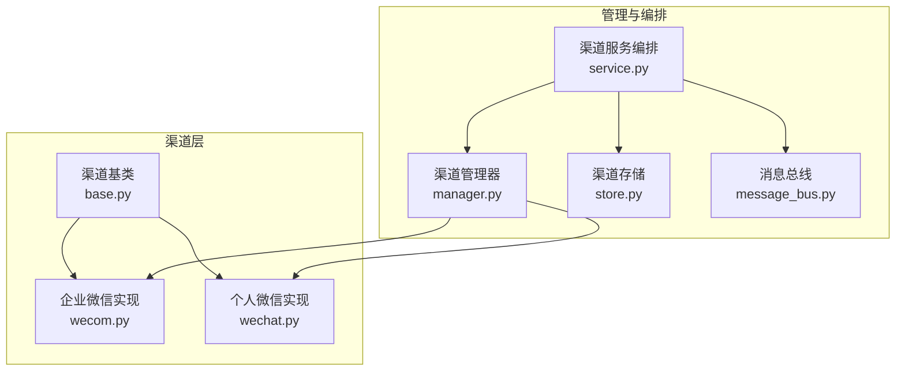
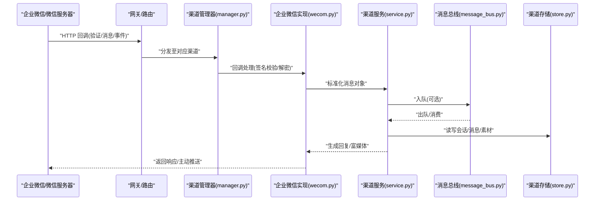
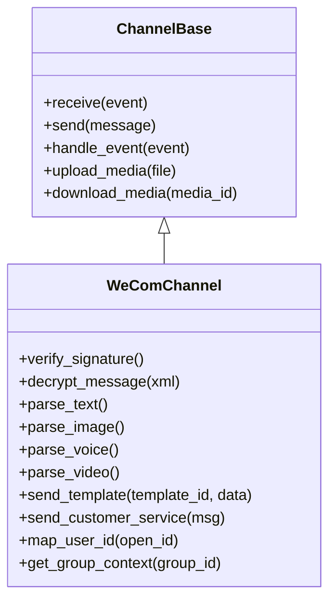
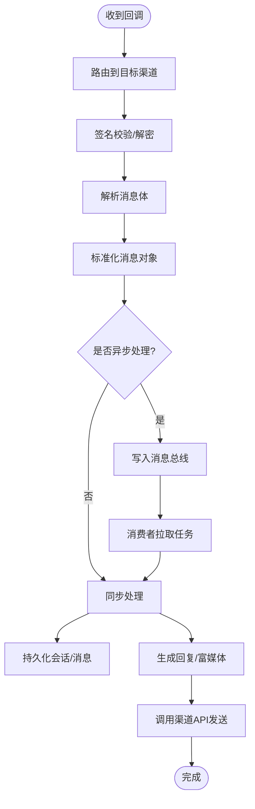
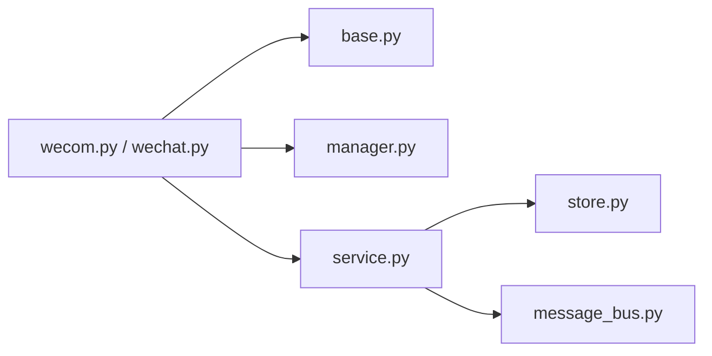

# 微信渠道集成

<cite>
**本文引用的文件**   
- [backend/app/channels/wechat.py](file://backend/app/channels/wechat.py)
- [backend/app/channels/wecom.py](file://backend/app/channels/wecom.py)
- [backend/app/channels/base.py](file://backend/app/channels/base.py)
- [backend/app/channels/manager.py](file://backend/app/channels/manager.py)
- [backend/app/channels/service.py](file://backend/app/channels/service.py)
- [backend/app/channels/store.py](file://backend/app/channels/store.py)
- [backend/app/channels/message_bus.py](file://backend/app/channels/message_bus.py)
- [backend/tests/test_wechat_channel.py](file://backend/tests/test_wechat_channel.py)
</cite>

## 目录
1. [简介](#简介)
2. [项目结构](#项目结构)
3. [核心组件](#核心组件)
4. [架构总览](#架构总览)
5. [详细组件分析](#详细组件分析)
6. [依赖关系分析](#依赖关系分析)
7. [性能与限流](#性能与限流)
8. [故障排查指南](#故障排查指南)
9. [结论](#结论)
10. [附录](#附录)

## 简介
本文件面向企业微信（WeCom）与个人微信（WeChat）的渠道集成，围绕应用配置、消息推送、权限管理、消息处理机制、微信特有功能适配、用户身份映射与群组管理、部署与安全、以及API频率限制与异常恢复等方面提供系统化说明。文档基于仓库中 channels 子系统的实现进行梳理，帮助读者快速理解并落地微信相关能力。

## 项目结构
微信渠道相关的代码集中在 backend/app/channels 目录下，采用“统一抽象 + 多通道实现”的分层设计：
- base.py：定义渠道基类与通用协议（消息收发、事件回调、会话上下文等）。
- wecom.py：企业微信渠道实现（包括回调处理、消息发送、素材上传、模板消息、客服消息等）。
- wechat.py：个人微信渠道实现（如存在），与企业微信在接口与能力上存在差异。
- manager.py：渠道注册与生命周期管理（启动、停止、路由分发）。
- service.py：上层服务编排（跨渠道的统一调用封装）。
- store.py：渠道级持久化存储（会话、消息、素材索引等）。
- message_bus.py：异步消息总线（用于解耦与削峰填谷）。

图表来源
- [backend/app/channels/base.py](file://backend/app/channels/base.py)
- [backend/app/channels/wecom.py](file://backend/app/channels/wecom.py)
- [backend/app/channels/wechat.py](file://backend/app/channels/wechat.py)
- [backend/app/channels/manager.py](file://backend/app/channels/manager.py)
- [backend/app/channels/service.py](file://backend/app/channels/service.py)
- [backend/app/channels/store.py](file://backend/app/channels/store.py)
- [backend/app/channels/message_bus.py](file://backend/app/channels/message_bus.py)

章节来源
- [backend/app/channels/base.py](file://backend/app/channels/base.py)
- [backend/app/channels/wecom.py](file://backend/app/channels/wecom.py)
- [backend/app/channels/wechat.py](file://backend/app/channels/wechat.py)
- [backend/app/channels/manager.py](file://backend/app/channels/manager.py)
- [backend/app/channels/service.py](file://backend/app/channels/service.py)
- [backend/app/channels/store.py](file://backend/app/channels/store.py)
- [backend/app/channels/message_bus.py](file://backend/app/channels/message_bus.py)

## 核心组件
- 渠道基类（base.py）
  - 职责：定义统一的渠道接入协议，包括消息接收、消息发送、事件回调、会话上下文、附件处理等。
  - 关键点：为不同平台（企业微信/个人微信）提供一致的抽象，屏蔽底层差异。
- 企业微信实现（wecom.py）
  - 职责：实现企业微信的回调验证、消息解析、富媒体处理、模板消息、客服消息、小程序跳转等。
  - 关键点：对接企业微信开放平台API，处理签名校验、加解密、素材上传与下载、群发与单发策略。
- 个人微信实现（wechat.py）
  - 职责：若存在，则实现个人微信的接入逻辑；通常与企业微信在认证方式、消息格式、能力边界上存在差异。
- 渠道管理器（manager.py）
  - 职责：负责渠道实例的创建、注册、启停、路由分发与错误隔离。
- 渠道服务（service.py）
  - 职责：对外暴露统一的服务接口，聚合多个渠道能力，提供跨渠道的消息转发与编排。
- 渠道存储（store.py）
  - 职责：维护渠道侧的会话、消息、素材、用户映射等数据。
- 消息总线（message_bus.py）
  - 职责：承载高并发场景下的消息缓冲与异步处理，降低耦合度。

章节来源
- [backend/app/channels/base.py](file://backend/app/channels/base.py)
- [backend/app/channels/wecom.py](file://backend/app/channels/wecom.py)
- [backend/app/channels/wechat.py](file://backend/app/channels/wechat.py)
- [backend/app/channels/manager.py](file://backend/app/channels/manager.py)
- [backend/app/channels/service.py](file://backend/app/channels/service.py)
- [backend/app/channels/store.py](file://backend/app/channels/store.py)
- [backend/app/channels/message_bus.py](file://backend/app/channels/message_bus.py)

## 架构总览
下图展示了从外部请求到内部处理的端到端流程，涵盖企业微信回调入口、消息解析、业务编排、结果回写与异步通知。

图表来源
- [backend/app/channels/manager.py](file://backend/app/channels/manager.py)
- [backend/app/channels/wecom.py](file://backend/app/channels/wecom.py)
- [backend/app/channels/service.py](file://backend/app/channels/service.py)
- [backend/app/channels/message_bus.py](file://backend/app/channels/message_bus.py)
- [backend/app/channels/store.py](file://backend/app/channels/store.py)

## 详细组件分析

### 企业微信（WeCom）渠道实现
- 回调与鉴权
  - 支持URL验证、Token校验、AES加解密，确保回调安全。
  - 事件类型覆盖关注/取消关注、菜单点击、扫码、上报地理位置等。
- 消息处理
  - 文本、图片、语音、视频、文件、位置、链接、小程序卡片等多类型解析。
  - 富媒体先上传至企业微信获取media_id，再构造回复或转发。
- 模板消息与客服消息
  - 模板消息：按模板ID填充字段，支持跳转小程序/网页。
  - 客服消息：支持主动触达，包含富媒体与卡片。
- 小程序集成
  - 通过模板消息或客服消息携带小程序路径与参数，实现闭环体验。
- 用户身份映射与群组管理
  - 使用企业微信userid作为主键，结合open_id/union_id做跨应用映射。
  - 群聊场景下，以外部群id或会话id区分上下文，维护成员列表与权限。
- 频率限制与异常恢复
  - 对高频API（如素材上传、群发）实施令牌桶/滑动窗口限流。
  - 失败重试采用指数退避+死信队列，记录错误码与上下文便于定位。

图表来源
- [backend/app/channels/base.py](file://backend/app/channels/base.py)
- [backend/app/channels/wecom.py](file://backend/app/channels/wecom.py)

章节来源
- [backend/app/channels/wecom.py](file://backend/app/channels/wecom.py)

### 个人微信（WeChat）渠道实现
- 接入差异
  - 认证方式、消息体结构与事件体系与企业微信不同，需单独适配。
  - 能力边界受限（如模板消息、群发、素材管理等），需降级或替代方案。
- 消息处理
  - 文本、图片、语音、视频等基础类型解析。
  - 富媒体处理遵循“先上传后引用”的策略，避免重复传输。
- 用户身份映射
  - 使用open_id/union_id进行唯一标识，必要时与企业微信userid建立映射表。
- 群组管理
  - 个人微信群聊能力有限，通常以会话维度管理上下文，不直接操作群成员。

章节来源
- [backend/app/channels/wechat.py](file://backend/app/channels/wechat.py)

### 渠道管理与服务编排
- 渠道管理器（manager.py）
  - 负责渠道实例的注册、生命周期管理、错误隔离与监控埋点。
  - 根据消息来源路由到具体渠道实现。
- 渠道服务（service.py）
  - 提供统一接口，屏蔽多渠道差异，支持跨渠道转发与编排。
  - 与消息总线协作，实现异步处理与削峰。

图表来源
- [backend/app/channels/manager.py](file://backend/app/channels/manager.py)
- [backend/app/channels/service.py](file://backend/app/channels/service.py)
- [backend/app/channels/message_bus.py](file://backend/app/channels/message_bus.py)
- [backend/app/channels/store.py](file://backend/app/channels/store.py)

章节来源
- [backend/app/channels/manager.py](file://backend/app/channels/manager.py)
- [backend/app/channels/service.py](file://backend/app/channels/service.py)
- [backend/app/channels/message_bus.py](file://backend/app/channels/message_bus.py)
- [backend/app/channels/store.py](file://backend/app/channels/store.py)

## 依赖关系分析
- 内聚与耦合
  - 渠道实现强依赖基类协议，弱依赖管理器与服务编排。
  - 存储与消息总线作为横向支撑，降低耦合度。
- 外部依赖
  - 企业微信/微信开放平台API（鉴权、消息、素材、模板、客服、小程序等）。
  - 可能的第三方存储（对象存储、数据库）用于素材与元数据。
- 循环依赖检查
  - 当前分层清晰，未见循环导入迹象；建议保持单向依赖：实现→基类→管理层→服务层。

图表来源
- [backend/app/channels/base.py](file://backend/app/channels/base.py)
- [backend/app/channels/wecom.py](file://backend/app/channels/wecom.py)
- [backend/app/channels/wechat.py](file://backend/app/channels/wechat.py)
- [backend/app/channels/manager.py](file://backend/app/channels/manager.py)
- [backend/app/channels/service.py](file://backend/app/channels/service.py)
- [backend/app/channels/store.py](file://backend/app/channels/store.py)
- [backend/app/channels/message_bus.py](file://backend/app/channels/message_bus.py)

章节来源
- [backend/app/channels/base.py](file://backend/app/channels/base.py)
- [backend/app/channels/wecom.py](file://backend/app/channels/wecom.py)
- [backend/app/channels/wechat.py](file://backend/app/channels/wechat.py)
- [backend/app/channels/manager.py](file://backend/app/channels/manager.py)
- [backend/app/channels/service.py](file://backend/app/channels/service.py)
- [backend/app/channels/store.py](file://backend/app/channels/store.py)
- [backend/app/channels/message_bus.py](file://backend/app/channels/message_bus.py)

## 性能与限流
- 限流策略
  - 针对企业微信API（素材上传、群发、模板消息）采用令牌桶或滑动窗口限流，避免触发平台限制。
  - 热点key（如用户/群组）本地缓存，减少远程调用。
- 异步与批处理
  - 非关键路径走消息总线异步处理，提升吞吐。
  - 批量发送时合并请求，降低网络开销。
- 超时与重试
  - 设置合理的连接与读取超时。
  - 失败重试采用指数退避，超过阈值进入死信队列，人工介入。
- 资源回收
  - 及时释放临时文件与媒体句柄，避免内存泄漏。
  - 定期清理过期素材与日志。

[本节为通用指导，无需特定文件来源]

## 故障排查指南
- 常见问题
  - 回调验证失败：检查Token、EncodingAESKey、URL配置与签名算法。
  - 消息解密失败：确认加解密模式与密钥一致。
  - 素材上传失败：检查文件大小、格式与网络连通性。
  - 模板消息发送失败：核对模板ID、字段类型与跳转参数。
  - 频率限制：观察错误码，调整限流与重试策略。
- 诊断手段
  - 启用调试日志，记录请求/响应摘要与错误堆栈。
  - 使用测试用例验证关键路径（参考测试文件）。
- 恢复机制
  - 自动重试与降级（如富媒体降级为纯文本）。
  - 死信队列与告警，保障可观测性与可恢复性。

章节来源
- [backend/tests/test_wechat_channel.py](file://backend/tests/test_wechat_channel.py)

## 结论
本集成方案通过统一抽象与分层设计，将企业微信与个人微信的差异收敛在各自实现中，借助管理器与服务编排提供一致的外部接口。配合消息总线与存储层，系统在高并发与复杂消息场景下具备良好扩展性与稳定性。建议在生产环境完善限流、重试、监控与审计，确保合规与可靠运行。

[本节为总结，无需特定文件来源]

## 附录
- 部署与安全要点
  - 服务器要求：公网可达域名、HTTPS证书、时间同步。
  - 安全设置：最小权限原则、密钥集中管理、访问白名单、输入校验与输出过滤。
  - 监控与审计：指标采集、链路追踪、错误告警、操作审计。
- 参考测试
  - 单元测试覆盖关键路径，可作为回归与联调依据。

章节来源
- [backend/tests/test_wechat_channel.py](file://backend/tests/test_wechat_channel.py)