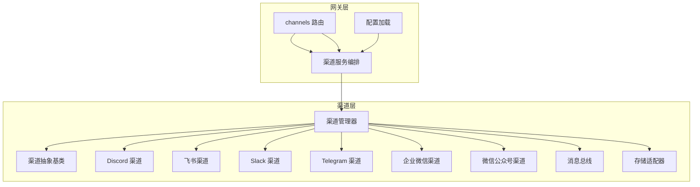
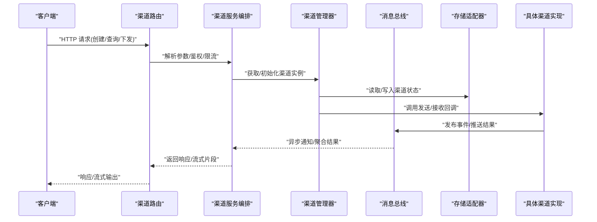
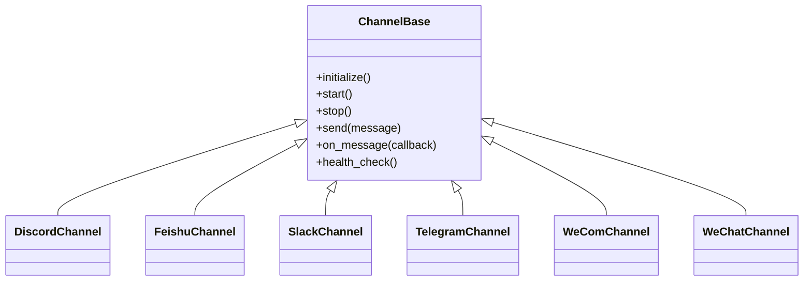
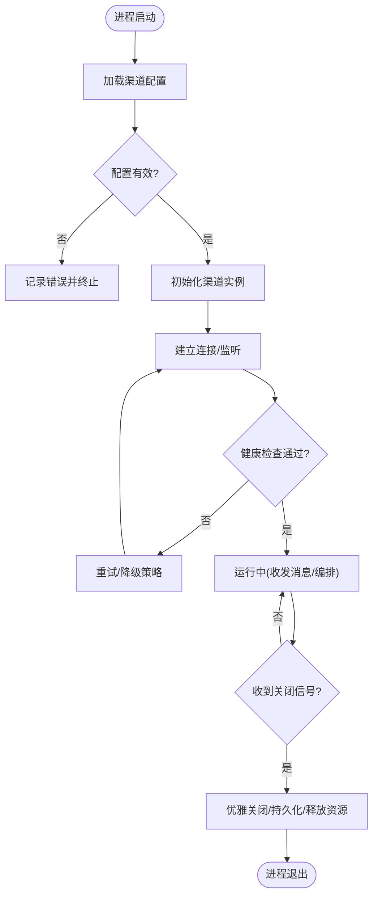
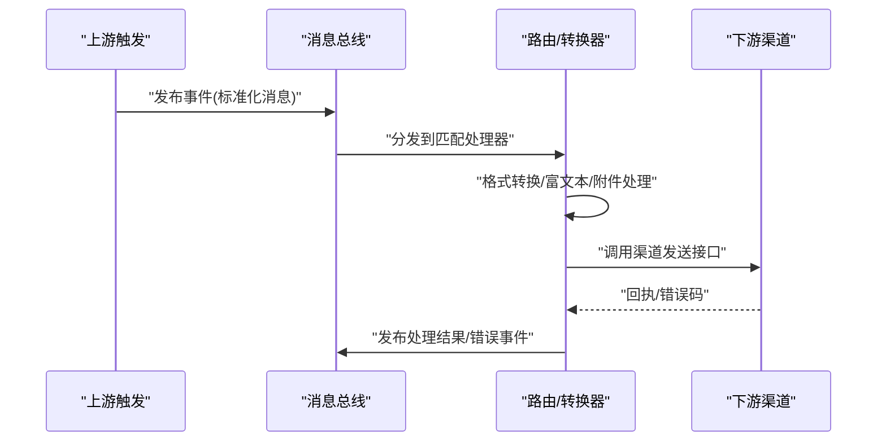
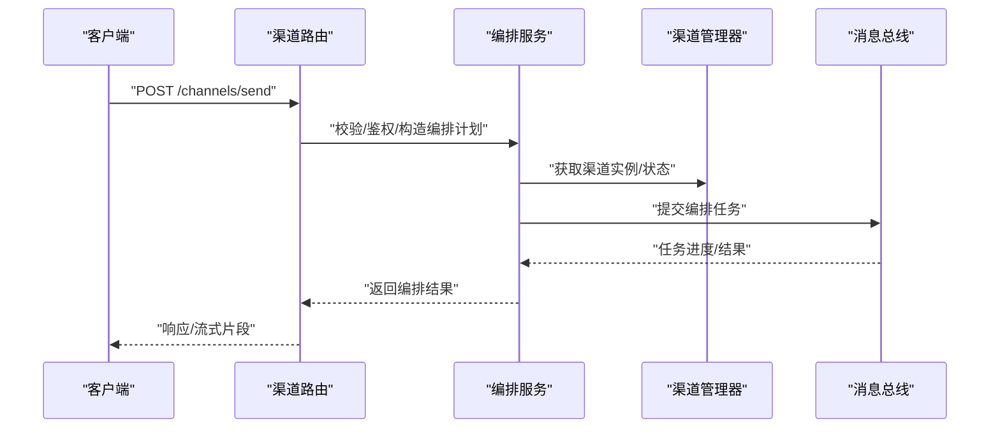
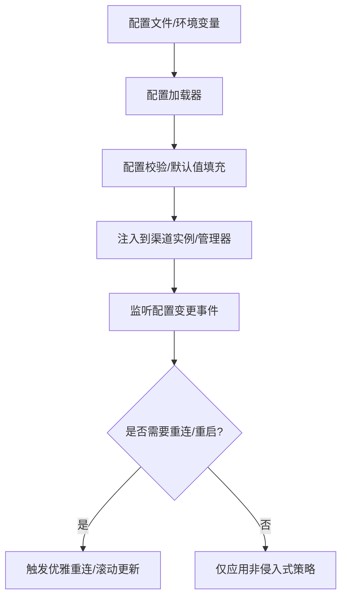
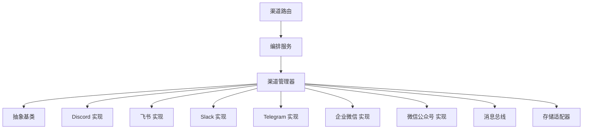

# 渠道架构概览

<cite>
**本文引用的文件**   
- [backend/app/channels/base.py](file://backend/app/channels/base.py)
- [backend/app/channels/manager.py](file://backend/app/channels/manager.py)
- [backend/app/channels/message_bus.py](file://backend/app/channels/message_bus.py)
- [backend/app/channels/service.py](file://backend/app/channels/service.py)
- [backend/app/channels/store.py](file://backend/app/channels/store.py)
- [backend/app/channels/discord.py](file://backend/app/channels/discord.py)
- [backend/app/channels/feishu.py](file://backend/app/channels/feishu.py)
- [backend/app/channels/slack.py](file://backend/app/channels/slack.py)
- [backend/app/channels/telegram.py](file://backend/app/channels/telegram.py)
- [backend/app/channels/wechat.py](file://backend/app/channels/wechat.py)
- [backend/app/channels/wecom.py](file://backend/app/channels/wecom.py)
- [backend/app/gateway/routers/channels.py](file://backend/app/gateway/routers/channels.py)
- [backend/app/gateway/services.py](file://backend/app/gateway/services.py)
- [backend/app/gateway/config.py](file://backend/app/gateway/config.py)
- [backend/tests/test_channels.py](file://backend/tests/test_channels.py)
</cite>

## 目录
1. [简介](#简介)
2. [项目结构](#项目结构)
3. [核心组件](#核心组件)
4. [架构总览](#架构总览)
5. [详细组件分析](#详细组件分析)
6. [依赖关系分析](#依赖关系分析)
7. [性能考虑](#性能考虑)
8. [故障排查指南](#故障排查指南)
9. [结论](#结论)
10. [附录](#附录)

## 简介
本文件面向开发者与集成工程师，系统性梳理 DeerFlow 多渠道接入的“渠道架构”。围绕渠道抽象层、消息总线、连接管理、服务编排、生命周期管理、消息处理（路由、格式转换、错误处理）、配置统一管理与动态更新、以及渠道间通信协议与数据流转进行说明，并配以架构图与组件关系图，帮助快速理解整体设计与扩展方式。

## 项目结构
DeerFlow 的后端将“渠道”能力集中在 backend/app/channels 目录下，采用“抽象基类 + 具体实现 + 管理器 + 消息总线 + 存储服务 + 网关路由与服务”的分层组织：
- 抽象与基础设施：base.py、message_bus.py、store.py、service.py、manager.py
- 具体渠道实现：discord.py、feishu.py、slack.py、telegram.py、wechat.py、wecom.py
- 对外暴露：gateway/routers/channels.py 提供 HTTP API；gateway/services.py 提供业务编排入口；gateway/config.py 提供配置加载与校验

图表来源
- [backend/app/gateway/routers/channels.py](file://backend/app/gateway/routers/channels.py)
- [backend/app/gateway/services.py](file://backend/app/gateway/services.py)
- [backend/app/gateway/config.py](file://backend/app/gateway/config.py)
- [backend/app/channels/manager.py](file://backend/app/channels/manager.py)
- [backend/app/channels/base.py](file://backend/app/channels/base.py)
- [backend/app/channels/message_bus.py](file://backend/app/channels/message_bus.py)
- [backend/app/channels/store.py](file://backend/app/channels/store.py)
- [backend/app/channels/discord.py](file://backend/app/channels/discord.py)
- [backend/app/channels/feishu.py](file://backend/app/channels/feishu.py)
- [backend/app/channels/slack.py](file://backend/app/channels/slack.py)
- [backend/app/channels/telegram.py](file://backend/app/channels/telegram.py)
- [backend/app/channels/wechat.py](file://backend/app/channels/wechat.py)
- [backend/app/channels/wecom.py](file://backend/app/channels/wecom.py)

章节来源
- [backend/app/channels/base.py](file://backend/app/channels/base.py)
- [backend/app/channels/manager.py](file://backend/app/channels/manager.py)
- [backend/app/channels/message_bus.py](file://backend/app/channels/message_bus.py)
- [backend/app/channels/service.py](file://backend/app/channels/service.py)
- [backend/app/channels/store.py](file://backend/app/channels/store.py)
- [backend/app/channels/discord.py](file://backend/app/channels/discord.py)
- [backend/app/channels/feishu.py](file://backend/app/channels/feishu.py)
- [backend/app/channels/slack.py](file://backend/app/channels/slack.py)
- [backend/app/channels/telegram.py](file://backend/app/channels/telegram.py)
- [backend/app/channels/wechat.py](file://backend/app/channels/wechat.py)
- [backend/app/channels/wecom.py](file://backend/app/channels/wecom.py)
- [backend/app/gateway/routers/channels.py](file://backend/app/gateway/routers/channels.py)
- [backend/app/gateway/services.py](file://backend/app/gateway/services.py)
- [backend/app/gateway/config.py](file://backend/app/gateway/config.py)

## 核心组件
- 渠道抽象基类：定义统一的启动、停止、发送、接收回调、健康检查等接口，屏蔽各平台差异。
- 渠道管理器：负责渠道实例的注册、发现、生命周期调度、并发控制与资源清理。
- 消息总线：提供事件发布/订阅或队列式分发，解耦上游触发与下游处理。
- 存储服务：持久化渠道状态、会话上下文、消息索引与元数据。
- 渠道服务编排：在网关侧对渠道能力进行组合编排，协调多通道协作与回退策略。
- 具体渠道实现：针对 Discord、飞书、Slack、Telegram、企业微信、微信公众号等平台的具体适配。

章节来源
- [backend/app/channels/base.py](file://backend/app/channels/base.py)
- [backend/app/channels/manager.py](file://backend/app/channels/manager.py)
- [backend/app/channels/message_bus.py](file://backend/app/channels/message_bus.py)
- [backend/app/channels/store.py](file://backend/app/channels/store.py)
- [backend/app/channels/service.py](file://backend/app/channels/service.py)

## 架构总览
下图展示从网关到渠道层的端到端调用路径与关键交互点。

图表来源
- [backend/app/gateway/routers/channels.py](file://backend/app/gateway/routers/channels.py)
- [backend/app/gateway/services.py](file://backend/app/gateway/services.py)
- [backend/app/channels/manager.py](file://backend/app/channels/manager.py)
- [backend/app/channels/message_bus.py](file://backend/app/channels/message_bus.py)
- [backend/app/channels/store.py](file://backend/app/channels/store.py)
- [backend/app/channels/base.py](file://backend/app/channels/base.py)

## 详细组件分析

### 渠道抽象层与继承体系
- 抽象基类定义统一契约：包括初始化、启动、关闭、发送消息、接收回调、健康检查、重试与超时策略等。
- 具体渠道通过继承基类实现平台特定逻辑：如认证、签名、消息体映射、附件处理、速率限制等。
- 通过工厂或注册表模式，由管理器按配置动态选择并实例化对应渠道。

图表来源
- [backend/app/channels/base.py](file://backend/app/channels/base.py)
- [backend/app/channels/discord.py](file://backend/app/channels/discord.py)
- [backend/app/channels/feishu.py](file://backend/app/channels/feishu.py)
- [backend/app/channels/slack.py](file://backend/app/channels/slack.py)
- [backend/app/channels/telegram.py](file://backend/app/channels/telegram.py)
- [backend/app/channels/wechat.py](file://backend/app/channels/wechat.py)
- [backend/app/channels/wecom.py](file://backend/app/channels/wecom.py)

章节来源
- [backend/app/channels/base.py](file://backend/app/channels/base.py)
- [backend/app/channels/discord.py](file://backend/app/channels/discord.py)
- [backend/app/channels/feishu.py](file://backend/app/channels/feishu.py)
- [backend/app/channels/slack.py](file://backend/app/channels/slack.py)
- [backend/app/channels/telegram.py](file://backend/app/channels/telegram.py)
- [backend/app/channels/wechat.py](file://backend/app/channels/wechat.py)
- [backend/app/channels/wecom.py](file://backend/app/channels/wecom.py)

### 渠道管理器与生命周期管理
- 初始化阶段：加载配置、校验凭据、构建实例、预连接与预热。
- 启动阶段：建立长连接/监听器、注册回调、启动心跳与健康检查。
- 运行阶段：接收消息、转发至消息总线、执行编排逻辑、持久化状态。
- 关闭阶段：优雅退出、断开连接、释放资源、保存最终状态。

图表来源
- [backend/app/channels/manager.py](file://backend/app/channels/manager.py)
- [backend/app/channels/base.py](file://backend/app/channels/base.py)
- [backend/app/channels/store.py](file://backend/app/channels/store.py)

章节来源
- [backend/app/channels/manager.py](file://backend/app/channels/manager.py)
- [backend/app/channels/base.py](file://backend/app/channels/base.py)
- [backend/app/channels/store.py](file://backend/app/channels/store.py)

### 消息总线与消息处理机制
- 路由：基于主题/频道/会话ID进行路由，支持广播与点对点。
- 格式转换：将外部平台消息转换为内部统一模型，再按需转回目标平台格式。
- 错误处理：失败重试、死信队列、告警与可观测性埋点。
- 背压与限流：根据下游处理能力与平台配额进行限速与削峰。

图表来源
- [backend/app/channels/message_bus.py](file://backend/app/channels/message_bus.py)
- [backend/app/channels/base.py](file://backend/app/channels/base.py)

章节来源
- [backend/app/channels/message_bus.py](file://backend/app/channels/message_bus.py)
- [backend/app/channels/base.py](file://backend/app/channels/base.py)

### 服务编排与网关集成
- 路由层：将 HTTP 请求解析为渠道操作指令，进行鉴权、参数校验与限流。
- 编排层：组合多个渠道能力，实现跨渠道转发、任务拆分与合并、回退与补偿。
- 配置层：集中加载渠道配置，支持热更新与版本化。

图表来源
- [backend/app/gateway/routers/channels.py](file://backend/app/gateway/routers/channels.py)
- [backend/app/gateway/services.py](file://backend/app/gateway/services.py)
- [backend/app/channels/manager.py](file://backend/app/channels/manager.py)
- [backend/app/channels/message_bus.py](file://backend/app/channels/message_bus.py)

章节来源
- [backend/app/gateway/routers/channels.py](file://backend/app/gateway/routers/channels.py)
- [backend/app/gateway/services.py](file://backend/app/gateway/services.py)
- [backend/app/channels/manager.py](file://backend/app/channels/manager.py)
- [backend/app/channels/message_bus.py](file://backend/app/channels/message_bus.py)

### 配置管理与动态更新
- 统一配置：集中管理各渠道的连接信息、密钥、开关与策略。
- 动态更新：支持运行时刷新配置，触发重连与热切换。
- 安全与审计：敏感字段加密、变更留痕与回滚。

图表来源
- [backend/app/gateway/config.py](file://backend/app/gateway/config.py)
- [backend/app/channels/manager.py](file://backend/app/channels/manager.py)
- [backend/app/channels/base.py](file://backend/app/channels/base.py)

章节来源
- [backend/app/gateway/config.py](file://backend/app/gateway/config.py)
- [backend/app/channels/manager.py](file://backend/app/channels/manager.py)
- [backend/app/channels/base.py](file://backend/app/channels/base.py)

### 渠道间通信协议与数据流转
- 内部协议：使用统一的消息模型（包含来源、目标、会话、内容、附件、时间戳、追踪ID等）在总线上传播。
- 外部协议：各渠道实现负责与平台 SDK/API 的适配，完成鉴权、签名、编码与分页拉取。
- 数据流转：上游触发 → 标准化 → 路由/转换 → 目标渠道发送 → 回执/错误上报 → 结果聚合。

图表来源
- [backend/app/channels/message_bus.py](file://backend/app/channels/message_bus.py)
- [backend/app/channels/base.py](file://backend/app/channels/base.py)

章节来源
- [backend/app/channels/message_bus.py](file://backend/app/channels/message_bus.py)
- [backend/app/channels/base.py](file://backend/app/channels/base.py)

## 依赖关系分析
- 低耦合：网关与渠道层通过服务编排与消息总线解耦，新增渠道无需改动网关路由。
- 高内聚：每个渠道实现封装自身协议细节，遵循统一抽象。
- 外部依赖：各渠道依赖各自平台 SDK/API；总线与存储可能依赖中间件（内存/Redis/数据库）。

图表来源
- [backend/app/gateway/routers/channels.py](file://backend/app/gateway/routers/channels.py)
- [backend/app/gateway/services.py](file://backend/app/gateway/services.py)
- [backend/app/channels/manager.py](file://backend/app/channels/manager.py)
- [backend/app/channels/base.py](file://backend/app/channels/base.py)
- [backend/app/channels/message_bus.py](file://backend/app/channels/message_bus.py)
- [backend/app/channels/store.py](file://backend/app/channels/store.py)
- [backend/app/channels/discord.py](file://backend/app/channels/discord.py)
- [backend/app/channels/feishu.py](file://backend/app/channels/feishu.py)
- [backend/app/channels/slack.py](file://backend/app/channels/slack.py)
- [backend/app/channels/telegram.py](file://backend/app/channels/telegram.py)
- [backend/app/channels/wechat.py](file://backend/app/channels/wechat.py)
- [backend/app/channels/wecom.py](file://backend/app/channels/wecom.py)

章节来源
- [backend/app/gateway/routers/channels.py](file://backend/app/gateway/routers/channels.py)
- [backend/app/gateway/services.py](file://backend/app/gateway/services.py)
- [backend/app/channels/manager.py](file://backend/app/channels/manager.py)
- [backend/app/channels/base.py](file://backend/app/channels/base.py)
- [backend/app/channels/message_bus.py](file://backend/app/channels/message_bus.py)
- [backend/app/channels/store.py](file://backend/app/channels/store.py)
- [backend/app/channels/discord.py](file://backend/app/channels/discord.py)
- [backend/app/channels/feishu.py](file://backend/app/channels/feishu.py)
- [backend/app/channels/slack.py](file://backend/app/channels/slack.py)
- [backend/app/channels/telegram.py](file://backend/app/channels/telegram.py)
- [backend/app/channels/wechat.py](file://backend/app/channels/wechat.py)
- [backend/app/channels/wecom.py](file://backend/app/channels/wecom.py)

## 性能考虑
- 连接复用与池化：减少频繁握手开销，提升吞吐。
- 异步与批处理：批量发送、异步回调与背压控制，避免阻塞主流程。
- 缓存与索引：热点会话与元数据缓存，降低存储压力。
- 限流与熔断：遵循平台配额，失败快速失败与回退。
- 可观测性：指标、日志与链路追踪贯穿全链路，便于定位瓶颈。

## 故障排查指南
- 常见问题
  - 连接失败：检查凭据、网络连通性与证书；查看健康检查与重试日志。
  - 消息丢失：核对总线分区与消费者消费位点；检查死信队列与重试次数。
  - 格式异常：对比内部消息模型与平台字段映射；关注富媒体与附件大小限制。
  - 配置错误：校验必填项、类型与范围；启用配置变更审计与回滚。
- 诊断步骤
  - 定位入口：从网关路由日志开始，跟踪到编排服务与渠道管理器。
  - 观察状态：查看渠道实例状态机与最近一次健康检查结果。
  - 验证数据：抽取一条典型消息，逐步比对标准化前后结构与附件。
  - 复现与隔离：最小化用例复现，必要时切换到只读模式或沙箱环境。

章节来源
- [backend/tests/test_channels.py](file://backend/tests/test_channels.py)

## 结论
DeerFlow 的渠道架构以“抽象基类 + 管理器 + 消息总线 + 存储服务 + 网关编排”为核心，实现了多渠道的统一接入、稳定运行与灵活扩展。通过标准化的消息模型与清晰的职责边界，系统具备良好的可维护性与可扩展性，同时兼顾了性能与可观测性。建议在新渠道接入时严格遵循抽象契约，完善健康检查与错误处理，并在配置管理中落实安全与审计要求。

## 附录
- 术语
  - 渠道：对接第三方平台的接入模块。
  - 消息总线：用于事件分发与解耦的内部通信设施。
  - 编排：对多个渠道能力的组合与调度。
- 参考
  - 单元测试覆盖渠道基础能力与边界场景，可作为扩展时的参考实现。

章节来源
- [backend/tests/test_channels.py](file://backend/tests/test_channels.py)