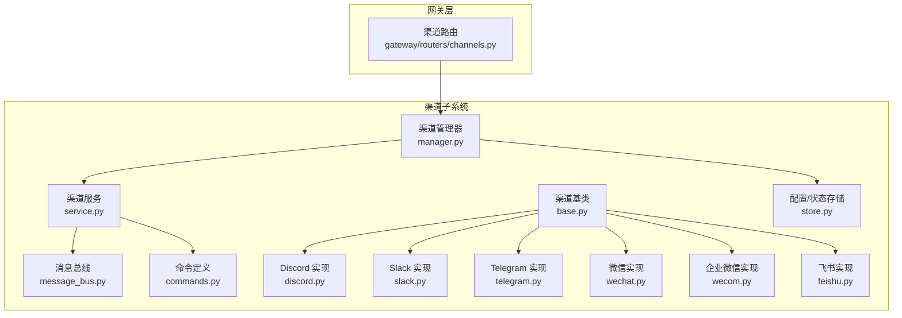
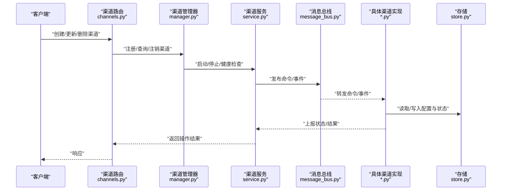
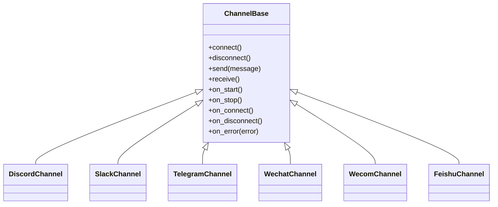
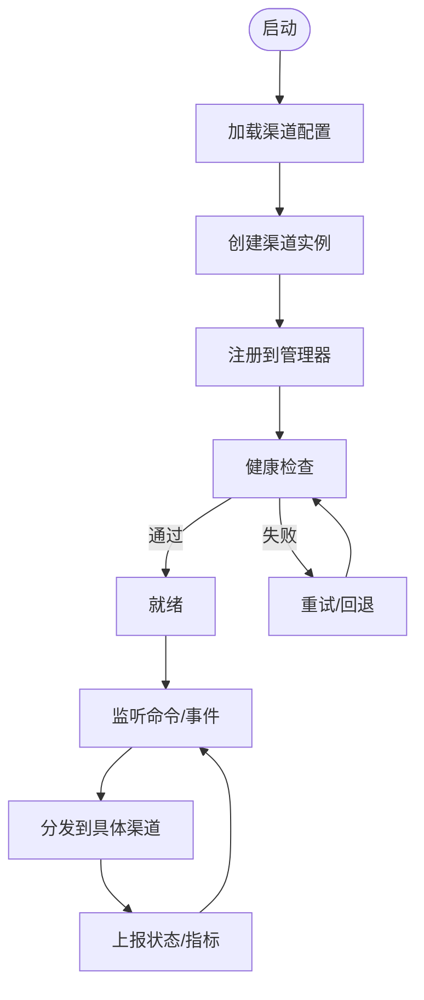
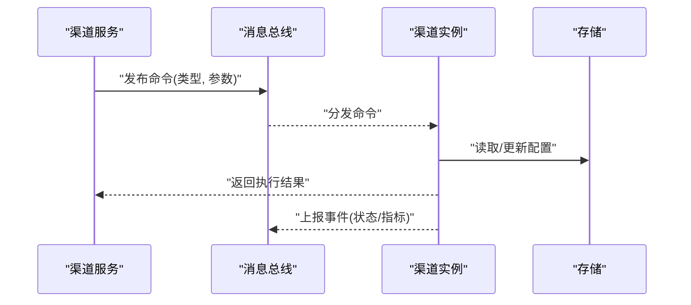
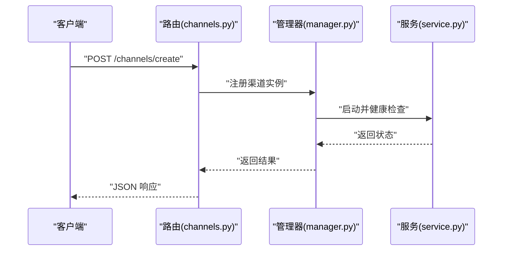
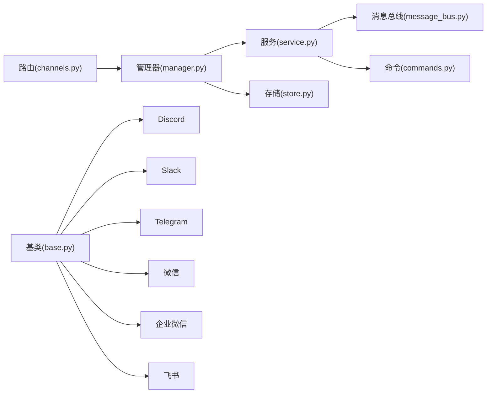

# 自定义渠道开发

<cite>
**本文引用的文件**   
- [backend/app/channels/base.py](file://backend/app/channels/base.py)
- [backend/app/channels/manager.py](file://backend/app/channels/manager.py)
- [backend/app/channels/service.py](file://backend/app/channels/service.py)
- [backend/app/channels/message_bus.py](file://backend/app/channels/message_bus.py)
- [backend/app/channels/store.py](file://backend/app/channels/store.py)
- [backend/app/channels/commands.py](file://backend/app/channels/commands.py)
- [backend/app/channels/discord.py](file://backend/app/channels/discord.py)
- [backend/app/channels/slack.py](file://backend/app/channels/slack.py)
- [backend/app/channels/telegram.py](file://backend/app/channels/telegram.py)
- [backend/app/channels/wechat.py](file://backend/app/channels/wechat.py)
- [backend/app/channels/wecom.py](file://backend/app/channels/wecom.py)
- [backend/app/channels/feishu.py](file://backend/app/channels/feishu.py)
- [backend/app/gateway/routers/channels.py](file://backend/app/gateway/routers/channels.py)
- [backend/tests/test_channels.py](file://backend/tests/test_channels.py)
- [backend/tests/test_discord_channel.py](file://backend/tests/test_discord_channel.py)
- [backend/tests/test_wechat_channel.py](file://backend/tests/test_wechat_channel.py)
</cite>

## 目录
1. [简介](#简介)
2. [项目结构](#项目结构)
3. [核心组件](#核心组件)
4. [架构总览](#架构总览)
5. [详细组件分析](#详细组件分析)
6. [依赖关系分析](#依赖关系分析)
7. [性能考虑](#性能考虑)
8. [故障排查指南](#故障排查指南)
9. [结论](#结论)
10. [附录](#附录)

## 简介
本指南面向需要在 Deer-Flow 中实现“自定义渠道”的开发者，围绕以下目标展开：
- 基于统一的渠道基类与注册机制，快速扩展新的消息渠道（如 IM、邮件、Webhook 等）。
- 明确消息接口定义、连接管理策略与生命周期钩子。
- 规范消息格式、错误处理与日志记录要求。
- 说明渠道配置的管理方式（运行时、持久化、热重载）。
- 提供测试方法与工具建议（单元、集成、模拟环境）。
- 给出从基础收发到复杂交互的完整示例路径与最佳实践（发布与分发）。

## 项目结构
与渠道相关的代码集中在 backend/app/channels 目录下，并通过网关路由对外暴露管理能力。关键目录与职责如下：
- channels/base.py：渠道抽象基类与通用能力（连接、生命周期、消息收发、事件总线集成）。
- channels/manager.py：渠道实例管理与注册中心。
- channels/service.py：渠道服务编排（启动、停止、健康检查、命令下发）。
- channels/message_bus.py：内部消息总线，用于跨模块解耦的事件/命令传递。
- channels/store.py：渠道配置与状态存储抽象。
- channels/commands.py：渠道相关命令定义与解析。
- channels/*.py：各具体渠道实现（Discord、Slack、Telegram、微信、企业微信、飞书等）。
- gateway/routers/channels.py：HTTP 网关路由，提供渠道管理的 REST API。
- tests/*：渠道相关单元测试与集成测试。

图表来源
- [backend/app/channels/base.py](file://backend/app/channels/base.py)
- [backend/app/channels/manager.py](file://backend/app/channels/manager.py)
- [backend/app/channels/service.py](file://backend/app/channels/service.py)
- [backend/app/channels/message_bus.py](file://backend/app/channels/message_bus.py)
- [backend/app/channels/store.py](file://backend/app/channels/store.py)
- [backend/app/channels/commands.py](file://backend/app/channels/commands.py)
- [backend/app/channels/discord.py](file://backend/app/channels/discord.py)
- [backend/app/channels/slack.py](file://backend/app/channels/slack.py)
- [backend/app/channels/telegram.py](file://backend/app/channels/telegram.py)
- [backend/app/channels/wechat.py](file://backend/app/channels/wechat.py)
- [backend/app/channels/wecom.py](file://backend/app/channels/wecom.py)
- [backend/app/channels/feishu.py](file://backend/app/channels/feishu.py)
- [backend/app/gateway/routers/channels.py](file://backend/app/gateway/routers/channels.py)

章节来源
- [backend/app/channels/base.py](file://backend/app/channels/base.py)
- [backend/app/channels/manager.py](file://backend/app/channels/manager.py)
- [backend/app/channels/service.py](file://backend/app/channels/service.py)
- [backend/app/channels/message_bus.py](file://backend/app/channels/message_bus.py)
- [backend/app/channels/store.py](file://backend/app/channels/store.py)
- [backend/app/channels/commands.py](file://backend/app/channels/commands.py)
- [backend/app/gateway/routers/channels.py](file://backend/app/gateway/routers/channels.py)

## 核心组件
- 渠道基类（Base Channel）
  - 职责：统一连接管理、生命周期钩子、消息发送/接收抽象、重试与退避、事件上报。
  - 扩展点：子类需实现平台特定的连接建立、鉴权、消息编解码、回调处理。
- 渠道管理器（Channel Manager）
  - 职责：发现并注册渠道实例、按名称/类型获取、维护运行期状态。
  - 扩展点：支持动态加载新渠道实现、按需启停。
- 渠道服务（Channel Service）
  - 职责：协调多个渠道的生命周期、健康检查、命令分发、错误聚合。
  - 扩展点：可注入中间件或监听器以增强行为。
- 消息总线（Message Bus）
  - 职责：在渠道子系统内解耦事件与命令，避免紧耦合调用。
  - 扩展点：可扩展事件类型与订阅者。
- 存储（Store）
  - 职责：持久化渠道配置与运行态信息（如连接令牌、会话映射）。
  - 扩展点：支持不同后端（内存、文件、数据库）。
- 命令（Commands）
  - 职责：定义渠道控制面操作（如重连、刷新令牌、拉取历史）。
  - 扩展点：新增命令类型与处理器。

章节来源
- [backend/app/channels/base.py](file://backend/app/channels/base.py)
- [backend/app/channels/manager.py](file://backend/app/channels/manager.py)
- [backend/app/channels/service.py](file://backend/app/channels/service.py)
- [backend/app/channels/message_bus.py](file://backend/app/channels/message_bus.py)
- [backend/app/channels/store.py](file://backend/app/channels/store.py)
- [backend/app/channels/commands.py](file://backend/app/channels/commands.py)

## 架构总览
下图展示了从外部请求到渠道实现的端到端流程，以及内部组件间的协作关系。

图表来源
- [backend/app/gateway/routers/channels.py](file://backend/app/gateway/routers/channels.py)
- [backend/app/channels/manager.py](file://backend/app/channels/manager.py)
- [backend/app/channels/service.py](file://backend/app/channels/service.py)
- [backend/app/channels/message_bus.py](file://backend/app/channels/message_bus.py)
- [backend/app/channels/store.py](file://backend/app/channels/store.py)

## 详细组件分析

### 渠道基类与扩展点
- 设计要点
  - 连接管理：封装连接建立、鉴权、心跳、断线重连与指数退避。
  - 生命周期钩子：on_start、on_stop、on_connect、on_disconnect、on_error 等钩子，便于扩展监控与清理逻辑。
  - 消息接口：统一入站/出站消息模型，屏蔽平台差异；提供 send/receive 抽象方法供子类实现。
  - 事件上报：通过消息总线将平台事件标准化后广播。
- 扩展步骤
  - 继承基类，实现平台特定连接与消息编解码。
  - 在 on_connect/on_disconnect 中完成资源初始化与释放。
  - 使用 store 读写渠道配置与敏感信息。
  - 通过 bus 发布/订阅事件，与其他组件解耦。

图表来源
- [backend/app/channels/base.py](file://backend/app/channels/base.py)
- [backend/app/channels/discord.py](file://backend/app/channels/discord.py)
- [backend/app/channels/slack.py](file://backend/app/channels/slack.py)
- [backend/app/channels/telegram.py](file://backend/app/channels/telegram.py)
- [backend/app/channels/wechat.py](file://backend/app/channels/wechat.py)
- [backend/app/channels/wecom.py](file://backend/app/channels/wecom.py)
- [backend/app/channels/feishu.py](file://backend/app/channels/feishu.py)

章节来源
- [backend/app/channels/base.py](file://backend/app/channels/base.py)
- [backend/app/channels/discord.py](file://backend/app/channels/discord.py)
- [backend/app/channels/slack.py](file://backend/app/channels/slack.py)
- [backend/app/channels/telegram.py](file://backend/app/channels/telegram.py)
- [backend/app/channels/wechat.py](file://backend/app/channels/wechat.py)
- [backend/app/channels/wecom.py](file://backend/app/channels/wecom.py)
- [backend/app/channels/feishu.py](file://backend/app/channels/feishu.py)

### 渠道管理器与服务编排
- 管理器职责
  - 注册与发现：根据渠道类型/名称创建并缓存实例。
  - 生命周期：批量启动/停止、健康检查、异常恢复。
  - 配置注入：从 store 读取配置并注入到渠道实例。
- 服务编排
  - 命令分发：将命令经消息总线派发到对应渠道。
  - 事件聚合：汇总渠道上报的状态与指标。
  - 错误处理：统一捕获并上报，支持降级与告警。

图表来源
- [backend/app/channels/manager.py](file://backend/app/channels/manager.py)
- [backend/app/channels/service.py](file://backend/app/channels/service.py)
- [backend/app/channels/message_bus.py](file://backend/app/channels/message_bus.py)
- [backend/app/channels/store.py](file://backend/app/channels/store.py)

章节来源
- [backend/app/channels/manager.py](file://backend/app/channels/manager.py)
- [backend/app/channels/service.py](file://backend/app/channels/service.py)
- [backend/app/channels/message_bus.py](file://backend/app/channels/message_bus.py)
- [backend/app/channels/store.py](file://backend/app/channels/store.py)

### 消息总线与命令体系
- 消息总线
  - 作用：解耦渠道与上层服务，支持多订阅者与异步处理。
  - 事件类型：连接状态变更、消息到达、错误事件、健康检查事件等。
- 命令体系
  - 命令类型：重连、刷新令牌、拉取历史、关闭连接等。
  - 处理流程：路由到目标渠道实例，执行并返回结果。

图表来源
- [backend/app/channels/service.py](file://backend/app/channels/service.py)
- [backend/app/channels/message_bus.py](file://backend/app/channels/message_bus.py)
- [backend/app/channels/commands.py](file://backend/app/channels/commands.py)
- [backend/app/channels/store.py](file://backend/app/channels/store.py)

章节来源
- [backend/app/channels/message_bus.py](file://backend/app/channels/message_bus.py)
- [backend/app/channels/commands.py](file://backend/app/channels/commands.py)
- [backend/app/channels/service.py](file://backend/app/channels/service.py)
- [backend/app/channels/store.py](file://backend/app/channels/store.py)

### 网关路由与管理 API
- 功能范围
  - 渠道的创建、更新、删除、查询。
  - 触发重连、刷新令牌、拉取历史等命令。
  - 查看渠道健康状态与运行指标。
- 典型流程
  - 客户端发起 HTTP 请求 -> 路由校验与参数绑定 -> 调用管理器/服务 -> 返回 JSON 响应。

图表来源
- [backend/app/gateway/routers/channels.py](file://backend/app/gateway/routers/channels.py)
- [backend/app/channels/manager.py](file://backend/app/channels/manager.py)
- [backend/app/channels/service.py](file://backend/app/channels/service.py)

章节来源
- [backend/app/gateway/routers/channels.py](file://backend/app/gateway/routers/channels.py)

### 具体渠道实现参考
- Discord/Slack/Telegram/微信/企业微信/飞书
  - 共同点：均继承渠道基类，实现平台特定的连接与消息编解码。
  - 差异点：鉴权方式、消息格式、回调 URL、速率限制与错误码。
  - 建议：在 on_connect 中完成鉴权与会话初始化；在 on_disconnect 中释放资源；对平台限流进行退避与重试。

章节来源
- [backend/app/channels/discord.py](file://backend/app/channels/discord.py)
- [backend/app/channels/slack.py](file://backend/app/channels/slack.py)
- [backend/app/channels/telegram.py](file://backend/app/channels/telegram.py)
- [backend/app/channels/wechat.py](file://backend/app/channels/wechat.py)
- [backend/app/channels/wecom.py](file://backend/app/channels/wecom.py)
- [backend/app/channels/feishu.py](file://backend/app/channels/feishu.py)

## 依赖关系分析
- 组件耦合
  - 路由器仅依赖管理器与服务，不直接访问具体渠道实现，保持松耦合。
  - 服务通过消息总线与渠道实例通信，降低同步调用耦合。
  - 存储抽象使配置与状态可替换，便于切换后端。
- 外部依赖
  - 各渠道实现依赖各自平台的 SDK 或 HTTP 客户端。
  - 网关路由依赖 Web 框架的路由与中间件。

图表来源
- [backend/app/gateway/routers/channels.py](file://backend/app/gateway/routers/channels.py)
- [backend/app/channels/manager.py](file://backend/app/channels/manager.py)
- [backend/app/channels/service.py](file://backend/app/channels/service.py)
- [backend/app/channels/message_bus.py](file://backend/app/channels/message_bus.py)
- [backend/app/channels/commands.py](file://backend/app/channels/commands.py)
- [backend/app/channels/store.py](file://backend/app/channels/store.py)
- [backend/app/channels/base.py](file://backend/app/channels/base.py)
- [backend/app/channels/discord.py](file://backend/app/channels/discord.py)
- [backend/app/channels/slack.py](file://backend/app/channels/slack.py)
- [backend/app/channels/telegram.py](file://backend/app/channels/telegram.py)
- [backend/app/channels/wechat.py](file://backend/app/channels/wechat.py)
- [backend/app/channels/wecom.py](file://backend/app/channels/wecom.py)
- [backend/app/channels/feishu.py](file://backend/app/channels/feishu.py)

章节来源
- [backend/app/gateway/routers/channels.py](file://backend/app/gateway/routers/channels.py)
- [backend/app/channels/manager.py](file://backend/app/channels/manager.py)
- [backend/app/channels/service.py](file://backend/app/channels/service.py)
- [backend/app/channels/message_bus.py](file://backend/app/channels/message_bus.py)
- [backend/app/channels/commands.py](file://backend/app/channels/commands.py)
- [backend/app/channels/store.py](file://backend/app/channels/store.py)
- [backend/app/channels/base.py](file://backend/app/channels/base.py)

## 性能考虑
- 连接复用与池化：为高频平台（如 Slack、Telegram）启用连接池，减少握手开销。
- 异步 I/O：优先使用异步客户端与事件循环，提升吞吐。
- 限流与退避：遵循平台速率限制，采用指数退避与令牌桶算法。
- 批处理与合并：对批量消息进行合并发送，降低网络往返。
- 背压与队列：在高负载场景下引入消息队列，削峰填谷。
- 指标与追踪：采集延迟、错误率、吞吐等指标，结合分布式追踪定位瓶颈。

[本节为通用指导，无需源码引用]

## 故障排查指南
- 常见问题
  - 连接失败：检查鉴权配置、网络连通性、证书与代理设置。
  - 消息丢失：确认消息总线是否丢消息、消费者是否消费成功、幂等性是否保证。
  - 频繁重连：关注平台限流与错误码，调整退避策略。
  - 配置不一致：对比运行时配置与持久化存储，确保热重载生效。
- 诊断手段
  - 启用详细日志与结构化输出，包含渠道名、消息 ID、时间戳与错误堆栈。
  - 使用健康检查接口与指标面板观察渠道状态。
  - 通过命令接口触发重连/刷新令牌等操作验证修复效果。

章节来源
- [backend/app/channels/service.py](file://backend/app/channels/service.py)
- [backend/app/channels/message_bus.py](file://backend/app/channels/message_bus.py)
- [backend/app/channels/store.py](file://backend/app/channels/store.py)

## 结论
通过统一的渠道基类、管理器与服务编排，Deer-Flow 提供了可扩展、可观测、易测试的渠道体系。开发者只需聚焦平台差异的实现细节，即可快速接入新的消息渠道，并在统一的配置、错误处理与日志规范下获得一致体验。

[本节为总结，无需源码引用]

## 附录

### 开发规范
- 消息格式标准
  - 统一字段：消息 ID、来源渠道、目标标识、内容体、附件列表、时间戳、优先级。
  - 编码规范：文本 UTF-8，二进制附件使用安全编码与大小限制。
- 错误处理约定
  - 分类：认证错误、网络错误、业务错误、系统错误。
  - 策略：可重试错误采用指数退避；不可重试错误立即上报并终止重试。
- 日志记录要求
  - 结构化日志：包含上下文键值（渠道名、会话 ID、用户 ID）。
  - 级别划分：DEBUG 仅开发环境；INFO 记录关键流程；WARN/ERROR 记录异常与降级。

[本节为通用规范，无需源码引用]

### 配置管理
- 运行时配置
  - 通过管理器或服务注入配置对象，支持覆盖默认值。
- 持久化存储
  - 使用 store 抽象保存渠道密钥、会话映射与元数据。
- 热重载机制
  - 监听配置变更事件，动态更新渠道实例配置并平滑重启必要组件。

章节来源
- [backend/app/channels/store.py](file://backend/app/channels/store.py)
- [backend/app/channels/manager.py](file://backend/app/channels/manager.py)
- [backend/app/channels/service.py](file://backend/app/channels/service.py)

### 测试方法与工具
- 单元测试
  - 针对基类钩子与命令处理器编写用例，验证边界条件与异常分支。
- 集成测试
  - 使用 mock 平台客户端，端到端验证消息收发与状态流转。
- 模拟环境搭建
  - 构造本地模拟服务器或容器化第三方服务，复现限流与错误场景。
- 参考测试文件
  - 渠道通用测试、Discord 渠道测试、微信渠道测试。

章节来源
- [backend/tests/test_channels.py](file://backend/tests/test_channels.py)
- [backend/tests/test_discord_channel.py](file://backend/tests/test_discord_channel.py)
- [backend/tests/test_wechat_channel.py](file://backend/tests/test_wechat_channel.py)

### 完整示例路径（从基础到复杂）
- 基础消息收发
  - 继承基类，实现 connect/send/receive，注册到管理器，通过路由触发。
- 复杂交互功能
  - 在 on_connect 中完成鉴权与会话初始化；在 on_disconnect 中释放资源；通过命令接口实现重连与刷新令牌；使用消息总线订阅平台事件并上报指标。
- 发布与分发最佳实践
  - 将渠道实现打包为独立包，提供安装脚本与配置模板；在网关路由中暴露管理 API；通过 CI/CD 自动化测试与部署。

[本节为示例指引，无需源码引用]