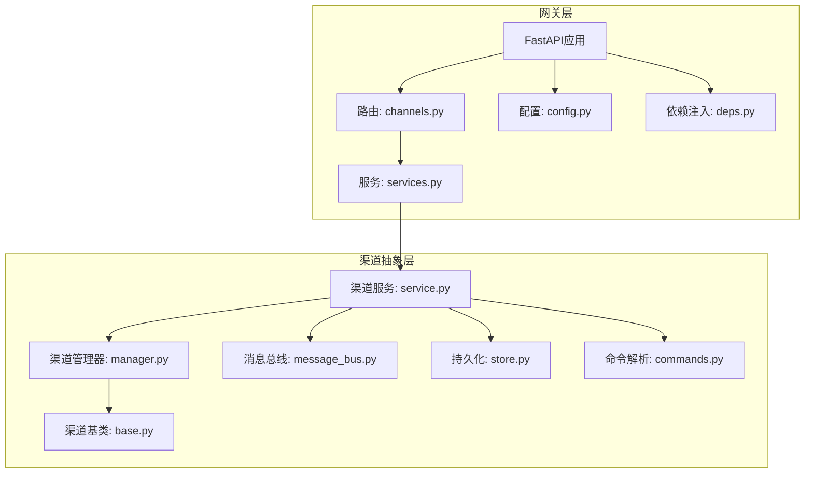
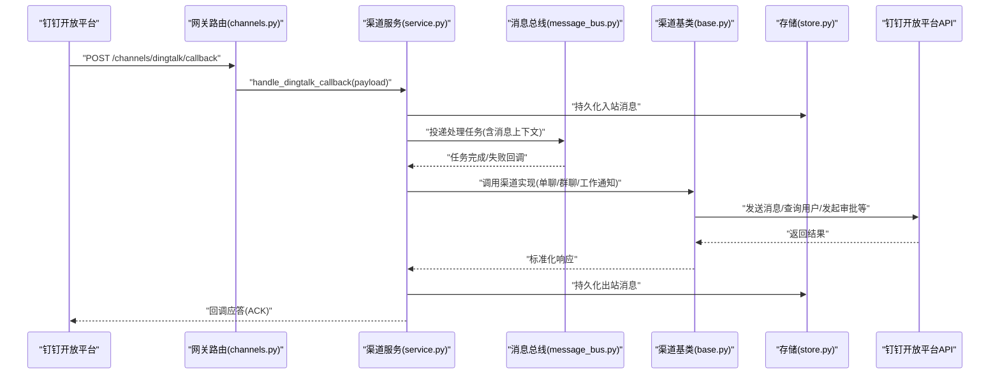
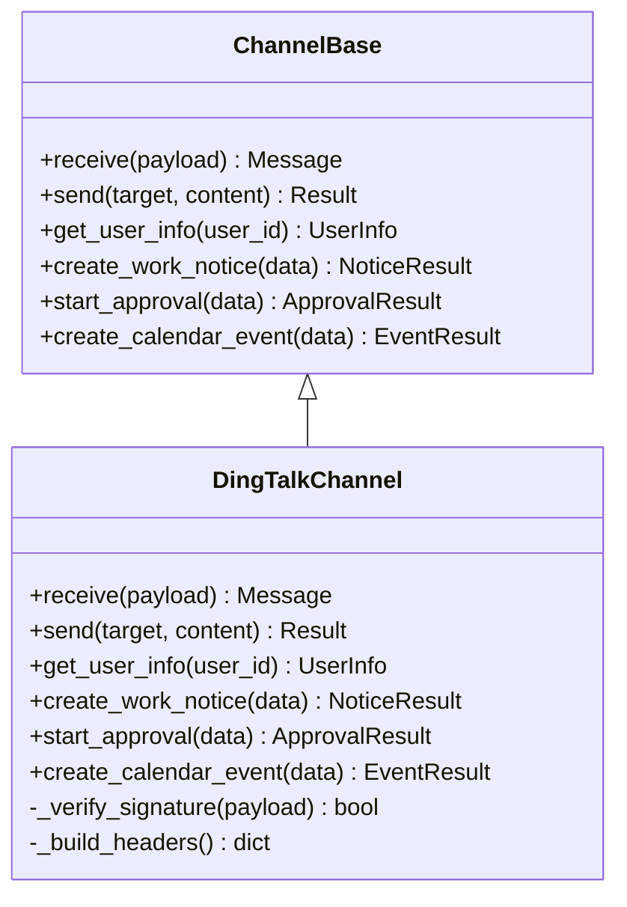
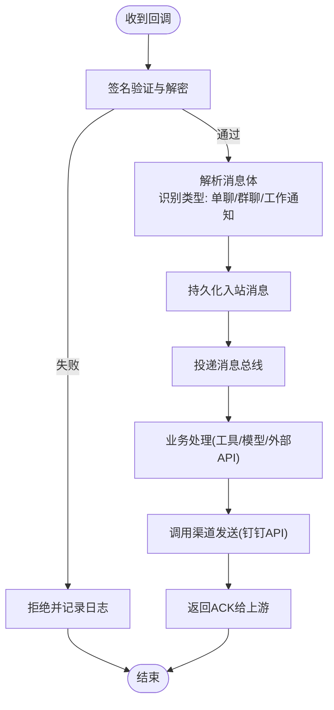
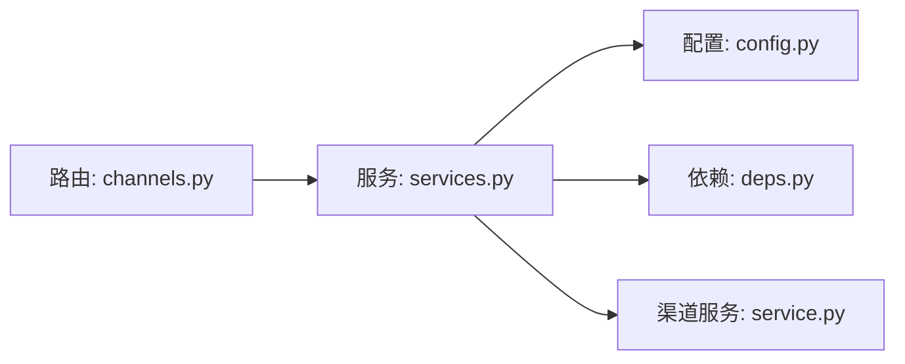
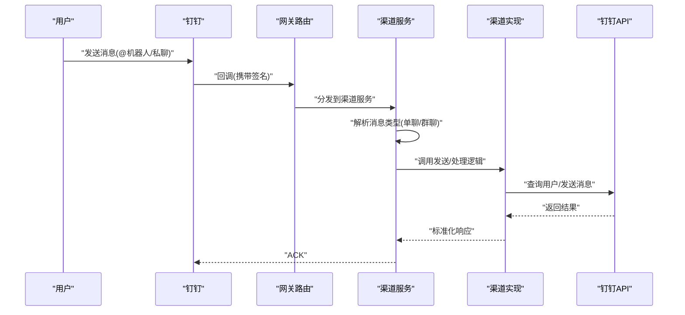
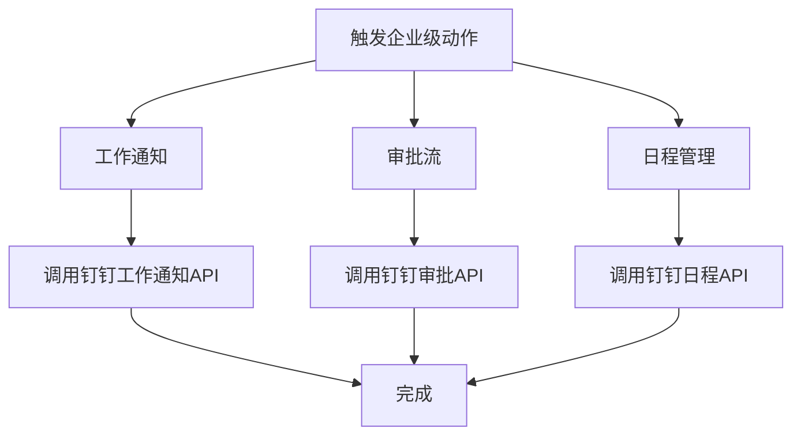
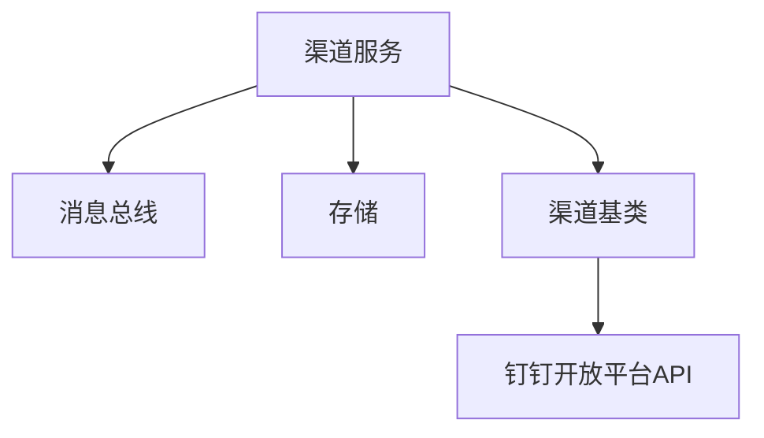

# 钉钉渠道集成

<cite>
**本文引用的文件**   
- [backend/app/channels/base.py](file://backend/app/channels/base.py)
- [backend/app/channels/manager.py](file://backend/app/channels/manager.py)
- [backend/app/channels/service.py](file://backend/app/channels/service.py)
- [backend/app/channels/message_bus.py](file://backend/app/channels/message_bus.py)
- [backend/app/channels/store.py](file://backend/app/channels/store.py)
- [backend/app/channels/commands.py](file://backend/app/channels/commands.py)
- [backend/app/gateway/routers/channels.py](file://backend/app/gateway/routers/channels.py)
- [backend/app/gateway/config.py](file://backend/app/gateway/config.py)
- [backend/app/gateway/deps.py](file://backend/app/gateway/deps.py)
- [backend/app/gateway/services.py](file://backend/app/gateway/services.py)
- [backend/app/gateway/app.py](file://backend/app/gateway/app.py)
</cite>

## 目录
1. [简介](#简介)
2. [项目结构](#项目结构)
3. [核心组件](#核心组件)
4. [架构总览](#架构总览)
5. [详细组件分析](#详细组件分析)
6. [依赖关系分析](#依赖关系分析)
7. [性能与限流](#性能与限流)
8. [故障排查指南](#故障排查指南)
9. [结论](#结论)
10. [附录](#附录)

## 简介
本文件面向需要在系统中接入“钉钉”作为消息渠道的开发者与运维人员，提供从机器人创建、安全配置到消息处理、企业级能力扩展以及安全与限流的最佳实践。当前仓库已实现通用渠道抽象与网关路由层，钉钉渠道可按相同模式进行扩展与集成。

## 项目结构
系统采用“网关 + 渠道抽象 + 服务编排”的分层设计：
- 网关层负责HTTP入口、鉴权、路由与请求分发
- 渠道抽象层定义统一的通道接口（接收消息、发送消息、回调处理等）
- 服务编排层协调消息总线、存储与外部API调用
- 命令与配置层提供可插拔的命令解析与环境配置

图示来源
- [backend/app/gateway/app.py](file://backend/app/gateway/app.py)
- [backend/app/gateway/routers/channels.py](file://backend/app/gateway/routers/channels.py)
- [backend/app/gateway/config.py](file://backend/app/gateway/config.py)
- [backend/app/gateway/deps.py](file://backend/app/gateway/deps.py)
- [backend/app/gateway/services.py](file://backend/app/gateway/services.py)
- [backend/app/channels/base.py](file://backend/app/channels/base.py)
- [backend/app/channels/manager.py](file://backend/app/channels/manager.py)
- [backend/app/channels/service.py](file://backend/app/channels/service.py)
- [backend/app/channels/message_bus.py](file://backend/app/channels/message_bus.py)
- [backend/app/channels/store.py](file://backend/app/channels/store.py)
- [backend/app/channels/commands.py](file://backend/app/channels/commands.py)

章节来源
- [backend/app/gateway/app.py](file://backend/app/gateway/app.py)
- [backend/app/gateway/routers/channels.py](file://backend/app/gateway/routers/channels.py)
- [backend/app/gateway/config.py](file://backend/app/gateway/config.py)
- [backend/app/gateway/deps.py](file://backend/app/gateway/deps.py)
- [backend/app/gateway/services.py](file://backend/app/gateway/services.py)
- [backend/app/channels/base.py](file://backend/app/channels/base.py)
- [backend/app/channels/manager.py](file://backend/app/channels/manager.py)
- [backend/app/channels/service.py](file://backend/app/channels/service.py)
- [backend/app/channels/message_bus.py](file://backend/app/channels/message_bus.py)
- [backend/app/channels/store.py](file://backend/app/channels/store.py)
- [backend/app/channels/commands.py](file://backend/app/channels/commands.py)

## 核心组件
- 渠道基类：定义统一的消息收发、回调、健康检查等接口契约，便于新增渠道时复用通用逻辑
- 渠道管理器：按名称注册与获取具体渠道实例，支持多实例与生命周期管理
- 渠道服务：编排消息入站、出站、持久化、命令解析与外部API调用
- 消息总线：解耦消息生产与消费，支持异步处理与重试
- 存储：消息、会话与上下文持久化
- 命令解析：将自然语言或结构化指令转换为内部命令对象
- 网关路由与服务：暴露HTTP端点，完成鉴权、参数校验、路由到渠道服务

章节来源
- [backend/app/channels/base.py](file://backend/app/channels/base.py)
- [backend/app/channels/manager.py](file://backend/app/channels/manager.py)
- [backend/app/channels/service.py](file://backend/app/channels/service.py)
- [backend/app/channels/message_bus.py](file://backend/app/channels/message_bus.py)
- [backend/app/channels/store.py](file://backend/app/channels/store.py)
- [backend/app/channels/commands.py](file://backend/app/channels/commands.py)
- [backend/app/gateway/routers/channels.py](file://backend/app/gateway/routers/channels.py)
- [backend/app/gateway/services.py](file://backend/app/gateway/services.py)

## 架构总览
下图展示从钉钉回调进入，到内部处理与回复的整体流程。钉钉回调由网关路由接收，交由渠道服务编排，通过消息总线异步执行，最终通过钉钉开放平台API回发消息。

图示来源
- [backend/app/gateway/routers/channels.py](file://backend/app/gateway/routers/channels.py)
- [backend/app/channels/service.py](file://backend/app/channels/service.py)
- [backend/app/channels/message_bus.py](file://backend/app/channels/message_bus.py)
- [backend/app/channels/base.py](file://backend/app/channels/base.py)
- [backend/app/channels/store.py](file://backend/app/channels/store.py)

## 详细组件分析

### 渠道抽象与实现
- 渠道基类定义了统一的接口，包括：
  - 接收并解析回调载荷
  - 发送消息（文本、富文本、卡片等）
  - 查询用户与组织信息
  - 触发企业级动作（如工作通知、审批、日程）
- 新增钉钉渠道时，继承基类并实现上述方法；在管理器中注册后，即可被服务层使用

图示来源
- [backend/app/channels/base.py](file://backend/app/channels/base.py)

章节来源
- [backend/app/channels/base.py](file://backend/app/channels/base.py)

### 渠道管理与服务编排
- 渠道管理器负责按名称加载与缓存渠道实例，支持热更新与多实例
- 渠道服务负责：
  - 校验与解析回调
  - 写入存储
  - 投递消息总线
  - 根据消息类型路由到不同处理逻辑（单聊、群聊、工作通知）
  - 调用钉钉API并处理错误与重试

图示来源
- [backend/app/channels/service.py](file://backend/app/channels/service.py)
- [backend/app/channels/manager.py](file://backend/app/channels/manager.py)
- [backend/app/channels/message_bus.py](file://backend/app/channels/message_bus.py)
- [backend/app/channels/store.py](file://backend/app/channels/store.py)

章节来源
- [backend/app/channels/service.py](file://backend/app/channels/service.py)
- [backend/app/channels/manager.py](file://backend/app/channels/manager.py)
- [backend/app/channels/message_bus.py](file://backend/app/channels/message_bus.py)
- [backend/app/channels/store.py](file://backend/app/channels/store.py)

### 网关路由与依赖注入
- 路由层暴露回调与查询端点，完成鉴权、参数校验与路由
- 依赖注入提供配置、存储、渠道服务等共享资源
- 服务层组合各组件，对外提供统一业务能力

图示来源
- [backend/app/gateway/routers/channels.py](file://backend/app/gateway/routers/channels.py)
- [backend/app/gateway/services.py](file://backend/app/gateway/services.py)
- [backend/app/gateway/config.py](file://backend/app/gateway/config.py)
- [backend/app/gateway/deps.py](file://backend/app/gateway/deps.py)

章节来源
- [backend/app/gateway/routers/channels.py](file://backend/app/gateway/routers/channels.py)
- [backend/app/gateway/services.py](file://backend/app/gateway/services.py)
- [backend/app/gateway/config.py](file://backend/app/gateway/config.py)
- [backend/app/gateway/deps.py](file://backend/app/gateway/deps.py)

### 钉钉机器人创建与安全配置
- 在钉钉开放平台创建企业内部机器人，启用“自定义机器人”或“企业内部应用机器人”，并配置回调地址
- 安全设置建议：
  - 开启签名校验与加解密（基于AppKey/AppSecret）
  - 限制回调IP白名单
  - 最小权限原则，按需申请通讯录、审批、日程等API权限
- 消息回调配置：
  - 回调URL指向网关路由中的回调端点
  - 事件订阅选择所需事件（如机器人被@、群聊消息、工作通知状态变更等）

章节来源
- [backend/app/gateway/routers/channels.py](file://backend/app/gateway/routers/channels.py)
- [backend/app/channels/base.py](file://backend/app/channels/base.py)

### 消息处理流程（单聊、群聊、工作通知）
- 单聊：用户直接对话机器人，消息类型为私聊，目标为用户ID
- 群聊：用户在群内@机器人，消息类型为群聊，目标为群ID
- 工作通知：通过API主动推送消息至用户，常用于系统通知与告警

图示来源
- [backend/app/gateway/routers/channels.py](file://backend/app/gateway/routers/channels.py)
- [backend/app/channels/service.py](file://backend/app/channels/service.py)
- [backend/app/channels/base.py](file://backend/app/channels/base.py)

章节来源
- [backend/app/channels/service.py](file://backend/app/channels/service.py)
- [backend/app/channels/base.py](file://backend/app/channels/base.py)

### 企业级功能适配（工作通知、审批、日程）
- 工作通知：通过渠道实现调用钉钉工作通知API，支持模板消息与附件
- 审批流：发起审批、查询进度、回调处理审批结果
- 日程管理：创建日程、更新状态、同步参与者

图示来源
- [backend/app/channels/base.py](file://backend/app/channels/base.py)

章节来源
- [backend/app/channels/base.py](file://backend/app/channels/base.py)

### 用户身份与企业组织架构集成
- 通过钉钉通讯录API获取用户信息与部门结构
- 结合本地用户体系进行映射与权限控制
- 支持按部门范围推送消息与事件订阅

章节来源
- [backend/app/channels/base.py](file://backend/app/channels/base.py)

### 开放平台配置与安全最佳实践
- 配置项建议：
  - AppKey/AppSecret：用于签名校验与访问令牌获取
  - 回调URL：公网可达且受防火墙保护
  - 超时与重试：合理设置网络超时与指数退避重试
- 安全建议：
  - 严格校验签名与时间戳
  - 对敏感字段进行加密存储
  - 最小权限与审计日志

章节来源
- [backend/app/gateway/config.py](file://backend/app/gateway/config.py)
- [backend/app/channels/base.py](file://backend/app/channels/base.py)

### 限流与错误重试机制
- 限流策略：
  - 基于钉钉API配额进行全局与渠道维度限流
  - 令牌桶或滑动窗口算法控制并发与速率
- 重试策略：
  - 针对瞬时错误（网络抖动、临时限流）进行指数退避重试
  - 幂等性保证：对可重复操作增加唯一请求ID
- 降级与熔断：
  - 当错误率超过阈值时快速失败并告警
  - 关键路径降级为非阻塞提示或延迟处理

章节来源
- [backend/app/channels/message_bus.py](file://backend/app/channels/message_bus.py)
- [backend/app/channels/service.py](file://backend/app/channels/service.py)

## 依赖关系分析
- 耦合与内聚：
  - 渠道服务高内聚地编排消息处理流程，低耦合地依赖消息总线与存储
  - 渠道基类定义清晰接口，新增渠道无需改动上层逻辑
- 外部依赖：
  - 钉钉开放平台API（消息、通讯录、审批、日程等）
  - 消息总线与存储后端（队列与数据库）

图示来源
- [backend/app/channels/service.py](file://backend/app/channels/service.py)
- [backend/app/channels/message_bus.py](file://backend/app/channels/message_bus.py)
- [backend/app/channels/store.py](file://backend/app/channels/store.py)
- [backend/app/channels/base.py](file://backend/app/channels/base.py)

章节来源
- [backend/app/channels/service.py](file://backend/app/channels/service.py)
- [backend/app/channels/message_bus.py](file://backend/app/channels/message_bus.py)
- [backend/app/channels/store.py](file://backend/app/channels/store.py)
- [backend/app/channels/base.py](file://backend/app/channels/base.py)

## 性能与限流
- 异步处理：通过消息总线将耗时任务出队处理，避免阻塞回调链路
- 批处理与合并：对高频小消息进行聚合，降低API调用次数
- 连接池与超时：合理配置HTTP连接池与超时时间，提升吞吐
- 监控与指标：采集QPS、延迟、错误率与重试次数，指导容量规划

[本节为通用性能建议，不直接分析具体文件]

## 故障排查指南
- 常见问题定位：
  - 回调未到达：检查回调URL可达性与防火墙规则
  - 签名校验失败：核对AppKey/AppSecret与时间戳
  - 限流错误：查看钉钉API配额与本地限流配置
  - 重试风暴：确认幂等性与退避策略
- 诊断手段：
  - 开启详细日志，记录入站/出站消息与错误堆栈
  - 使用消息总线追踪任务状态与重试次数
  - 对关键API调用添加请求ID以便跨系统追踪

章节来源
- [backend/app/channels/service.py](file://backend/app/channels/service.py)
- [backend/app/channels/message_bus.py](file://backend/app/channels/message_bus.py)

## 结论
通过将钉钉渠道纳入统一的渠道抽象与网关路由体系，可实现灵活扩展、稳定可靠的企业级消息集成。遵循安全与限流最佳实践，并结合消息总线与存储，能够支撑大规模、高可用的钉钉消息处理场景。

[本节为总结性内容，不直接分析具体文件]

## 附录
- 术语说明：
  - 回调：钉钉平台向服务端推送的事件或消息
  - 工作通知：面向用户的系统通知消息
  - 审批流：企业内部审批流程
  - 日程管理：日历事件的增删改查
- 参考配置键名（示例）：
  - dingtalk_app_key
  - dingtalk_app_secret
  - dingtalk_callback_url
  - dingtalk_retry_max_attempts
  - dingtalk_rate_limit_qps

[本节为概念性说明，不直接分析具体文件]