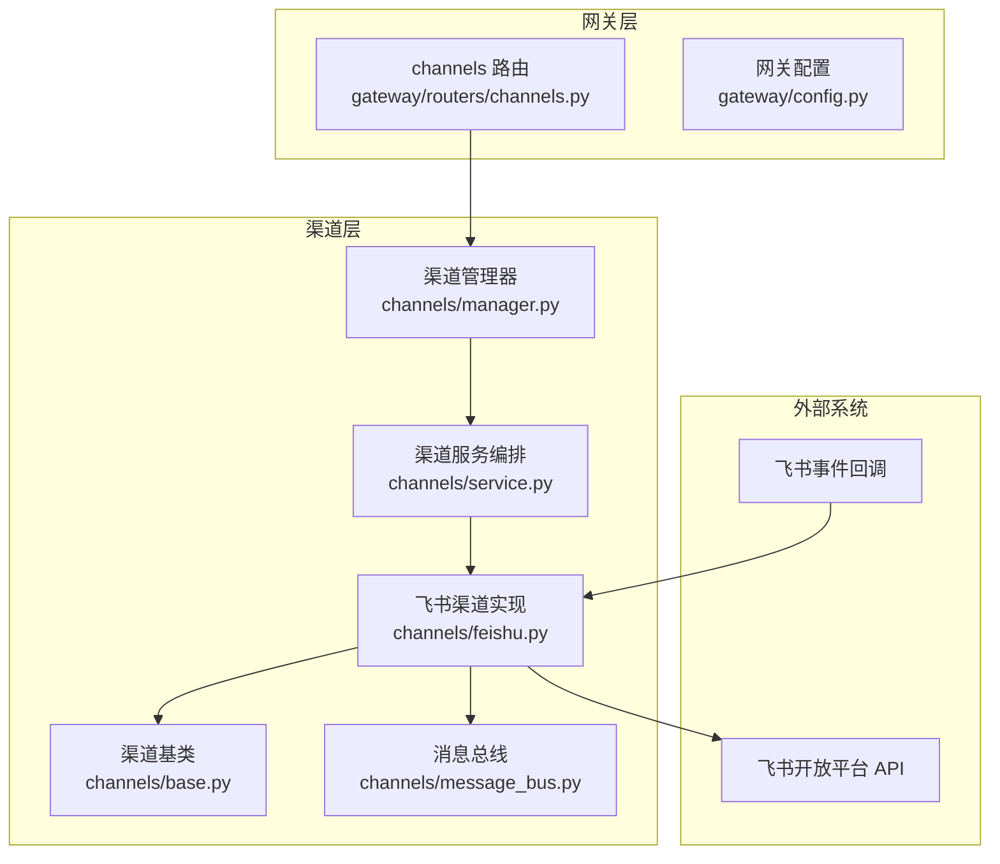
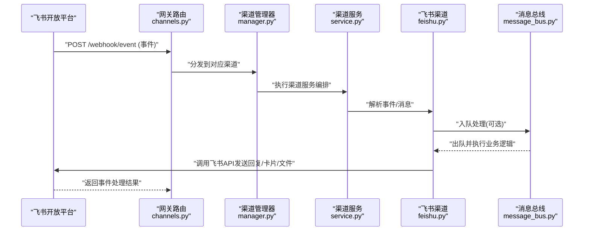
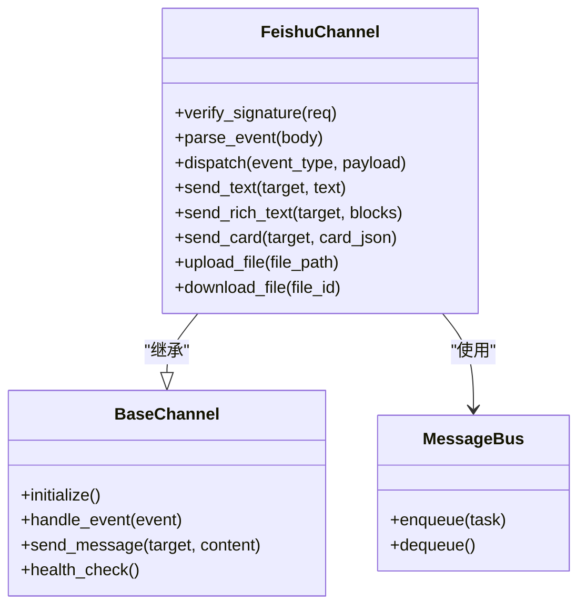
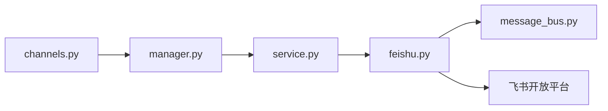
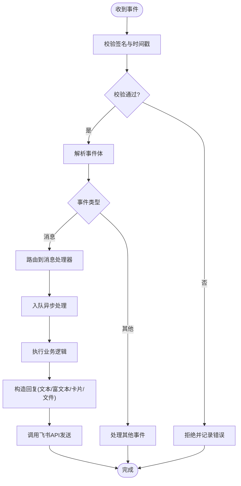

# 飞书渠道集成

<cite>
**本文引用的文件**   
- [backend/app/channels/feishu.py](file://backend/app/channels/feishu.py)
- [backend/app/channels/base.py](file://backend/app/channels/base.py)
- [backend/app/channels/manager.py](file://backend/app/channels/manager.py)
- [backend/app/channels/service.py](file://backend/app/channels/service.py)
- [backend/app/channels/message_bus.py](file://backend/app/channels/message_bus.py)
- [backend/app/gateway/routers/channels.py](file://backend/app/gateway/routers/channels.py)
- [backend/app/gateway/config.py](file://backend/app/gateway/config.py)
- [backend/tests/test_feishu_parser.py](file://backend/tests/test_feishu_parser.py)
- [docker/nginx/nginx.conf](file://docker/nginx/nginx.conf)
- [docker/docker-compose.yaml](file://docker/docker-compose.yaml)
</cite>

## 目录
1. [简介](#简介)
2. [项目结构](#项目结构)
3. [核心组件](#核心组件)
4. [架构总览](#架构总览)
5. [详细组件分析](#详细组件分析)
6. [依赖分析](#依赖分析)
7. [性能考虑](#性能考虑)
8. [故障排查指南](#故障排查指南)
9. [结论](#结论)
10. [附录](#附录)

## 简介
本文件面向企业级用户，提供在 Deer-Flow 中接入飞书渠道的完整指南。内容涵盖：
- 飞书应用创建与配置（凭证、权限、事件订阅）
- 消息处理流程（单聊、群聊接收与响应）
- 飞书特性适配（卡片消息、富文本、文件分享等）
- 用户身份验证与组织架构集成思路
- 企业部署示例（内网穿透与安全配置）
- API 调用限制与错误处理最佳实践

## 项目结构
本项目采用“网关 + 渠道”的分层架构。飞书渠道位于 channels 模块，通过网关路由对外暴露管理接口；消息经消息总线进入统一处理管线，最终由具体渠道实现完成收发。

图表来源
- [backend/app/gateway/routers/channels.py](file://backend/app/gateway/routers/channels.py)
- [backend/app/gateway/config.py](file://backend/app/gateway/config.py)
- [backend/app/channels/manager.py](file://backend/app/channels/manager.py)
- [backend/app/channels/service.py](file://backend/app/channels/service.py)
- [backend/app/channels/feishu.py](file://backend/app/channels/feishu.py)
- [backend/app/channels/base.py](file://backend/app/channels/base.py)
- [backend/app/channels/message_bus.py](file://backend/app/channels/message_bus.py)

章节来源
- [backend/app/gateway/routers/channels.py](file://backend/app/gateway/routers/channels.py)
- [backend/app/gateway/config.py](file://backend/app/gateway/config.py)
- [backend/app/channels/feishu.py](file://backend/app/channels/feishu.py)
- [backend/app/channels/base.py](file://backend/app/channels/base.py)
- [backend/app/channels/manager.py](file://backend/app/channels/manager.py)
- [backend/app/channels/service.py](file://backend/app/channels/service.py)
- [backend/app/channels/message_bus.py](file://backend/app/channels/message_bus.py)

## 核心组件
- 飞书渠道实现：负责与飞书开放平台交互，包括事件校验、消息解析、发送回复、文件上传下载、卡片/富文本渲染等。
- 渠道基类：定义统一的渠道抽象（初始化、生命周期、通用能力），便于扩展其他 IM 渠道。
- 渠道管理器：注册、发现与调度具体渠道实例。
- 渠道服务：编排消息处理流程（鉴权、路由、限流、重试、持久化等）。
- 消息总线：解耦消息生产与消费，支持异步处理与水平扩展。
- 网关路由：对外暴露渠道管理接口（启用/禁用、配置更新、健康检查等）。

章节来源
- [backend/app/channels/feishu.py](file://backend/app/channels/feishu.py)
- [backend/app/channels/base.py](file://backend/app/channels/base.py)
- [backend/app/channels/manager.py](file://backend/app/channels/manager.py)
- [backend/app/channels/service.py](file://backend/app/channels/service.py)
- [backend/app/channels/message_bus.py](file://backend/app/channels/message_bus.py)
- [backend/app/gateway/routers/channels.py](file://backend/app/gateway/routers/channels.py)

## 架构总览
下图展示了从飞书事件回调到内部处理再到回复的全链路。

图表来源
- [backend/app/gateway/routers/channels.py](file://backend/app/gateway/routers/channels.py)
- [backend/app/channels/manager.py](file://backend/app/channels/manager.py)
- [backend/app/channels/service.py](file://backend/app/channels/service.py)
- [backend/app/channels/feishu.py](file://backend/app/channels/feishu.py)
- [backend/app/channels/message_bus.py](file://backend/app/channels/message_bus.py)

## 详细组件分析

### 飞书渠道实现（feishu.py）
- 职责
  - 事件校验与签名验证
  - 事件类型分发（如 im.message.receive_v1）
  - 消息体解析（文本、富文本、卡片、附件等）
  - 调用飞书 API 发送消息（文本、富文本、卡片、文件）
  - 文件上传/下载与临时链接管理
  - 错误码映射与重试策略
- 关键流程
  - 事件回调入口：校验请求头与签名，解密事件体，路由至处理器
  - 消息处理：识别单聊/群聊上下文，提取用户与会话标识，落库或入队
  - 回复发送：根据业务输出选择文本/富文本/卡片/文件，调用飞书 API
- 注意事项
  - 严格遵循飞书 API 频率限制与幂等要求
  - 对超时、网络抖动进行退避重试
  - 敏感信息脱敏与日志审计

章节来源
- [backend/app/channels/feishu.py](file://backend/app/channels/feishu.py)

#### 类关系图（代码级）

图表来源
- [backend/app/channels/base.py](file://backend/app/channels/base.py)
- [backend/app/channels/feishu.py](file://backend/app/channels/feishu.py)
- [backend/app/channels/message_bus.py](file://backend/app/channels/message_bus.py)

### 渠道基类（base.py）
- 职责
  - 定义渠道统一接口（初始化、事件处理、消息发送、健康检查）
  - 提供通用工具（日志、指标、配置加载）
- 设计要点
  - 高内聚低耦合：具体渠道仅关注协议差异
  - 可插拔：通过管理器动态注册与发现

章节来源
- [backend/app/channels/base.py](file://backend/app/channels/base.py)

### 渠道管理器（manager.py）
- 职责
  - 维护已注册的渠道实例
  - 按渠道标识选择具体实现
  - 提供生命周期管理（启动、停止、热重载）
- 关键点
  - 避免循环依赖：通过工厂/注册表模式
  - 可扩展：新增渠道无需修改核心路由

章节来源
- [backend/app/channels/manager.py](file://backend/app/channels/manager.py)

### 渠道服务（service.py）
- 职责
  - 编排消息处理流程：鉴权、路由、限流、重试、持久化、审计
  - 统一异常处理与降级策略
- 关键点
  - 将耗时操作下沉到消息总线异步执行
  - 为不同渠道提供差异化策略钩子

章节来源
- [backend/app/channels/service.py](file://backend/app/channels/service.py)

### 消息总线（message_bus.py）
- 职责
  - 提供异步任务队列能力
  - 支持失败重试、死信队列、监控埋点
- 关键点
  - 保证至少一次投递与幂等处理
  - 与外部队列（如 Redis/RabbitMQ/Kafka）解耦

章节来源
- [backend/app/channels/message_bus.py](file://backend/app/channels/message_bus.py)

### 网关路由（channels.py）
- 职责
  - 暴露渠道管理 REST 接口（启用/禁用、配置更新、状态查询）
  - 转发飞书事件回调到渠道管理器
- 关键点
  - 统一鉴权与访问控制
  - 限流与熔断保护

章节来源
- [backend/app/gateway/routers/channels.py](file://backend/app/gateway/routers/channels.py)

### 网关配置（config.py）
- 职责
  - 集中管理网关参数（端口、域名、TLS、反向代理设置）
  - 与渠道配置联动（如回调地址、白名单）
- 关键点
  - 支持多环境配置覆盖
  - 安全默认值（关闭调试、强制 HTTPS）

章节来源
- [backend/app/gateway/config.py](file://backend/app/gateway/config.py)

### 飞书测试用例（test_feishu_parser.py）
- 用途
  - 验证事件解析、消息体转换、边界条件处理
- 建议
  - 覆盖常见事件类型与异常场景
  - 断言幂等性与错误码映射

章节来源
- [backend/tests/test_feishu_parser.py](file://backend/tests/test_feishu_parser.py)

## 依赖分析
- 组件耦合
  - 网关路由依赖渠道管理器
  - 渠道服务依赖具体渠道实现与消息总线
  - 飞书渠道依赖飞书 SDK/API 客户端
- 外部依赖
  - 飞书开放平台 API（消息、文件、卡片、组织等）
  - 可选：外部队列（Redis/RabbitMQ/Kafka）
- 潜在风险
  - 循环依赖：通过注册表/工厂规避
  - 第三方限流：需本地令牌桶/滑动窗口配合

图表来源
- [backend/app/gateway/routers/channels.py](file://backend/app/gateway/routers/channels.py)
- [backend/app/channels/manager.py](file://backend/app/channels/manager.py)
- [backend/app/channels/service.py](file://backend/app/channels/service.py)
- [backend/app/channels/feishu.py](file://backend/app/channels/feishu.py)
- [backend/app/channels/message_bus.py](file://backend/app/channels/message_bus.py)

章节来源
- [backend/app/gateway/routers/channels.py](file://backend/app/gateway/routers/channels.py)
- [backend/app/channels/manager.py](file://backend/app/channels/manager.py)
- [backend/app/channels/service.py](file://backend/app/channels/service.py)
- [backend/app/channels/feishu.py](file://backend/app/channels/feishu.py)
- [backend/app/channels/message_bus.py](file://backend/app/channels/message_bus.py)

## 性能考虑
- 异步化：将长耗时任务（模型推理、文件处理）放入消息总线异步执行
- 批处理：批量发送消息与文件时合并请求，降低 API 调用次数
- 缓存：常用数据（如用户信息、群组信息）短期缓存，减少重复请求
- 限流与退避：结合飞书 API 限制，实现本地令牌桶与指数退避
- 连接复用：HTTP 连接池与 TLS 会话复用
- 观测性：指标、追踪、日志三件套完善，定位瓶颈

[本节为通用指导，不直接分析具体文件]

## 故障排查指南
- 常见问题
  - 事件校验失败：检查签名算法、时间戳与随机数
  - 回调地址不可达：确认公网可达性与防火墙规则
  - 文件上传失败：检查文件大小、格式与权限
  - 卡片渲染异常：核对 JSON Schema 与字段枚举值
- 定位步骤
  - 查看网关与渠道日志，定位错误码与堆栈
  - 使用测试用例复现解析问题
  - 开启调试模式观察请求/响应报文
- 恢复策略
  - 自动重试与降级（返回友好提示）
  - 死信队列人工介入
  - 快速回滚配置与版本

章节来源
- [backend/tests/test_feishu_parser.py](file://backend/tests/test_feishu_parser.py)

## 结论
通过标准化的渠道抽象与网关路由，飞书渠道可以以最小改动融入现有体系。结合消息总线与完善的错误处理，可在企业环境中稳定运行。建议在上线前完成端到端压测与安全加固，确保满足 SLA 与合规要求。

[本节为总结性内容，不直接分析具体文件]

## 附录

### 一、飞书应用创建与配置清单
- 在飞书开放平台创建企业自建应用
- 获取 App ID 与 App Secret
- 配置事件订阅：
  - 回调地址：指向网关路由的事件入口（HTTPS）
  - 订阅事件：im.message.receive_v1 等
- 配置权限：
  - 消息读写、文件读写、通讯录只读（按需）
- 发布与授权：管理员审批通过后生效

[本节为概念性说明，不直接分析具体文件]

### 二、消息处理流程（单聊/群聊）
- 接收：网关路由 -> 渠道管理器 -> 渠道服务 -> 飞书渠道解析
- 识别：根据事件体判断单聊/群聊与会话标识
- 处理：入队异步执行，生成回复内容
- 发送：调用飞书 API 发送文本/富文本/卡片/文件
- 回执：记录处理结果与指标

[本节为概念性流程图，不直接映射具体源码文件]

### 三、飞书特性适配要点
- 卡片消息：使用卡片模板与按钮动作，注意权限与跳转域名白名单
- 富文本：合理使用段落、图片、超链接与引用块
- 文件分享：先上传获取 file_token，再发送文件消息；注意大小与格式限制
- 消息去重：基于 message_id 做幂等处理

[本节为概念性说明，不直接分析具体文件]

### 四、用户身份与组织架构集成
- 登录态：可通过飞书 OAuth 获取用户信息，建立本地会话
- 组织架构：拉取部门与成员列表，用于权限控制与消息路由
- 同步策略：增量同步与全量校验结合，避免频繁调用

[本节为概念性说明，不直接分析具体文件]

### 五、企业级部署与安全配置
- 反向代理（Nginx）
  - 启用 HTTPS 与 HSTS
  - 配置回调域名为公网可达地址
  - 限制来源 IP 白名单（飞书服务器段）
- 容器编排（Docker Compose）
  - 环境变量注入（App ID/Secret、回调地址、数据库等）
  - 资源限制与健康检查
- 内网穿透
  - 使用可信隧道方案暴露回调地址
  - 确保隧道具备 TLS 终止与访问控制

章节来源
- [docker/nginx/nginx.conf](file://docker/nginx/nginx.conf)
- [docker/docker-compose.yaml](file://docker/docker-compose.yaml)

### 六、API 调用限制与错误处理最佳实践
- 限制
  - 关注飞书 API QPS 与并发上限
  - 文件上传/下载有大小与速率限制
- 错误处理
  - 区分可重试与不可重试错误
  - 指数退避与最大重试次数
  - 统一错误码映射与告警
- 监控
  - 指标：成功率、延迟、QPS、错误分布
  - 追踪：跨组件链路追踪
  - 日志：结构化日志与敏感信息脱敏

[本节为通用指导，不直接分析具体文件]