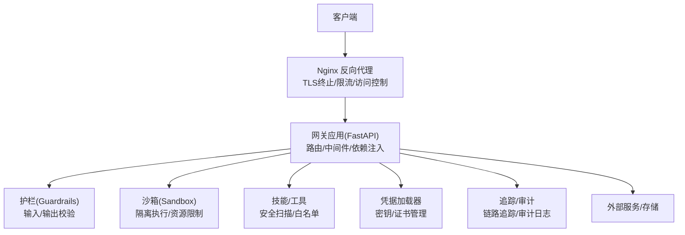
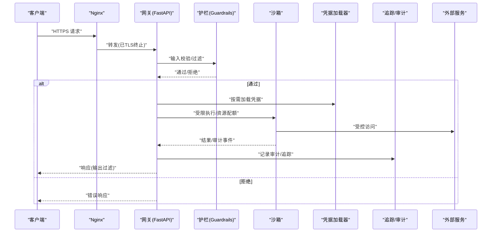
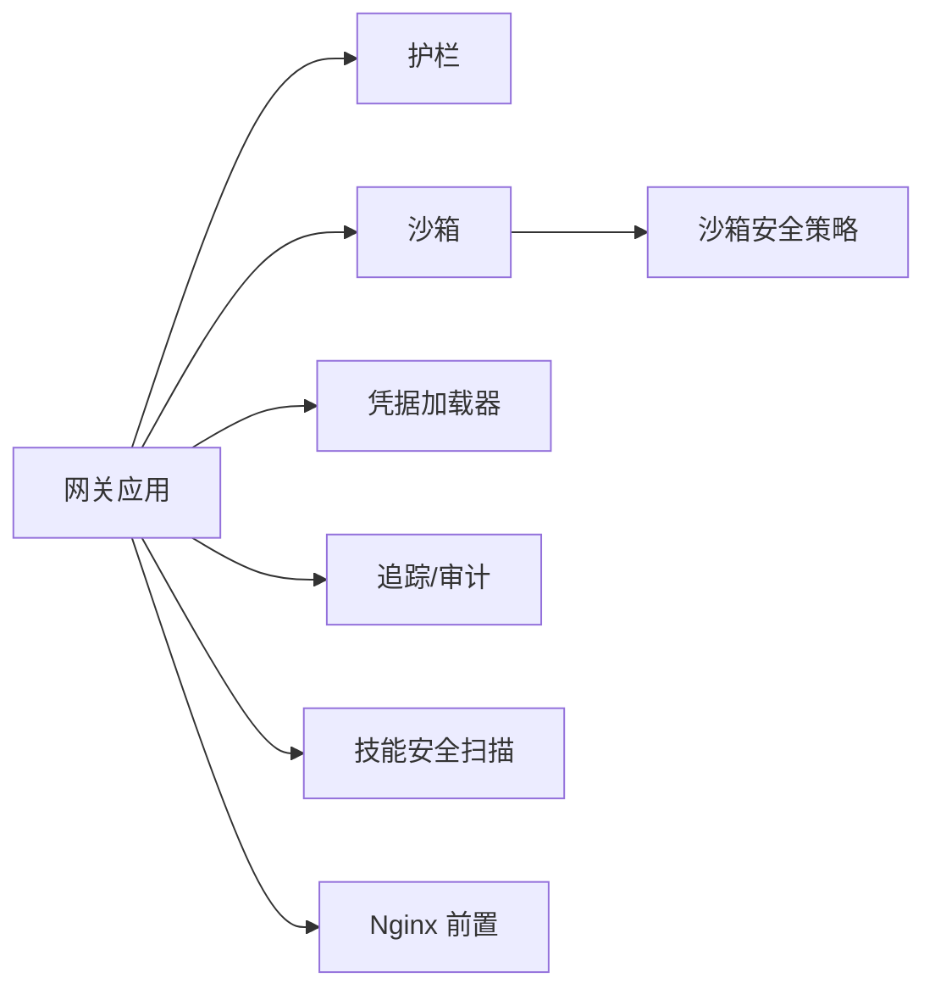

# 安全架构设计

<cite>
**本文引用的文件**   
- [backend/app/gateway/app.py](file://backend/app/gateway/app.py)
- [backend/app/gateway/config.py](file://backend/app/gateway/config.py)
- [backend/app/gateway/deps.py](file://backend/app/gateway/deps.py)
- [backend/packages/harness/deerflow/guardrails/middleware.py](file://backend/packages/harness/deerflow/guardrails/middleware.py)
- [backend/packages/harness/deerflow/guardrails/provider.py](file://backend/packages/harness/deerflow/guardrails/provider.py)
- [backend/packages/harness/deerflow/sandbox/security.py](file://backend/packages/harness/deerflow/sandbox/security.py)
- [backend/packages/harness/deerflow/sandbox/middleware.py](file://backend/packages/harness/deerflow/sandbox/middleware.py)
- [backend/packages/harness/deerflow/skills/security_scanner.py](file://backend/packages/harness/deerflow/skills/security_scanner.py)
- [backend/packages/harness/deerflow/models/credential_loader.py](file://backend/packages/harness/deerflow/models/credential_loader.py)
- [backend/packages/harness/deerflow/tracing/factory.py](file://backend/packages/harness/deerflow/tracing/factory.py)
- [docker/nginx/nginx.conf](file://docker/nginx/nginx.conf)
- [SECURITY.md](file://SECURITY.md)
</cite>

## 目录
1. [引言](#引言)
2. [项目结构](#项目结构)
3. [核心组件](#核心组件)
4. [架构总览](#架构总览)
5. [详细组件分析](#详细组件分析)
6. [依赖分析](#依赖分析)
7. [性能考虑](#性能考虑)
8. [故障排查指南](#故障排查指南)
9. [结论](#结论)
10. [附录](#附录)

## 引言
本文件面向DeerFlow的安全架构设计与实现，围绕零信任模型、纵深防御与最小权限三大原则，系统阐述网关层、应用层、数据层的安全边界划分；说明认证授权、输入验证、输出过滤、审计日志等安全组件的协作机制；给出密钥与证书管理、安全参数配置方法；并提供威胁建模与风险评估流程以及监控告警设计建议。文档同时结合仓库中现有代码与配置，确保可落地性与可追溯性。

## 项目结构
从安全视角看，DeerFlow后端采用“网关 + 业务服务 + 运行时沙箱 + 技能/工具”的分层架构：
- 网关层：基于FastAPI的应用入口，负责路由、依赖注入、中间件编排与基础安全策略（如CORS、请求体大小限制、鉴权前置）。
- 应用层：包含Guardrails护栏、沙箱执行环境、技能与工具加载器、凭据加载器等。
- 数据层：外部存储与第三方服务（由凭据与配置驱动），通过受控通道访问。
- 部署层：Nginx反向代理作为统一入口，提供TLS终止、限流与访问控制。

图表来源
- [backend/app/gateway/app.py](file://backend/app/gateway/app.py)
- [docker/nginx/nginx.conf](file://docker/nginx/nginx.conf)

章节来源
- [backend/app/gateway/app.py](file://backend/app/gateway/app.py)
- [docker/nginx/nginx.conf](file://docker/nginx/nginx.conf)

## 核心组件
- 网关与安全中间件
  - 网关应用负责注册路由、挂载中间件、注入安全相关依赖，并统一处理跨域、请求体大小、超时等基础安全策略。
  - 参考路径：[backend/app/gateway/app.py](file://backend/app/gateway/app.py)、[backend/app/gateway/deps.py](file://backend/app/gateway/deps.py)
- 护栏（Guardrails）
  - 对输入与输出进行结构化校验、内容过滤与合规检查，拦截越界或恶意请求。
  - 参考路径：[backend/packages/harness/deerflow/guardrails/middleware.py](file://backend/packages/harness/deerflow/guardrails/middleware.py)、[backend/packages/harness/deerflow/guardrails/provider.py](file://backend/packages/harness/deerflow/guardrails/provider.py)
- 沙箱与执行隔离
  - 为Agent/工具执行提供隔离环境，限制文件系统、网络、进程能力，记录审计事件。
  - 参考路径：[backend/packages/harness/deerflow/sandbox/middleware.py](file://backend/packages/harness/deerflow/sandbox/middleware.py)、[backend/packages/harness/deerflow/sandbox/security.py](file://backend/packages/harness/deerflow/sandbox/security.py)
- 技能与工具安全
  - 技能安装前进行安全扫描与白名单校验，降低供应链风险。
  - 参考路径：[backend/packages/harness/deerflow/skills/security_scanner.py](file://backend/packages/harness/deerflow/skills/security_scanner.py)
- 凭据与密钥管理
  - 集中加载与管理模型与服务凭据，避免硬编码与明文泄露。
  - 参考路径：[backend/packages/harness/deerflow/models/credential_loader.py](file://backend/packages/harness/deerflow/models/credential_loader.py)
- 追踪与审计
  - 提供链路追踪与审计日志能力，支撑可观测性与事后溯源。
  - 参考路径：[backend/packages/harness/deerflow/tracing/factory.py](file://backend/packages/harness/deerflow/tracing/factory.py)

章节来源
- [backend/app/gateway/app.py](file://backend/app/gateway/app.py)
- [backend/app/gateway/deps.py](file://backend/app/gateway/deps.py)
- [backend/packages/harness/deerflow/guardrails/middleware.py](file://backend/packages/harness/deerflow/guardrails/middleware.py)
- [backend/packages/harness/deerflow/guardrails/provider.py](file://backend/packages/harness/deerflow/guardrails/provider.py)
- [backend/packages/harness/deerflow/sandbox/middleware.py](file://backend/packages/harness/deerflow/sandbox/middleware.py)
- [backend/packages/harness/deerflow/sandbox/security.py](file://backend/packages/harness/deerflow/sandbox/security.py)
- [backend/packages/harness/deerflow/skills/security_scanner.py](file://backend/packages/harness/deerflow/skills/security_scanner.py)
- [backend/packages/harness/deerflow/models/credential_loader.py](file://backend/packages/harness/deerflow/models/credential_loader.py)
- [backend/packages/harness/deerflow/tracing/factory.py](file://backend/packages/harness/deerflow/tracing/factory.py)

## 架构总览
整体安全架构遵循“零信任+纵深防御+最小权限”的原则：
- 零信任：所有请求默认不被信任，必须在每个边界进行身份与上下文校验。
- 纵深防御：在网关、应用、沙箱、数据等多层叠加防护，单一失效不导致全局失守。
- 最小权限：按角色与任务授予最小必要权限，限制资源访问范围与生命周期。

图表来源
- [backend/app/gateway/app.py](file://backend/app/gateway/app.py)
- [backend/packages/harness/deerflow/guardrails/middleware.py](file://backend/packages/harness/deerflow/guardrails/middleware.py)
- [backend/packages/harness/deerflow/sandbox/middleware.py](file://backend/packages/harness/deerflow/sandbox/middleware.py)
- [backend/packages/harness/deerflow/models/credential_loader.py](file://backend/packages/harness/deerflow/models/credential_loader.py)
- [backend/packages/harness/deerflow/tracing/factory.py](file://backend/packages/harness/deerflow/tracing/factory.py)
- [docker/nginx/nginx.conf](file://docker/nginx/nginx.conf)

## 详细组件分析

### 网关层安全（FastAPI 应用与中间件）
- 职责
  - 统一入口、路由分发、中间件编排、依赖注入、基础安全策略（CORS、请求体大小、超时、限流）。
- 关键实现点
  - 应用初始化与中间件注册：参考 [backend/app/gateway/app.py](file://backend/app/gateway/app.py)
  - 安全相关依赖注入：参考 [backend/app/gateway/deps.py](file://backend/app/gateway/deps.py)
  - 网关配置项（如CORS、最大请求体、超时等）：参考 [backend/app/gateway/config.py](file://backend/app/gateway/config.py)
- 安全要点
  - 仅暴露必要接口；严格限定CORS来源；限制请求体大小与超时；启用访问日志与审计。
  - 将鉴权与授权逻辑下沉到具体路由或中间件，避免在业务层重复实现。

章节来源
- [backend/app/gateway/app.py](file://backend/app/gateway/app.py)
- [backend/app/gateway/deps.py](file://backend/app/gateway/deps.py)
- [backend/app/gateway/config.py](file://backend/app/gateway/config.py)

### 护栏（Guardrails）：输入验证与输出过滤
- 职责
  - 对进入系统的输入进行结构与语义校验，对输出进行敏感信息过滤与合规检查。
- 关键实现点
  - 中间件集成与执行顺序：参考 [backend/packages/harness/deerflow/guardrails/middleware.py](file://backend/packages/harness/deerflow/guardrails/middleware.py)
  - 规则提供者与扩展点：参考 [backend/packages/harness/deerflow/guardrails/provider.py](file://backend/packages/harness/deerflow/guardrails/provider.py)
- 安全要点
  - 输入侧：类型/长度/格式/白名单校验，防注入与越权访问。
  - 输出侧：PII脱敏、敏感词过滤、链接与附件安全检查。
  - 可插拔规则：便于按场景动态调整策略。

章节来源
- [backend/packages/harness/deerflow/guardrails/middleware.py](file://backend/packages/harness/deerflow/guardrails/middleware.py)
- [backend/packages/harness/deerflow/guardrails/provider.py](file://backend/packages/harness/deerflow/guardrails/provider.py)

### 沙箱与执行隔离：最小权限与资源约束
- 职责
  - 为Agent/工具/脚本提供隔离执行环境，限制文件系统、网络、进程能力，并记录审计事件。
- 关键实现点
  - 沙箱中间件与生命周期：参考 [backend/packages/harness/deerflow/sandbox/middleware.py](file://backend/packages/harness/deerflow/sandbox/middleware.py)
  - 安全策略与资源限制：参考 [backend/packages/harness/deerflow/sandbox/security.py](file://backend/packages/harness/deerflow/sandbox/security.py)
- 安全要点
  - 文件系统：只读挂载、白名单目录、禁止写回宿主。
  - 网络：出站白名单、禁用内网探测、限制带宽与并发。
  - 进程：CPU/内存/时间片上限，禁止特权操作。
  - 审计：完整记录调用链、资源使用与异常事件。

章节来源
- [backend/packages/harness/deerflow/sandbox/middleware.py](file://backend/packages/harness/deerflow/sandbox/middleware.py)
- [backend/packages/harness/deerflow/sandbox/security.py](file://backend/packages/harness/deerflow/sandbox/security.py)

### 技能与工具安全：供应链与白名单
- 职责
  - 在安装与加载阶段对技能/工具进行安全扫描与白名单校验，阻断高风险组件。
- 关键实现点
  - 安全扫描与策略：参考 [backend/packages/harness/deerflow/skills/security_scanner.py](file://backend/packages/harness/deerflow/skills/security_scanner.py)
- 安全要点
  - 静态扫描：依赖漏洞、危险函数、可疑行为检测。
  - 动态校验：签名验证、版本锁定、来源可信度评估。
  - 白名单机制：仅允许受控来源与版本运行。

章节来源
- [backend/packages/harness/deerflow/skills/security_scanner.py](file://backend/packages/harness/deerflow/skills/security_scanner.py)

### 凭据与密钥管理：机密保护与轮换
- 职责
  - 集中加载与管理模型与服务凭据，支持多来源与轮换，避免硬编码与明文泄露。
- 关键实现点
  - 凭据加载器：参考 [backend/packages/harness/deerflow/models/credential_loader.py](file://backend/packages/harness/deerflow/models/credential_loader.py)
- 安全要点
  - 机密来源：环境变量、密钥管理服务、配置文件加密。
  - 访问控制：按服务/角色最小化可见范围。
  - 生命周期：自动轮换、过期检测、审计留痕。

章节来源
- [backend/packages/harness/deerflow/models/credential_loader.py](file://backend/packages/harness/deerflow/models/credential_loader.py)

### 追踪与审计：可观测性与合规
- 职责
  - 提供链路追踪与审计日志，支撑问题定位、合规审计与攻击溯源。
- 关键实现点
  - 追踪工厂与接入点：参考 [backend/packages/harness/deerflow/tracing/factory.py](file://backend/packages/harness/deerflow/tracing/factory.py)
- 安全要点
  - 全链路ID贯穿；敏感字段脱敏；高优事件告警；日志不可篡改与留存策略。

章节来源
- [backend/packages/harness/deerflow/tracing/factory.py](file://backend/packages/harness/deerflow/tracing/factory.py)

### 网关前置：Nginx 反向代理安全
- 职责
  - TLS终止、速率限制、访问控制、请求裁剪与缓存策略。
- 关键实现点
  - 反向代理与安全参数：参考 [docker/nginx/nginx.conf](file://docker/nginx/nginx.conf)
- 安全要点
  - 强制HTTPS、HSTS、合理超时与连接数限制、WAF联动（可选）、访问白名单。

章节来源
- [docker/nginx/nginx.conf](file://docker/nginx/nginx.conf)

## 依赖分析
- 组件耦合关系
  - 网关依赖护栏、沙箱、凭据加载器与追踪模块；沙箱依赖安全策略；技能加载依赖安全扫描器。
- 外部依赖
  - 外部服务/存储通过凭据加载器访问；Nginx作为前置边界。
- 潜在风险
  - 中间件顺序不当可能导致校验绕过；凭据加载失败应快速失败；沙箱逃逸需持续加固。

图表来源
- [backend/app/gateway/app.py](file://backend/app/gateway/app.py)
- [backend/packages/harness/deerflow/guardrails/middleware.py](file://backend/packages/harness/deerflow/guardrails/middleware.py)
- [backend/packages/harness/deerflow/sandbox/middleware.py](file://backend/packages/harness/deerflow/sandbox/middleware.py)
- [backend/packages/harness/deerflow/sandbox/security.py](file://backend/packages/harness/deerflow/sandbox/security.py)
- [backend/packages/harness/deerflow/skills/security_scanner.py](file://backend/packages/harness/deerflow/skills/security_scanner.py)
- [backend/packages/harness/deerflow/models/credential_loader.py](file://backend/packages/harness/deerflow/models/credential_loader.py)
- [backend/packages/harness/deerflow/tracing/factory.py](file://backend/packages/harness/deerflow/tracing/factory.py)
- [docker/nginx/nginx.conf](file://docker/nginx/nginx.conf)

## 性能考虑
- 护栏与沙箱应在保证安全的前提下尽量无状态与轻量，避免阻塞主线程。
- 对高频路径启用缓存与短路策略（如已知白名单请求直接放行）。
- 沙箱资源配额需与业务峰值匹配，防止雪崩。
- 追踪与审计采用异步落盘与采样策略，降低开销。

## 故障排查指南
- 常见问题定位
  - 鉴权失败：检查网关中间件顺序与依赖注入是否正确。
  - 输入被拒：查看护栏规则与错误码，确认白名单与格式要求。
  - 沙箱执行失败：核对资源配额、网络白名单与文件系统挂载。
  - 凭据加载失败：检查来源、权限与轮换策略。
- 建议步骤
  - 开启详细日志与追踪；复现请求并提取链路ID；对比基线配置；逐步关闭非关键中间件定位问题。

章节来源
- [SECURITY.md](file://SECURITY.md)

## 结论
DeerFlow以零信任为核心，通过网关前置、护栏校验、沙箱隔离、技能白名单、凭据管理与追踪审计形成纵深防御体系。建议在后续迭代中完善细粒度授权、动态策略下发与自动化威胁狩猎，持续提升整体安全水位。

## 附录

### 安全配置清单（示例）
- 网关
  - CORS来源白名单、最大请求体大小、超时、限流阈值、访问日志开关
- 护栏
  - 输入校验规则集、输出过滤策略、敏感词库更新周期
- 沙箱
  - CPU/内存/时间片上限、网络白名单、文件系统挂载策略
- 凭据
  - 来源优先级、轮换周期、访问审计开关
- Nginx
  - TLS版本、HSTS、速率限制、连接数限制

### 威胁建模与风险评估方法
- 资产识别：用户数据、模型凭据、技能/工具、执行环境
- 威胁分类：注入、越权、供应链、资源耗尽、数据泄露
- 风险量化：可能性×影响程度，制定缓解措施与验收标准
- 持续改进：定期演练、红蓝对抗、回归测试

### 监控与告警设计
- 指标：鉴权失败率、护栏拦截率、沙箱异常率、凭据加载失败次数
- 日志：统一格式、脱敏、保留期、不可篡改
- 告警：阈值与趋势双触发、分级通知、工单联动
- 可视化：仪表盘、链路追踪视图、审计检索