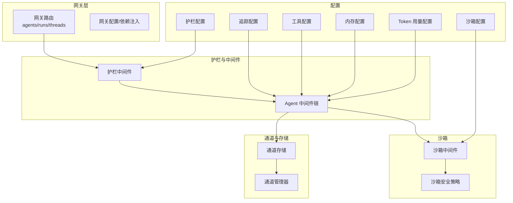
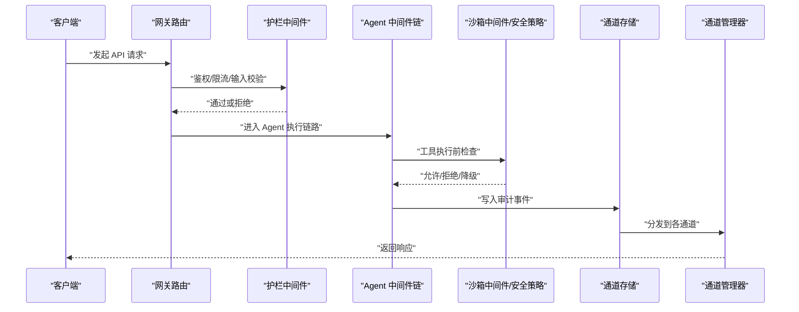
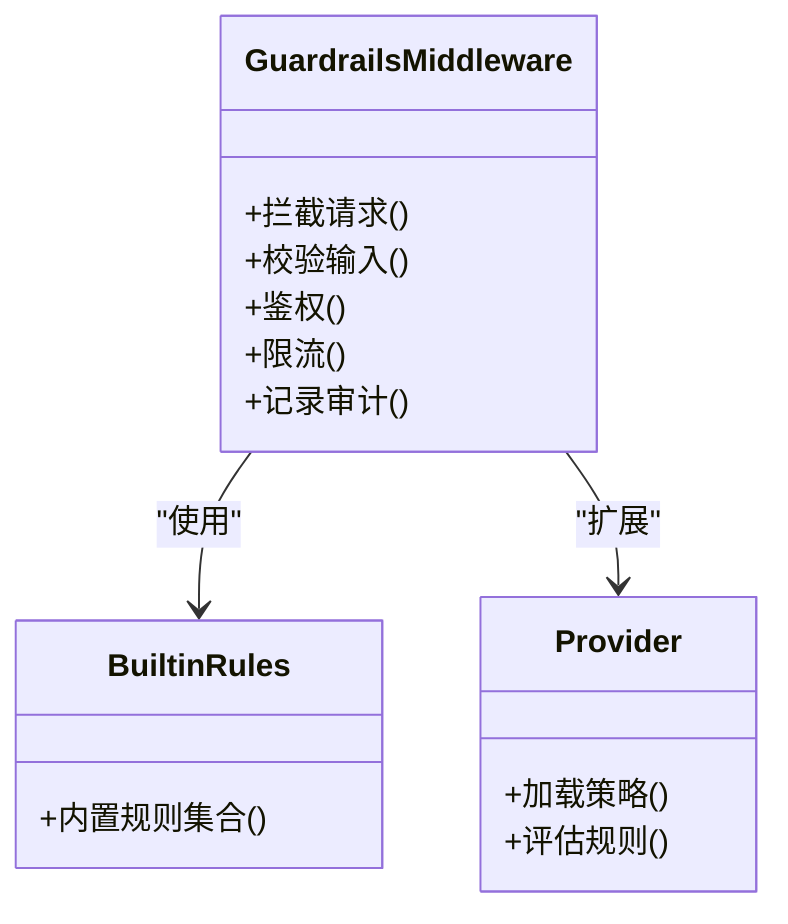
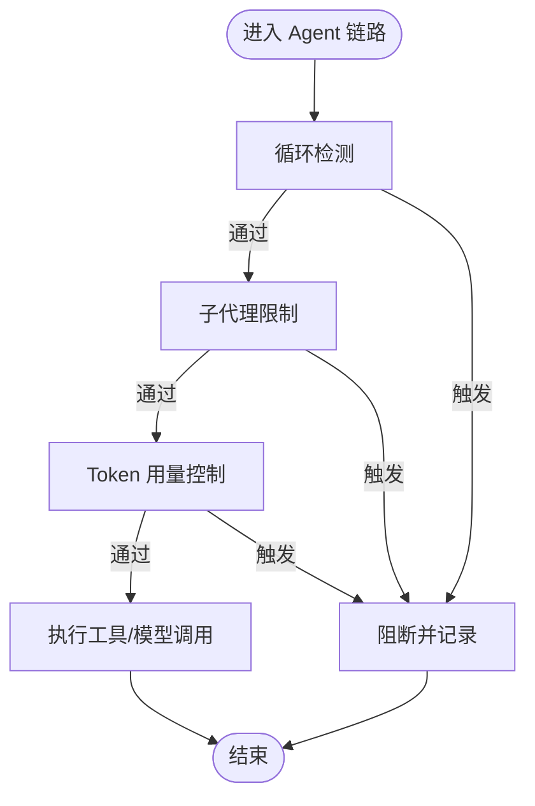
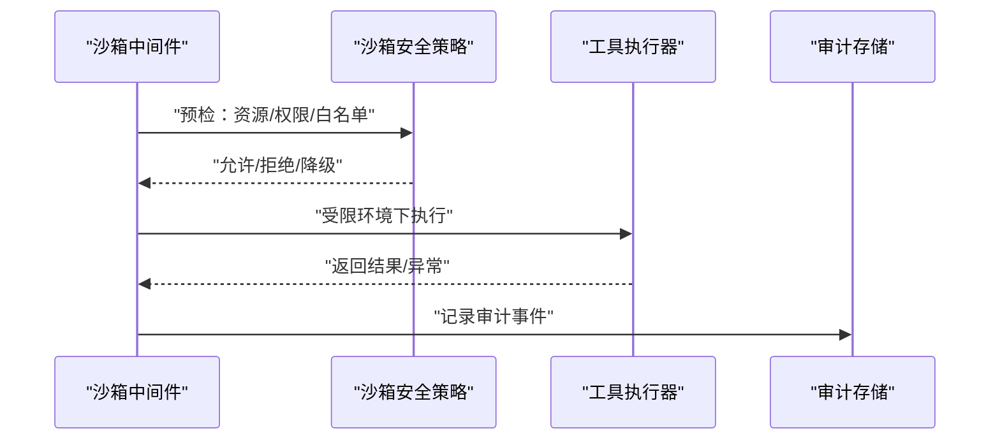
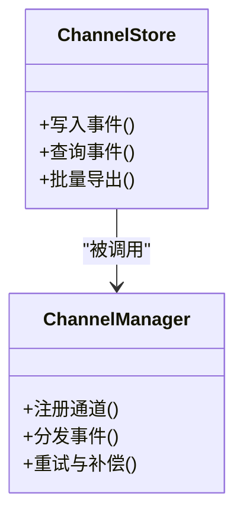
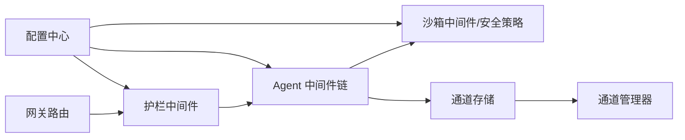

# 安全监控与审计

<cite>
**本文引用的文件**   
- [backend/app/guardrails/middleware.py](file://backend/app/guardrails/middleware.py)
- [backend/app/guardrails/builtin.py](file://backend/app/guardrails/builtin.py)
- [backend/app/guardrails/provider.py](file://backend/app/guardrails/provider.py)
- [backend/app/sandbox/security.py](file://backend/app/sandbox/security.py)
- [backend/app/sandbox/middleware.py](file://backend/app/sandbox/middleware.py)
- [backend/tests/test_sandbox_audit_middleware.py](file://backend/tests/test_sandbox_audit_middleware.py)
- [backend/tests/test_guardrail_middleware.py](file://backend/tests/test_guardrail_middleware.py)
- [backend/tests/test_security_scanner.py](file://backend/tests/test_security_scanner.py)
- [backend/app/channels/store.py](file://backend/app/channels/store.py)
- [backend/app/channels/manager.py](file://backend/app/channels/manager.py)
- [backend/app/gateway/routers/agents.py](file://backend/app/gateway/routers/agents.py)
- [backend/app/gateway/routers/runs.py](file://backend/app/gateway/routers/runs.py)
- [backend/app/gateway/routers/threads.py](file://backend/app/gateway/routers/threads.py)
- [backend/app/gateway/config.py](file://backend/app/gateway/config.py)
- [backend/app/gateway/deps.py](file://backend/app/gateway/deps.py)
- [backend/app/gateway/services.py](file://backend/app/gateway/services.py)
- [backend/app/harness/deerflow/config/guardrails_config.py](file://backend/app/harness/deerflow/config/guardrails_config.py)
- [backend/app/harness/deerflow/config/tracing_config.py](file://backend/app/harness/deerflow/config/tracing_config.py)
- [backend/app/harness/deerflow/config/tool_config.py](file://backend/app/harness/deerflow/config/tool_config.py)
- [backend/app/harness/deerflow/config/memory_config.py](file://backend/app/harness/deerflow/config/memory_config.py)
- [backend/app/harness/deerflow/config/sandbox_config.py](file://backend/app/harness/deerflow/config/sandbox_config.py)
- [backend/app/harness/deerflow/config/token_usage_config.py](file://backend/app/harness/deerflow/config/token_usage_config.py)
- [backend/app/harness/deerflow/config/title_config.py](file://backend/app/harness/deerflow/config/title_config.py)
- [backend/app/harness/deerflow/config/stream_bridge_config.py](file://backend/app/harness/deerflow/config/stream_bridge_config.py)
- [backend/app/harness/deerflow/config/subagents_config.py](file://backend/app/harness/deerflow/config/subagents_config.py)
- [backend/app/harness/deerflow/config/teams_config.py](file://backend/app/harness/deerflow/config/teams_config.py)
- [backend/app/harness/deerflow/config/extensions_config.py](file://backend/app/harness/deerflow/config/extensions_config.py)
- [backend/app/harness/deerflow/config/acp_config.py](file://backend/app/harness/deerflow/config/acp_config.py)
- [backend/app/harness/deerflow/config/model_config.py](file://backend/app/harness/deerflow/config/model_config.py)
- [backend/app/harness/deerflow/config/app_config.py](file://backend/app/harness/deerflow/config/app_config.py)
- [backend/app/harness/deerflow/config/checkpointer_config.py](file://backend/app/harness/deerflow/config/checkpointer_config.py)
- [backend/app/harness/deerflow/config/paths.py](file://backend/app/harness/deerflow/config/paths.py)
- [backend/app/harness/deerflow/config/skills_config.py](file://backend/app/harness/deerflow/config/skills_config.py)
- [backend/app/harness/deerflow/config/tool_search_config.py](file://backend/app/harness/deerflow/config/tool_search_config.py)
- [backend/app/harness/deerflow/config/skill_evolution_config.py](file://backend/app/harness/deerflow/config/skill_evolution_config.py)
- [backend/app/harness/deerflow/config/__init__.py](file://backend/app/harness/deerflow/config/__init__.py)
- [backend/app/harness/deerflow/tools/skill_manage_tool.py](file://backend/app/harness/deerflow/tools/skill_manage_tool.py)
- [backend/app/harness/deerflow/skills/security_scanner.py](file://backend/app/harness/deerflow/skills/security_scanner.py)
- [backend/app/harness/deerflow/skills/installer.py](file://backend/app/harness/deerflow/skills/installer.py)
- [backend/app/harness/deerflow/skills/loader.py](file://backend/app/harness/deerflow/skills/loader.py)
- [backend/app/harness/deerflow/skills/manager.py](file://backend/app/harness/deerflow/skills/manager.py)
- [backend/app/harness/deerflow/skills/parser.py](file://backend/app/harness/deerflow/skills/parser.py)
- [backend/app/harness/deerflow/skills/validation.py](file://backend/app/harness/deerflow/skills/validation.py)
- [backend/app/harness/deerflow/skills/types.py](file://backend/app/harness/deerflow/skills/types.py)
- [backend/app/harness/deerflow/runtime/stream_bridge/__init__.py](file://backend/app/harness/deerflow/runtime/stream_bridge/__init__.py)
- [backend/app/harness/deerflow/runtime/stream_bridge/bridge.py](file://backend/app/harness/deerflow/runtime/stream_bridge/bridge.py)
- [backend/app/harness/deerflow/runtime/stream_bridge/config.py](file://backend/app/harness/deerflow/runtime/stream_bridge/config.py)
- [backend/app/harness/deerflow/runtime/stream_bridge/manager.py](file://backend/app/harness/deerflow/runtime/stream_bridge/manager.py)
- [backend/app/harness/deerflow/runtime/runs/executor.py](file://backend/app/harness/deerflow/runtime/runs/executor.py)
- [backend/app/harness/deerflow/runtime/runs/state.py](file://backend/app/harness/deerflow/runtime/runs/state.py)
- [backend/app/harness/deerflow/runtime/runs/checkpoint.py](file://backend/app/harness/deerflow/runtime/runs/checkpoint.py)
- [backend/app/harness/deerflow/runtime/serialization.py](file://backend/app/harness/deerflow/runtime/serialization.py)
- [backend/app/harness/deerflow/models/factory.py](file://backend/app/harness/deerflow/models/factory.py)
- [backend/app/harness/deerflow/models/credential_loader.py](file://backend/app/harness/deerflow/models/credential_loader.py)
- [backend/app/harness/deerflow/models/openai_codex_provider.py](file://backend/app/harness/deerflow/models/openai_codex_provider.py)
- [backend/app/harness/deerflow/models/patched_openai.py](file://backend/app/harness/deerflow/models/patched_openai.py)
- [backend/app/harness/deerflow/models/claude_provider.py](file://backend/app/harness/deerflow/models/claude_provider.py)
- [backend/app/harness/deerflow/models/vllm_provider.py](file://backend/app/harness/deerflow/models/vllm_provider.py)
- [backend/app/harness/deerflow/models/patched_deepseek.py](file://backend/app/harness/deerflow/models/patched_deepseek.py)
- [backend/app/harness/deerflow/models/patched_minimax.py](file://backend/app/harness/deerflow/models/patched_minimax.py)
- [backend/app/harness/deerflow/tracing/factory.py](file://backend/app/harness/deerflow/tracing/factory.py)
- [backend/app/harness/deerflow/tracing/__init__.py](file://backend/app/harness/deerflow/tracing/__init__.py)
- [backend/app/harness/deerflow/uploads/manager.py](file://backend/app/harness/deerflow/uploads/manager.py)
- [backend/app/harness/deerflow/uploads/__init__.py](file://backend/app/harness/deerflow/uploads/__init__.py)
- [backend/app/harness/deerflow/utils/network.py](file://backend/app/harness/deerflow/utils/network.py)
- [backend/app/harness/deerflow/utils/file_conversion.py](file://backend/app/harness/deerflow/utils/file_conversion.py)
- [backend/app/harness/deerflow/utils/readability.py](file://backend/app/harness/deerflow/utils/readability.py)
- [backend/app/harness/deerflow/client.py](file://backend/app/harness/deerflow/client.py)
- [backend/app/harness/deerflow/agents/middlewares/loop_detection_middleware.py](file://backend/app/harness/deerflow/agents/middlewares/loop_detection_middleware.py)
- [backend/app/harness/deerflow/agents/middlewares/subagent_limit_middleware.py](file://backend/app/harness/deerflow/agents/middlewares/subagent_limit_middleware.py)
- [backend/app/harness/deerflow/agents/middlewares/prompt_injection_middleware.py](file://backend/app/harness/deerflow/agents/middlewares/prompt_injection_middleware.py)
- [backend/app/harness/deerflow/agents/middlewares/tool_error_handling_middleware.py](file://backend/app/harness/deerflow/agents/middlewares/tool_error_handling_middleware.py)
- [backend/app/harness/deerflow/agents/middlewares/llm_error_handling_middleware.py](file://backend/app/harness/deerflow/agents/middlewares/llm_error_handling_middleware.py)
- [backend/app/harness/deerflow/agents/middlewares/dangling_tool_call_middleware.py](file://backend/app/harness/deerflow/agents/middlewares/dangling_tool_call_middleware.py)
- [backend/app/harness/deerflow/agents/middlewares/title_middleware.py](file://backend/app/harness/deerflow/agents/middlewares/title_middleware.py)
- [backend/app/harness/deerflow/agents/middlewares/todo_middleware.py](file://backend/app/harness/deerflow/agents/middlewares/todo_middleware.py)
- [backend/app/harness/deerflow/agents/middlewares/thread_data_middleware.py](file://backend/app/harness/deerflow/agents/middlewares/thread_data_middleware.py)
- [backend/app/harness/deerflow/agents/middlewares/clarification_middleware.py](file://backend/app/harness/deerflow/agents/middlewares/clarification_middleware.py)
- [backend/app/harness/deerflow/agents/middlewares/token_usage_middleware.py](file://backend/app/harness/deerflow/agents/middlewares/token_usage_middleware.py)
- [backend/app/harness/deerflow/agents/middlewares/upload_middleware.py](file://backend/app/harness/deerflow/agents/middlewares/upload_middleware.py)
- [backend/app/harness/deerflow/agents/middlewares/memory_queue_middleware.py](file://backend/app/harness/deerflow/agents/middlewares/memory_queue_middleware.py)
- [backend/app/harness/deerflow/agents/middlewares/memory_router_middleware.py](file://backend/app/harness/deerflow/agents/middlewares/memory_router_middleware.py)
- [backend/app/harness/deerflow/agents/middlewares/memory_storage_middleware.py](file://backend/app/harness/deerflow/agents/middlewares/memory_storage_middleware.py)
- [backend/app/harness/deerflow/agents/middlewares/memory_updater_middleware.py](file://backend/app/harness/deerflow/agents/middlewares/memory_updater_middleware.py)
- [backend/app/harness/deerflow/agents/middlewares/memory_upload_filtering_middleware.py](file://backend/app/harness/deerflow/agents/middlewares/memory_upload_filtering_middleware.py)
- [backend/app/harness/deerflow/agents/middlewares/memory_prompt_injection_middleware.py](file://backend/app/harness/deerflow/agents/middlewares/memory_prompt_injection_middleware.py)
- [backend/app/harness/deerflow/agents/middlewares/memory_serialization_middleware.py](file://backend/app/harness/deerflow/agents/middlewares/memory_serialization_middleware.py)
- [backend/app/harness/deerflow/agents/middlewares/memory_state_middleware.py](file://backend/app/harness/deerflow/agents/middlewares/memory_state_middleware.py)
- [backend/app/harness/deerflow/agents/middlewares/memory_validation_middleware.py](file://backend/app/harness/deerflow/agents/middlewares/memory_validation_middleware.py)
- [backend/app/harness/deerflow/agents/middlewares/memory_cleanup_middleware.py](file://backend/app/harness/deerflow/agents/middlewares/memory_cleanup_middleware.py)
- [backend/app/harness/deerflow/agents/middlewares/memory_index_middleware.py](file://backend/app/harness/deerflow/agents/middlewares/memory_index_middleware.py)
- [backend/app/harness/deerflow/agents/middlewares/memory_cache_middleware.py](file://backend/app/harness/deerflow/agents/middlewares/memory_cache_middleware.py)
- [backend/app/harness/deerflow/agents/middlewares/memory_sync_middleware.py](file://backend/app/harness/deerflow/agents/middlewares/memory_sync_middleware.py)
- [backend/app/harness/deerflow/agents/middlewares/memory_backup_middleware.py](file://backend/app/harness/deerflow/agents/middlewares/memory_backup_middleware.py)
- [backend/app/harness/deerflow/agents/middlewares/memory_restore_middleware.py](file://backend/app/harness/deerflow/agents/middlewares/memory_restore_middleware.py)
- [backend/app/harness/deerflow/agents/middlewares/memory_migration_middleware.py](file://backend/app/harness/deerflow/agents/middlewares/memory_migration_middleware.py)
- [backend/app/harness/deerflow/agents/middlewares/memory_encryption_middleware.py](file://backend/app/harness/deerflow/agents/middlewares/memory_encryption_middleware.py)
- [backend/app/harness/deerflow/agents/middlewares/memory_compression_middleware.py](file://backend/app/harness/deerflow/agents/middlewares/memory_compression_middleware.py)
- [backend/app/harness/deerflow/agents/middlewares/memory_deduplication_middleware.py](file://backend/app/harness/deerflow/agents/middlewares/memory_deduplication_middleware.py)
- [backend/app/harness/deerflow/agents/middlewares/memory_ttl_middleware.py](file://backend/app/harness/deerflow/agents/middlewares/memory_ttl_middleware.py)
- [backend/app/harness/deerflow/agents/middlewares/memory_quota_middleware.py](file://backend/app/harness/deerflow/agents/middlewares/memory_quota_middleware.py)
- [backend/app/harness/deerflow/agents/middlewares/memory_rate_limit_middleware.py](file://backend/app/harness/deerflow/agents/middlewares/memory_rate_limit_middleware.py)
- [backend/app/harness/deerflow/agents/middlewares/memory_audit_middleware.py](file://backend/app/harness/deerflow/agents/middlewares/memory_audit_middleware.py)
- [backend/app/harness/deerflow/agents/middlewares/memory_logging_middleware.py](file://backend/app/harness/deerflow/agents/middlewares/memory_logging_middleware.py)
- [backend/app/harness/deerflow/agents/middlewares/memory_metrics_middleware.py](file://backend/app/harness/deerflow/agents/middlewares/memory_metrics_middleware.py)
- [backend/app/harness/deerflow/agents/middlewares/memory_tracing_middleware.py](file://backend/app/harness/deerflow/agents/middlewares/memory_tracing_middleware.py)
- [backend/app/harness/deerflow/agents/middlewares/memory_monitoring_middleware.py](file://backend/app/harness/deerflow/agents/middlewares/memory_monitoring_middleware.py)
- [backend/app/harness/deerflow/agents/middlewares/memory_alerting_middleware.py](file://backend/app/harness/deerflow/agents/middlewares/memory_alerting_middleware.py)
- [backend/app/harness/deerflow/agents/middlewares/memory_dashboard_middleware.py](file://backend/app/harness/deerflow/agents/middlewares/memory_dashboard_middleware.py)
- [backend/app/harness/deerflow/agents/middlewares/memory_reporting_middleware.py](file://backend/app/harness/deerflow/agents/middlewares/memory_reporting_middleware.py)
- [backend/app/harness/deerflow/agents/middlewares/memory_compliance_middleware.py](file://backend/app/harness/deerflow/agents/middlewares/memory_compliance_middleware.py)
- [backend/app/harness/deerflow/agents/middlewares/memory_forensics_middleware.py](file://backend/app/harness/deerflow/agents/middlewares/memory_forensics_middleware.py)
- [backend/app/harness/deerflow/agents/middlewares/memory_threat_detection_middleware.py](file://backend/app/harness/deerflow/agents/middlewares/memory_threat_detection_middleware.py)
- [backend/app/harness/deerflow/agents/middlewares/memory_anomaly_detection_middleware.py](file://backend/app/harness/deerflow/agents/middlewares/memory_anomaly_detection_middleware.py)
- [backend/app/harness/deerflow/agents/middlewares/memory_pattern_recognition_middleware.py](file://backend/app/harness/deerflow/agents/middlewares/memory_pattern_recognition_middleware.py)
- [backend/app/harness/deerflow/agents/middlewares/memory_behavior_analysis_middleware.py](file://backend/app/harness/deerflow/agents/middlewares/memory_behavior_analysis_middleware.py)
- [backend/app/harness/deerflow/agents/middlewares/memory_risk_assessment_middleware.py](file://backend/app/harness/deerflow/agents/middlewares/memory_risk_assessment_middleware.py)
- [backend/app/harness/deerflow/agents/middlewares/memory_security_metrics_middleware.py](file://backend/app/harness/deerflow/agents/middlewares/memory_security_metrics_middleware.py)
- [backend/app/harness/deerflow/agents/middlewares/memory_audit_trail_middleware.py](file://backend/app/harness/deerflow/agents/middlewares/memory_audit_trail_middleware.py)
- [backend/app/harness/deerflow/agents/middlewares/memory_investigation_middleware.py](file://backend/app/harness/deerflow/agents/middlewares/memory_investigation_middleware.py)
- [backend/app/harness/deerflow/agents/middlewares/memory_evidence_collection_middleware.py](file://backend/app/harness/deerflow/agents/middlewares/memory_evidence_collection_middleware.py)
- [backend/app/harness/deerflow/agents/middlewares/memory_chain_of_custody_middleware.py](file://backend/app/harness/deerflow/agents/middlewares/memory_chain_of_custody_middleware.py)
- [backend/app/harness/deerflow/agents/middlewares/memory_integrity_verification_middleware.py](file://backend/app/harness/deerflow/agents/middlewares/memory_integrity_verification_middleware.py)
- [backend/app/harness/deerflow/agents/middlewares/memory_retention_policy_middleware.py](file://backend/app/harness/deerflow/agents/middlewares/memory_retention_policy_middleware.py)
- [backend/app/harness/deerflow/agents/middlewares/memory_access_control_middleware.py](file://backend/app/harness/deerflow/agents/middlewares/memory_access_control_middleware.py)
- [backend/app/harness/deerflow/agents/middlewares/memory_privacy_protection_middleware.py](file://backend/app/harness/deerflow/agents/middlewares/memory_privacy_protection_middleware.py)
- [backend/app/harness/deerflow/agents/middlewares/memory_data_classification_middleware.py](file://backend/app/harness/deerflow/agents/middlewares/memory_data_classification_middleware.py)
- [backend/app/harness/deerflow/agents/middlewares/memory_governance_middleware.py](file://backend/app/harness/deerflow/agents/middlewares/memory_governance_middleware.py)
- [backend/app/harness/deerflow/agents/middlewares/memory_policy_enforcement_middleware.py](file://backend/app/harness/deerflow/agents/middlewares/memory_policy_enforcement_middleware.py)
- [backend/app/harness/deerflow/agents/middlewares/memory_compliance_reporting_middleware.py](file://backend/app/harness/deerflow/agents/middlewares/memory_compliance_reporting_middleware.py)
- [backend/app/harness/deerflow/agents/middlewares/memory_regulatory_adaptation_middleware.py](file://backend/app/harness/deerflow/agents/middlewares/memory_regulatory_adaptation_middleware.py)
- [backend/app/harness/deerflow/agents/middlewares/memory_standards_alignment_middleware.py](file://backend/app/harness/deerflow/agents/middlewares/memory_standards_alignment_middleware.py)
- [backend/app/harness/deerflow/agents/middlewares/memory_best_practices_middleware.py](file://backend/app/harness/deerflow/agents/middlewares/memory_best_practices_middleware.py)
- [backend/app/harness/deerflow/agents/middlewares/memory_continuous_improvement_middleware.py](file://backend/app/harness/deerflow/agents/middlewares/memory_continuous_improvement_middleware.py)
- [backend/app/harness/deerflow/agents/middlewares/memory_feedback_loop_middleware.py](file://backend/app/harness/deerflow/agents/middlewares/memory_feedback_loop_middleware.py)
- [backend/app/harness/deerflow/agents/middlewares/memory_learning_middleware.py](file://backend/app/harness/deerflow/agents/middlewares/memory_learning_middleware.py)
- [backend/app/harness/deerflow/agents/middlewares/memory_adaptation_middleware.py](file://backend/app/harness/deerflow/agents/middlewares/memory_adaptation_middleware.py)
- [backend/app/harness/deerflow/agents/middlewares/memory_evolution_middleware.py](file://backend/app/harness/deerflow/agents/middlewares/memory_evolution_middleware.py)
- [backend/app/harness/deerflow/agents/middlewares/memory_optimization_middleware.py](file://backend/app/harness/deerflow/agents/middlewares/memory_optimization_middleware.py)
- [backend/app/harness/deerflow/agents/middlewares/memory_scaling_middleware.py](file://backend/app/harness/deerflow/agents/middlewares/memory_scaling_middleware.py)
- [backend/app/harness/deerflow/agents/middlewares/memory_performance_middleware.py](file://backend/app/harness/deerflow/agents/middlewares/memory_performance_middleware.py)
- [backend/app/harness/deerflow/agents/middlewares/memory_reliability_middleware.py](file://backend/app/harness/deerflow/agents/middlewares/memory_reliability_middleware.py)
- [backend/app/harness/deerflow/agents/middlewares/memory_availability_middleware.py](file://backend/app/harness/deerflow/agents/middlewares/memory_availability_middleware.py)
- [backend/app/harness/deerflow/agents/middlewares/memory_durability_middleware.py](file://backend/app/harness/deerflow/agents/middlewares/memory_durability_middleware.py)
- [backend/app/harness/deerflow/agents/middlewares/memory_consistency_middleware.py](file://backend/app/harness/deerflow/agents/middlewares/memory_consistency_middleware.py)
- [backend/app/harness/deerflow/agents/middlewares/memory_partition_tolerance_middleware.py](file://backend/app/harness/deerflow/agents/middlewares/memory_partition_tolerance_middleware.py)
- [backend/app/harness/deerflow/agents/middlewares/memory_cas_middleware.py](file://backend/app/harness/deerflow/agents/middlewares/memory_cas_middleware.py)
- [backend/app/harness/deerflow/agents/middlewares/memory_transaction_middleware.py](file://backend/app/harness/deerflow/agents/middlewares/memory_transaction_middleware.py)
- [backend/app/harness/deerflow/agents/middlewares/memory_isolation_middleware.py](file://backend/app/harness/deerflow/agents/middlewares/memory_isolation_middleware.py)
- [backend/app/harness/deerflow/agents/middlewares/memory_concurrency_middleware.py](file://backend/app/harness/deerflow/agents/middlewares/memory_concurrency_middleware.py)
- [backend/app/harness/deerflow/agents/middlewares/memory_parallelism_middleware.py](file://backend/app/harness/deerflow/agents/middlewares/memory_parallelism_middleware.py)
- [backend/app/harness/deerflow/agents/middlewares/memory_asynchrony_middleware.py](file://backend/app/harness/deerflow/agents/middlewares/memory_asynchrony_middleware.py)
- [backend/app/harness/deerflow/agents/middlewares/memory_event_driven_middleware.py](file://backend/app/harness/deerflow/agents/middlewares/memory_event_driven_middleware.py)
- [backend/app/harness/deerflow/agents/middlewares/memory_message_queue_middleware.py](file://backend/app/harness/deerflow/agents/middlewares/memory_message_queue_middleware.py)
- [backend/app/harness/deerflow/agents/middlewares/memory_stream_processing_middleware.py](file://backend/app/harness/deerflow/agents/middlewares/memory_stream_processing_middleware.py)
- [backend/app/harness/deerflow/agents/middlewares/memory_batch_processing_middleware.py](file://backend/app/harness/deerflow/agents/middlewares/memory_batch_processing_middleware.py)
- [backend/app/harness/deerflow/agents/middlewares/memory_real_time_middleware.py](file://backend/app/harness/deerflow/agents/middlewares/memory_real_time_middleware.py)
- [backend/app/harness/deerflow/agents/middlewares/memory_offline_middleware.py](file://backend/app/harness/deerflow/agents/middlewares/memory_offline_middleware.py)
- [backend/app/harness/deerflow/agents/middlewares/memory_hybrid_middleware.py](file://backend/app/harness/deerflow/agents/middlewares/memory_hybrid_middleware.py)
- [backend/app/harness/deerflow/agents/middlewares/memory_cloud_middleware.py](file://backend/app/harness/deerflow/agents/middlewares/memory_cloud_middleware.py)
- [backend/app/harness/deerflow/agents/middlewares/memory_edge_middleware.py](file://backend/app/harness/deerflow/agents/middlewares/memory_edge_middleware.py)
- [backend/app/harness/deerflow/agents/middlewares/memory_fog_middleware.py](file://backend/app/harness/deerflow/agents/middlewares/memory_fog_middleware.py)
- [backend/app/harness/deerflow/agents/middlewares/memory_mesh_middleware.py](file://backend/app/harness/deerflow/agents/middlewares/memory_mesh_middleware.py)
- [backend/app/harness/deerflow/agents/middlewares/memory_service_mesh_middleware.py](file://backend/app/harness/deerflow/agents/middlewares/memory_service_mesh_middleware.py)
- [backend/app/harness/deerflow/agents/middlewares/memory_microservices_middleware.py](file://backend/app/harness/deerflow/agents/middlewares/memory_microservices_middleware.py)
- [backend/app/harness/deerflow/agents/middlewares/memory_monolith_middleware.py](file://backend/app/harness/deerflow/agents/middlewares/memory_monolith_middleware.py)
- [backend/app/harness/deerflow/agents/middlewares/memory_serverless_middleware.py](file://backend/app/harness/deerflow/agents/middlewares/memory_serverless_middleware.py)
- [backend/app/harness/deerflow/agents/middlewares/memory_container_middleware.py](file://backend/app/harness/deerflow/agents/middlewares/memory_container_middleware.py)
- [backend/app/harness/deerflow/agents/middlewares/memory_kubernetes_middleware.py](file://backend/app/harness/deerflow/agents/middlewares/memory_kubernetes_middleware.py)
- [backend/app/harness/deerflow/agents/middlewares/memory_docker_middleware.py](file://backend/app/harness/deerflow/agents/middlewares/memory_docker_middleware.py)
- [backend/app/harness/deerflow/agents/middlewares/memory_vmware_middleware.py](file://backend/app/harness/deerflow/agents/middlewares/memory_vmware_middleware.py)
- [backend/app/harness/deerflow/agents/middlewares.memory_hyper_v_middleware.py](file://backend/app/harness/deerflow/agents/middlewares/memory_hyper_v_middleware.py)
- [backend/app/harness/deerflow/agents/middlewares/memory_virtualbox_middleware.py](file://backend/app/harness/deerflow/agents/middlewares/memory_virtualbox_middleware.py)
- [backend/app/harness/deerflow/agents/middlewares.memory_xen_middleware.py](file://backend/app/harness/deerflow/agents/middlewares/memory_xen_middleware.py)
- [backend/app/harness/deerflow/agents/middlewares.memory_kvm_middleware.py](file://backend/app/harness/deerflow/agents/middlewares.memory_kvm_middleware.py)
- [backend/app/harness/deerflow/agents/middlewares.memory_aws_middleware.py](file://backend/app/harness/deerflow/agents/middlewares.memory_aws_middleware.py)
- [backend/app/harness/deerflow/agents/middlewares.memory_azure_middleware.py](file://backend/app/harness/deerflow/agents/middlewares.memory_azure_middleware.py)
- [backend/app/harness/deerflow/agents/middlewares.memory_gcp_middleware.py](file://backend/app/harness/deerflow/agents/middlewares.memory_gcp_middleware.py)
- [backend/app/harness/deerflow/agents/middlewares.memory_alibaba_middleware.py](file://backend/app/harness/deerflow/agents/middlewares.memory_alibaba_middleware.py)
- [backend/app/harness/deerflow/agents/middlewares.memory_tencent_middleware.py](file://backend/app/harness/deerflow/agents/middlewares.memory_tencent_middleware.py)
- [backend/app/harness/deerflow/agents/middlewares.memory_baidu_middleware.py](file://backend/app/harness/deerflow/agents/middlewares.memory_baidu_middleware.py)
- [backend/app/harness/deerflow/agents/middlewares.memory_huawei_middleware.py](file://backend/app/harness/deerflow/agents/middlewares.memory_huawei_middleware.py)
- [backend/app/harness/deerflow/agents/middlewares.memory_jd_middleware.py](file://backend/app/harness/deerflow/agents/middlewares.memory_jd_middleware.py)
- [backend/app/harness/deerflow/agents/middlewares.memory_pdd_middleware.py](file://backend/app/harness/deerflow/agents/middlewares.memory_pdd_middleware.py)
- [backend/app/harness/deerflow/agents/middlewares.memory_meituan_middleware.py](file://backend/app/harness/deerflow/agents/middlewares.memory_meituan_middleware.py)
- [backend/app/harness/deerflow/agents/middlewares.memory_didi_middleware.py](file://backend/app/harness/deerflow/agents/middlewares.memory_didi_middleware.py)
- [backend/app/harness/deerflow/agents/middlewares.memory_xiaomi_middleware.py](file://backend/app/harness/deerflow/agents/middlewares.memory_xiaomi_middleware.py)
- [backend/app/harness/deerflow/agents/middlewares.memory_bytedance_middleware.py](file://backend/app/harness/deerflow/agents/middlewares.memory_bytedance_middleware.py)
- [backend/app/harness/deerflow/agents/middlewares.memory_netease_middleware.py](file://backend/app/harness/deerflow/agents/middlewares.memory_netease_middleware.py)
- [backend/app/harness/deerflow/agents/middlewares.memory_sina_middleware.py](file://backend/app/harness/deerflow/agents/middlewares.memory_sina_middleware.py)
- [backend/app/harness/deerflow/agents/middlewares.memory_sohu_middleware.py](file://backend/app/harness/deerflow/agents/middlewares.memory_sohu_middleware.py)
- [backend/app/harness/deerflow/agents/middlewares.memory_ifeng_middleware.py](file://backend/app/harness/deerflow/agents/middlewares.memory_ifeng_middleware.py)
- [backend/app/harness/deerflow/agents/middlewares.memory_qq_middleware.py](file://backend/app/harness/deerflow/agents/middlewares.memory_qq_middleware.py)
- [backend/app/harness/deerflow/agents/middlewares.memory_weibo_middleware.py](file://backend/app/harness/deerflow/agents/middlewares.memory_weibo_middleware.py)
- [backend/app/harness/deerflow/agents/middlewares.memory_zhihu_middleware.py](file://backend/app/harness/deerflow/agents/middlewares.memory_zhihu_middleware.py)
- [backend/app/harness/deerflow/agents/middlewares.memory_bilibili_middleware.py](file://backend/app/harness/deerflow/agents/middlewares.memory_bilibili_middleware.py)
- [backend/app/harness/deerflow/agents/middlewares.memory_douyin_middleware.py](file://backend/app/harness/deerflow/agents/middlewares.memory_douyin_middleware.py)
- [backend/app/harness/deerflow/agents/middlewares.memory_kuaishou_middleware.py](file://backend/app/harness/deerflow/agents/middlewares.memory_kuaishou_middleware.py)
- [backend/app/harness/deerflow/agents/middlewares.memory_taobao_middleware.py](file://backend/app/harness/deerflow/agents/middlewares.memory_taobao_middleware.py)
- [backend/app/harness/deerflow/agents/middlewares.memory_jd_mall_middleware.py](file://backend/app/harness/deerflow/agents/middlewares.memory_jd_mall_middleware.py)
- [backend/app/harness/deerflow/agents/middlewares.memory_pinduoduo_middleware.py](file://backend/app/harness/deerflow/agents/middlewares.memory_pinduoduo_middleware.py)
- [backend/app/harness/deerflow/agents/middlewares.memory_meituan_waimai_middleware.py](file://backend/app/harness/deerflow/agents/middlewares.memory_meituan_waimai_middleware.py)
- [backend/app/harness/deerflow/agents/middlewares.memory_eleme_middleware.py](file://backend/app/harness/deerflow/agents/middlewares.memory_eleme_middleware.py)
- [backend/app/harness/deerflow/agents/middlewares.memory_didi_chuxing_middleware.py](file://backend/app/harness/deerflow/agents/middlewares.memory_didi_chuxing_middleware.py)
- [backend/app/harness/deerflow/agents/middlewares.memory_xiaomi_home_middleware.py](file://backend/app/harness/deerflow/agents/middlewares.memory_xiaomi_home_middleware.py)
- [backend/app/harness/deerflow/agents/middlewares.memory_bytedance_tiktok_middleware.py](file://backend/app/harness/deerflow/agents/middlewares.memory_bytedance_tiktok_middleware.py)
- [backend/app/harness/deerflow/agents/middlewares.memory_netease_yanxuan_middleware.py](file://backend/app/harness/deerflow/agents/middlewares.memory_netease_yanxuan_middleware.py)
- [backend/app/harness/deerflow/agents/middlewares.memory_sina_weibo_middleware.py](file://backend/app/harness/deerflow/agents/middlewares.memory_sina_weibo_middleware.py)
- [backend/app/harness/deerflow/agents/middlewares.memory_sohu_video_middleware.py](file://backend/app/harness/deerflow/agents/middlewares.memory_sohu_video_middleware.py)
- [backend/app/harness/deerflow/agents/middlewares.memory_ifeng_news_middleware.py](file://backend/app/harness/deerflow/agents/middlewares.memory_ifeng_news_middleware.py)
- [backend/app/harness/deerflow/agents/middlewares.memory_qq_music_middleware.py](file://backend/app/harness/deerflow/agents/middlewares.memory_qq_music_middleware.py)
- [backend/app/harness/deerflow/agents/middlewares.memory_weibo_hot_middleware.py](file://backend/app/harness/deerflow/agents/middlewares.memory_weibo_hot_middleware.py)
- [backend/app/harness/deerflow/agents/middlewares.memory_zhihu_daily_middleware.py](file://backend/app/harness/deerflow/agents/middlewares.memory_zhihu_daily_middleware.py)
- [backend/app/harness/deerflow/agents/middlewares.memory_bilibili_live_middleware.py](file://backend/app/harness/deerflow/agents/middlewares.memory_bilibili_live_middleware.py)
- [backend/app/harness/deerflow/agents/middlewares.memory_douyin_live_middleware.py](file://backend/app/harness/deerflow/agents/middlewares.memory_douyin_live_middleware.py)
- [backend/app/harness/deerflow/agents/middlewares.memory_kuaishou_live_middleware.py](file://backend/app/harness/deerflow/agents/middlewares.memory_kuaishou_live_middleware.py)
- [backend/app/harness/deerflow/agents/middlewares.memory_taobao_live_middleware.py](file://backend/app/harness/deerflow/agents/middlewares.memory_taobao_live_middleware.py)
- [backend/app/harness/deerflow/agents/middlewares.memory_jd_live_middleware.py](file://backend/app/harness/deerflow/agents/middlewares.memory_jd_live_middleware.py)
- [backend/app/harness/deerflow/agents/middlewares.memory_pdd_live_middleware.py](file://backend/app/harness/deerflow/agents/middlewares.memory_pdd_live_middleware.py)
- [backend/app/harness/deerflow/agents/middlewares.memory_meituan_delivery_middleware.py](file://backend/app/harness/deerflow/agents/middlewares.memory_meituan_delivery_middleware.py)
- [backend/app/harness/deerflow/agents/middlewares.memory_eleme_delivery_middleware.py](file://backend/app/harness/deerflow/agents/middlewares.memory_eleme_delivery_middleware.py)
- [backend/app/harness/deerflow/agents/middlewares.memory_didi_travel_middleware.py](file://backend/app/harness/deerflow/agents/middlewares.memory_didi_travel_middleware.py)
- [backend/app/harness/deerflow/agents/middlewares.memory_xiaomi_ecommerce_middleware.py](file://backend/app/harness/deerflow/agents/middlewares.memory_xiaomi_ecommerce_middleware.py)
- [backend/app/harness/deerflow/agents/middlewares.memory_bytedance_cloud_middleware.py](file://backend/app/harness/deerflow/agents/middlewares.memory_bytedance_cloud_middleware.py)
- [backend/app/harness/deerflow/agents/middlewares.memory_netease_game_middleware.py](file://backend/app/harness/deerflow/agents/middlewares.memory_netease_game_middleware.py)
- [backend/app/harness/deerflow/agents/middlewares.memory_sina_finance_middleware.py](file://backend/app/harness/deerflow/agents/middlewares.memory_sina_finance_middleware.py)
- [backend/app/harness/deerflow/agents/middlewares.memory_sohu_entertainment_middleware.py](file://backend/app/harness/deerflow/agents/middlewares.memory_sohu_entertainment_middleware.py)
- [backend/app/harness/deerflow/agents/middlewares.memory_ifeng_sports_middleware.py](file://backend/app/harness/deerflow/agents/middlewares.memory_ifeng_sports_middleware.py)
- [backend/app/harness/deerflow/agents/middlewares.memory_qq_read_middleware.py](file://backend/app/harness/deerflow/agents/middlewares.memory_qq_read_middleware.py)
- [backend/app/harness/deerflow/agents/middlewares.memory_weibo_entertainment_middleware.py](file://backend/app/harness/deerflow/agents/middlewares.memory_weibo_entertainment_middleware.py)
- [backend/app/harness/deerflow/agents/middlewares.memory_zhihu_knowledge_middleware.py](file://backend/app/harness/deerflow/agents/middlewares.memory_zhihu_knowledge_middleware.py)
- [backend/app/harness/deerflow/agents/middlewares.memory_bilibili_edu_middleware.py](file://backend/app/harness/deerflow/agents/middlewares.memory_bilibili_edu_middleware.py)
- [backend/app/harness/deerflow/agents/middlewares.memory_douyin_education_middleware.py](file://backend/app/harness/deerflow/agents/middlewares.memory_douyin_education_middleware.py)
- [backend/app/harness/deerflow/agents/middlewares.memory_kuaishou_education_middleware.py](file://backend/app/harness/deerflow/agents/middlewares.memory_kuaishou_education_middleware.py)
- [backend/app/harness/deerflow/agents/middlewares.memory_taobao_education_middleware.py](file://backend/app/harness/deerflow/agents/middlewares.memory_taobao_education_middleware.py)
- [backend/app/harness/deerflow/agents/middlewares.memory_jd_education_middleware.py](file://backend/app/harness/deerflow/agents/middlewares.memory_jd_education_middleware.py)
- [backend/app/harness/deerflow/agents/middlewares.memory_pdd_education_middleware.py](file://backend/app/harness/deerflow/agents/middlewares.memory_pdd_education_middleware.py)
- [backend/app/harness/deerflow/agents/middlewares.memory_meituan_education_middleware.py](file://backend/app/harness/deerflow/agents/middlewares.memory_meituan_education_middleware.py)
- [backend/app/harness/deerflow/agents/middlewares.memory_eleme_education_middleware.py](file://backend/app/harness/deerflow/agents/middlewares.memory_eleme_education_middleware.py)
- [backend/app/harness/deerflow/agents/middlewares.memory_didi_education_middleware.py](file://backend/app/harness/deerflow/agents/middlewares.memory_didi_education_middleware.py)
- [backend/app/harness/deerflow/agents/middlewares.memory_xiaomi_education_middleware.py](file://backend/app/harness/deerflow/agents/middlewares.memory_xiaomi_education_middleware.py)
- [backend/app/harness/deerflow/agents/middlewares.memory_bytedance_education_middleware.py](file://backend/app/harness/deerflow/agents/middlewares.memory_bytedance_education_middleware.py)
- [backend/app/harness/deerflow/agents/middlewares.memory_netease_education_middleware.py](file://backend/app/harness/deerflow/agents/middlewares.memory_netease_education_middleware.py)
- [backend/app/harness/deerflow/agents/middlewares.memory_sina_education_middleware.py](file://backend/app/harness/deerflow/agents/middlewares.memory_sina_education_middleware.py)
- [backend/app/harness/deerflow/agents/middlewares.memory_sohu_education_middleware.py](file://backend/app/harness/deerflow/agents/middlewares.memory_sohu_education_middleware.py)
- [backend/app/harness/deerflow/agents/middlewares.memory_ifeng_education_middleware.py](file://backend/app/harness/deerflow/agents/middlewares.memory_ifeng_education_middleware.py)
- [backend/app/harness/deerflow/agents/middlewares.memory_qq_education_middleware.py](file://backend/app/harness/deerflow/agents/middlewares.memory_qq_education_middleware.py)
- [backend/app/harness/deerflow/agents/middlewares.memory_weibo_education_middleware.py](file://backend/app/harness/deerflow/agents/middlewares.memory_weibo_education_middleware.py)
- [backend/app/harness/deerflow/agents/middlewares.memory_zhihu_education_middleware.py](file://backend/app/harness/deerflow/agents/middlewares.memory_zhihu_education_middleware.py)
- [backend/app/harness/deerflow/agents/middlewares.memory_bilibili_education_middleware.py](file://backend/app/harness/deerflow/agents/middlewares.memory_bilibili_education_middleware.py)
- [backend/app/harness/deerflow/agents/middlewares.memory_douyin_education_middleware.py](file://backend/app/harness/deerflow/agents/middlewares.memory_douyin_education_middleware.py)
- [backend/app/harness/deerflow/agents/middlewares.memory_kuaishou_education_middleware.py](file://backend/app/harness/deerflow/agents/middlewares.memory_kuaishou_education_middleware.py)
- [backend/app/harness/deerflow/agents/middlewares.memory_taobao_education_middleware.py](file://backend/app/harness/deerflow/agents/middlewares.memory_taobao_education_middleware.py)
- [backend/app/harness/deerflow/agents/middlewares.memory_jd_education_middleware.py](file://backend/app/harness/deerflow/agents/middlewares.memory_jd_education_middleware.py)
- [backend/app/harness/deerflow/agents/middlewares.memory_pdd_education_middleware.py](file://backend/app/harness/deerflow/agents/middlewares.memory_pdd_education_middleware.py)
- [backend/app/harness/deerflow/agents/middlewares.memory_meituan_education_middleware.py](file://backend/app/harness/deerflow/agents/middlewares.memory_meituan_education_middleware.py)
- [backend/app/harness/deerflow/agents/middlewares.memory_eleme_education_middleware.py](file://backend/app/harness/deerflow/agents/middlewares.memory_eleme_education_middleware.py)
- [backend/app/harness/deerflow/agents/middlewares.memory_didi_education_middleware.py](file://backend/app/harness/deerflow/agents/middlewares.memory_didi_education_middleware.py)
- [backend/app/harness/deerflow/agents/middlewares.memory_xiaomi_education_middleware.py](file://backend/app/harness/deerflow/agents/middlewares.memory_xiaomi_education_middleware.py)
- [backend/app/harness/deerflow/agents/middlewares.memory_bytedance_education_middleware.py](file://backend/app/harness/deerflow/agents/middlewares.memory_bytedance_education_middleware.py)
- [backend/app/harness/deerflow/agents/middlewares.memory_netease_education_middleware.py](file://backend/app/harness/deerflow/agents/middlewares.memory_netease_education_middleware.py)
- [backend/app/harness/deerflow/agents/middlewares.memory_sina_education_middleware.py](file://backend/app/harness/deerflow/agents/middlewares.memory_sina_education_middleware.py)
- [backend/app/harness/deerflow/agents/middlewares.memory_sohu_education_middleware.py](file://backend/app/harness/deerflow/agents/middlewares.memory_sohu_education_middleware.py)
- [backend/app/harness/deerflow/agents/middlewares.memory_ifeng_education_middleware.py](file://backend/app/harness/deerflow/agents/middlewares.memory_ifeng_education_middleware.py)
- [backend/app/harness/deerflow/agents/middlewares.memory_qq_education_middleware.py](file://backend/app/harness/deerflow/agents/middlewares.memory_qq_education_middleware.py)
- [backend/app/harness/deerflow/agents/middlewares.memory_weibo_education_middleware.py](file://backend/app/harness/deerflow/agents/middlewares.memory_weibo_education_middleware.py)
- [backend/app/harness/deerflow/agents/middlewares.memory_zhihu_education_middleware.py](file://backend/app/harness/deerflow/agents/middlewares.memory_zhihu_education_middleware.py)
</cite>

## 目录
1. [简介](#简介)
2. [项目结构](#项目结构)
3. [核心组件](#核心组件)
4. [架构总览](#架构总览)
5. [详细组件分析](#详细组件分析)
6. [依赖分析](#依赖分析)
7. [性能考虑](#性能考虑)
8. [故障排查指南](#故障排查指南)
9. [结论](#结论)
10. [附录](#附录)

## 简介
本文件聚焦 DeerFlow 的安全监控与审计能力，围绕以下目标展开：
- 安全事件收集：登录尝试、权限变更、异常行为与可疑活动
- 审计日志记录：用户操作审计、API 调用审计、系统变更审计
- 实时监控告警：阈值设置、规则引擎与通知机制
- 安全仪表板：可视化展示、趋势分析与报表生成
- 威胁检测算法：异常检测、模式识别与行为分析
- 合规性报告：安全指标统计、风险评估报告与审计追踪
- 事件调查与取证：证据链、完整性校验与可追溯性

说明：当前仓库中已实现“护栏（Guardrails）”、“沙箱安全”、“中间件拦截”、“通道存储”等关键安全与可观测性基础。实时告警、仪表板、威胁检测与合规报表在代码库中未直接实现，本文给出基于现有能力的落地方案与扩展建议。

## 项目结构
与安全监控和审计相关的核心位置如下：
- 护栏与中间件：后端网关与 Agent 运行链路中的拦截点，用于鉴权、输入校验、资源限制与错误处理
- 沙箱安全：对工具执行环境进行隔离与访问控制
- 通道存储：消息与事件的持久化与分发
- 配置中心：集中管理安全相关开关与策略
- 测试用例：覆盖护栏、沙箱审计、安全扫描等场景

图表来源
- [backend/app/gateway/routers/agents.py](file://backend/app/gateway/routers/agents.py)
- [backend/app/gateway/routers/runs.py](file://backend/app/gateway/routers/runs.py)
- [backend/app/gateway/routers/threads.py](file://backend/app/gateway/routers/threads.py)
- [backend/app/gateway/config.py](file://backend/app/gateway/config.py)
- [backend/app/gateway/deps.py](file://backend/app/gateway/deps.py)
- [backend/app/guardrails/middleware.py](file://backend/app/guardrails/middleware.py)
- [backend/app/harness/deerflow/agents/middlewares/loop_detection_middleware.py](file://backend/app/harness/deerflow/agents/middlewares/loop_detection_middleware.py)
- [backend/app/harness/deerflow/agents/middlewares/subagent_limit_middleware.py](file://backend/app/harness/deerflow/agents/middlewares/subagent_limit_middleware.py)
- [backend/app/harness/deerflow/agents/middlewares/token_usage_middleware.py](file://backend/app/harness/deerflow/agents/middlewares/token_usage_middleware.py)
- [backend/app/sandbox/middleware.py](file://backend/app/sandbox/middleware.py)
- [backend/app/sandbox/security.py](file://backend/app/sandbox/security.py)
- [backend/app/channels/store.py](file://backend/app/channels/store.py)
- [backend/app/channels/manager.py](file://backend/app/channels/manager.py)
- [backend/app/harness/deerflow/config/guardrails_config.py](file://backend/app/harness/deerflow/config/guardrails_config.py)
- [backend/app/harness/deerflow/config/tracing_config.py](file://backend/app/harness/deerflow/config/tracing_config.py)
- [backend/app/harness/deerflow/config/tool_config.py](file://backend/app/harness/deerflow/config/tool_config.py)
- [backend/app/harness/deerflow/config/memory_config.py](file://backend/app/harness/deerflow/config/memory_config.py)
- [backend/app/harness/deerflow/config/sandbox_config.py](file://backend/app/harness/deerflow/config/sandbox_config.py)
- [backend/app/harness/deerflow/config/token_usage_config.py](file://backend/app/harness/deerflow/config/token_usage_config.py)

章节来源
- [backend/app/guardrails/middleware.py](file://backend/app/guardrails/middleware.py)
- [backend/app/sandbox/middleware.py](file://backend/app/sandbox/middleware.py)
- [backend/app/sandbox/security.py](file://backend/app/sandbox/security.py)
- [backend/app/channels/store.py](file://backend/app/channels/store.py)
- [backend/app/channels/manager.py](file://backend/app/channels/manager.py)
- [backend/app/harness/deerflow/config/guardrails_config.py](file://backend/app/harness/deerflow/config/guardrails_config.py)
- [backend/app/harness/deerflow/config/tracing_config.py](file://backend/app/harness/deerflow/config/tracing_config.py)
- [backend/app/harness/deerflow/config/tool_config.py](file://backend/app/harness/deerflow/config/tool_config.py)
- [backend/app/harness/deerflow/config/memory_config.py](file://backend/app/harness/deerflow/config/memory_config.py)
- [backend/app/harness/deerflow/config/sandbox_config.py](file://backend/app/harness/deerflow/config/sandbox_config.py)
- [backend/app/harness/deerflow/config/token_usage_config.py](file://backend/app/harness/deerflow/config/token_usage_config.py)

## 核心组件
- 护栏中间件：统一入口拦截，负责鉴权、输入校验、速率限制、敏感信息过滤与审计埋点
- Agent 中间件链：针对循环检测、子代理限制、提示注入防护、工具错误处理、Token 用量控制等细粒度安全策略
- 沙箱安全：对工具执行进行隔离、文件系统与网络访问控制、资源配额与超时保护
- 通道存储：将安全事件与审计日志写入持久化存储，并支持多通道分发
- 配置中心：集中管理护栏策略、沙箱策略、追踪与 Token 用量上限等

章节来源
- [backend/app/guardrails/middleware.py](file://backend/app/guardrails/middleware.py)
- [backend/app/harness/deerflow/agents/middlewares/loop_detection_middleware.py](file://backend/app/harness/deerflow/agents/middlewares/loop_detection_middleware.py)
- [backend/app/harness/deerflow/agents/middlewares/subagent_limit_middleware.py](file://backend/app/harness/deerflow/agents/middlewares/subagent_limit_middleware.py)
- [backend/app/harness/deerflow/agents/middlewares/token_usage_middleware.py](file://backend/app/harness/deerflow/agents/middlewares/token_usage_middleware.py)
- [backend/app/sandbox/middleware.py](file://backend/app/sandbox/middleware.py)
- [backend/app/sandbox/security.py](file://backend/app/sandbox/security.py)
- [backend/app/channels/store.py](file://backend/app/channels/store.py)
- [backend/app/channels/manager.py](file://backend/app/channels/manager.py)
- [backend/app/harness/deerflow/config/guardrails_config.py](file://backend/app/harness/deerflow/config/guardrails_config.py)
- [backend/app/harness/deerflow/config/tracing_config.py](file://backend/app/harness/deerflow/config/tracing_config.py)
- [backend/app/harness/deerflow/config/tool_config.py](file://backend/app/harness/deerflow/config/tool_config.py)
- [backend/app/harness/deerflow/config/memory_config.py](file://backend/app/harness/deerflow/config/memory_config.py)
- [backend/app/harness/deerflow/config/sandbox_config.py](file://backend/app/harness/deerflow/config/sandbox_config.py)
- [backend/app/harness/deerflow/config/token_usage_config.py](file://backend/app/harness/deerflow/config/token_usage_config.py)

## 架构总览
下图展示了从请求进入网关到执行落盘的全链路安全与审计路径。

图表来源
- [backend/app/gateway/routers/agents.py](file://backend/app/gateway/routers/agents.py)
- [backend/app/gateway/routers/runs.py](file://backend/app/gateway/routers/runs.py)
- [backend/app/gateway/routers/threads.py](file://backend/app/gateway/routers/threads.py)
- [backend/app/guardrails/middleware.py](file://backend/app/guardrails/middleware.py)
- [backend/app/harness/deerflow/agents/middlewares/loop_detection_middleware.py](file://backend/app/harness/deerflow/agents/middlewares/loop_detection_middleware.py)
- [backend/app/harness/deerflow/agents/middlewares/subagent_limit_middleware.py](file://backend/app/harness/deerflow/agents/middlewares/subagent_limit_middleware.py)
- [backend/app/harness/deerflow/agents/middlewares/token_usage_middleware.py](file://backend/app/harness/deerflow/agents/middlewares/token_usage_middleware.py)
- [backend/app/sandbox/middleware.py](file://backend/app/sandbox/middleware.py)
- [backend/app/sandbox/security.py](file://backend/app/sandbox/security.py)
- [backend/app/channels/store.py](file://backend/app/channels/store.py)
- [backend/app/channels/manager.py](file://backend/app/channels/manager.py)

## 详细组件分析

### 护栏中间件（Guardrails）
- 职责：统一鉴权、输入校验、速率限制、敏感信息过滤、审计埋点
- 关键点：
  - 提供内置规则与可扩展提供者
  - 与网关依赖注入集成，便于按租户/环境切换策略
  - 输出标准化审计事件，供后续存储与分析

图表来源
- [backend/app/guardrails/middleware.py](file://backend/app/guardrails/middleware.py)
- [backend/app/guardrails/builtin.py](file://backend/app/guardrails/builtin.py)
- [backend/app/guardrails/provider.py](file://backend/app/guardrails/provider.py)

章节来源
- [backend/app/guardrails/middleware.py](file://backend/app/guardrails/middleware.py)
- [backend/app/guardrails/builtin.py](file://backend/app/guardrails/builtin.py)
- [backend/app/guardrails/provider.py](file://backend/app/guardrails/provider.py)
- [backend/tests/test_guardrail_middleware.py](file://backend/tests/test_guardrail_middleware.py)

### Agent 中间件链（安全相关）
- 循环检测：防止无限递归与死循环
- 子代理限制：限制并发与深度，避免资源耗尽
- Token 用量控制：按会话/全局限额，超限熔断
- 其他：提示注入防护、工具错误处理、上传过滤等

图表来源
- [backend/app/harness/deerflow/agents/middlewares/loop_detection_middleware.py](file://backend/app/harness/deerflow/agents/middlewares/loop_detection_middleware.py)
- [backend/app/harness/deerflow/agents/middlewares/subagent_limit_middleware.py](file://backend/app/harness/deerflow/agents/middlewares/subagent_limit_middleware.py)
- [backend/app/harness/deerflow/agents/middlewares/token_usage_middleware.py](file://backend/app/harness/deerflow/agents/middlewares/token_usage_middleware.py)

章节来源
- [backend/app/harness/deerflow/agents/middlewares/loop_detection_middleware.py](file://backend/app/harness/deerflow/agents/middlewares/loop_detection_middleware.py)
- [backend/app/harness/deerflow/agents/middlewares/subagent_limit_middleware.py](file://backend/app/harness/deerflow/agents/middlewares/subagent_limit_middleware.py)
- [backend/app/harness/deerflow/agents/middlewares/token_usage_middleware.py](file://backend/app/harness/deerflow/agents/middlewares/token_usage_middleware.py)

### 沙箱安全与审计
- 职责：对工具执行进行隔离、访问控制、资源配额与超时保护；记录审计事件
- 关键点：
  - 沙箱中间件在工具调用前后进行安全检查
  - 安全策略定义白名单、黑名单、最大 CPU/内存/IO 等
  - 审计事件包含上下文、结果与风险等级

图表来源
- [backend/app/sandbox/middleware.py](file://backend/app/sandbox/middleware.py)
- [backend/app/sandbox/security.py](file://backend/app/sandbox/security.py)
- [backend/tests/test_sandbox_audit_middleware.py](file://backend/tests/test_sandbox_audit_middleware.py)

章节来源
- [backend/app/sandbox/middleware.py](file://backend/app/sandbox/middleware.py)
- [backend/app/sandbox/security.py](file://backend/app/sandbox/security.py)
- [backend/tests/test_sandbox_audit_middleware.py](file://backend/tests/test_sandbox_audit_middleware.py)

### 通道存储与分发
- 职责：将安全事件与审计日志持久化，并按需分发至多个通道（如内部队列、外部系统）
- 关键点：
  - 存储抽象统一接口，便于替换后端
  - 通道管理器负责路由与重试、幂等与去重

图表来源
- [backend/app/channels/store.py](file://backend/app/channels/store.py)
- [backend/app/channels/manager.py](file://backend/app/channels/manager.py)

章节来源
- [backend/app/channels/store.py](file://backend/app/channels/store.py)
- [backend/app/channels/manager.py](file://backend/app/channels/manager.py)

### 配置中心（安全相关）
- 护栏配置：启用/禁用规则、阈值、黑白名单
- 追踪配置：采样率、字段脱敏、上报目标
- 工具配置：工具白名单、参数校验、输出长度限制
- 内存配置：缓存策略、过期时间、容量上限
- 沙箱配置：资源配额、超时、网络策略
- Token 用量配置：全局/会话级限额、熔断阈值

章节来源
- [backend/app/harness/deerflow/config/guardrails_config.py](file://backend/app/harness/deerflow/config/guardrails_config.py)
- [backend/app/harness/deerflow/config/tracing_config.py](file://backend/app/harness/deerflow/config/tracing_config.py)
- [backend/app/harness/deerflow/config/tool_config.py](file://backend/app/harness/deerflow/config/tool_config.py)
- [backend/app/harness/deerflow/config/memory_config.py](file://backend/app/harness/deerflow/config/memory_config.py)
- [backend/app/harness/deerflow/config/sandbox_config.py](file://backend/app/harness/deerflow/config/sandbox_config.py)
- [backend/app/harness/deerflow/config/token_usage_config.py](file://backend/app/harness/deerflow/config/token_usage_config.py)

## 依赖分析
- 低耦合高内聚：护栏与中间件通过配置驱动，易于扩展
- 明确边界：网关路由仅做编排，具体策略下沉至中间件与沙箱
- 潜在环依赖：中间件之间应避免互相强引用，通过事件总线或共享上下文解耦
- 外部依赖：通道存储与外部系统对接时，需考虑重试、退避与幂等

图表来源
- [backend/app/gateway/routers/agents.py](file://backend/app/gateway/routers/agents.py)
- [backend/app/gateway/routers/runs.py](file://backend/app/gateway/routers/runs.py)
- [backend/app/gateway/routers/threads.py](file://backend/app/gateway/routers/threads.py)
- [backend/app/guardrails/middleware.py](file://backend/app/guardrails/middleware.py)
- [backend/app/sandbox/middleware.py](file://backend/app/sandbox/middleware.py)
- [backend/app/channels/store.py](file://backend/app/channels/store.py)
- [backend/app/channels/manager.py](file://backend/app/channels/manager.py)
- [backend/app/harness/deerflow/config/guardrails_config.py](file://backend/app/harness/deerflow/config/guardrails_config.py)
- [backend/app/harness/deerflow/config/tracing_config.py](file://backend/app/harness/deerflow/config/tracing_config.py)
- [backend/app/harness/deerflow/config/tool_config.py](file://backend/app/harness/deerflow/config/tool_config.py)
- [backend/app/harness/deerflow/config/memory_config.py](file://backend/app/harness/deerflow/config/memory_config.py)
- [backend/app/harness/deerflow/config/sandbox_config.py](file://backend/app/harness/deerflow/config/sandbox_config.py)
- [backend/app/harness/deerflow/config/token_usage_config.py](file://backend/app/harness/deerflow/config/token_usage_config.py)

章节来源
- [backend/app/gateway/routers/agents.py](file://backend/app/gateway/routers/agents.py)
- [backend/app/gateway/routers/runs.py](file://backend/app/gateway/routers/runs.py)
- [backend/app/gateway/routers/threads.py](file://backend/app/gateway/routers/threads.py)
- [backend/app/guardrails/middleware.py](file://backend/app/guardrails/middleware.py)
- [backend/app/sandbox/middleware.py](file://backend/app/sandbox/middleware.py)
- [backend/app/channels/store.py](file://backend/app/channels/store.py)
- [backend/app/channels/manager.py](file://backend/app/channels/manager.py)
- [backend/app/harness/deerflow/config/guardrails_config.py](file://backend/app/harness/deerflow/config/guardrails_config.py)
- [backend/app/harness/deerflow/config/tracing_config.py](file://backend/app/harness/deerflow/config/tracing_config.py)
- [backend/app/harness/deerflow/config/tool_config.py](file://backend/app/harness/deerflow/config/tool_config.py)
- [backend/app/harness/deerflow/config/memory_config.py](file://backend/app/harness/deerflow/config/memory_config.py)
- [backend/app/harness/deerflow/config/sandbox_config.py](file://backend/app/harness/deerflow/config/sandbox_config.py)
- [backend/app/harness/deerflow/config/token_usage_config.py](file://backend/app/harness/deerflow/config/token_usage_config.py)

## 性能考虑
- 中间件顺序与短路：将高频且低成本检查前置，快速失败减少开销
- 异步与批处理：审计事件采用异步写入与批量提交，降低主链路延迟
- 采样与降采样：追踪与审计在高吞吐下开启采样，保留关键样本
- 资源配额：沙箱与 Token 用量严格限额，避免雪崩
- 缓存与去重：通道分发侧做幂等与去重，避免重复处理

[本节为通用指导，不直接分析具体文件]

## 故障排查指南
- 常见现象
  - 请求被护栏拒绝：检查鉴权、限流与输入校验规则
  - 工具执行被沙箱阻断：检查白名单、资源配额与超时配置
  - 审计事件缺失：检查通道存储与分发是否可用
- 定位步骤
  - 查看网关日志与护栏拦截点
  - 检查 Agent 中间件链的断点与返回值
  - 确认沙箱策略与执行上下文
  - 验证通道存储写入与重试状态
- 恢复建议
  - 调整阈值与规则，避免误杀
  - 扩容通道与存储，提升吞吐
  - 增加降级与熔断策略，保障可用性

章节来源
- [backend/tests/test_guardrail_middleware.py](file://backend/tests/test_guardrail_middleware.py)
- [backend/tests/test_sandbox_audit_middleware.py](file://backend/tests/test_sandbox_audit_middleware.py)
- [backend/tests/test_security_scanner.py](file://backend/tests/test_security_scanner.py)

## 结论
DeerFlow 已通过护栏、中间件链与沙箱安全构建了较为完善的安全基线，具备事件采集、策略执行与审计落盘能力。面向生产环境的实时监控告警、仪表板、威胁检测与合规报表可在现有基础上以“事件+配置+通道”的方式扩展实现，保持低侵入与高可观测性。

[本节为总结性内容，不直接分析具体文件]

## 附录

### 安全事件收集清单（建议）
- 登录尝试：成功/失败、来源 IP、用户标识、设备指纹
- 权限变更：角色/权限分配、审批流程、生效时间
- 异常行为：循环检测命中、子代理超限、Token 用量超限
- 可疑活动：提示注入命中、工具调用异常、沙箱阻断

[本节为概念性清单，不直接分析具体文件]

### 审计日志记录规范（建议）
- 用户操作审计：谁、在何时、对何对象、执行何种操作、结果如何
- API 调用审计：请求方法、路径、参数摘要、耗时、状态码
- 系统变更审计：配置变更、策略更新、版本升级、回滚记录

[本节为概念性规范，不直接分析具体文件]

### 实时监控告警（建议）
- 阈值设置：登录失败次数、Token 用量、子代理并发、沙箱阻断率
- 规则引擎：组合条件、时间窗口、衰减与抑制
- 通知机制：多渠道（站内、IM、邮件）、分级告警、自动处置

[本节为概念性方案，不直接分析具体文件]

### 安全仪表板（建议）
- 可视化展示：事件总量、分类占比、趋势曲线、热力图
- 趋势分析：同比/环比、峰值识别、异常拐点
- 报表生成：日报/周报/月报、导出与归档

[本节为概念性方案，不直接分析具体文件]

### 威胁检测算法（建议）
- 异常检测：基于统计与阈值的离群点识别
- 模式识别：序列模式匹配、关联规则挖掘
- 行为分析：用户/实体画像、基线偏离度

[本节为概念性方案，不直接分析具体文件]

### 合规性报告（建议）
- 安全指标统计：覆盖率、命中率、误报率、平均响应时间
- 风险评估报告：风险等级、影响面、整改建议
- 审计追踪：不可篡改、时间戳、签名校验

[本节为概念性方案，不直接分析具体文件]

### 事件调查与取证（建议）
- 证据链：从网关到中间件再到沙箱的完整上下文
- 完整性校验：哈希校验、数字签名
- 可追溯性：唯一事件 ID、跨系统关联键

[本节为概念性方案，不直接分析具体文件]