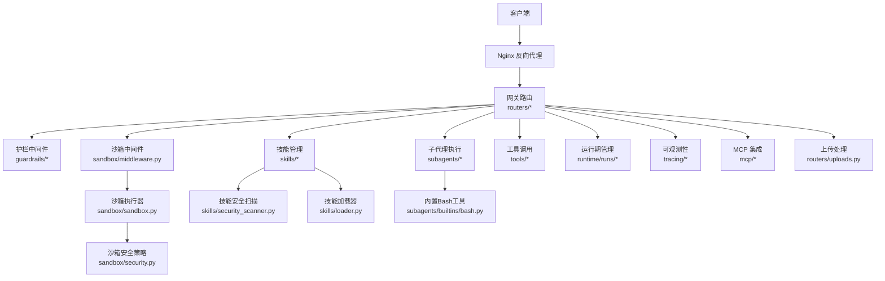
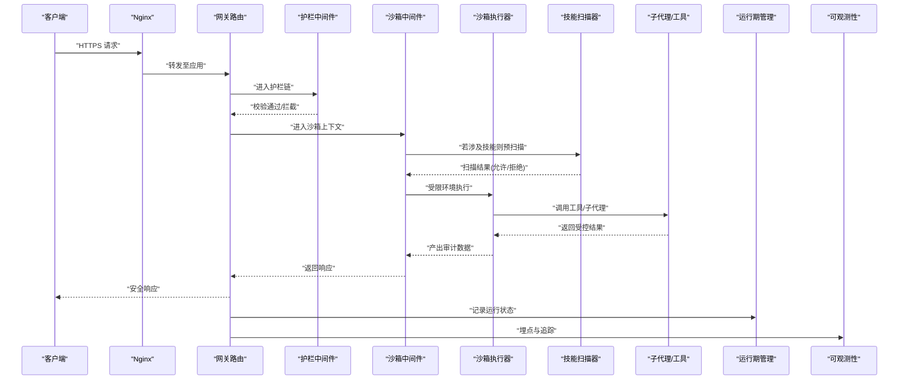
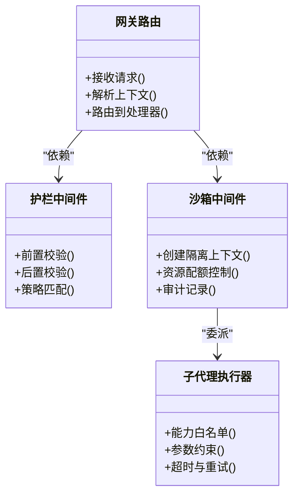
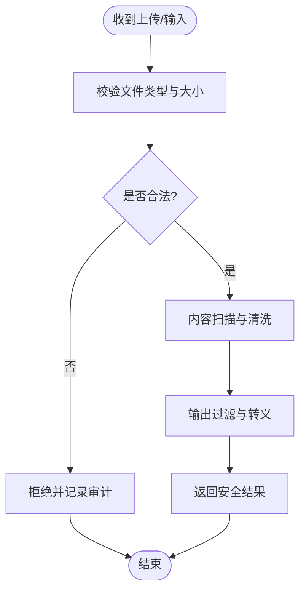
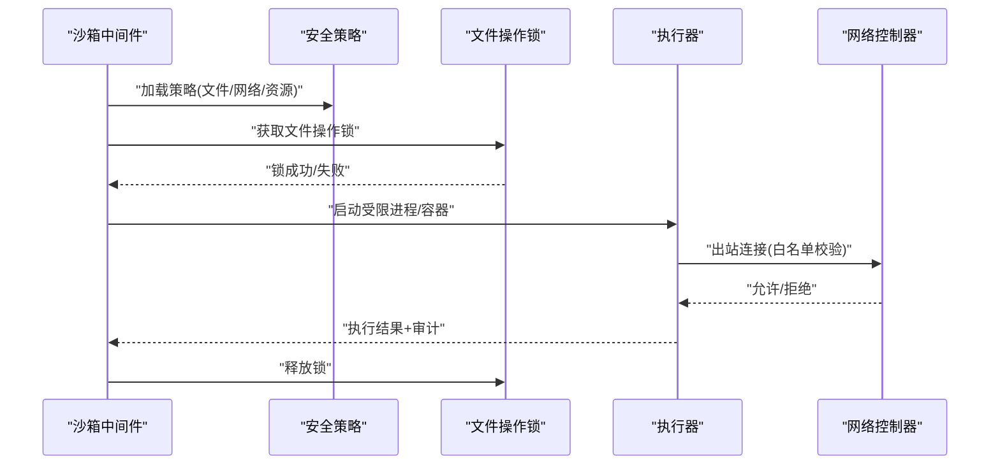
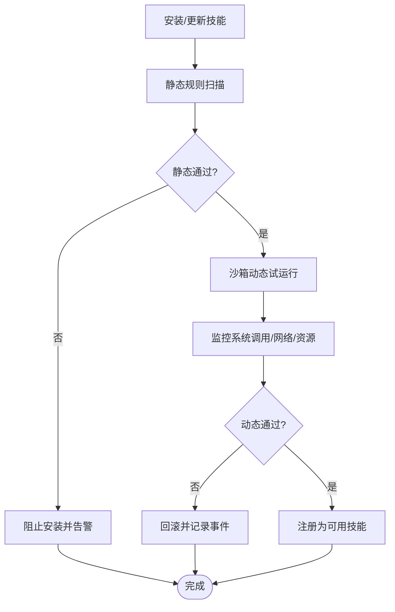
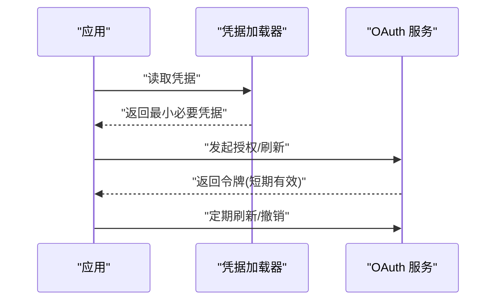
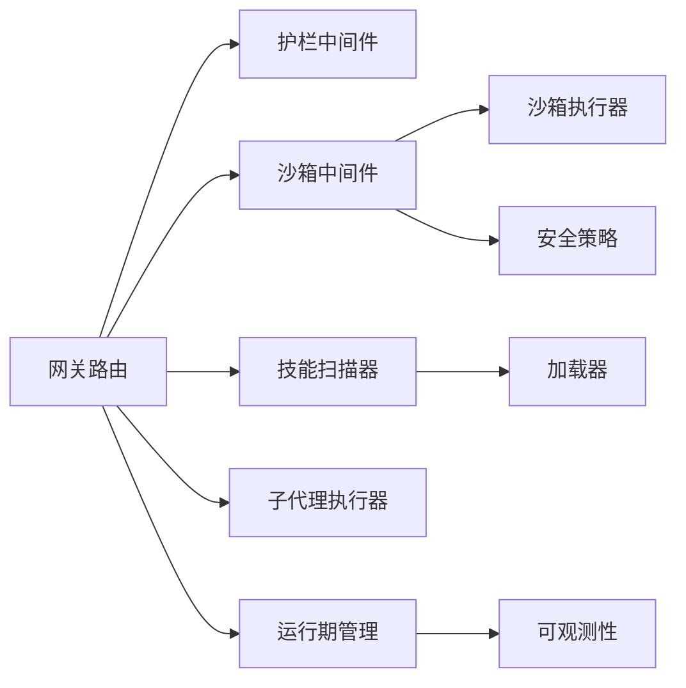

# 安全考虑

<cite>
**本文引用的文件**   
- [backend/app/gateway/routers/agents.py](file://backend/app/gateway/routers/agents.py)
- [backend/app/gateway/routers/skills.py](file://backend/app/gateway/routers/skills.py)
- [backend/app/gateway/routers/uploads.py](file://backend/app/gateway/routers/uploads.py)
- [backend/app/gateway/routers/mcp.py](file://backend/app/gateway/routers/mcp.py)
- [backend/app/gateway/config.py](file://backend/app/gateway/config.py)
- [backend/packages/harness/deerflow/guardrails/__init__.py](file://backend/packages/harness/deerflow/guardrails/__init__.py)
- [backend/packages/harness/deerflow/guardrails/builtin.py](file://backend/packages/harness/deerflow/guardrails/builtin.py)
- [backend/packages/harness/deerflow/guardrails/middleware.py](file://backend/packages/harness/deerflow/guardrails/middleware.py)
- [backend/packages/harness/deerflow/guardrails/provider.py](file://backend/packages/harness/deerflow/guardrails/provider.py)
- [backend/packages/harness/deerflow/sandbox/security.py](file://backend/packages/harness/deerflow/sandbox/security.py)
- [backend/packages/harness/deerflow/sandbox/sandbox.py](file://backend/packages/harness/deerflow/sandbox/sandbox.py)
- [backend/packages/harness/deerflow/sandbox/middleware.py](file://backend/packages/harness/deerflow/sandbox/middleware.py)
- [backend/packages/harness/deerflow/sandbox/tools.py](file://backend/packages/harness/deerflow/sandbox/tools.py)
- [backend/packages/harness/deerflow/sandbox/file_operation_lock.py](file://backend/packages/harness/deerflow/sandbox/file操作锁.py)
- [backend/packages/harness/deerflow/skills/security_scanner.py](file://backend/packages/harness/deerflow/skills/security_scanner.py)
- [backend/packages/harness/deerflow/skills/validation.py](file://backend/packages/harness/deerflow/skills/validation.py)
- [backend/packages/harness/deerflow/skills/loader.py](file://backend/packages/harness/deerflow/skills/loader.py)
- [backend/packages/harness/deerflow/skills/installer.py](file://backend/packages/harness/deerflow/skills/installer.py)
- [backend/packages/harness/deerflow/config/sandbox_config.py](file://backend/packages/harness/deerflow/config/sandbox_config.py)
- [backend/packages/harness/deerflow/config/guardrails_config.py](file://backend/packages/harness/deerflow/config/guardrails_config.py)
- [backend/packages/harness/deerflow/config/tool_config.py](file://backend/packages/harness/deerflow/config/tool_config.py)
- [backend/packages/harness/deerflow/config/skills_config.py](file://backend/packages/harness/deerflow/config/skills_config.py)
- [backend/packages/harness/deerflow/subagents/executor.py](file://backend/packages/harness/deerflow/subagents/executor.py)
- [backend/packages/harness/deerflow/subagents/builtins/bash.py](file://backend/packages/harness/deerflow/subagents/builtins/bash.py)
- [backend/packages/harness/deerflow/models/credential_loader.py](file://backend/packages/harness/deerflow/models/credential_loader.py)
- [backend/packages/harness/deerflow/mcp/oauth.py](file://backend/packages/harness/deerflow/mcp/oauth.py)
- [backend/packages/harness/deerflow/runtime/runs/manager.py](file://backend/packages/harness/deerflow/runtime/runs/manager.py)
- [backend/packages/harness/deerflow/tracing/factory.py](file://backend/packages/harness/deerflow/tracing/factory.py)
- [docker/nginx/nginx.conf](file://docker/nginx/nginx.conf)
- [SECURITY.md](file://SECURITY.md)
</cite>

## 目录
1. [简介](#简介)
2. [项目结构](#项目结构)
3. [核心组件](#核心组件)
4. [架构总览](#架构总览)
5. [详细组件分析](#详细组件分析)
6. [依赖分析](#依赖分析)
7. [性能考虑](#性能考虑)
8. [故障排查指南](#故障排查指南)
9. [结论](#结论)
10. [附录](#附录)

## 简介
本文件聚焦 DeerFlow 的安全设计与实现，围绕多层防护、零信任原则、访问控制、输入验证与输出过滤、沙箱隔离、技能安全扫描、配置最佳实践、审计与漏洞扫描、以及事件应急响应进行系统化说明。文档面向开发者与安全工程师，既提供高层架构视角，也给出代码级定位与流程图示，便于落地实施与持续改进。

## 项目结构
DeerFlow 后端采用网关路由 + 领域包（harness）的分层组织：
- 网关层负责 HTTP 路由、鉴权上下文注入、请求校验与响应封装。
- 领域包 harness 包含代理编排、中间件链、沙箱执行环境、技能加载与扫描、工具与子代理执行、凭据与模型接入、运行时管理与可观测性。
- 部署侧通过 Nginx 作为反向代理，统一入口与基础安全策略。

图示来源
- [backend/app/gateway/routers/agents.py](file://backend/app/gateway/routers/agents.py)
- [backend/app/gateway/routers/skills.py](file://backend/app/gateway/routers/skills.py)
- [backend/app/gateway/routers/uploads.py](file://backend/app/gateway/routers/uploads.py)
- [backend/app/gateway/routers/mcp.py](file://backend/app/gateway/routers/mcp.py)
- [backend/packages/harness/deerflow/guardrails/middleware.py](file://backend/packages/harness/deerflow/guardrails/middleware.py)
- [backend/packages/harness/deerflow/sandbox/middleware.py](file://backend/packages/harness/deerflow/sandbox/middleware.py)
- [backend/packages/harness/deerflow/sandbox/sandbox.py](file://backend/packages/harness/deerflow/sandbox/sandbox.py)
- [backend/packages/harness/deerflow/sandbox/security.py](file://backend/packages/harness/deerflow/sandbox/security.py)
- [backend/packages/harness/deerflow/skills/security_scanner.py](file://backend/packages/harness/deerflow/skills/security_scanner.py)
- [backend/packages/harness/deerflow/skills/loader.py](file://backend/packages/harness/deerflow/skills/loader.py)
- [backend/packages/harness/deerflow/subagents/executor.py](file://backend/packages/harness/deerflow/subagents/executor.py)
- [backend/packages/harness/deerflow/subagents/builtins/bash.py](file://backend/packages/harness/deerflow/subagents/builtins/bash.py)
- [backend/packages/harness/deerflow/runtime/runs/manager.py](file://backend/packages/harness/deerflow/runtime/runs/manager.py)
- [backend/packages/harness/deerflow/tracing/factory.py](file://backend/packages/harness/deerflow/tracing/factory.py)
- [docker/nginx/nginx.conf](file://docker/nginx/nginx.conf)

章节来源
- [backend/app/gateway/routers/agents.py](file://backend/app/gateway/routers/agents.py)
- [backend/app/gateway/routers/skills.py](file://backend/app/gateway/routers/skills.py)
- [backend/app/gateway/routers/uploads.py](file://backend/app/gateway/routers/uploads.py)
- [backend/app/gateway/routers/mcp.py](file://backend/app/gateway/routers/mcp.py)
- [docker/nginx/nginx.conf](file://docker/nginx/nginx.conf)

## 核心组件
- 护栏（Guardrails）：在代理执行前后对输入/输出进行策略检查与拦截，支持内置规则与可扩展提供者。
- 沙箱（Sandbox）：为工具与子代理提供进程/容器级隔离，限制文件系统、网络与资源使用，并记录审计日志。
- 技能安全扫描（Skills Security Scanner）：在安装/加载阶段对技能脚本与模板进行静态分析与动态检测，识别恶意模式与高风险行为。
- 上传与附件处理：对用户上传的文件类型、大小、内容进行校验与清洗，防止注入与XSS。
- 子代理与工具：对危险能力（如 Bash）进行白名单与参数约束，结合沙箱执行。
- 凭据与OAuth：集中管理密钥与令牌，最小权限与按需暴露。
- 可观测性与审计：贯穿请求链路的关键事件埋点与追踪。

章节来源
- [backend/packages/harness/deerflow/guardrails/builtin.py](file://backend/packages/harness/deerflow/guardrails/builtin.py)
- [backend/packages/harness/deerflow/guardrails/middleware.py](file://backend/packages/harness/deerflow/guardrails/middleware.py)
- [backend/packages/harness/deerflow/sandbox/middleware.py](file://backend/packages/harness/deerflow/sandbox/middleware.py)
- [backend/packages/harness/deerflow/sandbox/security.py](file://backend/packages/harness/deerflow/sandbox/security.py)
- [backend/packages/harness/deerflow/skills/security_scanner.py](file://backend/packages/harness/deerflow/skills/security_scanner.py)
- [backend/app/gateway/routers/uploads.py](file://backend/app/gateway/routers/uploads.py)
- [backend/packages/harness/deerflow/subagents/builtins/bash.py](file://backend/packages/harness/deerflow/subagents/builtins/bash.py)
- [backend/packages/harness/deerflow/models/credential_loader.py](file://backend/packages/harness/deerflow/models/credential_loader.py)
- [backend/packages/harness/deerflow/tracing/factory.py](file://backend/packages/harness/deerflow/tracing/factory.py)

## 架构总览
下图展示从网关到执行环境的端到端安全路径，体现“默认拒绝、最小权限、持续验证”的零信任理念。

图示来源
- [backend/app/gateway/routers/agents.py](file://backend/app/gateway/routers/agents.py)
- [backend/packages/harness/deerflow/guardrails/middleware.py](file://backend/packages/harness/deerflow/guardrails/middleware.py)
- [backend/packages/harness/deerflow/sandbox/middleware.py](file://backend/packages/harness/deerflow/sandbox/middleware.py)
- [backend/packages/harness/deerflow/sandbox/sandbox.py](file://backend/packages/harness/deerflow/sandbox/sandbox.py)
- [backend/packages/harness/deerflow/skills/security_scanner.py](file://backend/packages/harness/deerflow/skills/security_scanner.py)
- [backend/packages/harness/deerflow/subagents/executor.py](file://backend/packages/harness/deerflow/subagents/executor.py)
- [backend/packages/harness/deerflow/runtime/runs/manager.py](file://backend/packages/harness/deerflow/runtime/runs/manager.py)
- [backend/packages/harness/deerflow/tracing/factory.py](file://backend/packages/harness/deerflow/tracing/factory.py)
- [docker/nginx/nginx.conf](file://docker/nginx/nginx.conf)

## 详细组件分析

### 访问控制与零信任
- 网关层统一入口，强制 HTTPS、限流与基础认证前置；内部服务间调用需携带可信凭证。
- 护栏中间件在每次代理执行前校验上下文（用户身份、租户、会话），并在输出阶段进行二次校验，遵循“永不信任、始终验证”。
- 子代理与工具调用需显式授权，按角色/工作区粒度控制可用能力集合。

图示来源
- [backend/app/gateway/routers/agents.py](file://backend/app/gateway/routers/agents.py)
- [backend/packages/harness/deerflow/guardrails/middleware.py](file://backend/packages/harness/deerflow/guardrails/middleware.py)
- [backend/packages/harness/deerflow/sandbox/middleware.py](file://backend/packages/harness/deerflow/sandbox/middleware.py)
- [backend/packages/harness/deerflow/subagents/executor.py](file://backend/packages/harness/deerflow/subagents/executor.py)

章节来源
- [backend/app/gateway/routers/agents.py](file://backend/app/gateway/routers/agents.py)
- [backend/packages/harness/deerflow/guardrails/middleware.py](file://backend/packages/harness/deerflow/guardrails/middleware.py)
- [backend/packages/harness/deerflow/sandbox/middleware.py](file://backend/packages/harness/deerflow/sandbox/middleware.py)
- [backend/packages/harness/deerflow/subagents/executor.py](file://backend/packages/harness/deerflow/subagents/executor.py)

### 输入验证与输出过滤
- 上传路由对文件类型、大小、扩展名与内容头进行严格校验，并对文本类内容做转义与清洗，降低注入与XSS风险。
- 护栏内置规则可对提示词与模型输出进行敏感信息检测、越权指令识别与异常模式拦截。
- 输出侧统一编码与渲染策略，避免将不可信内容直接注入前端模板或脚本上下文。

图示来源
- [backend/app/gateway/routers/uploads.py](file://backend/app/gateway/routers/uploads.py)
- [backend/packages/harness/deerflow/guardrails/builtin.py](file://backend/packages/harness/deerflow/guardrails/builtin.py)
- [backend/packages/harness/deerflow/guardrails/middleware.py](file://backend/packages/harness/deerflow/guardrails/middleware.py)

章节来源
- [backend/app/gateway/routers/uploads.py](file://backend/app/gateway/routers/uploads.py)
- [backend/packages/harness/deerflow/guardrails/builtin.py](file://backend/packages/harness/deerflow/guardrails/builtin.py)
- [backend/packages/harness/deerflow/guardrails/middleware.py](file://backend/packages/harness/deerflow/guardrails/middleware.py)

### 沙箱安全模型（进程隔离、资源限制、网络控制）
- 沙箱中间件在工具与子代理执行前创建隔离上下文，设置 CPU/内存/IO 配额与超时。
- 沙箱安全策略定义允许的系统调用、文件路径白名单、网络域名白名单与端口限制。
- 文件操作锁用于并发场景下的原子性与一致性保护，避免竞态条件导致的越权写入。
- 内置 Bash 工具仅允许受限命令集与参数格式，所有执行均在沙箱内完成并留存审计日志。

图示来源
- [backend/packages/harness/deerflow/sandbox/middleware.py](file://backend/packages/harness/deerflow/sandbox/middleware.py)
- [backend/packages/harness/deerflow/sandbox/security.py](file://backend/packages/harness/deerflow/sandbox/security.py)
- [backend/packages/harness/deerflow/sandbox/file_operation_lock.py](file://backend/packages/harness/deerflow/sandbox/file_operation_lock.py)
- [backend/packages/harness/deerflow/subagents/builtins/bash.py](file://backend/packages/harness/deerflow/subagents/builtins/bash.py)

章节来源
- [backend/packages/harness/deerflow/sandbox/middleware.py](file://backend/packages/harness/deerflow/sandbox/middleware.py)
- [backend/packages/harness/deerflow/sandbox/security.py](file://backend/packages/harness/deerflow/sandbox/security.py)
- [backend/packages/harness/deerflow/sandbox/file_operation_lock.py](file://backend/packages/harness/deerflow/sandbox/file_operation_lock.py)
- [backend/packages/harness/deerflow/subagents/builtins/bash.py](file://backend/packages/harness/deerflow/subagents/builtins/bash.py)

### 技能安全扫描机制（静态分析、动态检测、恶意代码识别）
- 安装与加载阶段触发安全扫描：对脚本、模板与依赖清单进行静态规则匹配（危险函数、外部库黑名单、硬编码凭据等）。
- 动态检测：在沙箱中试运行关键脚本，监控系统调用、网络访问与资源消耗，发现异常行为。
- 扫描结果纳入技能注册表，未通过校验的技能禁止启用；已上线技能支持热更新与回滚。

图示来源
- [backend/packages/harness/deerflow/skills/security_scanner.py](file://backend/packages/harness/deerflow/skills/security_scanner.py)
- [backend/packages/harness/deerflow/skills/loader.py](file://backend/packages/harness/deerflow/skills/loader.py)
- [backend/packages/harness/deerflow/skills/installer.py](file://backend/packages/harness/deerflow/skills/installer.py)

章节来源
- [backend/packages/harness/deerflow/skills/security_scanner.py](file://backend/packages/harness/deerflow/skills/security_scanner.py)
- [backend/packages/harness/deerflow/skills/loader.py](file://backend/packages/harness/deerflow/skills/loader.py)
- [backend/packages/harness/deerflow/skills/installer.py](file://backend/packages/harness/deerflow/skills/installer.py)

### 凭据与 OAuth 管理
- 凭据加载器统一管理 API Key、Token 与证书，支持环境变量与加密存储，最小化暴露面。
- MCP OAuth 流程遵循标准协议，服务端校验授权码、刷新令牌与回调域，确保第三方集成安全。

图示来源
- [backend/packages/harness/deerflow/models/credential_loader.py](file://backend/packages/harness/deerflow/models/credential_loader.py)
- [backend/packages/harness/deerflow/mcp/oauth.py](file://backend/packages/harness/deerflow/mcp/oauth.py)

章节来源
- [backend/packages/harness/deerflow/models/credential_loader.py](file://backend/packages/harness/deerflow/models/credential_loader.py)
- [backend/packages/harness/deerflow/mcp/oauth.py](file://backend/packages/harness/deerflow/mcp/oauth.py)

### 网关与反向代理安全
- Nginx 统一入口，强制 HTTPS、HSTS、速率限制、请求体大小限制与基础访问控制。
- 网关路由对上游服务进行鉴权与上下文透传，避免横向移动。

章节来源
- [docker/nginx/nginx.conf](file://docker/nginx/nginx.conf)
- [backend/app/gateway/routers/agents.py](file://backend/app/gateway/routers/agents.py)

## 依赖分析
- 低耦合高内聚：网关仅依赖中间件与领域服务接口；沙箱与护栏以策略驱动，易于替换与扩展。
- 关键依赖关系：
  - 网关 → 护栏/沙箱中间件 → 执行器/工具
  - 技能模块 → 扫描器/加载器/安装器
  - 运行期管理 → 可观测性工厂
- 潜在循环依赖规避：通过中间件与接口抽象解耦，避免直接跨层调用。

图示来源
- [backend/app/gateway/routers/agents.py](file://backend/app/gateway/routers/agents.py)
- [backend/packages/harness/deerflow/guardrails/middleware.py](file://backend/packages/harness/deerflow/guardrails/middleware.py)
- [backend/packages/harness/deerflow/sandbox/middleware.py](file://backend/packages/harness/deerflow/sandbox/middleware.py)
- [backend/packages/harness/deerflow/sandbox/security.py](file://backend/packages/harness/deerflow/sandbox/security.py)
- [backend/packages/harness/deerflow/skills/security_scanner.py](file://backend/packages/harness/deerflow/skills/security_scanner.py)
- [backend/packages/harness/deerflow/skills/loader.py](file://backend/packages/harness/deerflow/skills/loader.py)
- [backend/packages/harness/deerflow/subagents/executor.py](file://backend/packages/harness/deerflow/subagents/executor.py)
- [backend/packages/harness/deerflow/runtime/runs/manager.py](file://backend/packages/harness/deerflow/runtime/runs/manager.py)
- [backend/packages/harness/deerflow/tracing/factory.py](file://backend/packages/harness/deerflow/tracing/factory.py)

章节来源
- [backend/app/gateway/routers/agents.py](file://backend/app/gateway/routers/agents.py)
- [backend/packages/harness/deerflow/guardrails/middleware.py](file://backend/packages/harness/deerflow/guardrails/middleware.py)
- [backend/packages/harness/deerflow/sandbox/middleware.py](file://backend/packages/harness/deerflow/sandbox/middleware.py)
- [backend/packages/harness/deerflow/sandbox/security.py](file://backend/packages/harness/deerflow/sandbox/security.py)
- [backend/packages/harness/deerflow/skills/security_scanner.py](file://backend/packages/harness/deerflow/skills/security_scanner.py)
- [backend/packages/harness/deerflow/skills/loader.py](file://backend/packages/harness/deerflow/skills/loader.py)
- [backend/packages/harness/deerflow/subagents/executor.py](file://backend/packages/harness/deerflow/subagents/executor.py)
- [backend/packages/harness/deerflow/runtime/runs/manager.py](file://backend/packages/harness/deerflow/runtime/runs/manager.py)
- [backend/packages/harness/deerflow/tracing/factory.py](file://backend/packages/harness/deerflow/tracing/factory.py)

## 性能考虑
- 沙箱资源配额与超时：合理设置 CPU/内存/IO 上限与执行时限，避免长尾任务拖垮系统。
- 护栏规则优化：将高频规则下沉至本地缓存，减少远程策略查询开销。
- 技能扫描并行化：对多技能批量安装时采用并发扫描与去重，缩短冷启动时间。
- 上传与清洗流水线：大文件分块校验与流式处理，降低峰值内存占用。

[本节为通用指导，不直接分析具体文件]

## 故障排查指南
- 常见拦截原因：
  - 护栏命中敏感词或越权指令，导致请求被拒。
  - 沙箱网络/文件访问不在白名单内，执行失败。
  - 技能静态扫描检测到危险模式，安装被阻断。
- 定位步骤：
  - 查看网关与护栏日志，确认拦截规则与上下文。
  - 检查沙箱审计日志，核对系统调用与网络访问。
  - 审查技能扫描报告，修复高危脚本或调整白名单。
- 恢复建议：
  - 更新策略与白名单，必要时灰度发布。
  - 对误报规则进行回归测试，完善用例覆盖。

章节来源
- [backend/packages/harness/deerflow/guardrails/middleware.py](file://backend/packages/harness/deerflow/guardrails/middleware.py)
- [backend/packages/harness/deerflow/sandbox/middleware.py](file://backend/packages/harness/deerflow/sandbox/middleware.py)
- [backend/packages/harness/deerflow/skills/security_scanner.py](file://backend/packages/harness/deerflow/skills/security_scanner.py)

## 结论
DeerFlow 通过网关前置校验、护栏策略、沙箱隔离、技能安全扫描与完善的审计追踪，构建了覆盖输入、执行、输出全生命周期的多层安全防护体系。配合零信任原则与最小权限模型，可有效抵御注入、XSS、越权与恶意代码等威胁。建议在生产环境中持续强化策略配置、自动化扫描与事件响应流程，确保安全基线随业务演进不断升级。

[本节为总结性内容，不直接分析具体文件]

## 附录

### 安全配置最佳实践与合规要求
- 强制 HTTPS 与 HSTS，关闭不必要的 HTTP 方法。
- 限制请求体大小与速率，启用 IP 白名单与地域限制。
- 凭据最小化暴露，使用短期令牌与自动轮换。
- 沙箱网络与文件系统白名单最小化，禁用非必要系统调用。
- 技能安装必须通过扫描与审批流程，保留版本与变更审计。
- 符合企业合规要求（如数据脱敏、访问留痕、定期渗透测试）。

章节来源
- [docker/nginx/nginx.conf](file://docker/nginx/nginx.conf)
- [backend/packages/harness/deerflow/config/sandbox_config.py](file://backend/packages/harness/deerflow/config/sandbox_config.py)
- [backend/packages/harness/deerflow/config/guardrails_config.py](file://backend/packages/harness/deerflow/config/guardrails_config.py)
- [backend/packages/harness/deerflow/config/tool_config.py](file://backend/packages/harness/deerflow/config/tool_config.py)
- [backend/packages/harness/deerflow/config/skills_config.py](file://backend/packages/harness/deerflow/config/skills_config.py)

### 安全审计与漏洞扫描方法
- 审计维度：网关访问、护栏拦截、沙箱执行、技能安装、凭据使用、模型调用。
- 扫描方式：静态代码分析、依赖漏洞扫描、沙箱动态行为监测、渗透测试。
- 指标与告警：拦截率、误报率、执行超时、资源超限、异常网络访问。

章节来源
- [backend/packages/harness/deerflow/tracing/factory.py](file://backend/packages/harness/deerflow/tracing/factory.py)
- [backend/packages/harness/deerflow/runtime/runs/manager.py](file://backend/packages/harness/deerflow/runtime/runs/manager.py)

### 安全事件应急响应与修复流程
- 事件分级：影响范围、数据敏感度、攻击向量与可利用性。
- 处置步骤：隔离受影响实例、回滚可疑变更、修补策略与白名单、通知相关方。
- 复盘改进：根因分析、策略加固、自动化回归测试与演练。

章节来源
- [SECURITY.md](file://SECURITY.md)