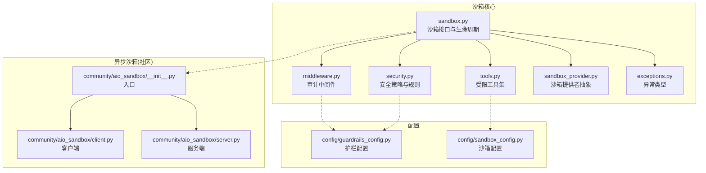
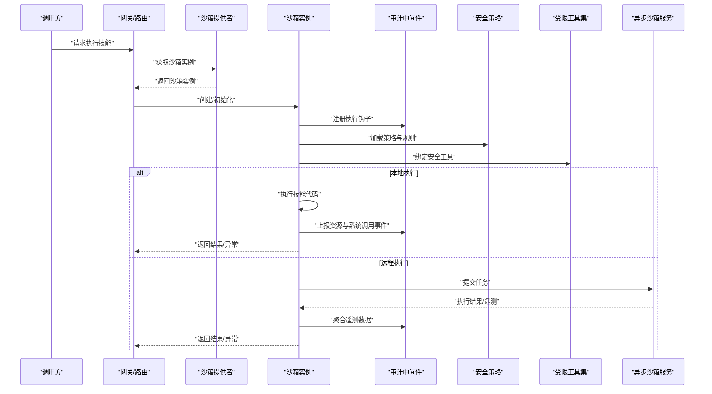
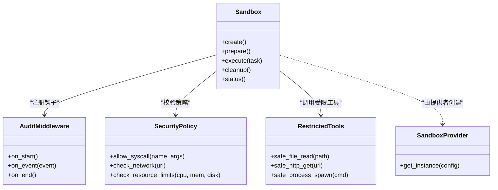
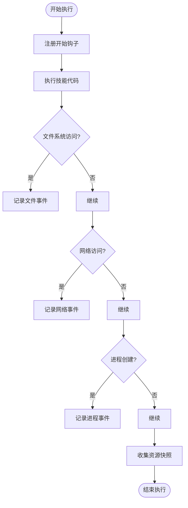
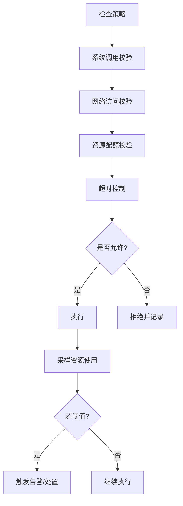
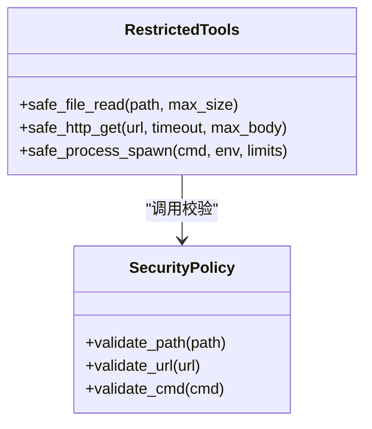
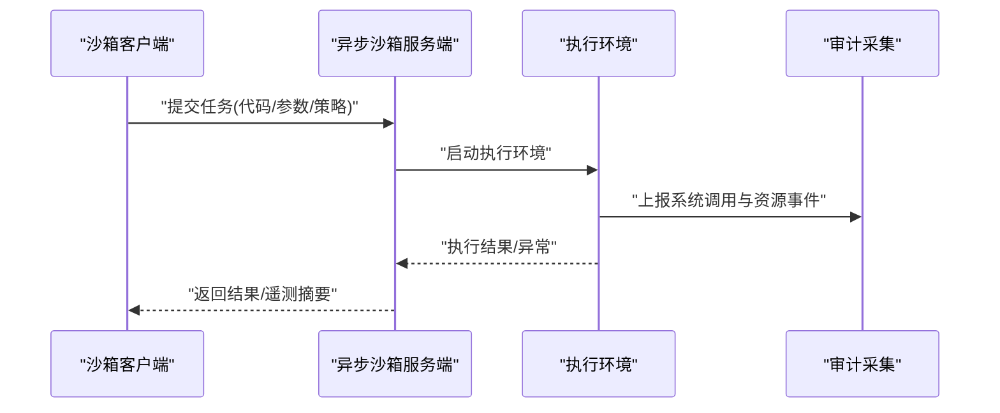
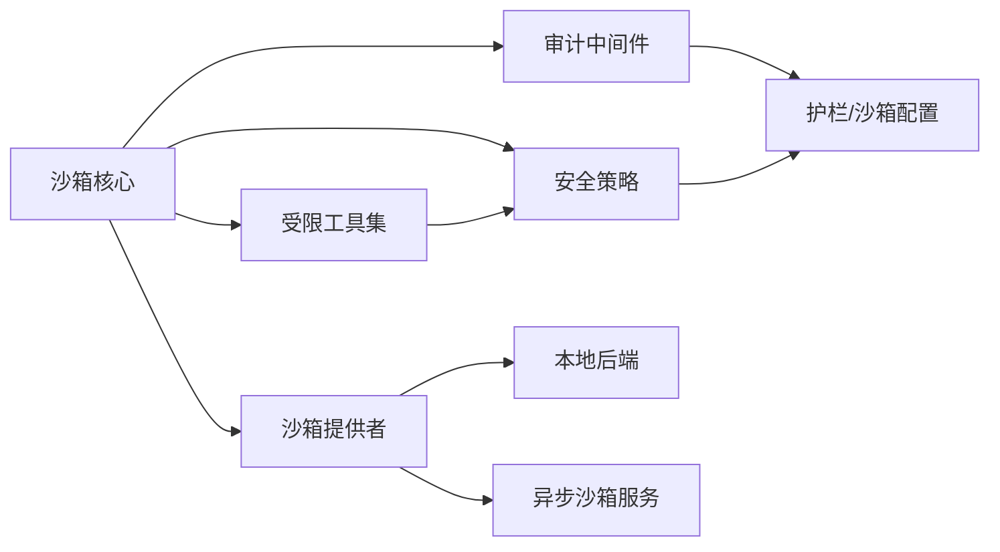

# 动态行为检测

<cite>
**本文引用的文件**
- [sandbox.py](file://backend/packages/harness/deerflow/sandbox/sandbox.py)
- [middleware.py](file://backend/packages/harness/deerflow/sandbox/middleware.py)
- [security.py](file://backend/packages/harness/deerflow/sandbox/security.py)
- [tools.py](file://backend/packages/harness/deerflow/sandbox/tools.py)
- [sandbox_provider.py](file://backend/packages/harness/deerflow/sandbox/sandbox_provider.py)
- [exceptions.py](file://backend/packages/harness/deerflow/sandbox/exceptions.py)
- [aio_sandbox/__init__.py](file://backend/packages/harness/deerflow/community/aio_sandbox/__init__.py)
- [aio_sandbox/client.py](file://backend/packages/harness/deerflow/community/aio_sandbox/client.py)
- [aio_sandbox/server.py](file://backend/packages/harness/deerflow/community/aio_sandbox/server.py)
- [test_aio_sandbox.py](file://backend/tests/test_aio_sandbox.py)
- [test_aio_sandbox_local_backend.py](file://backend/tests/test_aio_sandbox_local_backend.py)
- [test_aio_sandbox_provider.py](file://backend/tests/test_aio_sandbox_provider.py)
- [test_docker_sandbox_mode_detection.py](file://backend/tests/test_docker_sandbox_mode_detection.py)
- [test_sandbox_audit_middleware.py](file://backend/tests/test_sandbox_audit_middleware.py)
- [test_sandbox_tools_security.py](file://backend/tests/test_sandbox_tools_security.py)
- [guardrails_config.py](file://backend/packages/harness/deerflow/config/guardrails_config.py)
- [sandbox_config.py](file://backend/packages/harness/deerflow/config/sandbox_config.py)
</cite>

## 目录
1. [简介](#简介)
2. [项目结构](#项目结构)
3. [核心组件](#核心组件)
4. [架构总览](#架构总览)
5. [详细组件分析](#详细组件分析)
6. [依赖关系分析](#依赖关系分析)
7. [性能考量](#性能考量)
8. [故障排查指南](#故障排查指南)
9. [结论](#结论)
10. [附录](#附录)

## 简介
本文件面向DeerFlow技能（Skill）的动态行为检测能力，聚焦运行时监控、系统调用拦截、资源使用分析、沙箱执行测试与行为模式识别，并给出可操作的配置选项。文档旨在帮助读者理解：
- 如何在隔离环境中安全地执行技能代码
- 如何对进程、内存、CPU、磁盘和网络进行细粒度监控
- 如何通过中间件和工具层实现系统调用拦截与审计
- 如何基于阈值与策略触发告警与处置动作

## 项目结构
与动态行为检测相关的核心代码位于后端包中，主要涉及沙箱运行、中间件审计、安全策略与配置等模块；同时社区版提供异步沙箱客户端与服务端用于远程或容器化执行。

图表来源
- [sandbox.py](file://backend/packages/harness/deerflow/sandbox/sandbox.py)
- [middleware.py](file://backend/packages/harness/deerflow/sandbox/middleware.py)
- [security.py](file://backend/packages/harness/deerflow/sandbox/security.py)
- [tools.py](file://backend/packages/harness/deerflow/sandbox/tools.py)
- [sandbox_provider.py](file://backend/packages/harness/deerflow/sandbox/sandbox_provider.py)
- [exceptions.py](file://backend/packages/harness/deerflow/sandbox/exceptions.py)
- [aio_sandbox/__init__.py](file://backend/packages/harness/deerflow/community/aio_sandbox/__init__.py)
- [aio_sandbox/client.py](file://backend/packages/harness/deerflow/community/aio_sandbox/client.py)
- [aio_sandbox/server.py](file://backend/packages/harness/deerflow/community/aio_sandbox/server.py)
- [guardrails_config.py](file://backend/packages/harness/deerflow/config/guardrails_config.py)
- [sandbox_config.py](file://backend/packages/harness/deerflow/config/sandbox_config.py)

章节来源
- [sandbox.py](file://backend/packages/harness/deerflow/sandbox/sandbox.py)
- [middleware.py](file://backend/packages/harness/deerflow/sandbox/middleware.py)
- [security.py](file://backend/packages/harness/deerflow/sandbox/security.py)
- [tools.py](file://backend/packages/harness/deerflow/sandbox/tools.py)
- [sandbox_provider.py](file://backend/packages/harness/deerflow/sandbox/sandbox_provider.py)
- [exceptions.py](file://backend/packages/harness/deerflow/sandbox/exceptions.py)
- [aio_sandbox/__init__.py](file://backend/packages/harness/deerflow/community/aio_sandbox/__init__.py)
- [aio_sandbox/client.py](file://backend/packages/harness/deerflow/community/aio_sandbox/client.py)
- [aio_sandbox/server.py](file://backend/packages/harness/deerflow/community/aio_sandbox/server.py)
- [guardrails_config.py](file://backend/packages/harness/deerflow/config/guardrails_config.py)
- [sandbox_config.py](file://backend/packages/harness/deerflow/config/sandbox_config.py)

## 核心组件
- 沙箱接口与生命周期：定义技能的创建、启动、执行、资源回收与状态查询的统一接口，支撑本地与远程（异步沙箱）两种执行路径。
- 审计中间件：在技能执行前后注入监控点，采集进程、内存、CPU、网络与文件系统访问事件，形成可审计的轨迹。
- 安全策略：集中管理白名单/黑名单、系统调用限制、网络访问控制、超时与配额等规则。
- 受限工具集：为技能暴露安全的内置工具，屏蔽危险操作，统一输出格式与错误码。
- 沙箱提供者：抽象不同后端（本地、Docker、Kubernetes等），对外提供一致的沙箱实例。
- 异步沙箱（社区）：通过独立的客户端与服务端协议，将技能执行迁移到独立进程或容器中，增强隔离性。
- 配置：护栏与沙箱相关配置项，包括监控级别、阈值、告警策略与资源限额。

章节来源
- [sandbox.py](file://backend/packages/harness/deerflow/sandbox/sandbox.py)
- [middleware.py](file://backend/packages/harness/deerflow/sandbox/middleware.py)
- [security.py](file://backend/packages/harness/deerflow/sandbox/security.py)
- [tools.py](file://backend/packages/harness/deerflow/sandbox/tools.py)
- [sandbox_provider.py](file://backend/packages/harness/deerflow/sandbox/sandbox_provider.py)
- [aio_sandbox/__init__.py](file://backend/packages/harness/deerflow/community/aio_sandbox/__init__.py)
- [aio_sandbox/client.py](file://backend/packages/harness/deerflow/community/aio_sandbox/client.py)
- [aio_sandbox/server.py](file://backend/packages/harness/deerflow/community/aio_sandbox/server.py)
- [guardrails_config.py](file://backend/packages/harness/deerflow/config/guardrails_config.py)
- [sandbox_config.py](file://backend/packages/harness/deerflow/config/sandbox_config.py)

## 架构总览
下图展示了从网关到沙箱执行的端到端流程，以及审计与安全策略的介入点。

图表来源
- [sandbox.py](file://backend/packages/harness/deerflow/sandbox/sandbox.py)
- [middleware.py](file://backend/packages/harness/deerflow/sandbox/middleware.py)
- [security.py](file://backend/packages/harness/deerflow/sandbox/security.py)
- [tools.py](file://backend/packages/harness/deerflow/sandbox/tools.py)
- [sandbox_provider.py](file://backend/packages/harness/deerflow/sandbox/sandbox_provider.py)
- [aio_sandbox/client.py](file://backend/packages/harness/deerflow/community/aio_sandbox/client.py)
- [aio_sandbox/server.py](file://backend/packages/harness/deerflow/community/aio_sandbox/server.py)

## 详细组件分析

### 沙箱接口与生命周期
- 职责
  - 定义统一的沙箱实例生命周期：创建、准备、执行、清理、状态查询。
  - 协调审计中间件与安全策略，确保每次执行都具备可观测性与可控性。
  - 支持本地与远程（异步沙箱）两种执行后端。
- 关键流程
  - 初始化阶段：加载策略、注册钩子、准备工具集。
  - 执行阶段：根据策略限制系统调用、网络访问、资源配额；记录指标与事件。
  - 收尾阶段：清理临时文件、释放资源、汇总审计日志。
- 设计要点
  - 通过提供者抽象解耦具体实现，便于扩展新的后端。
  - 以中间件方式接入监控，避免侵入业务逻辑。
  - 异常类型分层清晰，便于上层统一处理与告警。

图表来源
- [sandbox.py](file://backend/packages/harness/deerflow/sandbox/sandbox.py)
- [middleware.py](file://backend/packages/harness/deerflow/sandbox/middleware.py)
- [security.py](file://backend/packages/harness/deerflow/sandbox/security.py)
- [tools.py](file://backend/packages/harness/deerflow/sandbox/tools.py)
- [sandbox_provider.py](file://backend/packages/harness/deerflow/sandbox/sandbox_provider.py)

章节来源
- [sandbox.py](file://backend/packages/harness/deerflow/sandbox/sandbox.py)
- [sandbox_provider.py](file://backend/packages/harness/deerflow/sandbox/sandbox_provider.py)

### 审计中间件与系统调用拦截
- 职责
  - 在执行生命周期内采集事件：进程创建、文件读写、网络连接、系统调用、资源使用快照。
  - 将事件标准化并持久化，供后续分析与告警使用。
- 拦截范围
  - 文件系统访问：读/写/删除/重命名等。
  - 网络通信：HTTP/HTTPS、DNS解析、套接字连接。
  - 进程创建：子进程、外部命令执行。
  - 资源使用：CPU、内存、磁盘I/O、打开文件数。
- 事件模型
  - 事件包含时间戳、来源、类型、参数摘要、结果与上下文标识。
  - 支持批量上报与去重，降低开销。

图表来源
- [middleware.py](file://backend/packages/harness/deerflow/sandbox/middleware.py)
- [security.py](file://backend/packages/harness/deerflow/sandbox/security.py)

章节来源
- [middleware.py](file://backend/packages/harness/deerflow/sandbox/middleware.py)
- [security.py](file://backend/packages/harness/deerflow/sandbox/security.py)

### 安全策略与资源使用分析
- 策略维度
  - 系统调用白/黑名单：按名称与参数匹配决定是否允许。
  - 网络访问控制：域名/IP白名单、端口限制、协议限制。
  - 资源配额：CPU时间、内存上限、磁盘空间、并发连接数。
  - 超时控制：单任务最大执行时长、IO超时、网络超时。
- 资源使用分析
  - 周期性采样CPU与内存占用，计算峰值与均值。
  - 监控磁盘空间变化，识别异常增长与临时文件堆积。
  - 统计网络连接数与流量，识别异常外联与高频请求。
- 告警与处置
  - 当超过阈值时触发告警，并可自动终止任务、隔离网络或清理临时文件。

图表来源
- [security.py](file://backend/packages/harness/deerflow/sandbox/security.py)
- [guardrails_config.py](file://backend/packages/harness/deerflow/config/guardrails_config.py)
- [sandbox_config.py](file://backend/packages/harness/deerflow/config/sandbox_config.py)

章节来源
- [security.py](file://backend/packages/harness/deerflow/sandbox/security.py)
- [guardrails_config.py](file://backend/packages/harness/deerflow/config/guardrails_config.py)
- [sandbox_config.py](file://backend/packages/harness/deerflow/config/sandbox_config.py)

### 受限工具集
- 目标
  - 为技能提供安全的内置工具，屏蔽危险操作，统一输入输出与错误码。
- 典型工具
  - 安全文件读取：限定路径范围、大小上限、编码校验。
  - 安全HTTP请求：域名白名单、响应体大小限制、超时控制。
  - 安全进程调用：命令白名单、参数过滤、资源限制。
- 错误处理
  - 明确区分权限不足、资源超限、网络失败等错误类型，便于上层定位问题。

图表来源
- [tools.py](file://backend/packages/harness/deerflow/sandbox/tools.py)
- [security.py](file://backend/packages/harness/deerflow/sandbox/security.py)

章节来源
- [tools.py](file://backend/packages/harness/deerflow/sandbox/tools.py)
- [security.py](file://backend/packages/harness/deerflow/sandbox/security.py)

### 异步沙箱（社区）
- 角色分工
  - 客户端：负责提交任务、接收结果与遥测数据。
  - 服务端：负责在独立进程或容器中执行任务，采集资源与系统调用信息。
- 优势
  - 更强的隔离性，适合高风险技能执行。
  - 可扩展至容器编排平台，实现弹性伸缩与多租户隔离。
- 集成方式
  - 通过沙箱提供者选择本地或远程后端。
  - 中间件与策略在服务端与客户端两端协同工作。

图表来源
- [aio_sandbox/client.py](file://backend/packages/harness/deerflow/community/aio_sandbox/client.py)
- [aio_sandbox/server.py](file://backend/packages/harness/deerflow/community/aio_sandbox/server.py)
- [aio_sandbox/__init__.py](file://backend/packages/harness/deerflow/community/aio_sandbox/__init__.py)

章节来源
- [aio_sandbox/client.py](file://backend/packages/harness/deerflow/community/aio_sandbox/client.py)
- [aio_sandbox/server.py](file://backend/packages/harness/deerflow/community/aio_sandbox/server.py)
- [aio_sandbox/__init__.py](file://backend/packages/harness/deerflow/community/aio_sandbox/__init__.py)

### 异常与错误处理
- 异常分层
  - 策略违规：如系统调用被拒、网络访问不在白名单。
  - 资源超限：CPU/内存/磁盘/连接数超过阈值。
  - 执行异常：超时、崩溃、IO错误、序列化失败。
- 处理策略
  - 记录完整上下文与事件链。
  - 根据严重等级决定终止、降级或重试。
  - 向调用方返回结构化错误信息，便于前端展示与自动化处置。

章节来源
- [exceptions.py](file://backend/packages/harness/deerflow/sandbox/exceptions.py)
- [middleware.py](file://backend/packages/harness/deerflow/sandbox/middleware.py)

## 依赖关系分析
- 组件耦合
  - 沙箱核心依赖审计中间件与安全策略，二者通过配置驱动，松耦合。
  - 受限工具集依赖安全策略进行输入校验，避免越权。
  - 异步沙箱通过提供者抽象与核心沙箱解耦，便于替换后端。
- 外部依赖
  - 操作系统API：进程、文件、网络、资源统计。
  - 容器/编排平台（可选）：Docker/Kubernetes，用于更强隔离与弹性。
- 潜在风险
  - 循环依赖：通过模块化与接口抽象避免。
  - 配置漂移：通过配置校验与版本化管理保障一致性。

图表来源
- [sandbox.py](file://backend/packages/harness/deerflow/sandbox/sandbox.py)
- [middleware.py](file://backend/packages/harness/deerflow/sandbox/middleware.py)
- [security.py](file://backend/packages/harness/deerflow/sandbox/security.py)
- [tools.py](file://backend/packages/harness/deerflow/sandbox/tools.py)
- [sandbox_provider.py](file://backend/packages/harness/deerflow/sandbox/sandbox_provider.py)
- [guardrails_config.py](file://backend/packages/harness/deerflow/config/guardrails_config.py)
- [sandbox_config.py](file://backend/packages/harness/deerflow/config/sandbox_config.py)

章节来源
- [sandbox.py](file://backend/packages/harness/deerflow/sandbox/sandbox.py)
- [sandbox_provider.py](file://backend/packages/harness/deerflow/sandbox/sandbox_provider.py)

## 性能考量
- 采样频率与开销
  - 合理设置资源采样间隔，平衡精度与开销。
  - 事件去重与批量化上报，减少I/O压力。
- 超时与熔断
  - 为长耗时任务设置合理超时，避免资源长期占用。
  - 对频繁失败的下游服务启用熔断与退避。
- 资源隔离
  - 优先使用容器或进程级隔离，限制共享资源。
  - 对临时文件与缓存目录进行配额与定期清理。

[本节为通用指导，不直接分析具体文件]

## 故障排查指南
- 常见问题
  - 系统调用被拒：检查策略白名单与参数合法性。
  - 网络访问失败：确认域名/IP白名单与端口限制。
  - 资源超限：调整配额或优化技能代码。
  - 超时：延长超时或拆分任务。
- 定位方法
  - 查看审计事件链，定位首次违规或异常点。
  - 核对配置项与运行时生效值，确认无漂移。
  - 对比本地与远程执行差异，判断是否为环境因素。
- 恢复建议
  - 临时放宽策略并观察，逐步收紧。
  - 清理临时文件与僵尸进程，释放资源。
  - 重启沙箱实例或服务端，恢复稳定态。

章节来源
- [test_sandbox_audit_middleware.py](file://backend/tests/test_sandbox_audit_middleware.py)
- [test_sandbox_tools_security.py](file://backend/tests/test_sandbox_tools_security.py)
- [test_docker_sandbox_mode_detection.py](file://backend/tests/test_docker_sandbox_mode_detection.py)

## 结论
DeerFlow的动态行为检测通过“沙箱+中间件+策略+工具”的组合，实现了从系统调用拦截到资源使用分析的全链路监控。结合异步沙箱与配置化的护栏策略，能够在保证安全性的前提下，灵活适配多种执行环境与业务需求。建议在生产环境中开启全量审计、严格策略与告警联动，持续优化阈值与规则库，提升整体安全性与稳定性。

[本节为总结性内容，不直接分析具体文件]

## 附录

### 动态检测配置选项
- 监控级别
  - 低：仅关键事件与资源快照。
  - 中：增加系统调用与网络访问明细。
  - 高：全量事件与深度遥测。
- 阈值设置
  - CPU：单任务最大CPU时间与峰值占比。
  - 内存：最大RSS与增量阈值。
  - 磁盘：最大写入量与临时文件数量。
  - 网络：最大连接数、域名白名单、响应体大小。
- 告警策略
  - 告警通道：日志、消息队列、Webhook。
  - 严重等级：提示、警告、严重、致命。
  - 处置动作：终止任务、隔离网络、清理临时文件、通知运维。

章节来源
- [guardrails_config.py](file://backend/packages/harness/deerflow/config/guardrails_config.py)
- [sandbox_config.py](file://backend/packages/harness/deerflow/config/sandbox_config.py)

### 行为模式识别
- 可疑行为序列
  - 短时间内大量文件删除与重建。
  - 频繁创建子进程并执行外部命令。
  - 异常外联：非常见域名、非标准端口、大流量上传。
- 异常流量分析
  - 突增的网络请求与异常响应码。
  - DNS解析失败与重试风暴。
- 资源滥用检测
  - CPU/内存持续增长且未回落。
  - 磁盘空间快速耗尽与临时文件堆积。

章节来源
- [middleware.py](file://backend/packages/harness/deerflow/sandbox/middleware.py)
- [security.py](file://backend/packages/harness/deerflow/sandbox/security.py)

### 测试与验证
- 单元测试覆盖
  - 异步沙箱客户端与服务端交互。
  - 沙箱提供者选择与模式检测。
  - 审计中间件事件采集与格式化。
  - 受限工具的安全校验与错误处理。
- 推荐用例
  - 模拟恶意脚本执行，验证拦截与告警。
  - 压测资源使用，验证阈值与熔断。
  - 切换本地与远程后端，验证一致性与性能。

章节来源
- [test_aio_sandbox.py](file://backend/tests/test_aio_sandbox.py)
- [test_aio_sandbox_local_backend.py](file://backend/tests/test_aio_sandbox_local_backend.py)
- [test_aio_sandbox_provider.py](file://backend/tests/test_aio_sandbox_provider.py)
- [test_docker_sandbox_mode_detection.py](file://backend/tests/test_docker_sandbox_mode_detection.py)
- [test_sandbox_audit_middleware.py](file://backend/tests/test_sandbox_audit_middleware.py)
- [test_sandbox_tools_security.py](file://backend/tests/test_sandbox_tools_security.py)