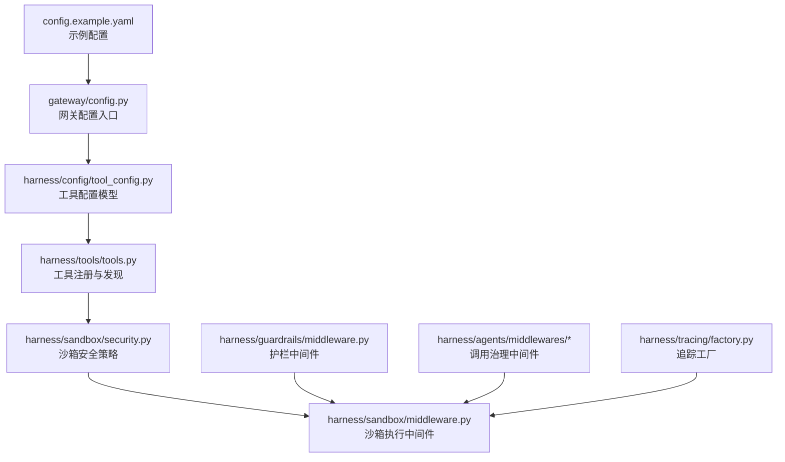
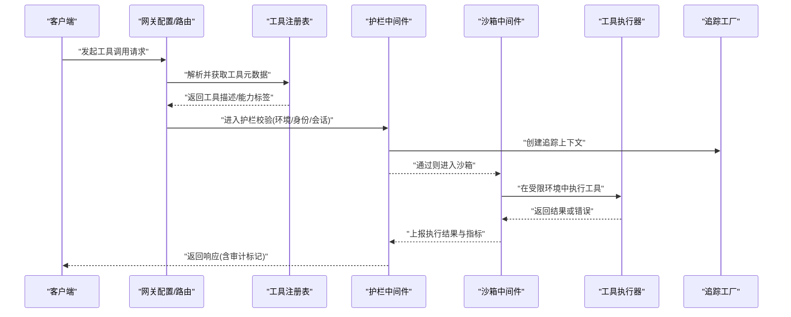
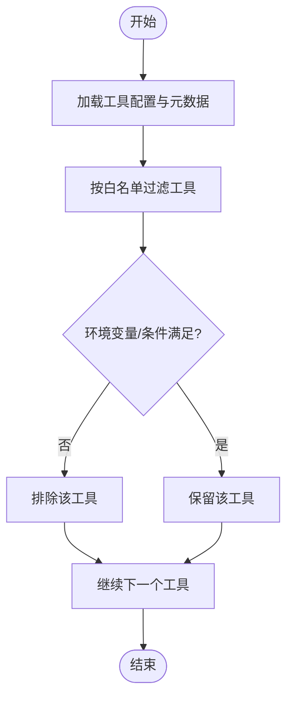
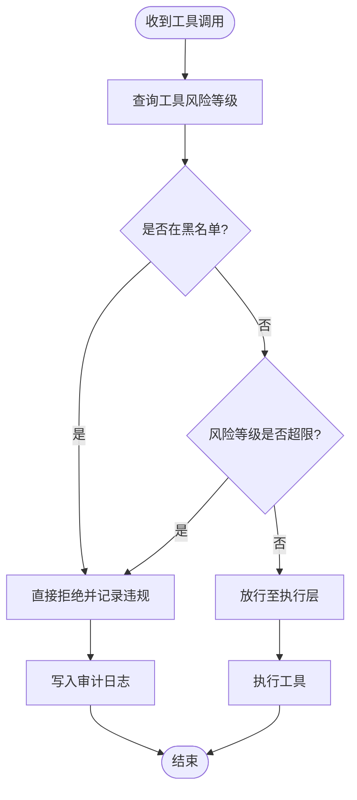
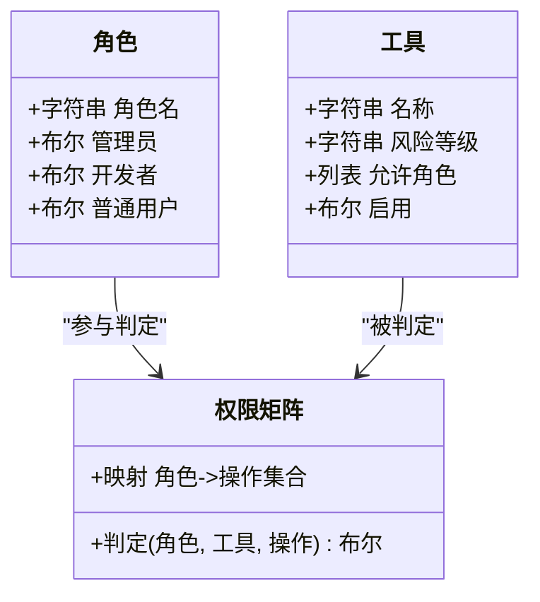
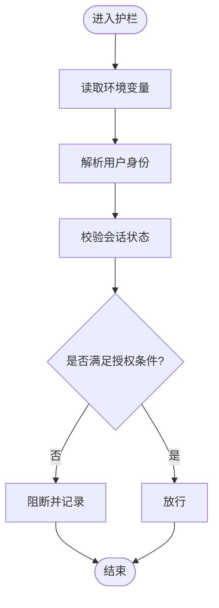
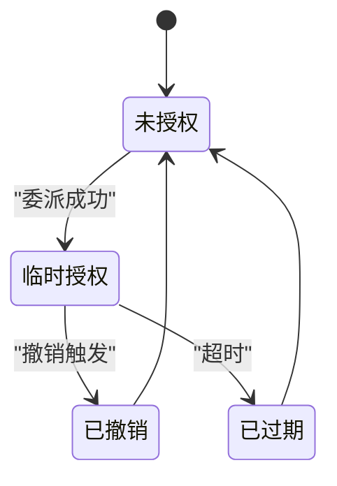
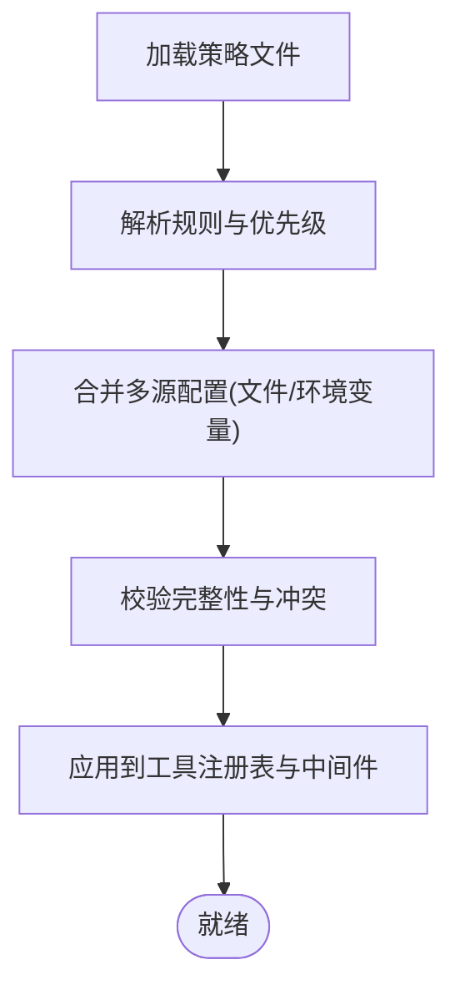
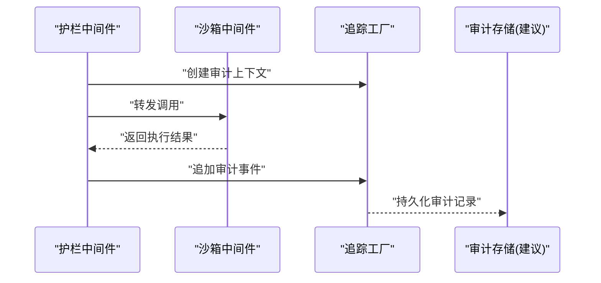
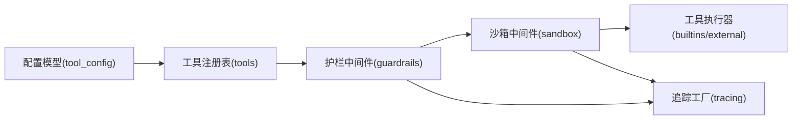

# 工具权限策略

<cite>
**本文引用的文件**   
- [backend/app/gateway/config.py](file://backend/app/gateway/config.py)
- [backend/packages/harness/deerflow/config/tool_config.py](file://backend/packages/harness/deerflow/config/tool_config.py)
- [backend/packages/harness/deerflow/tools/tools.py](file://backend/packages/harness/deerflow/tools/tools.py)
- [backend/packages/harness/deerflow/sandbox/security.py](file://backend/packages/harness/deerflow/sandbox/security.py)
- [backend/packages/harness/deerflow/sandbox/middleware.py](file://backend/packages/harness/deerflow/sandbox/middleware.py)
- [backend/packages/harness/deerflow/guardrails/middleware.py](file://backend/packages/harness/deerflow/guardrails/middleware.py)
- [backend/packages/harness/deerflow/agents/middlewares/dangling_tool_call_middleware.py](file://backend/packages/harness/deerflow/agents/middlewares/dangling_tool_call_middleware.py)
- [backend/packages/harness/deerflow/agents/middlewares/subagent_limit_middleware.py](file://backend/packages/harness/deerflow/agents/middlewares/subagent_limit_middleware.py)
- [backend/packages/harness/deerflow/tracing/factory.py](file://backend/packages/harness/deerflow/tracing/factory.py)
- [config.example.yaml](file://config.example.yaml)
</cite>

## 目录
1. [简介](#简介)
2. [项目结构](#项目结构)
3. [核心组件](#核心组件)
4. [架构总览](#架构总览)
5. [详细组件分析](#详细组件分析)
6. [依赖关系分析](#依赖关系分析)
7. [性能考虑](#性能考虑)
8. [故障排查指南](#故障排查指南)
9. [结论](#结论)
10. [附录](#附录)

## 简介
本文件面向 DeerFlow 的“工具权限策略”，围绕以下目标展开：
- 工具白名单机制：允许的工具列表、条件启用与动态授权
- 工具黑名单管理：禁止工具集合、风险等级分类与自动屏蔽规则
- 权限分级管理：用户角色定义、工具访问控制与操作权限矩阵
- 上下文感知授权：环境变量检查、用户身份验证与会话状态验证
- 权限继承与委派：角色继承链、临时授权与撤销机制
- 权限策略配置：策略文件结构、规则语法与优先级管理
- 权限审计与日志记录：访问日志、违规检测与合规报告

说明：本文基于仓库中现有实现进行梳理，对尚未在代码中显式实现的策略（如细粒度 RBAC、完整审计报表）以“建议与规划”形式给出，便于后续落地。

## 项目结构
与工具权限相关的核心位置集中在后端网关配置、工具加载与沙箱安全中间件、护栏中间件以及追踪工厂等模块。下图展示了与权限策略相关的主要文件及其职责边界。

图表来源
- [backend/app/gateway/config.py](file://backend/app/gateway/config.py)
- [backend/packages/harness/deerflow/config/tool_config.py](file://backend/packages/harness/deerflow/config/tool_config.py)
- [backend/packages/harness/deerflow/tools/tools.py](file://backend/packages/harness/deerflow/tools/tools.py)
- [backend/packages/harness/deerflow/sandbox/security.py](file://backend/packages/harness/deerflow/sandbox/security.py)
- [backend/packages/harness/deerflow/sandbox/middleware.py](file://backend/packages/harness/deerflow/sandbox/middleware.py)
- [backend/packages/harness/deerflow/guardrails/middleware.py](file://backend/packages/harness/deerflow/guardrails/middleware.py)
- [backend/packages/harness/deerflow/tracing/factory.py](file://backend/packages/harness/deerflow/tracing/factory.py)
- [config.example.yaml](file://config.example.yaml)

章节来源
- [backend/app/gateway/config.py](file://backend/app/gateway/config.py)
- [backend/packages/harness/deerflow/config/tool_config.py](file://backend/packages/harness/deerflow/config/tool_config.py)
- [backend/packages/harness/deerflow/tools/tools.py](file://backend/packages/harness/deerflow/tools/tools.py)
- [backend/packages/harness/deerflow/sandbox/security.py](file://backend/packages/harness/deerflow/sandbox/security.py)
- [backend/packages/harness/deerflow/sandbox/middleware.py](file://backend/packages/harness/deerflow/sandbox/middleware.py)
- [backend/packages/harness/deerflow/guardrails/middleware.py](file://backend/packages/harness/deerflow/guardrails/middleware.py)
- [backend/packages/harness/deerflow/tracing/factory.py](file://backend/packages/harness/deerflow/tracing/factory.py)
- [config.example.yaml](file://config.example.yaml)

## 核心组件
- 网关配置层：负责加载全局配置并注入到运行时，是策略生效的入口点之一。
- 工具配置模型：定义工具开关、可见性、参数校验与元数据，支撑白名单/黑名单与条件启用。
- 工具注册与发现：集中注册内置与外部工具，提供按名称查找与过滤能力。
- 沙箱安全与中间件：在执行前对工具调用进行安全检查、资源限制与行为约束。
- 护栏中间件：统一拦截与校验，支持拒绝高风险调用、注入审计标记。
- 调用治理中间件：针对悬空工具调用、子代理限制等进行治理，防止越权或滥用。
- 追踪工厂：为关键路径生成追踪上下文，便于审计与排障。

章节来源
- [backend/app/gateway/config.py](file://backend/app/gateway/config.py)
- [backend/packages/harness/deerflow/config/tool_config.py](file://backend/packages/harness/deerflow/config/tool_config.py)
- [backend/packages/harness/deerflow/tools/tools.py](file://backend/packages/harness/deerflow/tools/tools.py)
- [backend/packages/harness/deerflow/sandbox/security.py](file://backend/packages/harness/deerflow/sandbox/security.py)
- [backend/packages/harness/deerflow/sandbox/middleware.py](file://backend/packages/harness/deerflow/sandbox/middleware.py)
- [backend/packages/harness/deerflow/guardrails/middleware.py](file://backend/packages/harness/deerflow/guardrails/middleware.py)
- [backend/packages/harness/deerflow/agents/middlewares/dangling_tool_call_middleware.py](file://backend/packages/harness/deerflow/agents/middlewares/dangling_tool_call_middleware.py)
- [backend/packages/harness/deerflow/agents/middlewares/subagent_limit_middleware.py](file://backend/packages/harness/deerflow/agents/middlewares/subagent_limit_middleware.py)
- [backend/packages/harness/deerflow/tracing/factory.py](file://backend/packages/harness/deerflow/tracing/factory.py)

## 架构总览
下图展示一次工具调用的端到端流程，包括策略校验、沙箱隔离、护栏拦截与追踪记录。

图表来源
- [backend/app/gateway/config.py](file://backend/app/gateway/config.py)
- [backend/packages/harness/deerflow/tools/tools.py](file://backend/packages/harness/deerflow/tools/tools.py)
- [backend/packages/harness/deerflow/guardrails/middleware.py](file://backend/packages/harness/deerflow/guardrails/middleware.py)
- [backend/packages/harness/deerflow/sandbox/middleware.py](file://backend/packages/harness/deerflow/sandbox/middleware.py)
- [backend/packages/harness/deerflow/tracing/factory.py](file://backend/packages/harness/deerflow/tracing/factory.py)

## 详细组件分析

### 工具白名单机制
- 允许的工具列表：由工具注册表维护，结合配置模型中的可见性与启用标志，形成运行时可用工具集。
- 条件启用：依据配置项与环境变量，在加载阶段过滤不可用工具；可在中间件层根据上下文二次判定。
- 动态授权：在护栏中间件中读取当前会话/用户上下文，决定是否放行某工具的调用。

图表来源
- [backend/packages/harness/deerflow/config/tool_config.py](file://backend/packages/harness/deerflow/config/tool_config.py)
- [backend/packages/harness/deerflow/tools/tools.py](file://backend/packages/harness/deerflow/tools/tools.py)
- [backend/packages/harness/deerflow/guardrails/middleware.py](file://backend/packages/harness/deerflow/guardrails/middleware.py)

章节来源
- [backend/packages/harness/deerflow/config/tool_config.py](file://backend/packages/harness/deerflow/config/tool_config.py)
- [backend/packages/harness/deerflow/tools/tools.py](file://backend/packages/harness/deerflow/tools/tools.py)
- [backend/packages/harness/deerflow/guardrails/middleware.py](file://backend/packages/harness/deerflow/guardrails/middleware.py)

### 工具黑名单管理
- 禁止工具集合：可通过配置或运行时策略将特定工具加入黑名单，强制拒绝其调用。
- 风险等级分类：为工具打上风险标签（如网络、文件系统、系统命令），用于快速决策。
- 自动屏蔽规则：在护栏或沙箱中间件中对高风险工具实施默认拒绝或仅白名单放行。

图表来源
- [backend/packages/harness/deerflow/guardrails/middleware.py](file://backend/packages/harness/deerflow/guardrails/middleware.py)
- [backend/packages/harness/deerflow/sandbox/security.py](file://backend/packages/harness/deerflow/sandbox/security.py)

章节来源
- [backend/packages/harness/deerflow/guardrails/middleware.py](file://backend/packages/harness/deerflow/guardrails/middleware.py)
- [backend/packages/harness/deerflow/sandbox/security.py](file://backend/packages/harness/deerflow/sandbox/security.py)

### 权限分级管理（角色与矩阵）
- 用户角色定义：建议在配置中引入角色字段（如管理员、开发者、普通用户），并与工具可见性绑定。
- 工具访问控制：在工具注册表中扩展“允许角色”字段，加载时按角色过滤。
- 操作权限矩阵：为每个工具定义可执行的操作维度（读/写/执行/删除），在护栏中结合角色与上下文判定。

说明：上述类图为概念设计，便于后续在配置模型与中间件中落地。

章节来源
- [backend/packages/harness/deerflow/config/tool_config.py](file://backend/packages/harness/deerflow/config/tool_config.py)
- [backend/packages/harness/deerflow/guardrails/middleware.py](file://backend/packages/harness/deerflow/guardrails/middleware.py)

### 上下文感知授权
- 环境变量检查：在加载与运行期读取必要的环境变量，决定工具可用性（例如是否启用网络访问）。
- 用户身份验证：从网关或会话上下文中提取用户标识，作为授权判定的输入。
- 会话状态验证：校验会话有效性、过期时间与权限缓存，避免越权访问。

图表来源
- [backend/app/gateway/config.py](file://backend/app/gateway/config.py)
- [backend/packages/harness/deerflow/guardrails/middleware.py](file://backend/packages/harness/deerflow/guardrails/middleware.py)

章节来源
- [backend/app/gateway/config.py](file://backend/app/gateway/config.py)
- [backend/packages/harness/deerflow/guardrails/middleware.py](file://backend/packages/harness/deerflow/guardrails/middleware.py)

### 权限继承与委派
- 角色继承链：建议支持角色层级（如管理员包含开发者权限），在权限矩阵中递归计算最终权限集合。
- 临时授权：在会话级或任务级授予短期权限，到期自动失效。
- 权限撤销：支持在线撤销已授予的临时权限，并在下一次调用前刷新缓存。

说明：该状态机为概念设计，可用于实现临时授权的声明周期管理。

章节来源
- [backend/packages/harness/deerflow/guardrails/middleware.py](file://backend/packages/harness/deerflow/guardrails/middleware.py)

### 权限策略配置
- 策略文件结构：建议采用 YAML/JSON 格式，包含白名单、黑名单、风险等级、角色与操作矩阵、上下文条件等。
- 规则语法：使用键值与列表表达允许/禁止集合，支持通配符与正则匹配工具名。
- 优先级管理：黑名单优先于白名单；具体工具规则优先于通用规则；运行时上下文可覆盖静态配置。

图表来源
- [config.example.yaml](file://config.example.yaml)
- [backend/app/gateway/config.py](file://backend/app/gateway/config.py)

章节来源
- [config.example.yaml](file://config.example.yaml)
- [backend/app/gateway/config.py](file://backend/app/gateway/config.py)

### 权限审计与日志记录
- 访问日志：在护栏与沙箱中间件记录每次工具调用的主体、工具名、结果与耗时。
- 违规检测：对黑名单命中、风险超限、会话异常等情况进行告警与计数。
- 合规报告：基于追踪工厂输出的上下文信息，聚合生成周期性报告（建议在后端服务中实现）。

图表来源
- [backend/packages/harness/deerflow/guardrails/middleware.py](file://backend/packages/harness/deerflow/guardrails/middleware.py)
- [backend/packages/harness/deerflow/sandbox/middleware.py](file://backend/packages/harness/deerflow/sandbox/middleware.py)
- [backend/packages/harness/deerflow/tracing/factory.py](file://backend/packages/harness/deerflow/tracing/factory.py)

章节来源
- [backend/packages/harness/deerflow/guardrails/middleware.py](file://backend/packages/harness/deerflow/guardrails/middleware.py)
- [backend/packages/harness/deerflow/sandbox/middleware.py](file://backend/packages/harness/deerflow/sandbox/middleware.py)
- [backend/packages/harness/deerflow/tracing/factory.py](file://backend/packages/harness/deerflow/tracing/factory.py)

## 依赖关系分析
- 低耦合高内聚：工具注册表与配置模型解耦，便于扩展新的工具类型与策略。
- 中间件串联：护栏与沙箱中间件形成前后两道防线，确保策略一致性与安全性。
- 追踪贯穿：追踪工厂在各环节注入上下文，保证审计可追溯。

图表来源
- [backend/packages/harness/deerflow/config/tool_config.py](file://backend/packages/harness/deerflow/config/tool_config.py)
- [backend/packages/harness/deerflow/tools/tools.py](file://backend/packages/harness/deerflow/tools/tools.py)
- [backend/packages/harness/deerflow/guardrails/middleware.py](file://backend/packages/harness/deerflow/guardrails/middleware.py)
- [backend/packages/harness/deerflow/sandbox/middleware.py](file://backend/packages/harness/deerflow/sandbox/middleware.py)
- [backend/packages/harness/deerflow/tracing/factory.py](file://backend/packages/harness/deerflow/tracing/factory.py)

章节来源
- [backend/packages/harness/deerflow/config/tool_config.py](file://backend/packages/harness/deerflow/config/tool_config.py)
- [backend/packages/harness/deerflow/tools/tools.py](file://backend/packages/harness/deerflow/tools/tools.py)
- [backend/packages/harness/deerflow/guardrails/middleware.py](file://backend/packages/harness/deerflow/guardrails/middleware.py)
- [backend/packages/harness/deerflow/sandbox/middleware.py](file://backend/packages/harness/deerflow/sandbox/middleware.py)
- [backend/packages/harness/deerflow/tracing/factory.py](file://backend/packages/harness/deerflow/tracing/factory.py)

## 性能考虑
- 策略缓存：对工具白/黑名单与角色矩阵进行内存缓存，减少重复解析与判定开销。
- 短路判断：黑名单与高风险规则优先判定，尽早拒绝以降低执行成本。
- 异步与批处理：审计与追踪写入采用异步队列，避免阻塞主流程。
- 限流与熔断：对高频工具调用设置速率限制，防止资源耗尽。

[本节为通用指导，不直接分析具体文件]

## 故障排查指南
- 常见现象
  - 工具不可见：检查工具注册表与配置模型的启用标志、白名单与角色过滤。
  - 调用被拒：查看护栏中间件的拒绝原因（黑名单、风险超限、会话无效）。
  - 执行异常：关注沙箱中间件的安全策略与资源限制。
- 定位步骤
  - 开启追踪：确认追踪工厂已注入上下文，输出链路 ID。
  - 核对配置：比对 config.example.yaml 与实际部署配置的一致性。
  - 审查中间件：依次检查护栏与沙箱中间件的日志与断点。
- 恢复建议
  - 调整策略：临时放宽白名单或降低风险阈值，尽快恢复业务。
  - 修复配置：修正环境变量与策略文件的语法错误。
  - 重启服务：在必要时重载配置并重启网关与服务进程。

章节来源
- [backend/packages/harness/deerflow/guardrails/middleware.py](file://backend/packages/harness/deerflow/guardrails/middleware.py)
- [backend/packages/harness/deerflow/sandbox/middleware.py](file://backend/packages/harness/deerflow/sandbox/middleware.py)
- [backend/packages/harness/deerflow/tracing/factory.py](file://backend/packages/harness/deerflow/tracing/factory.py)
- [config.example.yaml](file://config.example.yaml)

## 结论
DeerFlow 的工具权限策略以“配置驱动 + 中间件治理 + 沙箱隔离 + 追踪审计”为核心，形成了从加载、校验到执行的闭环。当前仓库已具备白名单/黑名单、风险等级、护栏与沙箱中间件的基础能力；角色矩阵、临时授权与合规报告可作为后续增强方向，逐步完善企业级治理能力。

[本节为总结性内容，不直接分析具体文件]

## 附录
- 建议的配置项清单（供后续落地参考）
  - 白名单：允许的工具集合与条件表达式
  - 黑名单：禁止的工具集合与自动屏蔽规则
  - 风险等级：工具风险标签与阈值
  - 角色与矩阵：角色定义、操作集合与继承关系
  - 上下文条件：环境变量、身份与会话校验规则
  - 审计与追踪：日志级别、采样率与存储后端

[本节为补充说明，不直接分析具体文件]