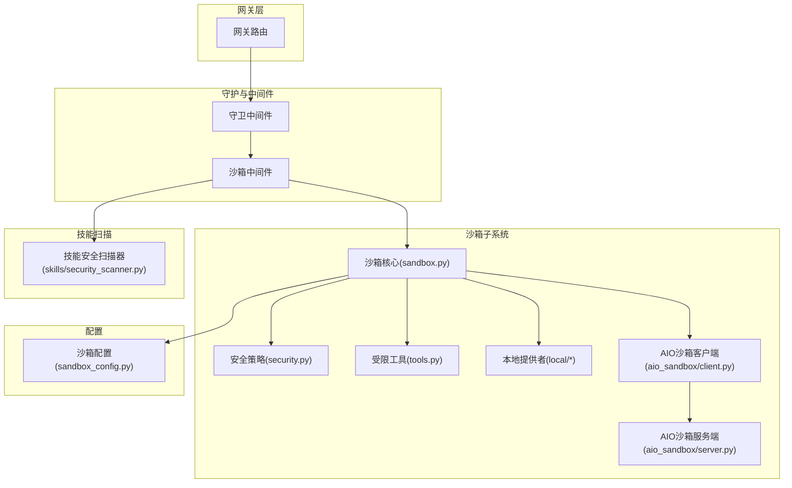
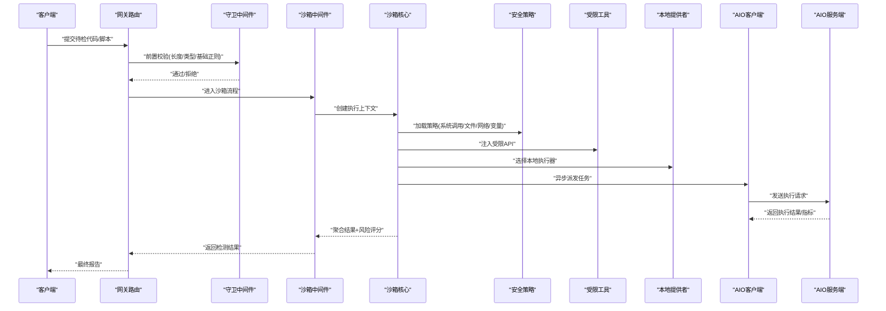
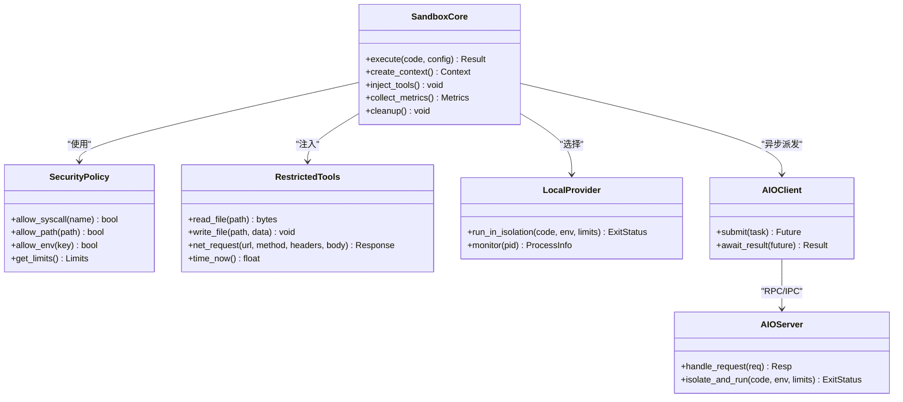
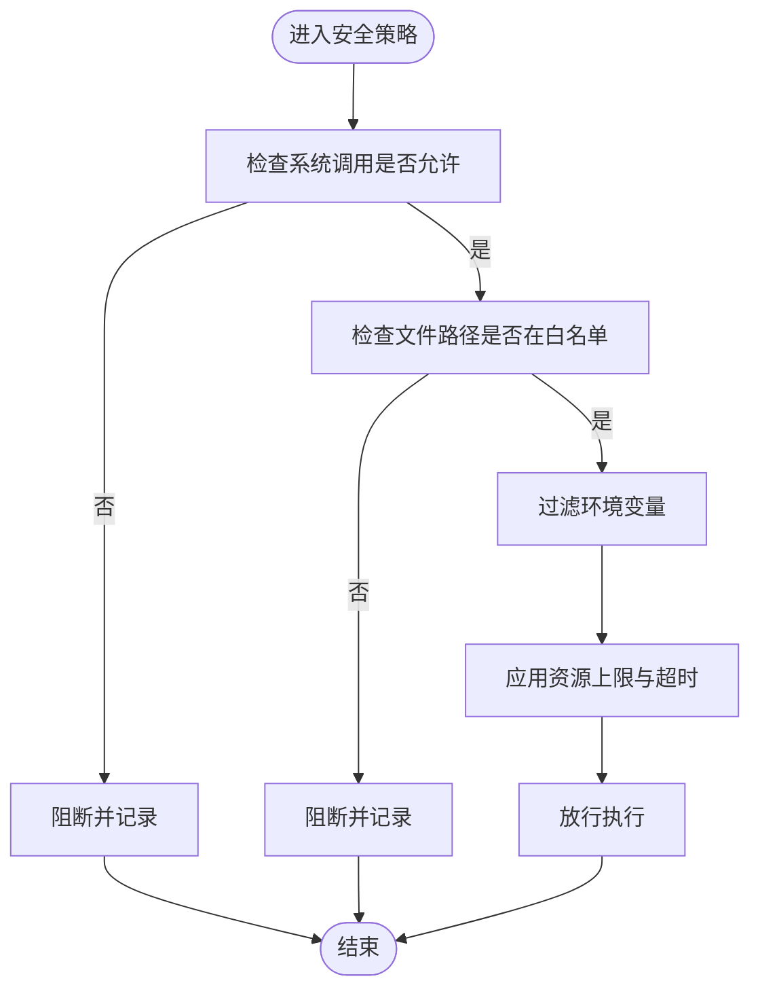
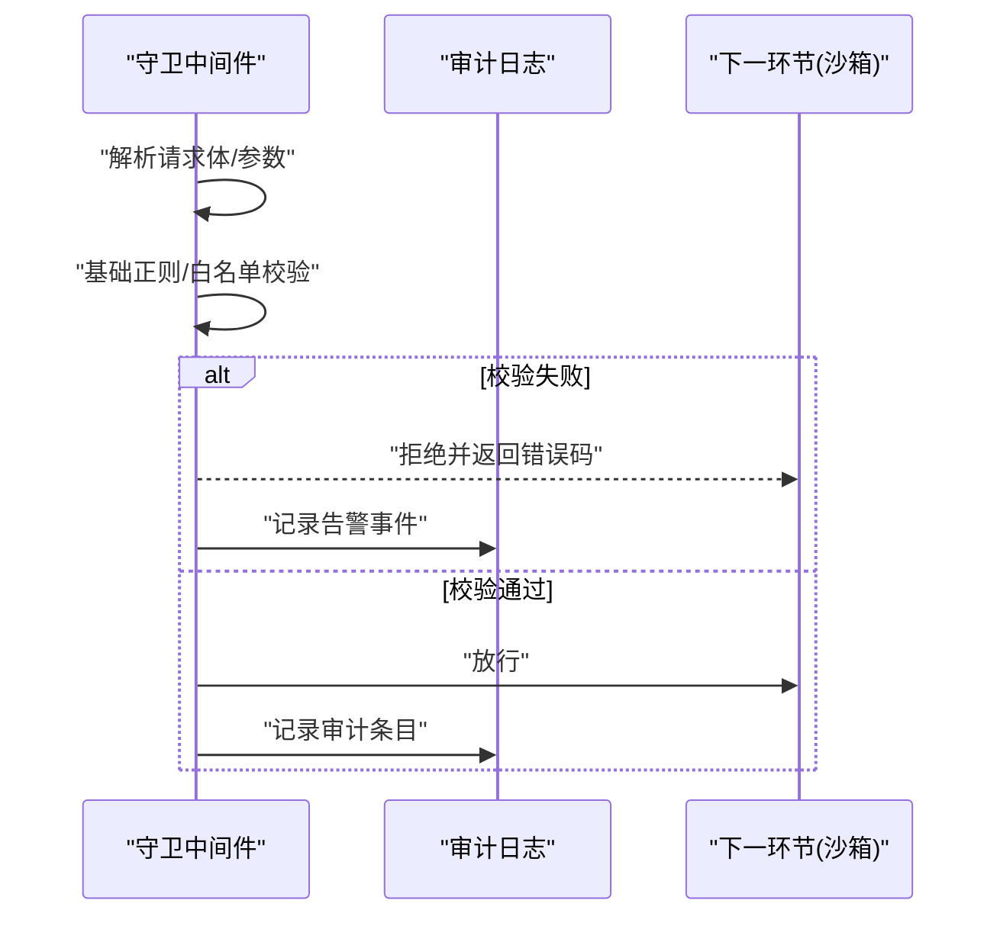
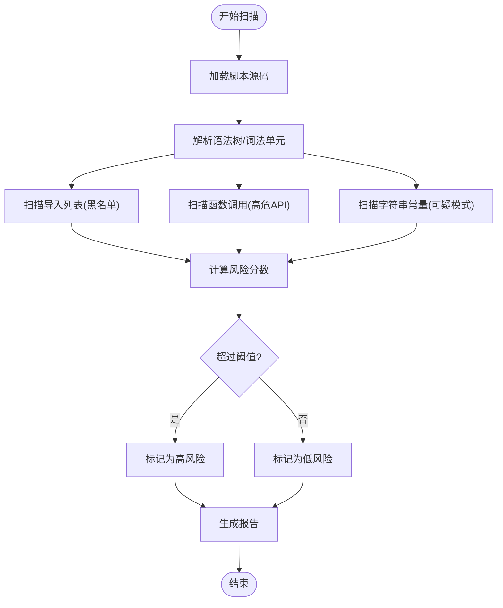
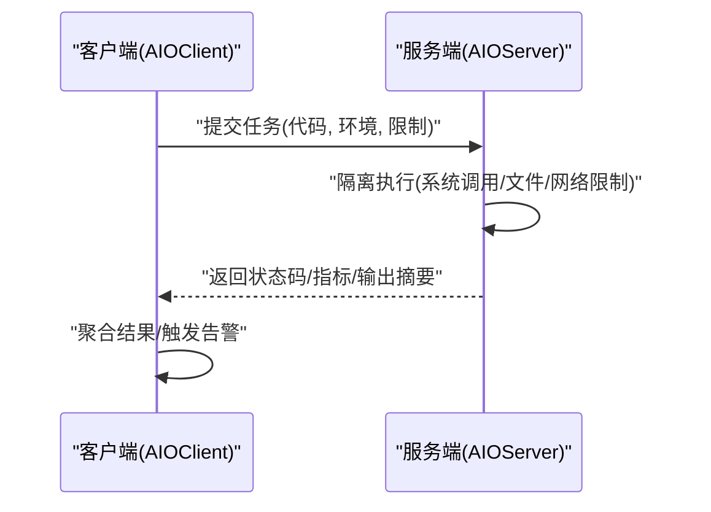
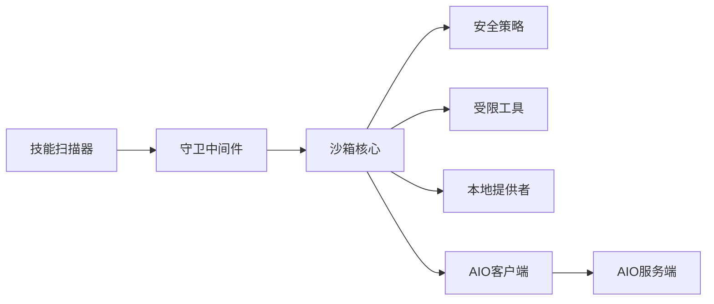

# 恶意代码识别

<cite>
**本文引用的文件**   
- [backend/app/harness/deerflow/sandbox/sandbox.py](file://backend/app/harness/deerflow/sandbox/sandbox.py)
- [backend/app/harness/deerflow/sandbox/security.py](file://backend/app/harness/deerflow/sandbox/security.py)
- [backend/app/harness/deerflow/sandbox/middleware.py](file://backend/app/harness/deerflow/sandbox/middleware.py)
- [backend/app/harness/deerflow/sandbox/exceptions.py](file://backend/app/harness/deerflow/sandbox/exceptions.py)
- [backend/app/harness/deerflow/sandbox/tools.py](file://backend/app/harness/deerflow/sandbox/tools.py)
- [backend/app/harness/deerflow/sandbox/file_operation_lock.py](file://backend/app/harness/deerflow/sandbox/file操作锁.py)
- [backend/app/harness/deerflow/sandbox/local/__init__.py](file://backend/app/harness/deerflow/sandbox/local/__init__.py)
- [backend/app/harness/deerflow/sandbox/local/provider.py](file://backend/app/harness/deerflow/sandbox/local/provider.py)
- [backend/app/harness/deerflow/community/aio_sandbox/client.py](file://backend/app/harness/deerflow/community/aio_sandbox/client.py)
- [backend/app/harness/deerflow/community/aio_sandbox/server.py](file://backend/app/harness/deerflow/community/aio_sandbox/server.py)
- [backend/app/harness/deerflow/config/sandbox_config.py](file://backend/app/harness/deerflow/config/sandbox_config.py)
- [backend/app/harness/deerflow/guardrails/builtin.py](file://backend/app/harness/deerflow/guardrails/builtin.py)
- [backend/app/harness/deerflow/guardrails/middleware.py](file://backend/app/harness/deerflow/guardrails/middleware.py)
- [backend/app/harness/deerflow/guardrails/provider.py](file://backend/app/harness/deerflow/guardrails/provider.py)
- [backend/app/harness/deerflow/skills/security_scanner.py](file://backend/app/harness/deerflow/skills/security_scanner.py)
- [backend/tests/test_security_scanner.py](file://backend/tests/test_security_scanner.py)
- [backend/tests/test_aio_sandbox.py](file://backend/tests/test_aio_sandbox.py)
- [backend/tests/test_docker_sandbox_mode_detection.py](file://backend/tests/test_docker_sandbox_mode_detection.py)
- [backend/tests/test_sandbox_tools_security.py](file://backend/tests/test_sandbox_tools_security.py)
- [backend/tests/test_sandbox_audit_middleware.py](file://backend/tests/test_sandbox_audit_middleware.py)
</cite>

## 目录
1. [简介](#简介)
2. [项目结构](#项目结构)
3. [核心组件](#核心组件)
4. [架构总览](#架构总览)
5. [详细组件分析](#详细组件分析)
6. [依赖分析](#依赖分析)
7. [性能考虑](#性能考虑)
8. [故障排查指南](#故障排查指南)
9. [结论](#结论)
10. [附录](#附录)

## 简介
本文件围绕 DeerFlow 在“恶意代码识别”方面的能力与实现进行系统化说明。内容覆盖：
- 已知恶意模式匹配：特征库、正则表达式、哈希比对等
- 启发式分析：代码相似度、行为异常、语义分析
- 沙箱执行测试：受控环境运行、行为观察、风险评估
- 恶意软件检测：签名匹配、行为特征、威胁情报集成
- 混淆代码检测：压缩识别、加密内容检测、反调试发现
- 样本管理：收集、分类存储、更新机制

需要特别说明的是，当前仓库中并未包含现成的“病毒签名库”或“外部威胁情报源”的内置实现；相关能力以“可扩展接口 + 安全中间件 + 沙箱隔离”的形式提供，便于后续接入第三方引擎或规则集。

## 项目结构
与恶意代码识别相关的核心代码集中在后端 harness 的沙箱与安全模块中，包括：
- 沙箱运行时与工具限制（进程隔离、文件系统访问控制、网络限制）
- 安全中间件与守卫（请求级校验、审计日志、策略拦截）
- 技能扫描器（用于对技能脚本进行静态安全检查）
- AIO 沙箱客户端与服务端（异步沙箱通信）
- 配置项（沙箱策略、超时、资源限制等）

图表来源
- [backend/app/harness/deerflow/sandbox/sandbox.py](file://backend/app/harness/deerflow/sandbox/sandbox.py)
- [backend/app/harness/deerflow/sandbox/security.py](file://backend/app/harness/deerflow/sandbox/security.py)
- [backend/app/harness/deerflow/sandbox/tools.py](file://backend/app/harness/deerflow/sandbox/tools.py)
- [backend/app/harness/deerflow/sandbox/local/__init__.py](file://backend/app/harness/deerflow/sandbox/local/__init__.py)
- [backend/app/harness/deerflow/sandbox/local/provider.py](file://backend/app/harness/deerflow/sandbox/local/provider.py)
- [backend/app/harness/deerflow/community/aio_sandbox/client.py](file://backend/app/harness/deerflow/community/aio_sandbox/client.py)
- [backend/app/harness/deerflow/community/aio_sandbox/server.py](file://backend/app/harness/deerflow/community/aio_sandbox/server.py)
- [backend/app/harness/deerflow/skills/security_scanner.py](file://backend/app/harness/deerflow/skills/security_scanner.py)
- [backend/app/harness/deerflow/config/sandbox_config.py](file://backend/app/harness/deerflow/config/sandbox_config.py)

章节来源
- [backend/app/harness/deerflow/sandbox/sandbox.py](file://backend/app/harness/deerflow/sandbox/sandbox.py)
- [backend/app/harness/deerflow/sandbox/security.py](file://backend/app/harness/deerflow/sandbox/security.py)
- [backend/app/harness/deerflow/sandbox/middleware.py](file://backend/app/harness/deerflow/sandbox/middleware.py)
- [backend/app/harness/deerflow/sandbox/tools.py](file://backend/app/harness/deerflow/sandbox/tools.py)
- [backend/app/harness/deerflow/sandbox/local/provider.py](file://backend/app/harness/deerflow/sandbox/local/provider.py)
- [backend/app/harness/deerflow/community/aio_sandbox/client.py](file://backend/app/harness/deerflow/community/aio_sandbox/client.py)
- [backend/app/harness/deerflow/community/aio_sandbox/server.py](file://backend/app/harness/deerflow/community/aio_sandbox/server.py)
- [backend/app/harness/deerflow/skills/security_scanner.py](file://backend/app/harness/deerflow/skills/security_scanner.py)
- [backend/app/harness/deerflow/config/sandbox_config.py](file://backend/app/harness/deerflow/config/sandbox_config.py)

## 核心组件
- 沙箱核心：负责创建、调度、监控受控执行环境，统一暴露执行接口并返回结果与元数据。
- 安全策略：定义系统调用白名单、文件路径白名单、环境变量过滤、资源上限等。
- 受限工具：为被检代码提供最小可用 API（如只读文件、受限网络、时间测量等），避免危险操作。
- 守卫中间件：在入口侧对输入进行快速校验（长度、类型、基础正则），并记录审计日志。
- 技能安全扫描器：对技能脚本进行静态检查（导入黑名单、可疑函数、编码异常等）。
- AIO 沙箱：通过独立进程/容器承载执行体，主进程仅做轻量编排与结果聚合。
- 配置中心：集中管理沙箱策略、超时、并发、存储路径等参数。

章节来源
- [backend/app/harness/deerflow/sandbox/sandbox.py](file://backend/app/harness/deerflow/sandbox/sandbox.py)
- [backend/app/harness/deerflow/sandbox/security.py](file://backend/app/harness/deerflow/sandbox/security.py)
- [backend/app/harness/deerflow/sandbox/middleware.py](file://backend/app/harness/deerflow/sandbox/middleware.py)
- [backend/app/harness/deerflow/sandbox/tools.py](file://backend/app/harness/deerflow/sandbox/tools.py)
- [backend/app/harness/deerflow/skills/security_scanner.py](file://backend/app/harness/deerflow/skills/security_scanner.py)
- [backend/app/harness/deerflow/community/aio_sandbox/client.py](file://backend/app/harness/deerflow/community/aio_sandbox/client.py)
- [backend/app/harness/deerflow/community/aio_sandbox/server.py](file://backend/app/harness/deerflow/community/aio_sandbox/server.py)
- [backend/app/harness/deerflow/config/sandbox_config.py](file://backend/app/harness/deerflow/config/sandbox_config.py)

## 架构总览
下图展示了从请求进入网关到沙箱执行、再到结果回传的完整链路，以及守卫与审计的介入点。

图表来源
- [backend/app/harness/deerflow/sandbox/sandbox.py](file://backend/app/harness/deerflow/sandbox/sandbox.py)
- [backend/app/harness/deerflow/sandbox/security.py](file://backend/app/harness/deerflow/sandbox/security.py)
- [backend/app/harness/deerflow/sandbox/tools.py](file://backend/app/harness/deerflow/sandbox/tools.py)
- [backend/app/harness/deerflow/sandbox/local/provider.py](file://backend/app/harness/deerflow/sandbox/local/provider.py)
- [backend/app/harness/deerflow/community/aio_sandbox/client.py](file://backend/app/harness/deerflow/community/aio_sandbox/client.py)
- [backend/app/harness/deerflow/community/aio_sandbox/server.py](file://backend/app/harness/deerflow/community/aio_sandbox/server.py)
- [backend/app/harness/deerflow/guardrails/middleware.py](file://backend/app/harness/deerflow/guardrails/middleware.py)

## 详细组件分析

### 沙箱核心与执行流
- 职责：封装执行生命周期（初始化、注入工具、启动子进程/容器、采集指标、回收资源）。
- 关键点：
  - 统一的执行接口，屏蔽底层差异（本地/容器/AIO）。
  - 与守卫中间件协作，完成前置校验与审计。
  - 将安全策略作为可插拔模块注入，支持动态调整。

图表来源
- [backend/app/harness/deerflow/sandbox/sandbox.py](file://backend/app/harness/deerflow/sandbox/sandbox.py)
- [backend/app/harness/deerflow/sandbox/security.py](file://backend/app/harness/deerflow/sandbox/security.py)
- [backend/app/harness/deerflow/sandbox/tools.py](file://backend/app/harness/deerflow/sandbox/tools.py)
- [backend/app/harness/deerflow/sandbox/local/provider.py](file://backend/app/harness/deerflow/sandbox/local/provider.py)
- [backend/app/harness/deerflow/community/aio_sandbox/client.py](file://backend/app/harness/deerflow/community/aio_sandbox/client.py)
- [backend/app/harness/deerflow/community/aio_sandbox/server.py](file://backend/app/harness/deerflow/community/aio_sandbox/server.py)

章节来源
- [backend/app/harness/deerflow/sandbox/sandbox.py](file://backend/app/harness/deerflow/sandbox/sandbox.py)
- [backend/app/harness/deerflow/sandbox/local/provider.py](file://backend/app/harness/deerflow/sandbox/local/provider.py)
- [backend/app/harness/deerflow/community/aio_sandbox/client.py](file://backend/app/harness/deerflow/community/aio_sandbox/client.py)
- [backend/app/harness/deerflow/community/aio_sandbox/server.py](file://backend/app/harness/deerflow/community/aio_sandbox/server.py)

### 安全策略与工具限制
- 安全策略：
  - 系统调用白名单：限制敏感 syscall。
  - 文件路径白名单：限定读写范围，防止越权访问。
  - 环境变量过滤：剔除敏感键值，避免泄露。
  - 资源上限：CPU、内存、I/O、网络带宽、超时。
- 受限工具：
  - 提供最小化 API，屏蔽危险操作（如直接 exec、任意端口监听等）。
  - 输出裁剪与速率限制，防止信息泄露与资源耗尽。

图表来源
- [backend/app/harness/deerflow/sandbox/security.py](file://backend/app/harness/deerflow/sandbox/security.py)
- [backend/app/harness/deerflow/sandbox/tools.py](file://backend/app/harness/deerflow/sandbox/tools.py)

章节来源
- [backend/app/harness/deerflow/sandbox/security.py](file://backend/app/harness/deerflow/sandbox/security.py)
- [backend/app/harness/deerflow/sandbox/tools.py](file://backend/app/harness/deerflow/sandbox/tools.py)

### 守卫中间件与审计
- 守卫中间件：
  - 前置校验：长度、类型、基础正则（如禁止明显 shell 注入片段）。
  - 审计日志：记录请求指纹、命中规则、处置动作。
- 与沙箱中间件协作，形成“先验 + 后验”的双重防护。

图表来源
- [backend/app/harness/deerflow/guardrails/middleware.py](file://backend/app/harness/deerflow/guardrails/middleware.py)
- [backend/app/harness/deerflow/guardrails/builtin.py](file://backend/app/harness/deerflow/guardrails/builtin.py)
- [backend/app/harness/deerflow/guardrails/provider.py](file://backend/app/harness/deerflow/guardrails/provider.py)

章节来源
- [backend/app/harness/deerflow/guardrails/middleware.py](file://backend/app/harness/deerflow/guardrails/middleware.py)
- [backend/app/harness/deerflow/guardrails/builtin.py](file://backend/app/harness/deerflow/guardrails/builtin.py)
- [backend/app/harness/deerflow/guardrails/provider.py](file://backend/app/harness/deerflow/guardrails/provider.py)

### 技能安全扫描器（静态检查）
- 目标：对技能脚本进行静态分析，提前发现高风险模式。
- 典型检查项：
  - 导入黑名单（如危险模块）
  - 可疑函数/关键字组合
  - 编码异常与潜在混淆迹象
  - 文件 I/O 与网络请求的静态定位
- 输出：风险等级与建议处置（放行/人工复核/阻断）。

图表来源
- [backend/app/harness/deerflow/skills/security_scanner.py](file://backend/app/harness/deerflow/skills/security_scanner.py)

章节来源
- [backend/app/harness/deerflow/skills/security_scanner.py](file://backend/app/harness/deerflow/skills/security_scanner.py)
- [backend/tests/test_security_scanner.py](file://backend/tests/test_security_scanner.py)

### AIO 沙箱客户端与服务端（异步执行）
- 客户端：负责序列化任务、分发、等待结果、重试与超时处理。
- 服务端：在隔离环境中执行代码，采集指标并返回结构化结果。
- 适用场景：高并发、长耗时任务的并行执行与资源隔离。

图表来源
- [backend/app/harness/deerflow/community/aio_sandbox/client.py](file://backend/app/harness/deerflow/community/aio_sandbox/client.py)
- [backend/app/harness/deerflow/community/aio_sandbox/server.py](file://backend/app/harness/deerflow/community/aio_sandbox/server.py)

章节来源
- [backend/app/harness/deerflow/community/aio_sandbox/client.py](file://backend/app/harness/deerflow/community/aio_sandbox/client.py)
- [backend/app/harness/deerflow/community/aio_sandbox/server.py](file://backend/app/harness/deerflow/community/aio_sandbox/server.py)
- [backend/tests/test_aio_sandbox.py](file://backend/tests/test_aio_sandbox.py)

### 配置与策略管理
- 沙箱配置：集中管理执行策略、超时、并发度、存储路径、网络策略等。
- 守卫配置：守卫规则、正则库、黑白名单、审计级别。
- 扩展点：支持热重载与多环境差异化配置。

章节来源
- [backend/app/harness/deerflow/config/sandbox_config.py](file://backend/app/harness/deerflow/config/sandbox_config.py)

## 依赖分析
- 组件耦合：
  - 沙箱核心依赖安全策略与受限工具，低耦合、高内聚。
  - AIO 客户端与服务端通过明确接口通信，便于替换底层实现。
  - 守卫中间件与沙箱中间件分层清晰，职责单一。
- 外部依赖：
  - 当前未内置病毒签名库或威胁情报源，可通过扩展点接入。
  - 文件系统与进程隔离由操作系统/容器提供。

图表来源
- [backend/app/harness/deerflow/sandbox/sandbox.py](file://backend/app/harness/deerflow/sandbox/sandbox.py)
- [backend/app/harness/deerflow/sandbox/security.py](file://backend/app/harness/deerflow/sandbox/security.py)
- [backend/app/harness/deerflow/sandbox/tools.py](file://backend/app/harness/deerflow/sandbox/tools.py)
- [backend/app/harness/deerflow/sandbox/local/provider.py](file://backend/app/harness/deerflow/sandbox/local/provider.py)
- [backend/app/harness/deerflow/community/aio_sandbox/client.py](file://backend/app/harness/deerflow/community/aio_sandbox/client.py)
- [backend/app/harness/deerflow/community/aio_sandbox/server.py](file://backend/app/harness/deerflow/community/aio_sandbox/server.py)
- [backend/app/harness/deerflow/guardrails/middleware.py](file://backend/app/harness/deerflow/guardrails/middleware.py)
- [backend/app/harness/deerflow/skills/security_scanner.py](file://backend/app/harness/deerflow/skills/security_scanner.py)

章节来源
- [backend/app/harness/deerflow/sandbox/sandbox.py](file://backend/app/harness/deerflow/sandbox/sandbox.py)
- [backend/app/harness/deerflow/sandbox/security.py](file://backend/app/harness/deerflow/sandbox/security.py)
- [backend/app/harness/deerflow/sandbox/tools.py](file://backend/app/harness/deerflow/sandbox/tools.py)
- [backend/app/harness/deerflow/sandbox/local/provider.py](file://backend/app/harness/deerflow/sandbox/local/provider.py)
- [backend/app/harness/deerflow/community/aio_sandbox/client.py](file://backend/app/harness/deerflow/community/aio_sandbox/client.py)
- [backend/app/harness/deerflow/community/aio_sandbox/server.py](file://backend/app/harness/deerflow/community/aio_sandbox/server.py)
- [backend/app/harness/deerflow/guardrails/middleware.py](file://backend/app/harness/deerflow/guardrails/middleware.py)
- [backend/app/harness/deerflow/skills/security_scanner.py](file://backend/app/harness/deerflow/skills/security_scanner.py)

## 性能考虑
- 并发与隔离：
  - 使用 AIO 沙箱提升吞吐，结合进程/容器隔离保证稳定性。
  - 合理设置超时与资源上限，避免雪崩。
- 缓存与复用：
  - 对重复脚本进行指纹去重，减少重复执行。
  - 对静态检查结果进行缓存，降低扫描开销。
- 输出裁剪：
  - 对大输出进行截断与摘要，降低网络与存储压力。

[本节为通用指导，不直接分析具体文件]

## 故障排查指南
- 常见异常与定位：
  - 执行超时/资源超限：检查沙箱配置与策略上限。
  - 文件访问被拒：核对路径白名单与挂载卷。
  - 网络请求失败：确认网络策略与代理配置。
  - 守卫拦截：查看守卫规则与审计日志，定位命中规则。
- 关键日志与测试用例：
  - 沙箱审计中间件测试：验证审计链路完整性。
  - Docker 沙箱模式检测：确认隔离模式正确启用。
  - 沙箱工具安全性测试：确保受限工具未被绕过。

章节来源
- [backend/app/harness/deerflow/sandbox/exceptions.py](file://backend/app/harness/deerflow/sandbox/exceptions.py)
- [backend/tests/test_sandbox_audit_middleware.py](file://backend/tests/test_sandbox_audit_middleware.py)
- [backend/tests/test_docker_sandbox_mode_detection.py](file://backend/tests/test_docker_sandbox_mode_detection.py)
- [backend/tests/test_sandbox_tools_security.py](file://backend/tests/test_sandbox_tools_security.py)

## 结论
DeerFlow 在恶意代码识别方面提供了“静态扫描 + 动态沙箱 + 守卫中间件”的多层防护体系。当前版本聚焦于可控执行环境与基础安全策略，具备良好扩展性，便于后续接入病毒签名库、威胁情报与更丰富的启发式规则。建议在生产环境中：
- 完善守卫规则与审计策略
- 引入外部签名与情报源
- 建立样本管理与版本化更新机制
- 持续优化性能与误报率

[本节为总结性内容，不直接分析具体文件]

## 附录

### 已知恶意模式匹配（实现现状与建议）
- 现状：
  - 守卫中间件支持基础正则与黑白名单，可用于快速拦截常见恶意片段。
  - 技能安全扫描器可进行静态导入/调用/字符串扫描。
- 建议扩展：
  - 构建正则表达式模式库（按语言/框架/攻击面组织）。
  - 引入哈希比对（MD5/SHA1/SHA256）与指纹库，对接外部签名库。
  - 增加 AST 级别的语义规则与相似度度量（n-gram/TF-IDF/向量相似度）。

章节来源
- [backend/app/harness/deerflow/guardrails/middleware.py](file://backend/app/harness/deerflow/guardrails/middleware.py)
- [backend/app/harness/deerflow/guardrails/builtin.py](file://backend/app/harness/deerflow/guardrails/builtin.py)
- [backend/app/harness/deerflow/skills/security_scanner.py](file://backend/app/harness/deerflow/skills/security_scanner.py)

### 启发式分析技术（实现现状与建议）
- 现状：
  - 静态扫描器已具备基础规则与风险评分。
- 建议扩展：
  - 代码相似度检测：基于抽象语法树或字节码指纹。
  - 行为异常识别：在沙箱中统计系统调用序列、文件/网络行为基线偏离。
  - 语义分析：结合 LLM 或规则引擎对意图进行判定。

章节来源
- [backend/app/harness/deerflow/skills/security_scanner.py](file://backend/app/harness/deerflow/skills/security_scanner.py)
- [backend/app/harness/deerflow/sandbox/security.py](file://backend/app/harness/deerflow/sandbox/security.py)

### 沙箱执行测试（实现现状与建议）
- 现状：
  - 沙箱核心与 AIO 客户端/服务端提供受控执行与指标采集。
  - 本地提供者与 Docker 模式检测保障隔离。
- 建议扩展：
  - 增强行为观测（系统调用追踪、网络抓包、文件变更快照）。
  - 自动化风险评估模型（基于历史样本训练）。

章节来源
- [backend/app/harness/deerflow/sandbox/sandbox.py](file://backend/app/harness/deerflow/sandbox/sandbox.py)
- [backend/app/harness/deerflow/community/aio_sandbox/client.py](file://backend/app/harness/deerflow/community/aio_sandbox/client.py)
- [backend/app/harness/deerflow/community/aio_sandbox/server.py](file://backend/app/harness/deerflow/community/aio_sandbox/server.py)
- [backend/tests/test_docker_sandbox_mode_detection.py](file://backend/tests/test_docker_sandbox_mode_detection.py)

### 恶意软件检测（实现现状与建议）
- 现状：
  - 未内置病毒签名库与威胁情报源。
- 建议扩展：
  - 接入 YARA/ClamAV 等签名引擎。
  - 集成威胁情报 API（如 VirusTotal、微步在线）。
  - 行为特征分析（沙箱轨迹聚类、异常评分）。

[本节为通用指导，不直接分析具体文件]

### 混淆代码检测（实现现状与建议）
- 现状：
  - 静态扫描器可对编码异常与可疑字符串进行初步筛查。
- 建议扩展：
  - 压缩识别（zlib/base64/自定义协议）。
  - 加密内容检测（熵值分析、密文特征）。
  - 反调试发现（调试器探测、时序异常、环境伪装）。

章节来源
- [backend/app/harness/deerflow/skills/security_scanner.py](file://backend/app/harness/deerflow/skills/security_scanner.py)

### 恶意代码样本管理（实现现状与建议）
- 现状：
  - 未见专门的样本库与版本化管理模块。
- 建议扩展：
  - 样本收集：统一入口、去重、元数据标注。
  - 分类存储：按家族/语言/危害等级组织。
  - 更新机制：增量更新、灰度发布、回滚策略。

[本节为通用指导，不直接分析具体文件]